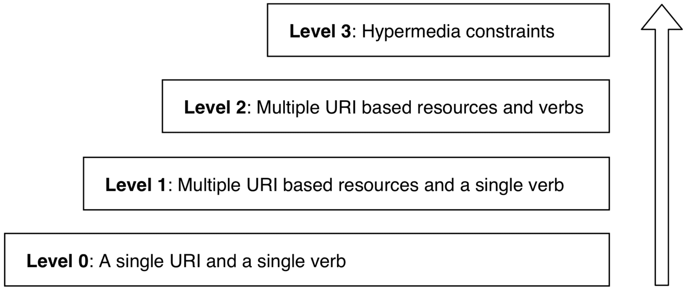
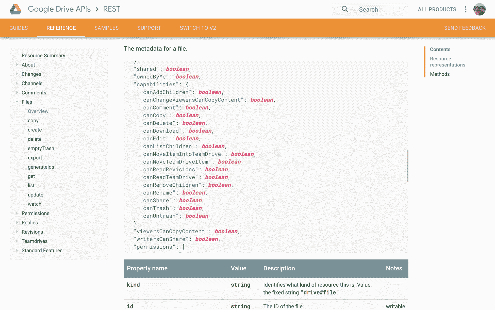

# 七、RESTful API 设计——前端和后端之间的构建语言

API 是 API 提供者和 API 消费者之间的契约。REST 是最流行的 API 风格之一，主要是因为它简单易用，易于理解。术语 **REST** 代表**具象状态转移**，这是 Roy T. Fielding 在 2000 年的论文中定义的一种架构风格。

尽管在写这本书的时候 REST 已经存在了 18 年，但是对于什么是 RESTful API 仍然存在误解。根据 Roy T. Fielding 的说法，许多自称 RESTful 的 API 并不是真正 RESTful 的。甚至有人认为 RESTful 只是 HTTP 上的 JSON。多年来，围绕着 **HATEOAS** (作为应用状态引擎的**超媒体的简称)一直有争论。在本章中，我们将深入讨论这些主题，因此您将了解以下内容:**

*   RESTful API 特征
*   RESTful API 设计过程
*   Spring MVC 中 RESTful API 的实现
*   RESTful API 消费
*   RESTful API 测试

# RESTful API 特征

遵循 REST 架构约束的 Web 服务 API 被称为 RESTful APIs。在我们谈论 RESTful APIs 的特征之前，让我们先来看看 Roy T. Fielding 在他的论文中介绍的 REST 架构风格的架构约束。这将有助于我们理解什么是真正的休息。

# REST 架构约束

在他的论文中，Roy T. Fielding 列出了 RESTful 系统必须遵守的以下架构约束。

# 客户端-服务器

这个约束是关于关注点的分离。在客户机-服务器体系结构风格中，用户界面问题与数据存储问题是分开的。Web 应用自然适合这种风格，前端作为客户端驻留在浏览器中，然后通过 API 与服务器对话。

另一种众所周知的架构风格是基于事件的集成架构，在这种架构中，系统的组件通过网络广播事件，同时监听它们感兴趣的事件。

# 无国籍的

客户端和服务器之间的通信是无状态的。从客户机到服务器的每个请求都包含理解该请求所需的关于服务器的所有信息。服务器不应该利用任何存储的上下文来完全理解请求。

这个约束的一个常见问题是——在服务器端为经过身份验证的请求存储会话 id 的系统应该被称为 RESTful 吗？我们应该改变它，使这样的系统 RESTful 吗？我们将在本章的后面讨论这一点。

# 躲藏

这个约束与系统的性能有关，其中对请求的响应数据必须隐式或显式地标记为可缓存或不可缓存。对于 web 应用，我们可以在响应中使用 HTTP 头，如`Cache-Control`、`ETag`和`Expires`来控制缓存。

# 统一界面

这个约束是将 REST 架构风格与其他风格(如 SOAP)区分开来的核心特性。有了统一的接口，整个系统架构得到了简化，交互的可见性得到了提高。为了获得统一的接口，有四个接口约束，包括资源的标识、通过表示对资源的操作、自描述消息和作为应用状态引擎的超媒体。我们将在后面详细讨论这些约束。

# 分层系统

正如我们在[第 6 章](06.html)、*代码设计——为稳定性和可扩展性而设计*中提到的，分层架构也是关注点的分离。在分层系统中，通过约束组件行为，架构由分层的层组成，这样每个组件就不能*看到与它们交互的直接层之外的*。

# 按需编码(可选)

这个约束在 REST 架构风格中是可选的。根据 Roy T. Fielding 的说法，REST 允许通过下载和执行小程序或脚本形式的代码来扩展客户端功能。这通过减少需要预先实现的功能数量来简化客户端。实际上，没有多少 RESTful APIs 允许在运行时下载和执行代码。

只要系统遵守前面的约束，它就可以被认为是 RESTful 的。虽然大多数 RESTful APIs 都是基于 HTTP 构建的，但 HTTP 并不是使系统成为 RESTful 的必要条件，这主要是因为 HTTP 作为一种开放标准，并没有将 API 的实现或其客户端的实现绑定到特定的技术上。熟悉 HTTP 的开发人员可以很容易地掌握 RESTful API。

# RESTful 接口约束

前面提到的架构约束是高层次的。其他类型的 API 也有这些限制。RESTful API 与其他 API 的区别在于统一接口，主要是前面提到的四个接口约束。下面就一个一个详细说说吧。

# 资源的标识

在 REST 中，资源是信息的关键抽象，因此服务可以将它们提供给其客户端。本质上，资源可以是任何东西——用户、文档、图像，甚至是操作。资源必须可以通过 URIs 唯一识别。例如，下面的 URI 唯一地标识了一个 ID 为`1`的任务:

```java
https://api.example.com/v1/tasks/1
```

如您所见，在这个 URI 中，我们在 URI 中添加了版本号`v1`。有些人认为将版本信息放在资源 URI 中是一种不好的做法。他们更喜欢将它添加到 HTTP 请求头中。其他人认为在构建 RESTful API 时，使用版本控制本身并不是正确的做法。比如罗伊·t·菲尔丁(Roy T. Fielding)在推特上提到了以下内容([https://mobile . Twitter . com/Fielding/status/376835835670167552](https://twitter.com/fielding/status/376835835670167552)):

做一个真正的 REST API 的原因是为了获得可演化性……一个“v1”对你的 API 客户来说是中指，表示 RPC/HTTP(不是 REST)。

那么，版本控制真的那么糟糕吗？我们稍后将详细讨论这一点。

# 通过表示操纵资源

我们前面提到过，资源是信息的抽象。它有一个状态，通过它的表示来描述，可以有不同的格式，比如 XML、HTML 和 JSON。如今，JSON 是最流行的资源表示格式。

在 REST 中，对资源的操作是通过使用标准 HTTP 方法将一个表示发送回服务器来完成的。最常见的方法有`GET`、`POST`、`PUT`、`PATCH`、`DELETE`。我们将在后面详细讨论它们。

# 自我描述的消息

自描述性消息是包含接收者理解它所需的所有信息的消息。由于是自描述的，请求可以单独处理，客户机和服务器之间的交互可以是无状态的。处理自描述消息的服务器不需要记住它是如何处理先前的请求的。

# 作为应用状态引擎的超媒体

这种约束通常被称为 HATEOAS 或**超媒体约束**。在罗伊·t·菲尔丁的论文中，没有对这种约束的详细解释。维基百科中的以下定义提供了一个很好的定义:

访问了 REST 应用的初始 URI 之后——类似于 web 用户访问网站的主页——REST 客户机应该能够动态地使用服务器提供的链接来发现它需要的所有可用操作和资源。随着访问的进行，服务器会以包含指向当前可用的其他操作的超链接的文本进行响应。客户端不需要硬编码 REST 服务的结构或动态信息。

这种约束也被称为超文本驱动，根据 Roy T. Fielding 的说法，*REST API 必须是超文本驱动的*([http://Roy . gbiv . com/untangled/2008/REST-APIs-must-be-hypertext-driven](http://roy.gbiv.com/untangled/2008/rest-apis-must-be-hypertext-driven))。否则，一个 API 不能是 RESTful 的，也不能被称为 REST API。这引发了很多关于 HATEOAS 是否有用或实用的争论。这个我们后面会详细讲。

这些都是 REST 的限制。如您所见，REST 是一种定义了几个约束的架构风格。它不是你应该如何设计你的 API 的标准，也没有指定任何实现细节。您可以使用您喜欢的编程语言来构建 RESTful APIs。

# 固执己见的 RESTful API

如前所述，在写这本书的时候，REST 已经 18 岁了，业界已经有了很多关于它的讨论和争论。这些争论的焦点是 HATEOAS。有拥护者，也有怀疑者。有些人甚至用了一个强烈的词——憎恨者。在本节中，我们将深入讨论 HATEOAS 的两个方面。

# 理查森成熟度模型

2008 年，Leonard Richardson 在审查了一百种不同的 web 服务设计后，开发了一个模型来描述服务在 REST 合规性方面的成熟度级别。在他的模型中有三个因素——URI、HTTP 方法和超媒体约束(HATEOAS)。一个服务越是使用这些技术，它就越被认为是成熟的:



图 7.1:理查森成熟度模型

# 零级

这个级别的服务有一个 URI 和一个 HTTP 动词，通常是一个 HTTP `POST`方法。所有的消息交换都是通过使用 HTTP 方法的 URI 进行的。例如，大多数基于 **Web 服务** ( **WS-*** )的服务使用单个 URI 作为端点，并使用 HTTP `POST`方法传输基于 SOAP 的有效负载，即使这是一个读取操作。另一个例子是基于 XML-RPC 的服务。

# 一级

这个级别的服务为每个资源使用一个唯一的 URI，但是只有一个 HTTP 动词，大多数时候是一个 HTTP `POST`方法。这方面的一个例子是 Flickr 的 web 服务([https://www.flickr.com/services/api/request.rest.html](https://www.flickr.com/services/api/request.rest.html))，这是一个流行的 API。尽管这些服务中有许多声称是 RESTful 的，但事实并非如此。

# 第二层

这一层的服务提供了大量 URI 可寻址的资源，并支持通过不同的 HTTP 方法操作公开的资源，包括`GET`、`POST`、`PUT`、`PATCH`和`DELETE`。亚马逊的文件托管服务 S3 就是一个很好的例子。

# 第三层

这一级别的服务使用不同的 HTTP 动词和最重要的超媒体约束，提供多种基于 URI 的资源和操作。根据 Roy T. Fielding 的说法，真正 RESTful 的 API 是由超文本驱动的 API([http://Roy . gbiv . com/untangled/2008/rest-APIs-must-be-hypertext-driven](http://roy.gbiv.com/untangled/2008/rest-apis-must-be-hypertext-driven))，这样做是为了遵循超媒体约束。PayPal 的 RESTful API(【https://developer.paypal.com/docs/api/overview/】T2)就是一个很好的例子。

Richardson 成熟度模型提供了一种思考 RESTful APIs 基本思想的好方法。大多数 RESTful APIs 属于第二级，主要是因为真正 RESTful 的好处不值得实现超媒体约束的开销。或者人们并不真正认同 HATEOAS 带来的好处。有时，人们称三级服务为纯粹宁静的服务，称二级服务为实用宁静的服务，称二级服务为 T2 服务。

# 到底是不是？

关于术语 REST，和许多软件术语一样，有许多定义。既然罗伊·t·菲尔丁创造了这个词，他的定义应该比其他人更有分量。然而，RESTful 不应该被视为一种宗教事物，作为二级服务并不意味着你的 API 不如三级服务。您是否应该实现 HATEOAS 取决于您的 API 的性质以及是否值得努力。

# 什么是 HATEOAS？

在我们进一步讨论它之前，让我们看一个 HATEAOS 用法的流行例子，它是通过一个 RESTful API 买一杯咖啡，如下所示:

```java
POST https://api.examplebucks.org/orders HTTP/1.1
Content-Type: application/json
Content-Length: 33

{"drink": "latte", "quantity": 1}
```

这是一个`POST`请求，已经被发送来点一杯拿铁。在其响应中，服务器提供有关客户端下一步可以做什么的信息，如以下代码所示:

```java
{
  "id": 12345,
  "drink": "latte",
  "quantity": 1,
  "cost": "5",
  "status": "pending",
  "_links": {
    "self": {
      "href": "https://api.examplebucks.org/orders/12345",
      "type": "GET"
    },
    "payment": {
      "href": "https://api.examplebucks.org/payments/12345",
      "type": "PUT"
    },
    "update": {
      "href": "https://api.examplebucks.org/orders/12345",
      "type": "PUT"
    },
    "cancel": {
      "href": "https://api.examplebucks.org/orders/12345",
      "type": "DELETE"
    }
  }
}
```

正如您所看到的，在响应中，`_links`属性是一个遵循 HAL 约定的超文本，包含了客户端可以执行的操作。在这个`_links`对象中，关系的每个关键标准以及该关系的`href`属性是资源的 URI，而`type`属性是应该在该资源上执行的 HTTP 方法。在这个例子中，服务器提供操作，包括`making a payment`、`updating the order`和`canceling the order`。参照订单资源本身需要`self`关系。

以下内容来自罗伊·t·菲尔丁:

超文本通常不会告诉你任何给定资源上允许的所有操作；它会告诉您对每个潜在的转换使用哪个操作。客户端(用户或代理)必须决定采用什么转换，而不是使用什么接口。

因此，如果客户需要更新订单，它可以通过`_links`超文本找到`update`操作。当客户需要取消订单时，它可以在超文本中找到`cancel`操作，并向该操作中指定的 URI 发送一个`DELETE`请求。

此外，使用`_links`超文本，API 开发者可以在不破坏客户端的情况下改变资源的 URI，因为超文本将客户端从资源的 URIs 中分离出来。客户不再需要硬编码 URIs。他们需要理解的只是在`_links`超文本中返回的每个操作的含义。当您无法控制 API 的客户端时，这一点非常重要。例如，当您构建公开可用的 API 时，如 Twitter 的，您将无法控制大多数客户端——并且当您想要修复资源 URI 中的拼写错误时，您肯定不希望破坏它们。根据 HATEOAS 倡导者的说法，另一个好处是你的 API 变得更加自我描述，客户不必经常查阅文档。他们可以简单地检查 API 响应中的超文本，以便在 RESTful APIs 中导航，使 API 可以被发现。

这是 HATEOAS 的基本思想。如前所述，Roy T. Fielding 坚持认为*REST API 必须是超文本驱动的*。

# 为什么你不需要帽子？

实际上，通常情况下，你可能不需要 HATEOAS。原因如下:

*   首先，实现和维护 HATEOAS 需要服务器端和客户端的共同努力。服务器端需要根据资源的状态构建超文本，而客户端需要解析超文本并理解超文本的含义以执行正确的操作。与没有 HATEOAS 的 API 相比，你在客户端需要做的是对资源的 URIs 进行硬编码，并根据资源的表示决定哪些操作可用。例如，在我们订购咖啡的例子中，您可以根据订单的 status 字段的值找出`make a payment`、`update the order`和`cancel the order`中的哪些操作是可用的。这样，您就避免了 HATEOAS 在服务器端引入的开销和在客户端对超文本的解析。
*   其次，通过采用 HATEOAS 将客户端与资源的 URIs 解耦的好处并不是无懈可击的。客户仍然需要知道超文本的含义来找出可以执行的操作。在客户机和超文本之间仍然存在耦合，例如，在前面更新订单的示例标准中的`update`操作。在客户端，`_links.update`用于查找该操作的 URI 的位置。它不是`_links.edit`也不是`_links.modify`。这个`update`操作是一个简单的例子，也是一个通用术语。对于特定操作有独特术语的应用，客户端需要绑定这些术语。与 URIs 类似，这些条款也可能发生变化。唯一的区别是，它们可能不像 URIs 那样经常更换。但是，这并不意味着 HATEOAS 允许你独立地开发你的 API 而不会对客户端造成任何影响。你仍然需要投入大量的精力来确保你所使用的术语是可扩展的。由于大多数时候对 API 的更改是不可避免的，我们应该想出一个 API 更改策略来管理这些更改。这就是为什么 PayPal 的 API 也支持版本控制。目前，他们在第 3 版。即使是 NPR 的 API，作为一个例子来说明 API 不需要版本控制，现在也在它的 API URIs([https://dev.npr.org/api/](https://dev.npr.org/api/))中增加了版本号。
*   第三，超文本通过 API 的响应提供的 API 自描述性是部分的。也就是说，您仍然需要检查其他文档，以找到超文本中列出的所有操作信息。例如，对于`make a payment`和`update a payment`操作，您需要知道可以发送给服务器的表示，也就是说，这些 API 接受什么输入参数，因为这些信息不会在超文本中显示。因此，对于 API 客户端的开发人员来说，他们需要检查两个地方来将这种 API 的所有部分放在一起，这对于开发人员来说是不友好的，使得 API 不容易使用。一种对开发人员更友好的方式是拥有一个 API 文档，提供开发人员需要了解的关于 API 的所有信息。一个更令人愉快的方法是有一个游乐场，这样开发人员可以尝试一下，看看 API 是如何工作的。
*   第四，超文本可以绕过。开发人员仍然可以使用老的 URI 构造方式来标识资源，忽略 API 响应中的超文本。减少 API 误用的一种方法是为不同的编程语言提供客户端库。例如，Google Drive 的 API 提供了客户端库([https://developers.google.com/drive/api/v3/downloads](https://developers.google.com/drive/api/v3/downloads))，尽管它似乎没有使用超文本，仍然被称为 RESTful。正如您在下面的屏幕截图中看到的，在文件资源的表示中，`capabilities`用于指示客户端可以对该文件做什么:



图 7.2:Google Drive API

综上所述，HATEOAS 应该用在能够真正帮助 API 客户端开发人员的地方。例如，下面是来自 API 的响应，它可以检索所有已经支付的订单。它支持分页:

```java
{
  "items": [{...}],
  "paging": {
    "previous": 
      "https://api.examplebucks.org/orders?
       page=1&count=20&status=paid",
        "next": 
      "https://api.examplebucks.org/orders?
       page=3&count=20&status=paid",
    "hasMore": true
  }
}
```

正如您所看到的，通过添加上一页和下一页的 URIs，API 客户端的开发人员可以轻松浏览所有页面，而无需构建 URIs，这对于记住需要添加到 URI 的所有查询参数特别有用。

# 固执己见的 RESTful API 特征

在这一节中，我们将讨论固执己见的 RESTful APIs 的特征，这些 API 采用了 Roy T. Fielding 的 REST 论文中在实践中非常有效的部分。

# 以资源为中心

API 应该围绕资源来组织。如前所述，资源是信息的关键抽象，因此服务使它们对其客户端可用。资源的内部结构不应该通过 API 泄漏。例如，订单的细节可能单独存储在关系数据库中，因此我们不应该创建多个资源来反映内部结构。API 应该关注业务实体，并使用资源作为抽象来隐藏实现细节，从而使 API 实现可以发展。

# 可通过 URIs 识别

资源应该可以通过 URIs 来识别，它应该基于名词而不是动词。标识资源集合的 URIs 应该使用复数。以下是一些例子:

*   **订单集合** : `https://api.examplebucks.org/v1/orders`
*   **编号为 1234** 的订单:`https://api.examplebucks.org/v1/orders/1234`
*   **用户集合** : `https://api.examplebucks.org/v1/users`
*   **ID 为 567** 的用户:`https://api.examplebucks.org/v1/users/567`

# 通过 HTTP 方法定义操作

可以在资源上执行的操作应该通过 HTTP 方法来定义。以下是 RESTful API 中使用的常用方法:

*   **GET 方法**:一个`GET`方法在指定的 URI 检索资源的表示。API 的响应包含所请求资源的详细信息。这个方法应该作为一个安全操作来实现，这意味着在资源上执行一个`GET`操作不应该对任何东西的状态产生任何副作用。它可以被多次调用，并且该操作的响应可以被缓存。
*   **POST 方法**:一个`POST`方法在指定的 URI 创建一个新的资源。资源的标识符由服务器生成。API 的响应包含新资源的详细信息。一个`POST`方法是不安全的操作，意味着它有副作用。多个`POST`请求将在服务器端创建不同的资源。`POST`请求也可用于执行除创建新资源之外的操作，例如，在 TaskAgile 应用中移动卡片。当我们实现这个特性时，我们将看到它是如何工作的。
*   **PUT 方法**:一个`PUT`方法创建一个新的资源或者更新一个现有的资源。客户端指定资源的 URI，请求体包含资源的完整表示。如果具有指定 URI 的资源已经存在，它将被替换。否则，将创建一个新资源。创建新资源时，使用`PUT`和`POST`的区别在于`PUT`请求中的资源标识符是由客户端指定的。如果服务器不允许客户端选择资源标识符，`PUT`应该只用于更新一个已有的资源，当指定的 URI 没有资源时，应该向客户端返回一个 HTTP 404 响应。一个`PUT`方法应该以这样一种方式实现，即它可以被多次执行，并且具有相同的效果。这意味着一个`PUT`方法是幂等的。
*   **补丁方法**:一个`PATCH`方法更新一个已有资源的一部分。客户端指定资源的 URI，因此请求体只包含资源的部分表示。`PATCH`方法和`PUT`方法的主要区别在于，通常`PUT`方法的请求体是资源的完整表示，而`PATCH`方法的请求体只是表示的子集。另一个区别是，`PATCH`方法既不安全也不幂等。
*   **删除方法**:一个`DELETE`方法在指定的 URI 删除一个现有的资源。`DELETE`方法是等幂的，这意味着在同一个资源上多次执行`DELETE`方法表明资源的状态总是相同的。

# HTTP 状态代码的使用

RESTful API 应该使用 HTTP 标准中定义的有意义的状态代码来指示请求的结果。以下是不同场景的状态代码，分为不同的类型:

*   **2xx** — **成功代码**:
*   `200 OK`:表示成功的`GET`、`PUT`或`PATCH`请求。它也可以用于不创建资源的`POST`请求，或者当响应需要包含被移除资源的表示时的`DELETE`请求。
*   `201 Created`:表示成功的`POST`请求或用于创建新资源的`PUT`请求。通常，位置头也与新资源的 URI 一起返回。
*   `204 No Content`:表示不包含任何响应体的成功请求，如`DELETE`请求。
*   **3xx** — **重定向**:
    *   `304 Not Modified`:表示资源自上次请求后未被修改。通常，客户端会提供一个像`If-Modified-Since`这样的头来提供一个比较的时间。
*   **4xx** — **客户端错误**:
*   `400 Bad Request`:表示由于某种被认为是客户端错误的原因，服务器不能或不会处理请求。例如，请求格式不正确或验证失败。
*   `401 Unauthorized`:表示请求不包含认证凭证或者认证失败。
*   `403 Forbidden`:表示试图访问授权用户不允许访问的资源的请求。
*   `404 Not Found`:表示对不存在的资源的请求。
*   `409 Conflict`:表示由于资源状态冲突，服务器无法处理试图改变资源状态的请求。
*   `410 Gone`:表示请求的资源不再可用。
*   `429 Too Many Requests`:表示客户端在给定时间内发送的请求过多，请求被拒绝。服务器可能会在响应中包含一个 **Retry-After** 报头，指示在发出新请求之前要等待多长时间。
*   **5xx** — **服务器错误**:
*   `500 Internal Server Error`:表示服务器遇到意外情况，无法处理请求。

# 版本控制

管理 API 变更的最常见方式是使用版本控制。使用版本控制基本上是一种方式，您可以让 API 客户端的开发人员从一开始就知道，随着业务模型的发展，API 中可能会有向后不兼容的变化。然而，这并不意味着您不能向同一版本添加新的 API。事实上，只要不在 API 中产生向后不兼容的问题，您就不必更改版本。所以，版本不是向后不兼容的原因。相反，这是处理这个问题的一种方式。通常，在 API 设计或应用业务模型的变化过程中，缺乏考虑会导致向后不兼容。

无论如何，一旦你有了一个新版本，你应该在足够的时间内向开发者宣布，这样他们就可以在新版本投入生产之前测试并提供反馈。通常，您会让旧版本运行一段时间，以便开发人员可以在您停用旧版本之前完成迁移。确实，即使您为迁移留出了充足的时间，仍然会有客户停留在旧版本上。例如，这些嵌入式系统通常很难甚至不可能升级到 API 的新版本。那么，在这种情况下你应该怎么做呢？从技术角度来看，您可以创建一个自动升级机制，以便嵌入式系统中的应用可以根据需要进行升级。或者，您可以选择使用 HATEOAS 并提供客户端库，以使那些开发人员更容易使用您的 API 并避免 API 误用。在某一点上，需要做出一个商业决策，根据这个决策旧版本应该被关闭。

事实上，很少有一个 API 具有纯粹的可发展性和长寿性而不破坏客户端。变化是不可避免的。业务模型会改变，最终用户与客户端交互的方式会改变，因此使用 API 的方式也会改变。我们无法避免变化，但我们可以管理它们。当然，版本控制并不是一个完美的解决方案。它不是银弹。但这是管理 API 变更的有效方法。

有两种管理版本的方法。一种是在 URI 中包含版本号，例如，`https://api.examplebucks.org/**v1**/orders`或`https://api.examplebucks.org/orders?version=1`。另一种方法是将版本号放在 HTTP 请求头中，例如，`X-API-Version`。然而，当客户端忘记在报头中包含版本号时，这可能会成为一个问题。您可以假设，在没有这种头的情况下，客户端正在请求最新版本的 API。然而，一旦您将 API 升级到新版本，那些没有迁移的客户端将会崩溃。优选地，使版本号在 URI 中显式比通过将其保持在报头中而隐式更好。

另一方面，对于一个既能控制前端又能控制后端的整体应用，您不需要在 API 中使用版本控制。这是因为 API 是供内部使用的，您可以同时对 API 和客户端进行更改，并将它们一起部署。但是，如果您正在构建移动应用，您可能希望将它们分开处理。这是因为，即使您已经更新了移动应用中的 API 版本，并在应用商店中发布了它，最终用户可能仍会使用旧版本的应用。由于这本书的范围，我们不会在这里进入移动应用的细节。

综上所述，对于公共 API，使用版本控制，即使你的商业模型目前相对简单。记住，事情会变的。对于内部 API，当您拥有对客户端的控制权时，不要使用版本控制。

# 无国籍的

我们在 *REST 架构约束*部分讨论了无状态。无状态使得 web 服务高度可伸缩。客户端和服务器之间不需要保持密切关系。任何服务器都可以处理来自 API 客户端的请求。

让我们回到 HTTP 会话是否应该在 RESTful APIs 中使用的问题。如果您正在创建供整体应用的前端和后端之间内部使用的 API，HTTP 会话提供了 API 认证的直接实现。您甚至可以使用负载平衡器实现可伸缩性，启用粘性会话特性，将同一会话的请求路由到同一服务器。此外，您可以将 Spring Session 与 Redis 结合使用，使集群会话能够实现高可用性，这样当与客户机交互的原始服务器离线时，其他服务器可以透明地接收来自该客户机的请求。然而，如果集群会话存在开销，Redis 本身可能会成为单点故障。对于公共 API，应该避免使用 HTTP 会话来管理请求验证。公共 API 应该是无状态的。

对于我们的 TaskAgile 应用，我们将为不会无状态的内部 API 使用 HTTP 会话。对于应用的未来版本，我们将创建无状态的公共 API。

# 页码

当您请求一个资源集合时，通常不会在一个响应中检索所有的资源，因为该集合中可能有数千个资源。使用分页只返回集合的一个子集通常更有效，而且还节省了网络带宽和服务器端的处理能力，因为使用分页时运行数据库查询花费的时间更少。

有两种方法可以进行分页。第一种方式是基于偏移的。API 客户端在集合的 URI 中发送两个参数:offset(或`page`)和 limit(或`count`),如下例所示，用于获取第一个`20`订单:

```java
https://api.examplebucks.org/v1/orders?page=1&count=20
```

这种方法的缺点是项目可能被返回两次或者被跳过。例如，在返回第一个`20`订单后，创建了一个新订单。默认情况下，集合按订单的创建日期排序。这样，当客户端请求第二页时，第一页上显示的最后一个订单将成为第二页上的第一个项目。另一方面，如果第一个页面中的订单在调用后被删除，那么在对第二个页面的请求中将跳过第二个页面中显示为第一项的订单。

第二种方式是基于光标的。API 客户端将收到一个带有结果的光标。例如，以下是获取订单 API 的响应:

```java
{
  "items": [{...}],
  "paging": {
    "previous": 
      "https://api.examplebucks.org/v1/orders?count=20&before=101",
    "next": 
      "https://api.examplebucks.org/v1/orders?count=20&after=120"
  }
}
```

如你所见，在`previous`和`next`的 URI 中，`count`参数用于指定页面大小。`before`参数的值是结果中第一个订单的 ID，而`after`参数的值是结果中最后一个订单的 ID。使用基于光标的分页，任何项都不会被返回两次或跳过。这种方法的缺点是不能在页面之间跳转。

对于支持分页的 API，分页参数应该总是有一个默认值。例如，当`page`参数不存在时，默认情况下，将返回第一页，当在 URI 中没有找到`count`参数时，默认情况下，该页将包含 20 个项目。

# 搜索和排序

API 通常支持搜索，以便返回集合的子集。例如，下面是一个只获取已完成订单的请求:

```java
https://api.examplebucks.org/v1/orders?status=completed
```

如您所见，我们将`status`字段作为 URI 的查询参数。这是搜索收藏的首选方式。您不需要将`/search`添加到 URI，如下面的代码所示:

```java
https://api.examplebucks.org/v1/orders/search?status=completed // Avoid
```

下面的请求将返回所有已完成的订单，最新完成的订单位于列表的顶部:

```java
https://api.examplebucks.org/v1/orders?status=completed&sort=-completedDate
```

如您所见，我们使用`sort`参数来触发排序。前置`-`用于指定降序排序。

# 安全性

最后但同样重要的是安全性。首先，所有的 API 都应该使用 SSL。通过普通 HTTP 发送的请求应该会失败。

对于身份验证，有几种方法。最基本的版本是使用基本 HTTP，以便 API 客户机可以使用随机生成的访问令牌作为 HTTP 基本身份验证的用户名字段的值。另一种方法是支持 OAuth2，以便最终用户可以授权第三方应用通过 API 访问他们的数据。有时候，这两种方法都行不通或者不理想。例如，您可能需要 API 客户端在身份验证期间传递额外的信息。在这种情况下，您可以使用**JWT**(**JSON Web Tokens**的缩写)，这是一个开放标准( **RFC 7519** )，它定义了一种紧凑且独立的方式，以 JSON 对象的形式在 API 客户机和服务器之间安全地传输信息。这并不意味着使用 JWT 作为 HTTP 会话的替代。

前面描述的三种身份验证方法是针对公共 API 的。对于 TaskAgile 应用的内部 API，我们将使用 Spring Security。

除了身份验证之外，以下是其他安全注意事项:

*   不要在 URL 中暴露与安全相关的信息，例如用户名、密码、会话令牌和 API 密钥，因为 URL 可能会在 web 服务器日志中被捕获
*   总是验证 API 的输入参数，当出现验证错误时，立即使请求失败

# RESTful API 设计过程

现在我们已经了解了什么是 RESTful API，以及 RESTful API 的特点，接下来我们来谈谈如何设计 RESTful API；也就是 API 设计的程序。

# 找出需求

当设计 RESTful APIs 时，您应该首先列出 API 的客户端需要能够做什么。对于内部 API，这很简单。您可以通过与前端的开发人员讨论这个问题来获得这些需求，以找出前端需要与后端进行的交互，这通常涉及审查用户故事和 UI 设计工作。对于公共 API，你需要和你的 API 的客户端的开发者交谈，询问他们的需求和需要解决的问题，并找出他们需求中的共同点。

# 识别资源

一旦您收集了需求，您就可以进行领域分析，并确定需要公开的资源。小心你公开的 API，因为一旦它们出现，你就不能在不破坏客户端的情况下把它们拿掉。请记住，API 是一个契约，一旦提供，你就不能撤销它而不承担后果。在我们的案例中，后果包括破坏客户的应用和失去最终用户。这就是为什么当一个 API 只是一个简单的到内部数据存储的映射时，它经常会带来麻烦。您暴露了太多，并且在客户端和您的内部实现细节之间创建了一个紧密的耦合。所以，只暴露客户真正需要的东西。不多不少。总是从简单开始，随着你对你的 API 的消费者了解的越来越多，逐渐发展你的 API。

# 充实 API 细节

在确定了资源之后，您就可以处理每个 API 的细节了，也就是说，什么是输入、验证规则、输出和状态代码。您还需要指定命名约定和数据格式。一旦细节被充实，你不应该直接进入实现阶段。相反，您应该向 API 客户端的开发人员寻求反馈，以便了解您可能遗漏了什么，以及需要进行哪些进一步的调整。您可能应该避免的一件事是将客户端的 UI 如何工作纳入 API 设计考虑中。用户如何与 API 客户端的 UI 进行交互并不重要。您希望使 API 通用，以便它可以用于不同类型的客户端。

一旦你完成了 API 的细节设计，API 的设计阶段就结束了。然后您进入实现阶段，这是我们将在下一节中讨论的。

# Spring MVC 中 RESTful API 的实现

在[第 3 章](03.html)、*Spring 5——手头工作的正确栈*中，我们提到了使用`@RestController`注释在 Spring MVC 中创建 RESTful APIs。在这一节中，我们将介绍 Spring MVC 为 RESTful API 实现提供的支持。

# MVC 注释

让我们详细看看各种 MVC 注释:

*   `@RestController`注释是`@Controller`注释和`@ResponseBody`注释的组合。如前所述，使用`@ResponseBody`注释，控制器中 API 处理程序的返回值将根据请求中的`Content-Type`头映射到所需的表示。
*   `@RequestMapping`注释及其方便的别名，包括`@GetMapping`、`@PostMapping`、`@PatchMapping`、`@PutMapping`、`@DeleteMapping`，可以用来创建资源的 URIs。
*   除了返回响应体之外，`@ResponseEntity`注释还提供了控制 HTTP 头和状态代码的能力。
*   `@RequestParam`注释提供了指定 API 的 URI 查询参数的能力。
*   `@PathVariable`注释提供了提取 URI 中变量的能力，例如,`/users/{userId}`路径中的用户 ID。
*   `@RequestBody`注释提供了将请求体映射到对象的能力。对于一个`PATCH`请求，我们可以将这个注释应用于一个`Map<String, Object>`类型的参数，以接收资源的部分表示。
*   Spring HATEOAS 项目提供了一种简单的方法来创建遵循 HATEOAS 约束的 REST 表示，主要是在表示中构建链接。

在 TaskAgile 应用中实现 API 的过程中，我们将使用前面提到的注释。

# 春天的帽子

Spring HATEOAS 是一个库，它让开发人员能够在使用 Spring MVC 的应用中创建遵循 HATEOAS 原则的 REST 表示。由于 HATEOAS 的核心思想是使用超文本来驱动资源的状态变化，Spring HATEOAS 提供的主要功能是链接创建。它通过提供链接生成器 API 来创建指向 Spring MVC 控制器方法的链接，从而简化了链接的创建。它使用 HAL 作为链接的超媒体格式。由于这本书的范围，我们不会进入如何使用它的细节。如果你有兴趣，你可以在它的官方网站上找到教程:[https://projects.spring.io/spring-hateoas/](https://projects.spring.io/spring-hateoas/)。

# 春假文件

Spring REST Docs 项目帮助您记录 RESTful 服务。它结合了用 Asciidoctor 编写的手写文档和用 Spring MVC Test 自动生成的片段。

这是一种与其他 RESTful API 文档工具完全不同的方法，比如 Swagger，它将 API 文档与 API 实现分开。通常，API 设计者在 API 设计阶段编写 API 文档，然后开发人员根据文档中的 API 设计实现 API。一个主要的缺点是，您必须始终记住用最新的实现来更新文档。否则，API 客户端的开发人员将会看到一个不起作用的 API，这会造成混乱。

Spring REST Docs 帮助您生成准确、简洁、结构良好的 API 文档。每次运行`mvn test`，文档都会更新到最新的实现。基于单元测试的这一代文档是一个绝妙的想法。它保证您的 API 文档总是最新和准确的。

然而，目前在写这本书的时候，Spring REST 文档还有一些缺点。其中之一是它在 API 设计阶段不会给你太多帮助。您仍然需要编写 API 设计文档，并且一旦您可以从测试用例中生成文档，您很可能不得不扔掉 API 设计文档。如果你正在从事一个大项目，这可能意味着你将不得不放弃或贬低你或团队投入到 API 设计文档中的大量努力。

另一个缺点是，目前不支持 API playground。开发人员可以阅读文档，但不能与 API 交互，这使得 API 更难使用。

另一个缺点是，它不支持 OpenAPI 规范([https://www.openapis.org](https://www.openapis.org))，这对一些开发者来说可能是个问题。因此，API 客户端的开发人员不能像使用支持 OpenAPI 的 Swagger 那样生成客户端代码。

不过，Spring REST Docs 是一个很棒的项目，绝对值得一试。在写这本书的时候，它正在积极开发中。

# RESTful API 消费

RESTful APIs 通常基于 HTTP。要使用 RESTful API，您实际要做的是发出一个 HTTP 请求。在这一节中，我们将简要介绍使用 RESTful API 的两种场景。

# 客户端

对于我们的 TaskAgile 应用，前端是后端提供的 API 的客户端。我们将使用 Axios([https://github.com/axios/axios](https://github.com/axios/axios))作为 HTTP 客户端来与 API 进行交互。我们在[第 3 章](03.html)、 *Spring 5 -手头工作的正确栈*中提到了这个库，并使用了它的`get()`和`post()`方法。除了这两种方法，它还提供了`delete()`、`put()`和`patch()`方法。Axios 还提供了一种配置全局配置的简单方法，如以下代码所示:

```java
axios.defaults.baseURL = 'https://api.examplebucks.org/v1';
axios.defaults.headers.common['Authorization'] = AUTH_TOKEN;
axios.defaults.headers.post['Content-Type'] = 'application/json';
```

`baseURL`用于设置 API 的根 URL，这是放置版本号的好地方。`Authorization`头用于 API 认证，而`Content-Type`头用于指定请求体的数据格式。

# 服务器端消费

消费 REST API 的另一个场景是后端需要调用远程 RESTful API。因为 RESTful APIs 是基于 HTTP 的，所以我们可以使用 Apache HttpClient 之类的库来进行调用。但是，我们必须建立 HTTP 连接，检查 HTTP 响应，将响应从字符串转换成所需的对象，然后关闭连接。有很多样板代码。另一种选择是使用 Spring 提供的`RestTemplate`类。这个类通过处理 HTTP 连接简化了与 HTTP 服务器的通信，让应用代码提供 URL(可能有模板变量)并提取结果。最重要的是，它执行 RESTful 原则。

# RESTful API 测试

有两种方法可以测试 RESTful API。第一种方法是测试部署到服务器的正在运行的应用的 RESTful API。在这种方法中，测试代码充当 API 的客户端。这通常被称为**集成测试**，因为它测试 API 执行中涉及的所有代码。通常，集成测试在后期执行，在**连续交付** ( **CD** )期间。

第二种方法是隔离 API 处理程序本身，对其依赖项使用模拟，并编写代码来测试 API 处理程序的逻辑。这被称为单元测试，是我们控制依赖关系的地方，因此可以预期执行的结果正是我们想要的。这是我们将用来测试 RESTful API 的方法。

# Messages 应用的单元测试

在[第 2 章](02.html)， *Vue.js 2 中——它以你期望的方式工作*，我们创建了一个 Messages 应用，它有一个 API 来检索收到的所有消息。在本节中，我们将在该应用中编写单元测试代码来测试该 API。

在编写任何测试代码之前，我们需要在 Message App 的`pom.xml`文件中添加`spring-boot-starter-test`，如以下代码所示。让我们看看`pom.xml`文件:

```java
<project>
  ...
  <dependencies>
    ...
    <!-- Test -->
    <dependency>
      <groupId>org.springframework.boot</groupId>
      <artifactId>spring-boot-starter-test</artifactId>
      <scope>test</scope>
    </dependency>
  </dependencies>
  ...
</project> 
```

对于这个依赖项，我们使用一个测试范围，这样相关的依赖项就不会包含在最终的包中。该启动器将向应用添加以下库:

*   JUnit:Java 应用中单元测试的事实标准。Spring Boot 2.0.0 .版中捆绑的版本是 JUnit 4.12。
*   **Spring 测试和 Spring Boot 测试:**支持 Spring Boot 应用的实用程序和集成测试。
*   **AssertJ:** 一个面向 Java 的流畅断言库。
*   一个 matcher 对象的库，它可以被组合起来在测试中创建灵活的意图表达。
*   **Mockito:** 一个 Java 嘲讽框架。
*   **JSONassert:** 一个用较少代码编写 JSON 单元测试的断言库。
*   **JsonPath:** 一个用于读取 JSON 文档的 Java DSL。

`MessageController#getMessages()`的单元测试代码将放在一个名为`MessageControllerTest`的独立类中，该类位于`/test/java/app/messages/web/`目录中。本书中的所有测试类都将遵循`<Class>Test`格式。下面是这个测试类的样子。让我们看看`MessageControllerTest.java`文件:

```java
...
@RunWith(SpringRunner.class)
@WebMvcTest(MessageController.class)
public class MessageControllerTest {
  @Autowired
  private MockMvc mvc;
  @MockBean
  private MessageService service;
  @Test
  public void getMessages_existingMessages_shouldReturnJsonArray() 
  throws Exception {
    Message firstMessage = new Message("First Message");
    List<Message> allMessages = Arrays.asList(firstMessage);
    when(service.getMessages()).thenReturn(allMessages);  
    mvc.perform(get("/api/messages").contentType(MediaType.
    APPLICATION_JSON))
    .andExpect(status().isOk())
    .andExpect(jsonPath("$", hasSize(1)))
    .andExpect(jsonPath("$[0].text", is(firstMessage.getText())));
  }
}
```

如您所见，我们应用了`@RunWith`和`@WebMvcTest`注释来设置这个测试类。`@RunWith`注释是一个 JUnit 4 注释，用于指定这个测试类的 JUnit Runner。JUnit Runner 是一个扩展 JUnit 抽象`Runner`类的类，用于运行测试类。在我们的例子中，跑步者将是`SpringRunner`，一个由 Spring 测试框架提供的类。`@WebMvcTest`注释由 Spring 提供。有了它，Spring 将只自动配置 Spring MVC 的基础设施。

在测试类中，我们有两个属性:`MockMvc`类的`mvc`和`MessageService`类的`service`，它们由`@MockBean`注释进行注释。`MockMvc`类是服务器端 Spring MVC 测试支持的主要入口点，而`@MockBean`注释用于创建`MessageService`的模拟，然后将其添加到 Spring 的应用上下文中。mock 也将被注入到服务领域。

测试方法`getMessages_existingMessages_shouldReturnJsonArray()`遵循 Roy Osherove 建议的单元测试命名惯例`[UnitOfWork_StateUnderTest_ExpectedBehavior]`。`@Test`注释来自 JUnit，它告诉 JUnit 它注释的`public void`方法可以作为测试用例运行。在这个方法中，首先，我们创建一个名为`allMessages`的列表，其中包含一个`Message`对象。然后，我们使用 Mockito 的`when().thenReturn()`命令来设置服务模拟的细节。当调用`MessageService#getMessage()`方法时，mock 将返回`allMessages`。通过这种方式，我们将`MessageController`类从它的依赖项中分离出来，同时，拥有对那些依赖项的完全控制权。

当前置条件准备好时，我们使用`mvc.perform()`方法对 API 执行一个`GET`请求，并添加断言来验证结果。这里，我们验证 API 响应的`Content-Type`是`application/json`，状态代码是`200`。我们使用 JsonPath 来验证生成的 JSON 只有一项，并且文本字段的值是`First Message`。

在 VS 代码中，您可以简单地从该类中单击 Run Test 来只执行该类的单元测试用例，如下面的屏幕截图所示。或者您可以执行`mvn test`命令来一起运行所有的单元测试:


图 7.3:VS 代码中的测试类

到目前为止，我们已经成功测试了`MessageController#getMessages()`方法。在实践中，我们将为单个方法编写多个测试用例，以验证该方法的行为并理解其不同的条件。我们将在本书的后面更多地讨论单元测试。

# 摘要

在本章中，你学习了什么是 RESTful API，REST 的架构约束，以及 REST 统一接口约束的细节。您还了解了固执己见的 RESTful API 的特征，即 RESTful API 的 Richardson 成熟度模型。我们也谈到了宁静并不是一件宗教的事情。实际一点。

您还了解了 RESTful API 的设计过程、Spring MVC 提供的实现支持，以及使用 HTTP 客户端来使用 RESTful API。最后，您测试了 Message 应用的`/messages` API，以了解如何执行 API 单元测试。

在下一章，你将学习如何建立前端和后端的脚手架。这就是我们实现 TaskAgile 应用的出发点。