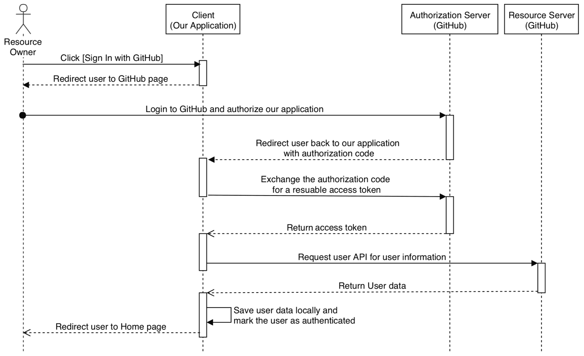
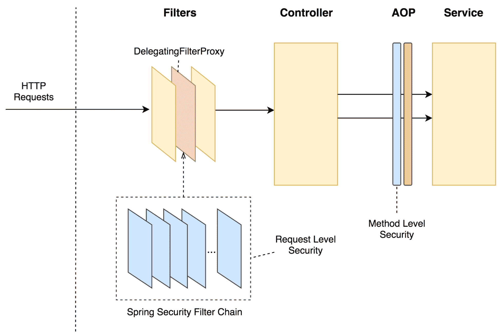
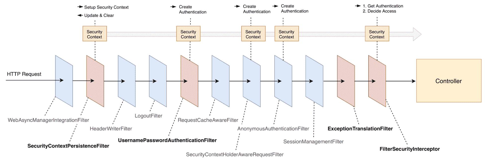
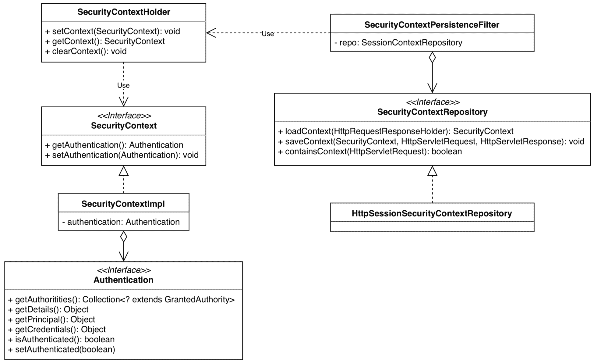
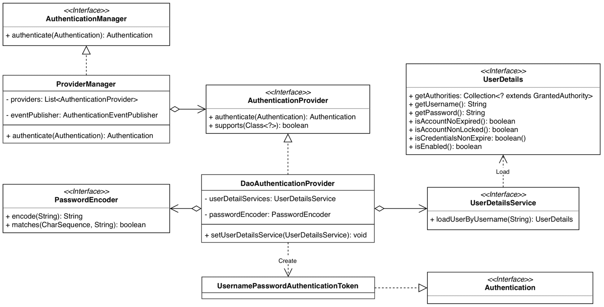
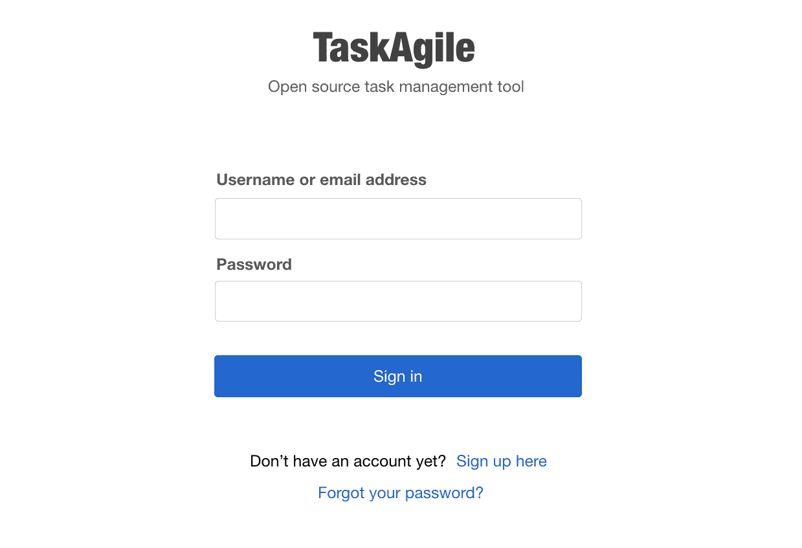

# 十、Spring Security——保护我们的应用

安全性是像 TaskAgile 这样的 web 应用的基本要求之一。我们希望对请求进行身份验证，并授权对各种资源的访问，我们还希望防止针对我们的应用的潜在攻击。Spring Security 最初名为 Acegi Security，是 Spring 世界中最流行的安全解决方案。在本章中，我们将介绍 web 应用安全的基础知识和各种认证过程，包括**单点登录** ( **SSO** )和 OAuth 2.0。我们还将介绍 Spring Security 并探索它的特性，然后深入研究它的架构以理解它是如何工作的。我们还将实现用户模块的登录页面。

简而言之，以下是你将在本章学到的内容:

*   如何保护 web 应用
*   Spring Security 如何工作
*   如何设置 Spring Security
*   用 Spring Security 认证请求
*   使用 JavaMail 发送电子邮件
*   执行端到端集成测试
*   添加 Java 单元测试覆盖报告

# 如何保护 web 应用

安全性是一个非常广泛的话题，它涵盖了许多方面。由于本书的范围，我们将主要关注 web 应用需要注意的安全性，包括认证、授权和防止攻击，例如**跨站点脚本** ( **XSS** )和 SQL/NoSQL 注入。诸如如何保护服务器或者如何防止**分布式拒绝服务** ( **DDoS** )攻击之类的话题将不在此讨论。

那么，我们如何保护 web 应用呢？这实际上可以归结为三个方面:

*   认证用户
*   授权用户
*   防止攻击

我们以 TaskAgile 为例。我们只希望那些我们已经验证的用户能够访问应用。因此，人们在使用应用之前需要登录，除了注册和登录页面，它们是可以公开访问的。我们还希望将经过身份验证的用户可以访问的资源限制在他们有权访问的范围内。例如，他们不应该能够编辑他人的个人信息或查看他们尚未加入的董事会的卡片。我们还希望防止来自恶意用户的攻击。下面就来详细的进入这三个方面。

# 认证用户

为了对用户进行身份验证，应用需要能够识别用户，以验证他们是他们所声称的那个人。常见的身份验证过程始于用户在登录表单上提供电子邮件地址或用户名以及密码，应用将通过使用电子邮件地址或用户名在数据库中查找用户的记录，然后将存储在数据库中的密码与用户提供的密码进行比较。如果用户记录不存在或密码不匹配，则身份验证失败。否则，应用将认为用户已经过身份验证，并在随后的请求中识别用户，通常是通过在 HTTP 会话中存储用户的信息。下图是身份验证过程的高级概述:


图 10.1:认证用户

身份验证过程有许多变体。例如，**应用**可以与服务器**轻量级目录访问协议** ( **LDAP** )如**活动目录**对话，检查包含用户数据的 XML 文件，甚至使用存储在内存中的用户数据，而不是在**数据库**中查找用户。

# 单点登录

认证过程的另一个变体是单点登录(SSO)，它使用诸如**安全断言标记语言** ( **SAML** )或**中央认证服务** ( **CAS** )之类的协议。使用 SSO 时，应用会将用户重定向到身份服务器，在身份服务器上回复以执行身份验证，并将结果通知应用。当使用 SAML 时，在认证之后，被称为**服务提供者** ( **SP** )的应用将从被称为**身份提供者** ( **IdP** )的身份服务器接收 SAML 断言。SAML 断言包含应用可以信任的用户的信息。它通常包括用户的基本信息，如姓名、电子邮件地址和 IdP 端的用户 ID。使用 CAS 时，在 CAS 服务器端成功认证后，一旦用户被重定向回应用，应用将收到一个服务票。有了这个服务票，应用将请求 CAS 服务器验证服务票，以确保收到的服务票是有效的和可信的。如您所见，在单点登录过程中，应用不知道用户的凭证。

# OAuth 2.0

OAuth 2.0 协议是一种非常流行的用户身份验证方式，尽管该协议最初被设计用来授权第三方服务访问用户数据。简而言之，OAuth 2.0 协议涉及四方:

*   **资源所有者**:拥有资源服务器中数据的人。例如，我是我在 Twitter 上的数据的所有者。
*   **资源服务器**:存储客户端想要访问的数据的服务器。例如，Twitter API 服务器是一个资源服务器。
*   **授权服务器**:对客户端请求的数据访问进行授权的服务器。通常，资源服务器和授权服务器是同一个服务器。
*   **客户端**:想要访问你的数据的应用。

在我们使用 OAuth 2.0 进行认证的情况下，例如，使用 GitHub，我们的应用是客户端，试图访问我们的应用的用户是资源所有者。GitHub 是资源服务器和授权服务器。下图显示了通过 OAuth 2.0 使用 GitHub 登录我们的应用时的身份验证流程:



图 10.2: OAuth 2.0 认证流程

如您所见，身份验证过程始于用户点击应用上的 GitHub 按钮**登录。我们的应用会将用户重定向到 GitHub 上的授权页面，请求访问用户在 GitHub 上的数据的权限。如果用户还没有在 GitHub 端登录，GitHub 会显示一个登录表单，要求用户先在 GitHub 上通过认证检查。之后，用户将能够向我们的应用授予数据访问权限。然后，用户将被重定向回我们的应用，我们的应用可以使用授权代码从 GitHub 获取访问令牌。一旦检索到访问令牌，我们的应用就可以用它来访问用户在 GitHub 上的数据，比如用户名、电子邮件地址和个人资料照片。**

在前面的序列图中，为了简洁起见，省略了许多细节。例如，用户作为**资源所有者**，并不直接与我们的应用或 GitHub 交互。它是通过用户代理，大多数时候是浏览器。重定向发生在浏览器中。

总的来说，对用户进行身份验证就是通过应用管理的数据源或第三方来验证用户的身份。

# 授权用户

通过身份验证后，用户将能够访问该应用。然而，这并不意味着用户可以随心所欲地做任何事情。访问将仅限于用户已被授权的那些资源。例如，用户可以编辑自己的个人信息，但禁止修改其他用户的信息。下图显示了一个用户试图访问一个**管理**模块中的支付信息，并得到一个**拒绝访问**错误，或被禁止的错误，通常以 HTTP 状态`403`发送回客户端:


图 10.3:拒绝未经授权的访问

有两种类型的授权。一种是基于角色的授权，例如，只要用户拥有管理员角色，他/她就可以访问 **/admin/payments** 资源。这是一个粗粒度的授权，因为它只能在资源类型级别控制访问，即使您可以添加特权，如`READ`、`WRITE`或`DELETE`。另一种类型的授权是通过**访问控制列表** ( **ACL** )，这是附加到一段数据的权限列表，以及被授权访问该段数据的用户列表。这样，用户就可以有细粒度的授权。例如，使用 ACL，您可以指定管理员只能查看**用户 A、**的付款，但可以管理对用户 b 的退款。通常，基于角色的授权更容易维护和管理，而基于 ACL 的授权需要额外的工作来维护列表，并需要额外的步骤来确定用户是否有权访问资源。

有时，您想要执行的授权不仅仅是完全基于角色的方法或基于 ACL 的方法。例如，如前所述，在 TaskAgile 中，我们只允许用户访问他们已经加入的董事会的卡片。所以，如果你不是那个版块的成员，你应该不能查看它。董事会成员似乎是一个角色。然而，这并不是一个真正的角色，因为你必须加入董事会才能成为董事会成员。成员资格与特定的董事会相关。另一方面，感觉有点 ACL。但是，我们不会定义访问控制列表，因为我们已经在`board_member`中存储了成员信息。(如果您不记得这一点，您可能需要查看第五章、*数据建模-设计应用基础*中的数据建模)。因此，在 TaskAgile 中，我们将创建一个基于 Spring 的 EL 的自定义授权机制，这一点我们将在本章后面讨论。

# 防止攻击

互联网不是一个安全的地方。认为没有人会攻击您的应用，或者认为在服务器前设置防火墙就足以阻止攻击者，这是极其危险的。根据****开放 web 应用安全项目** ( **OWASP** )，以下是 Web 应用十大安全:**

 ***   注射
*   身份验证被破坏
*   敏感数据暴露
*   **XML 外部实体** ( **XXE** )
*   中断的访问控制
*   安全错误配置
*   跨站点脚本(XSS)
*   不安全的反序列化
*   使用具有已知漏洞的组件
*   记录和监控不足

很明显，防火墙对这些漏洞无能为力。应用本身需要解决这些安全风险。由于这本书的范围，我们不会进入列表中的每个项目的细节。你可以在这里找到关于这些安全问题的详细信息:[https://www . OWASP . oimg/7/72/OWASP _ Top _ 10-2017 _ % 28en % 29 . pdf . pdf](https://www.owasp.oimg/7/72/OWASP_Top_10-2017_%28en%29.pdf.pdf)[。](https://www.owasp.oimg/7/72/OWASP_Top_10-2017_%28en%29.pdf.pdf)

# Spring Security 简介

简而言之，Spring Security 使用过滤器来执行认证和请求级授权，并使用 AOP 来完成方法级授权。下图显示了受 Spring Security 保护的 web 应用中请求将经过的组件:



图 10.4:应用中的 Spring 安全性

正如您所看到的，当一个请求到达服务器时，它将通过一个 **Spring 安全过滤器链**，这个过滤器链是通过`org.springframework.web.filter.DelegatingFilterProxy`委托的。这个过滤器链通常被创建为一个名为`springSecurityFilterChain`的 Spring bean，它包含一个由 Spring Security 创建的过滤器 bean 列表。通过这些过滤器，Spring 执行一系列动作来决定应该如何处理请求。一旦一个请求通过了所有的过滤器，它就到达通过请求映射注册的**控制器**来处理这个请求。大多数时候，控制器会调用服务的 API 来执行命令或查询一些信息。在控制流入**服务**之前，Spring Security 可以通过 **AOP** 执行方法级授权。这是对 Spring Security 的一个非常高层次的介绍，可以帮助您理解 Spring Security 在应用中的位置。现在，让我们回顾一下 Spring Security 中的一些核心概念。

# Spring 安全核心概念

在我们继续深入讨论 Spring 安全之前，我们先介绍一下 Spring 安全中的核心概念。理解这些概念将有助于我们更好地理解它的工作原理。

在 Spring Security 中，核心组件是`Authentication`、`GrantedAuthority`、`SecurityContext`和`SecurityContextHolder`。

一旦请求被`AuthenticationManager`处理，一个`Authentication`对象代表一个`authentication`请求或一个被认证主体的令牌。认证请求通常是前端发送给服务器的登录请求。在 Spring Security 中，这个请求的端点是登录处理 URL。默认情况下，它位于使用`HTTP POST`方法的`/login`路径。在认证请求中，`Authentication`对象通常包含用于认证的**用户名**和**密码**。术语主体来自于`Authentication`扩展的`java.security.Principal`接口。在 Java 中，`Principal`代表个人、公司或登录 ID。在 Spring Security 中，经过身份验证的主体是当前登录用户的信息，如前所述，这些信息通常保存在 HTTP 会话中。

`GrantedAuthority`是授予用户的权限。通常是角色名，比如`ROLE_ADMIN`或者`ROLE_SUPERVISOR`。您可以通过`Authentication`中的`getAuthorities()`方法检索用户被授予的权限。当一个登录用户的信息(它是`Authentication`的一个实例)被保存到一个 HTTP 会话中时，它被封装在`SecurityContext`的一个实例中。Spring Security 的`SecurityContextPersistenceFilter`负责管理每个请求的`SecurityContext`。在每个请求的执行中，可以通过`SecurityContextHolder.getContext()`方法由`SecurityContextHolder`检索`SecurityContext`。在内部，`SecurityContextHolder`将`SecurityContext`保存在一个`ThreadLocal`变量中。这样，`SecurityContext`就被绑定到执行请求的当前线程。Spring Security 执行授权时，会从`SecurityContextHolder`中检索`SecurityContext`。在 Spring Security 中，最核心的是这四个概念。Spring Security 中的大多数其他组件要么更新`SecurityContext`要么使用它来执行授权。

# 春季安全深度潜水

过滤器是对应用收到的请求执行各种操作的理想场所，比如审计和安全检查。Spring 安全是建立在过滤器之上的。为了更好地理解 Spring Security 在内部是如何工作的，我们将看看以下类型的请求，看看它们是如何被 Spring 安全过滤器处理的，以及参与这些请求的 Spring 安全组件:

*   访问公共资源的未经身份验证的请求
*   访问受保护资源的未经身份验证的请求
*   认证请求
*   访问受保护资源的经过身份验证的请求
*   访问未授权资源的经过身份验证的请求

要理解 Spring Security 是如何工作的，还有什么比实际操作更好的方法呢？在讨论这些请求之前，让我们在 TaskAgile 应用中设置 Spring 安全性。

# 设置 Spring 安全性

要安装 Spring Security，让我们将下面的依赖项添加到`pom.xml`:

```java
<dependency>
  <groupId>org.springframework.boot</groupId>
  <artifactId>spring-boot-starter-security</artifactId>
</dependency>
...
<dependency>
  <groupId>org.springframework.security</groupId>
  <artifactId>spring-security-test</artifactId>
  <scope>test</scope>
</dependency>
```

我们添加了`spring-security-test`,这样我们就可以在单元测试中使用它来确保我们的应用的端点拥有正确配置的权限。为了看看 Spring Security 做了什么，让我们通过向`src/main/resources/application.properties`添加以下配置来打开**调试级**日志记录:

```java
logging.level.org.springframework.security=DEBUG
```

现在，让我们添加 Spring 安全配置。为此，我们将扩展 Spring Security 的`WebSecurityConfigurerAdapter`类，并将`@EnableWebSecurity`注释应用于我们的定制类。以下是`com.taskagile.config.SecurityConfiguration`的样子:

```java
...
@EnableWebSecurity
public class SecurityConfiguration extends WebSecurityConfigurerAdapter {

  private static final String[] PUBLIC = new String[]{
    "/error", "/login", "/logout", "/register", "/api/registrations"};

  @Override
  protected void configure(HttpSecurity http) throws Exception {
    http
      .authorizeRequests()
        .antMatchers(PUBLIC).permitAll()
        .anyRequest().authenticated()
        .and()
      .formLogin()
        .loginPage("/login")
        .and()
      .logout()
        .logoutUrl("/logout")
        .logoutSuccessUrl("/login?logged-out")
        .and()
      .csrf().disable();
  }

  @Override
  public void configure(WebSecurity web) {
    web.ignoring().antMatchers("/static/**", "/js/**", "/css/**",img/**", "/favicon.ico");
  }
}
```

如您所见，`SecurityConfiguration`覆盖了来自`WebSecurityConfigurerAdapter`的两个`configure()`方法。在第一个`configure(HttpSecurity)`方法中，我们调用`authorizeRequests()`方法让 Spring Security 知道我们正在基于 HTTP 请求限制访问。这个方法的返回结果是一个`ExpressionInterceptUrlRegistry`的实例，它允许我们使用`antMatchers()`来指定我们希望 Spring Security 处理的请求的路径。在我们的例子中，我们希望任何人都可以使用`PUBLIC`中定义的所有路径。然后，我们说任何其他请求都可以被经过身份验证的用户访问。之后，我们使用`and()`方法将链恢复回`http`对象。`formLogin()`方法告诉 Spring Security 我们的应用使用基于表单的认证，而`loginPage()`方法指定了我们的登录页面的路径。`logout()`方法用于定义注销行为。事实上，我们不需要在这里定义这个方法，因为在默认情况下，Spring Security 提供了在路径`/logout`注销用户的支持，然后将用户重定向到路径`/login?success`。在我们的配置中，我们选择使用路径`/login?logged-out`。在这个链的末端，我们告诉 Spring Security 禁用**跨站点请求伪造** ( **CSRF** )特性。现在，我们已经有了这个配置。当我们运行应用时，Spring Boot 将自动获取配置。您可以使用`mvn spring-boot:run`命令启动应用，并尝试访问`http://localhost:8080`，您将被重定向到`http://localhost:8080/login`页面。我们的设置现在起作用了。

然而，在我们的`RegistrationApiControllerTests`测试中，情况有些不同。使用`@WebMvcTest`注释，在这个测试中，只有`RegistrationApiController`和 Spring Security 将被实例化。但是我们的`SecurityConfiguration`在测试中是不会接的。我们需要使用`@ContextConfiguration`注释来应用我们的定制，就像这样:

```java
@RunWith(SpringRunner.class)
@ContextConfiguration(classes = {SecurityConfiguration.class})
@WebMvcTest(RegistrationApiController.class)
@ActiveProfiles("test")
public class RegistrationApiControllerTests {
```

让我们运行测试方法，`register_blankForm_shouldFail()`。它又失败了，测试结果显示`Response status expected:<400>`却是`:<404>`。检查测试输出后，我们再也看不到`RequestMappingHandlerAdapter`打印出的关于`/api/registrants`端点到处理程序的映射的日志。这说不通。看来我们需要做更多的故障排除。因为这是在我们应用了`@ContextConfiguration`注释之后发生的，所以肯定与此有关。在检查了它的 JavaDoc 之后，我们可以找到以下描述:

*   `@ContextConfiguration`定义类级元数据，用于确定如何为集成测试加载和配置`ApplicationContext`。
*   `@ContextConfiguration`可以用来声明被注释的类。术语注释类可以指以下任何一种:
    *   用`@Configuration`标注的类
    *   组件(用`@Component`、`@Service`、`@Repository`等标注的类)

看起来，在应用了`@ContextConfiguration`注释之后，我们添加到`@WebMvcTest`的`RegistrationApiController.class`不再起作用了。要解决此问题，我们需要对注释进行如下更改:

```java
@ContextConfiguration(classes = {SecurityConfiguration.class, RegistrationApiController.class})
@WebMvcTest
```

现在，让我们运行测试，你可以看到它通过了。运行`mvn clean install`命令也将产生一个成功的构建。让我们提交它，下面是提交记录:


图 10.5:添加 Spring 安全提交

# Spring 安全过滤器链

现在，让我们用`mvn spring-boot:run`命令启动应用。一旦应用启动，您可以在输出中看到以下信息:

```java
Mapping filter: 'springSecurityFilterChain' to: [/*]
```

因为它被映射到一个通配符(`/*`)，所以 Spring 安全过滤器链将处理应用收到的所有请求。

您将在输出中看到的另一个日志如下:

```java
o.s.s.web.DefaultSecurityFilterChain     : Creating filter chain: org.springframework.security.web.util.matcher.AnyRequestMatcher@1, [org.springframework.security.web.context.request.async.WebAsyncManagerIntegrationFilter@3c2b5b0a, org.springframework.security.web.context.SecurityContextPersistenceFilter@240d2b4d, org.springframework.security.web.header.HeaderWriterFilter@711e7156, org.springframework.security.web.authentication.logout.LogoutFilter@d7be699, org.springframework.security.web.authentication.UsernamePasswordAuthenticationFilter@77b0917e, org.springframework.security.web.savedrequest.RequestCacheAwareFilter@2f67b8d8, org.springframework.security.web.servletapi.SecurityContextHolderAwareRequestFilter@369a4ddd, org.springframework.security.web.authentication.AnonymousAuthenticationFilter@5f6eca45, org.springframework.security.web.session.SessionManagementFilter@98d744b, org.springframework.security.web.access.ExceptionTranslationFilter@7fc7231d, org.springframework.security.web.access.intercept.FilterSecurityInterceptor@5604e1a5]
```

如您所见，通过我们的配置`HttpSecurity`，Spring Security 为我们创建了这些过滤器。让我们从不同的角度来看看这些过滤器。下图显示了一个来自左侧的请求，由每个过滤器按顺序处理，以及其中一些过滤器与`SecurityContext`的交互:



图 10.6: Spring 安全过滤器

在这些过滤器中，最重要的是`SecurityContextPersistenceFilter`、`UsernamePasswordAuthenticationFilter`、`ExceptionTranslationFilter`和`FilterSecurityInterceptor`。基于您使用的 Spring Security 版本，在这个过滤器链中创建的过滤器可能与我们列出的不同。然而，这四个过滤器具有非常相似的职责，为了使其工作，它们仍然存在。现在，让我们逐一检查这些 Spring 安全过滤器，看看它们做了什么:

*   `WebAsyncManagerIntegrationFilter`:这个过滤器提供了`SecurityContext`和 Spring Web 的`WebAsyncManager`之间的集成，后者是管理异步请求处理的中心类。
*   `SecurityContextPersistenceFilter`:请求到达的下一个过滤器是`SecurityContextPersistenceFilter`，它是为了让 Spring 安全功能正常运行而必须出现在链中的过滤器之一。如图所示，当请求进来时，这个过滤器将通过从`SecurityContextRepository`加载它来设置`SecurityContext`，这在默认情况下是基于`HttpSession`实现的。一旦`SecurityContext`被加载，过滤器将把它放入`SecurityContextHolder`中，这样，在这个过滤器之后，它可以通过`SecurityContextHolder.getContext()`被访问。另一方面，当请求通过这个过滤器发出时，`SecurityContext`将被更新回`SecurityContextRepository`，因此对`SecurityContext`的任何更改都将在请求之间保持。过滤器还将清除`SecurityContextHolder`,以避免将安全上下文泄露给可能不是来自同一用户的其他请求。
*   `HeaderWriterFilter`:这个过滤器给当前请求的响应增加了头。添加某些启用浏览器保护的标题是有用的，例如， **X-Frame-Options** 、 **X-XSS-Protection** 和 **X-Content-Type-Options** 。
*   顾名思义，这个过滤器将注销已经通过认证的用户。默认情况下，注销处理 URL 是`/logout`。因此，只有当请求被发送到该路径时，它才会执行注销过程。注销处理 URL 可通过`HttpSecurity`配置，这是我们在`SecurityConfiguration`中使用的 URL。
*   `UsernamePasswordAuthenticationFilter`:`UsernamePasswordAuthenticationFilter`是认证开始的地方。这个过滤器保存了对`ProviderManager`实例的引用，它是`AuthenticationManager`接口的一个实现。`ProviderManager`保存了一个`AuthenticationProvider`列表，用于执行实际的认证。最常用的认证提供者是`DaoAuthenticationProvider`，它使用`UserDetailsService`从数据库中加载相同用户名的`UserDetails`。然后`DaoAuthenticationProvider`检查请求中提供的密码是否与`UserDetails`中的密码匹配。如果匹配，认证通过；否则，它会失败。当认证成功后，`UsernamePasswordAuthenticationFilter`将更新`SecurityContext`，用户将被视为通过认证。`AuthenticationSuccessHandler`将控制请求。默认情况下，将发生到默认成功 URL 的重定向。当认证失败时，`SecurityContextHolder`将被清除，`AuthenticationFailureHandler`将控制请求。默认情况下，用户将被重定向到`/login?failed`页面。`UsernamePasswordAuthenticationFilter`不会触发任何请求的验证过程。它只会对使用 HTTP `POST`方法发送到`/login`路径的请求这样做。
*   `RequestCacheAwareFilter`:这个过滤器恢复之前缓存的请求，通常在请求失败时由`ExceptionTranslationFilter`保存。例如，当发送一个经过身份验证的请求来访问一个受保护的资源时，Spring Security 将阻止该请求，并将用户发送到登录页面。身份验证成功后，用户将被重定向回受保护的资源。Spring Security 通过检查缓存的请求知道用户在认证后应该去哪里。
*   `SecurityContextHolderAwareRequestFilter`:该过滤器负责使用实现 servlet API 安全方法的包装器来处理请求，如下所示:

*   `HttpServletRequest.authenticate(HttpServletResponse)`
*   `HttpServletRequest.login(String, String)`
*   `HttpServletRequest.logout()`

我们不会在 TaskAgile 中使用这些 API。

*   `AnonymousAuthenticationFilter`:当这个过滤器发现`SecurityContext`中没有`Authentication`时，它用`AnonymousAuthenticationToken`更新`SecurityContext`。它并不真正为匿名用户执行身份验证。这更像是在`SecurityContext`中放置一个占位符身份验证，以表明请求来自一个匿名用户。
*   `SessionManagementFilter`:该过滤器负责激活会话固定保护，控制并发会话，这需要`ConcurrentSessionFilter`在链中。要打开并发会话管理，我们可以使用以下由`HttpSecurity`提供的设置。默认情况下，没有任何限制:

```java
http.sessionManagement().maximumSessions(n);
```

*   这是过滤器链中的倒数第二个过滤器。顾名思义，这个过滤器负责翻译 Spring 安全异常。当捕获到`AuthenticationException`时，过滤器将启动认证端点。如果有`AccessDeniedException`被抓，用户匿名，过滤器也会启动认证端点；当用户不是匿名时，`AccessDeniedHandler`将默认发送一个 HTTP `403`响应。
*   `FilterSecurityInterceptor`:链中的最后一个过滤器是`FilterSecurityInterceptor`，它引用了`AccessDecisionManager`。过滤器检索`SecurityContext`，然后委托`AccessDecisionManager`决定请求是否被允许，并在请求被拒绝时抛出异常。如果请求被允许，它将到达相应的`Controller`。`AccessDecisionManager`做出的决定是基于投票的。这里做出的决定是在请求级别。这意味着 Spring Security 根据`HttpSecurity`上的配置检查请求的路径，并查看在`SecurityContext`中找到的授权是否足以允许访问。

通过打开相应的功能，可以将许多其他内置过滤器添加到链中。在这里，我们不会一一介绍。如果你感兴趣，你可以查看 Spring Security 的参考文档以获得详细信息。

# 春季安全行动

如前所述，理解 Spring Security 如何工作的一个更好的方法是看它的运行。在本节中，我们将尝试访问注册页面`/register`和主页`/`。由于我们还没有实现登录页面，我们发送的请求将是未经验证的。因此，目前我们将能够审查以下两个请求:

*   访问公共资源的未经身份验证的请求
*   访问受保护资源的未经身份验证的请求

# 公共资源上未经验证的请求

让我们回顾一下第一种类型的请求，这是一种访问公共资源的未经身份验证的请求。在我们的 TaskAgile 应用中，注册页面是公开的。让我们在`http://localhost:8080/register`打开浏览器。一旦页面完成加载，您可以在 Spring 安全输出中看到调试日志信息。

让我们转到由`o.s.security.web.FilterChainProxy`记录的部分，看起来如下:

```java
/register at position 1 of 11 in additional filter chain; firing Filter: 'WebAsyncManagerIntegrationFilter'
/register at position 2 of 11 in additional filter chain; firing Filter: 'SecurityContextPersistenceFilter'
```

如您所见，`/register`请求是由`WebAsyncManagerIntegrationFilter`和`SecurityContextPersistenceFilter`处理的。然后，是`w.c.HttpSessionSecurityContextRepository`打印的日志。这个类的完整路径是`org.springframework.security.web.context.HttpSessionSecurityContextRepository`。它打印出的日志如下:

```java
No HttpSession currently exists
No SecurityContext was available from the HttpSession: null. A new one will be created.
```

你可能还记得图 10.6 中的*，当一个请求被`SecurityContextPersistenceFilter`处理时，`SecurityContext`被建立。这个日志是说`SecurityContextPersistenceFilter`试图从`HttpSession`加载`SecurityContext`，而这个 T3 并不存在。因此，将创建一个新的`SecurityContext`。*

然后，`FilterChainProxy`打印出该请求通过`HeaderWriterFilter`和`LogoutFilter`:

```java
/register at position 3 of 11 in additional filter chain; firing Filter: 'HeaderWriterFilter'
/register at position 4 of 11 in additional filter chain; firing Filter: 'LogoutFilter'
```

当请求由`LogoutFilter`处理时，过滤器试图检查请求是否与注销处理 URL 匹配。因为没有，所以过滤器让请求通过。然后，`FilterChainProxy`打印出请求到达`UsernamePasswordAuthenticationFilter`:

```java
/register at position 5 of 11 in additional filter chain; firing Filter: 'UsernamePasswordAuthenticationFilter'
```

尽管如此，因为请求的路径与登录处理 URL 不匹配，所以过滤器让这个请求安静地通过。请求悄悄地通过`RequestCacheAwareFilter`和`SecurityContextHolderAwareRequestFilter`，如以下日志所示:

```java
/register at position 6 of 11 in additional filter chain; firing Filter: 'RequestCacheAwareFilter'
/register at position 7 of 11 in additional filter chain; firing Filter: 'SecurityContextHolderAwareRequestFilter'
```

之后，请求到达`AnonymousAuthenticationFilter`。这里发生了一些有趣的事情，您可以从下面的日志中看到:

```java
/register at position 8 of 11 in additional filter chain; firing Filter: 'AnonymousAuthenticationFilter'
Populated SecurityContextHolder with anonymous token: 'org.springframework.security.authentication.AnonymousAuthenticationToken@d6fc3bc2: Principal: anonymousUser; Credentials: [PROTECTED]; Authenticated: true; Details: org.springframework.security.web.authentication.WebAuthenticationDetails@b364: RemoteIpAddress: 0:0:0:0:0:0:0:1; SessionId: null; Granted Authorities: ROLE_ANONYMOUS'
```

由于请求没有经过`UsernamePasswordAuthenticationFilter`的认证，`AnonymousAuthenticationFilter`在`SecurityContextHolder`中创建了`AnonymousAutnenticationToken`，这样当通过`SecurityContextHolder.getContext().getAuthentication()`检索认证时，结果就不会是`null`。如您所见，授予该认证的权限是`ROLE_ANONYMOUS`。`FilterChainProxy`稍后指出请求到达`SessionManagementFilter`:

```java
/register at position 9 of 11 in additional filter chain; firing Filter: 'SessionManagementFilter'
```

因为这是一个匿名请求，`SessionManagementFilter`指出所请求的会话 ID 无效。之后，请求到达`ExceptionTranslationFilter`。这个过滤器的工作方式是首先让请求通过，然后捕捉任何随后抛出的 Spring 安全异常。所以，当我们提出请求时，什么也没发生:

```java
/register at position 10 of 11 in additional filter chain; firing Filter: 'ExceptionTranslationFilter'
```

请求到达的最后一个过滤器是`FilterSecurityInterceptor`。如前所述，这是决定请求是否可以继续的地方:

```java
/register at position 11 of 11 in additional filter chain; firing Filter: 'FilterSecurityInterceptor'
```

正如您在下面的日志中看到的，这个过滤器逐个检查了我们在`SecurityConfiguration`中的路径，以找到授权设置:

```java
AntPathRequestMatcher: Checking match of request : '/register'; against '/error'
AntPathRequestMatcher: Checking match of request : '/register'; against '/login'
AntPathRequestMatcher: Checking match of request : '/register'; against '/logout'
AntPathRequestMatcher: Checking match of request : '/register'; against '/register'
FilterSecurityInterceptor: Secure object: FilterInvocation: URL: /register; Attributes: [permitAll]
...
AffirmativeBased: Voter: org.springframework.security.web.access.expression.WebExpressionVoter@4d1271da, returned: 1
FilterSecurityInterceptor: Authorization successful
...
FilterChainProxy: /register reached end of additional filter chain; proceeding with original chain
```

一旦找到匹配的配置，它会询问`DecisionManager`，即`AffirmativeBased`，以决定是否允许该请求。如你所见，`WebExpressionVoter`投了赞成票。然后授权成功。在请求通过 Spring 安全过滤器链之后，它继续处理原始链。

在它出去的时候，请求仍然通过它在进来的时候通过的过滤器。这一次，并不是所有的过滤器都有兴趣处理它。从下面的日志信息中可以看到，`ExceptionTranslationFilter`什么也没做，因为没有抛出异常，`SecurityContextPersistenceFilter`清除了`SecurityContextHolder`:

```java
...
ExceptionTranslationFilter : Chain processed normally
SecurityContextPersistenceFilter : SecurityContextHolder now cleared, as request processing completed
```

在*图 10.6* 中，我们只包括了请求进入的方向以及请求通过过滤器的顺序。正如您在日志输出中看到的，在输出时，过滤器处理请求的顺序是颠倒的。

# 对受保护资源的未验证请求

现在，让我们看看当我们试图访问一个受保护的资源时，Spring Security 将如何工作，在我们的例子中，是在`/`的主页。

在您打开`http://localhost:8080`并且页面完成加载之后，您可以看到您实际上已经在`/login`到达了登录页面。让我们检查调试日志信息，看看 Spring Security 到底做了什么。从日志中可以看到，Spring Security 这次所做的一切与我们上次尝试访问公共资源时一样，除了在最后一个过滤器`FilterSecurityInterceptor`中发生的事情。以下是该过滤器处理请求时打印出的日志:

```java
AffirmativeBased : Voter: org.springframework.security.web.access.expression.WebExpressionVoter@93d13c0, returned: -1
ExceptionTranslationFilter : Access is denied (user is anonymous); redirecting to authentication entry pointorg.springframework.security.access.AccessDeniedException: Access is denied  at org.springframework.security.access.vote.AffirmativeBased.decide(AffirmativeBased.java:84)
...
```

如您所见，`DecisionManager`根据投票结果拒绝了访问。它扔出`AccessDeniedException`，被`ExceptionTranslationFilter`接住。因为是匿名用户，所以发生了到登录页面的重定向。

# 深度安全认证

到目前为止，您应该对 Spring Security 的工作原理有了很好的理解。在这一节中，我们将深入探讨 Spring Security 中的组件在验证请求时是如何工作的。我们将主要关注以下两个过滤器:

*   `SecurityContextPersistenceFilter`
*   `UsernamePasswordAuthenticationFilter`

# securitycontextpersistence filter

正如您已经知道的，这个过滤器负责请求之间的`SecurityContext`持久性。让我们通过检查下图所示的类图来看看它在内部是如何工作的:



图 10.7:SecurityContextPersistenceFilter 及其依赖项

如您所见，过滤器保存了对实现了`SecurityContextRepository`接口的`HttpSessionSecurityContextRepository`实例的引用。过滤器也使用`SecurityContextHolder`来设置`SecurityContext`以及清除它。这个`SecurityContext`实现`SecurityContextImpl`，拥有一个`Authentication`的实例。

在未经身份验证的请求中，`SecurityContextRepository`不包含该请求的`SecurityContext`对象。该过滤器放入`SecurityContextHolder`的`SecurityContext`为空，因为那个`SecurityContext`对象里面的`authentication`为空，如下图所示:


图 10.8:安全上下文对象

只有在认证成功后，`SecurityContext`中的`authentication`才会被更新为一个包含刚刚登录的用户信息的`Authentication`对象。这个过滤器会将`SecurityContext`保存到`HttpSession`中。在下面的请求中，`SecurityContextPersistenceFilter`将从存储库中加载`SecurityContext`并将其放入`SecurityContextHolder`。

# usernamepasswordtauthenticationfilter

现在，我们来看看`UsernamePasswordAuthenticationFilter`及其依赖项，如下图所示:


图 10.9:usernamepasswordtauthenticationfilter 及其依赖项

如您所见，`UsernamePasswordAuthenticationFilter`从`AbstractAuthenticationProcessingFilter`扩展而来，后者保存了对`AuthenticationManager`实例的引用。`AuthenticationManager`是一个接口，它只有一个方法:`authenticate()`。该方法将一个未经身份验证的`Authentication`实例作为其输入，并返回一个经过身份验证的`Authentication`实例。

下图显示了`AuthenticationManager`、`AuthenticationProvider`、`UserDetails`和`UserDetailsService`之间的关系:



图 10.10: AuthenticationManager 及其依赖项

如您所见，`AuthenticationManager`的实现`ProviderManager`保存了一个`AuthenticationProvider`列表，它可以使用这个列表来执行认证。`DaoAuthenticationProvider`是`AuthenticationProvider`接口的实现之一。以下是内置的`AuthenticationProvider`:

*   `CasAuthenticationProvider`
*   `DaoAuthenticationProvider`
*   `LdapAuthenticationProvider`
*   `OAuth2LoginAuthenticationProvider`
*   `OpenIDAuthenticationProvider`
*   `RememberMeAuthenticationProvider`
*   `AnonymousAuthenticationProvider`

通过这些`AuthenticationProvider`，Spring Security 在认证请求的方式上非常灵活。现在，让我们把重点放在`DaoAuthenticationProvider`，这是一个常用的。

如您所见，`DaoAuthenticationProvider`保存了一个`PasswordEncoder`的实例和一个`UserDetailsService`的实例。在认证过程中，提供者将要求`UserDetailsService`加载一个`UserDetails`的实例，当`UserDetails`存在时，它将使用`PasswordEncoder`检查在`Authentication`实例中传递的密码是否与`UserDetails`实例中的一个相匹配。当密码匹配时，请求将被认为是经过认证的，提供者将创建一个`UsernamePasswordAuthenticationToken`的实例，它是`Authentication`接口的一个实现。这个`UsernamePasswordAuthenticationToken`实例是要返回到`UsernamePasswordAuthenticationFilter`并更新到`SecurityContextHolder`的实例。

在一个认证请求中，当它到达这个过滤器时，`Authentication`对象存在于`SecurityContext`中，看起来类似于下图中左边的那个。成功认证后，`Authentication`物体看起来就像右边的一样。在`SecurityContextPersistenceFilter`中，这个经过认证的`Authentication`对象将被保存到`HttpSession`中:


图 10.11:认证对象

如您所见，在认证之前，`Authentication`实例的`principal`和`credentials`属性的值是在登录请求中发送的电子邮件地址或用户名和密码。`authorities`为空，`authenticated`为`false`。认证成功后，`Authentication`对象中`principal`的值被更改为`UserDetails`的实例，并且`credentials`被清除以保护密码。在我们的例子中，这个用户被授予的权限是`ROLE_USER`。

# 深度 Spring 安全授权

现在，让我们看看 Spring Security 在授权请求时是如何在内部工作的。如前所述，在`FilterSecurityInterceptor`中，Spring Security 将在请求级别执行授权。而且有了 AOP，Spring Security 还可以执行方法级授权和保护域对象。

# FilterSecurityInterceptor

首先，我们仔细看看`FilterSecurityInterceptor`。下图显示了`FilterSecurityInterceptor`与其依赖关系的关系:


图 10.12:filtersecurityintector 及其依赖项

如您所见，`FilterSecurityInterceptor`扩展了`AbstractSecurityInterceptor`，它保存了对`AccessDecisionManager`实例的引用。`AccessDecisionManager`有三种实现:`AffirmativeBased`、`ConsensusBased`和`UnanimousBased`。这些决策管理器持有一个`AccessDecisionVoter`列表，并且`AccessDecisionVoter`有两个实现:`RoleVoter`和`AuthenticatedVoter`。`RoleVoter`实现检查`Authentication`实例的授权是否包含访问请求所需的角色。如果角色被授予，那么`RoleVoter`投赞成票，否则投反对票。`AuthenticatedVoter`简单检查`SecurityContext`内的认证是否通过认证，并分别给出赞成票或反对票。

所以，根据选民的投票来做决定。如果任何一个`AccessDecisionVoter`返回肯定的回答，`AffirmativeBased`将授权访问，当赞成票大于反对票时，`ConsensusBased`将授权访问。`UnanimousBased`授予访问权限不需要反对票。当访问被授权时，没有任何帮助，请求将前进到`Controller`。否则，将抛出`AccessDeniedException`，控制流程将返回到`ExceptionTranslationFilter`。

# 方法安全性

如前所述，Spring Security 通过 AOP 执行方法级安全，有两种方法来保护方法。一种是使用`@Secured`注释或 **JSR-250** `@RoleAllowed`注释来指定调用该方法所需的权限/角色。另一种方法是通过`@PreAuthorize`和`@PostAuthorize`注释使用 Spring 的表达式语言。

下面是使用`@Secured`注释启用方法安全性的方法:

```java
@EnableGlobalMethodSecurity(securedEnabled = true)
public class MethodSecurityConfig { 
  // ...
}
```

下面是使用`@RoleAllowed`注释启用方法安全性的方法:

```java
@EnableGlobalMethodSecurity(jsr250Enabled = true)
public class MethodSecurityConfig { 
  // ...
}
```

如您所见，两种配置都应用了`@EnableGlobalMethodSecurity`注释。

以下是如何使用`@Secured`注释:

```java
public interface PaymentService { 
  @Secured("ROLE_PAYMENT_ADMIN")
  List<Payment> getPayments(Long userId); 
}
```

以下代码显示了如何使用`@RoleAllowed`注释:

```java
public interface PaymentService { 
  @RoleAllowed("ROLE_PAYMENT_ADMIN")
  List<Payment> getPayments(Long userId); 
}
```

如您所见，这两种注释的使用方式和工作方式都是一样的。`MethodSecurityInterceptor`接口的实例将拦截方法调用，访问决策将委托给`AccessDecisionManager`。将根据用户的角色，即`SecurityContext`中`Authentication`实例被授予的权限来做出决定。

如前所述，基于角色的授权是粗粒度的，有其局限性，这可以通过基于 Spring Expression 语言的方法安全性来解决。我们可以使用 Spring Expression 语言来访问方法采用的参数或方法返回的结果，而不是仅限于检查被授予的权限。有了这些信息，我们就可以制定更复杂的授权逻辑，比如，只有当调用来自董事会成员时，才授予对返回董事会所有卡片的方法的调用的访问权。

以下配置将启用基于表达式的方法安全性:

```java
@EnableGlobalMethodSecurity(prePostEnabled = true)
public class MethodSecurityConfig { 
  // ...
}
```

我们可以使用`@PreAuthorize`注释和`@PostAuthorize`注释来保护方法。顾名思义，`@PreAuthorize`注释将在方法调用之前触发授权，而`@PostAuthorize`注释将在方法被调用之后触发授权。

以下是`@PreAuthorize`注释的使用示例:

```java
public interface BoardService { 
  @PreAuthorize("isBoardMember()")
  List<Card> getCards(long boardId);
}
```

授权将由`SecurityExpressionHandler`接口的一个实例来处理。目前我们不会过多地探究方法安全性，因为在下一章中，我们将实现一个`@PreAuthorize`注释的处理程序来保护应用服务中的方法。您将看到它是如何工作的。

# 构建登录页面

现在，我们已经完成了 Spring Security 的介绍。是时候实现用户模块的登录页面了。在这一节中，我们将介绍登录页面的前端实现和后端实现，以及这两个部分的单元测试。但是，由于登录页面的大部分实现，包括前端和后端，都与注册页面的实现类似，所以我们将只关注只有登录页面才有的部分，也就是用 Spring Security 认证请求。你总能在 GitHub 上通过使用 commit 记录找到本书没有涉及到的细节。

# 实现登录页面 UI

让我们实现页面的 UI。下面显示了登录页面的外观:



图 10.13:登录页面的用户界面

如您所见，我们支持使用用户名或电子邮件地址登录。在登录页面上，有一个指向注册页面的链接，以及另一个指向忘记密码页面的链接，我们将在 TaskAgile 的未来版本中实现这一功能。

以下是实现登录页面 UI 的步骤，它类似于实现注册页面的步骤:

*   写一个单元测试:`services.authentication.spec.js`
*   创建`services/authentication/index.js`
*   写一个单元测试:`LoginPage.spec.js`
*   创建`LoginPage.vue`使测试通过

在`services.authentication.spec.js`中，我们将创建以下测试:

*   它应该调用`/authentications` API
*   当请求成功时，它应该将响应传递给调用者
*   当请求失败时，它应该将错误传播给调用者

第一个测试是确保认证服务将调用正确的 API。另外两个与注册服务规范中的相同，用于确保认证服务传递结果并将错误传播给调用者。

我们将在`LoginPage.spec.js`中创建的测试包括以下内容:

*   它应该呈现登录表单
*   它应该包含带有初始值的数据模型
*   它应该有与数据模型绑定的表单输入
*   它应该有一个表单提交事件处理程序，`submitForm`
*   当凭据有效时，它应该会成功
*   当凭证无效时，它应该会失败
*   它应该有验证，以防止无效的数据提交

我们还需要创建一个身份验证服务的模拟和一个空白主页，用户登录后将被重定向到该主页。我们还需要重构`RegisterPage.vue`来提取 logo 部分和页脚作为独立的组件，这样它们就可以与登录页面共享。

由于前面提到的所有项目都类似于我们为注册页面构建的内容，因此我们将在这里跳过细节。您可以检查提交记录以了解更多信息。以下是提交记录:


图 10.14:实现登录页面前端提交

# 实现 PasswordEncryptorDelegate

如前所述，我们的`PasswordEncryptor`实现将实际的加密委托给 Spring Security 的`PasswordEncoder`实现。以下是`PasswordEncryptorDelegate`的样子:

```java
...
@Component
public class PasswordEncryptorDelegate implements PasswordEncryptor {

  private PasswordEncoder passwordEncoder;

  public PasswordEncryptorDelegator(PasswordEncoder passwordEncoder) {
    this.passwordEncoder = passwordEncoder;
  }

  @Override
  public String encrypt(String rawPassword) {
    return encoder.encode(rawPassword);
  }
}
```

如您所见，这非常简单。Spring Security 提供了`PasswordEncoder`的多种实现，这里我们将使用`BCryptPasswordEncoder`。让我们在`SecurityConfiguration`中将`BCryptPasswordEncoder`实例化如下，这样 Spring 就可以将它注入到`PasswordEncryptorDelegate`中:

```java
@Bean
public PasswordEncoder passwordEncoder() {
 return new BCryptPasswordEncoder();
}
```

`BCryptPasswordEncoder`使用`BCrypt`强哈希函数，被认为比 **SHA-256** 等算法更安全。现在，我们可以尝试注册新用户。正如您应该看到的，数据库中的密码现在是加密的。像往常一样，让我们在用`mvn clean install`命令成功构建之后提交更改。以下是提交记录:


图 10.15:实现 PasswordEncryptorDelegate 提交

# 在后端实现身份验证

在*图 10.15* 的提交记录中可以看到，前端的认证服务向`/api/authentications`发送了一个`HTTP POST`请求。这不同于使用 Spring Security 进行身份验证的标准方式。如前所述，默认情况下，Spring Security 将使用 HTTP `POST`方法在`/login`路径处理登录请求，我们期望请求的内容类型是`application/x-www-form-urlencoded`。在成功认证之后，默认情况下，Spring Security 会将用户重定向到一个目标页面。通常，它是主页。重定向将使用`HttpServletResponse`实例的`sendRedirect()`方法来完成。当身份验证失败时，它会将用户重定向到错误页面。Spring Security 的这种默认行为对我们的前端登录过程不起作用。在前端，我们使用 Ajax 发送一个内容类型为`application/json`的登录请求，并期待一个 JSON 响应。

我们将需要定制 Spring Security 中的身份验证部分，以使后端与前端协同工作。我们将这样做:

*   添加`AuthenticationFilter`来替换 Spring Security 的内置`UsernamePasswordAuthenticationFilter`，这样我们就可以从 JSON 格式的请求体中检索用户名和密码
*   实现`UserDetailsService`接口，提供通过用户名或电子邮件地址加载用户的能力
*   实现`UserDetails`接口来控制在两次请求之间什么将被保存在经过验证的`Authentication`中，什么将被保存在`HttpSession`中
*   添加`AuthenticationSuccessHandler`发送 JSON 中的认证成功结果
*   添加`AuthenticationFailureHandler`发送 JSON 中的认证失败结果
*   添加`LogoutSuccessHandler`在 JSON 中发送注销成功结果

这次我们将跳过单元测试的介绍。您可以在提交记录中找到详细信息。我们将重点关注`AuthenticationFilter`、`UserDetailsService`、`UserDetails`的实现。

# 实现身份验证过滤器

Spring Security 非常灵活，高度可定制。我们可以很容易地用自己的实现替换内置的实现。我们有时不需要从头开始写所有的东西，因为 Spring Security 在抽象方面做得非常好。对于我们的`AuthenticationFilter`实现，我们可以从`AbstractAuthenticationProcessingFilter`扩展，它也是内置的`UsernamePasswordAuthenticationFilter`扩展的基类。

由于`AuthenticationFilter`处理 API 请求，我们将把它放在`com.taskagile.web.apis.authenticate`包中。以下是`AuthenticationFilter`的样子:

```java
...
public class AuthenticationFilter extends AbstractAuthenticationProcessingFilter {
  ...
  public AuthenticationFilter() {
    super(new AntPathRequestMatcher("/api/authentications", "POST"));
  }

  @Override
  public Authentication attemptAuthentication(HttpServletRequest 
    request, HttpServletResponse response)
    throws AuthenticationException, IOException {

    log.debug("Processing login request");

    String requestBody = IOUtils.toString(request.getReader());
    LoginRequest loginRequest = JsonUtils.toObject(requestBody, 
    LoginRequest.class);
    if (loginRequest == null || loginRequest.isInvalid()) {
      throw new InsufficientAuthenticationException("Invalid 
      authentication request");
    }

    UsernamePasswordAuthenticationToken token =
      new UsernamePasswordAuthenticationToken(loginRequest.username, 
      loginRequest.password);
    return this.getAuthenticationManager().authenticate(token);
  }
  ...
}
```

正如您所看到的，在构造函数中，我们指定这个过滤器将使用`HTTP POST`方法中的`/api/registrations`路径来处理请求。在`attemptAuthentication()`方法中，我们所做的就是将来自`request.getReader()`的请求体读入一个字符串，我们希望它是 JSON 格式的。`IOUtils`是 Apache Commons IO 项目中的一个实用程序类。然后，我们使用`JsonUtils`将 JSON 字符串转换成`LoginRequest`的实例。`JsonUtils`是一个实用程序类，我们创建它来处理 JSON 字符串转换。`LoginRequest`是过滤器的简单内部类，仅用于解析 JSON 字符串。

转换后，当`loginRequest`无效时，我们抛出`AuthenticationException`，要么是因为请求体不是 JSON 格式，要么是缺少必需的字段。这里抛出的异常最终将由我们需要实现的`AuthenticationFailureHandler`来处理。当`loginRequest`有效时，我们将创建`UsernamePasswordAuthenticationToken`，如前所述，它是一个`Authentication`对象，类似于*图 10.11* 左侧所示。然后我们调用`AuthenticationManager`来处理实际的认证。

# 实现 UserDetailsService

我们将在现有的`UserApplicationServiceImpl`中实现`UserDetailsService`，并修改`UserApplicationService`接口来扩展`UserDetailsService`，如下所示:

```java
public interface UserApplicationService extends UserDetailsService {
  ...
}
```

下面是对`UserApplicationServiceImpl`的修改:

```java
...
public class UserApplicationServiceImpl implements UserApplicationService {
  ...
  @Autowired
  private UserRepository userRepository;

  @Override
  public UserDetails loadUserByUsername(String username) throws UsernameNotFoundException {
    if (StringUtils.isEmpty(username)) {
      throw new UsernameNotFoundException("No user found");
    }

    User user;
    if (username.contains("@")) {
      user = userRepository.findByEmailAddress(username);
    } else {
      user = userRepository.findByUsername(username);
    }
    if (user == null) {
      throw new UsernameNotFoundException("No user found by `" + 
      username + "`");
    }
    return new SimpleUser(user);
  }
  ...
}
```

如您所见，我们在这里添加了对`UserRepository`的引用。在`loadUserByUsername()`方法中，我们确保`username`不为空；否则，我们只需抛出异常，无需进一步处理。找到用户的方式取决于`username`属性是否包含`@`。当找不到用户时，我们抛出一个异常。否则，我们返回一个`SimpleUser`的实例，它实现了`UserDetails`接口。

# 实现用户详细信息

如前所述，`UserDetails`对象将被保存在`Authentication`对象中，后者将被保存到`HttpSession`中。因此，我们在`UserDetails`中保留更少的数据是很重要的。下面是`SimpleUser`，实现`UserDetails`:

```java
...
public class SimpleUser implements UserDetails, Serializable {
  ...
  private long userId;
  private String username;
  private String password;

  public SimpleUser(User user) {
    this.userId = user.getId();
    this.username = user.getUsername();
    this.password = user.getPassword();
  }

  // Getters of the three properties
  ...
  public Collection<? extends GrantedAuthority> getAuthorities() {
    return Collections.singleton(new 
    SimpleGrantedAuthority("ROLE_USER"));
  }
  public boolean isAccountNonExpired() { return true; }
  public boolean isAccountNonLocked() { return true; }
  public boolean isCredentialsNonExpired() { return true; }
  public boolean isEnabled() { return true; }
  ...
}
```

如您所见，这个`SimpleUser`在从`User`对象创建后是只读的。`username`保存在这里，以便我们可以使用它来找出谁是经过身份验证的用户。

# 更新安全配置

现在，让我们更新`SecurityConfiguration`以使 Spring Security 意识到新的过滤器和处理程序:

```java
...
public class SecurityConfiguration extends WebSecurityConfigurerAdapter {
  ...
  @Override
  protected void configure(HttpSecurity http) throws Exception {
    http
      .authorizeRequests()
        .antMatchers(PUBLIC).permitAll()
        .anyRequest().authenticated()
      .and()
        .addFilterAt(authenticationFilter(), 
        UsernamePasswordAuthenticationFilter.class)
        .formLogin().loginPage("/login")
      .and()
        .logout().logoutUrl("/logout")
        .logoutSuccessHandler(logoutSuccessHandler())
      .and()
        .csrf().disable();
  }
  ...
  @Bean
  public AuthenticationFilter authenticationFilter() throws Exception {
    AuthenticationFilter authenticationFilter = new 
    AuthenticationFilter();
    authenticationFilter.setAuthenticationSuccessHandler(authenticationSuccessHandler());
    authenticationFilter.setAuthenticationFailureHandler(authenticationFailureHandler());
    authenticationFilter.setAuthenticationManager(authenticationManagerBean());
    return authenticationFilter;
  }

  @Bean
  public AuthenticationSuccessHandler authenticationSuccessHandler() {
    return new SimpleAuthenticationSuccessHandler();
  }

  @Bean
  public AuthenticationFailureHandler authenticationFailureHandler() {
    return new SimpleAuthenticationFailureHandler();
  }

  @Bean
  public LogoutSuccessHandler logoutSuccessHandler() {
    return new SimpleLogoutSuccessHandler();
  }
}
```

如你所见，我们使用`http.addFilterAt()`方法将`UsernamePasswordAuthenticationFilter`替换为`AuthenticationFilter`，后者在`authenticationFilter()`方法中初始化。我们还将`LogoutSuccessHandler`改为我们的实现`SimpleLogoutSuccessHanlder`。您可以在提交记录中找到这个处理程序以及其他两个处理程序的详细信息。在`authenticationFilter()`内部，我们创建了一个新的`AuthenticationFilter`并提供了处理程序，以及通过`WebSecurityConfigurerAdapter`提供的`authenticationManagerBean()`方法获得的`AuthenticationManager`。

就是这样。我们已经使用 Spring Security 实现了身份验证，并进行了一些定制。像往常一样，让我们确保在提交代码之前有一个成功的构建。以下是提交记录:


图 10.16:实现登录页面后端提交

# 使用 JavaMail 发送电子邮件

现在，让我们使用 JavaMail 实现发送电子邮件功能。我们还将使用 **FreeMarker** 作为模板引擎来创建电子邮件的正文。

首先，我们给`pom.xml`添加以下依赖项:

```java
<dependency>
  <groupId>org.springframework.boot</groupId>
  <artifactId>spring-boot-starter-mail</artifactId>
</dependency>
...
<dependency>
  <groupId>org.freemarker</groupId>
  <artifactId>freemarker</artifactId>
</dependency>
```

正如您将在本节中看到的，`spring-boot-starter-mail` starter 提供了一些接口，比如`JavaMailSender`，使得发送电子邮件的实现变得相对容易。随着 FreeMaker 库的出现，Spring Boot 将自动创建一个`freemarker.template.Configuration`的实例。默认情况下，模板加载器路径是`classpath:/templates/`，已经用来存储**百里香**视图模板。我们最好将视图模板和邮件模板分开，放在不同的文件夹中。让我们通过向`application.properties`添加以下属性来更改 FreeMarker 的加载程序路径:

```java
spring.freemarker.template-loader-path=classpath:/mail-templates/
```

要发送电子邮件，JavaMail 需要连接到一个**简单邮件传输协议** ( **SMTP** )服务器。在我们的本地**开发**环境中，我们有几个选择。我们可以通过 Gmail 的 SMTP 服务器或亚马逊的 SES 服务发送电子邮件。但是，这要求收件人的电子邮件地址有效。事实上，在我们的本地开发环境中，我们通常不需要实际接收电子邮件，而只需要验证我们的应用是否发送了正确的消息。为此，我们实际需要的是一个 SMTP 服务器，我们可以用它来检查应用发出的电子邮件。Python 的标准库`smtpd`的`DebuggingServer`实现正好提供了这一点。它将丢弃收到的消息并将它们打印到终端上。安装 Python 后，可以使用以下命令启动调试 SMTP 服务器:

```java
python -m smtpd -n -c DebuggingServer localhost:1025
```

如您所见，在这个命令中，SMTP 服务器的主机是`localhost`，它监听端口`1025`。在本书中，我们将把这个 SMTP 服务器用于我们的本地开发环境。现在，让我们向`application.properties`添加以下配置，以便 JavaMail 可以连接到这个 SMTP 服务器:

```java
spring.mail.host=localhost
spring.mail.port=1025
spring.mail.properties.mail.smtp.auth=false
```

# 邮件管理器及其依赖项

现在，让我们来看看`MailManager`及其依赖项。`DefaultMailManager`,`MailManager`的实现，将需要基于模板创建消息体，然后使用邮件服务 API 发送消息。下图显示了`MailManager`与其依赖关系的关系:


图 10.17:邮件管理器及其依赖项

如您所见，`DefaultMailManager`使用`FreeMarkerTemplateUtils`从模板创建消息体，并使用邮件服务 API`Mailer`发送消息。`Mailer`接口的实现是`AsyncMailer`，它将使用 Spring 的`JavaMailSender`来发送消息。

# 测试 DefaultMailManager

在我们实现`DefaultMailManager`之前，让我们创建单元测试`com.taskagile.domain.common.mail.DefaultMailManagerTests`:

```java
@RunWith(SpringRunner.class)
@ActiveProfiles("test")
public class DefaultMailManagerTests {

  @TestConfiguration
  static class DefaultMessageCreatorConfiguration {
    @Bean
    public FreeMarkerConfigurationFactoryBean 
    getFreemarkerConfiguration() {
      FreeMarkerConfigurationFactoryBean factoryBean = new 
      FreeMarkerConfigurationFactoryBean();
      factoryBean.setTemplateLoaderPath("/mail-templates/");
      return factoryBean;
    }
  }

  @Autowired
  private Configuration configuration;
  private Mailer mailerMock;
  private DefaultMailManager instance;

  @Before
  public void setUp() {
    mailerMock = mock(Mailer.class);
    instance = new DefaultMailManager("noreply@taskagile.com", 
    mailerMock, configuration);
  }
  ...
}
```

如您所见，这个测试类需要一个`DefaultMailManager`实例和一个`Mailer`实例的模拟版本，它们将用于验证消息。我们还创建了一个`freemarker.template.Configuration`的实例，这是从模板生成电子邮件正文所必需的。我们在测试配置中创建了一个`FreeMarkerConfigurationFactoryBean`实例，这样一个`Configuration`实例将被自动连接到测试中。

在这个测试类中，我们有以下测试方法:

*   `send_nullEmailAddress_shouldFail()`
*   `send_emptyEmailAddress_shouldFail()`
*   `send_nullSubject_shouldFail()`
*   `send_emptySubject_shouldFail()`
*   `send_nullTemplateName_shouldFail()`
*   `send_emptyTemplateName_shouldFail()`
*   `send_validParameters_shouldSucceed()`

前六个方法确保了`send()`方法会通过抛出`IllegalArgumentException`来抱怨不好的参数。

最后一个是验证消息发送成功。测试方法如下所示:

```java
@Test
public void send_validParameters_shouldSucceed() {
  String to = "user@example.com";
  String subject = "Test subject";
  String templateName = "test.ftl";

  instance.send(to, subject, templateName, MessageVariable.from("name", "test"));
  ArgumentCaptor<Message> messageArgumentCaptor = ArgumentCaptor.forClass(Message.class);
  verify(mailerMock).send(messageArgumentCaptor.capture());

  Message messageSent = messageArgumentCaptor.getValue();
  assertEquals(to, messageSent.getTo());
  assertEquals(subject, messageSent.getSubject());
  assertEquals("noreply@taskagile.com", messageSent.getFrom());
  assertEquals("Hello, test\n", messageSent.getBody());
}
```

如你所见，在调用了`DefaultMailManager`的`send()`方法后，我们使用`ArgumentCaptor`来捕获传递给`Mailer`的消息；我们使用`send()`方法，然后断言它的价值。这里就不多赘述了。您可以检查提交记录，找出被跳过的其他部分。

# 实现 DefaultMailManager

`DefaultMailManager`的实现非常简单。如前所述，它使用 **FreeMarker** 从模板创建消息体，并使用`Mailer` API 发送消息。下面是它的`send()`方法的样子:

```java
@Component
public class DefaultMailManager implements MailManager {

  private String mailFrom;
  private Mailer mailer;
  private Configuration configuration;

  public DefaultMailManager(@Value("${app.mail-from}") String mailFrom,
                            Mailer mailer,
                            Configuration configuration) {
    this.mailFrom = mailFrom;
    this.mailer = mailer;
    this.configuration = configuration;
  }

  @Override
  public void send(String emailAddress, String subject, String 
    template, MessageVariable... variables) {
    Assert.hasText(emailAddress, "Parameter `emailAddress` must not be 
    blank");
    Assert.hasText(subject, "Parameter `subject` must not be blank");
    Assert.hasText(template, "Parameter `template` must not be blank");

    String messageBody = createMessageBody(template, variables);
    Message message = new SimpleMessage(emailAddress, subject, 
    messageBody, mailFrom);
    mailer.send(message);
  }
  ...
}
```

如您所见，通过构造函数，它的依赖项被注入。在`test()`方法中，它调用它的`createMessageBody()`方法来创建消息体，然后实例化一个`Message`的实例，并通过`mailer.send()`方法发送它。

下面是`createMessageBody()`方法的样子:

```java
private String createMessageBody(String templateName, MessageVariable... variables) {
  try {
    Template template = configuration.getTemplate(templateName);
    Map<String, Object> model = new HashMap<>();
    if (variables != null) {
      for (MessageVariable variable : variables) {
        model.put(variable.getKey(), variable.getValue());
      }
    }
    return FreeMarkerTemplateUtils.processTemplateIntoString(template, 
    model);
  } catch (Exception e) {
    log.error("Failed to create message body from template `" + 
    templateName + "`", e);
    return null;
  }
}
```

正如你所看到的，在这个方法中，我们使用`freemarker.template.Configuration`的实例来获得一个`Template`实例，然后使用`FreeMarkerTemplateUtils`将模板转换成一个字符串。

# 实现异步邮件程序

`AsyncMailer`顾名思义，异步发送消息。并且，如 UML 图中的*图 10.17* 所示，它依赖于`JavaMailSender`来实际发送消息。它的实现如下所示:

```java
@Component
public class AsyncMailer implements Mailer {
  ...
  @Async
  @Override
  public void send(Message message) {
    Assert.notNull(message, "Parameter `message` must not be null");

    try {
      SimpleMailMessage mailMessage = new SimpleMailMessage();

      if (StringUtils.isNotBlank(message.getFrom())) {
        mailMessage.setFrom(message.getFrom());
      }
      if (StringUtils.isNotBlank(message.getSubject())) {
        mailMessage.setSubject(message.getSubject());
      }
      if (StringUtils.isNotEmpty(message.getBody())) {
        mailMessage.setText(message.getBody());
      }
      if (message.getTo() != null) {
        mailMessage.setTo(message.getTo());
      }

      mailSender.send(mailMessage);
    } catch (MailException e) {
      log.error("Failed to send mail message", e);
    }
  }
}
```

如您所见，我们使用`@Async`注释告诉 Spring 这个`send(Message)`方法应该被异步调用。在方法内部，我们创建了一个`org.springframework.mail.SimpleMailMessage`的实例，然后将其传递给 Spring 的`JavaMailSender`。在底层，`JavaMailSender`依靠 JavaMail APIs 发送消息。

# 应用属性

在`DefaultMailManager`中，我们使用`@Value("${app.mail-from}")`为我们在`application.properties`中添加的`app.mail-from`属性赋值。下图显示`app.mail-from`属性被添加到`application.properties`的顶部:


图 10.18:无法识别的属性下的波浪线

可以看到`app.mail-from`下面有一条波浪线。这是因为该属性没有可用的元数据，VS 代码对此表示不满，并将其列在 Problems 选项卡中。即使应用仍将正常运行，这样会导致忽略 VS 代码在 problems 选项卡中找到并列出的问题，这不是一个好的做法。为了解决这个问题，我们需要使用 Spring Boot 提供的`spring-boot-configuration-processor`库。

我们将需要创建一个配置类来指定我们的应用的属性，在使用`mvn clean install`命令成功安装应用之后，这个库将在`target/META-INF/spring-configuration-metadata.json`中生成元数据，VS 代码将使用它来分析`application.properties`中的属性。

让我们如下创建`com.taskagile.config.ApplicationProperties`配置类:

```java
@Configuration
@ConfigurationProperties(prefix="app")
@Validated
public class ApplicationProperties {
  /**
   * Default `from` value of emails sent out by the system
   */
  @Email
 @NotBlank
  private String mailFrom;

  // getter and setter
}
```

正如您所看到的，我们在这里使用了`@ConfigurationProperties`注释，让 Spring Boot 知道这个配置定义了前缀为 app 的属性。通过`@Validated`、`@Email`和`@NotBlank`注释，Spring Boot 将在应用的启动阶段对属性进行验证。例如，如果`app.mail-from`属性的值不是有效的电子邮件地址，应用将会因为验证错误而无法启动。这就是定义这个`ApplicationProperties`类的实际好处。它帮助我们验证自定义属性的值。我们添加到`mailFrom`字段的 JavaDoc 将在 VS 代码中显示为工具提示，如下图所示:


图 10.19:应用属性中的工具提示

通常，让我们在用`mvn clean install`成功构建之后提交代码。以下是提交记录:


图 10.20:使用 JavaMail 提交实现发送电子邮件

# 执行端到端集成测试

现在，我们已经完成了用户模块的注册和登录特性。现在是进行端到端测试的时候了。在我们继续之前，让我们回顾一下当前的端到端测试。到目前为止，我们只有一个非常基本的`login.e2e.js`，它只针对`http://localhost:3000`进行测试，不使用页面对象。在本节中，我们将对我们的端到端测试进行以下改进:

*   更正端口，以便在 Maven 构建期间可以针对`http://localhost:8080`运行测试
*   在测试中使用页面对象
*   自动生成用户的测试数据，这些数据可以在测试之间共享
*   以特定的顺序执行多个测试

让我们一个一个地过一遍。

# 正在更正端口

为了通过端口`8080`对 URL 运行测试，我们需要通过向命令提供一个`--url`参数来请求`@vue/cli-service`不要启动开发服务器，如下所示:

```java
"scripts": {
  ...
  "test:e2e": "vue-cli-service test:e2e",
  "test:integration": "vue-cli-service test:e2e --url http://localhost:8080/",
  ...
},
```

然后，让我们将`pom.xml`中集成测试的执行更改如下:

```java
<execution>
  <id>frontend e2e test</id>
  ...
  <configuration>
    <executable>npm</executable>
    <arguments>
      <argument>run</argument>
      <argument>test:integration</argument>
    </arguments>
  </configuration>
</execution>
```

这样，使用`npm test`命令，我们仍将针对`http://localhost:3000`运行测试，而使用`mvn clean install`命令，我们将针对`http://localhost:8080`运行测试。

之后，我们需要添加`frontend/nightwatch.config.js`来指定`launch_url`，如下:

```java
module.exports = {
  test_settings: {
    default: {
      launch_url: (process.env.LAUNCH_URL || process.env.VUE_DEV_SERVER_URL)
    }
  }
}
```

在`test:integration`脚本中传递的启动 URL 将被设置为`process.env.LAUNCH_URL`。这样，当我们运行`npm run test:e2e`和`npm run test:integration`时， **Nightwatch** 就会获得正确的 URL。最后一个变化是`login.e2e.js`。根据`nightwatch.config.js`中的设置，我们需要通过`browser.launchUrl`获取启动 URL:

```java
'login test': function (browser) {
  browser
    .url(browser.launchUrl + 'login')
    ...
}
```

现在，如果您运行`mvn clean install`，您可以看到集成是针对`http://localhost:8080`执行的。

# 使用页面对象

为了使用页面对象，我们需要为每个页面创建一个单独的 **JS** 文件。我们需要在配置文件中指定包含这些页面文件的文件夹。以下是我们对`nightwatch.conf.js`所做的更改:

```java
module.exports = {
  ...
  page_objects_path: 'tests/e2e/page-objects',
  ...
}
```

下面是登录页面的页面对象，`tests/e2e/page-objects/LoginPage.js`:

```java
module.exports = {
  url: function () {
    return this.api.launchUrl + '/login'
  },
  elements: {
    app: '#app',
    logoImage: 'img.logo',
    usernameInput: '#username',
    passwordInput: '#password',
    submitButton: 'button[type=submit]',
    formError: '.failed'
  },
  commands: [{
    login: function (username, password) {
      this
        .setValue('@usernameInput', username)
        .setValue('@passwordInput', password)
        .click('@submitButton')
    }
  }]
}
```

正如您所看到的，这个页面对象有三个部分:`url`、`elements`和`commands`。`url`用于指定页面的 URL。`elements`对象是带有 CSS 选择器的命名页面元素的定义。`commands`数组包含该页面支持的行为。在我们的例子中，它是 login。要使用页面对象，我们将调用`browser.page.<PageObjectFileName>()`，如下所示:

```java
module.exports = {
  'login page renders elements': function (browser) {
    const loginPage = browser.page.LoginPage()
    loginPage
      .navigate()
      .waitForElementVisible('@app', 500)
      .assert.visible('@usernameInput')
      .assert.visible('@passwordInput')
      .assert.visible('@submitButton')
      .assert.hidden('@formError')

    browser.end()
  },
  ...
}
```

正如您所看到的，一旦`loginPage`常量准备好了，我们就调用它的`navigate()`方法去登录页面，然后做断言。一旦完成，我们称之为`browser.end()`。该测试仅验证页面是否正确呈现。下面显示了如何发出登录请求:

```java
'login with email address': function (browser) {
  const loginPage = browser.page.LoginPage()
  const homePage = browser.page.HomePage()
  loginPage
    .navigate()
    .login(data.emailAddress, data.password)

  browser.pause(500)

  homePage
    .navigate()
    .expect.element('@pageTitle').text.to.contain('Home Page')

  browser.end()
}
```

如您所见，导航到登录页面后，我们只需调用页面对象中定义的`login()`命令。完成后，我们等待半秒钟，然后导航到主页并检查该页面上的页面标题，以验证登录是否成功。由于范围所限，这里就不一一列举了。您可以在提交记录中找到它们。

# 自动生成用户测试数据

我们不能在测试中依赖固定数据，因为以前注册的用户不能注册。我们需要自动生成用户的测试数据，主要是用户名、电子邮件地址、名字和姓氏。我们可以使用固定密码。生成的数据也必须可以被其他测试访问。

完成这项工作的最佳位置是注册页面的端到端测试文件中。我们可以将自动生成的逻辑添加到`before()`方法中，并将数据保存到`frontend/tests/e2e/data/user.js`中。在注册页面的测试中，我们将使用生成的用户数据来测试注册。在其他测试中，比如登录页面上的测试，我们可以导入`data/user.js`并使用生成的数据登录。

# 按特定顺序测试

Nightwatch 按照字母顺序运行测试文件。首先执行`frontend/tests/e2e/specs`目录中的第一个。我们可以更改测试的文件名，按照所需的顺序列出它们，如下所示:

```java
specs/
  0.register.e2e.js
  1.login.e2e.js
```

这样，注册总是先发生，然后再登录。将来，我们可以在`1.login.e2e.js`之后添加其他测试文件，例如`2.home.e2e.js`。这样，我们将通过注册一个新用户来开始整个端到端测试，然后使用该用户登录到应用，接下来是我们稍后将构建的其他操作。如您所见，由于本书的范围，我们已经跳过了端到端测试的许多细节。在以后的章节中，我们将只提到端到端测试的提交记录，除非必要，否则不会讨论它们。

像往常一样，让我们运行`mvn clean install`命令，然后在构建成功后提交代码。以下是提交记录:


图 10.21:实现登录和注册提交的端到端测试

# 最后的修正

以下是本章的修复。您可以在 GitHub 上找到每个修复的提交历史，如下所示:

*   **修复** — **重命名路由器**:路由器的名字如果不含 page，小写就更好了。这样，就更干净了:


图 10.22:修复-重命名路由器提交

*   **修复** — **添加** `services.registration.spec.js`的缺失测试:注册服务的测试不包括对调用`/api/registrations`的验证，这可能无法验证注册服务的行为，因为`register()`方法甚至可能跳过向后端发送请求:


图 10.23:修复—添加 services.registration.spec.js 提交的缺失测试

*   **修复** — **前端错误处理**:后端返回的不同错误有时需要向用户显示相同的消息。最好在服务中有一个错误解析器，也称为错误翻译器，在将错误转发给调用者之前解析错误:


图 10.24:修复—前端提交时的错误处理

*   **修复** — **重复手动模仿**的玩笑警告:在前端，`registration`服务的模仿文件和`authentication`服务的模仿文件同名，`index.js`，如下:

```java
frontend/src/services/authentication/__mocks__/index.js
frontend/src/services/registration/__mocks__/index.js
```

Jest 认为它们是对同一个 JavaScript 文件的模仿，并将忽略其中一个。最好将`services/authentication/index.js`改为`services/authentication.js`，将`services/registration/index.js`改为`services/registration.js`:


图 10.25:修复重复手动模拟提交的 Jest 警告

# 摘要

在这一章中，我们学习了 Spring Security 及其内部工作原理。我们还简要回顾了单点登录和 OAuth 2.0 的工作原理。我们还实现了登录页面的前端和后端，并使用 Spring Security 的`PasswordEncoder`来加密密码。我们还实现了使用 JavaMail 和 FreeMarker 发送电子邮件的功能。我们通过使用页面对象和生成测试用户数据，以及在使用`mvn clean install`命令的完整构建期间针对`http://localhost:8080`运行测试，改进了我们的端到端测试。

在下一章中，我们将实现主页，我们将重点关注 Vuex 的使用，以及模仿 RESTful APIs 的技术，以获得前端开发的更多自由。**