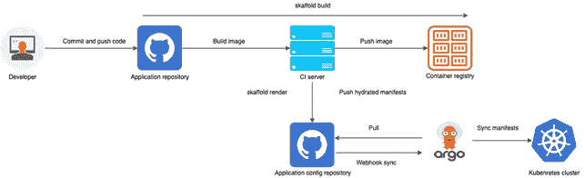

# 九、使用 Skaffold 创建生产就绪的 CI/CD 管道

在前一章中，我们学习了如何使用 Skaffold 将 Spring Boot 应用部署到 Google 云平台。在本章中，重点将是向您介绍 GitHub 动作及其相关概念。我们还将展示如何使用 Skaffold 和 GitHub 操作为 Spring Boot 应用创建生产就绪的**持续集成(CI)** 和**持续部署(CD)** 管道。在最后一节中，我们将熟悉 GitOps 概念，并了解如何使用 Argo CD 和 Skaffold 为 Kubernetes 应用创建一个连续的交付管道。

在本章中，我们将讨论以下主要话题:

*   GitHub 操作入门
*   创建 GitHub 操作工作流程
*   使用 GitHub Actions 和 Skaffold 创建 CI/CD 管道
*   用 Argo CD 和 Skaffold 实现 GitOps 工作流

到本章结束时，您将对如何使用 GitHub Actions 和 Skaffold 创建有效的 CI/CD 管道有一个坚实的理解。

# 技术要求

*   日蚀([https://www.eclipse.org/downloads/](https://www.eclipse.org/downloads/))或者智能智能([https://www.jetbrains.com/idea/download/](https://www.jetbrains.com/idea/download/))
*   GitHub 帐户
*   Spring Boot 2.5
*   OpenJDK 16

来自 GitHub 资源库的代码可以在[https://GitHub . com/packt publishing/Effortless-Cloud-Native-App-Development-using-Skaffold/tree/main/chapter 07](https://github.com/PacktPublishing/Effortless-Cloud-Native-App-Development-using-Skaffold/tree/main/Chapter07)找到。

# GitHub 操作入门

GitHub Actions 允许你从你的 GitHub 库构建、测试和部署你的工作负载 GitHub Actions 是事件驱动的；例如，当某人创建“拉”请求、打开问题、进行部署等时。基于事件触发特定的动作。您甚至可以创建自己的 GitHub 动作，根据您的用例定制工作流。在 https://github.com/marketplace,也有一个很好的市场，在那里你可以将现有的 GitHub 操作整合到你的工作流程中。

GitHub Actions 使用 YAML 语法文件来定义事件、作业、动作和命令。在下图中，您可以看到 GitHub 操作组件的完整列表:


图 9.1–GitHub 动作组件

让我们详细讨论一下 GitHub 的组件:

*   **工作流**:用于在 GitHub 上构建、测试、打包、发布或部署项目。工作流由个任务组成，并由事件触发。工作流是在 GitHub 资源库的`.github/workflows`目录下的 YAML 语法文件中定义的。
*   **事件**:表示触发工作流的活动；例如，将变更推送到一个分支或者创建一个拉取请求。
*   **作业**:这包括在一个跑步者身上执行的步骤。它使用步骤来控制执行动作的顺序。您可以为您的工作流程运行多个作业。它们可以并行或顺序运行。
*   **步骤**:表示一个动作，即检出源代码或 shell 命令。
*   **动作**:这些代表你想要运行的命令，比如检查你的源代码或者下载 JDK。
*   **Runners** :这是一个托管在 GitHub 上的服务器，安装了 runner 应用。你可以托管自己的 runner 或者使用 GitHub 提供的一个。工作流中定义的作业在运行机器上执行。它将结果、进度和日志发送回 GitHub 存储库。GitHub 托管的运行程序支持 Ubuntu Linux、微软 Windows 和 macOS。

现在我们已经了解了 GitHub 动作组件的细节。在下一节中，我们将为 Spring Boot 应用创建一个 GitHub 动作工作流。

# 创建 GitHub 操作工作流

在本节中，我们将创建一个工作流，它将使用 GitHub 动作构建一个 Spring Boot Java 应用。这个工作流将使用`mvn clean install` Maven 构建工具命令构建一个 Spring Boot 应用。以下是使用 Maven 构建 Java 项目的工作流文件示例:

```java
name: Build Java project with Maven
>on:
>  push:
>    branches: [ main ]
>  pull_request:
>    branches: [ main ]
>jobs:
>  build:
>    runs-on: ubuntu-latest
>    steps:
>    - uses: actions/checkout@v2
>    - name: Install and Setup Java 16  
>      uses: AdoptOpenJDK/install-jdk@v1
>      with:
>        version: '16'
>        architecture: x64
>    - name: Build with Maven
>      run: mvn clean install
```

下面是工作流 YAML 文件的解释:

1.  在工作流 YAML 文件中，我们已经订阅了一个`push`和`pull`请求事件。因此，每当主分支提出`pull`请求或推动变更时，这个工作流就会触发。
2.  然后在`jobs`部分中，首先我们指定作业将在 GitHub 托管的`ubuntu` Linux 操作系统 runner 上运行。
3.  在`steps`中，我们已经定义了该工作流需要执行的动作。
4.  首先，我们使用`actions/checkout@v2`在 runner 上检查源代码。
5.  然后我们在安装依赖项，比如 Java。我们使用`AdoptOpenJDK/install-jdk@v1`动作来完成。
6.  在最后一步，我们使用`mvn clean install`命令构建一个 Java 项目。

让我们来看看这个工作流程的运行情况。所以接下来，我们将在 GitHub 存储库中创建这个工作流，并通过将更改推送到主分支来触发工作流。

在这次演示中，我们将使用我们在第七章*中创建的 Spring Boot 应用，使用云代码插件*构建和部署一个 Spring Boot 应用。我已经详细解释了该应用，因此在此不再赘述:

1.  The first step is to create the workflow YAML file inside your GitHub repository. This can be done by navigating to the **Actions** tab in your GitHub repository and clicking on the **set up a workflow yourself** link as shown in the following screenshot:

    图 9.2–GitHub 操作入门

    在下一个屏幕中，粘贴我们之前讨论的工作流 YAML 文件的内容。参考以下截图:

    

    图 9.3–创建工作流

    在您点击**开始提交**按钮上的之后，一个新的提交消息窗口将会打开，您可以在其中输入提交消息。

2.  Then click on **Commit new file** to add the workflow file to the GitHub repository:

    图 9.4–提交工作流文件

3.  在存储库中，现在您可以看到有一个`.github/workflows`目录，在该目录中，我们有`main.yml`工作流文件:


图 9.5–添加到存储库中的 GitHub 工作流文件

这也创建了一个提交，并将一个变更推送到存储库中，从而触发了工作流。在下面的屏幕截图中，您可以看到工作流已触发并正在进行中:


图 9.6–执行 GitHub 工作流

在下面的屏幕截图中，您可以看到管道为绿色，触发的工作流已成功完成:


图 9.7–GitHub 工作流成功完成

我们已经使用 GitHub Actions 成功构建了一个 Spring Boot 应用。下一节将使用 Skaffold 和 GitHub 操作从 GitHub 存储库中为 Spring Boot 应用创建 CI/CD 管道。

# 使用 GitHub Actions 和 Skaffold 创建 CI/CD 管道

CI 和 CD 是 DevOps 生命周期的主要支柱。顾名思义，**持续集成** ( **CI** )是一种软件开发实践，开发人员每天数次将代码提交给版本控制系统。在**连续部署** ( **CD** )中，软件功能通过自动化部署频繁交付，在此过程中没有人工干预或批准。只有失败的测试才会暂停您的生产部署。另一个经常与持续部署混淆的是持续交付，但它们在现实中是不同的。在连续交付中，主要关注的是发布和发布策略，并在获得批准的情况下将实际部署到生产中。它通常被称为**单击部署**。

到目前为止，您应该已经对 GitHub Actions 是如何由事件驱动的有了一些了解，并且可以自动化您的软件开发任务。您还将了解到，您可以使用 GitHub 动作从 GitHub 存储库中触发整个 CI/CD 管道，这些动作基于某些事件，例如 Git push 或在特定分支上创建 pull 请求。

本节将重点介绍使用 Skaffold 和 GitHub 操作将 Spring Boot 应用部署到 Google Kubernetes 引擎。该工作流将密切模仿我们通常使用 CI/CD 管道在生产中进行部署的方式。

在我们进一步执行这项任务之前，我们应该了解一些先决条件。以下是一些突出的先决条件。

## 先决条件

请注意以下先决条件:

*   您需要创建一个新的 Google Cloud 项目(或者选择一个现有的项目)。这部分已经在 [*第八章*](B17385_08_Final_PD_ePub.xhtml#_idTextAnchor099) 、*用 Skaffold* 部署一个 Spring Boot 微服务到 Google 云平台，我们会用同一个项目。
*   请确保您启用了**容器注册表**和 **Kubernetes 引擎**API。
*   你还需要创建一个新的谷歌 Kubernetes 引擎集群或者选择一个现存的 GKE 集群。
*   如果还没有完成，您还需要为服务帐户创建一个 JSON 服务帐户密钥，并添加 Kubernetes 引擎开发人员和存储管理员角色。服务帐户密钥是从外部访问您的云资源的安全方式。为了建立服务帐户的身份，需要使用公钥/私钥对。公钥存储在 Google Cloud 中，私钥可供您使用。
*   要创建服务账户密钥，请点击谷歌云控制台左侧导航栏上的 **IAM & Admin** 。点击**服务账户**，您将看到以下屏幕:


图 9.8-您的 GCP 项目的服务客户

*   现在点击服务帐户的电子邮件地址，并从右侧的选项卡中选择**键**。点击**添加密钥**，选择**创建新密钥，**，如下图所示:


图 9.9–向您的服务帐户添加密钥

为**键类型**选择 **JSON** ，点击**上的创建**。它会将密钥下载到您的系统中，如下所示:


图 9.10–为您的服务帐户选择密钥类型

*   You need to add the following Cloud IAM roles to your service account:

    a.Kubernetes 引擎开发者:这个角色将允许你被部署到 GKE。

    b.**存储管理员**:该角色将允许您将容器映像发布到 Google 容器注册表:


图 9.11–为您的服务帐户添加角色

*   Add the following secrets to your GitHub repository's secrets. You can add GitHub repository secrets by navigating to the **Settings** tab and then clicking on **Secrets** on the left-hand side navigation bar. There, click on **New repository secret** and add the following secrets:

    a. **PROJECT_ID** :谷歌云项目 ID

    b. **SERVICE_ACCOUNT_KEY** :服务账户 JSON 文件的内容

    参考以下截图:


图 9.12–向 GitHub 存储库添加秘密

至此，我们已经完成了所有的先决条件。在下一节中，我们将使用 GitHub Actions 和 Skaffold 创建一个 CI/CD 管道。

### 用 GitHub Actions 和 Skaffold 实现 CI/CD 工作流

在本节中，我们将使用 Skaffold 和 GitHub 操作创建一个生产就绪的 CI/CD 管道。

下图展示了带有 Skaffold 和 GitHub 操作的 CI/CD 工作流:


图 9.13–ska fold 的 CI/CD 工作流程

我们将使用下面的工作流 YAML 文件。在这里，我解释了工作流 YAML 文件，并在每个步骤中添加了注释:

1.  指定工作流的名称和事件:

    ```java
    name: Deploy to GKE
    >on:
    >  push:
    >    branches:
    >      - main
    ```

2.  然后我们将 GitHub 秘密作为环境变量:

    ```java
    env:
    >  PROJECT_ID: ${{ secrets.PROJECT_ID }}
    >  GKE_CLUSTER: autopilot-cluster-1
    >  GKE_ZONE: us-central1
    >  SKAFFOLD_DEFAULT_REPO: gcr.io/${{ secrets.PROJECT_ID
    >  }}/breathe
    ```

3.  接下来，我们定义在 GitHub 托管的 UbuntuLinux runner:

    ```java
    jobs:
    >  deploy:
    >    name: Deploy
    >    runs-on: ubuntu-latest
    >    env:
    >      ACTIONS_ALLOW_UNSECURE_COMMANDS: 'true'
    ```

    上运行的作业
4.  在定义步骤时，第一步是检查源代码，然后安装 Java 16:

    ```java
        steps:
    >      - name: Check out repository on main branch
    >        uses: actions/checkout@v1
    >        with:
    >          ref: main
    >      - name: Install Java 16  
    >        uses: AdoptOpenJDK/install-jdk@v1
    >        with:
    >          version: '16'
    >          architecture: x64
    ```

5.  然后我们设置为`gcloud` CLI:

    ```java
          - name: Install gcloud
    >        uses: google-github-actions/setup-
    >              gcloud@master
    >        with:
    >          version: "309.0.0"
    >          service_account_key: ${{
    >            secrets.SERVICE_ACCOUNT_KEY }}
    >          project_id: ${{ secrets.PROJECT_ID }}
    >          export_default_credentials: true
    ```

6.  接下来，下载`kubectl`进行部署后验证，下载`skaffold`进行连续交付:

    ```java
          - name: Install kubectl and skaffold
    >        uses: daisaru11/setup-cd-tools@v1
    >        with:
    >          kubectl: "1.19.2"
    >          skaffold: "1.29.0"
    ```

7.  接下来，缓存依赖项等工件以提高工作流执行时间:

    ```java
          - name: Cache skaffold image builds & config
    >        uses: actions/cache@v2
    >        with:
    >          path: ~/.skaffold/
    >          key: fixed-${{ github.sha }}
    ```

8.  Configure docker to use the gcloud command-line tool as a credential helper for authentication:

    ```java
          - name: Configure docker
    >        run: |
    >          gcloud --quiet auth configure-docker
    ```

    使用`skaffold run`命令获取 GKE 凭证并部署到集群，如下所示:

    ```java
          - name: Connect to cluster
    >        run: |
    >          gcloud container clusters get-credentials
    >            "$GKE_CLUSTER" --zone "$GKE_ZONE"
    ```

9.  最后，使用`skaffold run`构建并部署到 GKE，并使用`kubectl get all`进行验证。部署后:

    ```java
          - name: Build and then deploy to GKE cluster
    >              with Skaffold
    >        run: |
    >          skaffold run
    >      - name: Verify deployment
    >        run: |
    >          kubectl get all
    ```

您可以在您的项目中使用这个工作流 YAML 文件，并用您的值替换秘密。如果您已经将`skaffold.yaml`文件放在了您的存储库的根目录下，那么就可以了，否则您可以使用`skaffold run`命令传递`–filename`标志来指向 Skaffold 配置文件。

如果工作流成功执行，您应该会看到以下输出:


图 9.14-使用 Skaffold 成功构建并部署到 GKE

在本节中，我们已经使用 Skaffold 和 GitHub 操作，通过 GitHub 存储库中的定制 CI/CD 管道，成功地构建并部署了一个 Spring Boot 应用到一个远程集群。

接下来，让我们在了解 Argo CD 和 Skaffold 是什么的同时，看看我们是如何用它们实现工作流的。

# 使用 Argo CD 和 Skaffold 实现 GitOps 工作流

在 [*第四章*](B17385_04_Final_PD_ePub.xhtml#_idTextAnchor044) ，*了解 Skaffold 的特性和架构*中，在解释 Skaffold 特性的同时，我们简要地谈了一下关于我们如何使用`skaffold render`和`skaffold apply`命令用 Skaffold 创建一个 GitOps 风格的连续交付工作流。在本节中，我们将使用 Skaffold 和 Argo CD 实现一个 GitOps 工作流。但是首先让我们了解一下 GitOps 是什么以及它的好处。

## 什么是 GitOps，它有什么好处？

T2 这个词是由一家名为 Weaveworks 的公司创造的。GitOps 背后的想法是将 Git 视为应用和声明性基础设施的单一事实来源。使用 Git 来管理您的声明式基础设施让开发人员很容易，因为他们每天都要与 Git 进行交互。一旦您在 Git 中添加了配置，您就获得了版本控制的好处，比如使用拉请求、审计和法规遵从性来审查变更。

使用 GitOps，我们可以创建自动化的管道，当有人将更改推送到 Git 存储库时，可以将更改推出到您的基础架构中。然后，我们使用 GitOps 工具将您的应用的实际生产状态与您在源代码控制下定义的状态进行比较。然后，当您的群集与生产中的不匹配时，它还会告诉您，并自动或手动将其调整到所需的状态。这是真正的 CD。

您可以通过简单的`git` `revert`从 Kubernetes 轻松回滚您的更改。在灾难场景中，或者如果有人不小心破坏了您的整个 Kubernetes 集群，我们可以从 Git 快速复制您的整个集群基础设施。

现在，让我们了解一下 GitOps 的一些好处:

*   使用 GitOps，团队每天将 30-100 个变更交付给生产。当然，您需要使用部署策略，比如 blue-green 和 canary 来验证您的更改，然后将它们提供给所有用户。总的好处是提高了开发人员的生产力。
*   你可以通过 GitOps 获得更好的开发者体验，因为开发者正在推动代码而不是容器。而且，他们使用 Git 等熟悉的工具，不需要了解 Kubernetes 的内部(也就是`kubectl`命令)。
*   通过将声明性基础设施作为代码放入 Git 存储库中，您可以自动获得一些好处，比如集群的审计跟踪，比如谁在何时做了什么。它进一步确保了您的 Kubernetes 集群的合规性和稳定性。
*   如果发生灾难，您还可以更快地恢复集群，从几个小时到几分钟，因为您的整个系统都是用 Git 描述的。
*   您的应用代码已经在 Git 上，使用 GitOps，您的操作任务是相同的端到端工作流的一部分。您在整个组织中拥有一致的 Git 工作流。

公平地说，我们也涵盖了 Argo CD 的一些细节，以便更容易理解后面的部分，即我们使用 Skaffold 和 Argo CD 实现 GitOps 工作流的部分。

## 什么是 Argo CD？

根据 **Argo CD** 、[https://argo-cd.readthedocs.io/en/stable/](https://argo-cd.readthedocs.io/en/stable/)的官方文档，它是一个用于 Kubernetes 的声明式 GitOps 连续交付工具。在前面的部分，我们使用了术语 *GitOps tool* ，如果应用状态偏离了我们在 Git 存储库中定义的状态，它可以比较和同步应用状态，因此可以肯定地说 Argo CD 是处理这种自动化的工具。Kubernetes 向我们介绍了控制循环的概念，通过控制循环，Kubernetes 检查运行的副本数量是否与所需的副本数量相匹配。Argo CD 利用了同样的**Kubernetes**(**K8s**)能力，其核心组件是`argocd-application-controller`，基本上是一个 Kubernetes 控制器。它监控应用的状态，并相应地调整集群。

现在是时候通过在 Google Kubernetes 引擎上用 Skaffold 和 Argo CD 实现 GitOps 来了解它了。我们开始吧。

## 用 Argo CD 和 Skaffold 在 GKE 上连续交货

在我们开始之前，我们需要确保我们已经满足了以下先决条件。

*   我们首先需要安装`kubectl`。
*   当前的 Kubernetes 上下文被设置为远程 GKE 集群。您可以使用`kubectl config current-context`命令验证当前上下文。

我们可以在本地的 Kubernetes 集群上运行这个演示，但是，理想情况下，您可以使用托管的 Kubernetes 服务(如 GKE)来运行它。让我们开始吧:

1.  First, we will install Argo CD on GKE using the following command:

    ```java
    kubectl create namespace argocd 
    >kubectl apply -n argocd -f 
    >https://raw.githubusercontent.com/argoproj/argo-cd/stable/manifests/install.yaml
    ```

    我们创建了一个单独的名称空间，`argocd,`，所有 Argo CD 相关的组件都将是它的一部分。我们可以通过导航到 GKE 下的工作负载部分来验证安装。

    在下面的截图中，您可以看到 Argo CD stateful set 组件，即`argocd-application-controller`，以及`argocd-server`等部署组件已在 GKE 上启动并运行:

    

    图 9.15-部署到 GKE 的 Argo CD Kubernetes 资源

    接下来，我们可以安装 Argo CD CLI。这个是可选步骤，因为我们将使用 Argo CD UI。

2.  Next, we need to expose the Argo CD API server as by default it is not exposed for external access. We can run the following command to change the service type to `LoadBalancer`:

    ```java
    kubectl patch svc argocd-server -n argocd -p '{"spec": {"type": "LoadBalancer"}}'
    ```

    在下面的屏幕截图中，您可以看到服务类型已更改为`External load balancer`，我们将使用该 IP 地址访问 Argo CD GUI:

    

    图 9.16-Argo CD API 服务器公开为负载平衡器

    您甚至可以使用入口或`kubectl`端口转发来访问 Argo CD API 服务器，而不会暴露服务。

3.  We can now access the Argo CD GUI using the default admin user name and get the password using the following command:

    ```java
    kubectl -n argocd get secret argocd-initial-admin-secret -o jsonpath="{.data.password}" | base64 -d
    ```

    您应该会看到以下登录屏幕:

    

    图 9.17-Argo CD 登录屏幕

    登录后点击 **+新建 APP** 按钮，如下图截图所示:

    

    图 9.18–创建应用

    在下一个屏幕中，输入您的应用名称，选择默认项目，并将**同步策略**设置为**自动**:

    

    图 9.19-Argo CD 应用上线

4.  输入源 Git 存储库的 URL。提供 Git 存储库中 Kubernetes 清单的路径。Argo CD 每 3 分钟轮询一次您的 Git 存储库，将更新的清单应用到您的 Kubernetes 集群。您可以通过设置 webhook 事件来避免这种延迟:


图 9.20-向 Argo CD 提供应用 Git 存储库详细信息

对于**目的地**，将集群设置为集群内，将**命名空间**设置为**默认值**，如下图所示:


图 9.21–向 Argo CD 提供目的地群集详细信息

填写完所需的信息后，点击界面顶部的**创建**来创建应用。点击 **CREATE** 按钮后，在路径`Chapter09/gitops`的 Git 存储库中可用的 Kubernetes 清单被检索，Argo CD 对这些清单执行`kubectl apply`:


图 9.22–创建应用

创建应用后，您应该会看到下面的屏幕。**状态**是**进展**:


图 9.23–应用创建和同步

点击应用，您将看到以下屏幕:


图 9.24–应用已部署并处于健康状态

您可以看到此处列出的部署、`svc`和 pod。应用**同步状态**为**已同步**并且**应用健康**为**健康**。Argo CD 为不同的 Kubernetes 资源类型(如部署和复制集)提供了内置的健康检查。

我们已经为我们的应用设置了连续交付工作流，并且应用已经成功同步。现在，我们将尝试通过以下步骤进行一些局部更改来测试工作流:

1.  使用`skaffold config set default-repo gcr.io/project-id`命令将默认的容器注册表设置为 GCR。
2.  我们将使用`skaffold build`命令构建、标记和推送容器图像。
3.  然后我们将运行`skaffold render`命令。该命令将生成 hydrated(即，带有新生成的图像标签)Kubernetes 清单到一个文件中，我们稍后将提交该文件并将其推送到 Git 存储库。使用 Argo CD 的 GitOps 管道将挑选这些更改并将其同步到目标 Kubernetes 集群。

让我们从这个过程开始。

我们将对代码进行修饰，将副本从一个增加到两个，并运行`skaffold render`命令。按照`skaffold.yaml`文件，Kubernetes 清单在 k8s 目录中定义。在运行`skaffold render`命令时，我们还将传递`--output=gtipos/manifest.yaml`标志，以便稍后可以将其推送到 Git 存储库。以下是输出:

```java
skaffold build && skaffold render --output=gtipos/manifest.yaml 
>Generating tags...
>- breathe -> gcr.io/basic-curve-316617/breathe:99b8380-dirty
>Checking cache...
>- breathe: Not found. Building
>Starting build...
>Building [breathe]...
```

我只是想让强调`skaffold render`不会重新生成,而是会使用现有的 Kubernetes 清单并用新标签更新图像。

最后，我们使用以下命令提交更改并将它们推送到 GitHub 存储库:

```java
git commit -m  "changing number of replicas" && git push
```

推送后不久，Argo CD 会将更改同步到 GKE 集群，如下图所示:


图 9.25–副本数量增加

在屏幕截图中，您可以看到，由于我们增加了副本的数量，现在我们有两个 pod 在运行。

下面的屏幕截图展示了一个使用 Skaffold 和 Argo CD 的典型 GitOps 工作流。到目前为止，我们几乎已经完成了相同的步骤。让我们试着总结一下到目前为止我们所学的内容。



图 9.26–使用 Skaffold 和 Argo CD 的 GitOps 工作流程

从截图中我们可以得出以下结论:

*   开发人员将代码更改提交并推送到 Git 存储库。
*   持续集成管道开始运作，使用 skaffold build，我们将构建、标记和推送图像到容器注册。
*   我们还将使用 skaffold render 生成水合清单，并将它们提交给相同或不同的存储库。
*   使用 CI webhook 触发同步操作，或者由运行在 Kubernetes 集群中的 Argo CD 控制器在定期轮询间隔后提取更改。
*   此外，Argo CD 控制器将把实时状态与期望的目标状态进行比较(按照在配置存储库上完成的 git 提交)。
*   如果 Argo CD 检测到应用不同步，它会将最新的更改应用到 Kubernetes 集群。

在这一节中，我们学习了如何结合两个强大的工具:Skaffold 和 Argo CD 来创建 GitOps 管道。我们可以使用`skaffold apply`命令来代替 Argo CD，但是`skaffold apply`命令总是使用`kubetcl`来将资源部署到目标集群。如果你有一个应用捆绑为舵图，那么它将无法工作。此外，使用 Argo CD，您可以结合 Argo 部署来进行蓝绿色和淡黄色部署，因为 Skaffold 本身不支持这些部署。

# 总结

在这一章中，你已经学习了如何使用 GitHub 动作来自动化你的开发工作流程。本章一开始，我们解释了 GitHub 动作及其组件。我们用一个例子解释了 GitHub 动作和相关概念。在示例中，我们解释了如何从 GitHub 存储库中构建、测试和部署 Java 应用。然后我们描述了如何使用 Skaffold 和 GitHub 操作为 Kubernetes 应用创建 CI/CD 管道。

您已经发现了如何利用 GitHub 动作并将它们与 Skaffold 结合起来创建 CI/CD 管道。然后在最后一部分，我们深入研究了如何使用 Skaffold 和 Argo CD 设置 GitOps 风格的连续交付工作流。我们已经了解到，在 GitOps 中，我们将 Git 存储库视为与您的基础设施相关的任何变更的唯一真实来源。我们还展示了如何使用 Argo CD 和 Skaffold 实现 GitOps 管道。

在下一章中，我们将讨论 Skaffold 的替代方案，我们还将讨论它的最佳实践和常见缺陷。

# 延伸阅读

*   从 Packt 出版的 Automating workflow with GitHub actions([https://www . packtpub . com/product/Automating-Workflows-with-GitHub-Actions/9781800560406](https://www.packtpub.com/product/automating-workflows-with-github-actions/9781800560406))了解有关使用 GitHub Actions 实现工作流自动化的更多信息。
*   从 Packt 出版的 GitHub Essentials([https://www . packtpub . com/product/GitHub-Essentials-second-edition/9781789138337](https://www.packtpub.com/product/github-essentials-second-edition/9781789138337))了解更多关于 GitHub 的信息。