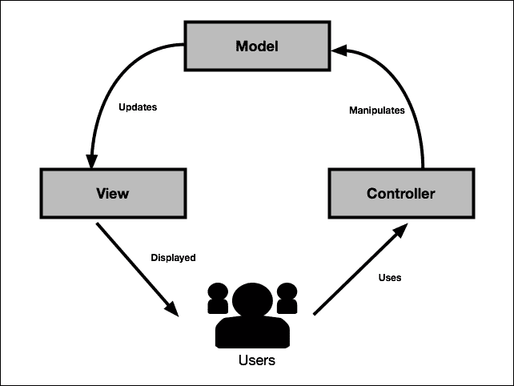
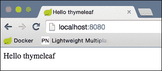
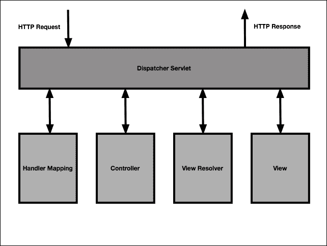
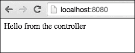
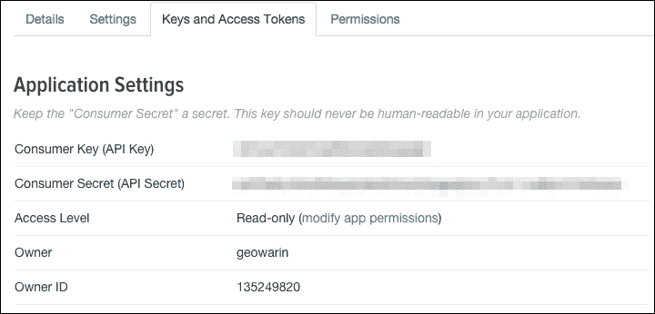
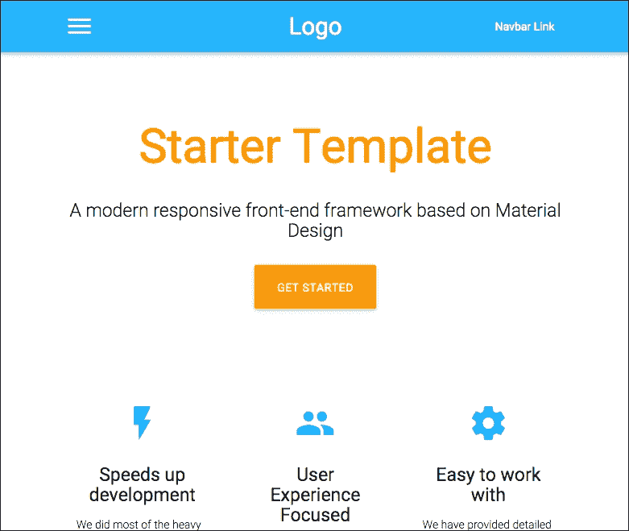
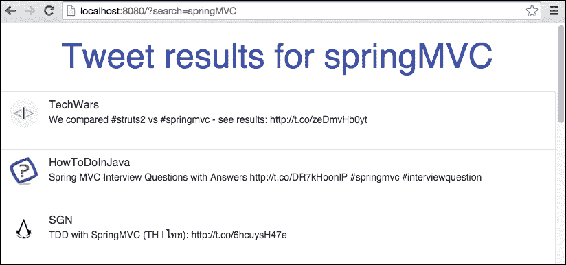
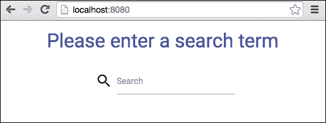
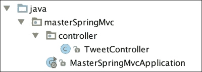
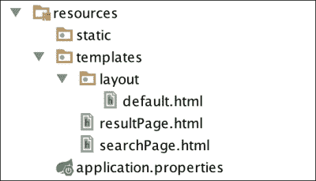

# 第二章。掌握 MVC 架构

在这一章中，我们将讨论 MVC 架构原则，并看看 Spring MVC 是如何实现这些原则的。

我们将继续使用前一章的应用，并构建一些更有趣的东西。我们的目标是设计一个简单的页面，用户可以搜索符合特定标准的推文，并显示给我们的用户。

为了实现这一点，我们将使用春季社交 Twitter 项目，该项目可在[http://projects.spring.io/spring-social-twitter/](http://projects.spring.io/spring-social-twitter/)获得。

我们将看到如何让 Spring MVC 与一个现代的模板引擎百里香一起工作，并尝试理解框架的内部机制。我们将通过不同的视图路由我们的用户，最后，我们将使用 WebJars 和 Materialize([http://materializecss.com](http://materializecss.com))给我们的应用一个出色的外观。

# MVC 架构

我希望大多数人都熟悉 MVC 首字母缩写的含义。它代表模型视图控制器，被认为是通过分离数据层和表示层来构建用户界面的一种非常流行的方法。



MVC 模式从 Smalltalk 的世界中出现并登陆 Ruby on Rails 框架后，变得非常流行。

该架构模式有三层特征:

*   **模型**:这个由应用知道的数据的各种表示组成。
*   **视图**:这是由将显示给用户的数据的几个表示组成的。
*   **控制器**:这是应用中处理用户交互的部分。它是模型和视图之间的桥梁。

MVC 背后的思想是从模型中分离视图。模型必须是独立的，并且不了解 UI。这基本上允许跨多个视图重用相同的数据。这些观点是看待数据的不同方式。向下钻取或使用不同的呈现器(HTML、PDF)很好地说明了这一原则。

控制器充当用户和数据之间的中介。它的作用是控制终端用户可用的操作，以及通过应用的不同视图进行路由。

# MVC 批评者和最佳实践

虽然 MVC 仍然是设计 UI 的首选方法，但随着它的流行，也出现了许多批评。大多数批评家实际上是在指责模式的不正确使用。

## 贫血域模型

Eric Evans 的有影响力的书*域驱动设计*，也被缩写为 **DDD** ，定义了一组架构规则，导致代码内业务域的更好集成。

核心思想之一是利用领域对象内部的面向对象范例。违背这一原则有时被称为**贫血域模型**。在马丁·福勒的博客([http://www.martinfowler.com/bliki/AnemicDomainModel.html](http://www.martinfowler.com/bliki/AnemicDomainModel.html))上可以找到这个问题的一个很好的定义。

贫血模型通常表现出以下症状:

*   这个模型是由非常简单的老式 Java 对象组成的，只有 getters 和 setters
*   所有的业务逻辑都在服务层内部处理
*   模型的验证是在这个模型之外发现的，例如在控制器中

根据您的业务领域的复杂性，这可能是一种不好的做法。一般来说，DDD 实践需要额外的努力来将领域与应用逻辑隔离开来。

架构总是一种权衡。值得注意的是，设计 Spring 应用的典型方法可能会导致复杂的维护。

如何避免域贫血解释如下:

*   服务层有利于应用级的抽象，如事务处理，而不是业务逻辑。
*   您的域应该始终处于有效状态。使用验证器或 JSR-303 的验证注释将验证留在表单对象中。
*   将输入转换成有意义的领域对象。
*   从带有域查询存储库的角度来考虑您的数据层(例如，参考 Spring 数据规范)
*   将您的领域逻辑从底层持久性框架中分离出来
*   尽可能使用实物。例如，操作`FirstName`类而不是字符串。

DDD 比这些简单的规则有更多的内容:实体、值类型、无处不在的语言、有界上下文、洋葱架构和反腐败层。我强烈建议你自己学习这些原则。就我们而言，在这本书里，我们将在制作 web 应用时，努力记住前面列出的指导原则。随着本书的深入，你会对这些问题更加熟悉。

## 从源头上学习

如果你熟悉 Spring，你可能已经登陆了 Spring 的网站， [http://spring.io](http://spring.io) 。它完全是用 Spring 制作的，好消息是它是开源的。

该项目的代号是 sagan。它有许多有趣的特性:

*   梯度多模块项目
*   安全集成
*   Github 集成
*   弹性搜索集成
*   JavaScript 前端应用

与该项目相关的 GitHub wiki 非常详细，将帮助您轻松开始该项目。

### 注意

如果您对 Spring 的真实应用架构感兴趣，请访问下面的 URL:

[https://github.com/spring-io/sagan](https://github.com/spring-io/sagan)

# 春天 MVC 1-0-1

在 spring MVC 中，模型是封装在 Spring MVC 的`Model`或`ModelAndView`类中的简单地图。它可以来自数据库、文件、外部服务等等。由您来定义如何获取数据并将其放入模型中。与数据层交互的推荐方式是通过 Spring 数据库:Spring Data JPA、Spring Data MongoDB 等等。有十几个项目与 Spring Data 相关，我鼓励你看一看 http://projects.spring.io/spring-data 的。

Spring MVC 的控制器端是通过使用`@Controller`注释来处理的。在 web 应用中，控制器的作用是响应 HTTP 请求。用`@Controller`注释标注的类将被 Spring 选中，并有机会处理即将到来的请求。

通过`@RequestMapping`注释，控制器声明基于它们的 HTTP 方法(例如`GET`或`POST`方法)和它们的 URL 来处理特定的请求。然后，控制器决定要么直接在 web 响应中写入内容，要么将应用路由到一个视图并将属性注入到该视图中。

一个纯粹的 RESTful 应用会选择第一种方法，并在带有`@ResponseBody`注释的 HTTP 响应中直接公开模型的 JSON 或 XML 表示。在 web 应用的情况下，这种类型的架构通常与前端 JavaScript 框架相关联，如 Backbone.js、AngularJS 或 React。在这种情况下，Spring 应用将只处理 MVC 模型的模型层。我们将在[第四章](04.html "Chapter 4\. File Upload and Error Handling")、*文件上传和错误处理*中研究这种架构。

对于第二种方法，模型被传递给视图，视图由模板引擎呈现，然后写入响应。

视图通常与模板方言相关联，这将允许在模型内部导航。模板的流行方言是 JSP、FreeMarker 或百里香叶。

混合方法可以利用模板引擎与应用的某些方面进行交互，然后将视图层委托给前端框架。

# 用百里香叶

百里香是一个得到 Spring 社区特别关注的模板引擎。

它的成功主要归功于其友好的语法(看起来几乎像 HTML)和易于扩展。

各种扩展可用并与 Spring Boot 集成:

<colgroup><col style="text-align: left"> <col style="text-align: left"></colgroup> 
| 

支持

 | 

属国

 |
| --- | --- |
| 布局 | `nz.net.ultraq.thymeleaf:thymeleaf-layout-dialect` |
| HTML5 数据-*属性 | `com.github.mxab.thymeleaf.extras:thymeleaf-extras-data-attribute` |
| Internet Explorer 条件注释 | `org.thymeleaf.extras:thymeleaf-extras-conditionalcomments` |
| 支持 spring 安全 | `org.thymeleaf.extras:thymeleaf-extras-springsecurity3` |

在[http://www . thyme leaf . org/doc/tutorials/2.1/thyme leaf Spring . html](http://www.thymeleaf.org/doc/tutorials/2.1/thymeleafspring.html)可以找到关于 Thymeleaf 与 Spring 集成的非常好的教程。

不再赘言，让我们添加`spring-boot-starter-thymeleaf`依赖项来引导百里香模板引擎:

```java
buildscript {
    ext {
        springBootVersion = '1.2.5.RELEASE'
    }
    repositories {
        mavenCentral()
    }
    dependencies {
        classpath("org.springframework.boot:spring-boot-gradle-plugin:${springBootVersion}") 
        classpath("io.spring.gradle:dependency-management-plugin:0.5.1.RELEASE")
    }
}

apply plugin: 'java'
apply plugin: 'eclipse'
apply plugin: 'idea'
apply plugin: 'spring-boot' 
apply plugin: 'io.spring.dependency-management' 

jar {
    baseName = 'masterSpringMvc'
    version = '0.0.1-SNAPSHOT'
}
sourceCompatibility = 1.8
targetCompatibility = 1.8

repositories {
    mavenCentral()
}

dependencies {
    compile 'org.springframework.boot:spring-boot-starter-web'
    compile 'org.springframework.boot:spring-boot-starter-thymeleaf'
    testCompile 'org.springframework.boot:spring-boot-starter-test'
}

eclipse {
    classpath {
         containers.remove('org.eclipse.jdt.launching.JRE_CONTAINER')
         containers 'org.eclipse.jdt.launching.JRE_CONTAINER/org.eclipse.jdt.internal.debug.ui.launcher.StandardVMType/JavaSE-1.8'
    }
}

task wrapper(type: Wrapper) {
    gradleVersion = '2.3'
}
```

## 第一页

我们现在将添加到我们的应用的第一页。它将位于`src/main/resources/templates`。我们把这个文件叫做`resultPage.html`:

```java
<!DOCTYPE html>
<html xmlns:th="http://www.thymeleaf.org">
<head lang="en">
    <meta charset="UTF-8"/>
    <title>Hello thymeleaf</title>
</head>
<body>
    <span th:text="|Hello thymeleaf|">Hello html</span>
</body>
</html>
```

我们从一开始就可以看到，百里香叶与 html 完美地集成在一起，它的语法几乎让人感觉很自然。

`th:text`值放在管道之间。这意味着文本中的所有值都将被连接起来。

乍一看可能有点尴尬，但实际上，文本很少被硬编码到我们的页面中；所以，百里香在这里做了一个固执己见的设计决定。

对于网页设计者来说，百里叶有一个很大的优势:在没有运行服务器的情况下打开模板时，模板中的所有动态内容都可以恢复到默认值。资源 URL 可以相对指定，每个标记都可以包含占位符。在我们前面的例子中，当视图在我们的应用的上下文中呈现时，文本“Hello html”不会显示，但是如果文件是用 web 浏览器直接打开的，它会显示。

为了加速开发，将这个属性添加到您的`application.properties`文件中:

```java
spring.thymeleaf.cache=false
```

这将禁用视图缓存，并导致每次访问模板时都要重新加载模板。

当然，当我们投入生产时，需要禁用该设置。我们将在[第 8 章](08.html "Chapter 8\. Optimizing Your Requests")、*中看到优化您的请求*。

### Tip

**重新加载视图**

在禁用缓存的情况下，只需用 eclipse 保存视图，或者使用 IntelliJ 中的`Build > Make Project`操作在更改后刷新视图。

最后，我们需要修改我们的`HelloController`类。它现在必须路由到我们新创建的视图，而不是显示纯文本。为此，我们将移除`@ResponseBody`注释。这样做仍然返回一个字符串，这将告诉 Spring MVC 将这个字符串映射到一个视图名称，而不是直接在响应中显示一个特定的模型。

这是我们的控制器现在的样子:

```java
@Controller
public class HelloController {

    @RequestMapping("/")
    public String hello() {
        return "resultPage";
    }
}
```

在这个例子中，控制器将用户重定向到视图名称`resultPage`。然后，`ViewResolver`接口会将这个名称与我们的页面关联起来。

让我们再次启动我们的应用，并转到`http://localhost:8080`。

您将看到以下页面:



# Spring MVC 架构

让我们从这个壮观的新“Hello World”后退一步，试着理解我们的 web 应用内部发生了什么。为此，我们将追溯我们的浏览器发送的 HTTP 请求和它从服务器得到的响应的旅程。

## 调度员服务网

每个 Spring web 应用的入口点就是`DispatcherServlet`。下图说明了 Dispatcher Servlet 架构:



这是一个经典的`HttpServlet`类，它将 HTTP 请求分派给 HandlerMapping。一个**句柄映射**T3】是一个资源(URL)和控制器的关联。

然后在控制器上调用适当的方法——那些用`@RequestMapping`注释标注的方法。在这个方法中，控制器设置模型数据，并将视图名返回给调度程序。

然后，`DispatcherServlet`将询问`ViewResolver`接口，以找到视图的相应实现。

在我们的例子中，`ThymeleafAutoConfiguration`类已经为我们设置了视图解析器。

您可以在`ThymeleafProperties`类中看到，我们的视图的默认前缀是`classpath:/templates/`，默认后缀是`.html`。

这意味着，给定视图名称`resultPage`，视图解析器将在我们的类路径的模板目录中查找名为`resultPage.html`的文件。

在我们的应用中，我们的`ViewResolver`接口是静态的，但是更高级的实现可以根据请求头或用户的地区返回不同的结果。

视图将最终被渲染，结果被写入响应。

## 将数据传递给视图

我们的第一页是完全静态的；它没有真正利用 Spring MVC 的强大功能。让我们给事情加点料。如果“Hello World”字符串不是硬编码的，而是来自服务器，会怎么样？

你说它仍然是一个蹩脚的“你好世界”？是的，但是它会带来更多的可能性。让我们修改我们的`resultPage.html`文件来显示来自模型的消息:

```java
<!DOCTYPE html>
<html xmlns:th="http://www.thymeleaf.org">
<head lang="en">
    <meta charset="UTF-8"/>
    <title>Hello thymeleaf</title>
</head>
<body>
    <span th:text="${message}">Hello html</span>
</body>
</html>
```

然后，让我们修改我们的控制器，使其将此消息放入此模型中:

```java
@Controller
public class HelloController {

    @RequestMapping("/")
    public String hello(Model model) {
        model.addAttribute("message", "Hello from the controller");
        return "resultPage";
    }
}
```

我知道，悬念是杀了你！让我们看看`http://localhost:8080`长什么样。



要注意的第一件事是，我们向控制器的方法传递了一个新参数，并且`DispatcherServlet`为我们提供了正确的对象。事实上，有许多对象可以被注入到控制器的方法中，比如`HttpRequest`或`HttpResponse`、`Locale`、`TimeZone`和`Principal`，它们代表一个经过身份验证的用户。这些对象的完整列表可以在文档中找到，可以在[http://docs . spring . io/spring/docs/current/spring-framework-reference/html/MVC . html # MVC-ann-arguments](http://docs.spring.io/spring/docs/current/spring-framework-reference/html/mvc.html#mvc-ann-arguments)找到。

# 春天表情语

当使用`${}`语法时，你实际上是在使用 **Spring 表达式语言** ( **SpEL** )。在野外有几种 EL 变体；SpEl 是最强大的变体之一。

以下是其主要功能的概述:

<colgroup><col style="text-align: left"> <col style="text-align: left"> <col style="text-align: left"></colgroup> 
| 

特征

 | 

句法

 | 

说明

 |
| --- | --- | --- |
| 访问列表元素 | `list[0]` |  |
| 访问地图条目 | `map[key]` |  |
| 三元运算符 | `condition ? 'yes' : 'no'` |  |
| Elvis 操作员 | `person ?: default` | 如果人员的值为空，则返回`default` |
| 安全航行 | `person?.name` | 如果人员或她的姓名为空，则返回`null` |
| 模板 | `'Your name is #{person.name}'` | 将值注入到字符串中 |
| 预测 | `${persons.![name]}` | 提取所有人的名字并将它们放入一个列表中 |
| 选择 | `persons.?[name == 'Bob']'` | 检索列表中名字为 Bob 的人 |
| 函数调用 | `person.sayHello()` |  |

### 注意

如需完整的参考，请查看位于[http://docs . spring . io/spring/docs/current/spring-framework-reference/html/expressions . html](http://docs.spring.io/spring/docs/current/spring-framework-reference/html/expressions.html)的手册。

SpEl 的用法不限于视图。您还可以在 Spring 框架内的不同地方使用它，例如，当使用`@Value`注释在 beans 内注入属性时。

## 使用请求参数获取数据

我们能够在视图中显示来自服务器的数据。然而，如果我们想从用户那里得到输入呢？使用 HTTP 协议，有多种方法可以做到这一点。最简单的方法是向我们的 URL 传递一个查询参数。

### 注意

**查询参数**

你当然知道的查询参数。它们位于 URL 中的`?`字符之后。它们由名称和值的列表组成，用符号&(与符号)分隔，例如`page?var1=value1&var2=value2`。

我们可以利用这种技术来询问用户的姓名。让我们再次修改我们的`HelloController`类:

```java
@Controller
public class HelloController {

    @RequestMapping("/")
    public String hello(@RequestParam("name") String userName, Model model) {
        model.addAttribute("message", "Hello, " + userName);
        return "resultPage";
    }
}
```

如果我们导航到`localhost:8080/?name=Geoffroy`，我们可以看到以下内容:


默认情况下，请求参数是必需的。这意味着如果我们导航到`localhost:8080`，我们将会看到一条错误消息。

查看`@RequestParam`代码中的,我们可以看到除了 value 参数之外，还有另外两个可能的属性:`required`和`defaultValue`。

因此，我们可以更改代码，为参数指定一个默认值，或者指出它不是必需的:

```java
@Controller
public class HelloController {

    @RequestMapping("/")
    public String hello(@RequestParam(defaultValue = "world") String name, Model model) {
        model.addAttribute("message", "Hello, " + name);
        return "resultPage";
    }
}
```

### Tip

在 Java 8 中，可以不指定 value 参数。在这种情况下，将使用带注释的方法参数的名称。

# 【Hello Worlds 到此为止，让我们来获取 tweets 吧！

好吧，这本书的名字毕竟不是“掌握你好世界”。有了 Spring，审问 Twitter 的 API 真的很容易。

## 注册您的应用

在开始之前，你必须在 Twitter 开发者控制台中注册你的应用。

转到[https://apps.twitter.com](https://apps.twitter.com)并创建一个新应用。

随便你给它起什么名字。在网站和回拨网址部分，只需输入`http://127.0.0.1:8080`。这将允许您在本地机器上测试开发中的应用。


现在，导航到密钥，访问令牌，并复制**消费者密钥**和**消费者秘密**。我们一会儿会用到它。看一下下面的截图:



默认情况下，我们的应用具有只读权限。这对于我们的应用来说已经足够了，但是如果您愿意的话，您可以对其进行调整。

## 建立春季社交推特

我们将把下面的依赖项添加到我们的`build.gradle`文件:

```java
compile 'org.springframework.boot:spring-boot-starter-social-twitter'
```

### 注意

Spring Social 是一组提供各种社交网络公共 API 的项目。开箱即用，Spring Boot 提供了与 Twitter、脸书和 LinkedIn 的集成。春季社交包括总共约 30 个项目，可在 http://projects.spring.io/spring-social/找到。

将以下两行添加到`application.properties`:

```java
spring.social.twitter.appId= <Consumer Key>
spring.social.twitter.appSecret= <Consumer Secret>
```

这些是与我们刚刚创建的应用相关联的键。

你将在第 6 章、*保护你的应用*中了解更多关于 OAuth 的内容。现在，我们将使用这些凭证代表我们的应用向 Twitter 的 API 发出请求。

## 访问 Twitter

我们现在可以在控制器中使用 Twitter 了。让我们将它的名称改为`TweetController`作为一个变量，以更好地反映它的新职责:

```java
@Controller
public class HelloController {

    @Autowired
    private Twitter twitter;

    @RequestMapping("/")
    public String hello(@RequestParam(defaultValue = "masterSpringMVC4") String search, Model model) {
        SearchResults searchResults = twitter.searchOperations().search(search);
        String text = searchResults.getTweets().get(0).getText();
        model.addAttribute("message", text);
        return "resultPage";
    }
}
```

如您所见，代码搜索与请求参数匹配的 tweets。如果一切顺利，您将在屏幕上看到第一条消息的文本:


当然，如果搜索没有产生任何结果，我们笨拙的代码会以`ArrayOutOfBoundException`失败。所以，不要犹豫，用推特来解决问题吧！

如果我们想显示一个 tweets 列表会怎么样？让我们修改一下`resultPage.html`文件:

```java
<!DOCTYPE html>
<html xmlns:th="http://www.thymeleaf.org">
<head lang="en">
    <meta charset="UTF-8"/>
    <title>Hello twitter</title>
</head>
<body>
    <ul>
 <li th:each="tweet : ${tweets}" th:text="${tweet}">Some tweet</li>
 </ul>
</body>
</html>
```

### 注意

`th:each`是在百里叶中定义的一个标签，它允许遍历一个集合，并将每个值赋给循环中的一个变量。

我们还需要更换我们的控制器:

```java
@Controller
public class TweetController {

    @Autowired
    private Twitter twitter;

    @RequestMapping("/")
    public String hello(@RequestParam(defaultValue = "masterSpringMVC4") String search, Model model) {
        SearchResults searchResults = twitter.searchOperations().search(search);
        List<String> tweets =
 searchResults.getTweets()
 .stream()
 .map(Tweet::getText)
 .collect(Collectors.toList());
 model.addAttribute("tweets", tweets);
        return "resultPage";
    }
}
```

注意，我们使用 Java 8 streams 只从 tweets 中收集消息。`Tweet`类包含许多其他属性，比如发送者、转发计数等等。然而，我们现在将保持简单，如下面的截图所示:


# Java 8 流和 lambdas

你可能还不熟悉兰姆达斯。在 Java 8 中，每个集合都有一个默认的方法`stream()`，它提供了对函数式操作的访问。

这些操作可以是返回流的中间操作，因此允许链接，或者是返回值的终端操作。

最著名的中间操作如下:

*   `map`:将方法应用到列表的每个元素，并返回结果列表
*   `filter`:这将返回匹配谓词的每个元素的列表
*   `reduce`:使用一个操作和一个累加器将一个列表投影成一个值

Lambdas 是函数表达式的速记语法。它们可以被强制转换成一个抽象方法，一个只有一个函数的接口。

例如，您可以如下实现`Comparator`接口:

```java
Comparator<Integer> c = (e1, e2) -> e1 - e2;
```

在 lambdas 中，return 关键字隐式地是它的最后一个表达式。

我们前面使用的双冒号操作符是一种快捷方式，

```java
Tweet::getText
```

上述内容相当于以下内容:

```java
(Tweet t) -> t.getText()
```

`collect`方法允许我们调用一个终端操作。`Collectors`类是一组终端操作，将结果放入列表、集合或映射中，允许分组、连接等等。

调用`collect(Collectors.toList())`方法将产生一个包含流中每个元素的列表；在我们的例子中，推文名称。

# 使用 WebJars 进行材料设计

我们的应用已经很棒了，但是从美学角度来看，它还有一些需要改进的地方。你可能听说过材料设计。这是谷歌在平面设计上采取的。

我们将使用 Materialize([http://materializecss.com](http://materializecss.com))，一个很棒的响应 CSS 和 JavaScript 库，就像 Bootstrap 一样。



我们在[第一章](01.html "Chapter 1\. Setting Up a Spring Web Application in No Time")、*中谈到了 WebJars，很快就建立了一个 Spring Web 应用*；我们将现在开始使用它们。将 jQuery 和 Materialize CSS 添加到依赖项中:

```java
compile 'org.webjars:materializecss:0.96.0'
compile 'org.webjars:jquery:2.1.4'
```

WebJar 的组织方式是完全标准化的。你会在`/webjars/{lib}/{version}/*.js`中找到任何库的 JS 和 CSS 文件。

例如，要将 jQuery 添加到我们的页面，需要在网页中添加以下内容:

```java
<script src="/webjars/jquery/2.1.4/jquery.js"></script>
```

让我们修改我们的控制器，使它给出所有 tweet 对象的列表，而不是简单的文本:

```java
package masterSpringMvc.controller;

import org.springframework.beans.factory.annotation.Autowired;
import org.springframework.social.twitter.api.SearchResults;
import org.springframework.social.twitter.api.Tweet;
import org.springframework.social.twitter.api.Twitter;
import org.springframework.stereotype.Controller;
import org.springframework.ui.Model;
import org.springframework.web.bind.annotation.RequestMapping;
import org.springframework.web.bind.annotation.RequestParam;

import java.util.List;

@Controller
public class TweetController {

    @Autowired
    private Twitter twitter;

    @RequestMapping("/")
    public String hello(@RequestParam(defaultValue = "masterSpringMVC4") String search, Model model) {
        SearchResults searchResults = twitter.searchOperations().search(search);
        List<Tweet> tweets = searchResults.getTweets();
        model.addAttribute("tweets", tweets);
        model.addAttribute("search", search);
        return "resultPage";
    }
}
```

让我们在我们的视图中包含物化 CSS:

```java
<!DOCTYPE html>
<html xmlns:th="http://www.thymeleaf.org">
<head lang="en">
    <meta charset="UTF-8"/>
    <title>Hello twitter</title>

    <link href="/webjars/materializecss/0.96.0/css/materialize.css" type="text/css" rel="stylesheet" media="screen,projection"/>
</head>
<body>
<div class="row">

    <h2 class="indigo-text center" th:text="|Tweet results for ${search}|">Tweets</h2>

    <ul class="collection">
        <li class="collection-item avatar" th:each="tweet : ${tweets}">
            
            <span class="title" th:text="${tweet.user.name}">Username</span>
            <p th:text="${tweet.text}">Tweet message</p>
        </li>
    </ul>

</div>

<script src="/webjars/jquery/2.1.4/jquery.js"></script>
<script src="/webjars/materializecss/0.96.0/js/materialize.js"></script>
</body>
</html>
```

结果看起来已经好多了！



## 使用布局

我们要做的最后一件事是把可重用的 UI 块放到模板中。为此，我们将使用`thymeleaf-layout-dialect`依赖项，它是包含在我们项目的`spring-boot-starter-thymeleaf`依赖项中的。

我们将在`src/main/resources/templates/layout`中创建新文件`default.html`。它将包含我们将逐页重复的代码:

```java
<!DOCTYPE html>
<html xmlns:th="http://www.thymeleaf.org"
      xmlns:layout="http://www.ultraq.net.nz/thymeleaf/layout">
<head>
    <meta http-equiv="Content-Type" content="text/html; charset=UTF-8"/>
    <meta name="viewport" content="width=device-width, initial-scale=1, maximum-scale=1.0, user-scalable=no"/>
    <title>Default title</title>

    <link href="/webjars/materializecss/0.96.0/css/materialize.css" type="text/css" rel="stylesheet" media="screen,projection"/>
</head>
<body>

<section layout:fragment="content">
    <p>Page content goes here</p>
</section>

<script src="/webjars/jquery/2.1.4/jquery.js"></script>
<script src="/webjars/materializecss/0.96.0/js/materialize.js"></script>
</body>
</html>
```

我们现在将修改`resultPage.html`文件，使其使用布局，这将简化其内容:

```java
<!DOCTYPE html>
<html xmlns:th="http://www.thymeleaf.org"
      xmlns:layout="http://www.ultraq.net.nz/thymeleaf/layout"
      layout:decorator="layout/default">
<head lang="en">
    <title>Hello twitter</title>
</head>
<body>
<div class="row" layout:fragment="content">

    <h2 class="indigo-text center" th:text="|Tweet results for ${search}|">Tweets</h2>

    <ul class="collection">
        <li class="collection-item avatar" th:each="tweet : ${tweets}">
            
            <span class="title" th:text="${tweet.user.name}">Username</span>

            <p th:text="${tweet.text}">Tweet message</p>
        </li>
    </ul>
</div>
</body>
</html>
```

`layout:decorator="layout/default"`将指示我们的布局可以在哪里找到。我们可以将内容注入到布局的不同`layout:fragment`部分。注意，每个模板都是有效的 HTML 文件。您也可以非常容易地覆盖标题。

## 导航

我们有一个很好的小 tweet 显示应用，但是我们的用户应该如何弄清楚他们需要提供一个“搜索”请求参数呢？

如果我们在申请中添加一个小表格就好了。

让我们这样做:



首先，我们需要修改我们的`TweetController`来向我们的应用添加第二个视图。当点击`search`字段中的 enter 键时，搜索页面将直接出现在我们的应用和结果页面的根目录下:

```java
@Controller
public class TweetController {

    @Autowired
    private Twitter twitter;

    @RequestMapping("/")
    public String home() {
        return "searchPage";
    }

    @RequestMapping("/result")
    public String hello(@RequestParam(defaultValue = "masterSpringMVC4") String search, Model model) {
        SearchResults searchResults = twitter.searchOperations().search(search);
        List<Tweet> tweets = searchResults.getTweets();
        model.addAttribute("tweets", tweets);
        model.addAttribute("search", search);
        return "resultPage";
    }
}
```

我们将在`templates`文件夹中添加另一个页面，称为`searchPage.html`文件。它将包含一个简单的表单，通过`get`方法将搜索词传递给结果页面:

```java
<!DOCTYPE html>
<html xmlns:th="http://www.w3.org/1999/xhtml"
      xmlns:layout="http://www.ultraq.net.nz/thymeleaf/layout"
      layout:decorator="layout/default">
<head lang="en">
    <title>Search</title>
</head>
<body>

<div class="row" layout:fragment="content">

    <h4 class="indigo-text center">Please enter a search term</h4>

    <form action="/result" method="get" class="col s12">
        <div class="row center">
            <div class="input-field col s6 offset-s3">
                <i class="mdi-action-search prefix"></i>
                <input id="search" name="search" type="text" class="validate"/>
                <label for="search">Search</label>
            </div>
        </div>
    </form>
</div>

</body>
</html>
```

这是一个非常简单的 HTML，而且运行得非常完美。你现在可以试试。

如果我们想禁止一些搜索结果呢？假设我们想在用户输入`struts`时显示一条错误消息。

实现这一点的最好方法是修改表单来发布数据。在控制器中，我们可以截取发布的内容，并相应地实现这个业务规则。

首先，我们需要改变`searchPage`中的形式，如下所示:

```java
<form action="/result" method="get" class="col s12">
```

现在，我们把形式改成这样:

```java
<form action="/postSearch" method="post" class="col s12">
```

我们还需要在服务器上处理这个帖子。将此方法添加到`TweetController`:

```java
@RequestMapping(value = "/postSearch", method = RequestMethod.POST)
public String postSearch(HttpServletRequest request,
    RedirectAttributes redirectAttributes) {
        String search = request.getParameter("search");
        redirectAttributes.addAttribute("search", search);
        return "redirect:result";
}
```

这里有几个新奇的东西:

*   在请求映射注释中，我们指定了我们要处理的 HTTP 方法，也就是`POST`。
*   我们直接注入两个属性作为方法参数。它们是请求和`RedirectAttributes`。
*   我们检索请求中提交的值，并将其传递给下一个视图。
*   我们不返回视图的名称，而是重定向到一个 URL。

`RedirectAttributes`是一个 Spring 模型，专门用于在重定向场景中传播值。

### 注意

**重定向/转发**是 Java web 应用上下文中的经典选项。它们都改变了显示在用户浏览器上的视图。不同之处在于，`Redirect`将发送一个 302 头，它将触发浏览器内的导航，而`Forward`不会导致 URL 改变。在 Spring MVC 中，您可以简单地通过在方法返回字符串前加上`redirect:`或`forward:`来使用任一选项。在这两种情况下，您返回的字符串不会像我们前面看到的那样被解析为视图，而是会触发到特定 URL 的导航。

前面的例子有点做作，我们将在下一章看到更智能的表单处理。如果您在`postSearch`方法中放置一个断点，您将看到它将在我们表单中的 post 之后被调用。

那么错误消息是怎么回事呢？

让我们改变一下`postSearch`的方法:

```java
@RequestMapping(value = "/postSearch", method = RequestMethod.POST)
public String postSearch(HttpServletRequest request,
    RedirectAttributes redirectAttributes) {
        String search = request.getParameter("search");
        if (search.toLowerCase().contains("struts")) {
                redirectAttributes.addFlashAttribute("error", "Try using spring instead!");
                return "redirect:/";
        }
        redirectAttributes.addAttribute("search", search);
        return "redirect:result";
}
```

如果用户的搜索词包含“struts ”,我们将它们重定向到`searchPage`,并使用 flash 属性添加一个小错误消息。

这些特殊类型的属性只在请求期间有效，当页面刷新时就会消失。这在我们使用`POST-REDIRECT-GET`模式时非常有用，就像我们刚刚做的那样。

我们需要在`searchPage`结果中显示这条消息:

```java
<!DOCTYPE html>
<html xmlns:th="http://www.w3.org/1999/xhtml"
      xmlns:layout="http://www.ultraq.net.nz/thymeleaf/layout"
      layout:decorator="layout/default">
<head lang="en">
    <title>Search</title>
</head>
<body>

<div class="row" layout:fragment="content">

    <h4 class="indigo-text center">Please enter a search term</h4>

 <div class="col s6 offset-s3">
 <div id="errorMessage" class="card-panel red lighten-2" th:if="${error}">
 <span class="card-title" th:text="${error}"></span>
 </div>

        <form action="/postSearch" method="post" class="col s12">
            <div class="row center">
                <div class="input-field">
                    <i class="mdi-action-search prefix"></i>
                    <input id="search" name="search" type="text" class="validate"/>
                    <label for="search">Search</label>
                </div>
            </div>
        </form>
    </div>
</div>

</body>
</html>
```

现在，如果用户尝试搜索“struts2”推文，他们会得到一个有用且合适的答案:


# 检查点

在本章的最后，您应该有一个控制器`TweetController`，处理搜索和在`src/main/java`目录中生成的配置类`MasterSpringMvcApplication`:



在`src/main/resources`目录中，您应该有一个默认布局和两个使用它的页面。

在`application.properties`文件中，我们添加了 Twitter 应用凭证以及一个属性,告诉 Spring 不要缓存模板以简化开发:



# 总结

在这一章中，你学习了如何构建一个好的 MVC 架构。我们看到了 Spring MVC 的一些内部工作方式，并使用了配置非常少的 Spring Social Twitter。多亏了 WebJars，我们现在可以设计一个漂亮的 web 应用。

在下一章，我们将要求用户填写他们的个人资料，这样我们就可以自动获取他们可能喜欢的推文。这将使您有机会学习更多关于表单、格式、验证和国际化的知识。