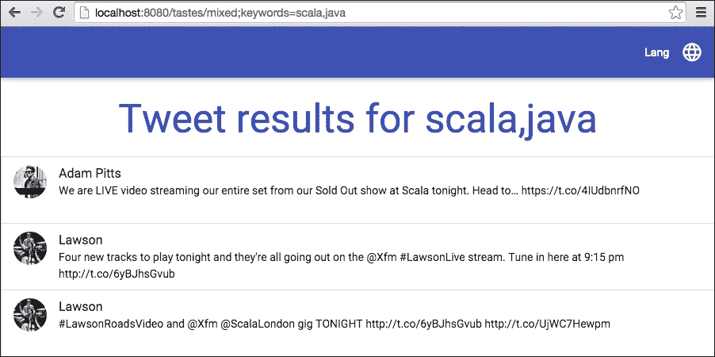
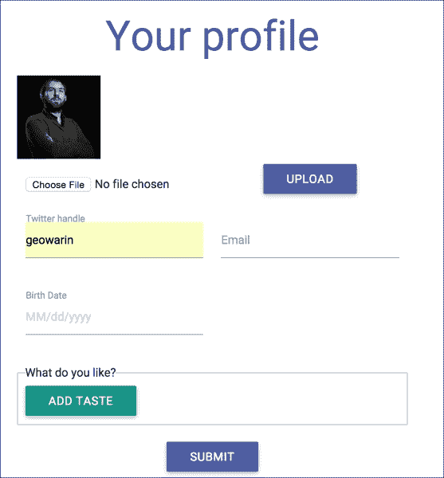
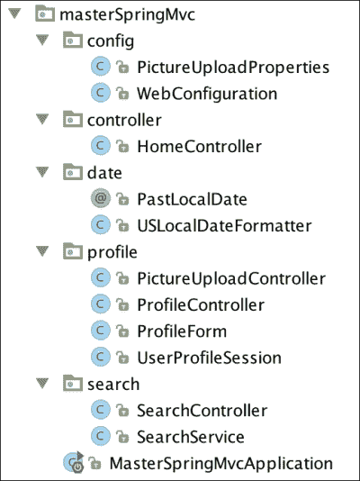
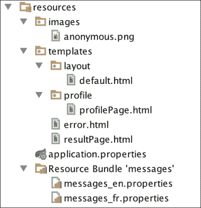

# 四、文件上传和错误处理

在本章中，我们将允许用户上传个人资料图片。我们还将看到如何在 Spring MVC 中处理错误。

# 上传文件

我们现在将让我们的用户可以上传个人资料图片。稍后这个将会出现在个人资料页面，但是现在，我们将会简化事情，在`profile/uploadPage.html`下的模板目录中创建一个新页面:

```java
<!DOCTYPE html>
<html xmlns:th="http://www.thymeleaf.org"
      xmlns:layout="http://www.ultraq.net.nz/thymeleaf/layout"
      layout:decorator="layout/default">
<head lang="en">
    <title>Profile Picture Upload</title>
</head>
<body>
<div class="row" layout:fragment="content">

    <h2 class="indigo-text center">Upload</h2>

    <form th:action="@{/upload}" method="post" enctype="multipart/form-data" class="col m8 s12 offset-m2">

        <div class="input-field col s6">
            <input type="file" id="file" name="file"/>
        </div>

        <div class="col s6 center">
            <button class="btn indigo waves-effect waves-light" type="submit" name="save" th:text="#{submit}">Submit
                <i class="mdi-content-send right"></i>
            </button>
        </div>
    </form>
</div>
</body>
</html>
```

除了表单上的`enctype`属性之外，没什么可看的。文件将通过`POST`方法发送到`upload` URL。我们现在将在`profile`包中的`ProfileController`旁边创建相应的控制器:

```java
package masterSpringMvc.profile;

import org.apache.tomcat.util.http.fileupload.IOUtils;
import org.springframework.core.io.FileSystemResource;
import org.springframework.core.io.Resource;
import org.springframework.stereotype.Controller;
import org.springframework.web.bind.annotation.RequestMapping;
import org.springframework.web.bind.annotation.RequestMethod;
import org.springframework.web.multipart.MultipartFile;

import java.io.*;
import java.nio.file.Files;
import java.nio.file.Path;
import java.nio.file.Paths;

@Controller
public class PictureUploadController {
    public static final Resource PICTURES_DIR = new FileSystemResource("./pictures");

    @RequestMapping("upload")
    public String uploadPage() {
        return "profile/uploadPage";
    }

    @RequestMapping(value = "/upload", method = RequestMethod.POST)
    public String onUpload(MultipartFile file) throws IOException {
        String filename = file.getOriginalFilename();
        File tempFile = File.createTempFile("pic", getFileExtension(filename), PICTURES_DIR.getFile());

        try (InputStream in = file.getInputStream();
             OutputStream out = new FileOutputStream(tempFile)) {
            IOUtils.copy(in, out);
        }

        return "profile/uploadPage";
    }

    private static String getFileExtension(String name) {
        return name.substring(name.lastIndexOf("."));
    }
}
```

这段代码要做的第一件事是在`pictures`目录中创建一个临时文件，这个文件可以在项目的根文件夹中找到；所以，确保它存在。在 Java 中，临时文件只是在文件系统上获得唯一文件标识符的一种商品。由用户决定是否删除它。

在项目的根目录下创建一个图片目录，并添加一个名为`.gitkeep`的空文件，以确保您可以在 Git 中提交它。

### Tip

**清空 Git 中的目录**

Git 是基于文件的，不可能提交空目录。一个常见的解决方法是在一个目录中提交一个空文件，比如`.gitkeep`，强制 Git 将它置于版本控制之下。

用户上传的文件将作为一个`MultipartFile`接口注入到我们的控制器中。这个接口提供了几种方法来获取文件的名称、大小和内容。

这里让我们特别感兴趣的方法是`getInputStream()`。由于使用了`IOUtils.copy`方法，我们确实会将这个流复制到一个`fileOutputStream`方法。将输入流写入输出流的代码相当枯燥，所以在类路径中放入 Apache Utils 非常方便(它是`tomcat-embedded-core.jar`文件的一部分)。

我们大量使用了非常酷的 Spring 和 Java 7 NIO 特性:

*   string 的资源类是一个实用程序类，它表示可以通过不同方式找到的资源的抽象
*   即使在异常的情况下，`try…with`块也会自动关闭我们的流，去掉了编写`finally`块的样板文件

使用前面的代码，用户上传的任何文件都将被复制到`pictures`目录中。

在 Spring Boot 有一些属性可以用来定制文件上传。看一看`MultipartProperties`类。

最有趣的是:

*   `multipart.maxFileSize`:定义上传文件允许的最大文件大小。试图上传一个更大的会导致一个`MultipartException`类。默认值为`1Mb`。
*   `multipart.maxRequestSize`:这定义了多部分请求的最大大小。默认值为`10Mb`。

默认值对于我们的应用来说已经足够好了。上传几次后，我们的图片目录将如下所示:


等等！有人上传了一个 ZIP 文件！我真不敢相信。我们最好在控制器中添加一些检查，以确保上传的文件是真实的图像:

```java
package masterSpringMvc.profile;

import org.apache.tomcat.util.http.fileupload.IOUtils;
import org.springframework.core.io.FileSystemResource;
import org.springframework.core.io.Resource;
import org.springframework.stereotype.Controller;
import org.springframework.web.bind.annotation.RequestMapping;
import org.springframework.web.bind.annotation.RequestMethod;
import org.springframework.web.multipart.MultipartFile;
import org.springframework.web.servlet.mvc.support.RedirectAttributes;

import java.io.*;

@Controller
public class PictureUploadController {
    public static final Resource PICTURES_DIR = new FileSystemResource("./pictures");

    @RequestMapping("upload")
    public String uploadPage() {
        return "profile/uploadPage";
    }

    @RequestMapping(value = "/upload", method = RequestMethod.POST)
    public String onUpload(MultipartFile file, RedirectAttributes redirectAttrs) throws IOException {

 if (file.isEmpty() || !isImage(file)) {
 redirectAttrs.addFlashAttribute("error", "Incorrect file. Please upload a picture.");
 return "redirect:/upload";
 }

        copyFileToPictures(file);

        return "profile/uploadPage";
    }

    private Resource copyFileToPictures(MultipartFile file) throws IOException {
        String fileExtension = getFileExtension(file.getOriginalFilename());
        File tempFile = File.createTempFile("pic", fileExtension, PICTURES_DIR.getFile());
        try (InputStream in = file.getInputStream();
             OutputStream out = new FileOutputStream(tempFile)) {

            IOUtils.copy(in, out);
        }
        return new FileSystemResource(tempFile);
    }

    private boolean isImage(MultipartFile file) {
 return file.getContentType().startsWith("image");
 }

    private static String getFileExtension(String name) {
        return name.substring(name.lastIndexOf("."));
    }
}
```

相当简单！`getContentType()`方法返回**多用途互联网邮件扩展** ( **MIME** )类型的文件。将会是`image/png`、`image/jpg`等等。所以我们只需要检查 MIME 类型是否以“image”开头。

我们在表单中添加了一条错误消息，所以我们应该在网页中添加一些内容来显示它。将以下代码放在`uploadPage`中的标题下:

```java
<div class="col s12 center red-text" th:text="${error}" th:if="${error}">
    Error during upload
</div>
```

下次你试图上传一个 ZIP 文件时，你会得到一个错误！如下图所示:


## 将图像写入响应

静态目录不提供上传的图像。我们将需要采取特殊的措施在我们的网页上显示它们。

让我们将以下几行添加到我们的上传页面，就在表单上方:

```java
<div class="col m8 s12 offset-m2">
    
</div>
```

这将尝试从我们的控制器获取图像。让我们将相应的方法添加到`PictureUploadController`类中:

```java
@RequestMapping(value = "/uploadedPicture")
public void getUploadedPicture(HttpServletResponse response) throws IOException {
    ClassPathResource classPathResource = new ClassPathResource("/images/anonymous.png");
    response.setHeader("Content-Type", URLConnection.guessContentTypeFromName(classPathResource.getFilename()));
    IOUtils.copy(classPathResource.getInputStream(), response.getOutputStream());
}
```

这段代码将把在`src/main/resources/images/anonymous.png`目录中找到的图像直接写到响应中！多刺激啊！

如果我们再次转到我们的页面，我们将看到下图:


### Tip

我在 iconmonstr(【http://iconmonstr.com/user-icon】)上找到了匿名的用户图片，下载成了 128 x 128 的 PNG 文件。

## 管理上传属性

此时要做的一件好事是允许通过`application.properties`文件配置上传目录和到匿名用户图像的路径。

让我们在新创建的`config`包中创建一个`PicturesUploadProperties`类:

```java
package masterSpringMvc.config;

import org.springframework.boot.context.properties.ConfigurationProperties;
import org.springframework.core.io.DefaultResourceLoader;
import org.springframework.core.io.Resource;

import java.io.IOException;
@ConfigurationProperties(prefix = "upload.pictures")
public class PictureUploadProperties {
    private Resource uploadPath;
    private Resource anonymousPicture;

    public Resource getAnonymousPicture() {
        return anonymousPicture;
    }

    public void setAnonymousPicture(String anonymousPicture) {
        this.anonymousPicture = new DefaultResourceLoader().getResource(anonymousPicture);
    }

    public Resource getUploadPath() {
        return uploadPath;
    }

    public void setUploadPath(String uploadPath) {
        this.uploadPath = new DefaultResourceLoader().getResource(uploadPath);
    }
}
```

在这节课中，我们使用了 Spring Boot。这将告诉 Spring Boot 以类型安全的方式自动映射在类路径中找到的属性(默认情况下，在`application.properties`文件中)。

请注意，我们定义的 setters 将“String”作为参数，但可以自由地让 getters 返回任何类型，这是最有用的。

我们现在需要将`PicturesUploadProperties`类添加到我们的配置中:

```java
@SpringBootApplication
@EnableConfigurationProperties({PictureUploadProperties.class})
public class MasterSpringMvc4Application extends WebMvcConfigurerAdapter {
  // code omitted
}
```

我们现在可以在`application.properties`文件中添加属性值:

```java
upload.pictures.uploadPath=file:./pictures
upload.pictures.anonymousPicture=classpath:/images/anonymous.png
```

因为我们使用 Spring 的`DefaultResourceLoader`类，所以我们可以使用前缀如`file:`或`classpath:`来指定在哪里可以找到我们的资源。

这相当于创建一个`FileSystemResource`类或者一个`ClassPathResource`类。

这种方法还具有记录代码的优势。我们可以很容易地看到，图片目录将在应用根目录中找到，而匿名图片将在类路径中找到。

就是这样。我们现在可以在控制器中使用我们的属性了。以下是`PictureUploadController`类的相关部分:

```java
package masterSpringMvc.profile;

import masterSpringMvc.config.PictureUploadProperties;
import org.apache.tomcat.util.http.fileupload.IOUtils;
import org.springframework.beans.factory.annotation.Autowired;
import org.springframework.core.io.Resource;
import org.springframework.stereotype.Controller;
import org.springframework.web.bind.annotation.RequestMapping;
import org.springframework.web.bind.annotation.RequestMethod;
import org.springframework.web.multipart.MultipartFile;
import org.springframework.web.servlet.mvc.support.RedirectAttributes;

import javax.servlet.http.HttpServletResponse;
import java.io.*;
import java.net.URLConnection;

@Controller
public class PictureUploadController {
    private final Resource picturesDir;
 private final Resource anonymousPicture;

 @Autowired
 public PictureUploadController(PictureUploadProperties uploadProperties) {
 picturesDir = uploadProperties.getUploadPath();
 anonymousPicture = uploadProperties.getAnonymousPicture();
 }

    @RequestMapping(value = "/uploadedPicture")
    public void getUploadedPicture(HttpServletResponse response) throws IOException {
        response.setHeader("Content-Type", URLConnection.guessContentTypeFromName(anonymousPicture.getFilename()));
 IOUtils.copy(anonymousPicture.getInputStream(), response.getOutputStream());
    }

  private Resource copyFileToPictures(MultipartFile file) throws IOException {
       String fileExtension = getFileExtension(file.getOriginalFilename());
       File tempFile = File.createTempFile("pic", fileExtension, picturesDir.getFile());
       try (InputStream in = file.getInputStream();
            OutputStream out = new FileOutputStream(tempFile)) {

           IOUtils.copy(in, out);
       }
       return new FileSystemResource(tempFile);
   }    
// The rest of the code remains the same
}
```

在这个点，如果您再次启动您的应用，您将看到结果没有改变。匿名图片仍然显示，用户上传的图片仍然保存在项目根目录下的`pictures`目录中。

## 显示上传的图片

现在显示用户的图片就好了不是吗？为此，我们将向我们的`PictureUploadController`类添加一个模型属性:

```java
@ModelAttribute("picturePath")
public Resource picturePath() {
  return anonymousPicture;
}
```

现在，当我们提供上传的图片时，我们可以注入它来检索它的值:

```java
@RequestMapping(value = "/uploadedPicture")
public void getUploadedPicture(HttpServletResponse response, @ModelAttribute("picturePath") Path picturePath) throws IOException {
    response.setHeader("Content-Type", URLConnection.guessContentTypeFromName(picturePath.toString()));
    Files.copy(picturePath, response.getOutputStream());
}
```

`@ModelAttribute`注释是用带注释的方法创建模型属性的一种便捷方式。然后可以将它们与相同的注释一起注入控制器方法。有了这段代码，只要我们没有被重定向到另一个页面，模型中就会有一个`picturePath`参数。它的默认值是我们在属性中定义的匿名图片。

当文件上传时，我们需要更新这个值。更新`onUpload`方法:

```java
@RequestMapping(value = "/upload", method = RequestMethod.POST)
public String onUpload(MultipartFile file, RedirectAttributes redirectAttrs, Model model) throws IOException {

    if (file.isEmpty() || !isImage(file)) {
        redirectAttrs.addFlashAttribute("error", "Incorrect file. Please upload a picture.");
        return "redirect:/upload";
    }

    Resource picturePath = copyFileToPictures(file);
 model.addAttribute("picturePath", picturePath);

    return "profile/uploadPage";
}
```

通过注入模型，我们可以在上传完成后更新`picturePath`参数。

现在，问题是我们的两个方法，`onUpload`和`getUploadedPicture`，将出现在不同的请求中。不幸的是，模型属性将在两者之间被重置。

这就是我们将`picturePath`参数定义为会话属性的原因。我们可以通过向控制器类添加另一个注释来做到这一点:

```java
@Controller
@SessionAttributes("picturePath")
public class PictureUploadController {
}
```

唷！仅仅处理一个简单的会话属性就需要很多注释。您将获得以下输出:


这种方法使得代码合成变得非常容易。另外，我们没有直接使用`HttpServletRequest`或`HttpSession`。此外，我们的对象可以很容易地键入。

## 处理文件上传错误

细心的读者一定会想到，我们的代码容易抛出两种异常:

*   `IOException`:如果在将文件写入磁盘时发生了不好的事情，就会抛出这个错误。
*   `MultipartException`:如果上传文件时出错，则抛出此错误。例如，当超过最大文件大小时。

这将给我们一个很好的机会来看看 Spring 中处理异常的两种方式:

*   在控制器方法中本地使用`@ExceptionHandler`注释
*   使用在 Servlet 容器级别定义的全局异常处理程序

让我们通过添加以下方法来处理`PictureUploadController`类中带有`@ExceptionHandler`注释的`IOException`:

```java
@ExceptionHandler(IOException.class)
public ModelAndView handleIOException(IOException exception) {
    ModelAndView modelAndView = new ModelAndView("profile/uploadPage");
    modelAndView.addObject("error", exception.getMessage());
    return modelAndView;
}
```

这是一个简单而强大的方法。每次在我们的控制器中抛出一个`IOException`时，都会调用这个方法。

为了测试异常处理程序，因为让 Java IO 代码抛出异常可能很棘手，所以只需在测试期间替换`onUpload`方法体:

```java
@RequestMapping(value = "/upload", method = RequestMethod.POST)
public String onUpload(MultipartFile file, RedirectAttributes redirectAttrs, Model model) throws IOException {
    throw new IOException("Some message");
}
```

在此更改后，如果我们尝试上传图片，我们会在上传页面上看到此异常的错误消息:


现在，我们将处理`MultipartException`。这需要发生在 Servlet 容器级别(即 Tomcat 级别)，因为这个异常不是由我们的控制器直接抛出的。

我们需要在配置中添加一个新的`EmbeddedServletContainerCustomizer` bean。将该方法添加到`WebConfiguration`类中:

```java
@Bean
public EmbeddedServletContainerCustomizer containerCustomizer() {
    EmbeddedServletContainerCustomizer 
embeddedServletContainerCustomizer = new EmbeddedServletContainerCustomizer() {
        @Override
        public void customize(ConfigurableEmbeddedServletContainer container) {
            container.addErrorPages(new ErrorPage(MultipartException.class, "/uploadError"));
        }
    };
    return embeddedServletContainerCustomizer;
}
```

这个有点啰嗦。注意`EmbeddedServletContainerCustomizer`是一个包含单个方法的接口；因此，它可以用λ表达式来代替:

```java
@Bean
public EmbeddedServletContainerCustomizer containerCustomizer() {
    EmbeddedServletContainerCustomizer embeddedServletContainerCustomizer
            = container -> container.addErrorPages(new ErrorPage(MultipartException.class, "/uploadError"));
    return embeddedServletContainerCustomizer;
}
```

所以，我们就这样写吧:

```java
@Bean
public EmbeddedServletContainerCustomizer containerCustomizer() {
    return container -> container.addErrorPages(new ErrorPage(MultipartException.class, "/uploadError"));
}
```

这段代码创建了一个新的错误页面，当一个`MultipartException`发生时将会调用这个页面。它也可以映射到 HTTP 状态。`EmbeddedServletContainerCustomizer`接口有许多其他特性，允许定制我们的应用运行的 Servlet 容器。更多信息请访问[http://docs . spring . io/spring-boot/docs/current/reference/html/boot-features-developing-we b-applications . html # boot-features-customizing-embedded-containers](http://docs.spring.io/spring-boot/docs/current/reference/html/boot-features-developing-web-applications.html#boot-features-customizing-embedded-containers)。

我们现在需要在我们的`PictureUploadController`类中处理这个`uploadError` URL:

```java
@RequestMapping("uploadError")
public ModelAndView onUploadError(HttpServletRequest request) {
    ModelAndView modelAndView = new ModelAndView("uploadPage");
    modelAndView.addObject("error", request.getAttribute(WebUtils.ERROR_MESSAGE_ATTRIBUTE));
    return modelAndView;
}
```

Servlet 环境中定义的错误页面包含许多有助于调试错误的有趣属性:

<colgroup><col style="text-align: left"> <col style="text-align: left"></colgroup> 
| 

属性

 | 

描述

 |
| --- | --- |
| `javax.servlet.error.status_code` | 这是错误的 HTTP 状态代码。 |
| `javax.servlet.error.exception_type` | 这是异常类。 |
| `javax.servlet.error.message` | 这是引发异常的消息。 |
| `javax.servlet.error.request_uri` | 这是发生异常的 URI。 |
| `javax.servlet.error.exception` | 这是实际的例外。 |
| `javax.servlet.error.servlet_name` | 这是捕获异常的 Servlet 的名称。 |

所有这些属性都可以在 Spring Web 的`WebUtils`类上方便地访问到。

如果有人试图上传太大的文件，他们会得到一个非常明确的错误信息。

现在，您可以通过上传一个非常大的文件(> 1Mb)或将`multipart.maxFileSize`属性设置为一个较低的值(例如 1kb)来测试错误是否得到正确处理:


# 翻译错误信息

对于开发人员来说，看到应用抛出的异常真的很好。然而，对于我们的用户来说，它们没有什么价值。因此，我们将翻译它们。为了做到这一点，我们必须将应用的`MessageSource`类注入到控制器的构造函数中:

```java
private final MessageSource messageSource;

@Autowired
public PictureUploadController(PictureUploadProperties uploadProperties, MessageSource messageSource) {
    picturesDir = uploadProperties.getUploadPath();
    anonymousPicture = uploadProperties.getAnonymousPicture();
    this.messageSource = messageSource;
}
```

现在，我们可以从我们的消息包中检索消息:

```java
@ExceptionHandler(IOException.class)
public ModelAndView handleIOException(Locale locale) {
    ModelAndView modelAndView = new ModelAndView("profile/uploadPage");
    modelAndView.addObject("error", messageSource.getMessage("upload.io.exception", null, locale));
    return modelAndView;
}

@RequestMapping("uploadError")
public ModelAndView onUploadError(Locale locale) {
    ModelAndView modelAndView = new ModelAndView("profile/uploadPage");
    modelAndView.addObject("error", messageSource.getMessage("upload.file.too.big", null, locale));
    return modelAndView;
}
```

以下是英文信息:

```java
upload.io.exception=An error occurred while uploading the file. Please try again.
upload.file.too.big=Your file is too big.
```

现在，法国的:

```java
upload.io.exception=Une erreur est survenue lors de l'envoi du fichier. Veuillez réessayer.
upload.file.too.big=Votre fichier est trop gros.
```

# 将配置文件置于会话中

我们想要的下一件事是将配置文件存储在一个会话中，这样它就不会在我们每次访问配置文件页面时被重置。这显然会让一些用户感到厌烦，我们必须解决这个问题。

### Tip

**HTTP 会话** 是一种在请求之间存储信息的方式。HTTP 是一种无状态协议，这意味着无法将来自同一个用户的两个请求联系起来。大多数 Servlet 容器做的是将一个名为`JSESSIONID`的 cookie 关联到每个用户。这个 cookie 将在请求头中传输，并允许您在 map 中存储任意对象，这是一个名为`HttpSession`的抽象。这样的会话通常会在用户关闭或切换 web 浏览器时结束，或者在预定的不活动时间段之后结束。

我们刚刚看到了一种使用`@SessionAttributes`注释将对象放入会话的方法。这在一个控制器内工作得很好，但是当分布在多个控制器上时，数据很难共享。我们必须依靠字符串从名称中解析属性，这很难重构。出于同样的原因，我们不想直接操纵`HttpSession`。另一个不鼓励直接使用会话的理由是对依赖它的控制器进行单元测试有多困难。

在用 Spring 保存会话中的内容时，还有另一种流行的方法:用`@Scope("session")`注释 bean。

然后您将能够在您的控制器和其他 Spring 组件中注入您的会话 bean，以设置或从中检索值。

让我们在`profile`包中创建一个`UserProfileSession`类:

```java
package masterSpringMvc.profile;

import org.springframework.context.annotation.Scope;
import org.springframework.context.annotation.ScopedProxyMode;
import org.springframework.stereotype.Component;
import java.io.Serializable;
import java.time.LocalDate;
import java.util.ArrayList;
import java.util.List;

@Component
@Scope(value = "session", proxyMode = ScopedProxyMode.TARGET_CLASS)
public class UserProfileSession implements Serializable {
    private String twitterHandle;
    private String email;
    private LocalDate birthDate;
    private List<String> tastes = new ArrayList<>();

    public void saveForm(ProfileForm profileForm) {
        this.twitterHandle = profileForm.getTwitterHandle();
        this.email = profileForm.getEmail();
        this.birthDate = profileForm.getBirthDate();
        this.tastes = profileForm.getTastes();
    }

    public ProfileForm toForm() {
        ProfileForm profileForm = new ProfileForm();
        profileForm.setTwitterHandle(twitterHandle);
        profileForm.setEmail(email);
        profileForm.setBirthDate(birthDate);
        profileForm.setTastes(tastes);
        return profileForm;
    }
}
```

我们已经方便地提供了一种与`ProfileForm`对象相互转换的方法。这将帮助我们从我们的`ProfileController`构造函数中存储和检索表单数据。我们需要在控制器的构造函数中注入我们的`UserProfileSession`变量，并将其存储为一个字段。我们还需要将`ProfileForm`公开为一个模型属性，这将移除需要在`displayProfile`方法中注入它的。最后，我们可以在概要文件通过验证后保存它:

```java
@Controller
public class ProfileController {

    private UserProfileSession userProfileSession;
    @Autowired
    public ProfileController(UserProfileSession userProfileSession) {
        this.userProfileSession = userProfileSession;
    }

    @ModelAttribute
    public ProfileForm getProfileForm() {
        return userProfileSession.toForm();
    }

    @RequestMapping(value = "/profile", params = {"save"}, method = RequestMethod.POST)
    public String saveProfile(@Valid ProfileForm profileForm, BindingResult bindingResult) {
        if (bindingResult.hasErrors()) {
            return "profile/profilePage";
        }
        userProfileSession.saveForm(profileForm);
        return "redirect:/profile";
    }

    // the rest of the code is unchanged
}
```

这就是使用 Spring MVC 在会话中保存数据的全部内容。

现在，如果您完成配置文件表单并刷新页面，数据将在两次请求之间保持不变。

在进入下一章之前，我想详细说明我们刚刚使用的几个概念。

首先是构造函数的注入。`ProfileController`构造函数用`@Autowired`标注，这意味着 Spring 将在实例化 bean 之前从应用上下文中解析构造函数参数。另一种方法是使用字段注入，这种方法没有 T2 那么罗嗦:

```java
@Controller
public class ProfileController {

    @Autowired
    private UserProfileSession userProfileSession;
}
```

构造函数注入可以说是更好的，因为如果我们从`spring-test`框架中脱离出来，它使我们的控制器的单元测试变得更容易，并且它使我们的 bean 的依赖更加明确。

关于字段注入和构造函数注入的详细讨论，请参考 Oliver Gierke 在[http://olivergierke.de/2013/11/why-field-injection-is-evil/](http://olivergierke.de/2013/11/why-field-injection-is-evil/)发表的精彩博文。

另一件需要澄清的事情是`Scope`注释中的`proxyMode`参数:

```java
@Scope(value = "session", proxyMode = ScopedProxyMode.TARGET_CLASS)
```

如果不算默认的参数，Spring 有三个可用的参数:

*   这使用了一个 CGI 代理
*   这将创建一个 JDK 代理
*   `NO`:这不会创建任何代理

当您将一些东西注入到一个长寿命的组件(比如 singleton)中时，代理的优势通常会发挥作用。因为注入只发生一次，所以在创建 bean 时，对注入的 bean 的后续调用可能不会反映其实际状态。

在我们的例子中，会话 bean 的实际状态存储在会话中，而不是直接存储在 bean 上。这解释了为什么 Spring 必须创建一个代理:它需要拦截对我们的 bean 方法的调用，并监听它的变化。这样，bean 的状态可以透明地存储在底层 HTTP 会话中，并可以从底层 HTTP 会话中检索。

对于会话 bean，我们被迫使用代理模式。CGI 代理将检测你的字节码，并在任何类上工作，而 JDK 方法可能更轻量级，但需要你实现一个接口。

最后，我们让`UserProfileSession` bean 实现了`Serializable`接口。这不是严格要求的，因为 HTTP 会话可以在内存中存储任意对象，但是使结束于会话的对象可序列化确实是一个好的实践。

事实上，我们可能会改变会话持久化的方式。事实上，我们将在第八章、*优化你的请求*中的 Redis 数据库中存储该会话，其中 Redis 必须处理`Serializable`对象。最好总是考虑通用数据存储的会话。我们必须提供一种从这个存储系统中读写对象的方法。

为了使序列化在 bean 上正常工作，我们还需要它的每个字段都是可序列化的。在我们的例子中，字符串和日期是可序列化的，所以我们可以开始了。

# 自定义错误页面

Spring Boot 让你定义自己的错误视图，而不是我们之前看到的的白标错误页面。它必须有名字`error`，它的目的是处理所有的异常。默认的`BasicErrorController`类将公开许多有用的模型属性，您可以在这个页面上显示这些属性。

让我们在`src/main/resources/templates`中创建一个定制的错误页面。姑且称之为`error.html`:

```java
<!DOCTYPE html>
<html xmlns:th="http://www.thymeleaf.org">
<head lang="en">
    <meta charset="UTF-8"/>
    <title th:text="${status}">404</title>

    <link href="/webjars/materializecss/0.96.0/css/materialize.css" type="text/css" rel="stylesheet"
          media="screen,projection"/>
</head>
<body>
<div class="row">
    <h1 class="indigo-text center" th:text="${error}">Not found</h1>

    <p class="col s12 center" th:text="${message}">
        This page is not available
    </p>
</div>
</body>
</html>
```

现在，如果我们导航到一个不由我们的应用处理的 URL，我们会看到我们的自定义错误页面:


处理错误的一个更高级的选项是定义自己的`ErrorController`类的实现，这是一个负责在全局级别处理所有异常的控制器。看看`ErrorMvcAutoConfiguration`类和`BasicErrorController`类，这是默认的实现。

# 使用矩阵变量的 URL 映射

我们现在知道用户感兴趣的是什么。这将是一个好主意，以改善我们的 Tweet 控制器，使其允许从关键字列表中进行搜索。

在 URL 中传递键值对的一种有趣的方式是使用矩阵变量。它非常类似于请求参数。考虑以下代码:

```java
someUrl/param?var1=value1&var2=value2
```

矩阵变量理解这一点，而不是前面的参数:

```java
someUrl/param;var1=value1;var2=value2
```

它们还允许每个参数是一个列表:

```java
someUrl/param;var1=value1,value2;var2=value3,value4
```

矩阵变量可以映射到控制器内部的不同对象类型:

*   `Map<String, List<?>>`:处理多个变量和多个值
*   `Map<String, ?>`:处理每个变量只有一个值的情况
*   `List<?>`:如果我们对一个名称可以配置的变量感兴趣，就使用这个选项

在我们的例子中，我们希望处理这样的事情:

```java
http://localhost:8080/search/popular;keywords=scala,java
```

第一个参数`popular`，是 Twitter 搜索 API 已知的结果类型。它可以取以下值:`mixed`、`recent`或`popular`。

我们的 URL 的其余部分是一个关键字列表。因此，我们将它们映射到一个简单的`List<String>`对象。

默认情况下，Spring MVC 会删除 URL 中分号后面的每个字符。要在应用中启用矩阵变量，我们需要做的第一件事是关闭这种行为。

让我们将下面的代码添加到我们的`WebConfiguration`类中:

```java
@Override
public void configurePathMatch(PathMatchConfigurer configurer) {
    UrlPathHelper urlPathHelper = new UrlPathHelper();
    urlPathHelper.setRemoveSemicolonContent(false);
    configurer.setUrlPathHelper(urlPathHelper);
}
```

让我们在`search`包中创建一个新的控制器，我们称之为`SearchController`。它的作用是处理以下请求:

```java
package masterSpringMvc.search;

import org.springframework.beans.factory.annotation.Autowired;
import org.springframework.social.twitter.api.Tweet;
import org.springframework.stereotype.Controller;
import org.springframework.web.bind.annotation.MatrixVariable;
import org.springframework.web.bind.annotation.PathVariable;
import org.springframework.web.bind.annotation.RequestMapping;
import org.springframework.web.servlet.ModelAndView;

import java.util.List;

@Controller
public class SearchController {
    private SearchService searchService;
    @Autowired
    public SearchController(SearchService searchService) {
        this.searchService = searchService;
    }

    @RequestMapping("/search/{searchType}")
    public ModelAndView search(@PathVariable String searchType, @MatrixVariable List<String> keywords) {
        List<Tweet> tweets = searchService.search(searchType, keywords);
        ModelAndView modelAndView = new ModelAndView("resultPage");
        modelAndView.addObject("tweets", tweets);
        modelAndView.addObject("search", String.join(",", keywords));
        return modelAndView;
    }
}
```

正如你所见，我们能够重用现有的结果页面来显示推文。我们还想将搜索委托给另一个名为`SearchService`的类。我们将在与`SearchController`相同的包中创建该服务:

```java
package masterSpringMvc.search;

import org.springframework.beans.factory.annotation.Autowired;
import org.springframework.social.twitter.api.Tweet;
import org.springframework.social.twitter.api.Twitter;
import org.springframework.stereotype.Service;
import java.util.List;

@Service
public class SearchService {
    private Twitter twitter;

    @Autowired
    public SearchService(Twitter twitter) {
        this.twitter = twitter;
    }

    public List<Tweet> search(String searchType, List<String> keywords) {
        return null;
    }
}
```

现在，我们需要实现`search()`方法。

在`twitter.searchOperations().search(params)`上可访问的搜索操作将`searchParameters`作为高级搜索的参数。这个对象允许我们根据十几个标准进行搜索。我们对`query`、`resultType`和`count`属性感兴趣。

首先，我们需要用`searchType`路径变量创建一个`ResultType`构造函数。`ResultType`是一个枚举，所以我们可以遍历它的不同值，找到一个匹配输入的值，忽略以下情况:

```java
private SearchParameters.ResultType getResultType(String searchType) {
    for (SearchParameters.ResultType knownType : SearchParameters.ResultType.values()) {
        if (knownType.name().equalsIgnoreCase(searchType)) {
            return knownType;
        }
    }
    return SearchParameters.ResultType.RECENT;
}
```

我们现在可以用下面的方法创建一个`SearchParameters`构造函数:

```java
private SearchParameters createSearchParam(String searchType, String taste) {

    SearchParameters.ResultType resultType = getResultType(searchType);
    SearchParameters searchParameters = new SearchParameters(taste);
    searchParameters.resultType(resultType);
    searchParameters.count(3);
    return searchParameters;
}
```

现在，创建一个`SearchParameters`构造函数的列表就像执行一个 map 操作一样简单(获取一个关键字列表并为每个关键字返回一个`SearchParameters`构造函数):

```java
List<SearchParameters> searches = keywords.stream()
        .map(taste -> createSearchParam(searchType, taste))
        .collect(Collectors.toList());
```

现在，我们想获取每个`SearchParameters`构造函数的 tweets。你可能会这样想:

```java
List<Tweet> tweets = searches.stream()
        .map(params -> twitter.searchOperations().search(params))
        .map(searchResults -> searchResults.getTweets())
        .collect(Collectors.toList());
```

然而，如果你考虑一下，这将返回一个 tweets 列表。我们想要的是将所有的推文扁平化，得到一个简单的列表。原来调用`map`然后拉平结果是一个被称为`flatMap`的操作。所以我们可以写:

```java
List<Tweet> tweets = searches.stream()
        .map(params -> twitter.searchOperations().search(params))
        .flatMap(searchResults -> searchResults.getTweets().stream())
        .collect(Collectors.toList());
```

`flatMap`函数的语法，以流为参数，一开始有点难理解。让我向您展示一下`SearchService`类的全部代码，这样我们可以后退一步:

```java
package masterSpringMvc.search;

import org.springframework.beans.factory.annotation.Autowired;
import org.springframework.social.twitter.api.SearchParameters;
import org.springframework.social.twitter.api.Tweet;
import org.springframework.social.twitter.api.Twitter;
import org.springframework.stereotype.Service;

import java.util.List;
import java.util.stream.Collectors;

@Service
public class SearchService {
    private Twitter twitter;

    @Autowired
    public SearchService(Twitter twitter) {
        this.twitter = twitter;
    }

    public List<Tweet> search(String searchType, List<String> keywords) {
        List<SearchParameters> searches = keywords.stream()
                .map(taste -> createSearchParam(searchType, taste))
                .collect(Collectors.toList());

        List<Tweet> results = searches.stream()
                .map(params -> twitter.searchOperations().search(params))
                .flatMap(searchResults -> searchResults.getTweets().stream())
                .collect(Collectors.toList());

        return results;
    }

    private SearchParameters.ResultType getResultType(String searchType) {
        for (SearchParameters.ResultType knownType : SearchParameters.ResultType.values()) {
            if (knownType.name().equalsIgnoreCase(searchType)) {
                return knownType;
            }
        }
        return SearchParameters.ResultType.RECENT;
    }

    private SearchParameters createSearchParam(String searchType, String taste) {
        SearchParameters.ResultType resultType = getResultType(searchType);
        SearchParameters searchParameters = new SearchParameters(taste);
        searchParameters.resultType(resultType);
        searchParameters.count(3);
        return searchParameters;
    }
}
```

现在，如果我们从导航到`http://localhost:8080/search/mixed;keywords=scala,java`，我们将得到预期的结果。一个搜索 Scala 关键字，然后搜索 Java:



# 把它放在一起

既然所有的东西都是独立工作的，那么是时候组装所有的东西了。我们将分三步进行:

1.  将上传表单移至个人资料页面，并移除旧的上传页面。
2.  更改个人资料页面上的提交按钮，直接触发口味搜索。
3.  更改我们应用的主页。它应该立即显示符合用户口味的搜索结果。如果他们不可用，请转到个人资料页面。

我鼓励你试着自己去做。一路上你会遇到非常容易处理的问题，但是你应该知道足够的知识来自己解决它们。我相信你。

好了，现在你已经完成了工作(你已经完成了，不是吗？)，来看看我的解决方案。

第一步是去掉旧的`uploadPage`头衔。不要回头，只管去做。

接下来，将这些行放在标题下面:

```java
<div class="row">

    <div class="col m8 s12 offset-m2">
        
    </div>

    <div class="col s12 center red-text" th:text="${error}" th:if="${error}">
        Error during upload
    </div>

    <form th:action="@{/profile}" method="post" enctype="multipart/form-data" class="col m8 s12 offset-m2">

        <div class="input-field col s6">
            <input type="file" id="file" name="file"/>
        </div>

        <div class="col s6 center">
            <button class="btn indigo waves-effect waves-light" type="submit" name="upload" th:text="#{upload}">Upload
                <i class="mdi-content-send right"></i>
            </button>
        </div>
    </form>
</div>
```

和后期`uploadPage`的内容很像。我们只是删除了标题，并更改了提交按钮的标签。将相应的翻译添加到包中。

在英语中:

```java
upload=Upload
```

法语:

```java
Upload=Envoyer
```

我们还将提交按钮的名称改为`upload`。这将帮助我们识别控制器端的这个动作。

现在，如果我们试图上传我们的图片，它会将我们重定向到旧的上传页面。我们需要在我们的`PictureUploadController`类的`onUpload`方法中解决这个问题:

```java
@RequestMapping(value = "/profile", params = {"upload"}, method = RequestMethod.POST)
public String onUpload(@RequestParam MultipartFile file, RedirectAttributes redirectAttrs) throws IOException {

    if (file.isEmpty() || !isImage(file)) {
        redirectAttrs.addFlashAttribute("error", "Incorrect file. Please upload a picture.");
        return "redirect:/profile";
    }

    Resource picturePath = copyFileToPictures(file);
    userProfileSession.setPicturePath(picturePath);

    return "redirect:profile";
}
```

注意，我们改变了处理文章的 URL。现在是`/profile`而不是`/upload`。当`GET`和`POST`请求有相同的 URL 时，表单处理就简单多了，尤其是在处理异常时，会省去我们很多麻烦。这样，我们就不必在出错后重定向用户。

我们还删除了模型属性`picturePath`。因为我们现在有一个 bean 来表示会话中的用户，`UserProfileSession`，所以我们决定将它添加到那里。我们向`UserProfileSession`类添加了一个`picturePath`属性以及相关的 getters 和 setters。

不要忘记注入`UserProfileSession`类，并使它作为我们的`PictureUploadController`类中的一个字段。

请记住，与资源不同，我们的会话 bean 的所有属性都必须是可序列化的。所以我们需要不同的存储方式。URL 类似乎很适合。它是可序列化的，并且很容易使用`UrlResource`类从 URL 创建资源:

```java
@Component
@Scope(value = "session", proxyMode = ScopedProxyMode.TARGET_CLASS)
public class UserProfileSession implements Serializable {
    private URL picturePath;

    public void setPicturePath(Resource picturePath) throws IOException {
        this.picturePath = picturePath.getURL();
    }

    public Resource getPicturePath() {
        return picturePath == null ? null : new UrlResource(picturePath);
    }
}
```

我不得不做的最后一件事是在出错后让`profileForm`作为模型属性可用。这是因为`profilePage`在渲染时需要它。

综上所述，下面是`PictureUploadController`类的最终版本:

```java
package masterSpringMvc.profile;

import masterSpringMvc.config.PictureUploadProperties;
import org.apache.tomcat.util.http.fileupload.IOUtils;
import org.springframework.beans.factory.annotation.Autowired;
import org.springframework.context.MessageSource;
import org.springframework.core.io.FileSystemResource;
import org.springframework.core.io.Resource;
import org.springframework.stereotype.Controller;
import org.springframework.ui.Model;
import org.springframework.web.bind.annotation.*;
import org.springframework.web.multipart.MultipartFile;
import org.springframework.web.servlet.ModelAndView;
import org.springframework.web.servlet.mvc.support.RedirectAttributes;

import javax.servlet.http.HttpServletResponse;
import java.io.*;
import java.net.URLConnection;
import java.util.Locale;

@Controller
public class PictureUploadController {
    private final Resource picturesDir;
    private final Resource anonymousPicture;
    private final MessageSource messageSource;
    private final UserProfileSession userProfileSession;

    @Autowired
    public PictureUploadController(PictureUploadProperties uploadProperties,
                                   MessageSource messageSource,
                                   UserProfileSession userProfileSession) {
        picturesDir = uploadProperties.getUploadPath();
        anonymousPicture = uploadProperties.getAnonymousPicture();
        this.messageSource = messageSource;
        this.userProfileSession = userProfileSession;
    }

    @RequestMapping(value = "/uploadedPicture")
    public void getUploadedPicture(HttpServletResponse response) throws IOException {
        Resource picturePath = userProfileSession.getPicturePath();
        if (picturePath == null) {
            picturePath = anonymousPicture;
        }
        response.setHeader("Content-Type", URLConnection.guessContentTypeFromName(picturePath.getFilename()));
        IOUtils.copy(picturePath.getInputStream(), response.getOutputStream());
    }

    @RequestMapping(value = "/profile", params = {"upload"}, method = RequestMethod.POST)
    public String onUpload(@RequestParam MultipartFile file, RedirectAttributes redirectAttrs) throws IOException {

        if (file.isEmpty() || !isImage(file)) {
            redirectAttrs.addFlashAttribute("error", "Incorrect file. Please upload a picture.");
            return "redirect:/profile";
        }

        Resource picturePath = copyFileToPictures(file);
        userProfileSession.setPicturePath(picturePath);

        return "redirect:profile";
    }

    private Resource copyFileToPictures(MultipartFile file) throws IOException {
        String fileExtension = getFileExtension(file.getOriginalFilename());
        File tempFile = File.createTempFile("pic", fileExtension, picturesDir.getFile());
        try (InputStream in = file.getInputStream();
             OutputStream out = new FileOutputStream(tempFile)) {

            IOUtils.copy(in, out);
        }
        return new FileSystemResource(tempFile);
    }

    @ExceptionHandler(IOException.class)
    public ModelAndView handleIOException(Locale locale) {
        ModelAndView modelAndView = new ModelAndView("profile/profilePage");
        modelAndView.addObject("error", messageSource.getMessage("upload.io.exception", null, locale));
        modelAndView.addObject("profileForm", userProfileSession.toForm());
        return modelAndView;
    }

    @RequestMapping("uploadError")
    public ModelAndView onUploadError(Locale locale) {
        ModelAndView modelAndView = new ModelAndView("profile/profilePage");
        modelAndView.addObject("error", messageSource.getMessage("upload.file.too.big", null, locale));
        modelAndView.addObject("profileForm", userProfileSession.toForm());
        return modelAndView;
    }

    private boolean isImage(MultipartFile file) {
        return file.getContentType().startsWith("image");
    }

    private static String getFileExtension(String name) {
        return name.substring(name.lastIndexOf("."));
    }
}
```

因此，现在我们可以进入个人资料页面，上传我们的照片并提供个人信息，如下图所示:



现在，让我们在完成配置文件后将用户重定向到它的搜索。为此，我们需要修改`ProfileController`类中的`saveProfile`方法:

```java
@RequestMapping(value = "/profile", params = {"save"}, method = RequestMethod.POST)
public String saveProfile(@Valid ProfileForm profileForm, BindingResult bindingResult) {
    if (bindingResult.hasErrors()) {
        return "profile/profilePage";
    }
    userProfileSession.saveForm(profileForm);
    return "redirect:/search/mixed;keywords=" + String.join(",", profileForm.getTastes());
}
```

既然我们能够从我们的个人资料中搜索推文，我们就不需要之前制作的`searchPage`或`TweetController`了。只需删除`searchPage.html`页面和`TweetController`。

最后，如果我们已经完成了个人资料，我们可以修改我们的主页，以便它将我们重定向到符合我们口味的搜索。

让我们在控制器包中创建一个新控制器。它负责将到达我们网站根目录的用户重定向到他们的个人资料(如果资料不完整)或`resultPage`(如果他们的喜好可用):

```java
package masterSpringMvc.controller;

import masterSpringMvc.profile.UserProfileSession;
import org.springframework.beans.factory.annotation.Autowired;
import org.springframework.stereotype.Controller;
import org.springframework.web.bind.annotation.RequestMapping;

import java.util.List;

@Controller
public class HomeController {
    private UserProfileSession userProfileSession;

    @Autowired
    public HomeController(UserProfileSession userProfileSession) {
        this.userProfileSession = userProfileSession;
    }

    @RequestMapping("/")
    public String home() {
        List<String> tastes = userProfileSession.getTastes();
        if (tastes.isEmpty()) {
            return "redirect:/profile";
        }
        return "redirect:/search/mixed;keywords=" + String.join(",", tastes);
    }
}
```

# 检查点

在这一章中，我们添加了两个控制器，`PictureUploadController`负责将上传的文件写入磁盘并处理上传错误，`SearchController`可以从带有矩阵参数的关键字列表中搜索推文。

该控制器然后将搜索委托给新服务`SearchService`。

我们删除了旧的`TweetController`。

我们创建了一个会话 bean`UserProfileSession`，用来存储关于我们用户的信息。

最后我们给`WebConfiguration`加了两个东西。我们为 Servlet 容器添加了错误页面，并支持矩阵变量。



在资源方面，我们添加了一张表示匿名用户的图片和一个静态页面来处理错误。我们给`profilePage`增加了文件上传，去掉了旧的`searchPage`。



# 总结

在本章中，我们讨论了文件上传和错误处理。上传文件并不复杂。然而，一个重要的设计决策是如何处理上传的文件。我们本可以将图片存储在数据库中，但我们选择将其写入磁盘，并在会话中保存每个用户图片的位置。

我们看到了在控制器级别和 servlet 容器级别处理异常的典型方法。关于 Spring MVC 错误处理的其他资源，可以参考位于[https://Spring . io/blog/2013/11/01/exception-handling-in-Spring-MVC](https://spring.io/blog/2013/11/01/exception-handling-in-spring-mvc)的博文。

我们的应用看起来已经很不错了，但是我们必须编写的代码量非常合理。

请继续关注下一章，我们将看到 Spring MVC 也是一个构建 REST 应用的强大框架。