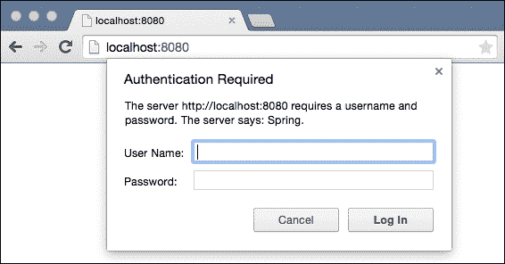
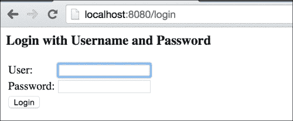
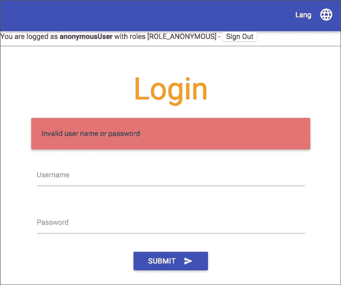
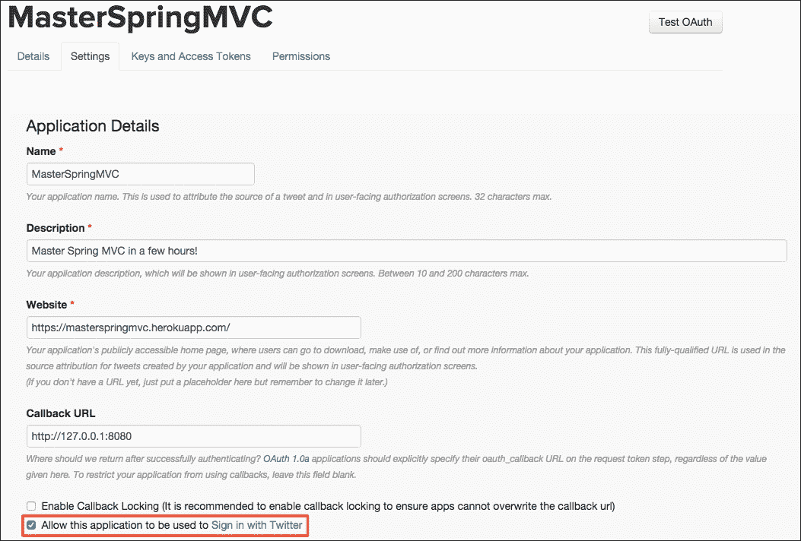
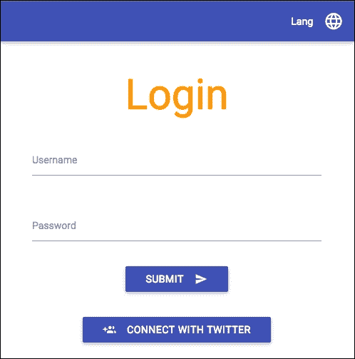
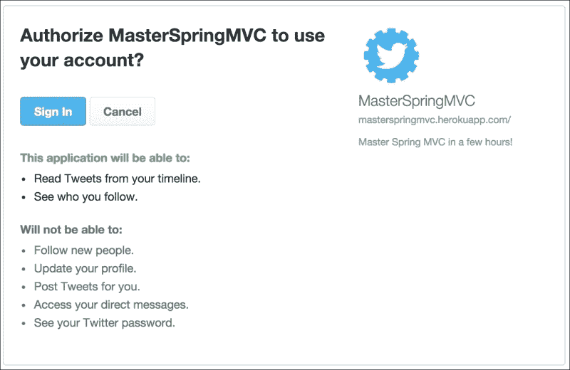
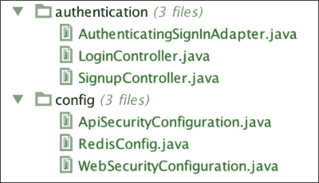

# 第六章。保护您的应用

在本章中，我们将学习如何保护我们的 web 应用，以及如何应对现代分布式 web 应用的安全挑战。

本章将分为五个部分:

*   首先，我们将在几分钟内设置基本的 HTTP 身份验证
*   然后，我们将为 web 页面设计一个基于表单的认证，保留 RESTful API 的基本认证
*   我们将允许用户通过 Twitter OAuth API 注册
*   然后，我们将利用 Spring Session 来确保我们的应用可以使用分布式会话机制进行伸缩
*   最后，我们将配置 Tomcat 通过 SSL 使用安全连接

# 基本认证

最简单的可能的认证机制是基本认证([http://en.wikipedia.org/wiki/Basic_access_authentication](http://en.wikipedia.org/wiki/Basic_access_authentication))。简而言之，没有用户名和密码，我们的页面将无法使用。

我们的服务器将通过发送`401 Not Authorized` HTTP 状态码来表明我们的资源是安全的，并生成一个`WWW-Authenticate`头。

为了成功通过安全检查，客户端必须发送一个包含`Basic`值的`Authorization`头，后跟一个对`user:password`字符串的 base 64 编码。浏览器窗口将提示用户输入用户名和密码，如果身份验证成功，则授予他们访问安全页面的权限。

让我们将 Spring 安全性添加到我们的依赖项中:

```java
compile 'org.springframework.boot:spring-boot-starter-security'
```

重新启动您的应用，并导航到应用中的任何 URL。系统将提示您输入用户名和密码:



如果您没有通过认证，您将会看到一个`401`错误被抛出。默认用户名是`user`。每次应用启动时，都会随机生成正确的身份验证密码，并显示在服务器日志中:

```java
Using default security password: 13212bb6-8583-4080-b790-103408c93115

```

默认情况下，Spring Security 保护每一个资源，除了少数经典路由，如`/css/`、`/js/`、`/images/`和`**/favicon.ico`。

如果您希望配置默认凭证，您可以将以下属性添加到`application.properties`文件中:

```java
security.user.name=admin
security.user.password=secret
```

## 授权用户

在我们的应用中只有一个用户不允许细粒度的安全性。如果我们想要对用户凭证有更多的控制，我们可以在`config`包中添加下面的`SecurityConfiguration`类:

```java
package masterSpringMvc.config;

import org.springframework.beans.factory.annotation.Autowired;
import org.springframework.context.annotation.Configuration;
import org.springframework.security.config.annotation.authentication.builders.AuthenticationManagerBuilder;
import org.springframework.security.config.annotation.method.configuration.EnableGlobalMethodSecurity;
import org.springframework.security.config.annotation.web.configuration.WebSecurityConfigurerAdapter;

@Configuration
@EnableGlobalMethodSecurity(securedEnabled = true)
public class SecurityConfiguration extends WebSecurityConfigurerAdapter {

    @Autowired
    public void configureAuth(AuthenticationManagerBuilder auth)
            throws Exception {
        auth.inMemoryAuthentication()
                .withUser("user").password("user").roles("USER").and()
                .withUser("admin").password("admin").roles("USER", "ADMIN");
    }
}
```

这个片段将建立一个包含我们的应用的用户及其角色的内存系统。它将覆盖以前在应用属性中定义的安全名称和密码。

`@EnableGlobalMethodSecurity`注释将允许我们注释应用的方法和类，以定义它们的安全级别。

例如，假设只有应用的管理员可以访问用户 API。在这种情况下，我们只需向我们的资源添加`@Secured`注释，只允许管理员角色访问:

```java
@RestController
@RequestMapping("/api")
@Secured("ROLE_ADMIN")
public class UserApiController {
  // ... code omitted
}
```

我们可以使用 httpie 通过使用`-a`开关使用基本认证和`-p=h`开关很容易地测试这一点，这将只显示响应头。

让我们用一个没有管理员配置文件的用户来尝试一下:

```java
> http GET 'http://localhost:8080/api/users' -a user:user -p=h
HTTP/1.1 403 Forbidden
Cache-Control: no-cache, no-store, max-age=0, must-revalidate
Content-Type: application/json;charset=UTF-8
Date: Sat, 23 May 2015 17:40:09 GMT
Expires: 0
Pragma: no-cache
Server: Apache-Coyote/1.1
Set-Cookie: JSESSIONID=2D4761C092EDE9A4DB91FA1CAA16C59B; Path=/; HttpOnly
Transfer-Encoding: chunked
X-Content-Type-Options: nosniff
X-Frame-Options: DENY
X-XSS-Protection: 1; mode=block

```

现在，同管理员:

```java
> http GET 'http://localhost:8080/api/users' -a admin:admin -p=h
HTTP/1.1 200 OK
Cache-Control: no-cache, no-store, max-age=0, must-revalidate
Content-Type: application/json;charset=UTF-8
Date: Sat, 23 May 2015 17:42:58 GMT
Expires: 0
Pragma: no-cache
Server: Apache-Coyote/1.1
Set-Cookie: JSESSIONID=CE7A9BF903A25A7A8BAD7D4C30E59360; Path=/; HttpOnly
Transfer-Encoding: chunked
X-Content-Type-Options: nosniff
X-Frame-Options: DENY
X-XSS-Protection: 1; mode=block

```

您还会注意到 Spring Security 自动添加了一些常见的安全头:

*   `Cache Control`:防止用户缓存安全资源
*   这告诉浏览器阻止看起来像 CSS 的东西
*   这不允许我们的站点嵌入到 IFrame 中
*   这可以防止浏览器猜测用于伪造 XSS 攻击的恶意资源的 MIME 类型

### 注意

这些头文件的完整列表可在[http://docs . spring . io/spring-security/site/docs/current/reference/html single/# headers](http://docs.spring.io/spring-security/site/docs/current/reference/htmlsingle/#headers)获得。

## 授权网址

注释我们的控制器非常容易，但并不总是最可行的选择。有时，我们只想完全控制我们的授权。

移除`@Secured`标注；我们会想出更好的办法。

让我们看看通过修改`SecurityConfiguration`类，Spring Security 将允许我们做什么:

```java
@Configuration
@EnableGlobalMethodSecurity(securedEnabled = true)
public class SecurityConfiguration extends WebSecurityConfigurerAdapter {

    @Autowired
    public void configureAuth(AuthenticationManagerBuilder auth)
        throws Exception {
        auth.inMemoryAuthentication()
            .withUser("user").password("user").roles("USER").and()
            .withUser("admin").password("admin").roles("USER", "ADMIN");
    }

    @Override
    protected void configure(HttpSecurity http) throws Exception {
        http
            .httpBasic()
            .and()
            .csrf().disable()
            .authorizeRequests()
            .antMatchers("/login", "/logout").permitAll()
            .antMatchers(HttpMethod.GET, "/api/**").hasRole("USER")
            .antMatchers(HttpMethod.POST, "/api/**").hasRole("ADMIN")
            .antMatchers(HttpMethod.PUT, "/api/**").hasRole("ADMIN")
            .antMatchers(HttpMethod.DELETE, "/api/**").hasRole("ADMIN")
            .anyRequest().authenticated();
    }
}
```

在前面的代码示例中，我们使用 Spring Security 的 fluent API 配置了应用的安全策略。

这个 API 允许我们通过调用与不同安全问题相关联的方法和与`and()`方法链接来全局配置 Spring 安全性。

我们刚刚定义的是基本身份验证，没有 CSRF 保护。将允许所有用户对`/login`和`/logout`的请求。`GET`对 API 的请求将只允许具有`USER`角色的用户访问，而对 API 的`POST`、`PUT`和`DELETE`请求将只允许具有管理员角色的用户访问。最后，所有其他请求都需要任何角色的身份验证。

CSRF 代表**跨站请求伪造**，指的是一种攻击，恶意网站会在其网站上显示一个表单，并在你的网站上张贴表单数据。如果您站点的用户没有注销，`POST`请求将保留用户 cookies，因此将被授权。

CSRF 保护将生成与表单数据一起发布的短期令牌。我们将在下一节看到如何正确启用它；现在，让我们禁用它。详见[http://docs . spring . io/spring-security/site/docs/current/reference/html single/# csrf](http://docs.spring.io/spring-security/site/docs/current/reference/htmlsingle/#csrf)。

### 注意

要了解更多关于授权请求 API 的信息，请查看[http://docs . spring . io/spring-security/site/docs/current/reference/html single/# authorize-requests](http://docs.spring.io/spring-security/site/docs/current/reference/htmlsingle/#authorize-requests)。

## 百里香安全标签

有时，您需要显示来自认证层的数据，例如用户名和角色，或者根据用户权限隐藏和显示部分网页。模块将允许我们这样做。

将以下依赖项添加到您的`build.gradle`文件中:

```java
compile 'org.thymeleaf.extras:thymeleaf-extras-springsecurity3'
```

有了这个库，我们可以在`layout/default.html`中的导航栏下添加一个小块来显示登录的用户:

```java
<!DOCTYPE html>
<html xmlns:layout="http://www.ultraq.net.nz/thymeleaf/layout"
      xmlns:th="http://www.thymeleaf.org"
      xmlns:sec="http://www.thymeleaf.org/thymeleaf-extras-springsecurity3">
<head>
  <!-- content trimmed -->
</head>
<body>

<!-- content trimmed -->
<nav>
    <div class="nav-wrapper indigo">
        <ul class="right">
        <!-- content trimmed -->
        </ul>
    </div>
</nav>
<div>
 You are logged as <b sec:authentication="name" /> with roles <span sec:authentication="authorities" />
 -
 <form th:action="@{/logout}" method="post" style="display: inline-block">
 <input type="submit" value="Sign Out" />
 </form>
 <hr/>
</div>

<section layout:fragment="content">
    <p>Page content goes here</p>
</section>

<!-- content trimmed -->
</body>
</html>
```

注意 HTML 声明中新的名称空间和`sec:authentication`属性。它允许访问代表当前登录用户的`org.springframework.security.core.Authentication`对象的属性，如下面的屏幕截图所示:


暂时不要点击注销链接，因为它不支持基本认证。我们将在下一部分中让它工作。

`lib`标签还有一些其他的标签，比如检查用户授权的标签:

```java
<div sec:authorize="hasRole('ROLE_ADMIN')">
    You are an administrator
</div>
```

### 注意

请参考[https://github . com/thyme leaf/thyme leaf-extras-spring security](https://github.com/thymeleaf/thymeleaf-extras-springsecurity)上的文档，了解更多关于该库的信息。

# 登录表单

基本认证对我们的 RESTful API 来说很好，但我们更希望有一个由我们的团队精心设计的登录页面来改善 web 体验。

Spring Security 允许我们根据需要定义任意多的`WebSecurityConfigurerAdapter`类。我们将把我们的`SecurityConfiguration`类分成两部分:

*   `ApiSecurityConfiguration`:首先进行配置。这将通过基本身份验证来保护 RESTful 端点。
*   这将为我们应用的其余部分配置登录表单。

您可以删除或重命名`SecurityConfiguration`并创建`ApiSecurityConfiguration`:

```java
@Configuration
@Order(1)
public class ApiSecurityConfiguration extends WebSecurityConfigurerAdapter {

    @Autowired
    public void configureAuth(AuthenticationManagerBuilder auth)
        throws Exception {
        auth.inMemoryAuthentication()
            .withUser("user").password("user").roles("USER").and()
            .withUser("admin").password("admin").roles("USER", "ADMIN");
    }

    @Override
    protected void configure(HttpSecurity http) throws Exception {
        http
            .antMatcher("/api/**")
            .httpBasic().and()
            .csrf().disable()
            .authorizeRequests()
            .antMatchers(HttpMethod.GET).hasRole("USER")
            .antMatchers(HttpMethod.POST).hasRole("ADMIN")
            .antMatchers(HttpMethod.PUT).hasRole("ADMIN")
            .antMatchers(HttpMethod.DELETE).hasRole("ADMIN")
            .anyRequest().authenticated();
    }
}
```

注意`@Order(1)`注释，它将确保这个配置在另一个配置之前执行。然后，为 web 创建第二个配置，名为`WebSecurityConfiguration`:

```java
package masterSpringMvc.config;

import org.springframework.context.annotation.Configuration;
import org.springframework.security.config.annotation.web.builders.HttpSecurity;
import org.springframework.security.config.annotation.web.configuration.WebSecurityConfigurerAdapter;

@Configuration
public class WebSecurityConfiguration extends WebSecurityConfigurerAdapter {

    @Override
    protected void configure(HttpSecurity http) throws Exception {
        http
                .formLogin()
                .defaultSuccessUrl("/profile")
                .and()
                .logout().logoutSuccessUrl("/login")
                .and()
                .authorizeRequests()
                .antMatchers("/webjars/**", "/login").permitAll()
                .anyRequest().authenticated();
    }
}
```

这个代码的结果是，任何匹配`/api/**`的内容都将通过基本认证得到保护，没有 CSRF 保护。然后，将加载第二个配置。它会保护其他任何东西。除了 WebJars 和登录页面上的请求之外，应用这一部分的所有内容都需要对客户端进行身份验证(这将避免重定向循环)。

如果未经身份验证的用户试图访问受保护的资源，他们将被自动重定向到登录页面。

默认情况下，登录网址为`GET /login`。默认登录将通过一个包含三个值的`POST /login`请求发布:一个用户名(`username`)、一个密码(`password`)和一个 CSRF 令牌(`_csrf`)。如果登录不成功，用户将被重定向到`/login?error`。默认的注销页面是一个带有 CSRF 令牌的`POST /logout`请求。

现在，如果您尝试在您的应用上导航，这个表单将会自动生成！

如果您已经通过之前的尝试登录，请关闭浏览器。这将清除会话。



我们现在可以登录和退出我们的应用了！

这很可爱，但我们可以做得更好，只需很少的努力。首先，我们将在`WebSecurityConfiguration`类中的`/login`上定义一个登录页面:

```java
@Override
protected void configure(HttpSecurity http) throws Exception {
    http
        .formLogin()
        .loginPage("/login") // <= custom login page
        .defaultSuccessUrl("/profile")
        // the rest of the configuration stays the same
}
```

这将让我们创建我们自己的登录页面。为此，我们需要一个非常简单的控制器来处理`GET login`请求。您可以在`authentication`包中创建一个:

```java
package masterSpringMvc.authentication;

import org.springframework.stereotype.Controller;
import org.springframework.web.bind.annotation.RequestMapping;

@Controller
public class LoginController {

    @RequestMapping("/login")
    public String authenticate() {
        return "login";
    }
}
```

这将触发位于模板目录中的`login.html`页面的显示。让我们创建它:

```java
<!DOCTYPE HTML>
<html xmlns:th="http://www.thymeleaf.org"
      xmlns:layout="http://www.ultraq.net.nz/thymeleaf/layout"
      layout:decorator="layout/default">
<head>
    <title>Login</title>
</head>
<body>
<div class="section no-pad-bot" layout:fragment="content">
    <div class="container">

        <h2 class="header center orange-text">Login</h2>

        <div class="row">
            <div id="errorMessage" class="card-panel red lighten-2" th:if="${param.error}">
                <span class="card-title">Invalid user name or password</span>
            </div>

            <form class="col s12" action="/login" method="post">
                <div class="row">
                    <div class="input-field col s12">
                        <input id="username" name="username" type="text" class="validate"/>
                        <label for="username">Username</label>
                    </div>
                </div>
                <div class="row">
                    <div class="input-field col s12">
                        <input id="password" name="password" type="password" class="validate"/>
                        <label for="password">Password</label>
                    </div>
                </div>
                <div class="row center">
                    <button class="btn waves-effect waves-light" type="submit" name="action">Submit
                        <i class="mdi-content-send right"></i>
                    </button>
                </div>
                <input type="hidden" th:name="${_csrf.parameterName}" th:value="${_csrf.token}"/>
            </form>
        </div>
    </div>
</div>
</body>
</html>
```

请注意，我们处理了错误消息，并且发布了一个 CSRF 令牌。我们还使用默认的用户名和密码输入名称，但是如果需要的话，这些名称是可以配置的。结果看起来已经好多了！



您可以马上看到，默认情况下，Spring Security 将匿名凭证分配给所有未经身份验证的用户。

我们不应该向匿名用户显示注销按钮，这样我们可以将相应的 HTML 部分包装在`sec:authorize="isAuthenticated()"`中，只向经过身份验证的用户显示，就像这样:

```java
<div sec:authorize="isAuthenticated()">
    You are logged as <b sec:authentication="name"/> with roles <span sec:authentication="authorities"/>
    -
    <form th:action="@{/logout}" method="post" style="display: inline-block">
        <input type="submit" value="Sign Out"/>
    </form>
    <hr/>
</div>
```

# 推特认证

我们的应用与 Twitter 紧密集成，因此我们允许通过 Twitter 进行认证似乎是合乎逻辑的。

在继续之前，请确保您已经在 Twitter 上启用 Twitter 登录您的应用([https://apps.twitter.com](https://apps.twitter.com)):



## 设置社交认证

Spring social 支持通过 OAuth 提供者(比如 Twitter)通过登录/注册场景进行身份验证。它将在`/signin/twitter`上拦截一个`POST`请求。如果用户不为`UsersConnectionRepository`接口所知，那么`signup`端点将被调用。这将允许我们采取必要的措施在我们的系统上注册用户，并可能要求他们提供更多的细节。

我们开始工作吧。我们需要做的第一件事是添加`signin/**`和`/signup`URL 作为公共可用资源。让我们修改我们的`WebSecurityConfiguration`类，更改`permitAll`行:

```java
.antMatchers("/webjars/**", "/login", "/signin/**", "/signup").permitAll()
```

为了启用登录/注册场景，我们还需要一个`SignInAdapter`接口，一个简单的侦听器，当一个已知的用户再次登录时将调用它。

我们可以在我们的`LoginController`旁边创建一个`AuthenticatingSignInAdapter`类:

```java
package masterSpringMvc.authentication;

import org.springframework.security.authentication.UsernamePasswordAuthenticationToken;
import org.springframework.security.core.context.SecurityContextHolder;
import org.springframework.social.connect.Connection;
import org.springframework.social.connect.UserProfile;
import org.springframework.social.connect.web.SignInAdapter;
import org.springframework.stereotype.Component;
import org.springframework.web.context.request.NativeWebRequest;

@Component
public class AuthenticatingSignInAdapter implements SignInAdapter {

    public static void authenticate(Connection<?> connection) {
        UserProfile userProfile = connection.fetchUserProfile();
        String username = userProfile.getUsername();
        UsernamePasswordAuthenticationToken authentication = new UsernamePasswordAuthenticationToken(username, null, null);
        SecurityContextHolder.getContext().setAuthentication(authentication);
        System.out.println(String.format("User %s %s connected.", userProfile.getFirstName(), userProfile.getLastName()));
    }

    @Override
    public String signIn(String userId, Connection<?> connection, NativeWebRequest request) {
        authenticate(connection);
        return null;
    }
}
```

正如您所看到的,这个处理程序在最合适的时候被调用，以允许使用 Spring Security 进行用户认证。我们一会儿会回到这个话题。现在，我们需要在同一个包中定义我们的`SignupController`类，它负责第一次访问的用户:

```java
package masterSpringMvc.authentication;

import org.springframework.beans.factory.annotation.Autowired;
import org.springframework.social.connect.Connection;
import org.springframework.social.connect.ConnectionFactoryLocator;
import org.springframework.social.connect.UsersConnectionRepository;
import org.springframework.social.connect.web.ProviderSignInUtils;
import org.springframework.stereotype.Controller;
import org.springframework.web.bind.annotation.RequestMapping;
import org.springframework.web.context.request.WebRequest;

@Controller
public class SignupController {
    private final ProviderSignInUtils signInUtils;

    @Autowired
    public SignupController(ConnectionFactoryLocator connectionFactoryLocator, UsersConnectionRepository connectionRepository) {
        signInUtils = new ProviderSignInUtils(connectionFactoryLocator, connectionRepository);
    }

    @RequestMapping(value = "/signup")
    public String signup(WebRequest request) {
        Connection<?> connection = signInUtils.getConnectionFromSession(request);
        if (connection != null) {
            AuthenticatingSignInAdapter.authenticate(connection);
            signInUtils.doPostSignUp(connection.getDisplayName(), request);
        }
        return "redirect:/profile";
    }
}
```

首先，这个控制器从会话中检索当前连接。然后，它通过与之前相同的方法验证用户。最后，它将触发`doPostSignUp`事件，这将允许 Spring Social 在我们之前提到的`UsersConnectionRepository`界面中存储与我们的用户相关的信息。

我们需要做的最后一件事是将一个成功的“用 twitter 登录”按钮添加到我们的登录页面，就在前一个表单的下面:

```java
<form th:action="@{/signin/twitter}" method="POST" class="center">
    <div class="row">
        <button class="btn indigo" name="twitterSignin" type="submit">Connect with Twitter
            <i class="mdi-social-group-add left"></i>
        </button>
    </div>
</form>
```



当用户点击**连接 TWITTER** 按钮时，他们将被重定向到 TWITTER 登录页面:



## 解释

代码不多，但是要理解所有的部分有点棘手。了解事情进展的第一步是看一看 Spring Boot 的课程。

该类中声明的`SocialAutoConfigurationAdapter`类包含以下 bean:

```java
@Bean
@ConditionalOnBean(SignInAdapter.class)
@ConditionalOnMissingBean(ProviderSignInController.class)
public ProviderSignInController signInController(
        ConnectionFactoryLocator factoryLocator,
        UsersConnectionRepository usersRepository, SignInAdapter signInAdapter) {
    ProviderSignInController controller = new ProviderSignInController(
            factoryLocator, usersRepository, signInAdapter);
    if (!CollectionUtils.isEmpty(this.signInInterceptors)) {
 controller.setSignInInterceptors(this.signInInterceptors);
    }
    return controller;
}
```

如果在我们的配置中检测到一个`ProviderSignInController`类，将自动设置`ProviderSignInController`类。这个控制器是登录过程的基石。看看它是做什么的(我只总结重要的部分):

*   它将从我们的连接按钮处理`POST /signin/{providerId}`
*   它会将用户重定向到我们的身份识别提供商的相应登录 URL
*   它将通过来自标识提供者的`GET /signin/{providerId}`被通知 OAuth 令牌
*   然后，它将处理登录
*   如果在`UsersConnectionRepository`界面中没有找到用户，它将使用一个`SessionStrategy`界面来存储未决的登录请求，然后重定向到`signupUrl`页面
*   如果找到用户，调用`SignInAdapter`接口，用户被重定向到`postSignupUrl`页面

这个标识的两个重要组成部分是负责从某种存储中存储和检索用户的`UsersConnectionRepository`接口和临时存储用户连接的`SessionStrategy`接口，这样就可以从`SignupController`类中检索用户连接。

默认情况下，Spring Boot 为每个身份验证提供者创建一个`InMemoryUsersConnectionRepository`接口，这意味着我们的用户连接数据将存储在内存中。如果我们重新启动服务器，用户将变得未知，并将再次经历注册过程。

`ProviderSignInController`类默认为`HttpSessionSessionStrategy`，它将在 HTTP 会话中存储连接。我们在`SignupController`类中使用的`ProviderSignInUtils`类也默认使用这种策略。如果我们在多台服务器上分发我们的应用，这将是一个问题，因为会话可能不会在每台服务器上都可用。

通过为`ProviderSignInController`和`ProviderSignInUtils`类提供一个定制的`SessionStrategy`接口来将数据存储在 HTTP 会话之外的某个地方，可以很容易地覆盖这些缺省值。

同样，我们可以通过提供另一个`UsersConnectionRepository`接口的实现，为我们的用户连接数据使用另一种存储。

Spring Social 提供了一个`JdbcUsersConnectionRepository`接口，可以自动将经过验证的用户保存在数据库的一个`UserConnection`表中。这不会在本书中广泛讨论，但是通过将下面的 bean 添加到您的配置中，您应该能够很容易地配置它:

```java
@Bean
@Primary
public UsersConnectionRepository getUsersConnectionRepository(
  DataSource dataSource, ConnectionFactoryLocator connectionFactoryLocator) {
    return new JdbcUsersConnectionRepository(
      dataSource, connectionFactoryLocator, Encryptors.noOpText());
}
```

### 注意

在我的博客上查看这篇文章[http://geowarin . github . io/spring/2015/08/02/social-log in-with-spring . html](http://geowarin.github.io/spring/2015/08/02/social-login-with-spring.html)了解更多细节。

# 分布式会话

正如我们在上一节中看到的，Spring Social 在 HTTP 会话中存储东西的时候有好几次。我们的用户配置文件也存储在会话中。这是一种经典的方法，只要用户在浏览站点，就将内容保存在内存中。

然而，如果我们想要扩展我们的应用并将负载分布到多个后端服务器，这可能会很麻烦。我们现在已经进入了云时代，[第 8 章](08.html "Chapter 8\. Optimizing Your Requests")、*优化您的请求*将是关于将我们的应用部署到云。

为了让我们的会话在分布式环境中工作，我们有几个选择:

*   我们可以使用粘性会话。这将确保特定用户总是被重定向到相同的服务器并保持其会话。它需要额外的部署配置，不是一个特别好的方法。
*   重构我们的代码，将数据放入数据库而不是会话中。然后，如果我们将用户数据与客户机在每次请求时发送的 cookie 或令牌相关联，我们就可以从数据库中加载用户数据。
*   使用 Spring Session 项目透明地使用分布式数据库(如 Redis)作为底层会话提供者。

在本章中，我们将看到如何建立第三种方法。它真的很容易设置，并提供了惊人的好处，它可以关闭，而不会影响我们的应用的功能。

我们需要做的第一件事是安装 Redis。要在 Mac 上安装它，请使用`brew`命令:

```java
brew install redis

```

对于其他平台，按照[http://redis.io/download](http://redis.io/download)的指示。

然后，您可以使用以下命令启动服务器:

```java
redis-server

```

将以下依赖项添加到您的`build.gradle`文件中:

```java
compile 'org.springframework.boot:spring-boot-starter-redis'
compile 'org.springframework.session:spring-session:1.0.1.RELEASE'
```

在`application.properties`旁边创建一个名为`application-redis.properties`的新的配置文件:

```java
spring.redis.host=localhost
spring.redis.port=6379
```

Spring Boot 提供了一种将配置文件与概要文件关联起来的便捷方式。在这种情况下，`application-redis.properties`文件只有在 Redis 概要文件激活时才会被加载。

然后，在`config`包中创建一个`RedisConfig`类:

```java
package masterSpringMvc.config;

import org.springframework.context.annotation.Configuration;
import org.springframework.context.annotation.Profile;
import org.springframework.session.data.redis.config.annotation.web.http.EnableRedisHttpSession;

@Configuration
@Profile("redis")
@EnableRedisHttpSession
public class RedisConfig {
}
```

如您所见，只有当`redis`配置文件打开时，该配置才会被激活。

我们完了！我们现在可以使用以下标志发布我们的应用:

```java
-Dspring.profiles.active=redis

```

您还可以使用`gradlew build`生成 JAR，并使用以下命令启动它:

```java
java -Dserver.port=$PORT -Dspring.profiles.active=redis -jar app.jar

```

或者，您可以在 Bash 中用 Gradle 启动它，如下所示:

```java
SPRING_PROFILES_ACTIVE=redis ./gradlew bootRun

```

您也可以在 IDE 的运行配置中将它设置为一个 JVM 选项。

就是这样！现在，您有了一个存储登录用户详细信息的服务器。这意味着我们可以为我们的网络资源扩展并拥有多个服务器，而我们的用户不会注意到。我们不需要写任何代码。

这也意味着即使你重启服务器，你也能保持你的会话。

要查看它的工作情况，用`redis-cli`命令连接到 Redis。开始时，它不包含任何键:

```java
> redis-cli
127.0.0.1:6379> KEYS *
(empty list or set)

```

导航至您的应用，开始在会话中输入内容:

```java
127.0.0.1:6379> KEYS *
1) "spring:session:expirations:1432487760000"
2) "spring:session:sessions:1768a55b-081a-4673-8535-7449e5729af5"
127.0.0.1:6379> HKEYS spring:session:sessions:1768a55b-081a-4673-8535-7449e5729af5
1) "sessionAttr:SPRING_SECURITY_CONTEXT"
2) "sessionAttr:org.springframework.security.web.csrf.HttpSessionCsrfTokenRepository.CSRF_TOKEN"
3) "lastAccessedTime"
4) "maxInactiveInterval"
5) "creationTime"

```

### 注意

您可以在[http://redis.io/commands](http://redis.io/commands)查阅可用命令列表。

# SSL

**安全套接字层** ( **SSL** )是一种安全协议，其中数据被加密并通过证书发送给可信方。在这一部分，我将向您展示创建与 Spring Boot 的安全连接的不同方法。完成这些步骤并不是开始下一章的必要条件。它们是为了完整性而包含在内的，所以如果您急于将应用部署到云中，可以跳过它们。

在[第 9 章](09.html "Chapter 9\. Deploying Your Web Application to the Cloud")、*将您的 Web 应用部署到云*中，我们将看到大多数云平台已经处理 SSL，因此我们不需要在我们的终端配置它。

## 生成自签名证书

通常，X.509 证书由证书颁发机构提供。他们通常会向您收取服务的费用，因此出于测试目的，我们可以创建自己的自签名密钥库文件。

JDK 附带了一个名为 keytool 的二进制文件，用于管理证书。使用它，您可以创建一个密钥库并将证书导入到现有的密钥库中。您可以在项目根目录中发出以下命令来创建一个:

```java
$ keytool -genkey -alias masterspringmvc -keyalg RSA -keystore src/main/resources/tomcat.keystore
Enter keystore password: password
Re-enter new password: password
What is your first and last name?
 [Unknown]:  Master Spring MVC
What is the name of your organizational unit?
 [Unknown]:  Packt
What is the name of your organization?
 [Unknown]:  Packt
What is the name of your City or Locality?
 [Unknown]:  Paris
What is the name of your State or Province?
 [Unknown]:  France
What is the two-letter country code for this unit?
 [Unknown]:  FR
Is CN=Master Spring MVC, OU=Packt, O=Packt, L=Paris, ST=France, C=FR correct?
 [no]:  yes

Enter key password for <masterspringmvc>
 (RETURN if same as keystore password): password2
Re-enter new password: password2

```

这将使用 RSA 算法生成一个名为`masterspringmvc`的密钥库，并将它存储在`src/main/resources`中的密钥库中。

### Tip

不要将密钥库推送到您的存储库。它可以被暴力破解，这将使你的网站失去安全性。您还应该使用随机生成的强密码来生成密钥库。

## 简单的方法

如果您所关心的是有一个安全的 https 通道而没有 http 通道，这很简单:

```java
server.port = 8443
server.ssl.key-store = classpath:tomcat.keystore

server.ssl.key-store-password = password
server.ssl.key-password = password2

```

### Tip

不要将您的密码推送到您的存储库中。使用`${}`符号导入环境变量。

## 双重方式

如果您想在您的应用中同时拥有 http 和 https 通道，您应该将这种配置添加到您的应用中:

```java
@Configuration
public class SslConfig {

    @Bean
    public EmbeddedServletContainerFactory servletContainer() throws IOException {
        TomcatEmbeddedServletContainerFactory tomcat = new TomcatEmbeddedServletContainerFactory();
        tomcat.addAdditionalTomcatConnectors(createSslConnector());
        return tomcat;
    }

    private Connector createSslConnector() throws IOException {
        Connector connector = new Connector(Http11NioProtocol.class.getName());
        Http11NioProtocol protocol =
                (Http11NioProtocol) connector.getProtocolHandler();
        connector.setPort(8443);
        connector.setSecure(true);
        connector.setScheme("https");
        protocol.setSSLEnabled(true);
        protocol.setKeyAlias("masterspringmvc");
        protocol.setKeystorePass("password");
        protocol.setKeyPass("password2");
        protocol.setKeystoreFile(new ClassPathResource("tomcat.keystore").getFile().getAbsolutePath());
        protocol.setSslProtocol("TLS");
        return connector;
    }
}
```

这将加载先前生成的密钥库，以在端口 8080 之外的端口 8443 上创建一个额外的通道。

您可以使用 Spring Security 自动将连接从`http`重定向到`https`，并使用进行如下配置:

```java
@Configuration
public class WebSecurityConfiguration extends WebSecurityConfigurerAdapter {

    @Override
    protected void configure(HttpSecurity http) throws Exception {
        http
            .requiresChannel().anyRequest().requiresSecure()
            .and()
            /* rest of the configuration */;
    }
}
```

## 安全服务器的背后

用 SSL 保护您的应用的最方便的方法通常是将它放在支持 SSL 的 web 服务器后面，比如 Apache 或 CloudFlare。这些通常使用事实上的头来表示连接是以前用 SSL 发起的。

如果你告诉 Spring Boot 你的`application.properties`文件中正确的头是什么，它就能理解这个协议:

```java
server.tomcat.remote_ip_header=x-forwarded-for
server.tomcat.protocol_header=x-forwarded-proto

```

### 注意

在[http://docs . spring . io/spring-boot/docs/current/reference/html/how to-embedded-servlet-containers . html # how to-use-Tomcat-behind-a-proxy-server](http://docs.spring.io/spring-boot/docs/current/reference/html/howto-embedded-servlet-containers.html#howto-use-tomcat-behind-a-proxy-server)获取更多详细信息，请参见这里的文档。

# 检查点

在本章中，我们添加了三项配置:`ApiSecurityConfiguration`，它将我们的 REST API 配置为使用基本的 HTTP 认证；`WebSecurityConfiguration`，它为我们的 web 用户设置了一个登录表单，以便使用帐户或 Twitter 进行登录；还有`RedisConfig`，它允许我们的会话被存储在 Redis 服务器上，也可以从 Redis 服务器上检索。

在身份验证包中，我们添加了一个重定向到我们的登录页面的`LoginController`类，一个用户第一次注册 Twitter 时将调用的`SignupController`类，以及一个每次使用 Twitter 登录时都将调用的`AuthenticatingSignInAdapater`类:



# 总结

用 Spring 保护我们的 web 应用非常简单。可能性无穷，社交签到等高级配置触手可及。分发会话和扩展也需要几分钟的时间。

在下一章，我们将看到如何测试我们的应用，并确保它永远不会倒退。