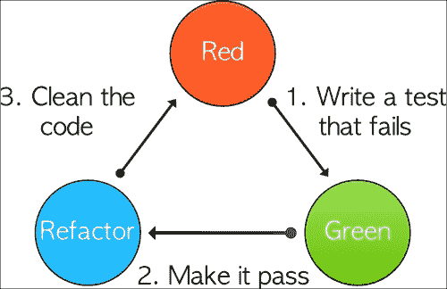
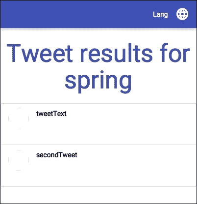
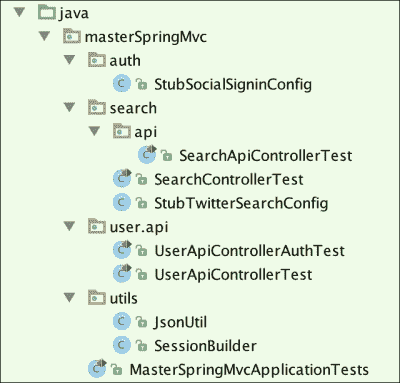
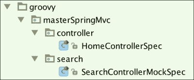

# 七、不要心存侥幸——单元测试和验收测试

在这一章中，我们将了解为什么以及如何测试我们的应用。我们将看到单元测试和验收测试之间的区别，并学习如何做这两者。

本章分为两部分。在第一部分中，我们将用 Java 编写测试，同时研究不同的测试方法。在较短的第二部分中，我们将使用 Groovy 编写完全相同的测试，并看看如何使用这种出色的语言来提高代码的可读性。

如果你做了这一章中的所有事情，你将会有双重测试，所以请放心，只保留那些对你来说可读性最强的测试。

# 为什么我要测试我的代码？

在 Java 世界中工作让许多开发人员意识到了测试的重要性。一系列好的测试可以及早发现退化，让我们在发货时更有信心。

很多人现在都很熟悉持续集成的概念([http://www.thoughtworks.com/continuous-integration](http://www.thoughtworks.com/continuous-integration))。这是一个实践，其中服务器负责在每次对源代码控制系统进行更改时构建应用。

构建应该尽可能快，并且能够自我测试。这种做法的主要思想是获得一个快速的反馈回路；一旦系统中的某个部分出了问题，您就应该得到详细的信息。

你为什么要在乎？毕竟，测试您的应用是一项额外的成本；花费在设计和维护测试上的时间必然会消耗一些开发时间。

事实上，一个错误发现得越晚，代价就越大。如果你想一想，即使是你的 QA 团队发现的一个 bug 开始比你自己发现的一个 bug 花费更多。它迫使你切换回你写代码时所处的上下文:我为什么要写这一行？该功能的基本业务规则是什么？

如果您在早期编写测试，并且能够在几秒钟内启动它们，那么解决代码中的潜在错误肯定会花费更少的时间。

测试的另一个好处是它们可以作为你代码的活文档。虽然编写大量的文档，甚至代码注释，会被证明是无效的，因为它们很容易变得过时，但是养成为极限情况或令人惊讶的行为编写良好测试的习惯将作为未来的安全网。

这行代码是干什么用的？你有没有发现自己问这种问题？好吧，如果你有一套好的单元测试，你可以删除它，看看有什么问题！测试给了我们对代码和重构能力前所未有的信心。软件非常脆弱。如果你停止关心，它会慢慢腐烂和死亡。

要有责任心——不要让你的代码死掉！

# 我应该如何测试我的代码？

我们可以对一个软件进行不同种类的测试，比如安全性测试、性能测试等等。作为开发人员，我们将专注于我们可以自动化的测试和，这将帮助改进我们的代码。

测试分为两类:单元测试和验收测试。测试金字塔([http://martinfowler.com/bliki/TestPyramid.html](http://martinfowler.com/bliki/TestPyramid.html))显示了这些测试应该按什么比例编写:


在金字塔的底部，你有单元测试(快速启动和相对容易维护)，在顶部，UI 测试(昂贵和缓慢执行)。集成测试位于中间:它们可以被视为大型单元测试，在单元之间有复杂的交互。

金字塔的理念是提醒你把注意力放在你最有影响力的地方，并获得最好的反馈循环。

# 测试驱动的开发

许多开发人员养成了健康的习惯**测试驱动开发**(**)。这种实践继承了极限编程(XP)的，是将每个开发阶段分成小步骤，然后为每个步骤编写失败测试的过程。您进行必要的修改，以便再次通过测试(测试为绿色)。只要测试保持绿色，您就可以重构代码。下图说明了 TDD 周期:**

 **

您可以迭代,直到用非常短的反馈循环完成特性，确保没有回归，并保证您编写的所有代码都将从一开始就被测试。

TDD 受到了批评。最有趣的是这些:

*   编写测试比实际实现要花更多的时间
*   它会导致设计不良的应用

事实是，成为一名优秀的 TDD 实践者需要时间。一旦你有了应该测试什么的感觉，并且足够了解你的工具，你根本不会损失太多时间。

这也需要有经验的开发人员使用 TDD(或任何其他方法)通过适当的设计来制作应用。糟糕的设计可能是 TDD 的副作用，如果你被困在婴儿步骤的咒语中，而忘记了看大图。诚然，TDD 不会神奇地导致伟大的应用设计，所以要小心，记住在完成每个特性后后退一步。

从本书开始，我们的代码中只有一个自动生成的单元测试。这太糟糕了！我们没有遵循好的惯例。本章就是为了解决这个问题。

# 单元测试

我们可以编写的低级测试叫做单元测试。他们应该测试一小部分代码，因此有了单元的概念。你如何定义一个单位取决于你自己；它可以是一个类，也可以是一组密切相关的类。定义这个概念将决定什么将被嘲笑(替换为虚拟对象)。您打算用轻量级的替代方案来替换数据库吗？你会用外部服务取代交互吗？你会模拟那些行为与被测试内容无关的密切相关的对象吗？

我的建议是保持一种平衡的方法。保持你的测试干净快速，其他的事情都会随之而来。

我很少完全嘲笑数据层。我倾向于使用嵌入式数据库进行测试。它们提供了一种在测试时加载数据的简单方法。

通常，我总是嘲笑与外部服务的协作，原因有两个，如下:

*   测试的速度以及在不连接网络的情况下运行测试的可能性
*   为了能够在与这些服务通信的同时测试错误情况

此外，嘲笑和存根之间有一个微妙的区别。我们将尝试使用这两种方法来了解它们之间的关系。

## 适合这项工作的工具

测试新手的第一个障碍是缺乏编写相关和可维护测试的好工具和库的知识。

我打算在这里列举几个。这个列表并不详尽，但是它包含了我们将要使用的工具，并且很容易与 Spring 兼容:

<colgroup><col style="text-align: left"> <col style="text-align: left"></colgroup> 
| 单元测试 | 最普遍采用的 Java 测试运行程序。默认情况下由所有构建工具启动。 |
| 维护 | 流畅的断言库。比 Hamcrest 好用多了。 |
| Mockito | 一个简单的嘲讽框架。 |
| DbUnit | 用 XML 数据集模拟和断言数据库内容。 |
| 斯波克 | 用行为驱动开发(BDD)风格(给定/何时/然后)编写测试的优雅的 Groovy DSL。 |

Groovy 在我的测试工具集中占有一席之地。即使您还没有准备好将一些 Groovy 代码投入生产，您也可以在测试中轻松使用这种语言的便利。对于 Gradle 来说，这很容易做到，但我们将在几分钟后看到这一点。

# 验收测试

在 web 应用的上下文中，“验收测试”通常是指浏览器内的端到端测试。在 Java 世界中，Selenium 显然是最可靠和最成熟的库之一。

在 JavaScript 的世界里，我们可以找到其他的替代品，比如幻想曲或者量角器。PhantomJS 与我们的情况非常相关，因为有一个 web 驱动程序可以在这个无头浏览器中运行 Selenium 测试，这将缩短启动时间，并且不需要模拟 X 服务器或启动单独的 Selenium 服务器:

<colgroup><col style="text-align: left"> <col style="text-align: left"></colgroup> 
| 硒 2 | 这提供了 web 驱动程序来引导浏览器进行自动化测试。 |
| 幻象 | 无头浏览器(没有 GUI)。可能是最快的浏览器。 |
| 氟碲酸盐 | 用于引导硒测试的流畅库。 |
| Geb | 一个用于引导硒测试的极好的库。 |

# 我们的第一个单元测试

现在是时候编写我们的第一个单元测试了。

我们将把重点放在编写控制器级别的测试上，因为我们几乎没有业务代码或服务。为 Spring MVC 编写测试的关键是我们的类路径中的`org.springframework.boot:spring-boot-starter-test`依赖。它将添加一些非常有用的库，例如:

*   这是 JUnit 的断言库
*   这是一个嘲弄的图书馆
*   这是春季测试图书馆

我们将测试重定向到用户尚未创建个人资料时创建的个人资料页面。

我们已经有了一个名为`MasterSpringMvc4ApplicationTests`的自动生成测试。这是可以用 Spring test 框架编写的最基本的测试:如果无法加载上下文，它除了崩溃之外什么也不做:

```java
@RunWith(SpringJUnit4ClassRunner.class)
@SpringApplicationConfiguration(classes = MasterSpringMvc4Application.class)
@WebAppConfiguration
public class MasterSpringMvc4ApplicationTests {

    @Test
    public void contextLoads() {
    }
}
```

我们可以删除这个测试，并创建一个测试来确保没有配置文件的用户在默认情况下会被重定向到配置文件页面。它会实际测试`HomeController`类的代码，所以我们姑且称之为`HomeControllerTest`类，放在`src/test/java`中与`HomeController`同一个包里。所有的 ide 都有从类中创建 JUnit 测试用例的快捷方式。现在就了解如何使用您的产品吧！

测试如下:

```java
package masterSpringMvc.controller;

import masterSpringMvc.MasterSpringMvcApplication;
import org.junit.Before;
import org.junit.Test;
import org.junit.runner.RunWith;
import org.springframework.beans.factory.annotation.Autowired;
import org.springframework.boot.test.SpringApplicationConfiguration;
import org.springframework.test.context.junit4.SpringJUnit4ClassRunner;
import org.springframework.test.context.web.WebAppConfiguration;
import org.springframework.test.web.servlet.MockMvc;
import org.springframework.test.web.servlet.setup.MockMvcBuilders;
import org.springframework.web.context.WebApplicationContext;

import static org.springframework.test.web.servlet.request.MockMvcRequestBuilders.*;
import static org.springframework.test.web.servlet.result.MockMvcResultHandlers.print;
import static org.springframework.test.web.servlet.result.MockMvcResultMatchers.*;

@RunWith(SpringJUnit4ClassRunner.class)
@SpringApplicationConfiguration(classes = MasterSpringMvcApplication.class)
@WebAppConfiguration
public class HomeControllerTest {
    @Autowired
    private WebApplicationContext wac;

    private MockMvc mockMvc;

    @Before
    public void setup() {
        this.mockMvc = MockMvcBuilders.webAppContextSetup(this.wac).build();
    }

    @Test
    public void should_redirect_to_profile() throws Exception {
        this.mockMvc.perform(get("/"))
                .andDo(print())
                .andExpect(status().isFound())
                .andExpect(redirectedUrl("/profile"));
    }
}
```

我们使用`MockMvc`来模拟与 Spring 控制器的交互，而没有 Servlet 容器的实际开销。

我们还使用 Spring 提供的两个匹配器来断言我们的结果。他们实际上实现了 Hamcrest 匹配器。

`.andDo(print())`语句将为测试场景的请求和响应产生一个简洁的调试输出。觉得太啰嗦可以评论一下。

这就是全部了！语法在开始时有点棘手，但是一个具有良好完整性的 IDE 将能够帮助您。

现在我们想测试一下，如果用户已经填写了他们个人资料的测试部分，我们是否可以将他们重定向到正确的搜索。为此，我们需要用`MockHttpSession`类来存根会话:

```java
import org.springframework.mock.web.MockHttpSession;
import masterSpringMvc.profile.UserProfileSession;

// put this test below the other one
@Test
public void should_redirect_to_tastes() throws Exception {
    MockHttpSession session = new MockHttpSession();
    UserProfileSession sessionBean = new UserProfileSession();
    sessionBean.setTastes(Arrays.asList("spring", "groovy"));
    session.setAttribute("scopedTarget.userProfileSession", sessionBean);

    this.mockMvc.perform(get("/").session(session))
        .andExpect(status().isFound())
        .andExpect(redirectedUrl("/search/mixed;keywords=spring,groovy"));
}
```

您必须将`setTastes()`设置器添加到`UserProfileSession` bean 中，测试才能进行。

在`org.springframework.mock.web`包中有很多针对 Servlet 环境的模仿工具。

注意，表示会话中 bean 的属性以`scopedTarget`为前缀。这是因为 Spring 代理了会话 beans。因此，在 Spring 上下文中实际上有两个对象，我们定义的实际 bean 及其将在会话中结束的代理。

模拟会话是一个简洁的类，但是我们可以用一个构建器来重构测试，该构建器将隐藏实现细节并可以在以后重用:

```java
@Test
public void should_redirect_to_tastes() throws Exception {

    MockHttpSession session = new SessionBuilder().userTastes("spring", "groovy").build();
    this.mockMvc.perform(get("/")
        .session(session))
        .andExpect(status().isFound())
        .andExpect(redirectedUrl("/search/mixed;keywords=spring,groovy"));
}
```

构建器的代码如下:

```java
public class SessionBuilder {
    private final MockHttpSession session;
    UserProfileSession sessionBean;

    public SessionBuilder() {
        session = new MockHttpSession();
        sessionBean = new UserProfileSession();
        session.setAttribute("scopedTarget.userProfileSession", sessionBean);
    }

    public SessionBuilder userTastes(String... tastes) {
        sessionBean.setTastes(Arrays.asList(tastes));
        return this;
    }

    public MockHttpSession build() {
        return session;
    }
}
```

当然，在这个重构之后，你的测试应该总是通过的。

# 模拟和存根

如果我们想测试由`SearchController`类处理的搜索请求，我们会当然想要模仿`SearchService`。

有两种方法可以做到这一点:使用模拟或存根。

## 用嘲笑的口吻嘲讽

首先，我们可以用 Mockito 创建一个模拟对象:

```java
package masterSpringMvc.search;

import masterSpringMvc.MasterSpringMvcApplication;
import org.junit.Before;
import org.junit.Test;
import org.junit.runner.RunWith;
import org.mockito.InjectMocks;
import org.mockito.Mock;
import org.mockito.MockitoAnnotations;
import org.springframework.boot.test.SpringApplicationConfiguration;
import org.springframework.test.context.junit4.SpringJUnit4ClassRunner;
import org.springframework.test.context.web.WebAppConfiguration;
import org.springframework.test.web.servlet.MockMvc;
import org.springframework.test.web.servlet.setup.MockMvcBuilders;

import java.util.Arrays;

import static org.hamcrest.Matchers.*;
import static org.mockito.Matchers.*;
import static org.mockito.Mockito.*;
import static org.springframework.test.web.servlet.request.MockMvcRequestBuilders.get;
import static org.springframework.test.web.servlet.result.MockMvcResultMatchers.*;

@RunWith(SpringJUnit4ClassRunner.class)
@SpringApplicationConfiguration(classes = MasterSpringMvcApplication.class)
@WebAppConfiguration
public class SearchControllerMockTest {
    @Mock
    private SearchService searchService;

    @InjectMocks
    private SearchController searchController;

    private MockMvc mockMvc;

    @Before
    public void setup() {
        MockitoAnnotations.initMocks(this);
        this.mockMvc = MockMvcBuilders
                .standaloneSetup(searchController)
                .setRemoveSemicolonContent(false)
                .build();
    }

    @Test
    public void should_search() throws Exception {

        when(searchService.search(anyString(), anyListOf(String.class)))
                .thenReturn(Arrays.asList(
                        new LightTweet("tweetText")
                ));

        this.mockMvc.perform(get("/search/mixed;keywords=spring"))
                .andExpect(status().isOk())
                .andExpect(view().name("resultPage"))
                .andExpect(model().attribute("tweets", everyItem(
                        hasProperty("text", is("tweetText"))
                )));

        verify(searchService, times(1)).search(anyString(), anyListOf(String.class));
    }
}
```

您可以看到，我们没有使用 web 应用上下文来设置`MockMvc`，而是创建了一个独立的上下文。这个上下文将只包含我们的控制器。这意味着我们可以完全控制控制器及其依赖项的实例化和初始化。它将允许我们轻松地在控制器内部注入一个模拟。

缺点是我们必须重新声明我们的配置，比如说我们不想删除分号后的 URL 字符。

我们使用几个 Hamcrest 匹配器来断言将出现在视图模型中的属性。

mock 方法有它的好处，比如能够验证与 mock 的交互并在运行时创建期望。

这也将使您的测试与对象的实际实现相结合。例如，如果您更改了控制器中获取 tweet 的方式，您可能会破坏与该控制器相关的测试，因为它们仍然试图模仿我们不再依赖的服务。

## 测试时踩碎我们的豆子

另一种方法是在我们的测试中用另一个类替换我们的类的实现。

我们早期有点懒惰，没有为`SearchService`定义接口。总是对接口编程，而不是对实现编程。在这个众所周知的智慧背后，隐藏着来自“四人帮”的最重要的教训。

控制反转的好处之一是允许在测试或真实系统中轻松替换我们的实现。为此，我们必须用新的接口修改所有的用法`SearchService`。有了一个好的 IDE，有一个叫做`extract interface`的重构就可以做到这一点。这将创建一个包含我们的`SearchService`类的公共方法`search()`的接口:

```java
public interface TwitterSearch {
    List<LightTweet> search(String searchType, List<String> keywords);
}
```

当然，我们的两个控制器`SearchController`和`SearchApiController`现在必须使用接口而不是实现。

我们现在有能力专门为我们的测试用例为`TwitterSearch`类创建一个测试 double。为此，我们需要声明一个名为`StubTwitterSearchConfig`的新 Spring 配置，它将包含`TwitterSearch`的另一个实现。我把它放在搜索包里，在`SearchControllerMockTest`旁边:

```java
package masterSpringMvc.search;

import org.springframework.context.annotation.Bean;
import org.springframework.context.annotation.Configuration;
import org.springframework.context.annotation.Primary;

import java.util.Arrays;

@Configuration
public class StubTwitterSearchConfig {
    @Primary @Bean
    public TwitterSearch twitterSearch() {
        return (searchType, keywords) -> Arrays.asList(
                new LightTweet("tweetText"),
                new LightTweet("secondTweet")
        );
    }
}
```

在这个配置类中，我们用`@Primary`注释重新声明了`TwitterSearch` bean，如果在类路径中发现其他实现，它将告诉 Spring 优先使用这个实现。

由于`TwitterSearch`接口只包含一个方法，我们可以用 lambda 表达式来实现它。

下面是使用我们的`StubConfiguration`类以及带有`SpringApplicationConfiguration`注释的主配置的完整测试:

```java
package masterSpringMvc.search;

import masterSpringMvc.MasterSpringMvcApplication;
import org.junit.Before;
import org.junit.Test;
import org.junit.runner.RunWith;
import org.springframework.beans.factory.annotation.Autowired;
import org.springframework.boot.test.SpringApplicationConfiguration;
import org.springframework.test.context.junit4.SpringJUnit4ClassRunner;
import org.springframework.test.context.web.WebAppConfiguration;
import org.springframework.test.web.servlet.MockMvc;
import org.springframework.test.web.servlet.setup.MockMvcBuilders;
import org.springframework.web.context.WebApplicationContext;

import static org.hamcrest.Matchers.*;
import static org.springframework.test.web.servlet.request.MockMvcRequestBuilders.get;
import static org.springframework.test.web.servlet.result.MockMvcResultMatchers.*;

@RunWith(SpringJUnit4ClassRunner.class)
@SpringApplicationConfiguration(classes = {
        MasterSpringMvcApplication.class,
        StubTwitterSearchConfig.class
})
@WebAppConfiguration
public class SearchControllerTest {
    @Autowired
    private WebApplicationContext wac;

    private MockMvc mockMvc;

    @Before
    public void setup() {
        this.mockMvc = MockMvcBuilders.webAppContextSetup(this.wac).build();
    }

    @Test
    public void should_search() throws Exception {

        this.mockMvc.perform(get("/search/mixed;keywords=spring"))
                .andExpect(status().isOk())
                .andExpect(view().name("resultPage"))
                .andExpect(model().attribute("tweets", hasSize(2)))
                .andExpect(model().attribute("tweets",
                                hasItems(
                                        hasProperty("text", is("tweetText")),
                                        hasProperty("text", is("secondTweet"))
                                ))
                );
    }
}
```

## 我应该使用仿制品还是存根？

这两种方法各有千秋。关于详细的解释，请看马丁·福勒的这篇伟大的文章:【http://martinfowler.com/articles/mocksArentStubs.html·T2】。

我的测试例程更多的是关于写存根，因为我喜欢测试我的对象的输出，而不是它们的内部工作。但这取决于你。Spring 的核心是一个依赖注入框架，这意味着你可以很容易地选择你最喜欢的方法。

# 单元测试 REST 控制器

我们刚刚测试了重定向到视图的传统控制器。测试一个 REST 控制器在原理上非常相似，但是有一些微妙之处。

因为我们要去测试控制器的 JSON 输出，我们需要一个 JSON 断言库。将以下依赖项添加到您的`build.gradle`文件中:

```java
testCompile 'com.jayway.jsonpath:json-path'
```

让我们为`SearchApiController`类编写一个测试，这个控制器允许搜索 tweet 并以 JSON 或 XML 的形式返回结果:

```java
package masterSpringMvc.search.api;

import masterSpringMvc.MasterSpringMvcApplication;
import masterSpringMvc.search.StubTwitterSearchConfig;
import org.junit.Before;
import org.junit.Test;
import org.junit.runner.RunWith;
import org.springframework.beans.factory.annotation.Autowired;
import org.springframework.boot.test.SpringApplicationConfiguration;
import org.springframework.http.MediaType;
import org.springframework.test.context.junit4.SpringJUnit4ClassRunner;
import org.springframework.test.context.web.WebAppConfiguration;
import org.springframework.test.web.servlet.MockMvc;
import org.springframework.test.web.servlet.setup.MockMvcBuilders;
import org.springframework.web.context.WebApplicationContext;

import static org.hamcrest.Matchers.*;
import static org.springframework.test.web.servlet.request.MockMvcRequestBuilders.get;
import static org.springframework.test.web.servlet.result.MockMvcResultHandlers.print;
import static org.springframework.test.web.servlet.result.MockMvcResultMatchers.*;

@RunWith(SpringJUnit4ClassRunner.class)
@SpringApplicationConfiguration(classes = {
        MasterSpringMvcApplication.class,
        StubTwitterSearchConfig.class
})
@WebAppConfiguration
public class SearchApiControllerTest {
    @Autowired
    private WebApplicationContext wac;

    private MockMvc mockMvc;

    @Before
    public void setup() {
        this.mockMvc = MockMvcBuilders.webAppContextSetup(this.wac).build();
    }

    @Test
    public void should_search() throws Exception {

        this.mockMvc.perform(
                get("/api/search/mixed;keywords=spring")
                        .accept(MediaType.APPLICATION_JSON))
                .andDo(print())
                .andExpect(status().isOk())
                .andExpect(content().contentTypeCompatibleWith(MediaType.APPLICATION_JSON))
                .andExpect(jsonPath("$", hasSize(2)))
                .andExpect(jsonPath("$[0].text", is("tweetText")))
                .andExpect(jsonPath("$[1].text", is("secondTweet")));
    }
}
```

注意 JSON 输出中简单而优雅的断言。测试我们的用户控制器需要更多的工作。

首先，让我们将`assertj`添加到类路径中；它将帮助我们编写更简洁的测试:

```java
testCompile 'org.assertj:assertj-core:3.0.0'
```

然后，为了简化测试，向我们的`UserRepository`类添加一个`reset()`方法，这将帮助我们进行测试:

```java
void reset(User... users) {
        userMap.clear();
        for (User user : users) {
                save(user);
        }
}
```

在现实生活中，我们可能应该提取一个接口并创建一个存根用于测试。我会把它留给你做练习。

下面是获取用户列表的第一个测试:

```java
package masterSpringMvc.user.api;

import masterSpringMvc.MasterSpringMvcApplication;
import masterSpringMvc.user.User;
import masterSpringMvc.user.UserRepository;
import org.junit.Before;
import org.junit.Test;
import org.junit.runner.RunWith;
import org.springframework.beans.factory.annotation.Autowired;
import org.springframework.boot.test.SpringApplicationConfiguration;
import org.springframework.http.MediaType;
import org.springframework.test.context.junit4.SpringJUnit4ClassRunner;
import org.springframework.test.context.web.WebAppConfiguration;
import org.springframework.test.web.servlet.MockMvc;
import org.springframework.test.web.servlet.setup.MockMvcBuilders;
import org.springframework.web.context.WebApplicationContext;

import static org.hamcrest.Matchers.*;
   import static org.springframework.test.web.servlet.request.MockMvcRequestBuilders.*;
import static org.springframework.test.web.servlet.result.MockMvcResultMatchers.*;

@RunWith(SpringJUnit4ClassRunner.class)
@SpringApplicationConfiguration(classes = MasterSpringMvcApplication.class)
@WebAppConfiguration
public class UserApiControllerTest {

    @Autowired
    private WebApplicationContext wac;

    @Autowired
    private UserRepository userRepository;

    private MockMvc mockMvc;

    @Before
    public void setup() {
        this.mockMvc = MockMvcBuilders.webAppContextSetup(this.wac).build();
        userRepository.reset(new User("bob@spring.io"));
    }

    @Test
    public void should_list_users() throws Exception {
        this.mockMvc.perform(
                get("/api/users")
                        .accept(MediaType.APPLICATION_JSON)
        )
                .andExpect(status().isOk())
                .andExpect(content().contentTypeCompatibleWith(MediaType.APPLICATION_JSON))
                .andExpect(jsonPath("$", hasSize(1)))
                .andExpect(jsonPath("$[0].email", is("bob@spring.io")));
    }
}
```

为了让工作，向`User`类添加一个构造函数，将电子邮件属性作为参数。小心:你还需要有一个 Jackson 的默认构造函数。

该测试与之前的测试非常相似，只是增加了`UserRepository`的设置。

现在让我们测试创建用户的`POST`方法:

```java
import static org.assertj.core.api.Assertions.assertThat;

// Insert this test below the previous one
@Test
public void should_create_new_user() throws Exception {
        User user = new User("john@spring.io");
        this.mockMvc.perform(
                post("/api/users")
                        .contentType(MediaType.APPLICATION_JSON)
                        .content(JsonUtil.toJson(user))
        )
                .andExpect(status().isCreated());

        assertThat(userRepository.findAll())
                .extracting(User::getEmail)
                .containsOnly("bob@spring.io", "john@spring.io");
}
```

有两件事需要注意。第一个是使用 AssertJ 在测试后断言存储库的内容。为此，您需要以下静态导入:

```java
import static org.assertj.core.api.Assertions.assertThat;
```

第二点是，在将对象发送给控制器之前，我们使用一个实用方法将它转换成 JSON。为此，我在`utils`包中创建了一个简单的实用程序类，如下所示:

```java
package masterSpringMvc.utils;

import com.fasterxml.jackson.annotation.JsonInclude;
import com.fasterxml.jackson.databind.ObjectMapper;

import java.io.IOException;

public class JsonUtil {
    public static byte[] toJson(Object object) throws IOException {
        ObjectMapper mapper = new ObjectMapper();
        mapper.setSerializationInclusion(JsonInclude.Include.NON_NULL);
        return mapper.writeValueAsBytes(object);
    }
}
```

`DELETE`方法的测试如下:

```java
@Test
public void should_delete_user() throws Exception {
        this.mockMvc.perform(
                delete("/api/user/bob@spring.io")
                        .accept(MediaType.APPLICATION_JSON)
        )
                .andExpect(status().isOk());

        assertThat(userRepository.findAll()).hasSize(0);
}

@Test
public void should_return_not_found_when_deleting_unknown_user() throws Exception {
        this.mockMvc.perform(
                delete("/api/user/non-existing@mail.com")
                        .accept(MediaType.APPLICATION_JSON)
        )
                .andExpect(status().isNotFound());
}
```

最后，这里是对`PUT`方法的测试，它更新了一个用户:

```java
@Test
public void put_should_update_existing_user() throws Exception {
        User user = new User("ignored@spring.io");
        this.mockMvc.perform(
                put("/api/user/bob@spring.io")
                        .content(JsonUtil.toJson(user))
                        .contentType(MediaType.APPLICATION_JSON)
        )
                .andExpect(status().isOk());

        assertThat(userRepository.findAll())
                .extracting(User::getEmail)
                .containsOnly("bob@spring.io");
}
```

哎呦！最后一项测试没有通过！通过检查`UserApiController`的实现，我们很容易看出原因:

```java
   @RequestMapping(value = "/user/{email}", method = RequestMethod.PUT)
    public ResponseEntity<User> updateUser(@PathVariable String email, @RequestBody User user) throws EntityNotFoundException {
        User saved = userRepository.update(email, user);
        return new ResponseEntity<>(saved, HttpStatus.CREATED);
    }
```

我们在控制器中返回了错误状态！将更改为`HttpStatus.OK`，测试将再次变绿。

有了 Spring，我们可以使用应用的相同配置轻松地编写控制器测试，但我们也可以同样有效地覆盖或更改测试设置中的一些元素。

在运行所有测试时，您会注意到的另一个有趣的事情是，应用上下文只加载一次，这意味着开销实际上非常小。

我们的应用也很小，所以我们没有努力把我们的配置分成可重用的块。不在每个测试中加载完整的应用上下文是一个非常好的实践。实际上，您可以用`@ComponentScan`注释将扫描的组件分割成不同的单元。

这个注释有几个属性，允许你用`includeFilter`和`excludeFilter`定义过滤器(例如，只加载控制器)，用`basePackageClasses`和`basePackages`注释扫描特定的包。

您还可以将您的配置分成多个`@Configuration`类。一个很好的例子是将应用的用户和 tweet 部分的代码分成两个独立的部分。

我们现在将看看验收测试，这是一种非常不同的野兽。

# 测试认证

如果您希望在 MockMvc 测试中设置 Spring 安全性，您可以在我们之前的测试旁边编写这个测试:

```java
package masterSpringMvc.user.api;

import masterSpringMvc.MasterSpringMvcApplication;
import masterSpringMvc.user.User;
import masterSpringMvc.user.UserRepository;
import org.junit.Before;
import org.junit.Test;
import org.junit.runner.RunWith;
import org.springframework.beans.factory.annotation.Autowired;
import org.springframework.boot.test.SpringApplicationConfiguration;
import org.springframework.http.MediaType;
import org.springframework.security.web.FilterChainProxy;
import org.springframework.test.context.junit4.SpringJUnit4ClassRunner;
import org.springframework.test.context.web.WebAppConfiguration;
import org.springframework.test.web.servlet.MockMvc;
import org.springframework.test.web.servlet.setup.MockMvcBuilders;
import org.springframework.web.context.WebApplicationContext;

import java.util.Base64;

import static org.springframework.test.web.servlet.request.MockMvcRequestBuilders.get;
import static org.springframework.test.web.servlet.result.MockMvcResultMatchers.status;

@RunWith(SpringJUnit4ClassRunner.class)
@SpringApplicationConfiguration(classes = MasterSpringMvcApplication.class)
@WebAppConfiguration
public class UserApiControllerAuthTest {

    @Autowired
    private FilterChainProxy springSecurityFilter;

    @Autowired
    private WebApplicationContext wac;

    @Autowired
    private UserRepository userRepository;

    private MockMvc mockMvc;

    @Before
    public void setup() {
        this.mockMvc = MockMvcBuilders.webAppContextSetup(this.wac).addFilter(springSecurityFilter).build();
        userRepository.reset(new User("bob@spring.io"));
    }

    @Test
    public void unauthenticated_cannot_list_users() throws Exception {
        this.mockMvc.perform(
                get("/api/users")
                        .accept(MediaType.APPLICATION_JSON)
        )
                .andExpect(status().isUnauthorized());
    }

    @Test
    public void admin_can_list_users() throws Exception {
        this.mockMvc.perform(
                get("/api/users")
                        .accept(MediaType.APPLICATION_JSON)
                        .header("Authorization", basicAuth("admin", "admin"))
        )
                .andExpect(status().isOk());
    }

    private String basicAuth(String login, String password) {
        byte[] auth = (login + ":" + password).getBytes();
        return "Basic " + Base64.getEncoder().encodeToString(auth);
    }
}
```

在前面的示例中，我们将`SpringSecurityFilter`添加到我们的配置中。这将激活春季安全检查。为了测试身份验证是否有效，我们只需发送正确的头和我们想要执行的请求。

基本身份验证的优势在于它非常容易模拟。对于更复杂的设置，您必须在身份验证端点上执行模拟请求。

在撰写本文时，Spring Boot 的版本是 1.2.3，依赖于 Spring Security 3。

再过几周，Spring Boot 1.3.0 就可以上市了，它将更新 Spring Security 并使用版本 4。

这是一个好消息，因为 Spring Security 4 包含了一个非常简单的设置认证用户的简单注释。详见[http://docs . spring . io/spring-security/site/docs/4.0 . x/reference/html single/# test](http://docs.spring.io/spring-security/site/docs/4.0.x/reference/htmlsingle/#test)。

# 编写验收测试

单元测试只能覆盖应用组件之间不同交互的子集。更进一步，我们将需要建立验收测试，这些测试将实际启动整个应用，并允许我们与其界面进行交互。

## 梯度配置

当我们将集成测试添加到项目中时，我们想要做的第一件事是将它们放在与单元测试不同的位置。

从本质上来说，这是因为验收测试比单元测试慢。它们可以是不同集成工作的一部分，比如夜间构建，我们希望开发人员能够从他们的 IDE 中轻松启动不同类型的测试。为了用 Gradle 做到这一点，我们必须添加一个名为`integrationTest`的新配置。对于 Gradle 来说，一个配置就是一组工件和它们的依赖关系。我们的项目中已经有了几个配置:`compile`、`testCompile`等等。

通过在项目的根目录下键入`./gradlew properties`,您可以查看项目的配置以及更多内容。

在`build.gradle`文件的末尾添加一个新的配置:

```java
configurations {
    integrationTestCompile.extendsFrom testCompile
    integrationTestRuntime.extendsFrom testRuntime
}
```

这将允许您声明`integrationTestCompile`和`integrationTestRuntime`的依赖关系。更重要的是，通过继承测试配置，我们可以访问它们的依赖关系。

### Tip

我不建议将您的集成测试依赖项声明为`integrationTestCompile`。就 Gradle 而言，它可以工作，但是 ide 内部不支持它。我通常做的是将我的集成测试依赖声明为`testCompile`依赖。这只是一个小小的不便。

现在有了新的配置，我们必须创建一个与它们相关联的`sourceSet`类。一个`sourceSet`类代表了一个 Java 源代码和资源的逻辑组。自然，它们也必须从 test 和 main 类继承；请参见以下代码:

```java
sourceSets {
    integrationTest {
        compileClasspath += main.output + test.output
        runtimeClasspath += main.output + test.output
    }
}
```

最后，我们需要添加一个任务来从我们的构建中运行它们，如下所示:

```java
task integrationTest(type: Test) {
    testClassesDir = sourceSets.integrationTest.output.classesDir
    classpath = sourceSets.integrationTest.runtimeClasspath
    reports.html.destination = file("${reporting.baseDir}/integrationTests")
}
```

要运行我们的测试，我们可以输入`./gradlew integrationTest`。除了配置我们的类路径和在哪里找到我们的测试类，我们还定义了一个生成测试报告的目录。

这种配置允许我们在`src/integrationTest/java`或`src/integrationTest/groovy`中编写我们的测试，这将更容易识别它们，并将它们与我们的单元测试分开运行。

默认情况下，它们将在`build/reports/tests`中生成。如果我们不覆盖它们，如果我们用`gradle clean test integrationTest`启动测试和集成测试，它们将会覆盖彼此。

同样值得一提的是，Gradle 生态系统中的一个年轻插件旨在简化声明新测试配置，请访问[https://plugins . grad le . org/plugin/org . unbroken-dome . test-sets](https://plugins.gradle.org/plugin/org.unbroken-dome.test-sets)了解详细信息。

## 我们的第一次氟元素测试

FluentLenium 是一个令人惊叹的硒测试库。让我们给我们的构建脚本添加一些依赖项:

```java
testCompile 'org.fluentlenium:fluentlenium-assertj:0.10.3'
testCompile 'com.codeborne:phantomjsdriver:1.2.1'
testCompile 'org.seleniumhq.selenium:selenium-java:2.45.0'
```

默认情况下，`fluentlenium`自带`selenium-java`。我们重新声明它只是为了明确要求可用的最新版本。我们还为`PhantomJS`驱动程序添加了一个依赖项，这不是 Selenium 官方支持的。`selenium-java`库的问题是它捆绑了所有支持的 web 驱动程序。

您可以通过键入`gradle dependencies`来查看我们项目的依赖树。在底部，您会看到类似这样的内容:

```java
+--- org.fluentlenium:fluentlenium-assertj:0.10.3
|    +--- org.fluentlenium:fluentlenium-core:0.10.3
|    |    \--- org.seleniumhq.selenium:selenium-java:2.44.0 -> 2.45.0
|    |         +--- org.seleniumhq.selenium:selenium-chrome-driver:2.45.0

|    |         +--- org.seleniumhq.selenium:selenium-htmlunit-driver:2.45.0

|    |         +--- org.seleniumhq.selenium:selenium-firefox-driver:2.45.0

|    |         +--- org.seleniumhq.selenium:selenium-ie-driver:2.45.0

|    |         +--- org.seleniumhq.selenium:selenium-safari-driver:2.45.0

|    |         +--- org.webbitserver:webbit:0.4.14 (*)
|    |         \--- org.seleniumhq.selenium:selenium-leg-rc:2.45.0
|    |              \--- org.seleniumhq.selenium:selenium-remote-driver:2.45.0 (*)
|    \--- org.assertj:assertj-core:1.6.1 -> 3.0.0
```

在类路径中包含所有这些依赖项是非常不必要的，因为我们将只使用`PhantomJS`驱动程序。为了排除我们不需要的依赖项，我们可以将以下部分添加到我们的构建脚本中，就在依赖项声明之前:

```java
configurations {
    testCompile {
        exclude module: 'selenium-safari-driver'
        exclude module: 'selenium-ie-driver'
        //exclude module: 'selenium-firefox-driver'
        exclude module: 'selenium-htmlunit-driver'
        exclude module: 'selenium-chrome-driver'
    }
}
```

我们只是让这个`firefox`司机在身边。驱动程序是一个无头的浏览器，所以理解没有 GUI 会发生什么是很棘手的。切换到 Firefox 来调试一个复杂的测试会很好。

正确配置了类路径后，我们现在可以编写第一个集成测试了。Spring Boot 有一个非常方便的注解来支持这个检验:

```java
import masterSpringMvc.MasterSpringMvcApplication;
import masterSpringMvc.search.StubTwitterSearchConfig;
import org.fluentlenium.adapter.FluentTest;
import org.junit.Test;
import org.junit.runner.RunWith;
import org.openqa.selenium.WebDriver;
import org.openqa.selenium.phantomjs.PhantomJSDriver;
import org.springframework.beans.factory.annotation.Value;
import org.springframework.boot.test.SpringApplicationConfiguration;
import org.springframework.boot.test.WebIntegrationTest;
import org.springframework.test.context.junit4.SpringJUnit4ClassRunner;

import static org.assertj.core.api.Assertions.assertThat;

@RunWith(SpringJUnit4ClassRunner.class)
@SpringApplicationConfiguration(classes = {
        MasterSpringMvcApplication.class,
        StubTwitterSearchConfig.class
})
@WebIntegrationTest(randomPort = true)
public class FluentIntegrationTest extends FluentTest {

    @Value("${local.server.port}")
    private int serverPort;

    @Override
    public WebDriver getDefaultDriver() {
        return new PhantomJSDriver();
    }

    public String getDefaultBaseUrl() {
        return "http://localhost:" + serverPort;
    }

    @Test
    public void hasPageTitle() {
        goTo("/");
        assertThat(findFirst("h2").getText()).isEqualTo("Login");
    }
}
```

注意 FluentLenium 有一个简洁的 API 来请求 DOM 元素。使用 AssertJ，我们可以在页面内容上编写易于阅读的断言。

### 注意

查看在 https://github.com/FluentLenium/FluentLenium 的[文档以获取更多信息。](https://github.com/FluentLenium/FluentLenium)

使用`@WebIntegrationTest`注释，Spring 将实际创建嵌入式 Servlet 容器(Tomcat ),并在随机端口上启动我们的 web 应用！我们需要在运行时检索这个端口号。这将允许我们为我们的测试提供一个基本 URL，这个 URL 将是我们在测试中所做的所有导航的前缀。

如果您尝试在此阶段运行测试，将会看到以下错误消息:

```java
java.lang.IllegalStateException: The path to the driver executable must be set by the phantomjs.binary.path capability/system property/PATH variable; for more information, see https://github.com/ariya/phantomjs/wiki. The latest version can be downloaded from http://phantomjs.org/download.html

```

实际上，要想正常工作，需要在您的机器上安装 PhantomJS。在 Mac 上，只需使用`brew install phantomjs`。对于其他平台，请参见 http://phantomjs.org/download.html 的[文档。](http://phantomjs.org/download.html)

如果你不想在你的机器上安装一个新的二进制文件，用`new FirefoxDriver()`替换`new PhantomJSDriver()`。您的测试会慢一点，但是您会有一个 GUI。

我们的第一个测试是登陆个人资料页面，对吗？我们现在需要想办法登录。

用存根伪造登录怎么办？

将这个类放入测试源(`src/test/java`):

```java
package masterSpringMvc.auth;

import org.springframework.beans.factory.annotation.Autowired;
import org.springframework.context.annotation.Bean;
import org.springframework.context.annotation.Configuration;
import org.springframework.context.annotation.Primary;
import org.springframework.security.authentication.UsernamePasswordAuthenticationToken;
import org.springframework.security.core.context.SecurityContextHolder;
import org.springframework.social.connect.ConnectionFactoryLocator;
import org.springframework.social.connect.UsersConnectionRepository;
import org.springframework.social.connect.web.ProviderSignInController;
import org.springframework.social.connect.web.SignInAdapter;
import org.springframework.web.context.request.NativeWebRequest;
import org.springframework.web.servlet.view.RedirectView;

@Configuration
public class StubSocialSigninConfig {

    @Bean
    @Primary
    @Autowired
    public ProviderSignInController signInController(ConnectionFactoryLocator factoryLocator,
                                                     UsersConnectionRepository usersRepository,
                                                     SignInAdapter signInAdapter) {
        return new FakeSigninController(factoryLocator, usersRepository, signInAdapter);
    }

    public class FakeSigninController extends ProviderSignInController {
        public FakeSigninController(ConnectionFactoryLocator connectionFactoryLocator,
                                    UsersConnectionRepository usersConnectionRepository,
                                    SignInAdapter signInAdapter) {
            super(connectionFactoryLocator, usersConnectionRepository, signInAdapter);
        }

        @Override
        public RedirectView signIn(String providerId, NativeWebRequest request) {
            UsernamePasswordAuthenticationToken authentication =
                    new UsernamePasswordAuthenticationToken("geowarin", null, null);
            SecurityContextHolder.getContext().setAuthentication(authentication);
            return new RedirectView("/");
        }
    }
}
```

这将验证任何点击 Twitter 登录按钮的用户为 geowarin。

我们将编写第二个测试，该测试将填充配置文件表单，并断言显示搜索结果:

```java
import masterSpringMvc.MasterSpringMvcApplication;
import masterSpringMvc.auth.StubSocialSigninConfig;
import masterSpringMvc.search.StubTwitterSearchConfig;
import org.fluentlenium.adapter.FluentTest;
import org.junit.Test;
import org.junit.runner.RunWith;
import org.openqa.selenium.WebDriver;
import org.openqa.selenium.phantomjs.PhantomJSDriver;
import org.springframework.beans.factory.annotation.Value;
import org.springframework.boot.test.SpringApplicationConfiguration;
import org.springframework.boot.test.WebIntegrationTest;
import org.springframework.test.context.junit4.SpringJUnit4ClassRunner;

import static org.assertj.core.api.Assertions.assertThat;
import static org.fluentlenium.core.filter.FilterConstructor.withName;

@RunWith(SpringJUnit4ClassRunner.class)
@SpringApplicationConfiguration(classes = {
        MasterSpringMvcApplication.class,
        StubTwitterSearchConfig.class,
        StubSocialSigninConfig.class
})
@WebIntegrationTest(randomPort = true)
public class FluentIntegrationTest extends FluentTest {

    @Value("${local.server.port}")
    private int serverPort;

    @Override
    public WebDriver getDefaultDriver() {
        return new PhantomJSDriver();
    }

    public String getDefaultBaseUrl() {
        return "http://localhost:" + serverPort;
    }

    @Test
    public void hasPageTitle() {
        goTo("/");
        assertThat(findFirst("h2").getText()).isEqualTo("Login");
    }

    @Test
    public void should_be_redirected_after_filling_form() {
        goTo("/");
        assertThat(findFirst("h2").getText()).isEqualTo("Login");

        find("button", withName("twitterSignin")).click();
 assertThat(findFirst("h2").getText()).isEqualTo("Your profile");

        fill("#twitterHandle").with("geowarin");
        fill("#email").with("geowarin@mymail.com");
        fill("#birthDate").with("03/19/1987");

        find("button", withName("addTaste")).click();
        fill("#tastes0").with("spring");

        find("button", withName("save")).click();

        takeScreenShot();
        assertThat(findFirst("h2").getText()).isEqualTo("Tweet results for spring");
        assertThat(findFirst("ul.collection").find("li")).hasSize(2);
    }
}
```

注意我们可以很容易地要求我们的 web 驱动程序对当前用于测试的浏览器进行截图。这将产生以下输出:



## 用 FluentLenium 分页对象

之前的测试有点乱。我们在测试中硬编码了所有的选择器。当我们使用相同的元素编写大量测试时，这会变得非常危险，因为每当我们改变页面布局时，所有的测试都会中断。而且，试卷有点难读。

为了解决这个问题，通常的做法是在我们的应用中使用一个表示特定网页的 page 对象。使用 FluentLenium，页面对象必须继承`FluentPage`类。

我们将创建三个页面，每个页面对应一个 GUI 元素。第一个是登录页面，可以选择点击`twitterSignin`按钮；第二个是个人资料页面，可以方便地填写个人资料表单；最后一个是结果页面，我们可以在上面显示结果。

让我们立即创建登录页面。我把所有三页放在一个`pages`包里:

```java
package pages;

import org.fluentlenium.core.FluentPage;
import org.fluentlenium.core.domain.FluentWebElement;
import org.openqa.selenium.support.FindBy;

import static org.assertj.core.api.Assertions.assertThat;

public class LoginPage extends FluentPage {
    @FindBy(name = "twitterSignin")
    FluentWebElement signinButton;

    public String getUrl() {
        return "/login";
    }

    public void isAt() {
        assertThat(findFirst("h2").getText()).isEqualTo("Login");
    }

    public void login() {
        signinButton.click();
    }
}
```

让我们为个人资料页面创建一个页面:

```java
package pages;

import org.fluentlenium.core.FluentPage;
import org.fluentlenium.core.domain.FluentWebElement;
import org.openqa.selenium.support.FindBy;

import static org.assertj.core.api.Assertions.assertThat;

public class ProfilePage extends FluentPage {
    @FindBy(name = "addTaste")
    FluentWebElement addTasteButton;
    @FindBy(name = "save")
    FluentWebElement saveButton;

    public String getUrl() {
        return "/profile";
    }

    public void isAt() {
        assertThat(findFirst("h2").getText()).isEqualTo("Your profile");
    }

    public void fillInfos(String twitterHandle, String email, String birthDate) {
        fill("#twitterHandle").with(twitterHandle);
        fill("#email").with(email);
        fill("#birthDate").with(birthDate);
    }

    public void addTaste(String taste) {
        addTasteButton.click();
        fill("#tastes0").with(taste);
    }

    public void saveProfile() {
        saveButton.click();
    }
}
```

让我们也为搜索结果页面创建另一个:

```java
package pages;

import com.google.common.base.Joiner;
import org.fluentlenium.core.FluentPage;
import org.fluentlenium.core.domain.FluentWebElement;
import org.openqa.selenium.support.FindBy;

import static org.assertj.core.api.Assertions.assertThat;

public class SearchResultPage extends FluentPage {
    @FindBy(css = "ul.collection")
    FluentWebElement resultList;

    public void isAt(String... keywords) {
        assertThat(findFirst("h2").getText())
                .isEqualTo("Tweet results for " + Joiner.on(",").join(keywords));
    }

    public int getNumberOfResults() {
        return resultList.find("li").size();
    }
}
```

我们现在可以使用这些页面对象来重构测试:

```java
@Page
private LoginPage loginPage;
@Page
private ProfilePage profilePage;
@Page
private SearchResultPage searchResultPage;

@Test
public void should_be_redirected_after_filling_form() {
    goTo("/");
    loginPage.isAt();

    loginPage.login();
    profilePage.isAt();

    profilePage.fillInfos("geowarin", "geowarin@mymail.com", "03/19/1987");
    profilePage.addTaste("spring");

    profilePage.saveProfile();

    takeScreenShot();
    searchResultPage.isAt();
    assertThat(searchResultPage.getNumberOfResults()).isEqualTo(2);
}
```

可读性更强，不是吗？

## 让我们的测试更加精彩

如果您不了解 Groovy，可以把它看作是 Java 的近亲，不需要赘述。Groovy 是一种可选类型的动态语言。这意味着当你知道你在做什么的时候，你可以拥有类型系统的保证和鸭子类型的多功能性。

使用这种语言，你可以不用 getters、setters、`equals`和`hashcode`方法来编写 POJOs。一切都为你处理好了。

写`==`实际上会调用`equals`方法。操作符可以重载，这允许一个带有小箭头的简洁语法，比如`<<`，例如，将文本写入文件。也意味着你可以把整数加到`BigIntegers`上，得到一个正确的结果。

Groovy 开发包 ( **GDK** )也为经典的 Java 对象增加了几个非常有趣的方法。它还将正则表达式和闭包视为一等公民。

### 注意

如果你想对 Groovy 有一个扎实的介绍，可以在 http://www.groovy-lang.org/style-guide.html 查看 Groovy 风格指南。

你也可以在 http://www.infoq.com/presentations/groovy-for-java 观看彼得·莱德布鲁克的精彩演讲。

就我而言，我总是试图在我所开发的应用的测试端使用 Groovy。它确实提高了代码的可读性和开发人员的工作效率。

## Spock 的单元测试

为了能够在我们的项目中编写 Groovy 测试，我们需要使用 Groovy 插件而不是 Java 插件。

下面是您的构建脚本:

```java
apply plugin: 'java'
```

将其更改为以下内容:

```java
apply plugin: 'groovy'
```

这种修改是完全无害的。Groovy 插件扩展了 Java 插件，所以唯一的区别是它提供了在`src/main/groovy`、`src/test/groovy`和`src/integrationTest/groovy`中添加 Groovy 源代码的能力。

显然，我们还需要将 Groovy 添加到类路径中。我们还将通过`spock-spring`依赖项添加最流行的 Groovy 测试库 Spock，这将支持与 Spring 的兼容性:

```java
testCompile 'org.codehaus.groovy:groovy-all:2.4.4:indy'
testCompile 'org.spockframework:spock-spring'
```

我们现在可以用不同的方法重写。让我们在`src/test/groovy`中创建一个`HomeControllerSpec`类。我把它添加到了`masterSpringMvc.controller`包中，就像我们的第一个`HomeControllerTest`实例一样:

```java
package masterSpringMvc.controller

import masterSpringMvc.MasterSpringMvcApplication
import masterSpringMvc.search.StubTwitterSearchConfig
import org.springframework.beans.factory.annotation.Autowired
import org.springframework.boot.test.SpringApplicationContextLoader
import org.springframework.test.context.ContextConfiguration
import org.springframework.test.context.web.WebAppConfiguration
import org.springframework.test.web.servlet.MockMvc
import org.springframework.test.web.servlet.setup.MockMvcBuilders
import org.springframework.web.context.WebApplicationContext
import spock.lang.Specification

import static org.springframework.test.web.servlet.request.MockMvcRequestBuilders.*;
import static org.springframework.test.web.servlet.result.MockMvcResultMatchers.*;

@ContextConfiguration(loader = SpringApplicationContextLoader,
        classes = [MasterSpringMvcApplication, StubTwitterSearchConfig])
@WebAppConfiguration
class HomeControllerSpec extends Specification {
    @Autowired
    WebApplicationContext wac;

    MockMvc mockMvc;

    def setup() {
        mockMvc = MockMvcBuilders.webAppContextSetup(this.wac).build();
    }

    def "User is redirected to its profile on his first visit"() {
        when: "I navigate to the home page"
        def response = this.mockMvc.perform(get("/"))

        then: "I am redirected to the profile page"
        response
                .andExpect(status().isFound())
                .andExpect(redirectedUrl("/profile"))
    }
}
```

通过使用字符串作为方法名的能力和 Spock 提供的小 BDD DSL(领域特定语言),我们的测试立刻变得更具可读性。这在这里并不直接可见，但是在一个`then`块中的每一个语句都隐含着一个断言。

在编写的时候，因为 Spock 不读取元注释，所以`@SpringApplicationConfiguration`注释不能使用，所以我们只是用`@ContextConfiguration(loader = SpringApplicationContextLoader)`替换了，这本质上是一回事。

我们现在有了同一个测试的两个版本，一个在 Java 中，另一个在 Groovy 中。由您决定选择最适合您的编码风格的一个，并删除另一个。如果您决定坚持使用 Groovy，您将不得不用 Groovy 重写`should_redirect_to_tastes()`测试。这应该很容易。

Spock 对模仿也有强大的支持。我们可以稍微不同地重写前面的`SearchControllerMockTest`类:

```java
package masterSpringMvc.search

import masterSpringMvc.MasterSpringMvcApplication
import org.springframework.boot.test.SpringApplicationContextLoader
import org.springframework.test.context.ContextConfiguration
import org.springframework.test.context.web.WebAppConfiguration
import org.springframework.test.web.servlet.setup.MockMvcBuilders
import spock.lang.Specification

import static org.hamcrest.Matchers.*;
import static org.springframework.test.web.servlet.request.MockMvcRequestBuilders.*;
import static org.springframework.test.web.servlet.result.MockMvcResultMatchers.*;

@ContextConfiguration(loader = SpringApplicationContextLoader,
        classes = [MasterSpringMvcApplication])
@WebAppConfiguration
class SearchControllerMockSpec extends Specification {
    def twitterSearch = Mock(TwitterSearch)
    def searchController = new SearchController(twitterSearch)

    def mockMvc = MockMvcBuilders.standaloneSetup(searchController)
            .setRemoveSemicolonContent(false)
            .build()

    def "searching for the spring keyword should display the search page"() {
        when: "I search for spring"
        def response = mockMvc.perform(get("/search/mixed;keywords=spring"))

        then: "The search service is called once"
        1 * twitterSearch.search(_, _) >> [new LightTweet('tweetText')]

        and: "The result page is shown"
        response
                .andExpect(status().isOk())
                .andExpect(view().name("resultPage"))

        and: "The model contains the result tweets"
        response
                .andExpect(model().attribute("tweets", everyItem(
                hasProperty("text", is("tweetText"))
        )))
    }
}
```

摩奇托所有的赘言现在都消失了。`then`块实际上断言用任何参数(`_, _`)调用一次`twitterSearch`方法(`1 *`)。与 mockito 一样，我们可以预期特定的参数。

双箭头`>>`语法用于从模仿的方法中返回一个对象。在我们的例子中，它是一个只包含一个元素的列表。

由于我们的类路径中只有一点依赖，我们已经编写了更多可读的测试，但是我们还没有完成。我们还将重构我们的验收测试以使用 Geb，一个引导 Selenium 测试的 Groovy 库。

## 与 Geb 的集成测试

Geb 是用于在 Grails 框架中编写测试的事实上的库。虽然它的版本是 0.12.0，但它非常稳定，使用起来非常舒适。

它提供了一个选择器 API à la jQuery，这使得测试很容易编写，甚至对于前端开发人员也是如此。Groovy 也是一种受 JavaScript 影响的语言，也会吸引他们。

让我们将支持 Spock 规范的 Geb 添加到我们的类路径中:

```java
testCompile 'org.gebish:geb-spock:0.12.0'
```

Geb 可以通过 Groovy 脚本配置，该脚本直接位于`src/integrationTest/groovy`的根目录，称为`GebConfig.groovy`:

```java
import org.openqa.selenium.Dimension
import org.openqa.selenium.firefox.FirefoxDriver
import org.openqa.selenium.phantomjs.PhantomJSDriver

reportsDir = new File('./build/geb-reports')
driver = {
        def driver = new FirefoxDriver()
    // def driver = new PhantomJSDriver()
    driver.manage().window().setSize(new Dimension(1024, 768))
    return driver
}
```

在这个配置中，我们指出 Geb 将在哪里生成报告，以及使用哪个驱动程序。Geb 中的报告是截图的增强版本，其中还包含 HTML 格式的当前页面。通过调用 Geb 测试中的`report`函数，可以随时触发它们的生成。

让我们用 Geb 重写第一个集成测试:

```java
import geb.Configuration
import geb.spock.GebSpec
import masterSpringMvc.MasterSpringMvcApplication
import masterSpringMvc.search.StubTwitterSearchConfig
import org.springframework.beans.factory.annotation.Value
import org.springframework.boot.test.SpringApplicationContextLoader
import org.springframework.boot.test.WebIntegrationTest
import org.springframework.test.context.ContextConfiguration

@ContextConfiguration(loader = SpringApplicationContextLoader,
        classes = [MasterSpringMvcApplication, StubTwitterSearchConfig])
@WebIntegrationTest(randomPort = true)
class IntegrationSpec extends GebSpec {

    @Value('${local.server.port}')
    int port

    Configuration createConf() {
        def configuration = super.createConf()
        configuration.baseUrl = "http://localhost:$port"
        configuration
    }

    def "User is redirected to the login page when not logged"() {
        when: "I navigate to the home page"
        go '/'
//        report 'navigation-redirection'

        then: "I am redirected to the profile page"
        $('h2', 0).text() == 'Login'
    }
}
```

对于时刻，和 FluentLenium 很像。我们已经可以看到`$`函数，它将允许我们通过它的选择器获取一个 DOM 元素。在这里，我们也通过给出`0`索引来声明我们想要页面中的第一个`h2`。

## 带 Geb 的页面对象

使用 Geb 的页面对象是一种真正的乐趣。我们将创建与之前相同的页面对象，这样你就能体会到不同之处。

使用 Geb，页面对象必须从`geb.Page`类继承。首先，让我们创建`LoginPage`。我建议避免和前一个放在同一个包装里。我创建了一个名为`geb.pages`的包:

```java
package geb.pages

import geb.Page

class LoginPage extends Page {

    static url = '/login'
    static at = { $('h2', 0).text() == 'Login' }
    static content = {
        twitterSignin { $('button', name: 'twitterSignin') }
    }

    void loginWithTwitter() {
        twitterSignin.click()
    }
}
```

然后我们可以创建`ProfilePage`:

```java
package geb.pages

import geb.Page

class ProfilePage extends Page {

    static url = '/profile'
    static at = { $('h2', 0).text() == 'Your profile' }
    static content = {
        addTasteButton { $('button', name: 'addTaste') }
        saveButton { $('button', name: 'save') }
    }

    void fillInfos(String twitterHandle, String email, String birthDate) {
        $("#twitterHandle") << twitterHandle
        $("#email") << email
        $("#birthDate") << birthDate
    }

    void addTaste(String taste) {
        addTasteButton.click()
        $("#tastes0") << taste
    }

    void saveProfile() {
        saveButton.click();
    }
}
```

这基本上是和以前一样的页面。注意小`<<`来给一个输入元素赋值。你也可以在上面调用`setText`。

`at`方法完全是框架的一部分，当您导航到相应的页面时，Geb 会自动断言这些方法。

让我们创建`SearchResultPage`:

```java
package geb.pages

import geb.Page

class SearchResultPage extends Page {
    static url = '/search'
    static at = { $('h2', 0).text().startsWith('Tweet results for') }
    static content = {
        resultList { $('ul.collection') }
        results { resultList.find('li') }
    }
}
```

它稍微短了一点，这要感谢能够为结果重用先前定义的内容。

在没有设置页面对象的情况下，我们可以如下编写测试:

```java
import geb.Configuration
import geb.pages.LoginPage
import geb.pages.ProfilePage
import geb.pages.SearchResultPage
import geb.spock.GebSpec
import masterSpringMvc.MasterSpringMvcApplication
import masterSpringMvc.auth.StubSocialSigninConfig
import masterSpringMvc.search.StubTwitterSearchConfig
import org.springframework.beans.factory.annotation.Value
import org.springframework.boot.test.SpringApplicationContextLoader
import org.springframework.boot.test.WebIntegrationTest
import org.springframework.test.context.ContextConfiguration

@ContextConfiguration(loader = SpringApplicationContextLoader,
        classes = [MasterSpringMvcApplication, StubTwitterSearchConfig, StubSocialSigninConfig])
@WebIntegrationTest(randomPort = true)
class IntegrationSpec extends GebSpec {

    @Value('${local.server.port}')
    int port

    Configuration createConf() {
        def configuration = super.createConf()
        configuration.baseUrl = "http://localhost:$port"
        configuration
    }

    def "User is redirected to the login page when not logged"() {
        when: "I navigate to the home page"
        go '/'

        then: "I am redirected to the login page"
        $('h2').text() == 'Login'
    }

    def "User is redirected to its profile on his first visit"() {
        when: 'I am connected'
        to LoginPage
        loginWithTwitter()

        and: "I navigate to the home page"
        go '/'

        then: "I am redirected to the profile page"
        $('h2').text() == 'Your profile'
    }

    def "After filling his profile, the user is taken to result matching his tastes"() {
        given: 'I am connected'
        to LoginPage
        loginWithTwitter()

        and: 'I am on my profile'
        to ProfilePage

        when: 'I fill my profile'
        fillInfos("geowarin", "geowarin@mymail.com", "03/19/1987");
        addTaste("spring")

        and: 'I save it'
        saveProfile()

        then: 'I am taken to the search result page'
        at SearchResultPage
        page.results.size() == 2
    }
}
```

天哪，多美的一个人啊！你当然可以用 Geb 直接编写你的用户故事！

通过我们简单的测试，我们仅仅触及了 Geb 的皮毛。还有更多可用的功能，我鼓励你阅读 Geb 的*书，这是一份非常好的文件，可在[http://www.gebish.org/manual/current/](http://www.gebish.org/manual/current/)获得。*

# 检查点

在这一章中，我们在`src/test/java`中添加了一堆测试。我选择使用 Groovy，所以我删除了重复的测试:



在`src/test/groovy`目录中，我重构了两个测试，如下所示:



在`src/integrationTest/groovy`中，我们用 Geb 编写了一个集成测试:


最后，我们向 Gradle 构建中添加了一个`integrationTest`任务。运行`gradle clean test`和`gradle clean integrationTest`来确保你所有的测试都通过了。

如果构建成功，我们就为下一章做好了准备。

# 总结

在这一章中，我们已经学习了单元测试和集成测试的区别。

我们看到了测试是一种健康的习惯，它会让我们对我们所构建和发布的东西充满信心。从长远来看，这将为我们省钱，并免去一些麻烦。

Spring 可以很好地处理用 Java 编写的经典 JUnit 测试，并且它对集成测试有一流的支持。但是我们也可以很容易地使用其他语言，比如 Groovy，使测试更具可读性，更容易编写。

不可否认，测试是 Spring 框架的最大优势之一，也是首先使用依赖注入的主要原因之一。

请继续关注下一章，我们将优化我们的应用，以便它可以部署到云中！**