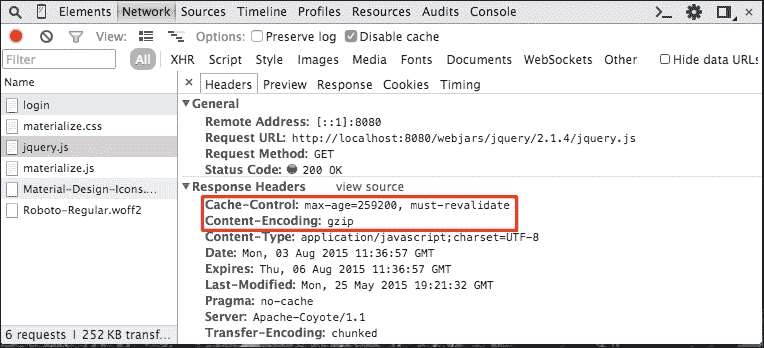
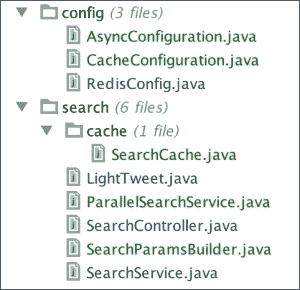

# 八、优化您的请求

在这一章中，我们将研究不同的技术来提高应用的性能。

我们将实现优化 web 应用的经典方法:缓存控制头、Gzipping、应用缓存和 ETags，以及更多反应性的东西，如异步方法调用和 WebSockets。

# 生产概况

在前一章中，我们看到了如何定义一个应用属性文件，该文件只能在用特定的概要文件启动应用时读取。我们将使用相同的方法，在`src/main/resources`中创建一个`application-prod.properties`文件，紧挨着现有的`application.properties`文件。这样，我们将能够使用优化的设置来配置生产环境。

我们将在这个文件中放入一些属性来开始。在[第 3 章](03.html "Chapter 3\. Handling Forms and Complex URL Mapping")、*处理表单和复杂的 URL 映射*中，我们停用了百里香缓存，并强制翻译包在每次访问时重新加载。

这对于开发来说很棒，但是在生产中却没用而且耗时。让我们来解决这个问题:

```java
spring.thymeleaf.cache=true
spring.messages.cache-seconds=-1
```

`-1`的缓存周期意味着永远缓存包。

现在，如果我们用“prod”配置文件启动我们的应用，模板和包应该被永久缓存。

来自“prod”概要文件的属性确实会覆盖在我们的`application.properties`文件中声明的属性。

# Gzipping

**Gzipping** 是一种被浏览器广泛理解的压缩算法。您的服务器将提供压缩响应，这将消耗更多的 CPU 周期，但将节省带宽。

然后，客户端浏览器将被收取解压缩资源并向用户显示它们的费用。

要利用 Tomcat 的 Gzipping 功能，只需在`application-prod.properties`文件中添加下面一行:

```java
server.tomcat.compression=on
server.tomcat.compressableMimeTypes=text/html,text/xml,text/css,text/plain,\
  application/json,application/xml,application/javascript
```

这将启用 Tomcat 的 Gzipping 压缩，当服务任何匹配列表中指定的 MIME 类型的文件，并且其长度大于 2048 字节。您可以将`server.tomcat.compression`设置为`force`以强制压缩，或者如果您想要更改 Gzipped 资产的最小长度值，可以将其设置为一个数值。

如果您想要对压缩进行更多的控制，比如说对压缩级别的控制，或者想要从压缩中排除用户代理，那么您可以通过将`org.eclipse.jetty:jetty-servlets`依赖项添加到项目中来使用 Jetty 中的`GzipFilter`类。

这将自动触发`GzipFilterAutoConfiguration`类，该类可以用一些以`spring.http.gzip`为前缀的属性进行配置。看看`GzipFilterProperties`就知道它的定制程度了。

### 注意

更多信息请参考[http://docs . spring . io/spring-boot/docs/current/reference/html/how to-embedded-servlet-containers . html # how-to-enable-http-response-compression](http://docs.spring.io/spring-boot/docs/current/reference/html/howto-embedded-servlet-containers.html#how-to-enable-http-response-compression)的文档。

# 缓存控制

缓存控制是服务器发送的一组 HTTP 头，用来控制用户的浏览器被允许如何缓存资源。

在前一章中，我们已经看到 Spring Security 会自动禁用安全资源的缓存。

如果我们想从缓存控制中获益，我们必须首先禁用该功能:

```java
security.headers.cache=false

# Cache resources for 3 days
spring.resources.cache-period=259200
```

现在，启动应用，进入主页，检查 Chrome 开发者控制台。您将看到我们的 JavaScript 文件被 gzip 和缓存，如下面的截图所示:



如果您想要对您的缓存有更多的控制，您可以在您的配置中为您自己的资源添加处理程序:

```java
@Override
public void addResourceHandlers(ResourceHandlerRegistry registry) {
    // This is just an example
    registry.addResourceHandler("/img/**")
            .addResourceLocations("classpath:/static/images/")
            .setCachePeriod(12);
}
```

我们还可以覆盖 Spring 安全默认设置。如果我们想取消 API 的“无缓存控制”策略，我们可以像这样更改`ApiSecurityConfiguration`类:

```java
@Override
protected void configure(HttpSecurity http) throws Exception {
    http
        .antMatcher("/api/**")
// This is just an example – not required in our case
        .headers().cacheControl().disable()
        .httpBasic().and()
        .csrf().disable()
        .authorizeRequests()
        .antMatchers(HttpMethod.GET).hasRole("USER")
        .antMatchers(HttpMethod.POST).hasRole("ADMIN")
        .antMatchers(HttpMethod.PUT).hasRole("ADMIN")
        .antMatchers(HttpMethod.DELETE).hasRole("ADMIN")
        .anyRequest().authenticated();
}
```

# 应用缓存

既然我们的 web 请求已经被压缩和缓存，那么我们可以采取的降低服务器负载的下一步就是将高成本操作的结果放在缓存中。Twitter 搜索需要一些时间，并将消耗我们在 Twitter API 上的应用请求比率。使用 Spring，我们可以轻松地缓存搜索，并在每次使用相同参数调用搜索时返回相同的结果。

我们需要做的第一件事是用`@EnableCache`注释激活 Spring 缓存。我们还需要创建一个`CacheManager`来解析我们的缓存。让我们在`config`包中创建一个`CacheConfiguration`类:

```java
package masterSpringMvc.config;

import org.springframework.cache.CacheManager;
import org.springframework.cache.annotation.EnableCaching;
import org.springframework.cache.concurrent.ConcurrentMapCache;
import org.springframework.cache.support.SimpleCacheManager;
import org.springframework.context.annotation.Bean;
import org.springframework.context.annotation.Configuration;

import java.util.Arrays;

@Configuration
@EnableCaching
public class CacheConfiguration {

    @Bean
    public CacheManager cacheManager() {
        SimpleCacheManager simpleCacheManager = new SimpleCacheManager();
        simpleCacheManager.setCaches(Arrays.asList(
                new ConcurrentMapCache("searches")
        ));
        return simpleCacheManager;
    }
}
```

在前面的例子中，我们使用了最简单的缓存抽象。其他实现也是可用的，比如`EhCacheCacheManager`或`GuavaCacheManager`，我们一会儿就会用到。

现在我们已经配置了缓存，我们可以在方法上使用`@Cacheable`注释。当我们这样做时，Spring 将自动缓存方法的结果，并将其与当前参数相关联以进行检索。

Spring 需要在方法被缓存的 beans 周围创建一个代理。这通常意味着在同一个 bean 中调用一个缓存方法将会使用 Spring 的缓存。

在我们的例子中，在`SearchService`类中，我们调用搜索操作的部分将从缓存中受益匪浅。

首先，最好将负责创建`SearchParameters`类的代码放在一个名为`SearchParamsBuilder`的专用对象中:

```java
package masterSpringMvc.search;

import org.springframework.social.twitter.api.SearchParameters;

import java.util.List;
import java.util.stream.Collectors;

public class SearchParamsBuilder {

    public static SearchParameters createSearchParam(String searchType, String taste) {
        SearchParameters.ResultType resultType = getResultType(searchType);
        SearchParameters searchParameters = new SearchParameters(taste);
        searchParameters.resultType(resultType);
        searchParameters.count(3);
        return searchParameters;
    }

    private static SearchParameters.ResultType getResultType(String searchType) {
        for (SearchParameters.ResultType knownType : SearchParameters.ResultType.values()) {
            if (knownType.name().equalsIgnoreCase(searchType)) {
                return knownType;
            }
        }
        return SearchParameters.ResultType.RECENT;
    }
}
```

这将帮助我们在服务中创建搜索参数。

现在我们想为我们的搜索结果创建一个缓存。我们希望对 Twitter API 的每个调用都被缓存。Spring 缓存注释依赖代理来检测`@Cacheable`方法。因此，我们需要一个新类，它的方法用`@Cacheable`注释进行了注释。

当你使用 Spring 抽象 API 时，你不知道缓存的底层实现。许多方法要求缓存方法的返回类型和参数类型都是可序列化的。

`SearchParameters`是不可序列化的，这就是为什么我们将在缓存的方法中同时传递搜索类型和关键字(两个字符串)。

因为我们想把`LightTweets`对象放在缓存中，所以我们想让它们成为`Serializable`；这将确保它们始终可以从任何缓存抽象中写入和读取:

```java
public class LightTweet implements Serializable {
    // the rest of the code remains unchanged
}
```

让我们创建一个`SearchCache`类，并把它放在`search.cache`包中:

```java
package masterSpringMvc.search.cache;

import masterSpringMvc.search.LightTweet;
import masterSpringMvc.search.SearchParamsBuilder;
import org.apache.commons.logging.Log;
import org.apache.commons.logging.LogFactory;
import org.springframework.beans.factory.annotation.Autowired;
import org.springframework.boot.autoconfigure.social.TwitterProperties;
import org.springframework.cache.annotation.Cacheable;
import org.springframework.social.twitter.api.SearchParameters;
import org.springframework.social.twitter.api.Twitter;
import org.springframework.social.twitter.api.impl.TwitterTemplate;
import org.springframework.stereotype.Service;

import java.util.List;
import java.util.stream.Collectors;

@Service
public class SearchCache {
    protected final Log logger = LogFactory.getLog(getClass());
    private Twitter twitter;

    @Autowired
    public SearchCache(TwitterProperties twitterProperties) {
        this.twitter = new TwitterTemplate(twitterProperties.getAppId(), twitterProperties.getAppSecret());
    }

    @Cacheable("searches")
    public List<LightTweet> fetch(String searchType, String keyword) {
        logger.info("Cache miss for " + keyword);
        SearchParameters searchParam = SearchParamsBuilder.createSearchParam(searchType, keyword);
        return twitter.searchOperations()
                .search(searchParam)
                .getTweets().stream()
                .map(LightTweet::ofTweet)
                .collect(Collectors.toList());
    }
}
```

没有比这更简单的了。我们使用了`@Cacheable`注释来指定将要使用的缓存的名称。不同的缓存可能有不同的策略。

注意，我们手动创建了一个新的`TwitterTemplate`方法，而不是像以前一样注入它。这是因为稍后我们将不得不从其他线程访问缓存。在 Spring Boot 的`TwitterAutoConfiguration`类中，`Twitter` bean 被绑定到请求范围，因此在 Servlet 线程之外不可用。

有了这两个新对象，我们的`SearchService`类的代码就变成了这样:

```java
package masterSpringMvc.search;

import masterSpringMvc.search.cache.SearchCache;
import org.springframework.beans.factory.annotation.Autowired;
import org.springframework.context.annotation.Profile;
import org.springframework.stereotype.Service;

import java.util.List;
import java.util.stream.Collectors;

@Service
@Profile("!async")
public class SearchService implements TwitterSearch {
    private SearchCache searchCache;

    @Autowired
    public SearchService(SearchCache searchCache) {
        this.searchCache = searchCache;
    }

    @Override
    public List<LightTweet> search(String searchType, List<String> keywords) {
        return keywords.stream()
                .flatMap(keyword -> searchCache.fetch(searchType, keyword).stream())
                .collect(Collectors.toList());
    }
}
```

注意，我们用`@Profile("!async")`注释了服务。这意味着如果概要文件`async`没有被激活，我们只创建这个 bean。

稍后，我们将创建`TwitterSearch`类的另一个实现，以便能够在两者之间切换。

整洁！假设我们重新启动应用，尝试一个大的请求，如下所示:

`http://localhost:8080/search/mixed;keywords=docker,spring,spring%20boot,spring%20mvc,groovy,grails`

一开始会花一些时间，但是我们的控制台会显示以下日志:

```java
2015-08-03 16:04:01.958  INFO 38259 --- [nio-8080-exec-8] m.search.cache.SearchCache               : Cache miss for docker
2015-08-03 16:04:02.437  INFO 38259 --- [nio-8080-exec-8] m.search.cache.SearchCache               : Cache miss for spring
2015-08-03 16:04:02.728  INFO 38259 --- [nio-8080-exec-8] m.search.cache.SearchCache               : Cache miss for spring boot
2015-08-03 16:04:03.098  INFO 38259 --- [nio-8080-exec-8] m.search.cache.SearchCache               : Cache miss for spring mvc
2015-08-03 16:04:03.383  INFO 38259 --- [nio-8080-exec-8] m.search.cache.SearchCache               : Cache miss for groovy
2015-08-03 16:04:03.967  INFO 38259 --- [nio-8080-exec-8] m.search.cache.SearchCache               : Cache miss for grails

```

之后，如果我们点击“刷新”,结果将会立即显示，并且不会在控制台中看到缓存未命中。

这就是我们的缓存，但是缓存 API 还有更多。您可以用以下内容注释方法:

*   `@CachEvict`:这将从缓存中删除一个条目
*   `@CachePut`:这将把一个方法的结果放入缓存，而不会干扰方法本身
*   `@Caching`:这将缓存注释重新分组
*   `@CacheConfig`:这指向不同的缓存配置

`@Cacheable`注释也可以配置为在特定条件下缓存结果。

### 注意

有关 Spring cache 的更多信息，请参见以下文档:

[http://docs . spring . io/spring/docs/current/spring-framework-reference/html/cache . html](http://docs.spring.io/spring/docs/current/spring-framework-reference/html/cache.html)

## 缓存失效

目前，搜索结果将被永久缓存。使用默认的简单缓存管理器并没有给我们太多的选择。我们还可以做一件事来改进我们的应用缓存。因为我们的类路径中有 Guava，所以我们可以用下面的代码替换缓存配置中现有的缓存管理器:

```java
package masterSpringMvc.config;

import com.google.common.cache.CacheBuilder;
import org.springframework.cache.CacheManager;
import org.springframework.cache.annotation.EnableCaching;
import org.springframework.cache.guava.GuavaCacheManager;
import org.springframework.context.annotation.Bean;
import org.springframework.context.annotation.Configuration;

import java.util.concurrent.TimeUnit;

@Configuration
@EnableCaching
public class CacheConfiguration {

    @Bean
    public CacheManager cacheManager() {
        GuavaCacheManager cacheManager = new GuavaCacheManager("searches");
        cacheManager
                .setCacheBuilder(
                        CacheBuilder.newBuilder()
                                .softValues()
                                .expireAfterWrite(10, TimeUnit.MINUTES)
                );
        return cacheManager;
    }
}
```

这将构建一个在 10 分钟后过期并使用软值的缓存，这意味着如果 JVM 内存不足，条目将被清除。

尝试摆弄番石榴的缓存生成器。您可以为您的测试指定一个更小的时间单位，甚至指定不同的缓存策略。

### 注意

请参见位于[https://code . Google . com/p/guava-libraries/wiki/cachex explained](https://code.google.com/p/guava-libraries/wiki/CachesExplained)的文档。

## 分布式缓存

我们已经有了 Redis 档案。如果 Redis 可用，我们也可以用它作为缓存提供者。这将允许我们在多台服务器上分配缓存。让我们改变一下`RedisConfig`类:

```java
package masterSpringMvc.config;

import org.springframework.beans.factory.annotation.Qualifier;
import org.springframework.cache.CacheManager;
import org.springframework.context.annotation.Bean;
import org.springframework.context.annotation.Configuration;
import org.springframework.context.annotation.Primary;
import org.springframework.context.annotation.Profile;
import org.springframework.data.redis.cache.RedisCacheManager;
import org.springframework.data.redis.connection.RedisConnectionFactory;
import org.springframework.data.redis.core.RedisTemplate;
import org.springframework.session.data.redis.config.annotation.web.http.EnableRedisHttpSession;

import java.util.Arrays;

@Configuration
@Profile("redis")
@EnableRedisHttpSession
public class RedisConfig {

    @Bean(name = "objectRedisTemplate")
    public RedisTemplate objectRedisTemplate(RedisConnectionFactory redisConnectionFactory) {
        RedisTemplate<Object, Object> template = new RedisTemplate<>();
        template.setConnectionFactory(redisConnectionFactory);
        return template;
    }

    @Primary @Bean
    public CacheManager cacheManager(@Qualifier("objectRedisTemplate") RedisTemplate template) {
        RedisCacheManager cacheManager = new RedisCacheManager(template);
        cacheManager.setCacheNames(Arrays.asList("searches"));
        cacheManager.setDefaultExpiration(36_000);
        return cacheManager;
    }
}
```

有了这个配置，如果我们用“Redis”概要文件运行我们的应用，Redis 缓存管理器将被使用，而不是在`CacheConfig`类中定义的那个，因为它是用`@Primary`注释的。

如果我们希望在多台服务器上进行扩展，这将允许分布缓存。Redis 模板用于序列化缓存返回值和参数，并将要求对象为`Serializable`。

# 异步方法

我们的应用还有一个瓶颈；当用户搜索十个关键词时，每个搜索将被顺序执行。通过使用不同的线程并同时启动所有的搜索，我们可以很容易地提高应用的速度。

要启用 Spring 的异步功能，必须使用`@EnableAsync`注释。这将使用一个`java.util.concurrent.Executor`透明地执行任何用`@Async`标注的方法。

通过实现`AsyncConfigurer`接口，可以定制使用的默认执行器。让我们在`config`包中创建新的配置类`AsyncConfig`:

```java
package masterSpringMvc.config;

import org.apache.commons.logging.Log;
import org.apache.commons.logging.LogFactory;
import org.springframework.aop.interceptor.AsyncUncaughtExceptionHandler;
import org.springframework.context.annotation.Configuration;
import org.springframework.scheduling.annotation.AsyncConfigurer;
import org.springframework.scheduling.annotation.EnableAsync;

import java.util.concurrent.Executor;
import java.util.concurrent.Executors;

@Configuration
@EnableAsync
public class AsyncConfiguration implements AsyncConfigurer {

    protected final Log logger = LogFactory.getLog(getClass());

    @Override
    public Executor getAsyncExecutor() {
        return Executors.newFixedThreadPool(10);
    }

    @Override
    public AsyncUncaughtExceptionHandler getAsyncUncaughtExceptionHandler() {
        return (ex, method, params) -> logger.error("Uncaught async error", ex);
    }
}
```

有了这个配置，我们可以确保在整个应用中分配不超过 10 个线程来处理我们的异步任务。这在每个客户端都有一个专用线程的 web 应用中非常重要。您使用的线程越多，它们阻塞的时间越长，您可以处理的客户端请求就越少。

让我们注释我们的搜索方法，并使它异步。我们需要让它返回`Future`的子类型，这是一个表示异步结果的 java 并发类。

我们将创建一个新的`TwitterSearch`类的实现，它将在不同的线程中查询搜索 API。实现有点复杂，所以我将把它分成几个小部分。

首先，我们需要用`@Async`注释来注释查询 API 的方法，告诉 Spring 使用我们的执行器来调度任务。同样，Spring 将使用代理来施展它的魔法，所以这个方法必须与调用它的服务在不同的类中。如果这个组件可以使用我们的缓存也很好。这将引导我们创建这个组件:

```java
@Component
private static class AsyncSearch {
    protected final Log logger = LogFactory.getLog(getClass());
    private SearchCache searchCache;

    @Autowired
    public AsyncSearch(SearchCache searchCache) {
        this.searchCache = searchCache;
    }

    @Async
    public ListenableFuture<List<LightTweet>> asyncFetch(String searchType, String keyword) {
        logger.info(Thread.currentThread().getName() + " - Searching for " + keyword);
        return new AsyncResult<>(searchCache.fetch(searchType, keyword));
    }
}
```

暂时不要创建这个类。让我们先看看我们的服务需要什么。

`ListenableFuture`抽象允许我们在未来完成后添加回调，无论是在结果正确的情况下还是在出现异常的情况下。

等待一组异步任务的算法如下所示:

```java
@Override
public List<LightTweet> search(String searchType, List<String> keywords) {
    CountDownLatch latch = new CountDownLatch(keywords.size());
    List<LightTweet> allTweets = Collections.synchronizedList(new ArrayList<>());
    keywords
            .stream()
            .forEach(keyword -> asyncFetch(latch, allTweets, searchType, keyword));

    await(latch);
    return allTweets;
}
```

如果你不知道`CountDownLatch`方法，它只是一个简单的阻塞计数器。

`await()`方法会一直等到 latch 达到 0 来解锁线程。

前面代码中显示的`asyncFetch`方法将为我们的每个`asynFetch`方法附加一个回调。回调会将结果添加到`allTweets`列表中，并递减锁存器。一旦调用了每个回调，该方法将返回所有 tweets。

明白了吗？下面是最后的代码:

```java
package masterSpringMvc.search;

import masterSpringMvc.search.cache.SearchCache;
import org.apache.commons.logging.Log;
import org.apache.commons.logging.LogFactory;
import org.springframework.beans.factory.annotation.Autowired;
import org.springframework.context.annotation.Profile;
import org.springframework.scheduling.annotation.Async;
import org.springframework.scheduling.annotation.AsyncResult;
import org.springframework.social.twitter.api.SearchParameters;
import org.springframework.stereotype.Component;
import org.springframework.stereotype.Service;
import org.springframework.util.concurrent.ListenableFuture;

import java.util.ArrayList;
import java.util.Collections;
import java.util.List;
import java.util.concurrent.CountDownLatch;

@Service
@Profile("async")
public class ParallelSearchService implements TwitterSearch {
    private final AsyncSearch asyncSearch;

    @Autowired
    public ParallelSearchService(AsyncSearch asyncSearch) {
        this.asyncSearch = asyncSearch;
    }

    @Override
    public List<LightTweet> search(String searchType, List<String> keywords) {
        CountDownLatch latch = new CountDownLatch(keywords.size());
        List<LightTweet> allTweets = Collections.synchronizedList(new ArrayList<>());

        keywords
                .stream()
                .forEach(keyword -> asyncFetch(latch, allTweets, searchType, keyword));

        await(latch);
        return allTweets;
    }

    private void asyncFetch(CountDownLatch latch, List<LightTweet> allTweets, String searchType, String keyword) {
        asyncSearch.asyncFetch(searchType, keyword)
                .addCallback(
                        tweets -> onSuccess(allTweets, latch, tweets),
                        ex -> onError(latch, ex));
    }

    private void await(CountDownLatch latch) {
        try {
            latch.await();
        } catch (InterruptedException e) {
            throw new IllegalStateException(e);
        }
    }

    private static void onSuccess(List<LightTweet> results, CountDownLatch latch, List<LightTweet> tweets) {
        results.addAll(tweets);
        latch.countDown();
    }

    private static void onError(CountDownLatch latch, Throwable ex) {
        ex.printStackTrace();
        latch.countDown();
    }

    @Component
    private static class AsyncSearch {
        protected final Log logger = LogFactory.getLog(getClass());
        private SearchCache searchCache;

        @Autowired
        public AsyncSearch(SearchCache searchCache) {
            this.searchCache = searchCache;
        }

        @Async
        public ListenableFuture<List<LightTweet>> asyncFetch(String searchType, String keyword) {
            logger.info(Thread.currentThread().getName() + " - Searching for " + keyword);
            return new AsyncResult<>(searchCache.fetch(searchType, keyword));
        }
    }
}
```

现在，为了使用这个实现，我们需要使用`async`概要文件运行应用。

我们可以同时运行多个激活的概要文件，用逗号分隔它们，如下所示:

`--spring.profiles.active=redis,async`

如果我们使用多个术语进行搜索，我们会看到类似这样的内容:

```java
pool-1-thread-3 - Searching groovy
pool-1-thread-1 - Searching spring
pool-1-thread-2 - Searching java
```

这表明不同的搜索是并行进行的。

Java 8 实际上引入了一种叫做`CompletableFuture`的新类型，这是一种更好的操纵未来的 API。completable futures 的主要问题是，没有一个执行者可以在没有一点代码的情况下使用它们。这超出了本文的范围，但你可以查看我的博客中关于这个主题的文章:[http://geowarin . github . io/spring/2015/06/12/completable-futures-with-spring-async . html](http://geowarin.github.io/spring/2015/06/12/completable-futures-with-spring-async.html)。

### 注意

**免责声明**

下面几节包含了大量的 JavaScript。显然，我认为您应该看看代码，尤其是如果 JavaScript 不是您最喜欢的语言。是时候学习它了。也就是说，即使 WebSocket 非常酷，它也不是必需的。您可以安全地跳到最后一章，并立即部署您的应用。

# ETags

我们的 Twitter 结果被整齐地缓存起来，所以用户刷新结果页面不会触发 Twitter API 上的额外的搜索。但是，即使结果没有变化，响应也会多次发送给该用户，这将浪费带宽。

ETag 是 web 响应数据的散列，作为报头发送。客户端可以记住一个资源的 ETag，并用`If-None-Match`头将最近的已知版本发送给服务器。这允许服务器在请求没有改变的情况下回答`304 Not Modified`。

Spring 有一个特殊的 Servlet 过滤器，叫做`ShallowEtagHeaderFilter`，用来处理 ETags。只需将其作为 bean 添加到`MasterSpringMvc4Application`配置类中:

```java
@Bean
public Filter etagFilter() {
    return new ShallowEtagHeaderFilter();
}
```

只要响应没有缓存控制头，这将自动为您的响应生成 ETags。

现在，如果我们询问我们的 RESTful API，我们可以看到一个 ETag 与服务器响应一起发送:

```java
> http GET 'http://localhost:8080/api/search/mixed;keywords=spring' -a admin:admin
HTTP/1.1 200 OK
Content-Length: 1276
Content-Type: application/json;charset=UTF-8
Date: Mon, 01 Jun 2015 11:29:51 GMT
ETag: "00a66d6dd835b6c7c60638eab976c4dd7"
Server: Apache-Coyote/1.1
Set-Cookie: JSESSIONID=662848E4F927EE9A1BA2006686ECFE4C; Path=/; HttpOnly

```

现在，如果我们再次请求同一个资源，在`If-None-Match`头中指定我们所知道的最后一个 ETag，服务器将自动响应一个`304 Not Modified`状态:

```java
> http GET 'http://localhost:8080/api/search/mixed;keywords=spring' If-None-Match:'"00a66d6dd835b6c7c60638eab976c4dd7"' -a admin:admin
HTTP/1.1 304 Not Modified
Date: Mon, 01 Jun 2015 11:34:21 GMT
ETag: "00a66d6dd835b6c7c60638eab976c4dd7"
Server: Apache-Coyote/1.1
Set-Cookie: JSESSIONID=CA956010CF268056C241B0674C6C5AB2; Path=/; HttpOnly

```

### Tip

由于我们搜索的并行性，为不同关键字获取的 tweets 可能会以不同的顺序到达，这将使 ETag 发生变化。如果您希望这种技术适用于多个搜索，请考虑在将搜索结果发送给客户端之前对它们进行排序。

如果我们想利用这一点，我们显然需要重写我们的客户端代码来处理它们。我们将看到一个简单的 jQuery 解决方案，使用浏览器的本地存储来保存用户的最新查询。

首先，从我们的模型中移除`tweets`变量；我们不会再从服务器上搜索了。您必须修改一两个测试来反映这种变化。

在继续之前，让我们将 lodash 添加到我们的 JavaScript 库中。如果你不知道 lodash，就说是 JavaScript 的 Apache Utils 吧。您可以将它添加到项目依赖项中，如下所示:

```java
compile 'org.webjars.bower:lodash:3.9.3'
```

将它添加到`default.html`布局中，就在物化的 JavaScript 下面:

```java
<script src="/webjars/lodash/3.9.3/lodash.js"></script>
```

我们将修改`resultPage.html`文件，并保留 tweets 应该显示为空的部分:

```java
<!DOCTYPE html>
<html xmlns:th="http://www.thymeleaf.org"
      xmlns:layout="http://www.ultraq.net.nz/thymeleaf/layout"
      layout:decorator="layout/default">
<head lang="en">
    <title>Hello twitter</title>
</head>
<body>
<div class="row" layout:fragment="content">

    <h2 class="indigo-text center" th:text="|Tweet results for ${search}|">Tweets</h2>

    <ul id="tweets" class="collection">
 </ul>
</div>
</body>
</html>
```

然后，我们将在页面底部添加一个脚本元素，就在关闭正文之前:

```java
<script layout:fragment="script" th:inline="javascript">
    /*<![CDATA[*/
    var baseUrl = /*[[@{/api/search}]]*/ "/";
    var currentLocation = window.location.href;
    var search = currentLocation.substr(currentLocation.lastIndexOf('/'));
    var url = baseUrl + search;
    /*]]>*/
</script>
```

前面的脚本将只负责为我们的请求构造 URL。我们将通过发出一个简单的 jQuery AJAX 调用来使用它:

```java
$.ajax({
    url: url,
    type: "GET",
    beforeSend: setEtag,
    success: onResponse
});
```

我们将使用`beforeSend`回调函数在调用之前修改请求头:

```java
function getLastQuery() {
    return JSON.parse(localStorage.getItem('lastQuery')) || {};
}

function storeQuery(query) {
    localStorage.setItem('lastQuery', JSON.stringify(query));
}

function setEtag(xhr) {
    xhr.setRequestHeader('If-None-Match', getLastQuery().etag)
}
```

如您所见，我们可以轻松地从本地存储中读取和写入。这里的问题是本地存储只能处理字符串，所以我们必须解析查询对象并将其序列化为 JSON。

如果 HTTP 状态为`304 Not Modified`，我们可以通过从本地存储中检索内容来处理响应:

```java
function onResponse(tweets, status, xhr) {
  if (xhr.status == 304) {
      console.log('Response has not changed');
      tweets = getLastQuery().tweets
  }

  var etag = xhr.getResponseHeader('Etag');
  storeQuery({tweets: tweets, etag: etag});

  displayTweets(tweets);
}

function displayTweets(tweets) {
  $('#tweets').empty();
  $.each(tweets, function (index, tweet) {
      addTweet(tweet);
  })
}
```

对于您接下来将看到的`addTweet`函数，我使用 lodash(一个非常有用的 JavaScript 实用程序库)来生成模板。将推文添加到页面的函数可以编写为,如下所示:

```java
function addTweet(tweet) {
    var template = _.template('<li class="collection-item avatar">' +
        '' +
        '<span class="title">${tweet.user}</span>' +
        '<p>${tweet.text}</p>' +
        '</li>');

    $('#tweets').append(template({tweet: tweet}));
}
```

有很多 JavaScript 代码！使用 Backbone.js 之类的库在单个页面应用中推广这种模式更有意义。

如果您尝试多次刷新搜索页面，您将看到内容不会改变，并且会立即显示:


ETags 还有其他用途，比如事务的乐观锁定(它让您知道客户机在任何时候都应该在哪个版本的对象上工作)。在发送数据之前，在服务器端散列数据也是额外的工作，但这将节省带宽。

# WebSockets

我们可以考虑的另一种优化是，当数据对服务器可用时，将数据发送给客户机。因为我们在多个线程中获取搜索结果，所以数据会以多个块的形式出现。我们可以一点一点地发送它们，而不是等待所有的结果。

Spring 对 WebSockets 有很好的支持，web sockets 是一种允许客户端与服务器保持长期连接的协议。数据可以在连接两端的网络套接字中推送，消费者将实时获得数据。

我们将使用一个名为 SockJS 的 JavaScript 库来确保与所有浏览器的兼容性。如果我们的用户有一个过时的浏览器，Sockjs 显然会求助于另一个策略。

我们还将使用 StompJS 连接到我们的消息代理。

将以下库添加到您的版本中:

```java
compile 'org.springframework.boot:spring-boot-starter-websocket'
compile 'org.springframework:spring-messaging'

compile 'org.webjars:sockjs-client:1.0.0'
compile 'org.webjars:stomp-websocket:2.3.3'
```

将 WebJars 添加到我们的默认百里香模板中:

```java
<script src="/webjars/sockjs-client/1.0.0/sockjs.js"></script>
<script src="/webjars/stomp-websocket/2.3.3/stomp.js"></script>
```

为了在我们的应用中配置 WebSockets，我们还需要添加一些配置:

```java
@Configuration
@EnableWebSocketMessageBroker
public class WebSocketConfiguration extends AbstractWebSocketMessageBrokerConfigurer {

    @Override
    public void configureMessageBroker(MessageBrokerRegistry config) {
        config.enableSimpleBroker("/topic");
        config.setApplicationDestinationPrefixes("/ws");
    }

    @Override
    public void registerStompEndpoints(StompEndpointRegistry registry) {
        registry.addEndpoint("/twitterSearch").withSockJS();
    }

}
```

这将配置我们应用中可用的不同通道。SockJS 客户端将连接到`twitterSearch`端点，并将数据推送到`/ws/ channel`上的服务器，并能够监听`/topic/`的变化。

这将允许我们在一个新的控制器中注入一个`SimpMessagingTemplate`，以便在`/topic/searchResult`通道中将数据推送到客户端，如下所示:

```java
@Controller
public class SearchSocketController {
    private CachedSearchService searchService;
    private SimpMessagingTemplate webSocket;

    @Autowired
    public SearchSocketController(CachedSearchService searchService, SimpMessagingTemplate webSocket) {
        this.searchService = searchService;
        this.webSocket = webSocket;
    }

    @MessageMapping("/search")
    public void search(@RequestParam List<String> keywords) throws Exception {
        Consumer<List<LightTweet>> callback = tweet -> webSocket.convertAndSend("/topic/searchResults", tweet);
        twitterSearch(SearchParameters.ResultType.POPULAR, keywords, callback);
    }

    public void twitterSearch(SearchParameters.ResultType resultType, List<String> keywords, Consumer<List<LightTweet>> callback) {
        keywords.stream()
            .forEach(keyword -> {
                searchService.search(resultType, keyword)
                    .addCallback(callback::accept, Throwable::printStackTrace);
            });
    }
}
```

在我们的`resultPage`中，JavaScript 代码非常简单:

```java
var currentLocation = window.location.href;
var search = currentLocation.substr(currentLocation.lastIndexOf('=') + 1);

function connect() {
  var socket = new SockJS('/hello');
  stompClient = Stomp.over(socket);
  // stompClient.debug = null;
  stompClient.connect({}, function (frame) {
      console.log('Connected: ' + frame);

      stompClient.subscribe('/topic/searchResults', function (result) {
          displayTweets(JSON.parse(result.body));
      });

      stompClient.send("/app/search", {}, JSON.stringify(search.split(',')));
  });
}
```

`displayTweets`功能与之前基本相同:

```java
function displayTweets(tweets) {
    $.each(tweets, function (index, tweet) {
        addTweet(tweet);
    })
}

function addTweet(tweet) {
    var template = _.template('<li class="collection-item avatar">' +
        '' +
        '<span class="title">${tweet.userName}</span>' +
        '<p>${tweet.text}</p>' +
        '</li>');

    $('#tweets').append(template({tweet: tweet}));
}
```

给你！客户端现在将收到应用中所有搜索的结果——实时！

在将它推向生产之前，还需要做一些工作。以下是一些想法:

*   为客户端创建子通道，以便私下监听更改
*   当客户端使用完频道时，关闭频道
*   给新推文添加 CSS 过渡,这样用户就能感觉到它是实时的
*   使用真正的代理，比如 RabbitMQ，允许后端随着连接而伸缩

WebSocket 不仅仅是这个简单的例子。别忘了在[http://docs . spring . io/spring/docs/current/spring-framework-reference/html/web socket . html](http://docs.spring.io/spring/docs/current/spring-framework-reference/html/websocket.html)上看看文档，了解更多信息。

# 检查点

在这一章中，我们创建了两个新的配置:`AsyncConfiguration`，它将允许我们使用`@Async`注释向执行者提交任务，以及`CacheConfiguration`，它将创建一个`CacheManager`接口，并允许我们使用`@Cacheable`注释。因为我们可以使用 Redis 作为缓存管理器，所以我们也修改了`RedisConfig`类。

我们创建了一个包含 tweets 缓存的`SearchCache`类，现在我们有两个`TwitterSearch`实现可供选择:一个是传统的`SearchService`，它将同步获取每个结果，另一个是`ParallelSearchService`，它将在不同的线程中发出每个查询:



# 总结

在这一章中，我们看到了两种不同的与性能改进相关的哲学。一开始，我们试图通过缓存数据和使用尽可能少的到服务器的连接来减少客户端使用的带宽。

但是，在第二部分，我们开始做一些更高级的事情，允许并行运行搜索，每个客户端通过 web 套接字与服务器保持同步。这将允许客户端实时接收更新，我们的应用将感觉更具反应性，但消耗更多的线程。

我强烈建议您在我们进入下一章并永久部署我们的应用之前润色结果！