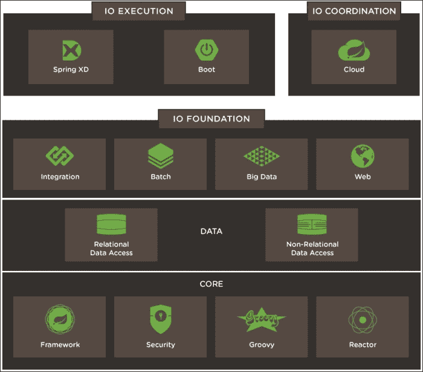

# 十、超越 Spring Web

在这一章中，我们将看到我们已经走了多远，我们已经解决了哪些问题，还有哪些问题有待解决。

我们将从总体上讨论 Spring 生态系统，特别是持久性、部署和单页面应用。

# 春天的生态系统

从 Web 到数据，Spring 是一个全面的生态系统，旨在以模块化的方式解决各种问题:

在 https://spring.io/platform[的 Spring IO 平台](https://spring.io/platform)查看。

## 核心

在 Spring 框架的核心，显然有一个依赖注入机制。

我们仅仅触及了安全特性和框架与 Groovy 的良好集成的表面。

## 执行

我们在中看到了 Spring Boot 的细节——为庞大的子项目网络带来简单和凝聚力。

它允许您关注真正重要的东西，也就是您的业务代码。

春季 XD 项目也真的很有意思。它的目标是提供工具来处理、分析、转换或导出您的数据，并明确关注大数据。欲了解更多信息，请访问 http://projects.spring.io/spring-xd 的 T2。

## 数据

在开发我们的应用时，我们没有考虑的一件事是如何在一个数据库中存储数据。在 Pivotal 的参考架构中，有一个层专门用于关系数据和非关系(NoSQL)数据。

Spring 生态系统在标签`spring-data`下提供了很多有趣的解决方案，可以在[http://projects.spring.io/spring-data/](http://projects.spring.io/spring-data/)找到。

我们在构建缓存时浏览了一下 Spring Data Redis，但是 Spring Data 还有更多内容。

基本概念在所有 Spring 数据项目中是共享的，比如 template API，它是从持久性系统中检索和存储对象的抽象。

SpringData JPA([http://projects.spring.io/spring-data-jpa/](http://projects.spring.io/spring-data-jpa/))和 Spring Data Mongo([http://projects.spring.io/spring-data-mongodb/](http://projects.spring.io/spring-data-mongodb/))是一些最知名的 Spring Data 项目。它们允许您通过存储库对实体进行操作，存储库是提供创建查询、持久化对象等功能的简单接口。

佩特里·凯努莱宁([http://www.petrikainulainen.net/spring-data-jpa-tutorial/](http://www.petrikainulainen.net/spring-data-jpa-tutorial/))有很多关于 Spring 数据的详尽例子。它不使用 Spring Boot 提供的设施，但你应该可以很容易地开始使用导游，例如在 https://spring.io/guides/gs/accessing-data-jpa/[的导游。](https://spring.io/guides/gs/accessing-data-jpa/)

Spring Data REST 也是一个神奇的项目，它将通过 RESTful API 半自动地公开你的实体。访问[https://spring.io/guides/gs/accessing-data-rest/](https://spring.io/guides/gs/accessing-data-rest/)获得详细的教程。

## 其他值得关注的项目

SpringIntegration([http://projects.spring.io/spring-integration](http://projects.spring.io/spring-integration))和 Spring Reactor([http://project Reactor . io](http://projectreactor.io))也是我最喜欢的两个 Spring 项目。

Spring Reactor 是 Pivotal 对反应流的实现。这个想法是在服务器端提供完全无阻塞的 IO。

另一方面，Spring Integration 专注于企业集成模式，让您设计通道来加载和转换来自异构系统的数据。

这里可以看到一个很好的简单的例子，说明你可以通过渠道实现什么:[http://lmivan.github.io/contest/#_spring_boot_application](http://lmivan.github.io/contest/#_spring_boot_application)。

如果您的应用必须与异构和/或复杂的子系统进行通信，那么这绝对值得一看。

Spring 生态系统中我们还没有的最后一个项目是 Spring Batch，这是一个非常有用的抽象，用于处理企业系统日常运营的大量数据。

# 部署

Spring Boot 提供了以简单的 JAR 形式运行和分发 Spring 应用的能力，在这方面是一个巨大的成功。

毫无疑问，这是朝着正确方向迈出的一步，但是有时您的 web 应用并不是您唯一想要部署的东西。

当处理一个有多个服务器和数据源的复杂系统时，运营团队的工作会变得相当头疼。

## Docker

谁没听说过 Docker？它是容器世界中新的酷小子，由于其充满活力的社区，它已经取得了相当大的成功。

Docker 背后的想法并不新鲜，它利用 LinuX 容器(LXC)和 cgroups 为应用运行提供一个完全隔离的环境。

你可以在 Spring 网站上找到一个教程，它将指导你在 https://spring.io/guides/gs/spring-boot-docker T2 与 Docker 的第一步。

Pivotal Cloud Foundry 多年来一直在他们名为 Warden 的容器管理器中使用容器技术。他们最近转向了 Garden，这是一种抽象，不仅支持 Linux 容器，也支持 Windows 容器。

Garden 是 Cloud Foundry(称为 Diego)最新版本的一部分，它也允许将 Docker 映像作为部署单元。

Cloud Foundry 的开发者版本也已经发布，名称为 Lattice，可以在[https://spring . io/blog/2015/04/06/Lattice-and-spring-Cloud-resilient-su B- structure-for-your-Cloud-native-spring-applications](https://spring.io/blog/2015/04/06/lattice-and-spring-cloud-resilient-sub-structure-for-your-cloud-native-spring-applications)找到。

如果您想在没有命令行麻烦的情况下测试容器，我建议您看看 Kitematic。这样，您就可以运行 Jenkins 容器或 MongoDB，而无需在系统上安装二进制文件。访问[https://kitematic.com/](https://kitematic.com/)了解更多关于 Kitematic 的信息。

Docker 生态系统中另一个值得一提的工具是 Docker Compose。它允许你用一个配置文件运行和链接多个容器。

参考[http://java.dzone.com/articles/spring-session-demonstration](http://java.dzone.com/articles/spring-session-demonstration)的一个 Spring Boot 应用的好例子，它由两个 web 服务器、一个存储用户会话的 Redis 和一个做负载平衡的 Nginx 实例组成。当然，关于 Docker Swarm 和 Docker Machine 还有很多需要学习的，Docker Swarm 允许你用一个简单的命令扩展你的应用，Docker Machine 可以在任何机器上为你创建 Docker 主机，包括云提供商。

Google Kurbernetes 和 Apache Mesos 也是从 Docker 容器中受益匪浅的分布式系统的优秀例子。

# 单页应用

今天的大多数 web 应用都是用 JavaScript 编写的。Java 被放在后端，承担着处理数据和业务规则的重要角色。然而，GUI 的很多东西现在都发生在客户端。

从响应能力和用户体验的角度来看，这是有充分理由的，但这些应用增加了额外的复杂性。

开发人员现在必须精通 Java 和 JavaScript，框架的数量一开始可能有点多。

## 玩家

如果你想更深入地研究 JavaScript，我强烈推荐 Dave Syer 的关于 Spring 和 AngularJS 的教程，可以从 https://Spring . io/guides/tutorials/Spring-security-and-angular-js 获得。

选择 JavaScript MVC 框架也有点困难。AngularJS 多年来一直受到 Java 社区的青睐，但人们似乎正在远离它。欲了解更多信息，请访问[https://gist.github.com/tdd/5ba48ba5a2a179f2d0fa](https://gist.github.com/tdd/5ba48ba5a2a179f2d0fa)。

其他替代方法包括:

*   这是，一个非常简单的 MVC 框架，位于下划线和 jQuery 之上。
*   这是一个综合系统，提供了更多与数据交互的工具。
*   **反应**:这个是来自脸书的最新项目。它有一个新的非常有趣的处理视图的哲学。它的学习曲线非常陡峭，但是从设计 GUI 框架的角度来看，它是一个非常有趣的系统。

React 是我现在最喜欢的项目。它让你专注于视图，它的单向数据流使你很容易推断你的应用的状态。不过现在还是 0.13 版本。这使得它既非常有趣，因为活跃的社区总是会提出新的解决方案和想法，又有点令人不安，因为即使经过两年多的开源开发，前面的路仍然很长。请访问[https://Facebook . github . io/react/blog/2014/03/28/The-Road-to-1.0 . html](https://facebook.github.io/react/blog/2014/03/28/the-road-to-1.0.html)了解“通往 1.0 之路”的信息。

## 未来

我看到许多 Java 开发人员对 JavaScript 的放任自流大加挞伐，并且很难接受它不是一种强类型语言的事实。

还有其他的选择，比如**Typescript**([http://www.typescriptlang.org/](http://www.typescriptlang.org/))，这些真的很有趣，并且提供了我们 Java 开发者一直用来简化我们生活的东西:接口、类、ide 中有用的支持以及自动完成。

很多人把赌注押在 Angular 的下一个版本(2.0)上，它将打破一切。我觉得这样最好。他们与制作 Typescript 的微软团队的合作是独一无二的。

当大多数 JEE 开发人员听说 ECMAScript 的一大新特性是 decorators(一种注释机制)时，他们会一笑置之，ECMAScript 允许开发这个新框架:

### 注意

要了解 annotation 和 decorators 之间的区别，请访问[http://blog . thoughtram . io/angular/2015/05/03/the-difference-between-annotations-and-decorator s . html](http://blog.thoughtram.io/angular/2015/05/03/the-difference-between-annotations-and-decorators.html)。

JavaScript 发展很快，ECMAScript 6 有很多有趣的特性，这使它成为一种真正高级和复杂的语言。不要错失良机；趁还来得及，看看 https://github.com/lukehoban/es6features 吧！

web 组件规范也是游戏规则的改变者。目标是提供可重用的 UI 组件，React 团队和 Angular 2 团队都计划与它进行交互。Google 在 web 组件的基础上开发了一个有趣的项目，叫做 Polymer，现在是 1.0 版本。

### 注意

请参考 http://ng-learn.org/2014/12/Polymer/的文章，了解这些项目的更多情况。

## 变得无国籍

当处理 JavaScript 客户端时，依赖会话 cookies 不是最好的选择。大多数应用选择完全无状态，用令牌识别客户端。

如果你想继续春季课程，看看`HeaderHttpSessionStrategy`课程。它有一个用 HTTP 头发送和检索会话的实现。这方面的一个例子可以在 https://drissamri.be/blog/2015/05/21/spr 的 T2 找到。

# 总结

Spring 生态系统非常广泛，可以为现代 web 应用开发人员提供很多东西。

很难找到没有被 Spring 项目解决的问题。

该说再见了！我希望您喜欢我们的 Spring MVC 小旅程，并且它将帮助您在工作或业余时间愉快地开发和创建令人惊奇的项目。