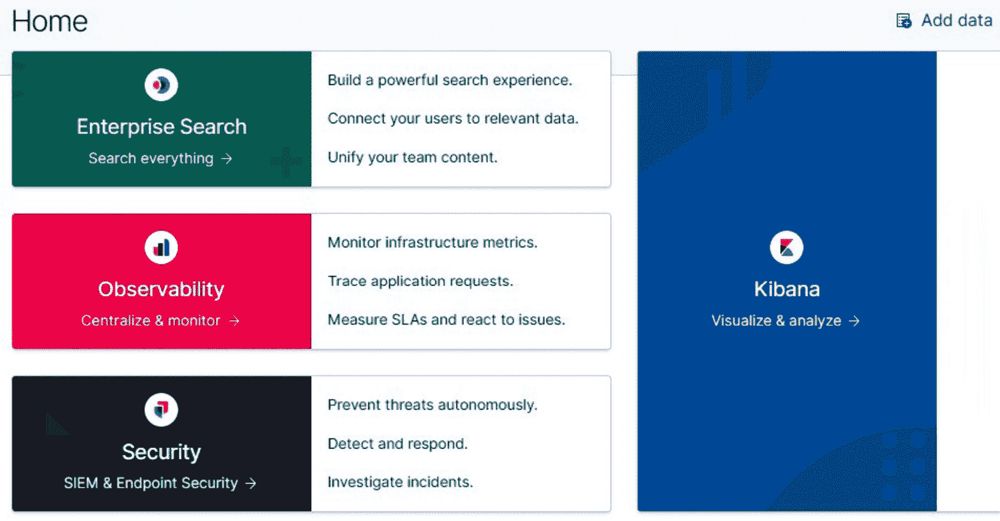
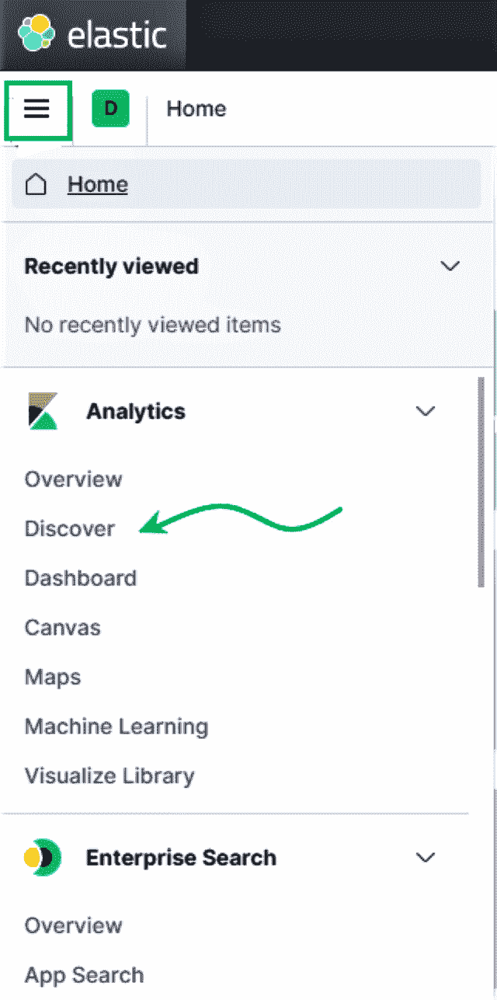
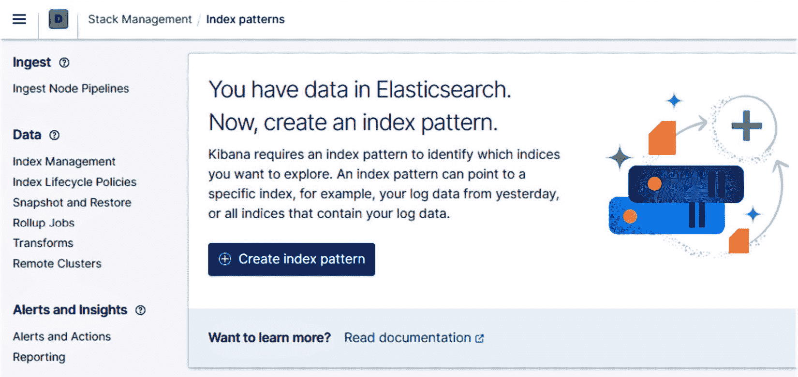
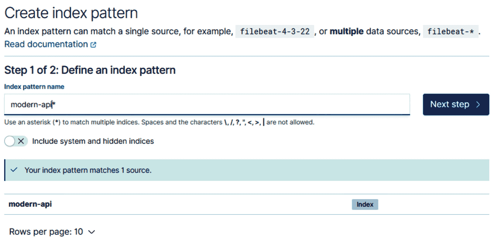
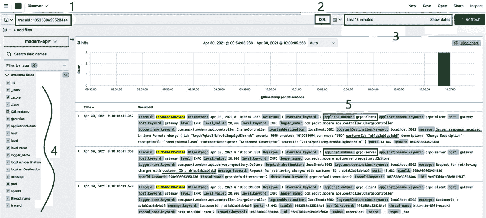
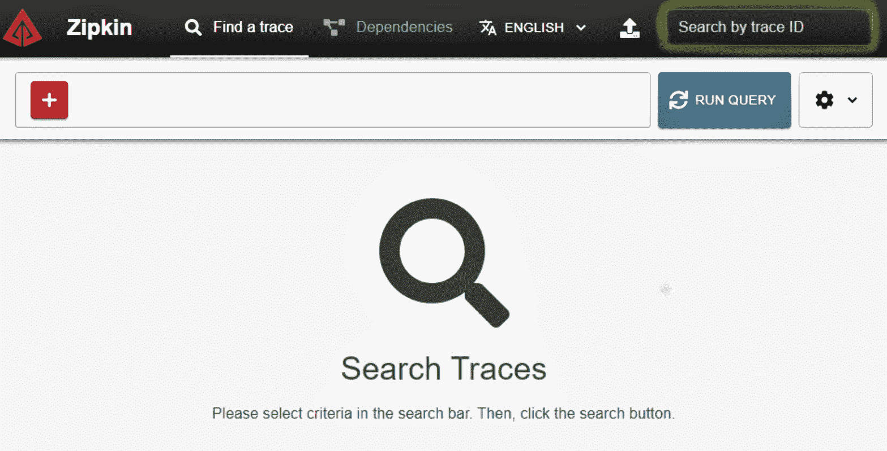
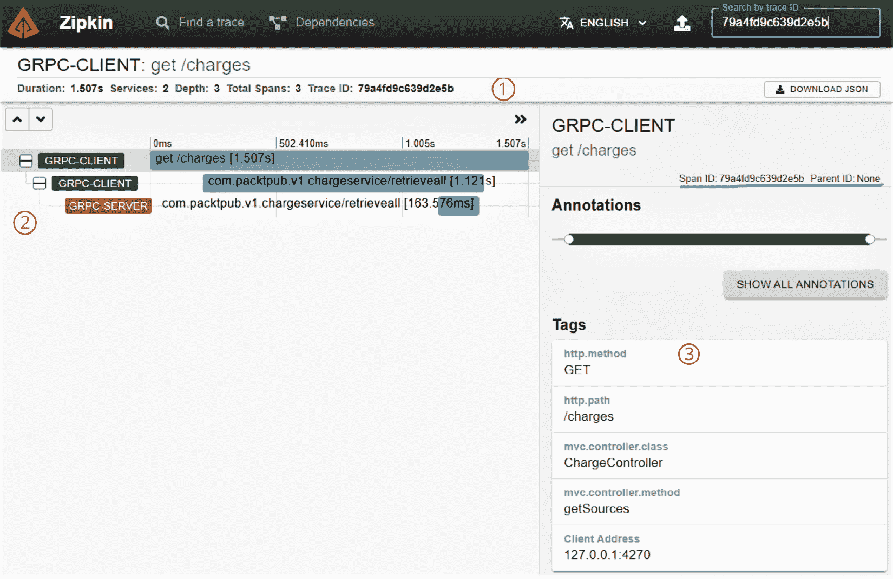

# 十二、日志和监控

在这一章中，你将探索日志记录和监控工具， **ELK** ( **Elastic Search，Logstash，Kibana** ) stack 和 Zipkin。然后，这个工具将用于实现 API 调用的请求/响应的分布式日志记录和跟踪。Spring Sleuth 将用于将跟踪信息注入 API 调用。您将学习如何发布和分析不同请求的日志记录和跟踪以及与响应相关的日志。

这些汇总的日志将帮助您排除 web 服务故障。您将调用一个服务(比如 gRPC 客户机)，该服务将调用另一个服务(比如 gRPC 服务器)，并用一个跟踪标识符将它们链接起来。然后，使用这个跟踪标识符，您可以搜索集中式日志并调试请求流。在本章中，我们将使用这个示例流。但是，在服务调用需要更多内部调用的情况下，也可以使用相同的方法。您还将使用 Zipkin 来确定每个 API 调用的性能。

您将在本章中探索以下主题:

*   日志记录和跟踪简介
*   了解 ELK 栈
*   安装 ELK 栈
*   实现日志记录和跟踪
*   使用 Zipkin 的分布式跟踪

完成本章后，您将对分布式日志记录和监控以及 ELK 栈有所了解。

# 技术要求

本章介绍了 gRPC 的理论。但是，开发和测试基于 gRPC 的 web 服务需要以下内容:

*   任何 Java IDE，如 NetBeans、IntelliJ 或 Eclipse
*   **Java 开发工具包** ( **JDK** ) 15
*   一个互联网连接来克隆代码并下载依赖项和升级
*   Postman/cURL(用于 API 测试)
*   坞站和坞站组成

所以让我们开始吧！

请访问以下链接查看代码:[https://github . com/packt publishing/Modern-API-Development-with-Spring-and-Spring-Boot/tree/main/chapter 12](https://github.com/PacktPublishing/Modern-API-Development-with-Spring-and-Spring-Boot/tree/main/Chapter12)

# 日志记录和跟踪简介

今天，产品和服务被分成多个小部分，作为独立的流程执行或作为独立的服务部署，不像一个单一的系统。一个 API 调用可以进行其他几个内部 API 调用。因此，您需要分布式和集中式日志记录来跟踪跨多个 web 服务的请求。这种追踪可以使用追踪标识符(`traceId`)来完成，该也可以称为相关标识符(`correlationId`)。这个标识符是形成唯一字符串的字符集合，它被填充并分配给需要多个服务间调用的 API 调用。然后，出于跟踪目的，相同的跟踪标识符被传播到后续的 API 调用。

生产系统中的错误和问题迫在眉睫。您需要调试来确定根本原因。与调试相关的一个关键工具是日志。如果系统是为警告而设计的，日志还可以向您提供与系统相关的警告。日志还提供吞吐量、容量以及对系统健康状况的监控。因此，您需要一个优秀的日志平台和策略来实现有效的调试。

市场上有不同的开源和企业级日志工具，包括 Splunk、Graylog 和 ELK stack。麋鹿栈是其中最受欢迎的，它允许你免费使用，除非你不把它作为 SaaS 提供。在本章中，您将使用 ELK 栈进行日志记录。

让我们在下一小节中了解 ELK 栈。

## 了解麋鹿栈

**ELK stack** 包含三个组件——elastic search、Logstash 和 Kibana。这三款产品都是 elastic search b . v .([https://www.elastic.co/](https://www.elastic.co/))的 T3】部分。ELK 栈执行日志的聚合、分析、可视化和监控。ELK stack 提供了一个完整的博客平台，允许您分析、可视化和监控所有类型的日志，包括产品和系统日志。

您将使用以下工作流来发布日志，如下图所示:


图 12.1–ELK 栈中的日志流

让我们来理解这个图表:

*   服务/系统日志被推送到 TCP 端口上的 Logstash。
*   Logstash 将日志推送到 Elasticsearch 进行索引。
*   然后，Kibana 使用 Elasticsearch 索引来查询和可视化日志。

在一个理想的生产系统中，你应该多使用一层。应该在服务日志和 Logstash 之间放置一个代理层，比如 Redis/Kafka/RabbitMQ。这可以防止数据丢失，并可以处理输入负载的突然峰值。

ELK 栈配置提示

ELK 栈完全可定制，并带有默认配置。但是，如果您使用的是 Elasticsearch 集群(部署了多个 Elasticsearch 实例)，最好使用奇数个 Elasticsearch 节点(实例)以避免裂脑问题。

建议对所有字段使用适当的数据类型(在 log JSON 输入中)。这将允许您在查询日志数据时执行逻辑检查和比较器。例如，如果`http_status`字段类型是字符串，就不能执行`http_status < 400`检查。

如果您已经熟悉 ELK 栈，您可以跳过这一部分，进入下一部分。在这里，您可以找到对 ELK 栈中每个工具的简要介绍。

### 弹性搜索

Elasticsearch 是最流行的企业全文搜索引擎之一，基于 Apache Lucene，使用 Java 开发。Elasticsearch 也是一个高性能、全功能的文本搜索引擎库。根据许可条款的最新变化，它是受限的开源软件，禁止您将 Elasticsearch 或 ELK stack 作为 SaaS 提供。它是可分发的，并支持多租户。单个 Elasticsearch 服务器存储多个索引(每个索引代表一个数据库)，单个查询可以搜索多个索引的数据。它是一个分布式搜索引擎，支持集群。

它很容易扩展，可以提供接近实时的搜索，延迟为 1 秒。Elasticsearch APIs 非常广泛，而且非常精细。Elasticsearch 提供基于 JSON 的无模式存储，用 JSON 表示数据模型。Elasticsearch APIs 使用 JSON 文档进行 HTTP 请求和响应。

### 日志

Logstash 是一个具有实时管道功能的开源数据收集引擎。它执行三个主要操作——收集数据、过滤信息，并将处理后的信息输出到数据存储，方式与 Elasticsearch 相同。由于数据管道功能，它允许您处理任何事件数据，例如来自各种系统的日志。

Logstash 作为一个代理运行，它收集数据、解析数据、过滤数据，并将输出发送到指定的数据存储，比如 Elasticsearch，或者作为控制台上的简单标准输出。

最重要的是，它有一套丰富的插件。

### Kibana

Kibana 是一个开源 web 应用，用于可视化和执行信息分析。它与 Elasticsearch 交互，并提供与它的轻松集成。您可以对存储在弹性搜索索引中的信息进行搜索、显示和交互。

这是一个基于浏览器的 web 应用，允许您执行高级数据分析，并在各种图表、表格和地图中可视化您的数据。而且是零配置应用。因此，安装后不需要任何编码或额外的基础设施。

接下来，让我们学习如何安装 ELK 栈

# 安装 ELK 烟囱

您可以使用各种 方法来安装 ELK 栈，例如根据操作系统安装单独的组件，或者下载 Docker 映像并单独运行它们，或者使用 Docker Compose/Docker Swarm/Kubernetes 执行 Docker 映像。在本章中，您将使用 Docker Compose。

在创建 ELK stack Docker 编写文件之前，让我们先了解一下 Docker 编写文件的语法。Docker 合成文件是使用 YAML 定义的。Docker 合成文件包含四个重要的顶级键:

*   `version`:表示 Docker 合成文件格式的版本。您可以在安装 Docker 引擎的基础上使用合适的版本。您可以查看 https://docs.docker.com/compose/compose-file/[的链接，以确定 Docker 合成文件版本和 Docker 引擎版本之间的映射。](https://docs.docker.com/compose/compose-file/)
*   `services`:包含一个或多个服务定义。服务定义表示由容器执行的服务，该服务包含容器名称(`container_name`)、Docker 映像(`image`)、环境变量(`environment`)、外部和内部端口(`port`)、运行容器时要执行的命令(`command`)、用于与其他服务通信的网络(`networks`)、主机文件系统与正在运行的容器的映射(`volume`)以及一旦相关服务启动就要执行的容器(`depends_on`)。
*   `networks`:表示需要创建的(顶级)命名网络，以便在定义的服务之间建立通信通道。然后，服务使用这个网络基于定义的服务的`networks`键进行通信。顶级网络密钥包含驱动程序字段，对于单个主机可以是`bridge`，在 Docker Swarm 中使用时可以是`overlay`。你要用`bridge`。
*   `volumes`:顶层 volumes 键用于创建挂载主机路径的命名卷。确保仅在多个服务需要时使用它，否则，您可以在服务定义中使用`volumes`键，这将是特定于服务的。

现在，让我们在`Chapter12`目录中创建 Docker 合成文件`docker-compose.yaml`，用于定义 ELK 栈。然后，您可以将以下代码添加到该文件中:

```java
version: "3.2"
services:
  elasticsearch:
    container_name: es-container
    image: docker.elastic.co/elasticsearch/elasticsearch:7.12.1
    environment:
      - xpack.security.enabled=false
      - "discovery.type=single-node"
    networks:
      - elk-net
    ports:
      - 19200:9200
```

[https://github . com/packt publishing/Modern-API-Development-with-Spring-and-Spring-Boot/blob/main/chapter 12/docker-compose . YAML](https://github.com/PacktPublishing/Modern-API-Development-with-Spring-and-Spring-Boot/blob/main/Chapter12/docker-compose.yaml)

这里，您有一个定义的 Docker 编写文件版本。然后，创建包含`elasticsearch`服务的`services`键部分。该服务包含容器名称、Docker 映像、环境变量和网络(因为您希望 ELK 组件相互通信)。最后，端口以`external:internal`格式定义。您将使用浏览器的端口`19200`来访问它。然而，其他服务将使用端口`9200`与 Elasticsearch 通信。

类似地，接下来可以定义`logstash`服务，如下面的代码块所示:

```java
   logstash:
     container_name: ls-container
     image: docker.elastic.co/logstash/logstash:7.12.1
     environment:
       - xpack.security.enabled=false
     command: logstash -e 'input { tcp { port => 5001 codec => 
              "json" }} output { elasticsearch { hosts => 
              "elasticsearch:9200" index => "modern-api" }}'
     networks:
       - elk-net
     depends_on:
       - elasticsearch
     ports:
       - 5002:5001
```

Logstash 配置包含两个额外的服务密钥:

*   First, a command key that contains the `logstash` command with a given configuration (using `-e`). The Logstash configuration normally contains three important parts:

    i. `input`:记录输入通道，如`tcp`或`File`。您将使用 TCP 输入通道。这意味着 gRPC 服务器和 gRPC 客户端服务将以 JSON 格式(使用 JSON 编码的插件)将日志推送到端口`5001`上的`logstash`。

    二。`filter`:过滤键包含各种使用不同方式的过滤表达式，如`grok`。你不想从日志中过滤任何东西，所以你应该退出这个键。

    三。`output`:过滤掉信息后，将输入的数据发送到哪里。在这里，您使用的是 Elasticsearch。Logstash 将接收到的日志信息推送到端口`9200`上的 Elasticsearch，并使用`modern-api` Elasticsearch 索引。然后在 Kibana 上使用这个索引来查询、分析和可视化日志。

*   第二个键`depends_on`，告诉 Docker Compose 在执行`logstash`服务之前启动 Elasticsearch。

接下来，让我们添加最终服务`kibana`，如下面的代码块所示:

```java
  kibana:
    container_name: kb-container
    image: docker.elastic.co/kibana/kibana:7.12.1
    environment:
      - ELASTICSEARCH_HOSTS=http://es-container:9200
    networks:
      - elk-net
    depends_on:
      - elasticsearch
    ports:
      - 5600:5601
networks:
  elk-net:
    driver: bridge
```

服务的`kibana`定义与其他已定义的服务一致。它使用环境变量`ELASTICSEARCH_HOSTS`连接到 Elasticsearch。

在 Docker Compose 文件的末尾，您定义了使用`bridge`驱动程序的`elk-net`网络。

您已经完成了对 ELK stack Docker 编写文件的配置。现在让我们使用以下命令启动 Docker Compose(如果使用除了`docker-compose.yaml`或`docker-compose.yml`之外的其他文件名，可以使用`-f`标志):

```java
$ docker-compose up –d
Creating network "chapter12_elk-net" with driver "bridge"
Creating es-container ... done
Creating ls-container ... done
Creating kb-container ... done
```

这里使用了`-d`选项，它将在后台启动 Docker Compose。它首先基于依赖关系(T2 键)启动`es-container`。

注意

Elasticsearch 默认使用 2GB 的堆大小。Docker 在 Mac 等一些系统中也默认使用 2GB 内存。

这可能会导致错误，如错误-137。因此，您应该将默认 Docker 内存增加到 4GB+,以避免此类问题。

docker 内存配置请参考链接[https://docs . Docker . com/config/containers/resource _ constraints/# memory](https://docs.docker.com/config/containers/resource_constraints/#memory)。

你可以先看到。它创建网络，然后创建服务容器并启动它们。一旦所有的容器都启动了，您就可以在浏览器中点击 URL`http://localhost:19200/`(包含为`Elasticsearch service`定义的外部端口)来检查`Elasticsearch`实例是否启动。

如果 Elasticsearch 服务启动，它可能会按照以下代码块做出响应:

```java
{
  "name" : "e0c115e8a785",
  "cluster_name" : "docker-cluster",
  "cluster_uuid" : "VKBFi9-sQoqg8xzAM1Ep-g",
  "version" : {
    "number" : "7.12.1",
    "build_flavor" : "default",
    "build_type" : "docker",
    "build_hash" : "3186837139b9c6b6d23c3200870651f10d3343b7",
    "build_snapshot" : false,
    "lucene_version" : "8.8.0",
    "minimum_wire_compatibility_version" : "6.8.0",
    "minimum_index_compatibility_version" : "6.0.0-beta1"
  },
  "tagline" : "You Know, for Search"
}
```

接下来，让我们通过点击浏览器中的 URL `http://localhost:5600`(包含为`kibana`服务定义的外部端口)来检查 Kibana 仪表板。这应该会加载 Kibana 的主页，如下面的屏幕截图所示:



图 12.2–基巴纳主页

您可能想知道如何查看日志，因为您已经使用了- `d`选项。您可以使用`docker-compose logs [service name]`命令。如果您不提供服务名称，那么它将显示所有服务的日志。您可以使用`--tail`标志来过滤行数。`--tail="all"`标志将显示所有行:

```java
// Don't use flag –t as it is a switch that turns on the timestamp
docker-compose logs --tail="10" elasticsearch
docker-compose logs --tail="10" kibana
```

您可以使用以下命令来停止 Docker 合成文件:

```java
$ docker-compose down
Stopping kb-container ... done
Stopping ls-container ... done
Stopping es-container ... done
Removing kb-container ... done
Removing ls-container ... done
Removing es-container ... done
Removing network chapter12_elk-net
```

它首先根据依赖关系停止容器，然后删除它们。最后，它移除网络。

接下来，让我们修改代码，将应用与 ELK 栈集成起来。

# 实现日志记录和跟踪

日志记录和跟踪齐头并进。默认情况下，登录应用代码已经完成。您使用 Logback 进行日志记录。日志要么被配置为在控制台上显示，要么被推送到文件系统。但是，您还需要将日志推送到 ELK 栈中进行索引和分析。为此，您需要对日志回溯配置文件`logback-spring.xml`进行某些更改，以将日志推送到 Logstash。除此之外，这些日志还应该包含跟踪信息。

出于跟踪目的，应该在分布式事务中填充和传播相关/跟踪 标识符。分布式事务指的是内部调用其他服务来服务请求的主 API 调用。Spring 提供了一个 **Spring Cloud Sleuth** 库，由负责分发跟踪。它生成跟踪 ID 和 span 标识符。在分布式事务期间，跟踪 ID 被传播给所有的参与者服务。span ID 也参与分布式事务。然而，span 标识符的范围属于它的服务(它所填充的服务)。

您可以复制并增强来自 [*第十一章*](11.html#_idTextAnchor230) 、*基于 gRPC 的 API 开发和测试*的代码，这些代码可以在[https://github . com/packt publishing/Modern-API-Development-with-Spring-and-Spring-Boot/tree/main/Chapter 11](https://github.com/PacktPublishing/Modern-API-Development-with-Spring-and-Spring-Boot/tree/main/Chapter11)找到，以实现日志记录和跟踪，或者在[https://github . com/packt publishing/Modern-API-Development-with-Spring-and](https://github.com/PacktPublishing/Modern-API-Development-with-Spring-and-Spring-Boot/tree/main/Chapter12)

首先，您将在下面的小节中对 gRPC 服务器代码进行修改。

## 更改 gRPC 服务器代码

要启用 跟踪并将日志发布到 ELK 栈，您需要进行以下代码更改，如以下步骤所示:

1.  Add the following dependencies to the `build.gradle` file:

    ```java
    // logging
    implementation 'net.logstash.logback:logstash-logback-encoder:6.6'
    implementation 'org.springframework.cloud:spring-cloud-starter-sleuth:3.0.2'
    implementation 'io.zipkin.brave:brave-instrumentation-grpc:5.13.2'
    ```

    [https://github . com/packt publishing/Modern-API-Development-with-Spring-and-Spring-Boot/blob/main/chapter 12/server/build . gradle](https://github.com/PacktPublishing/Modern-API-Development-with-Spring-and-Spring-Boot/blob/main/Chapter12/server/build.gradle)

    您将添加这三个依赖项:

    a. **Logstash-Logback Encoder** :这个库提供了将日志发布到 Logstash 的 Logback 编码器。这将在`spring-logback.xml`文件中进行配置。

    b. **Spring Cloud Starter Sleuth** :它负责管理`log`语句中的跟踪和跨度 id。

    c.**Brave Instrumentation for gRPC**:只有基于 gRPC 的代码才需要这个库，因为 gRPC 服务器是静态生成的，不受 Spring 上下文的管理。RESTful web 服务不需要这种依赖性。这个库为跟踪提供了一个服务器拦截器。

2.  Add/modify the `spring-logback.xml` file with the following content:

    ```java
    <?xml version="1.0" encoding="UTF-8"?>
    <configuration>
      <springProperty scope="context" name="applicationName" 
                                    source="spring.application.name"/>
      <springProperty scope="context" name="logstashDestination" 
                                    source="logstash.destination" />
      <property name="LOG_PATTERN" value="%d{yyyy-MM-dd HH:mm:ss.SSS}
        %5p [${applicationName},%X{traceId:-},%X{spanId:-}] ${PID:-} 
          --- [%15.15t] %-40.40logger{39} : %msg%n"/>
      <property name="LOG_FILE" value="${chapter12-grpc-
           server.service.logging.file:-chapter12-grpc-server-logs}"/>
      <property name="LOG_DIR" value="${chapter12-grpc-
           server.service.logging.path:-chapter12-grpc-server-logs}"/>
      <property name="SERVICE_ENV" value="${service.env:-dev}"/>
      <property name="LOG_BASE_PATH" value="${LOG_DIR}/${SERVICE_ENV}"/>
      <property name="MAX_FILE_SIZE" 
       value="${chapter12.service.logging.rolling.maxFileSize:-100MB}"/>
      <!-- other configuration has been remove for brevity  -->
    ```

    [https://github . com/packt publishing/Modern-API-Development-with-Spring-and-Spring-Boot/blob/main/chapter 12/server/src/main/resources/log back-Spring . XML](https://github.com/PacktPublishing/Modern-API-Development-with-Spring-and-Spring-Boot/blob/main/Chapter12/server/src/main/resources/logback-spring.xml)

    在这里，你定义属性。其中两个的值取自 Spring 配置文件(`application.properties`或`application.yaml`)。现在让我们添加 Logstash 编码器，如下面的代码块所示:

    ```java
    <appender name="STASH" 
        class="net.logstash.logback.appender.LogstashTcpSocketAppender">
      <destination>${logstashDestination}</destination>
      <encoder class="net.logstash.logback.encoder.LogstashEncoder" />
    </appender>
    <!-- other configuration has been remove for brevity  -->
    ```

    这里定义了`STASH` appender，它使用 TCP 套接字将日志推送到 Logstash。它包含用于分配 Logstash 的`<HOST>:<TCP Port>`值的 destination 元素。另一个元素编码器包含完全限定的类名`LogstashEncoder`。

    最后，将`STASH` appender 添加到根元素，如下所示:

    ```java
    <!-- other configuration has been remove for brevity  -->
      <root level="INFO">
        <appender-ref ref="STDOUT"/>
        <appender-ref ref="STASH"/>
        <appender-ref ref="FILE"/>
      </root>
    <!-- other configuration has been remove for brevity  -->
    ```

    根级别设置为`INFO`。

3.  Next, let's add the Spring properties used in this `logback-spring.xml` file to `application.properties`, as shown in the following code block:

    ```java
    spring.application.name=grpc-server
    spring.main.web-application-type=none
    grpc.port=8080
    logstash.destination=localhost:5002
    ```

    [https://github . com/packt publishing/Modern-API-Development-with-Spring-and-Spring-Boot/blob/main/chapter 12/server/src/main/resources/application . properties](https://github.com/PacktPublishing/Modern-API-Development-with-Spring-and-Spring-Boot/blob/main/Chapter12/server/src/main/resources/application.properties)

    这里，Logstash 目的主机被设置为`localhost`。如果您在任何远程机器上运行，请相应地更改主机。Logstash TCP 端口按照 Docker Composer 文件中设置的 Logstash 外部端口进行设置。

4.  The required dependencies and configurations are now set. You can add the tracing server interceptor to the gRPC server (you don't need a tracing interceptor if you are using the RESTful web service as Spring's autoconfiguration mechanism takes care of this)

    首先，让我们在配置文件中定义一个新的 bean，如下所示:

    ```java
    @Configuration
    public class Config {
      @Bean
      public GrpcTracing grpcTracing(RpcTracing rpcTracing) {
        return GrpcTracing.create(rpcTracing);
      }
    }
    ```

    [https://github . com/packt publishing/Modern-API-Development-with-Spring-and-Spring-Boot/blob/main/chapter 12/server/src/main/Java/com/packt/Modern/API/server/config . Java](https://github.com/PacktPublishing/Modern-API-Development-with-Spring-and-Spring-Boot/blob/main/Chapter12/server/src/main/java/com/packt/modern/api/server/Config.java)

    作为自动配置的结果，`RpcTracing` bean 已经可用，它用于创建`GrpcTracing`。现在，您有了可用于`GrpcTracing`的 bean，它可用于创建跟踪服务器拦截器。

5.  让我们修改 gRPC 服务器 Java 文件，将跟踪服务器拦截器添加到 gRPC 服务器，如下面的代码块所示:

    ```java
    @Component
    public class GrpcServer {
      // code truncated for brevity
      private GrpcTracing grpcTracing;
      public GrpcServer(SourceService sourceService, ChargeService 
             chargeService, ExceptionInterceptor exceptionInterceptor, 
             GrpcTracing grpcTracing) {
        // code truncated for brevity
        this.grpcTracing = grpcTracing;
      }
      public void start() throws IOException, InterruptedException {    
        server = ServerBuilder.forPort(port)
            .addService(sourceService).addService(chargeService)
            .intercept(exceptionInterceptor)
            .intercept(grpcTracing.newServerInterceptor())
            .build().start();
        // code truncated for brevity
      }
    // code truncated for brevity
    ```

[https://github . com/packt publishing/Modern-API-Development-with-Spring-and-Spring-Boot/blob/main/chapter 12/server/src/main/Java/com/packt/Modern/API/server/grpcserver . Java](https://github.com/PacktPublishing/Modern-API-Development-with-Spring-and-Spring-Boot/blob/main/Chapter12/server/src/main/java/com/packt/modern/api/server/GrpcServer.java)

在这里，您可以看到上一步中在配置文件中创建的 bean 是使用构造函数注入的。后来，`grpcTracing` bean 被用来创建服务器拦截器。

对 gRPC 服务器进行所需的更改，以将日志发布到 ELK 栈并进行跟踪。您可以重新构建 gRPC 服务器并运行它的`jar`来查看有效的更改。通过引用的方式检查以下代码块:

```java
$ java -jar build\libs\chapter12-server-0.0.1-SNAPSHOT.jar
  .   ____          _            __ _ _
 /\\ / ___'_ __ _ _(_)_ __  __ _ \ \ \ \
( ( )\___ | '_ | '_| | '_ \/ _` | \ \ \ \
 \\/  ___)| |_)| | | | | || (_| |  ) ) ) )
  '  |____| .__|_| |_|_| |_\__, | / / / /
 =========|_|==============|___/=/_/_/_/
 :: Spring Boot ::                (v2.4.4)
// Logs truncated for brevity
2021-04-30 09:28:17.999      INFO [grpc-server,,]     14580 --- [           main] com.packt.modern.api.server.GrpcServer   : gRPC server started and listening on port: 8080.
```

您可以看到日志遵循在`logback-spring.xml`中配置的模式。在`INFO`之后打印的日志块包含应用/服务名，以及跟踪和跨度 id。突出显示的行显示空白的跟踪 ID 和 span ID，因为没有进行涉及分布式事务的外部调用。只有在调用分布式事务(服务间通信)时，跟踪和跨度 id 才会添加到日志中。

现在，类似地，接下来您可以在 gRPC 客户机中添加日志和跟踪实现。

## 更改 gRPC 客户端代码

为了支持跟踪和将日志发布到 ELK 栈，您还需要在 gRPC 客户端中进行代码更改，这与在 gRPC 代码中实现的更改非常相似。有关更多信息，请参考以下步骤:

1.  Add the following dependencies to the `build.gradle` file:

    ```java
    // logging
    implementation 'net.logstash.logback:logstash-logback-encoder:6.6'
    implementation 'org.springframework.cloud:spring-cloud-starter-sleuth:3.0.2'
    implementation 'io.zipkin.brave:brave-instrumentation-grpc:5.13.2'
    ```

    [https://github . com/packt publishing/Modern-API-Development-with-Spring-and-Spring-Boot/blob/main/chapter 12/client/build . gradle](https://github.com/PacktPublishing/Modern-API-Development-with-Spring-and-Spring-Boot/blob/main/Chapter12/client/build.gradle)

    这些是与您添加到 gRPC 服务器代码中的依赖项相同的依赖项。

2.  Add/modify the `spring-logback.xml` file with the following content:

    ```java
    <?xml version="1.0" encoding="UTF-8"?>
    <configuration>
      <springProperty scope="context" name="applicationName" 
                      source="spring.application.name"/>
      <springProperty scope="context" name="logstash.      destination" source="logstashDestination" />
      <property name="LOG_PATTERN" value="%d{yyyy-MM-dd       HH:mm:ss.SSS}
        %5p [${applicationName},%X{traceId:-},%X{spanId:-}]         ${PID:-} 
          --- [%15.15t] %-40.40logger{39} : %msg%n"/>
      <property name="LOG_FILE" value="${chapter12-grpc-
           client.service.logging.file:-chapter12-grpc-       client-logs}"/>
      <property name="LOG_DIR" value="${chapter12-grpc-
           client.service.logging.path:-chapter12-grpc-       client-logs}"/>
      <property name="SERVICE_ENV" value="${service.env:-      dev}"/>
      <property name="LOG_BASE_PATH" value="${LOG_      DIR}/${SERVICE_ENV}"/>
      <property name="MAX_FILE_SIZE" 
       value="${chapter12.service.logging.rolling.       maxFileSize:-100MB}"/>
      <!-- other configuration has been remove for brevity  -->
    ```

    [https://github . com/packt publishing/Modern-API-Development-with-Spring-and-Spring-Boot/blob/main/chapter 12/client/src/main/resources/log back-Spring . XML](https://github.com/PacktPublishing/Modern-API-Development-with-Spring-and-Spring-Boot/blob/main/Chapter12/client/src/main/resources/logback-spring.xml)

    在这里，您定义属性。它类似于 gRPC 服务器。只有与 gRPC 客户端相关的值发生了变化。现在让我们添加 Logstash 编码器，如下面的代码块所示:

    ```java
    <appender name="STASH" 
        class="net.logstash.logback.appender.LogstashTcpSocketAppender">
      <destination>${logstashDestination}</destination>
      <encoder class="net.logstash.logback.encoder.LogstashEncoder" />
    </appender>
    <!-- other configuration has been remove for brevity  -->
    ```

    这与 gRPC 服务器的完全相同。最后，将`STASH` appender 添加到根元素，如下所示:

    ```java
    <!-- other configuration has been remove for brevity  -->
      <root level="INFO">
        <appender-ref ref="STDOUT"/>
        <appender-ref ref="STASH"/>
        <appender-ref ref="FILE"/>
      </root>
    <!-- other configuration has been remove for brevity  -->
    ```

3.  Next, let's add the `spring` properties used in this `logback-spring.xml` file to `application.properties`, as shown in the following code block:

    ```java
    spring.application.name=grpc-client
    server.port=8081
    grpc.server.host=localhost
    grpc.server.port=8080
    logstash.destination=localhost:5002
    ```

    [https://github . com/packt publishing/Modern-API-Development-with-Spring-and-Spring-Boot/blob/main/chapter 12/client/src/main/resources/application . properties](https://github.com/PacktPublishing/Modern-API-Development-with-Spring-and-Spring-Boot/blob/main/Chapter12/client/src/main/resources/application.properties)

4.  The required dependencies and configurations are now set. Now, you can add the tracing to the gRPC client. `ManagedChannelBuilder`, provided by the gRPC library, supports channel creation statically. Therefore, you would use `SpringAwareManagedChannelBuilder` to create a channel for enabling tracing. `SpringAwareManagedChannelBuilder` is a wrapper around the gRPC's managed channel class. It is provided by the `brave-instrumention-grpc` library (you don't need additional tracing changes if you are using the RESTful web service; Spring autoconfiguration takes care of this). First of all, let's define a new bean, `SpringAwareManagedChannelBuilder`, and its dependent beans in a configuration file, as shown next:

    ```java
    @Configuration
    public class Config {
      @Bean
      public SpringAwareManagedChannelBuilder managedChannelBuilder(
      Optional<List<GrpcManagedChannelBuilderCustomizer>> customizers) {
        return new SpringAwareManagedChannelBuilder(customizers);
      }
      @Bean
      GrpcManagedChannelBuilderCustomizer 
       tracingManagedChannelBuilderCustomizer(GrpcTracing grpcTracing) {
        return new TracingManagedChannelBuilderCustomizer(grpcTracing);
      }
      @Bean
      public GrpcTracing grpcTracing(RpcTracing rpcTracing) {
        return GrpcTracing.create(rpcTracing);
      }
    }
    ```

    https://github.com/PacktPublishing/Modern-API-Development-with-Spring-and-Spring-Boot/blob/main/Chapter12/client/src/main/java/com/packt/modern/api/client/Config.java

    通过自动配置，`RpcTracing` bean 已经可用，用于创建`GrpcTracing`。然后它被用来创建`GrpcManagedChannelBuilderCustomizer`的 bean，这个 bean 被用来创建 Spring 感知的托管通道构建器。

5.  Let's now modify the gRPC client Java file to use the Spring-aware managed channel builder for creating the channel:

    ```java
    @Component
    public class GrpcClient {
      @Autowired
      private SpringAwareManagedChannelBuilder builder;
      // code truncated for brevity
      public void start() {
        channel = builder.forAddress(host, port).        usePlaintext().build();
        sourceServiceStub = SourceServiceGrpc.        newBlockingStub(channel);
        chargeServiceStub = ChargeServiceGrpc.        newBlockingStub(channel);
      }
    // code truncated for brevity
    ```

    https://github.com/PacktPublishing/Modern-API-Development-with-Spring-and-Spring-Boot/blob/main/Chapter12/client/src/main/java/com/packt/modern/api/client/Config.java

    在这里，您可以看到前面步骤中在配置文件中创建的 bean 是自动连接的。稍后，`SpringAwareManagedChannelBuilder` bean 用于构建通道。

6.  现在，您需要进行最后的更改——添加一个 REST 端点，从而允许客户端调用服务器。这是为了测试目的而创建的，这样您就可以启动分布式事务，该事务将使用 gRPC 客户机来调用 gRPC 服务器 API。让我们添加 REST 端点，如下面的代码块所示:

    ```java
    @RestController
    public class ChargeController {
     private Logger LOG = LoggerFactory.     getLogger(getClass());
     private GrpcClient client;
     public ChargeController(GrpcClient client) {
       this.client = client;
     }
     @GetMapping("/charges")
     public String getSources(@RequestParam(defaultValue = 
         "ab1ab2ab3ab4ab5") String customerId)
         throws InvalidProtocolBufferException {
       LOG.info("CustomerId : {}", customerId);
       var req = CustomerId.newBuilder().setId(customerId).       build();
       CustomerId.Response resp = client.       getChargeServiceStub().retrieveAll(req);
       var printer = JsonFormat.printer().       includingDefaultValueFields();
       LOG.info("Server response received in Json Format:        {}", resp);
       return printer.print(resp);
     }
    }
    ```

[https://github . com/packt publishing/Modern-API-Development-with-Spring-and-Spring-Boot/blob/main/chapter 12/client/src/main/Java/com/packt/Modern/API/controller/charge controller . Java](https://github.com/PacktPublishing/Modern-API-Development-with-Spring-and-Spring-Boot/blob/main/Chapter12/client/src/main/java/com/packt/modern/api/controller/ChargeController.java)

gRPC 客户端也进行了所需的更改,以便于日志发布到 ELK 栈和跟踪。您可以重新构建 gRPC 客户端并运行它的`jar`来查看有效的更改。检查以下块以供参考:

```java
$ java -jar build\libs\chapter12-client-0.0.1-SNAPSHOT.jar
  .   ____          _            __ _ _
 /\\ / ___'_ __ _ _(_)_ __  __ _ \ \ \ \
( ( )\___ | '_ | '_| | '_ \/ _` | \ \ \ \
 \\/  ___)| |_)| | | | | || (_| |  ) ) ) )
  '  |____| .__|_| |_|_| |_\__, | / / / /
 =========|_|==============|___/=/_/_/_/
 :: Spring Boot ::                (v2.4.4)
// Logs truncated for brevity
2021-04-30 09:35:34.122      INFO [grpc-client,,]     6416 --- [           main] com.packt.modern.api.ClientApp           : Started ClientApp in 60.985 seconds (JVM running for 72.022)
2021-04-30 09:35:35.002      INFO [grpc-client,,]     6416 --- [           main] com.packt.modern.api.client.GrpcClient   : gRPC client connected to localhost:8080
```

您可以看到日志遵循`logback-spring.xml`中配置的模式。INFO 之后打印的日志块包含应用/服务名、跟踪 ID 和 span ID。跟踪和跨度 id 为空，因为只有在调用分布式事务(服务间通信)时，它们才会被添加到日志中。

在 gRPC 服务器和客户机服务中启用日志聚合和分布式跟踪所需的更改现在已经完成。

接下来，您将在 Kibana 中进行更改并查看日志。

## 测试日志记录和跟踪更改

在开始测试之前，确保 ELK 栈已经启动并运行。另外，确保首先启动 gRPC 服务器，然后启动 gRPC 客户端服务。

您可以将适当的日志语句添加到您的服务中，以获得详细的日志。

让我们在新的终端窗口中运行以下命令。这将调用 gRPC 客户端服务中新创建的 REST 端点/费用:

```java
$ curl http://localhost:8081/charges
```

它应该用以下 JSON 输出来响应:

```java
charge {
  "id": "kopek7qkec3fkfve5s2aqu2gu03srhnb"
  "amount": 1000
  "created": 1619755094
  "currency": "USD"
  "customerId": "ab1ab2ab3ab4ab5"
  "description": "Charge Description"
  "receiptEmail": "receipt@email.com"
  "statementDescriptor": "Statement Descriptor"
  "sourceId": "7e1ra7pc67120gu0ns5htukgko9q561s"
}
```

这将在 gRPC 客户端中生成类似于以下日志的日志:

```java
2021-04-30 10:06:39.620      INFO 
[grpc-client,1053588e335284a4,1053588e335284a4] 6416 --- [nio-8081-exec-2] c.p.m.api.controller.ChargeController : CustomerId : ab1ab2ab3ab4ab5
2021-04-30 10:06:41.367      INFO 
[grpc-client,1053588e335284a4,1053588e335284a4] 6416 --- [nio-8081-exec-2] c.p.m.api.controller.ChargeController : Server response received in Json Format: charge {
  id: "kopek7qkec3fkfve5s2aqu2gu03srhnb"
  amount: 1000
  created: 1619755094
  currency: "USD"
  customerId: "ab1ab2ab3ab4ab5"
  description: "Charge Description"
  receiptEmail: receipt@email.com
  statementDescriptor: "Statement Descriptor"
  sourceId: "7e1ra7pc67120gu0ns5htukgko9q561s"
}
```

这里，突出显示的块首先显示了应用名称(`grpc-client`)、跟踪 ID ( `1053588e335284a4`)和跨度 ID ( `1053588e335284a4`)。跟踪和跨度 id 是相同的，因为 API 请求是在这里发起的。

它还应该在 gRPC 服务器中生成类似于以下日志的日志:

```java
2021-04-30 10:06:41.358      INFO 
[grpc-server,1053588e335284a4,298c90606395413d]     14580 --- [ault-executor-2] c.p.m.api.server.repository.DbStore      : Request for retrieving charges with customer ID : ab1ab2ab3ab4ab5
```

这里，突出显示的块首先显示应用名称(`grpc-server`)、跟踪 ID ( `1053588e335284a4`)和跨度 ID ( `298c90606395413d`)。跟踪 ID 与 gRPC 客户端日志中显示的相同。span id 不同于 gRPC 客户端服务，因为 span id 属于各自独立的服务。这就是 trace/correlation ID 如何帮助您跨不同的服务跟踪请求调用，因为它将被传播到它所涉及的所有服务。

跟踪这个请求很简单，因为日志只包含几行，并且只分散在两个服务中。如果您有几千兆字节的日志分散在不同的服务中会怎样？然后，您可以利用 ELK 栈，使用不同的查询标准来搜索日志索引。但是，我们将为此使用跟踪 ID。

首先，在浏览器中打开 Kibana 主页。然后，点击左上角的汉堡菜单，如下图截图所示。然后，在出现的菜单中点击**发现**选项:



图 12.3-基巴纳汉堡菜单

这将打开**发现**页面，如下页所示。但是，第一次创建索引模式时，会过滤掉 Elasticsearch 中可用的索引:



图 12.4-基巴纳的发现页面

接下来，点击**创建索引模式**按钮，打开以下页面，将索引模式定义为*步骤 1* 。这里，您应该在 ELK 栈的 Docker 编写文件中输入 Logstash 配置中给出的索引名(`modern-api`):



图 12.5-ki Bana 的创建索引模式页面-步骤 1

在*步骤 2* 中，您必须从弹出菜单中选择时间字段(`timestamp`):


图 12.6-ki Bana 的创建索引模式页面-步骤 2

然后，点击下一个的**，从弹性搜索索引中选择所有可用字段。然后，再次进入 **Discover** 页面，执行过滤查询，如下图所示。**

您可以将过滤器查询添加到**搜索**文本框和**发现**页面顶部的**日期/持续时间**菜单中。可以使用 **KQL** ( **Kibana 查询语言**)语言输入查询条件，其中允许您添加不同的比较器和逻辑运算符。更多信息请参考[https://www . elastic . co/guide/en/ki Bana/master/ku ery-query . html](https://www.elastic.co/guide/en/kibana/master/kuery-query.html)。

我们已经输入了标准(`traceId: 1053588e335284a4`)并将**持续时间**字段保留为其默认值(最后 15 分钟)。左侧还显示了如何选择 Elasticsearch 索引以及其中所有可用的字段。

输入标准后，按下 **Enter** 键或单击刷新按钮，搜索将显示所有服务的可用日志。搜索到的值以黄色突出显示。

您可以在下面的屏幕截图中看到，搜索到的跟踪 ID 显示了来自服务器和客户端服务的日志:



图 12.7–索引创建后的 Kibana 发现页面

搜索到的 **Discovery** 页面还显示了一个图表，该图表显示了特定时间段内的呼叫数量。您可以生成更多带有一些错误的日志，然后您可以使用不同的标准来过滤结果并探索更多。

您还可以保存搜索并执行更多操作，例如定制仪表板。更多信息请参考[https://www.elastic.co/guide/en/kibana/master/index.html](https://www.elastic.co/guide/en/kibana/master/index.html)。

# 使用 Zipkin 进行分布式跟踪

ELK 栈适合使用跟踪 ID 和其他字段进行日志聚合、过滤和调试。但是，它不能检查 API 调用的性能——调用所花费的时间。当您拥有基于微服务的应用时，这一点尤为重要。

这就是 Zipkin (OpenZipkin)和 Spring Cloud Sleuth 不仅帮助您跟踪跨多个服务调用的事务，还帮助您捕获分布式事务中涉及的每个服务所花费的响应时间。Zipkin 也用漂亮的图表展示了这些信息。它有助于您定位性能瓶颈，并深入研究造成延迟问题的特定 API 调用。您可以找出主 API 调用花费的总时间以及它的内部 API 调用时间。

与 Spring Boot 一起开发的服务促进了它们与 Zipkin 的集成。您只需进行两处代码更改——添加 Sleuth-Zipkin 依赖项和添加 Zipkin URL 属性。

您可以对 gRPC 服务器和客户端进行这两项更改，如下所示:

1.  首先，将突出显示的依赖项添加到`build.gradle`(gRPC 服务器和客户端项目):

    ```java
    implementation 'net.logstash.logback:logstash-logback-encoder:6.6'
    implementation 'org.springframework.cloud:spring-cloud-starter-sleuth:3.0.2'
    implementation 'io.zipkin.brave:brave-instrumentation-grpc:5.13.2'
    implementation 'org.springframework.cloud:spring-cloud-sleuth-zipkin:3.0.2'
    ```

2.  接下来，将以下属性添加到`application.properties`文件中(对于 gRPC 服务器和客户端):

    ```java
    zipkin.baseUrl: localhost:9411
    spring.sleuth.sampler.probability: 1.0
    ```

Zipkin `baseUrl`属性指向 Zipkin 应用。`spring.sleuth.sampler.probability`属性指的是应该被抽样的请求的概率。1 表示 100%的请求应该被抽样。关于可用配置的更多信息，可以参考[https://docs . spring . io/spring-cloud-sleuth/docs/3 . 0 . 2/reference/html/appendix . html #附录](https://docs.spring.io/spring-cloud-sleuth/docs/3.0.2/reference/html/appendix.html#appendix)。此链接指的是 3.0.2 版本的文档。如果您更改依赖关系版本，请使用适当的版本。

您已经完成了将跟踪信息发布到 Zipkin 所需的代码更改。完成这些更改后，重新构建服务器和客户端服务

让我们在下一小节开始 Zipkin。

## 执行 Zipkin

安装和运行 Zipkin 有多种方法。请参考[https://zipkin.io/pages/quickstart](https://zipkin.io/pages/quickstart)了解这些选项。出于开发目的，您应该从[https://search.maven.org/remote_content?g=io.zipkin&a = zipkin-server&v = LATEST&c = exec](https://search.maven.org/remote_content?g=io.zipkin&a=zipkin-server&v=LATEST&c=exec)获取最新版本作为自包含的可执行 jar，然后使用以下命令启动它(确保根据下载的文件更改 jar 文件中的版本):

```java
java -jar zipkin-server-2.23.2-exec.jarThis will start Zipkin with an in-memory database. For production purposes, it is recommended to use a persistence store such as Elasticsearch.
```

如果在本地主机上执行，它应该从默认端口`9411`开始。

一旦 Zipkin 服务器和 ELK 栈启动并运行，您就可以启动 gRPC 服务器和客户端服务，并执行以下命令:

```java
$ curl http://localhost:8081/charges
```

此命令应该在 gRPC 客户端服务中打印类似于以下日志语句的日志:

```java
2021-05-03 01:15:15.817      INFO 
[grpc-client,79a4fd9c639d2e5b,79a4fd9c639d2e5b]     10212 --- [nio-8081-exec-1] c.p.m.api.controller.ChargeController    : CustomerId : ab1ab2ab3ab4ab5
```

将跟踪 ID 放在手边，因为您将在 Zipkin UI 中使用它。通过访问`http://localhost:9411`打开 Zipkin 主页。它将如下所示:



图 12.8–Zipkin 主页

您可以观察到, Zipkin 也允许您运行查询。然而，我们将利用跟踪 ID。将复制的 trace ID 粘贴到右上角的**按 trace ID 搜索**文本框中，然后按**进入**:



图 12.9–Zipkin 搜索结果页面

如果跟踪 ID 可用， Zipkin 跟踪 ID 在顶部显示完整的 API 调用信息，用点 1 标记。在左侧部分，它用一个层次结构显示了所有相应的 API 调用，以图形方式显示了各个调用时间。这些 API 调用行是可选的。选定的呼叫详细信息显示在右侧。右侧的 **Show All Annotations** 按钮显示各个呼叫的开始和结束时间，如下面 grpc-server 呼叫的屏幕截图所示:


图 12.10–注释细节

对每个分布式 API 调用进行粒度级的时间跟踪，可以帮助您识别延迟问题和相对时间跟踪，以便进行性能调优。

# 总结

您已经了解了跟踪/关联 ID 的重要性，以及如何使用 Spring Cloud Sleuth 来设置它。您可以使用这些生成的 id 来查找相关的日志和 API 调用持续时间。您已经将 Spring Boot 服务与 ELK stack 和 Zipkin 集成在一起。

您还实现了额外的代码和配置，这是为基于 gRPC 的服务启用分布式跟踪所必需的。

在本章中，您已经掌握了使用 Spring Cloud Sleuth、ELK stack 和 Zipkin 进行日志聚合和分布式跟踪的技巧。

在下一章中，您将学习 GraphQL API 的基础知识。

# 问题

1.  跟踪 ID 和范围 ID 有什么区别？
2.  您应该在生成日志的服务和 ELK 栈之间使用代理吗？如果是，为什么？
3.  Zipkin 是如何工作的？

# 延伸阅读

*   Elasticsearch 文档:[https://www . elastic . co/guide/en/elastic search/reference/current/index . html](https://www.elastic.co/guide/en/elasticsearch/reference/current/index.html)
*   基巴纳文献:[https://www.elastic.co/guide/en/kibana/master/index.html](https://www.elastic.co/guide/en/kibana/master/index.html)
*   基巴纳查询语言:[https://www . elastic . co/guide/en/基巴纳/master/kuery-query.html](https://www.elastic.co/guide/en/kibana/master/kuery-query.html)
*   Logstash 文档:[https://www.elastic.co/guide/en/logstash/master/index.html](https://www.elastic.co/guide/en/logstash/master/index.html)
*   高级弹性搜索 7.0:[https://www . packtpub . com/product/advanced-elastic search-7-0/9781789957754](https://www.packtpub.com/product/advanced-elasticsearch-7-0/9781789957754)
*   Zipkin 文档:[https://zipkin.io/pages/quickstart](https://zipkin.io/pages/quickstart)