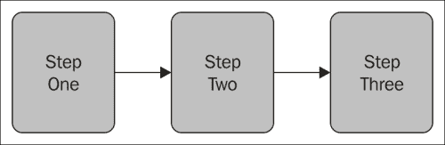

# 五、分步执行

在前一章中，我们学习了事务和管理不同场景中的事务，以及使用隔离级别定制事务，使用模式为单个和多个数据源配置属性。到目前为止，我们已经讨论了简单的作业，其中的流程是线性的，包含的作业的步骤是一个接一个执行的。在现实世界的应用中，我们需要用步骤的组合来配置作业，在它们之间共享数据，并决定在运行时执行哪个步骤。

在本章中，我们将讨论以下主题:

*   控制作业流程
*   数据共享
*   外部化和终止

# 控制作业流程

到目前为止，我们已经看到以线性方式连续执行步骤的批处理作业。在批处理作业的执行过程中，可能会出现根据上一步的结果来决定执行哪一步的情况，这是一种非线性执行。

下图显示了批处理作业中线性步骤的执行方式:



下图显示了批处理作业中非线性步骤执行是如何发生的:


让我们了解如何处理这样的作业流。主要有两种处理方法:

*   使用退出代码
*   使用决策逻辑

## 使用退出代码

通过配置带有`on`和`to`属性的`next`标签，可以根据沿着的一个步骤的退出状态来处理作业流。以下是使用退出代码的配置示例:

```java
<?xml version="1.0" encoding="UTF-8"?> 
<beans:beans xmlns ="http://www.springframework.org/schema/batch" 
xmlns:beans="http://www.springframework.org/schema/beans"
xmlns:xsi="http://www.w3.org/2001/XMLSchema-instance" 
xsi:schemaLocation="http://www.springframework.org/schema/beans 
http://www.springframework.org/schema/beans/spring-beans-3.0.xsd 
http://www.springframework.org/schema/batch 
http://www.springframework.org/schema/batch/spring-batch-3.0.xsd">

<beans:import resource="context.xml" />

<beans:bean id="testTasklet" class=" batch.TestTasklet"> 
<beans:property name="success" value="true"/> 
</beans:bean> 
<beans:bean id="successTasklet" class=" batch.StatusTasklet"> 
<beans:property name="status" value="Success"/> 
</beans:bean> 
<beans:bean id="failTasklet" class=" batch.StatusTasklet"> 
<beans:property name="status" value="Failure"/> 
</beans:bean>

<job id="nonLinearJob"> 
<step id="stepOne"> 
  <tasklet ref="testTasklet"/> 
  <next on="*" to="stepTwo"/> 
  <next on="FAILED" to="stepThree"/> 
</step> 
<step id="stepTwo"> 
  <tasklet ref="successTasklet"/> 
</step> 
<step id="stepThree"> 
  <tasklet ref="failTasklet"/> 
</step> 
</job> 
</beans:beans>
```

在前面的配置中，`stepOne`是批处理作业中要执行的第一步。基于这个步骤的输出(`ExitStatus`)，包括`testTasklet`，下一个标签决定执行哪个步骤。如果`testTasklet`返回`FAILED`状态，则执行`stepThree`，否则执行`stepTwo`。状态可以由作业执行或步骤执行的属性返回。以下是不同的状态:

*   字符串:退出状态要匹配一个字符串，例如`COMPLETED` / `FAILED`，可以从`FlowExecutionStatus`验证。
*   `*`:匹配零个或多个字符。它匹配任何值。
*   `?`:只匹配一个字符。

## 使用决策逻辑

非线性作业的执行也可以通过使用`JobExecutionDecider`的实现和决策标签配置的决策逻辑来处理。

下面是检查退出状态并相应返回`FlowExecutionStatus`的`JobExecutionDecider`实现:

```java
package batch;
import org.springframework.batch.core.ExitStatus;
import org.springframework.batch.core.JobExecution;
import org.springframework.batch.core.StepExecution;
import org.springframework.batch.core.job.flow.FlowExecutionStatus;
import org.springframework.batch.core.job.flow.JobExecutionDecider;

public class JobFlowDecider implements JobExecutionDecider {
@Override
public FlowExecutionStatus decide(JobExecution jobExecution,
StepExecution stepExecution) {
  if(!ExitStatus.FAILED.equals(stepExecution.getExitStatus())) {
    return new FlowExecutionStatus(FlowExecutionStatus.FAILED.getName()); 
  } else {
    return new FlowExecutionStatus(FlowExecutionStatus.COMPLETED.getName()); 
  }
  }
}
```

以下是带有`JobExecutionDecider`实施和决策标签配置的作业配置:

```java
<?xml version="1.0" encoding="UTF-8"?> 
<beans:beans xmlns ="http://www.springframework.org/schema/batch" 
xmlns:beans="http://www.springframework.org/schema/beans"
xmlns:xsi="http://www.w3.org/2001/XMLSchema-instance" 
xsi:schemaLocation="http://www.springframework.org/schema/beans 
http://www.springframework.org/schema/beans/spring-beans-3.0.xsd 
http://www.springframework.org/schema/batch 
http://www.springframework.org/schema/batch/spring-batch-3.0.xsd">

<beans:bean id="decider" class="batch.JobFlowDecider"/>
<beans:bean id="successTasklet" class=" batch.StatusTasklet"> 
<beans:property name="status" value="Success"/> 
</beans:bean> 
<beans:bean id="failTasklet" class=" batch.StatusTasklet"> 
<beans:property name="status" value="Failure"/> 
</beans:bean>
<job id="nonLinearJob"> 
  <step id="stepOne" next="decision"> 
  <tasklet> 
    <chunk reader="itemReader" writer="itemWriter" 
    commit-interval="20"/>
  </tasklet> 
  </step> 
  <decision id="decision"> decider="decider" 
    <next on="*" to="stepTwo"/> 
    <next on="FAILED" to="stepThree"/> 
  </decision> 
  <step id="stepTwo"> 
    <tasklet ref="successTasklet"/> 
  </step> 
  <step id="stepThree"> 
    <tasklet ref="failTasklet"/> 
  </step> 
</job>
```

根据监控状态的需要，可以在这两个选项(退出代码和决策逻辑)之间进行选择；作业执行决策器使得配置更具可读性。

# 数据共享

虽然每个步骤应该被配置为在理想场景中独立执行，但是这些步骤需要在现实场景中共享数据。数据可以以不同的方式在各个步骤之间共享。以下是选项:

*   使用执行上下文
*   使用 Spring 夹豆

## 使用执行上下文

我们从前面的章节中了解到，SpringBatch 作业在一个名为批处理作业元数据的上下文中维护关于作业执行的信息。我们可以使用这个上下文在步骤之间共享数据。基于键值的数据在使用时由`org.springframework.batch.item.ExecutionContext`维护。下面是放入/从中获取数据的方法:

```java
String importId = jobExecutionContext.getString("importId");
executionContext.putString("importId", importId);
```

作业和步骤都有自己的执行上下文，形式为`JobExecutionContext`和`StepExecutionContext`。虽然作业有唯一的执行上下文，但作业中的每个步骤都维护自己的步骤执行上下文。步骤上下文可以从块上下文(`org.springframework.batch.core.scope.context.ChunkContext`)中访问，作业上下文可以从步骤上下文中访问。

## 使用 Spring 夹豆

使用 Spring holder bean 的概念也可以共享步骤之间的数据。元数据配置用`ImportMetadata`表示，通过它我们可以设置和获取数据。我们可以编写一个 bean 来保存`ImportMetadata`的引用，并在作业配置中将其配置为与`ImportMetadataHolder`相同。以下是`ImportMetadataHolder`的配置示例:

```java
package batch;
public class ImportMetadataHolder {
  private ImportMetadata importMetadata;
  public ImportMetadata get() {
    return importMetadata;
  }
  public void set(ImportMetadata importMetadata) {
    this.importMetadata = importMetadata;
  }
}
```

可以使用以下语法设置数据并从保持器中获取数据:

```java
importMetadataHolder.set(
batchService.extractMetadata(outputDirectory));
importMetadataHolder.get().getImportId();
```

可以像任何其他 bean 一样配置`ImportMetadataHolder`，并使用属性规范将其注入到微线程中。

# 外部化和终止

外部化和终止是有助于制造 Spring Batch 的可重用组件和优雅地处理作业终止的概念。

## 外部化

Spring Batch 允许使用外部化来重用代码,外部化的概念是分离可重用的操作步骤，并将它们包含在期望的作业中。除了将各个步骤配置为 beans 并将它们包含在每个作业中，还可以通过以下方式实现外部化:

*   外部流程定义并将其包含在所需作业中
*   继承工作机制

## 外部流程定义并将其包含在所需的作业中

以下是一个示例配置，用于外部流定义并将其包含在所需作业中:

```java
<flow id="externalFlow"> 
  <step id="stepOne" next="stepTwo"> 
    <tasklet ref="taskletOne"/> 
  </step> 
  <step id="stepTwo"> 
    <tasklet ref="taskletTwo"/> 
  </step> 
</flow> 
<job id="mainJob"> 
  <flow parent="externalFlow" id="mainStep" next="stepThree"/> 
  <step id="stepThree"> 
    <tasklet ref="taskletThree"/> 
  </step> 
</job>
```

## 继承工作机制

将流程外部化的另一种方式是将一个作业继承到另一个作业中，这意味着定义一个独立的作业，并在另一个作业中作为它的一部分引用它。以下是它的配置示例:

```java
<job id="mainJob"> 
  <step id="stepOne" next="stepTwo"> 
    <tasklet ref="taskletOne"/> 
  </step> 
  <step id="stepTwo"> 
    <tasklet ref="taskletTwo"/> 
  </step> 
</job>
<job id="subJob"> 
  <step id="stepThree" next="stepFour"> 
<job ref="mainJob" job-parameters-extractor="jobParametersExtractor" /> 
</step> 
  <step id="stepFour" parent="runBatch"/> 
</job>
```

主任务有几个步骤，子任务被定义为主任务第一步的一部分。

## 终止

以编程方式结束执行是批处理作业执行的一个重要方面。为了能够有效地对此进行编程，应该知道作业可以被终止的不同状态。不同的状态如下:

*   `COMPLETED`:这个结束状态可以用来告诉 Spring Batch 处理已经成功结束。当作业实例以此结束状态终止时，不允许使用相同的参数集重新运行。
*   `FAILED`:该结束状态可用于告知 Spring Batch 处理失败。Spring Batch 允许失败的作业使用相同的参数集重新运行。
*   `STOPPED`:此结束状态类似于暂停正在执行的作业。如果以这种状态结束，Spring Batch 不仅让我们重新启动作业，还让我们从它停止的地方重新启动，即使执行中没有错误。

### 终止于完成状态

下面的是在`COMPLETED`状态下终止作业的配置，基于带有结束标签配置的`ExitStatus`:

```java
<job id="nonLinearJob"> 
  <step id="stepOne"> 
    <tasklet ref="successTasklet"/> 
    <end on="*"/> 
    <next on="FAILED" to="stepTwo"/> 
  </step> 
  <step id="stepTwo"> 
    <tasklet ref="failureTasklet"/> 
  </step> 
</job>
```

该配置在成功执行后结束作业，我们不能使用相同的一组参数重新运行作业。第一步被配置为在第二步失败时调用第二步。

### 终止于失败状态

以下是在`FAILED` 状态下终止任务的配置，基于`ExitStatus`的失败标签配置:

```java
<job id="nonLinearJob"> 
  <step id="stepOne"> 
    <tasklet ref="successTasklet"/> 
    <next on="*" to="stepTwo"/> 
    <fail on="FAILED" exit-code="STEP-ONE-FAILED"/>
  </step> 
  <step id="stepTwo"> 
    <tasklet ref="failureTasklet"/> 
  </step> 
</job>
```

如果退出状态是`FAILED`，这个配置以`FAILED`状态结束作业，我们可以用相同的参数集重新运行作业。

### 终止于停止状态

以下是在`STOPPED` 状态下终止作业的配置，基于带有停止标签配置的`ExitStatus`:

```java
<job id="nonLinearJob"> 
  <step id="stepOne"> 
    <tasklet ref="successTasklet"/> 
    <next on="*" to="stepTwo"/> 
    <stop on="FAILED" restart="stepTwo"/>
  </step> 
  <step id="stepTwo"> 
    <tasklet ref="failureTasklet"/> 
  </step> 
</job>
```

如果退出状态为 `FAILED`，此配置将使用`STOPPED`状态结束作业，我们可以使用相同的参数集重新运行作业。

# 总结

通过本章，我们学习了如何使用退出代码和决策逻辑来控制批处理作业的流程。我们还学习了如何在执行上下文和 holder beans 的帮助下，在执行的各个步骤之间共享数据。我们还学习了通过外部化流程和继承的作业机制来重用流程。我们在理解了在不同状态下终止批处理作业及其重要性后，完成了本章。在下一章，我们将详细了解使用 Spring 集成和 RESTful 作业处理的企业集成。