# 七、健康监控和数据可视化

在本章中，我们将介绍以下秘籍:

*   编写自定义健康指标
*   配置管理上下文
*   发射度量
*   通过 JMX 监控 Spring Boot
*   通过 SSHd Shell 管理 Spring Boot 并编写定制的远程 Shell 命令
*   将测微计与石墨相结合
*   将测微计与 Dashing 相结合

# 介绍

在前一章中，您学习了一些技术来有效地打包应用并为部署做好准备，我们还学习了一些技术来在不更改代码的情况下提供环境配置。随着部署和配置困境的过去，最后(但并非最不重要)的重要步骤仍然存在——确保我们对应用拥有完全的可见性、监控和管理控制，因为它运行在生产环境中，并暴露在客户(ab)使用的恶劣环境中。

正如飞行员不喜欢盲目飞行一样，如果开发人员看不到他们努力开发的心爱应用在生产中的表现，他们也不会感到兴奋。我们想知道，在任何给定的时间，CPU 利用率如何，我们消耗了多少内存，我们与数据库的连接是否可用，在任何给定的时间间隔内使用系统的客户数量，等等。我们不仅想知道所有这些事情，而且还希望能够在漂亮的图表、图形和可视化仪表板中看到这些信息。这些可以很方便地放在大型等离子显示器上进行监控，并给你的老板留下深刻印象，以显示你在事情的顶端，一切都在控制之中。

本章将帮助您学习必要的技术来增强我们的应用，以便公开自定义指标、健康状态等，以及如何从我们的应用中获取监控数据，并将其存储在 Graphite 中以供历史参考，或者使用这些数据通过 Dashing 和 Grafana 框架创建实时监控仪表板。我们还将了解连接到正在运行的实例并使用强大的崩溃框架集成执行各种管理任务的能力。

# 编写自定义健康指标

了解生产中运行的应用的状态，尤其是在大规模分布式系统中，与自动化测试和部署一样重要(如果不是更重要的话)。在当今快节奏的 IT 世界中，我们真的承受不起太多的停机时间，因此我们需要随时准备好有关应用运行状况的信息。如果非常重要的数据库连接中断，我们希望立即看到，并能够迅速补救；顾客不会等太久，他们会去另一个网站。

我们将继续我们的`BookPub`应用的工作，就像我们在上一章中离开时那样。在这个菜谱中，我们将添加必要的 Spring Boot 启动器，以支持我们的应用的监控和检测，甚至将编写我们自己的健康指示器。

# 怎么做...

1.  我们需要做的第一件事是在我们的`build.gradle`文件中添加一个对 Spring Boot 启动器的依赖，内容如下:

```java
dependencies { 
    ... 
    compile("org.springframework.boot:spring-boot-starter-
    data-rest") 
    // compile("org.springframework.boot:spring-boot-starter-
    jetty") //   
    Need to use Jetty instead of Tomcat 
    compile("org.springframework.boot:spring-boot-starter- 
    actuator") 
    compile project(':db-count-starter') 
    ... 
} 
```

2.  仅仅添加这个依赖项就已经让我们能够访问 Spring 管理的`/actuator/*`端点，比如`/env`、`/info`、`/metrics`和`/health`(尽管它们在默认情况下是禁用的，除非在`application.properties`文件中配置了`management.endpoints.web.exposure.include=*`属性)。因此，让我们通过执行`./gradlew clean bootRun`命令行来启动我们的应用，然后我们可以通过打开浏览器并转到`http://localhost:8080/actuator/health`来访问新可用的`/health`端点，以便查看新端点的运行情况，如下面的屏幕截图所示:


3.  为了获得关于应用健康状态的更多细节，让我们通过将`management.endpoint.health.show-details=always`属性添加到`application.properties`文件中，然后重新启动我们的应用，将它配置为显示详细的健康输出。现在，当我们在浏览器中进入`http://localhost:8080/actuator/health`时，我们应该会看到类似于下面的截图:

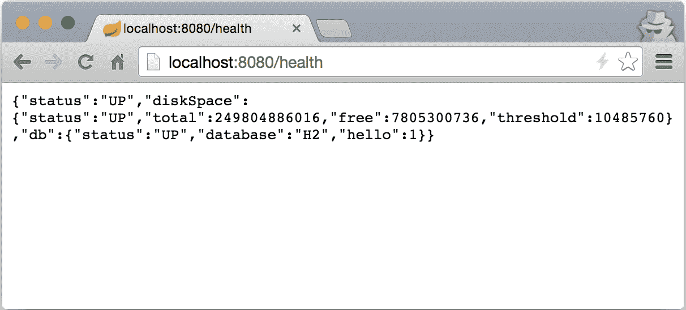

4.  添加了`actuator`依赖项并配置了详细的`/health`端点后，我们现在可以在应用上添加并执行各种监控功能。让我们继续，通过向位于项目根目录下的`build.gradle`文件添加一个指令，用一些数据填充`/info`端点，其内容如下:

```java
springBoot { 
    buildInfo { 
        properties { 
            additional = [ 
                'description' : project.description 
            ] 
        } 
    } 
} 

```

5.  接下来，我们将在项目的根目录下创建一个名为`gradle.properties`的新属性文件，其内容如下:

```java
version=0.0.1-SNAPSHOT 
description=BookPub Catalog Application
```

6.  我们还将把`rootProject.name='BookPub-ch7'`添加到项目根目录下的`settings.gradle`文件中。
7.  现在，让我们通过执行`./gradlew clean bootRun`来启动我们的应用，然后我们可以通过打开浏览器并转到`http://localhost:8080/actuator/info`来访问新可用的`/info`端点，以查看新端点的运行情况，如下所示:

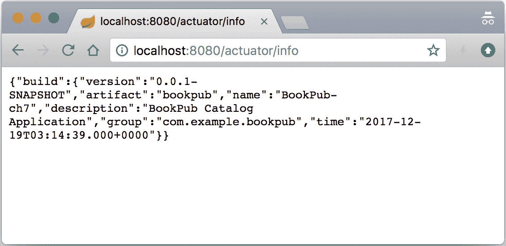

8.  既然我们已经掌握了如何工作的诀窍，那么让我们继续创建我们的自定义健康指示器，它可以通过`/health`端点访问，以便报告我们每个存储库的条目的计数状态。如果它们大于或等于零，我们就是`UP`，否则我们真的不确定发生了什么。显然，如果发生了异常，我们将报告`DOWN`。让我们从放松`getRepositoryName(...)`方法可见性开始，从位于我们项目根目录下`db-count-starter/src/main/java/com/example/bookpubstarter/dbcount`目录中的`DbCountRunner.java`文件中的`private`到`protected`。
9.  接下来，我们将把相同的依赖项添加到项目根目录下的`db-count-starter`目录下的`build.gradle`文件中的`compile("org.springframework.boot:spring-boot-starter-actuator")`库。

10.  现在，我们将在项目根目录下的`db-count-starter/src/main/java/com/example/bookpubstarter/dbcount`目录中创建一个名为`DbCountHealthIndicator.java`的新文件，其内容如下:

```java
public class DbCountHealthIndicator implements HealthIndicator { 
    private CrudRepository repository; 

    public DbCountHealthIndicator(CrudRepository repository) { 
        this.repository = repository; 
    } 

    @Override 
    public Health health() { 
        try { 
            long count = repository.count(); 
            if (count >= 0) { 
                return Health.up().withDetail("count", 
                count).build(); 
            } else { 
                return Health.unknown().withDetail("count",  
                count).build(); 
            } 
        } catch (Exception e) { 
            return Health.down(e).build(); 
        } 
    } 
} 
```

11.  接下来，我们将用以下内容修改位于我们项目根目录下的`db-count starter/src/main/java/com/example/bookpubstarter/dbcount`目录中的`EnableDbCounting.java`文件中的`@Import`注释:

```java
@Import({DbCountAutoConfiguration.class, 
        HealthIndicatorAutoConfiguration.class})
```

12.  最后，为了自动注册我们的`HealthIndicator`类，我们将用以下内容增强位于我们项目根目录下的`db-count-starter/src/main/java/com/example/bookpubstarter/dbcount`目录中的`DbCountAutoConfiguration.java`文件:

```java
@Autowired 
private HealthAggregator healthAggregator; 
@Bean 
public HealthIndicator dbCountHealthIndicator(Collection<CrudRepository> repositories) { 
    CompositeHealthIndicator compositeHealthIndicator = new 
      CompositeHealthIndicator(healthAggregator); 
    for (CrudRepository repository : repositories) { 
        String name = DbCountRunner.getRepositoryName
         (repository.getClass()); 
        compositeHealthIndicator.addHealthIndicator(name, new  
          DbCountHealthIndicator(repository)); 
    } 
    return compositeHealthIndicator; 
} 
```

13.  因此，让我们通过执行`./gradlew clean bootRun`命令行来启动我们的应用，然后我们可以通过打开浏览器并转到`http://localhost:8080/actuator/health`来访问`/health`端点，以查看我们新的`HealthIndicator`类的运行情况，如下所示:

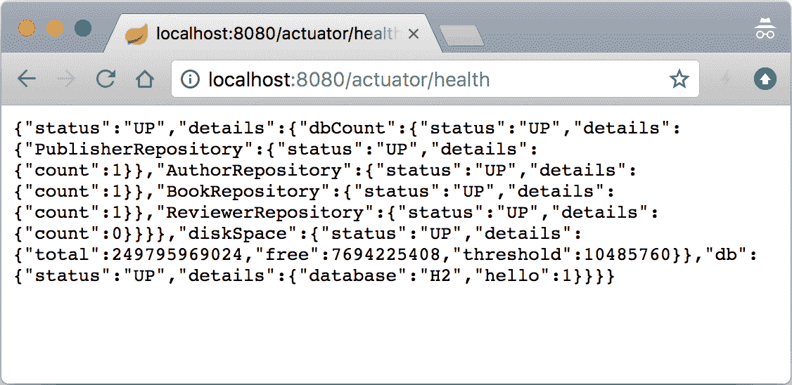

# 它是如何工作的...

Spring Boot 执行器启动器增加了许多重要的特性，可以洞察应用的运行时状态。该库包含许多自动配置，可以添加和配置各种端点来访问运行时监控数据和应用的健康状况。这些端点都共享一个公共的上下文路径:`/actuator`。为了公开除了`/info`和`/health`之外的任何其他端点，我们需要通过设置`management.endpoints.web.exposure.include=*`属性来显式公开它们。当该值设置为`*`时，它将暴露所有的端点。以下端点有助于我们深入了解应用运行时的状态和配置:

*   `/env`:这个端点使我们能够向应用查询所有的环境变量，应用可以通过环境实现访问这些变量，我们在前面已经看到了。当您需要调试某个特定问题并想知道任何给定配置属性的值时，这非常有用。如果我们通过转到`http://localhost:8080/actuator/env`来访问端点，我们将看到许多不同的配置部分，例如，类路径资源`[tomcat.https.properties]`、`applicationConfig: [classpath:/application.properties]`、`commonsConfig`、`systemEnvironment`、`systemProperties`等等。它们都代表环境中可用的单个`PropertySource`实现的一个实例，根据它们在层次结构中的位置，可能用于也可能不用于在运行时提供值解析。为了准确地找出哪个条目用于解析特定的值，例如对于`book.count.rate`属性，我们可以通过转到`http://localhost:8080/actuator/env/book.counter.rate` URL 来查询它。默认情况下，结果应该是 10，000，当然，除非通过系统环境或命令行参数设置了不同的值作为替代。如果您真的想深入研究代码，那么`EnvironmentEndpoint`类负责处理该功能背后的逻辑。
*   `/configprops`:这个端点让您能够深入了解各种配置属性对象的设置，比如我们的`WebConfiguration.TomcatSslConnectorProperties` starter。它与`/env`端点略有不同，因为它提供了对配置对象绑定的洞察。如果我们打开浏览器转到`http://localhost:8080/actuator/configprops`并搜索`custom.tomcat.https`，我们将看到用于配置`TomcatSslConnector`的配置属性对象的条目，它是由 Spring Boot 自动填充并绑定给我们的。
*   `/conditions`:这个端点作为基于网络的自动配置报告的模拟，我们在[第 4 章](4.html)、*编写定制的 Spring Boot 启动器*中看到过。这样，我们可以在任何时候使用浏览器获得报告，而不必启动带有特定标志的应用来打印报告。
*   `/beans`:这个端点被设计为列出所有由 Spring Boot 创建的、在应用上下文中可用的 bean。
*   `/mappings`:这个端点公开了应用支持的所有 URL 映射的列表，以及对`HandlerMapping` bean 实现的引用。这对于回答特定 URL 将被路由到哪里的问题非常有用。试着去`http://localhost:8080/actuator/mappings`看看我们的应用可以处理的所有路线的列表。
*   `/threaddump`:这个端点允许从正在运行的应用中提取线程转储信息。当试图诊断潜在的线程死锁时，这非常有用。
*   `/heapdump`:这个端点类似于`/dump`，除了它产生堆转储信息。
*   `/info`:这个端点显示了我们添加的基本描述和应用信息，我们已经看到了这一点，所以我们现在应该很熟悉了。构建工具中的良好支持使我们能够在我们的`build.gradle`配置中配置额外的或替换现有的值，然后这些值将被传播给`/info`端点使用。此外，在访问`/info`端点时，将以`info.`开头的`application.properties`文件中定义的任何属性都将显示出来，因此您肯定不仅限于`build.gradle`配置。在构建各种自动化发现和监控工具时，配置这个特定的端点以返回相关的信息会非常有帮助，因为这是以良好的 JSON RESTful API 的形式公开特定于应用的信息的一种很好的方式。
*   `/actuator`:这个端点以一种**超文本应用语言** ( **HAL** )的风格为所有可用的执行器端点提供了一个 JSON 格式的链接列表。
*   `/health`:该端点提供关于一般应用健康状态的信息，以及各个组件的详细故障和健康状态。
*   `/metrics`:这个端点给出了度量子系统发出的所有不同数据点的概述。您可以通过浏览器中的`http://localhost:8080/actuator/metrics` URL 来访问它。我们将在下一个菜谱中更详细地介绍这一点。

现在，我们已经大致了解了 Spring Boot 执行器为我们提供了什么，我们可以继续看一看让我们的自定义`HealthIndicator`类工作的细节，以及 Spring Boot 的整个健康监控子系统是如何工作的。

如您所见，让基本的`HealthIndicator`接口工作非常容易；我们所要做的就是创建一个实现类，它将在调用`health()`方法时返回一个`Health`对象。你所要做的就是将`HealthIndicator`类的实例公开为`@Bean`，以便 Spring Boot 获取它并将其添加到`/health`端点。

在我们的例子中，我们更进一步，因为我们必须处理为每个`CrudRepository`实例创建`HealthIndicator`的需求。为了完成这个任务，我们创建了一个`CompositeHealthIndicator`的实例，并为每个`CrudRepository`添加了所有`DbHealthIndicator`的实例。然后我们将其返回为`@Bean`，这是 Spring Boot 用来表示健康状态的。作为一个组合，它保留了内部层次结构，从返回的表示健康状态的 JSON 数据中可以明显看出这一点。我们还添加了一些额外的数据元素来提供条目计数的指示以及每个特定存储库的名称，以便我们能够区分它们。

看着代码，您可能会想:我们连接的这个`HealthAggregator`实例是什么？我们需要一个`HealthAggregator`实例的原因是因为`CompositeHealthIndicator`需要知道如何决定所有嵌套的`HeathIndicators`的内部组成是否代表整体健康状况的好坏。想象所有的存储库，除了一个，都返回`UP`，但是有一个是`DOWN`。这是什么意思？综合指标作为一个整体是否健康，或者它是否也应该报告`DOWN`,因为一个内部存储库有问题？

默认情况下，Spring Boot 已经创建并使用了`HealthAggregator`的一个实例，所以我们只是自动连接了它，并在我们的用例中使用了它。我们确实必须显式添加`HealthIndicatorAutoConfiguration`和`MetricsDropwizardAutoConfiguration`类的导入，以便在对`DataJpaTest`和`WebMvcTest`进行切片测试时满足 bean 依赖性，因为它们只是部分地实例化了上下文，并且缺少执行器自动配置。

尽管默认实现是一个`OrderedHealthAggregator`实例，它只是收集所有内部状态响应，并从`DOWN`、`OUT_OF_SERVICE`、`UP`和`UNKNOWN`中选择优先级最低的一个，但并不总是这样。例如，如果复合指标由冗余服务连接的指标组成，只要至少有一个连接是健康的，您的组合结果就可能是`UP`。创建一个定制的`HealthAggregator`界面非常容易；你所要做的就是扩展`AbstractHealthAggregator`或者实现一个`HealthAggregator`接口本身。

# 配置管理上下文

开箱即用的 Spring Boot 执行器在主应用上下文中创建了一组管理端点和支持 beans，这些端点在配置了`server.port`的 HTTP 端口上可用。然而，在某些情况下，出于安全或隔离的原因，我们会希望将主应用上下文与管理上下文分开，或者在不同于主应用的端口上公开管理端点。

Spring Boot 为我们提供了为管理 bean 配置单独的子应用上下文的能力，这将从主应用上下文继承一切，但也允许定义只对管理功能可用的 bean。这同样适用于在不同的端口上公开端点，甚至使用不同的连接器安全性，这样主应用可以使用 SSL，但是管理端点可以使用普通的 HTTP 访问。

# 怎么做...

让我们想象一下，不管出于什么原因，我们希望将 JSON 转换器改为使用`SNAKE_CASE`(所有小写字母用下划线分隔单词)输出字段名。

1.  首先，让我们创建一个类来保存我们对位于项目根目录下的`src/main/java/com/example/bookpub`目录中名为`ManagementConfiguration.java`的管理上下文的配置，其内容如下:

```java
@ManagementContextConfiguration 
public class ManagementConfiguration  
       implements WebMvcConfigurer { 
  @Override 
  public void configureMessageConverters( 
              List<HttpMessageConverter<?>> converters) { 
    HttpMessageConverter c = new 
     MappingJackson2HttpMessageConverter( 
        Jackson2ObjectMapperBuilder.json(). 
        propertyNamingStrategy(PropertyNamingStrategy.SNAKE_CAS). 
        build() 
        ); 
    converters.add(c); 
  } 
} 
```

2.  我们还需要将这个类添加到项目根目录下的`src/main/resources/META-INF`目录中的`spring.factories`中，内容如下:

```java
org.springframework.boot.actuate.autoconfigure.web.ManagementContextConfiguration=com.example.bookpub.ManagementConfiguration 
```

3.  为了避免主应用上下文的组件扫描检测到我们的配置，我们需要通过将以下内容添加到位于项目根目录下的`src/main/java/com/example/bookpub`目录中的`BookPubApplication.java`来排除它:

```java
@ComponentScan(excludeFilters =  
    @ComponentScan.Filter( 
        type = FilterType.ANNOTATION,  
        classes = ManagementContextConfiguration.class 
    ) 
) 
```

4.  为了有一个单独的管理上下文，我们需要使用不同的端口来启动它，所以让我们用以下内容来修改位于项目根目录下的`src/main/resources`目录中的`application.properties`:

```java
management.server.port=8081 
management.endpoints.web.exposure.include=*
```

5.  最后，让我们通过执行`./gradlew clean bootRun`来启动我们的应用，然后我们可以通过打开浏览器并转到`http://localhost:8081/actuator/threaddump`来访问`/threaddump`端点，以查看我们的新配置发生了什么。返回的 JSON 的字段名应该都是小写的，单词之间应该用下划线分隔，或者用所谓的`SNAKE_CASE`分隔。或者，通过转到`http://localhost:8080/books/978-1-78528-415-1`端点，我们应该会继续看到`LOWER_CAMEL_CASE`格式的 JSON 字段名。

# 它是如何工作的...

Spring Boot 认识到有许多原因，它需要能够为管理端点和其他执行器组件的工作方式提供单独的配置，这不同于主应用。这种配置的第一级可以通过设置无数直观地以`management.*`开始的可用属性来实现。我们使用了一个这样的属性`management.server.port`，将管理接口的端口设置为`8081`。我们还可以设置 SSL 配置、安全设置或网络 IP 接口地址等内容来绑定侦听器。我们还能够通过设置相应的属性来配置每个单独的`actuator`端点，这些属性以`management.endpoint.<name>.*`开始，并根据特定的端点目标有各种设置。

出于安全原因，各种管理端点公开的数据，尤其是来自敏感端点(如`/health`、`/env`等)的数据，对于外部的恶意人员来说可能非常有利可图。为了防止这种情况发生，Spring Boot 为我们提供了配置的能力，如果我们希望端点通过`management.endpoint.<name>.enabled=false`可用。我们可以通过设置一个适当的`management.endpoint<name>.enabled=false`属性，或者使用`management.endpoints.web.exposure.exclude=<name>`告诉 Spring Boot 是否应该启用这个端点，但是不要通过 WEB HTTP API 访问方法公开，来指定我们想要禁用哪个单独的端点。

或者，我们可以设置`management.server.port=-1`来禁用这些端点的 HTTP 公开，或者使用不同的端口号，以便让管理端点和活动服务位于不同的端口上。如果我们想只通过本地主机来启用访问，我们可以通过配置`management.server.address=127.0.0.1`来阻止外部访问来实现。甚至上下文 URL 路径也可以通过`management.server.context-path=/admin`配置成其他东西，比如说`/admin`。这样，为了访问一个`/health`端点，我们将转到`http://127.0.0.1/admin/health`而不是默认的`/actuator`上下文路径。如果您想要通过防火墙规则来控制和限制访问，这可能会很有用，因此您可以添加一个过滤器来阻止来自外部的所有应用对任何内容的外部访问。添加了 Spring Security 之后，还可以配置一个身份验证，要求用户登录才能访问端点。

在使用属性控制行为还不够的情况下，Spring Boot 提供了一种机制，通过使用`spring.factories`和附带的`ManagementContextConfiguration`注释来提供可选的应用上下文配置。这使我们能够告诉 Spring Boot 在创建管理上下文时应该自动加载哪些配置。该注释的预期用途是将配置放在主应用代码之外的一个单独的、可共享的依赖库中。

在我们的例子中，因为我们把它放在同一个代码库中(为了简单起见)，我们必须做一个额外的步骤，在`BookPubApplication.java`文件中定义排除过滤器，以便在设置主应用时从组件扫描中排除`ManagementContextConfiguration`类。我们必须这样做的原因很简单——如果我们查看一下`ManagementContextConfiguration`注释定义，我们会发现它是一个元注释，其中包含了`@Configuration`注释。这意味着，当我们的主应用被配置时，组件扫描将自动检测应用代码的类路径树中用`@Configuration`标注的所有类，同样，它也将把所有标有`ManagementContextConfiguration`的配置放到主上下文中。我们已经避免了使用排除过滤器。或者，更好的方法是使用不同的包层次结构将这些配置放在单独的库中，这将阻止组件扫描获取它们，但是自动配置仍然可以工作，因为`org.springframework.boot.actuate.autoconfigure.web.ManagementContextConfiguration`的`spring.factories`条目告诉 Spring Boot 自动将这些配置添加到管理上下文中。

为了将管理上下文从主应用中分离出来，有必要使用`management.server.port`属性将其配置为在单独的端口上运行。如果没有此设置，所有对象都将使用共享的应用上下文。

# 发射度量

前一个秘籍概述了 Spring Boot 执行器提供的功能。我们尝试了不同的管理端点，如`/info`和`/health`，甚至创建了我们自己的健康指标来添加到默认设置中。然而，除了健康状态之外，作为开发人员和运营人员，我们还希望能够持续看到和监控许多事情，仅仅知道上行链路正常工作是不够的。我们还希望看到打开会话的数量、对应用的并发请求、延迟等等。在本菜谱中，您将了解 Spring Boot 的指标报告工具，以及如何添加我们自己的指标和一些快速简单的可视化方法。

# 做好准备

为了帮助我们更好地可视化指标，我们将使用一个伟大的开源项目，`spring-boot-admin`，位于[https://github.com/codecentric/spring-boot-admin](https://github.com/codecentric/spring-boot-admin)。它在 Spring Boot 执行器的基础上提供了一个简单的 web UI，可以更好地查看各种数据。

我们将使用来自[https://github . com/code centric/spring-boot-admin # server-application](https://github.com/codecentric/spring-boot-admin#server-application)的指令，通过执行以下简单步骤，在 Gradle 中创建一个简单的管理应用:

1.  转到 [start.spring.io](http://start.spring.io) 并使用以下字段创建一个新的应用模板:

*   生成一个:Gradle 项目
*   用:Java
*   Spring Boot: 2.0.0(快照)
*   组:`org.sample.admin`
*   神器:`spring-boot-admin-web`
*   名称:`Spring Boot Admin Web`
*   描述:`Spring Boot Admin Web Application`
*   包名:`org.sample.admin`
*   包装:广口瓶
*   Java 版本:8

2.  选择“搜索从属项”下的“执行器”选项
3.  单击 Generate Project alt +下载应用模板档案
4.  从您选择的目录中提取内容
5.  在提取的目录中，执行`gradle wrapper`命令行来生成 gradlew 脚本
6.  在`build.gradle`文件中，向`dependencies`块添加以下依赖关系:

```java
compile("de.codecentric:spring-boot-admin-server:2.0.0-SNAPSHOT") 
compile("de.codecentric:spring-boot-admin-server-ui:2.0.0-SNAPSHOT ") 
```

7.  我们还需要用一个引用来更新`repositories`块，以使用`snapshots`存储库(在撰写本文时，SBA 还没有发布):

```java
maven { url "https://oss.sonatype.org/content/repositories/snapshots/" } 
```

8.  打开位于`src/main/java/spring-boot-admin-web`目录中的`SpringBootAdminWebApplication.java`文件，并将以下注释添加到`SpringBootAdminWebApplication`类中:

```java
@SpringBootApplication 
@EnableAdminServer 
public class SpringBootAdminWebApplication { 

  public static void main(String[] args) { 
    SpringApplication.run( 
                      SpringBootAdminWebApplication.class, 
                      args); 
  } 
} 
```

9.  打开位于`src/main/resources`目录下的`application.properties`文件，添加以下设置:

```java
server.port: 8090 
spring.application.name: Spring Boot Admin Web 
spring.cloud.config.enabled: false 
spring.jackson.serialization.indent_output: true
```

10.  我们现在准备通过运行`./gradlew bootRun`来启动我们的管理 Web 控制台，并打开浏览器到`http://localhost:8090`来查看以下输出:

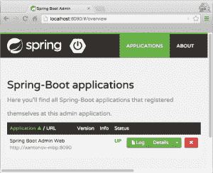

# 怎么做...

1.  随着**管理网站**的启动和运行，我们现在准备开始向我们的`BookPub`应用添加各种指标。让我们像在`HealthIndicators`中一样公开关于我们的数据存储库的相同信息，但是这一次，我们将计数数据公开为一个度量。我们将继续向我们的`db-count-starter`子项目添加代码。因此，让我们在我们项目的根目录下的`db-count-starter/src/main/java/com/example/bookpubstarter/dbcount`目录中创建一个名为`DbCountMetrics.java`的新文件，其内容如下:

```java
public class DbCountMetrics implements MeterBinder { 
    private Collection<CrudRepository> repositories; 

    public DbCountMetrics(Collection<CrudRepository> repositories) 
    { 
        this.repositories = repositories; 
    } 

    @Override 
    public void bindTo(MeterRegistry registry) { 
        for (CrudRepository repository : repositories) { 
            String name = DbCountRunner.getRepositoryName
              (repository.getClass()); 
            String metricName = "counter.datasource."  
                              + name; 
            Gauge.builder(metricName, repository, 
                          CrudRepository::count) 
                 .tags("name", name) 
                 .description("The number of entries in "  
                             + name + "repository") 
                 .register(registry); 
        } 
    } 
} 
```

2.  接下来，对于`DbCountMetrics`的自动注册，我们将用以下内容增强位于我们项目根目录下的`db-count-starter/src/main/java/com/example/bookpubstarter/dbcount`目录中的`DbCountAutoConfiguration.java`:

```java
@Bean 
public DbCountMetrics
  dbCountMetrics(Collection<CrudRepository> repositories) { 
    return new DbCountMetrics(repositories); 
} 
```

3.  为了让线程转储正确地显示在 Spring Boot 管理 UI 中，我们需要将我们的 JSON 转换器从`SNAKE_CASE`更改为`LOWER_CAMEL_CASE`，方法是将位于项目根目录下`src/main/java/com/example/bookpub`目录中的`ManagementConfiguration.java`更改为以下内容:

```java
propertyNamingStrategy( 
    PropertyNamingStrategy.LOWER_CAMEL_CASE 
)
```

4.  因此，让我们通过执行`./gradlew clean bootRun`来启动我们的应用，然后我们可以通过打开浏览器并转到`http://localhost:8081/actuator/metrics`来访问`/metrics`端点，以查看添加到现有指标列表中的新的`DbCountMetrics`类，如下所示:


5.  我们的下一步是让我们的应用出现在我们之前创建的 Spring Boot 管理网站上。为了实现这一点，我们需要在项目根目录下的目录中添加对`compile("de.codecentric:spring-boot-admin-starter-client:2.0.0-SNAPSHOT")`库到`build.gradle`的依赖。
6.  此外，位于我们项目根目录下的`src/main/resources`目录中的`application.properties`需要使用以下条目进行增强:

```java
spring.application.name=BookPub Catalog Application 
server.port=8080 
spring.boot.admin.client.url=http://localhost:8090
```

7.  再一次，让我们通过执行`./gradlew clean bootRun`来启动我们的应用，如果我们现在通过将浏览器定向到`http://localhost:8090`来进入 Spring Boot 管理网站，我们应该会看到一个名为`BookPub Catalog Application`的应用新条目出现在列表中。如果我们单击右侧的“Details”按钮并向下滚动到“Health”部分，我们将看到我们的自定义健康指标以及以更美观的分层条目形式报告的其他健康指标，如下所示:

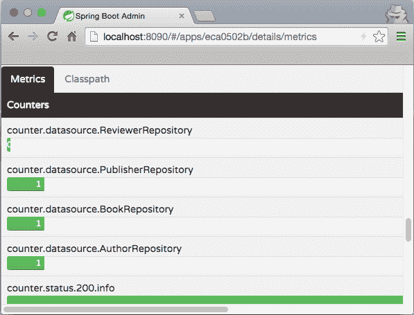

# 它是如何工作的...

在我们深入研究创建和发布指标的细节之前，先简单介绍一下 Spring Boot 管理网站。这是一个简单的 web GUI，在后端，使用 Spring Boot 执行器所公开的相同端点，这一点我们在前面的菜谱中已经了解过。当我们点击管理网站中的各种链接时，数据从应用中提取出来，并以一种漂亮的图形方式显示出来——没有魔法！

除了添加客户端库依赖项之外，我们只需配置一些属性，就可以让我们的应用连接并注册到 Admin Web:

*   `spring.application.name=BookPub Catalog Application`:配置我们选择使用的应用的名称。也可以使用 Gradle 中的资源处理任务从`gradle.properties`中定义的描述属性中获取值。管理网站在显示应用列表时使用该值。
*   `spring.boot.admin.client.url=http://localhost:8090`:这配置了管理 Web 应用的位置，以便我们的应用知道去哪里注册自己。由于我们运行在端口`8080`上，我们选择配置管理 Web 来监听端口`8090`，但是可以根据需要选择任何端口。您可以通过访问[https://codecentric.github.io/spring-boot-admin/current/](https://codecentric.github.io/spring-boot-admin/current/)查看更多配置选项。

如果我们还想通过 UI 启用日志级别控制，我们将需要向我们的`compile("org.jolokia:jolokia-core:+")`构建依赖项添加一个 Jolokia JMX 库，并在项目根目录的`src/main/resources`目录中添加一个`logback.xml`文件，内容如下:

```java
<configuration> 
  <include 
     resource="org/springframework/boot/logging/logback/base.xml"/> 
  <jmxConfigurator/>  
</configuration> 
```

Spring Boot 的度量工具非常强大且可扩展，提供了许多不同的方法来发布和使用度量。从 Spring Boot 2.0 开始，`Micrometer.io`库被用于提供非常全面的监控解决方案。开箱即用，Spring Boot 已经配置了许多数据指标来监控系统资源，如堆内存、线程计数、系统正常运行时间和许多其他指标，以及数据库使用和 HTTP 会话计数。MVC 端点也可以测量请求延迟，以毫秒为单位，以及每个端点请求状态的计数器。

各种度量标准，比如计量器、计数器、计时器等等，都是通过 Spring Boot 在运行时提供的`MeterRegistry`实现发出的。注册表可以很容易地自动连接到任何 Spring 管理的对象中，并用于发出指标。

例如，我们可以很容易地计算一个特定方法被调用的次数。我们所要做的就是在创建过程中自动将一个`MeterRegistry`的实例连接到我们的对象中，并在方法的开头放置下面一行代码:

```java
meterRegistry.counter("objectName.methodName.invoked").increment();
```

每次调用该方法时，特定的指标计数都会增加。

这种方法将为我们提供可以增加的计数，但是如果我们想要测量延迟或任何其他任意值，我们将需要使用`Gauge`来提交我们的指标。为了测量我们的方法执行需要多长时间，我们可以使用`MeterRegistry`并在方法开始时记录时间:

```java
long start = System.currentTimeMillis();
```

然后，我们将放置我们的代码，并在返回之前再次捕获时间:

```java
long end = System.currentTimeMillis();.
```

然后，我们将发出度量`meterRegistry.gauge("objectName.methodName.latency", end - start);`，它将更新最后一个。用于计时目的的`gauge`是非常初级的，`MeterRegistry`实际上提供了一种特殊类型的计时器。例如，计时器提供了包装 runnable 或 callable lambdas 并自动计时执行的能力。使用计时器而不是`Gauge`的另一个好处是计时器既记录了事件计数，也记录了执行每个事件所花费的等待时间。

`MeterRegistry`实现涵盖了大多数简单的用例，当我们在自己的代码中操作时非常方便，并且可以灵活地在需要的地方添加它们。然而，情况并不总是这样，在这些情况下，我们需要通过创建一个定制的`MeterBinder`实现来包装我们想要监控的东西。在我们的例子中，我们将使用它来公开数据库中每个存储库的计数，因为我们不能将任何监控代码插入到`CrudRepository`代理实现中。

每当`MeterRegistry`实现不能提供足够的灵活性时，例如，当需要在像`Gauge`这样的仪表中包装对象时，大多数仪表实现都提供流体构建器来获得更大的灵活性。在我们的例子中，为了包装存储库指标，我们使用了一个`Gauge`流体构建器来构建`Gauge`:

```java
Gauge.builder(metricName, repository, CrudRepository::count)
```

主构建器方法采用以下三个参数:

*   `metricName`:指定用于唯一标识此指标的名称
*   `repository`:这提供了一个对象，我们调用该对象的方法，该方法将返回一个数值，这个数值将由`gauge`报告
*   `CrudRepository::count`:这是应该在`repository`对象上调用的方法，以获得条目的当前计数

这使我们能够构建灵活的包装器，因为我们所要做的就是提供一个对象，该对象将公开必要的数值和对一个函数的函数引用，该函数应该在实例上调用以在`gauge`评估期间获得该值。

用于导出仪表的`MeterBinder`接口只定义了一个方法
`void bindTo(MeterRegistry);`，实现者需要用被监控对象的定义对其进行编码。实现类需要以`@Bean`的形式公开，在应用初始化过程中它会被自动拾取和处理。假设一个人实际上用提供的`MeterRegistry`实现注册了创建的`Meter`实例，通常通过调用`.builder(...).register(registry)`终止流体构建器的链，度量将通过`MetricsEndpoint`公开，这将在每次调用`/metrics`致动器时公开在注册表中注册的所有仪表。

值得一提的是，我们已经在主应用上下文中创建了`MeterBinder`和`HealthIndicator`bean，而不是在管理上下文中。原因是，即使数据是通过管理端点公开的，端点 beans(如`MetricsEndpoint`)是在主应用上下文中定义的，因此期望所有其他自动连接的依赖项也在那里定义。

这种方法是安全的，因为为了访问信息，需要通过在管理上下文中创建的`WebMvcEndpointHandlerMapping`实现外观，并使用主应用上下文中的委托端点。看一看`MetricsEndpoint`类和相应的`@Endpoint`注释来查看细节。

# 通过 JMX 监控 Spring Boot

在当今时代，RESTful HTTP JSON 服务是一种事实上的数据访问方式，但这不是唯一的方式。另一种相当流行和常见的实时管理系统的方式是通过 JMX。好消息是，Spring Boot 已经为通过 JMX 公开管理端点提供了与通过 HTTP 相同的支持级别。实际上，这些是完全相同的端点；它们只是包装在 MBean 容器周围。

在这个菜谱中，我们将了解如何像通过 HTTP 一样通过 JMX 检索相同的信息，以及如何公开一些 MBeans，这些 MBeans 是由第三方库使用 Jolokia JMX 库通过 HTTP 提供的。

# 做好准备

如果您在前面的菜谱中还没有这样做，那么将 Jolokia JMX 库添加到我们的`compile("org.jolokia:jolokia-core:+")`构建依赖项，并将`management.jolokia.enabled=true`属性添加到`application.properties`，因为我们将需要它们通过 HTTP 来公开 MBeans。

# 怎么做...

1.  添加 Jolokia JMX 依赖项后，我们需要做的就是通过执行`./gradlew clean bootRun`构建并启动我们的应用，现在我们可以简单地启动 jConsole 来查看在`org.springframework.boot`域下公开的各种端点:

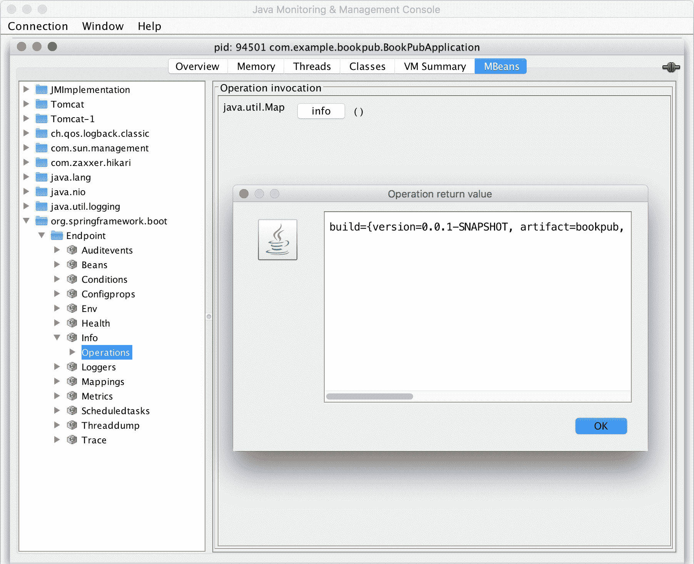

2.  将 Jolokia JMX 库添加到类路径后，Spring Boot 还支持使用`/jolokia`端点通过 HTTP API 访问所有注册的 MBeans。为了找出我们的 Tomcat HTTP 端口`8080`连接器的`maxThreads`设置，我们可以通过选择`Tomcat:type=ThreadPool,name="http-nio-8080"` MBean 上的`maxThreads`属性来使用 jConsole 进行查找，以获得`200`的值，或者我们可以通过打开浏览器并转到`http://localhost:8081/actuator/jolokia/read/Tomcat:type=ThreadPool,name=%22http-nio-8080%22/maxThreads`来使用 Jolokia JMX HTTP，我们应该会看到下面的 JSON 响应:

```java
{"request": 
  {"mbean":"Tomcat:name="http-nio-8080",type=ThreadPool", 
   "attribute":"maxThreads", 
   "type":"read" 
  }, 
 "value":200,"timestamp":1436740537,"status":200}
```

# 它是如何工作的...

默认情况下，将 Spring Boot 执行器添加到应用中时，会启用所有端点和管理服务。这也包括 JMX 访问。如果出于某种原因，想要通过 JMX 禁用特定端点的公开，这可以通过添加`management.endpoints.jmx.exclude=<id>`来轻松配置，或者为了禁用所有 Spring MBeans 的导出，我们可以在`application.properties`中配置`spring.jmx.enabled=false`设置。

类路径中 Jolokia 库的存在触发了 Spring Boot `JolokiaManagementContextConfiguration`，它将自动配置`ServletRegistrationBean`接受`/jolokia`执行器路径上的请求。还可以通过属性集`management.endpoint.jolokia.config.*`设置各种特定于 Jolokia 的配置选项。完整列表可在[https://jolo KIA . org/reference/html/agents . html # agent-war-init-params](https://jolokia.org/reference/html/agents.html#agent-war-init-params)获得。如果你想使用 Jolokia，但想手动设置，我们可以通过在`application.properties`中配置一个`management.endpoint.jolokia.enabled=false`属性设置来告诉 Spring Boot 忽略它的存在。

# 通过 SSHd Shell 管理 Spring Boot 并编写定制的远程 Shell 命令

你们中的一些人可能会回忆起过去的美好时光，那时所有的管理都是通过 SSH 直接在机器上完成的，在这里，人们拥有完全的灵活性和控制权，甚至可以使用 SSH 连接到管理端口，将任何需要的更改直接应用到正在运行的应用。尽管 Spring Boot 在 2.0 版本中移除了与崩溃 Java Shell 的原生集成，但有一个开源项目`sshd-shell-spring-boot`将这种能力带了回来。

对于这个秘籍，我们将使用我们在本章前面创建的健康指示器和管理端点。我们将通过 SSH 控制台访问展示相同的功能。

# 怎么做...

1.  让 SSHd Shell 工作的第一步是向我们的`build.gradle`文件添加必要的依赖项启动器，如下所示:

```java
dependencies { 
    ... 
    compile("org.springframework.boot:spring-boot-starter-actuator") 
    compile("io.github.anand1st:sshd-shell-spring-boot-starter:3.2.1") 
    compile("de.codecentric:spring-boot-admin-starter-client:2.0.0-SNAPSHOT") 
    compile("org.jolokia:jolokia-core:+") 
    ... 
} 
```

2.  我们还需要通过在位于项目根目录下的`src/main/resources`目录中的`application.properties`中设置以下属性来显式启用它。它需要使用以下条目进行增强:

```java
sshd.shell.enabled=true 
management.endpoint.shutdown.enabled=true
```

3.  现在，让我们通过执行`./gradlew clean bootRun`来启动我们的应用，然后通过 SSH 执行`ssh -p 8022 admin@localhost`来连接它。
4.  系统将提示我们输入密码，因此让我们在应用启动日志中找到自动生成的哈希密钥，如下所示:

```java
********** User password not set. Use following password to login: 
8f20cf10-7d67-42ac-99e4-3a4a77ca6c5f ********** 
```

5.  如果密码输入正确，我们将收到以下欢迎提示:

```java
Enter 'help' for a list of supported commands 
app> 
```

6.  接下来，我们将通过键入 health 调用现有的`/health`端点，我们应该会得到以下结果:

```java
    {
      "status" : "UP",
      "details" : {
        "dbCount" : {
          "status" : "UP",
          "details" : {
            "ReviewerRepository" : {
              ...
            },
            "PublisherRepository" : {
              ...
            },
            "AuthorRepository" : {
              ...
            },
            "BookRepository" : {
              ...
            }
          }
        },
        "diskSpace" : {
          "status" : "UP",
          "details" : {
            "total" : 249795969024,
            "free" : 14219882496,
            "threshold" : 10485760
          }
        },
        "db" : {
          "status" : "UP", 
          "details" : { "database" : "H2", "hello" : 1 }
        }
      }
    }

```

7.  键入`help`将显示所有现有命令的列表，因此您可以使用其中一些命令来查看它们的作用，然后我们将继续添加我们自己的 SSHd Shell 命令，这将使我们能够通过命令行向系统添加新的发布者。
8.  在我们项目的根目录下创建一个名为 commands 的新目录。
9.  在我们项目的根目录下的`src/main/java/com/example/bookpub/command`目录中添加一个名为`Publishers.java`的文件，内容如下:

```java
package com.example.bookpub.command;

import com.example.bookpub.entity.Publisher;
import com.example.bookpub.repository.PublisherRepository;
import org.springframework.beans.factory.annotation.Autowired;
import org.springframework.stereotype.Component;
import sshd.shell.springboot.autoconfiguration.SshdShellCommand;
import sshd.shell.springboot.console.ConsoleIO;

import java.util.HashMap;
import java.util.Map;

@Component
@SshdShellCommand(value = "publishers", description = "Publisher management. Type 'publishers' for supported subcommands")
public class PublishersCommand {
    @Autowired
    private PublisherRepository repository;

    @SshdShellCommand(value = "list", description = "List of publishers")
    public String list(String _arg_) {
        List list = new ArrayList();

        repository.findAll().forEach(publisher ->
            list.add(publisher);
        );

        return ConsoleIO.asJson(list);
    }

    @SshdShellCommand(value = "add", description = "Add a new publisher. Usage: publishers add <name>")
    public String add(String name) {
        Publisher publisher = new Publisher(name);
        try {
            publisher = repository.save(publisher);
            return ConsoleIO.asJson(publisher);
        } catch (Exception e) {
            return String.format("Unable to add new publisher named %s%n%s", name, e.getMessage());
        }
    }

    @SshdShellCommand(value = "remove", description = "Remove existing publisher. Usage: publishers remove <id>")
    public String remove(String id) {
        try {
            repository.deleteById(Long.parseLong(id));
            return ConsoleIO.asJson(String.format("Removed publisher %s", id));
        } catch (Exception e) {
            return String.format("Unable to remove publisher with id %s%n%s", id, e.getMessage());
        }
    }
} 

```

10.  构建完命令后，现在让我们通过执行`./gradlew clean bootRun`启动我们的应用，然后通过 SSH 执行`ssh -p 8022 admin@localhost`连接到它，并使用生成的密码散列登录。
11.  当我们键入 publishers 时，我们将看到所有可能命令的列表，如下所示:

```java
app> publishers 
Supported subcommand for publishers 
add       Add a new publisher. Usage: publishers add <name> 
list      List of publishers 
remove    Remove existing publisher. Usage: publishers remove <id>
```

12.  让我们通过键入`publishers add Fictitious Books`来添加一个发布者，我们应该会看到以下消息:

```java
{ 
  "id" : 2, 
  "name" : "Fictitious Books" 
} 
```

13.  如果我们现在键入出版商列表，我们将得到所有书籍的列表:

```java
[ { 
  "id" : 1, 
  "name" : "Packt" 
}, { 
  "id" : 2, 
  "name" : "Fictitious Books" 
} ] 
```

14.  删除发布者是一个简单的命令`publishers remove 2`，它应该用`"Removed publisher 2"`消息来响应。
15.  为了确认发布者确实已经离开，执行 publishers list，我们应该会看到以下输出:

```java
[ { 
  "id" : 1, 
  "name" : "Packt" 
} ] 
```

# 它是如何工作的...

SSHd Shell 与 Spring Boot 的集成为您提供了许多现成的命令。我们可以通过 HTTP 和 JMX 调用相同的管理端点。我们可以访问 JVM 信息，更改日志配置，甚至与 JMX 服务器和所有注册的 MBeans 进行交互。所有可能性的列表确实令人印象深刻，功能非常丰富，所以我肯定会建议您通过访问[https://github.com/anand1st/sshd-shell-spring-boot](https://github.com/anand1st/sshd-shell-spring-boot)来阅读 SSHd Shell 上的参考文档。

在 Spring Boot，人们期望任何用`@SshdShellCommand`注释的类都将被自动选取并注册为 SSHd Shell 命令。annotation 属性的值转换成主命令名。在我们的例子中，我们将 class annotation 属性值字段设置为`publishers`，这成为 SSH Shell 控制台中的顶级命令名。

如果命令包含子命令，如我们的 publishers 命令示例，那么，同样用`@SshdShellCommand`注释的类的方法被注册为主命令的子命令。如果一个类只有一个方法，当键入命令名时，它将自动成为给定类的唯一命令。如果我们希望多个子命令驻留在类命令中，就像我们对 publishers 所做的那样，那么每个转换成命令的方法都需要用`@SshdShellCommand`进行注释。

目前，SSHd Shell 框架有一个限制，即只能向命令传递一个属性参数，但是正在努力扩展这个功能。同时，建议使用 JSON 有效负载作为输入或输出与命令进行通信。

注释中包含以下属性:

*   `value`:该属性定义了命令或子命令的名称。尽管方法的名称不需要与命令的名称匹配，但保持两者同步是一个很好的习惯，这样可以使代码更具可读性。
*   `description`:该属性定义了调用`help`命令时显示的文本。这是一个很好的地方，可以与用户交流如何使用命令，它需要什么输入等等。在 Shell 中提供尽可能多的描述和文档是一个好主意，这样可以清楚地告诉用户需要做什么以及如何调用命令。手册页很棒，所以请保持文档一流。
*   `roles`:这个属性使我们能够定义一个关于谁被允许执行给定命令的安全约束。如果还使用了 Spring Security，SSHd Shell 提供了配置自定义或特定的`AuthenticationProvider`来处理用户认证和角色绑定的能力。例如，很容易将您的应用连接到公司的 LDAP 服务器，并允许开发人员使用他们的常规凭证，还可以根据特定组织的需要配置不同的角色访问控制。

可以使用帮助来查询每个命令的用法，或者在命令包含子命令的情况下，通过键入顶级命令的名称来查询。

虽然 SSHd Shell 附带了许多内置命令，但是人们可以轻松地添加定制命令，利用标准的 Spring / Spring Boot 编程风格，使用`@Autowired`和`@Component`注释来获得必要的依赖项，以便在应用启动生命周期中进行连接和自动配置。

SSHd Shell 还提供了一个很好的功能，支持通过管道(`|`)符号调用后处理器。目前的支持允许输出高亮显示`| h packt`，这将在输出中高亮显示单词`packt`，或者发送电子邮件响应输出`| m` `my@email.com`，这将通过电子邮件将命令的响应发送到指定的电子邮件地址，假设 **Spring Mail** 也已配置并且可用。

如果我们能够像在 Linux 中一样，将不同的命令链接在一起，以便在信息量变得难以承受时，帮助处理输出并过滤出必要的数据，那就太好了。假设我们的 publishers list 命令返回的不是`2`，而是`2000` publishers。从这个列表中，我们想找到以`Pa`开头的那些。

尽管 SSHd Shell 没有提供这种现成的功能，但它确实为我们提供了通过定义扩展`BaseUserInputProcessor`类的 beans 来实现我们自己的后处理器的能力。让我们创建一个支持过滤 JSON 响应的工具，类似于`jq`命令行实用程序的工作方式。

为了实现这一点，让我们在项目的根目录下的`src/main/java/com/example/bookpub/command`目录中创建另一个名为`JsonPathUserInputProcessor.java`的类，其内容如下:

```java
@Component 
@Order(3) 
public class JsonPathUserInputProcessor 
             extends BaseUserInputProcessor { 

    private final Pattern pattern = Pattern.compile("[\w\W]+\s?\|\s?jq (.+)"); 

    @Override 
    public Optional<UsageInfo> getUsageInfo() { 
        return Optional.of(new UsageInfo(Arrays.<UsageInfo.Row>asList( 
                new UsageInfo.Row("jq <arg>", "JSON Path Query <arg> in response output of command execution"), 
                new UsageInfo.Row("", "Example usage: help | jq $.<name>")))); 
    } 

    @Override 
    public Pattern getPattern() { 
        return pattern; 
    } 

    @Override 
    public void processUserInput(String userInput) throws   
      InterruptedException, ShellException{ 
        String[] part = splitAndValidateCommand(userInput, "\|", 2); 
        Matcher matcher = pattern.matcher(userInput); 
        Assert.isTrue(matcher.find(), "Unexpected error"); 
        String jsonQuery = matcher.group(1).trim(); 
        try { 
            String output = processCommands(part[0]); 
            Object response = JsonPath.read(output, jsonQuery); 
            ConsoleIO.writeJsonOutput(response); 
        } catch (Exception e) { 
            ConsoleIO.writeOutput(String.format("Unable to process 
            query %s%n%s", jsonQuery, e.getMessage())); 
        } 
    } 
} 
```

使用管道功能，我们可以通过以下方式轻松地将`publishers list`命令与`jq`命令链接起来:

```java
publishers list | jq $..[?(@.name =~ /Pa.*/i)]
```

在我们的示例中，这应该只返回一条记录，如下所示:

```java
[ {
    "id" : 1,
    "name" : "Packt"
} ]
```

虽然它不是一个成熟的管道功能，但输入处理器的使用允许添加排序、过滤和显示渲染等功能，这为模块化和重用常见行为提供了更大的灵活性。

SSHd Shell Spring Boot 集成提供了许多配置选项，允许我们禁用组件、配置身份验证设置、指定用户名、密码甚至密钥证书。例如，如果我们想要使用特定的用户名和密码，可以通过配置以下属性来实现:

```java
sshd.shell.username=remote
sshd.shell.password=shell

```

在真实的企业环境中，更常见的是使用共享密钥进行受限访问，这些可以使用`sshd.shell.publicKeyFile=<key path>`或`sshd.shell.hostKeyFile=<key path>`属性进行配置。或者，也可能是更好的方法，如前所述，使用自定义的`AuthenticationProvider`实现和 Spring Security 允许将认证机制集成到公司的认证系统中。

# 将测微计与石墨相结合

在本章前面，您已经了解了 Spring Boot 提供的监控功能。我们看到了编写定制的`HealthIndicators`，创建度量，以及使用`MeterRegistry`来发出数据的例子。简单的 Spring Boot 管理 Web 框架为我们提供了一些很好的图形用户界面来可视化数据，但所有这些指标都是即时的，没有长期保留和历史访问。不能够观察趋势，检测基线的偏差，并比较今天和上周不是一个很好的策略，特别是对于一个企业复杂的系统。我们都希望能够访问几周甚至几个月的时间序列数据，并在发生意外时设置警报和阈值。

这个秘籍将向我们介绍一个惊人的时间序列图形工具:石墨。石墨是两部分系统。它为数字时间序列数据提供存储，并提供以按需图形的形式呈现这些数据或者将图形数据公开为 JSON 流的服务。您将学习如何集成和配置 Spring 的 Micrometer monitoring framework 与 Graphite，以便将监控数据从 Spring Boot 应用发送到 Graphite，并使用 Graphite 对我们收集的不同统计数据进行可视化。

# 做好准备

Graphite 是一个用 Python 编写的应用，因此几乎可以在任何支持 Python 及其库的系统上运行。在任何给定的系统上安装 Graphite 有多种方式，从源代码编译，一直使用`pip`，到为各种 Linux 发行版预构建 rpm。

对于所有不同的安装策略，请看一下 http://graphite.readthedocs.org/en/latest/install.html 的 Graphite 文档。位于 https://gist.github.com/relaxdiego/7539911 的[，OS X 用户可以阅读到非常好的分步指南。](https://gist.github.com/relaxdiego/7539911)

为了达到这个秘籍的目的，我们将使用一个预制的 Docker 容器，里面装着石墨和它的对应物 Grafana。虽然 Docker 图像有许多包含 Graphite 和 Grafana 组合的各种预构建变体，但我们将使用来自[https://registry . hub . Docker . com/u/Alex mercer/Graphite-Grafana/](https://registry.hub.docker.com/u/alexmercer/graphite-grafana/)的一个，因为它包含所有正确的配置，使我们能够轻松快速地开始使用:

1.  第一步是下载所需的 Docker 容器映像。我们将通过执行`docker pull alexmercer/graphite-grafana`来做到这一点。容器大小约为 500 MB 因此，根据您的连接速度，下载可能需要几分钟时间。
2.  Graphite 和 Grafana 都将数据存储在数据库文件中。我们将需要创建外部目录，它们将驻留在容器之外，我们将通过 Docker 数据卷将它们连接到一个正在运行的实例。
    *   在系统中的任何地方为 Graphite 数据创建一个目录，例如在`<user_home>/data/graphite`中。
    *   为 Grafana 数据创建一个目录，例如在`<user_home>/data/grafana`中。
3.  在这个容器中，Graphite 数据将被保存到`/var/lib/graphite/storage/whisper`，而 Grafana 将其数据保存到`/usr/share/grafana/data`。因此，在启动容器时，我们将使用这些路径作为内部卷装载目的地。
4.  通过执行`docker run -v <user_home>/data/graphite:/var/lib/graphite/storage/whisper -v <user_home>/data/grafana:/usr/share/grafana/data -p 2003:2003 -p 3000:3000 -p 8888:80 -d alexmercer/graphite-grafana`运行容器。
    *   在 Docker 中，`-v`选项配置卷安装绑定。在我们的例子中，我们将外部的`<user_home>/data/graphite`目录配置为与容器中的`/var/lib/graphite/storage/whisper`目录引用相同。这同样适用于`<user_home>/data/grafana`映射。我们甚至可以在`<user_home>/data/graphite or data/grafana`目录中查看它们包含的子目录和文件。
    *   `-p`选项配置类似于目录卷的端口映射。在我们的示例中，我们将以下三个不同的端口映射到内部端口，这些端口可以从容器外部访问，各种服务绑定到这些端口:
        `2003:2003`:这个端口映射将 Graphite 数据流监听器具体化为**Carbon-Cache Line Receiver**，我们将连接到这个监听器，以便发送度量数据。
        `3000:3000`:这个端口映射具体化了 Grafana Web Dashboard UI，我们将使用它在 Graphite 数据之上创建可视化的仪表板。
        `8888:80`:这个端口映射将 Graphite Web UI 具体化。尽管它运行在容器中的端口`80`上，但在我们的开发机器上，端口`80`不太可能是打开的；因此，最好将其映射到其他更高的端口号，比如我们的示例中的`8080`或`8888`，因为`8080`已经被我们的`BookPub`应用占用。

5.  如果一切都按计划进行，Graphite 和 Grafana 应该已经启动并运行，因此，我们可以通过将浏览器指向`http://localhost:8888`来访问 Graphite，我们应该会看到以下输出:

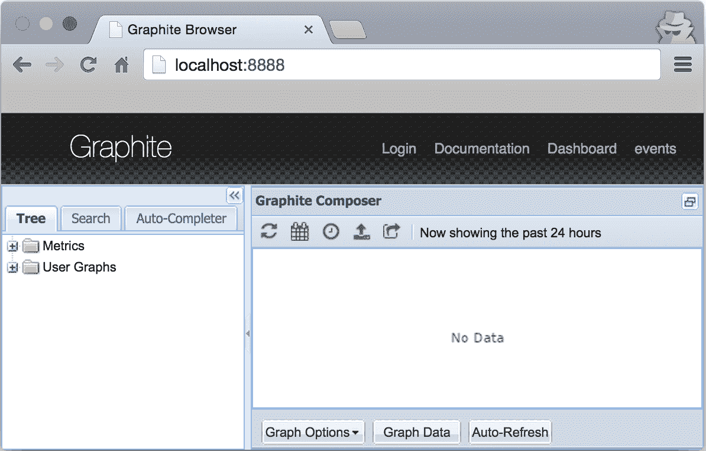

6.  要查看 Grafana，将浏览器指向`http://localhost:3000`,以便查看以下输出:


7.  Grafana 的默认登录名和密码是`admin` / `admin`，可以通过 Web UI Admin 进行更改。

对于使用 boot2docker 的 OS X 用户来说，这个 IP 不是`localhost`的，而是 boot2docker IP 调用的结果。

8.  一旦我们进入 Grafana，我们将需要添加我们的 Graphite 实例作为`DataSource`，所以点击图标，转到数据源，并添加一个新的`Type Graphite, Url http://localhost:80, Access`代理源:

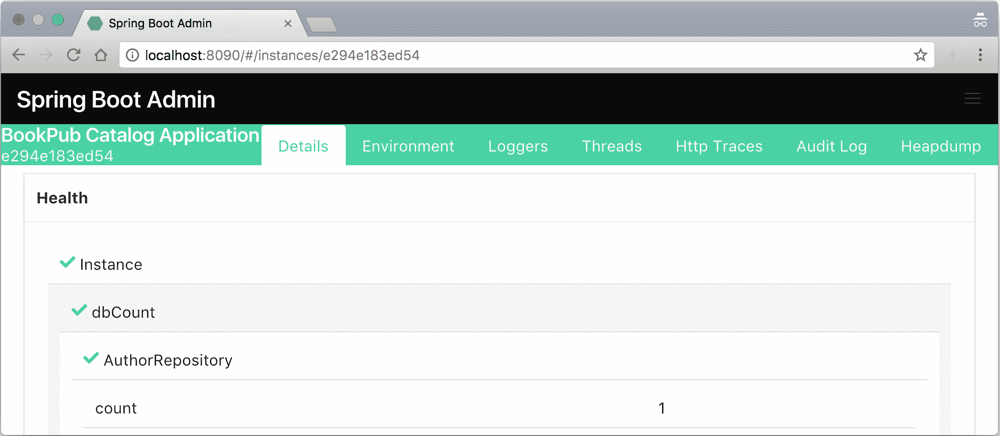

# 怎么做...

随着 Graphite 和 Grafana 的启动和运行，我们现在准备开始配置我们的应用，以便将指标发送到端口`2003`上的 Graphite 监听器。为此，我们将使用 Codahale/Dropwizard 度量库，它完全受 Spring Boot 支持，因此只需要很少的配置:

1.  我们清单上的第一件事是添加必要的库依赖项。用以下内容扩展`build.gradle`文件中的依赖块:

```java
compile("io.micrometer:micrometer-registry-graphite:latest.release") 
```

2.  在我们项目的根目录下的`src/main/java/com/example/bookpub`目录中创建一个名为`MonitoringConfiguration.java`的文件，内容如下:

```java
@Configuration 
@ConditionalOnClass(GraphiteMeterRegistry.class) 
public class MonitoringConfiguration { 

    private static final Pattern blacklistedChars = 
                         Pattern.compile("[{}(),=\[\]/]"); 

    @Bean 
    public MeterRegistryCustomizer<GraphiteMeterRegistry>  
                              meterRegistryCustomizer() { 
        return registry -> { 
           registry.config() 
             .namingConvention(namingConvention()); 
        }; 
    } 

    @Bean 
    public HierarchicalNameMapper hierarchicalNameMapper(){ 
        return (id, convention) -> { 
            String prefix = "bookpub.app."; 
            String tags = ""; 

            if (id.getTags().iterator().hasNext()) { 
                tags = "."  
                        + id.getConventionTags(convention) 
                        .stream() 
                        .map(t -> t.getKey() + "."  
                                                + t.getValue() 
                        ) 
                        .map(nameSegment ->  
                                 nameSegment.replace(" ", "_") 
                        ) 
                        .collect(Collectors.joining(".")); 
            } 

            return prefix  
                   + id.getConventionName(convention)  
                   + tags; 
        }; 
    } 

    @Bean 
    public NamingConvention namingConvention() { 
        return new NamingConvention() { 
            @Override 
            public String name(String name,  
                               Meter.Type type,  
                               String baseUnit) { 
                return format(name); 
            } 

            @Override 
            public String tagKey(String key) { 
                return format(key); 
            } 

            @Override 
            public String tagValue(String value) { 
                return format(value); 
            } 

            private String format(String name) { 
                String sanitized = 
                   Normalizer.normalize(name, 
                                    Normalizer.Form.NFKD); 
                // Changes to the original  
                // GraphiteNamingConvention to use "dot"  
                // instead of "camelCase" 
                sanitized =  
                   NamingConvention.dot.tagKey(sanitized); 

                return blacklistedChars 
                           .matcher(sanitized) 
                           .replaceAll("_"); 
            } 
        }; 
    } 
} 
```

3.  我们还需要将 Graphite 实例的配置属性设置添加到项目根目录下的`src/main/resources`目录中的`application.properties`文件中:

```java
management.metrics.export.graphite.enabled=true 
management.metrics.export.graphite.host=localhost 
management.metrics.export.graphite.port=2003 
management.metrics.export.graphite.protocol=plaintext 
management.metrics.export.graphite.rate-units=seconds 
management.metrics.export.graphite.duration-units=milliseconds 
management.metrics.export.graphite.step=1m 
```

4.  现在，让我们通过执行`./gradlew clean bootRun`来构建和运行我们的应用，如果我们已经正确地配置了所有的东西，它应该可以正常启动了。

5.  随着应用的启动和运行，我们应该开始看到 Graphite 和`bookpub`数据节点中的一些数据被添加到 metrics 下的树中。为了增加一些真实感，让我们打开浏览器，加载一个图书 URL`http://localhost:8080/books/978-1-78528-415-1/`几十次，以生成一些指标。
6.  让我们继续查看 Graphite 中的一些指标，并将数据时间范围设置为 15 分钟，以便获得一些近距离的图表，看起来类似于下面的屏幕截图:


7.  我们还可以通过创建一个新的仪表板并添加一个图形面板，在 Grafana 中使用这些数据创建一些外观精美的仪表板，如下面的屏幕截图所示:

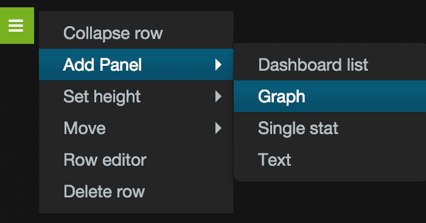

8.  新创建的图形面板将如下所示:

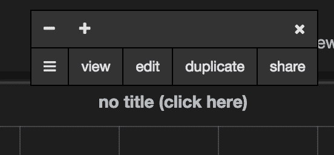

9.  单击 no title(单击此处)标签，选择 edit，并在文本字段中输入指标名称`bookpub.app.http.server.requests.exception.None.method.GET.status.200.uri._books__isbn_.count`，如下图所示:


10.  点击仪表板将使您退出编辑模式。

更详细的教程，请访问[http://docs.grafana.org/guides/gettingstarted/](http://docs.grafana.org/guides/gettingstarted/)。

# 它是如何工作的...

为了能够通过 Graphite 导出指标，我们在`io.micrometer:micrometer-registry-graphite`库上添加了额外的依赖项。然而，在幕后，它依赖于 Dropwizard metrics 库来提供 Graphite 集成，因此它将向我们的`build`文件添加以下新的依赖项:

*   `io.dropwizard.metrics:metrics-core`:这个依赖项增加了基本的 Dropwizard 功能、`MetricsRegistry`、公共 API 接口和基类。这是让 Dropwizard 工作并集成到 Spring Boot 来处理指标所需的最低要求。
*   `io.dropwizard.metrics:metrics-graphite`:这增加了对`GraphiteReporter`的支持，是配置 Dropwizard 将收集的监控数据发送到 Graphite 实例所必需的。

为了保持整洁和良好的分离，我们创建了一个单独的配置类，包含所有与监控相关的 beans 和设置:`MonitoringConfiguration`。在这个类中，我们配置了三个`@Bean`实例:一个定制的`MeterRegistryCustomizer`实现来定制`GraphiteMeterRegistry`、`HigherarchicalNameMapper`和`NamingConvention`实例。

我们必须创建自己的定制的原因有两个。我们希望遵循经典的 Graphite 公制命名方案，该方案使用点(`.`)符号在层次结构中分隔公制名称。不幸的是，出于某种原因，Micrometer Graphite 实现选择了使用`camelCase`折叠符号，这使得像`counter.datasource.BookRepository`这样的公制名称被转换成`counterDatasourceBookRepository`名称显示在 Graphite 中。有这么长的名字，没有层次树，在 Graphite UI 中搜索和发现非常困难，因为有很多指标。此外，所有的指标都放在一个根(`/`)树下，没有创建一个专用的应用文件夹，这也导致了糟糕的可读性和使用性。我们已经在我们的`HigherarchicalNameMapper`实例中添加了代码，将应用前缀添加到所有导出到 Graphite 的指标中，这样它们都可以放入`subtree: /bookpub/app/*.`:

```java
String prefix = "bookpub.app."; 
... 
return prefix + id.getConventionName(convention) + tags; 
```

`NamingConvention`提供了关于如何将特定的仪表名称、键、值和标签转换成适当的 Graphite 变量的精确配置。在`format(String name)`方法中，我们声明希望通过`NamingConvention.dot`实现在元素之间使用点(`.`)分隔。

属性组定义了如何将数据发送到 Graphite 实例。我们将其配置为每 1 分钟执行一次，将所有持续时间间隔(如延迟测量)转换为毫秒，将所有可变速率(如每个时间段的请求数)转换为秒。这些值中的大部分都有为 Graphite 提供的默认配置设置，但是如果需要的话可以更改。

注意，我们使用了`@ConditionalOnClass`注释来表明，如果微米石墨提供的类`GraphiteMeterRegistry.class`存在于类路径中，我们只希望应用这个`@Configuration`。这是在测试过程中不尝试实例化 Graphite beans 所需要的，因为在测试环境中可能没有运行和可用的 Graphite 实例。

正如您可以从 Graphite UI 的可用指标中看到的，有许多现成的指标。一些值得注意的是关于 JVM 和 OS 指标，它们将内存和线程指标暴露给内存和线程数据节点以及其他数据。它们可以在石墨树的`Metrics/bookpub/app/jvm`、`Metrics/bookpub/app/process`或`Metrics/bookpub/app/system`中找到。

千分尺核心库为额外的系统指标提供了大量的仪表绑定。如果需要导出诸如线程或执行器信息之类的东西，或者获取文件描述符的视图，可以通过简单地声明一个返回`new JvmThreadMetrics()`或`new FileDescriptorMetrics()`的方法来导出额外的 beans。

正在运行的应用将收集向`MeterRegistry`注册的所有指标，每个已配置的导出器(在我们的例子中是`GraphiteMeterRegistry`)以一定的时间间隔向其目的地报告所有这些指标。正确的导出器实现在单独的`ThreadPool`中运行，因此在主应用线程之外，不会干扰它们。但是，应记住这一点，以防仪表实现在内部使用某些`ThreadLocal`数据，这些数据对出口商不可用。

# 将测微计与 Dashing 相结合

前面的方法让我们看到了如何在运行时从应用中收集各种指标。我们还看到了将这些数据可视化为一组历史趋势图的能力有多么强大。

虽然 Grafana 和 Graphite 为我们提供了非常强大的能力，以图形的形式操纵数据，并构建充满阈值、应用数据函数等的复杂仪表板，但有时我们想要更简单、可读性更强、更宽泛的东西。这正是 Dashing 提供的那种仪表盘体验。

**Dashing** 是一个流行的仪表板框架，由 Shopify 开发，用 Ruby/Sinatra 编写。它使您能够创建由不同类型的小部件组成的各种仪表板。我们可以用图形、仪表、列表、数值或纯文本来显示信息。

在这个菜谱中，我们将安装 Dashing 框架，学习如何创建仪表板，发送和使用数据以直接从应用报告以及从 Graphite 获取数据，并使用 Dashing API 将数据推送到 Dashing 实例。

# 做好准备

为了运行 Dashing，我们需要一个安装了 RubyGems 的 Ruby 1.9+环境。

通常，Ruby 应该可以在 Linux 和 OS X 的任何普通发行版上使用。如果你运行的是 Windows，我建议你使用[http://rubyinstaller.org](http://rubyinstaller.org)来获得安装包。

一旦您有了这样一个可用的环境，我们将安装 Dashing 并创建一个新的仪表板应用供我们使用，如下所示:

1.  安装 Dashing 非常容易；只需执行 gem install dashing 命令就可以在您的系统上安装 Dashing RubyGems。
2.  随着 RubyGem 的成功安装，我们将通过在您想要创建仪表板应用的目录中执行 dashing new `bookpub_dashboard`命令来创建名为`bookpub_dashboard`的新仪表板。
3.  一旦生成了仪表板应用，转到`bookpub_dashboard`目录并执行`bundle`命令来安装所需的依赖 gem。
4.  安装完 gems 包后，我们可以通过执行`dashing start`命令启动仪表板应用，然后将浏览器指向`http://localhost:3030`以查看以下结果:

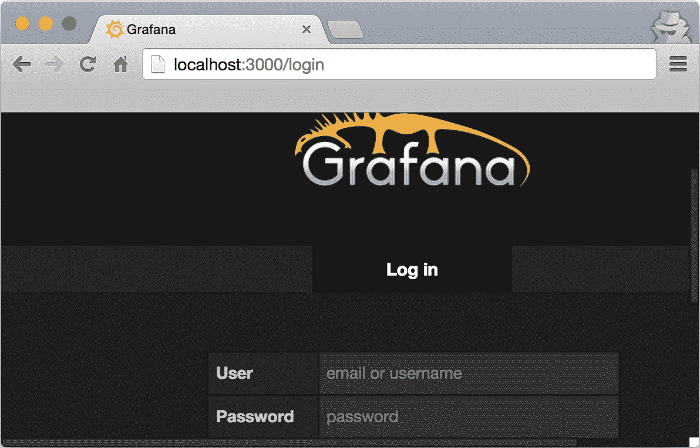

# 怎么做...

如果您仔细查看我们闪亮的新仪表板的 URL，您会看到它实际上显示的是`http://localhost:3030/sample`并显示了一个自动生成的示例仪表板。我们将使用这个示例仪表板进行一些更改，以便直接显示来自我们的应用的一些指标，以及从 Graphite data API 端点获取一些原始指标。

为了演示如何连接来自应用`/actuator/metrics`端点的数据，以便将其显示在 dashboard 中，我们将更改`Buzzwords`小部件以显示我们的数据存储库的计数，如下所示:

1.  在我们开始之前，我们需要将`'httparty', '>= 0.13.3'` gem 添加到位于`bookpub_dashboard`目录下的`Gemfile`文件中，这将使我们能够使用 HTTP 客户端从 HTTP 端点提取监控指标。
2.  添加宝石后，再次运行`bundle`命令安装新添加的宝石。
3.  接下来，我们需要修改位于`bookpub_dashboard/dashboards`目录中的`sample.erb`仪表板定义，用`<div data-id="repositories" data-view="List" data-unordered="true" data-title="Repositories Count" data-moreinfo="# of entries in data repositories"></div>`替换`<div data-id="buzzwords" data-view="List" data-unordered="true" data-title="Buzzwords" data-moreinfo="# of times said around the office"></div>`。
4.  替换小部件后，我们将在`bookpub_dashboard/jobs`目录中创建一个名为`repo_counters.rb`的新数据供应作业文件，其内容如下:

```java
require 'httparty' 

repos = ['AuthorRepository', 'ReviewerRepository', 'BookRepository', 'PublisherRepository'] 

SCHEDULER.every '10s' do 
  data = JSON.parse(HTTParty.get("http://localhost:8081/metrics").body) 
  repo_counts = [] 

  repos.each do |repo| 
    current_count = data["counter.datasource.#{repo}"] 
    repo_counts << { label: repo, value: current_count } 
  end 

  send_event('repositories', { items: repo_counts }) 
end 
```

5.  所有代码修改就绪后，让我们通过执行`dashing start`命令来启动我们的仪表板。在浏览器中转到`http://localhost:3030/sample`,查看我们的新小部件显示的数据，如下图所示:

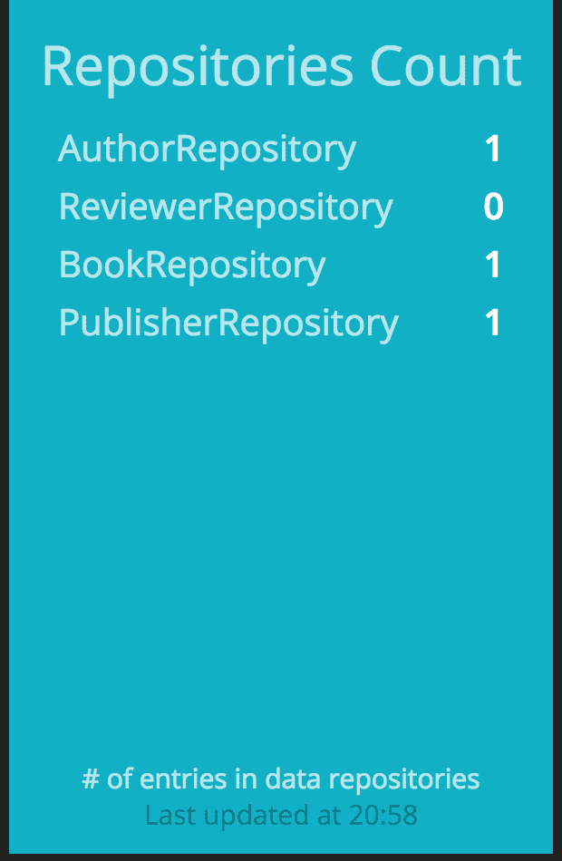

6.  如果我们使用远程 Shell 登录到应用，就像我们在本章前面所做的那样，并添加一个发布者，我们会看到仪表板上的计数器增加。
7.  将数据推送到仪表板的另一种方式是使用他们的 RESTful API。让我们通过执行`curl -d '{ "auth_token": "YOUR_AUTH_TOKEN", "text": "My RESTful dashboard update!" }' http://localhost:3030/widgets/welcome`来更新左上角文本小部件中的文本。

8.  如果一切正常，我们应该看到 Hello 标题下的文本更新为新值`My RESTful dashboard update!`。

9.  在运行相同应用类型的多个实例的环境中，直接从每个节点提取数据可能不是一个好主意，特别是如果它们非常动态，可以随心所欲地来来去去。建议您从一个更加静态和众所周知的位置使用数据，比如 Graphite 实例。为了演示易变数据指标，我们将消耗`Eden`、`Survivor`和`OldGen`空间的内存池数据，并显示它们，而不是聚合、协同和评估图仪表板。我们将开始用以下内容替换位于`bookpub_dashboard/jobs`目录中的`sample.rb`作业文件的内容:

```java
require 'httparty' 
require 'date' 

eden_key = "bookpub.app.jvm.memory.used.area.heap.id.PS_Eden_Space" 
survivor_key = "bookpub.app.jvm.memory.used.area.heap.id.PS_Survivor_Space" 
oldgen_key = "bookpub.app.jvm.memory.used.area.heap.id.PS_Old_Gen" 

SCHEDULER.every '60s' do 
  data = JSON.parse(HTTParty.get("http://localhost:8888/render/?from=-11minutes&target=#{eden_key}&target=#{survivor_key}&target=#{oldgen_key}&format=json&maxDataPoints=11").body) 

  data.each do |metric| 
    target = metric["target"] 
    # Remove the last data point, which typically has empty value 
    data_points = metric["datapoints"][0...-1] 
    if target == eden_key 
      points = [] 
      data_points.each_with_index do |entry, idx| 
        value = entry[0] rescue 0 
        points << { x: entry[1], y: value.round(0)} 
      end 
      send_event('heap_eden', points: points) 
    elsif target == survivor_key 
      current_survivor = data_points.last[0] rescue 0 
      current_survivor = current_survivor / 1048576 
      send_event("heap_survivor", { value: 
                   current_survivor.round(2)}) 
    elsif target == oldgen_key 
      current_oldgen = data_points.last[0] rescue 0 
      last_oldgen = data_points[-2][0] rescue 0 
      send_event("heap_oldgen", { 
                   current: current_oldgen.round(2), 
                   last: last_oldgen.round(2)
                 }) 
    end 
  end 
end 
```

10.  在位于`bookpub_dashboard/dashboards`目录中的`sample.erb`模板中，我们将用以下替代图替换协同、估价和融合图:

*   `<div data-id="synergy" data-view="Meter" data-title="Synergy" data-min="0" data-max="100"></div>`被替换为`<div data-id="heap_survivor" data-view="Meter" data-title="Heap: Survivor" data-min="0" data-max="100" data-moreinfo="In megabytes"></div>`
*   `<div data-id="valuation" data-view="Number" data-title="Current Valuation" data-moreinfo="In billions" data-prefix="$"></div>`被替换为`<div data-id="heap_oldgen" data-view="Number" data-title="Heap: OldGen" data-moreinfo="In bytes" ></div>`
*   `<div data-id="convergence" data-view="Graph" data-title="Convergence" style="background-color:#ff9618"></div>`被替换为`<div data-id="heap_eden" data-view="Graph" data-title="Heap: Eden" style="background-color:#ff9618" data-moreinfo="In bytes"></div>`

11.  完成所有更改后，我们可以重新启动仪表板应用，并将浏览器重新加载到`http://localhost:3030`以查看以下结果:

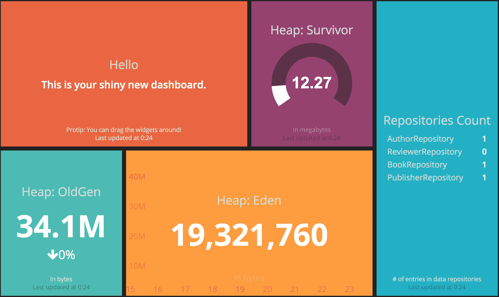

# 它是如何工作的...

在这个菜谱中，我们看到了如何通过 Graphite 直接从我们的应用中提取数据，并使用 Dashing dashboard 呈现数据，以及使用 RESTful API 将信息直接推送到 Dashing。众所周知，一件事看一次比听七次好。当试图获得代表系统在运行时如何表现的关键指标的整体情况，并能够快速地对数据采取行动时，这是正确的。

在不深入 Dashing 内部细节的情况下，提到一些关于数据如何进入 Dashing 的事情仍然很重要。这可能通过以下两种方式发生:

*   **计划作业**:用于从外部来源拉取数据
*   **RESTful API** :用于将数据从外部推送到 Dashing

计划作业在生成的仪表板应用的作业目录中定义。每个文件都有一段封装在`SCHEDULER.every`块中的 ruby 代码，它计算数据点，并向适当的小部件发送一个带有新数据的事件以进行更新。

在我们的菜谱中，我们创建了一个名为`repo_counters.rb`的新作业，其中我们使用了`httparty`库，以便直接调用我们的应用实例的`/actuator/metrics/#{name}`端点，并提取每个预定义存储库的计数器。遍历度量，我们创建了一个`repo_counts`集合，其中包含每个存储库的数据，包含一个标签显示和值计数。产生的集合以`event: send_event('repositories', { items: repo_counts })`的形式被发送到 repositories 小部件进行更新。

我们将该作业配置为每 10 秒执行一次，但是如果数据更改的频率不是很频繁，则该数字可以更改为几分钟甚至几小时。每当调度程序运行我们的作业时，repositories 小部件就会通过客户端 websockets 通信用新数据进行更新。在仪表板/ `sample.erb`中，我们可以使用`data-id="repositories"`找到小部件的定义。

除了添加我们自己的新作业，我们还更改了现有的`sample.rb`作业，使用 Graphite 的 RESTful API 从 Graphite 中提取数据，以填充不同类型的小部件，从而显示内存堆数据。因为我们不是直接从应用实例中提取数据，所以最好不要将代码放在同一个作业中，因为这些作业可能——在我们的例子中确实如此——具有不同的时间间隔。因为我们每分钟只向 Graphite 发送一次数据，所以拉数据的频率比这低是没有意义的。

为了从 Graphite 中获取数据，我们使用了以下 API 调用:

```java
/render/?from=-11minutes&target= bookpub.app.jvm.memory.used.area.heap.id.PS_Eden_Space &target= bookpub.app.jvm.memory.used.area.heap.id.PS_Survivor_Space &target= bookpub.app.jvm.memory.used.area.heap.id.PS_Old_Gen &format=json&maxDataPoints=11

```

看一下前面代码片段中提到的以下参数:

*   `target`:这个参数是一个重复的值，它定义了我们想要检索的所有不同指标的列表。
*   `from`:该参数指定时间范围；在我们的例子中，我们要求 11 分钟前的数据。
*   `format`:该参数配置所需的输出格式。我们选择了 JSON，但是也有很多其他的。参考[http://graphite . readthe docs . org/en/latest/render _ API . html #格式](http://graphite.readthedocs.org/en/latest/render_api.html#format)。
*   `maxDataPoints`:这个参数表示我们想要得到多少个条目。

我们要求 11 个条目而不是 10 个条目的原因是因为经常会出现这样的情况，即只有几分钟的短范围请求的最后一个条目有时会作为空条目返回。我们只使用前 10 个条目，忽略最近的条目，以避免奇怪的数据可视化。

遍历目标数据，我们将使用指定的数据填充适当的小部件，如`heap_eden`、`heap_survivor`和`heap_oldgen`，如下所示:

*   `heap_eden`:这是一个`Graph`小部件，在`sample.erb`模板中以`data-view="Graph"` 属性的形式定义，所以它需要一个包含`x`和`y`值的 points 集合形式的数据输入。`x`值代表一个时间戳，Graphite 很方便地将它返回给我们，并通过 Graph 小部件自动转换成分钟显示值。`y`值代表以字节为单位的内存池利用率。由于来自 Graphite 的值是十进制数的形式，我们需要将它转换成整数，以便看起来更好。
*   `heap_survivor`:这是一个`Meter`小部件，在`sample.erb`模板中以`data-view="Meter"`属性的形式定义，所以它想要一个数据输入，作为模板配置范围之间的简单数值。在我们的例子中，范围被设置为`data-min="0" data-max="100"`属性。即使我们选择将数字四舍五入到两位小数，它也可能只是一个整数，因为它对于仪表板显示来说已经足够精确了。您还会注意到，在`sample.rb`中，我们将原始值(以字节为单位)转换为兆字节，以获得更好的可读性— `current_survivor = current_survivor / 1048576`。
*   `heap_oldgen`:这是一个`Number`小部件，在`sample.erb`模板中以`data-view="Number"`属性的形式定义，所以它需要一个数据输入作为当前值，也可以是最后一个值；在这种情况下，也将显示改变方向的百分比变化。当我们得到最后 10 个条目时，我们在检索当前和最后的值时没有问题，所以我们可以很容易地满足这个要求。

在这个菜谱中，我们还尝试了 Dashing 的 RESTful API，尝试使用一个`curl`命令来更新 welcome 小部件的值。这是一个推送操作，可以在没有公开数据 API 的情况下使用，但是您可以创建某种脚本或代码来将数据发送到 Dashing。为此，我们使用了下面的命令:`curl -d '{ "auth_token": "YOUR_AUTH_TOKEN", "text": "My RESTful dashboard update!" }' http://localhost:3030/widgets/welcome`。

Dashing API 接受 JSON 格式的数据，通过 POST 请求发送，该请求包含小部件所需的以下参数以及小部件 ID，它是 URL 路径本身的一部分:

*   `auth_token`:这允许安全的数据更新，并且可以在仪表板根目录的`config.ru`文件中进行配置。
*   `text`:这是一个正在被改变的`widget`属性。由于我们正在更新一个`Text`小部件，正如在`sample.erb`模板中以`data-view="Text"`属性的形式定义的那样，我们需要将它发送到文本中进行更新。
*   `/widgets/<widget id>`:这个 URL 路径标识了更新要到达的特定小部件。`id`对应于`sample.erb`模板中的一个声明。在我们的例子中，它看起来像`data-id="welcome"`。

各种小部件的定义也可以被操作，社区已经创建了一个非常丰富的各种小部件的集合，可以在 https://github.com/Shopify/dashing/wiki/Additional-Widgets 的[获得。小部件安装在仪表板的小部件目录中，只需运行`dashing install <GIST>`即可安装，其中`GIST`是 GitHub Gist 条目的散列。](https://github.com/Shopify/dashing/wiki/Additional-Widgets)

仪表板模板文件类似于我们的`sample.erb`模板，可以进行修改，以便为每个特定的仪表板以及多个仪表板模板创建所需的布局，这些模板可以旋转或直接手动加载。

每个仪表板代表一个网格，其中放置了各种小部件。每个小部件都由一个具有适当配置属性的`<div>`条目定义，并且应该嵌套在`<li>`网格元素中。我们可以使用数据元素属性来控制每个小部件在网格中的位置，如下所示:

*   `data-row`:表示小工具应该放置的行号
*   `data-col`:表示小工具应该放置的列号
*   `data-sizex`:这定义了小部件水平跨越的列数
*   `data-sizey`:这定义了小工具将垂直跨越的行数

可以修改现有的小部件来改变它们的外观和感觉，以及扩展它们的功能；因此，天空是我们所能拥有的信息显示的极限。你一定要查看 [http://dashing.io](http://dashing.io) 了解更多细节。