# 第二章。用 Spring MVC 设计微服务架构

在本章中，我们将讨论以下主题:

*   使用简单的 URL 映射配置控制器
*   使用 ViewResolver 配置回退控制器
*   使用 Bootstrap 设置和定制响应式单页面网页设计
*   使用 JSTL 在视图中显示模型
*   定义公共 WebContentInterceptor
*   用 AngularJS 设计客户端 MVC 模式

# 简介

在开始这新的一章之前，你需要完成第一章。第一章介绍了我们正在构建的交易平台的基础知识。它还创建了一个模块化工具包，每个食谱都将使用。

第二章将产品置于加速斜坡上。它将塑造整个责任链，并绘制微服务架构的大图。我们将再次为后面的章节建立一个必要的结构，但是是在另一个层面上。

## 用户体验范式

几年来，我们一直在协助一场异常活跃的前端革命。自从 HTML 5 和 CSS3 兴起以来，随着移动设备的通用开发平台(iOS、Android 等等)的出现，以及连接设备的数量的增加，已经向开发人员社区打开了许多大门和机会。开源领域新的 JavaScript 库的频繁出现让人们很难跟上。

但这是一场永远的革命！它以客户和用户体验为目标。如今，客户希望通过台式机、笔记本电脑、电视、平板电脑、手机以及汽车与品牌或产品进行互动。网络连接速度也各不相同，从每秒 150 多兆字节到每秒几兆字节不等。客户还可以期待离线功能，或者至少是不错的用户体验。很明显，这种复杂性给改善用户体验带来了新的挑战。

随着我们通过不同方式的可达性大大增加，我们接触垃圾邮件、直接招揽、广告和市场营销的程度也达到了前所未有的高度。有趣的是，我们现在对网上每一条吸引我们注意力的信息都更加敏感和自信。因为我们只需要几分之一秒的时间来决定某样东西是否值得，所以我们拒绝一个糟糕的设计也是出于同样的原因。我们的目标更加苛刻和饱和，每个品牌都必须遵循最新的 UX 标准，才能让我们与他们互动。

## 微服务架构

我们已经看到了互联网组织通过向公众开放其 API(脸书、Twitter、亚马逊等等)在沟通、形象和发展方面带来的巨大好处。IT 基础设施的这种彻底变化现在正成为小公司和初创公司的常态。

现代架构为客户提供了文档化的公共 API 和特定于设备的安装包:移动应用或在特定镜头下交付的响应性 HTML 内容。REST APIs 也是 **物** ( **物联网**)的**互联网的更多自主模块的可导航维度。**

也许主要的问题仍然是如何处理服务器端的负载，但是更多的计算转移到了客户端设备，REST 架构根据定义是无状态的，因此是对可伸缩性的良好支持。

# 使用简单的 URL 映射配置控制器

这个方法介绍了 Spring MVC 控制器及其最简单的实现。

## 准备就绪

我们稍后会发现，特别是在第三章、*使用 Java 持久性和实体、*中，Spring MVC 是构建 REST API 的一个很好的工具。在这里，我们将关注如何创建一个在响应中打印一些内容的控制器。

从这个菜谱开始，我们将使用 GIT 跟踪开发`cloudstreetmarket`应用的每一次迭代。完成初始设置后，您会发现升级是如此的顺利。

## 怎么做...

这个方法包含两个初始部分，用于安装和配置 GIT。

### 下载并安装 GIT

1.  要下载 GIT，请访问位于 https://git-scm.com/download 的 GIT 下载页面。根据您的环境选择与相对应的正确产品(Mac OS X、Windows、Linux、或 Solaris)。
2.  要安装 GIT for Linux 和 Solaris，请使用系统的本机软件包管理器执行建议的安装命令。

对于 Mac OS X，双击下载的`dmg`文件，将包解压到硬盘上。导航到提取的目录并双击`pkg`文件。依次选择所有默认选项，直到出现**成功安装**屏幕。关闭屏幕。

对于 Windows，执行下载的程序，并按照默认选项执行每个步骤，直到这些屏幕:

*   **调整您的路径环境**:在 Windows 命令提示符下选择**使用 Git**选项
*   **选择 SSH 可执行文件**:选择**使用 OpenSSH** 选项
*   **配置行尾转换**:选择**结帐窗口风格**和**提交 Unix 风格行尾**选项
*   **配置终端模拟器使用 Git Bash** :选择**使用 Windows 的默认控制台窗口**
*   **配置实验性能调整**:不要勾选**启用文件系统缓存**复选框

让安装完成，点击**完成**按钮。

为了进行验证，请打开您的终端并输入以下命令:

```java
git –version

```

这个命令应该显示已安装的版本。提出的安装指南与`GIT 2.6.3`相关联。

### 在 Eclipse 中配置 GIT

1.  We will first initialize the local repository from the terminal. Go to your workspace location: `cd <home-directory>/workspace`.

    用你自己的路径替换`<home-directory>`。

2.  输入以下命令，在这个位置创建一个本地 Git 存储库:

    ```java
    git init

    ```

3.  输入以下命令:

    ```java
    git remote add origin https://github.com/alex-bretet/cloudstreetmarket.com

    ```

4.  然后，输入`git fetch`命令。
5.  Select both your parent projects and right-click on one of them. Go to **Team** | **Add to index**:

    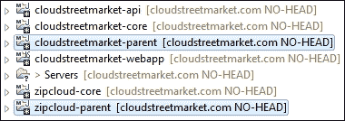

6.  From the top-right panel, click on the **Git** **perspective**:

    

    如果您还没有这个透视图，请使用按钮添加它。

7.  从左边的层次结构中( **Git** 透视图)，选择**添加一个现有的本地 Git 存储库**。
8.  将打开一个上下文窗口。定位我们刚刚创建的本地 Git 存储库的位置(它应该是当前的工作区目录)。
9.  一个新的存储库现在应该出现在 **Git** 透视图中。
10.  As shown in the following screenshot, right-click and select **Checkout** to see the latest version of the branch **origin/v1.x.x**.

    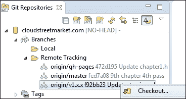

11.  When prompted, Checkout as **New Local Branch**:

    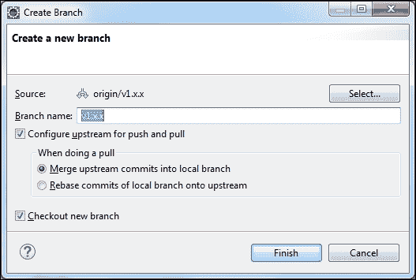

12.  The actual workspace should now be synchronized with the branch v1.x.x. This branch reflects the state of the environment at the end of [Chapter 1](1.html "Chapter 1\. Setup Routine for an Enterprise Spring Application"), Setup *Routine for an Enterprise Spring Application.*

    

13.  右键点击 **zipcloud-parent** 来执行**运行方式| Maven clean** 和**运行方式| Maven 安装**。然后，对`cloudstreetmarket-parent`进行同样的操作。你每次都会观察`BUILD SUCCESS`。
14.  最后，右键点击一个项目，进入 **Maven** | **更新项目**。选择工作区的所有项目，点击**确定**。
15.  如果在您的一个项目中仍然有红色警告(如前面的截图所示)，您可能需要将目标运行时环境重新连接到 **cloudstreetmarket-api** 和 **cloustreetmarket-webapp** (根据[第 1 章、](1.html "Chapter 1\. Setup Routine for an Enterprise Spring Application") *企业 Spring 应用的设置例程*、*第 2 个方法、第 7 步*)。
16.  从终端，转到本地 GIT 存储库:

    ```java
     cd <home-directory>/workspace 

    ```

17.  输入以下命令:

    ```java
     git pull origin v2.2.1

    ```

18.  重复步骤 13 和 14。(做好每次拉新改后重复这两步的准备。)
19.  在 **cloudstreetmarket-webapp** 模块中，现在出现了一个新的包:

    ```java
     edu.zipcloud.cloudstreetmarket.portal.controllers.

    ```

20.  在这个包中，已经创建了一个`InfoTagController`类:

    ```java
    @Controller
    @RequestMapping("/info")
    public class InfoTagController {
      @RequestMapping("/helloHandler")
      @ResponseBody
      public String helloController(){
        return "hello";
      }
    }
    ```

21.  Make sure the two `wars` are deployed in the Tomcat server. Start the Tomcat server and access the `http://localhost:8080/portal/info/helloHandler` URL with your browser.

    ### 注意

    您应该看到一个简单的 hello 显示为 HTML 内容*。*

22.  在 `cloudstreetmarket-webapp/src/main/webapp/WEB-INF/dispatcher-context.xml`文件中，添加了以下 bean 定义:

    ```java
    <bean id="webAppVersion" class="java.lang.String">
      <constructor-arg value="1.0.0"/>
    </bean>
    ```

23.  下面的方法和`InfoTagController`类中的成员也被添加:

    ```java
    @Autowired
    private WebApplicationContext webAppContext;
    private final static LocalDateTime startDateTime = LocalDateTime.now();
    private final static DateTimeFormatter DT_FORMATTER =  DateTimeFormatter.ofPattern("EEE, d MMM yyyy h:mm a");
    @RequestMapping("/server")
    @ResponseBody
    public String infoTagServer(){
      return new StringJoiner("<br>")
        .add("-------------------------------------")
        .add(" Server: "+ 
        webAppContext.getServletContext().getServerInfo())
        .add(" Start date: "+ 
        startDateTime.format(DT_FORMATTER))
        .add(" Version: " + 
        webAppContext.getBean("webAppVersion"))
        .add("--------------------------------------")
        .toString();
    }
    ```

24.  Now, access the `http://localhost:8080/portal/info/server` URL with your browser.

    ### 注意

    您应该会看到呈现为 HTML 文档的以下内容:

    ```java
    --------------------------------------------------
    Server: Apache Tomcat/8.0.14
    Start date: Sun, 16 Nov 2014 12:10 AM
    Version: 1.0.0
    ---------------------------------------------------

    ```

## 它是如何工作的...

我们将起草一份 Spring MVC 作为框架的概述。然后，我们将回顾如何从`DispatcherServlet`、控制器级注释和方法处理程序签名中配置控制器。

### Spring MVC 概述

Spring MVC 实现了两种常见的设计模式:前端控制器设计模式和 MVC 设计模式。

#### 前控制器

设计为前端控制器的系统为所有传入请求提供单一入口点。在 Java Web 环境中，这个入口点通常是一个 servlet——一个分派和委托给其他组件的独特的 servlet。

### 注意

对于 Spring MVC，这个独特的 servlet 就是`DispatcherServlet`。

Servlets 是 Java web 中的标准。它们与预定义的 URL 路径相关联，并在部署描述符(`web.xml`文件)中注册。通过解析部署描述符，servlet 容器(如 Apache Tomcat)识别声明的 servlet 及其 URL 映射。在运行时，servlet-container 拦截每个 HTTP 客户机请求，并为每个请求创建一个新线程。这些线程将使用 Java 转换的请求和响应对象调用匹配的相关 servlets。

#### MVC 设计模式

MVC 设计模式更多的是一种架构风格。它从整体上描述了应用。它鼓励在请求线程必须通过的三个不同层之间清晰地分离关注点:模型**、视图**和控制器**——控制器、模型，然后是准确的视图。******

 ******

当客户机请求被 servlet 容器截获时，它被路由到`DispatcherServlet`。`DispatcherServlet` 将请求发送到一个控制器(一个控制器方法处理程序)，该控制器具有与请求状态匹配的配置(如果发现匹配)。

控制器编排业务逻辑、模型生成，并最终为模型和响应选择一个视图。从这个角度来看，模型代表了一个由控制器处理的填充数据结构，并被提供给视图用于可视化目的。

但是这三个组件(模型、视图和控制器)也可以在宏观上被可视化为独立的静态层。这些组件中的每一个都是一个层，是每个单独组成部分的占位符，是类别的一部分。**控制器层**包含所有注册的控制器以及 Web 拦截器和转换器；模型生成层(和业务逻辑层)包含业务服务和数据访问组件。视图层包含模板(例如 JSP)和其他 web 客户端组件。

#### 春季 MVC 流量

Spring MVC 流可以用下图来表示:

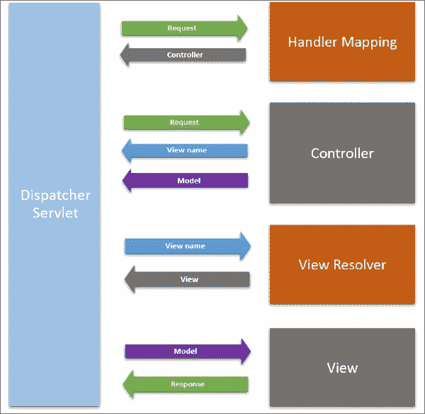

我们之前提到过 Spring MVC 实现了一个前端控制器模式。切入点是`DispatcherServlet`。这个`DispatcherServlet`依赖于一个`HandlerMapping`实现。使用不同的策略和特性，`HandlerMapping`为请求解析一个控制器方法处理程序。

一旦`DispatcherServlet`有了一个控制器方法处理程序，它就向它发送请求。方法处理程序向`DispatcherServlet`返回一个视图名(或者直接返回视图本身)以及填充的模型对象。

有了视图名称，`DispatcherServlet`就要求`ViewResolver`实现找到并选择一个视图。

有了请求、视图和模型，`DispatcherServlet` 就拥有了构建客户端响应的一切。用所有这些元素处理视图，最后将响应返回给 servlet 容器。

### dispatcher servlet–春季 MVC 入口点

如前所述，`DispatcherServlet`是 Spring MVC 的核心部分。它拦截针对应用的预定义 URL 路径的客户端请求。它将它们映射到属于业务逻辑操作符的处理程序(控制器、拦截器、过滤器等等)。它还提供了一套工具，以 bean 的形式提供，用于解决反复出现的 web 开发问题和技术，比如提供一个集中的和模块化的视图层、处理国际化、主题、处理异常等等。

首先，`DispatcherServlet`是一个 servlet，在`web.xml`文件中定义为 servlet 配置及其 servlet 映射。代码如下:

```java
<servlet>
  <servlet-name>spring</servlet-name>
   <servlet-class>
      org.springframework.web.servlet.DispatcherServlet
  </servlet-class>
  <load-on-startup>1</load-on-startup>
</servlet>
<servlet-mapping>
   <servlet-name>spring</servlet-name>
   	<url-pattern>/*</url-pattern>
</servlet-mapping>
```

在我们的应用中，在 **cloudstreetmarket-webapp** 中，`DispatcherServlet`被命名为 spring，并且覆盖了应用的完整上下文路径:`/*`。

我们已经看到，每个`DispatcherServlet`都有一个受限范围`WebApplicationContext`，它从根`ApplicationContext`继承 beans。

默认情况下，对于`WebApplicationContext`，Spring MVC 会在`/WEB-INF`目录中查找一个名为`{servletName}-servlet.xml`的配置文件。然而，我们已经通过初始化参数`contextConfigLocation`覆盖了这个默认名称和位置:

```java
<servlet>
 <servlet-name>spring</servlet-name>
   <servlet-class>
    org.springframework.web.servlet.DispatcherServlet
  </servlet-class>
   <init-param>
    <param-name>contextConfigLocation</param-name>
    <param-value>/WEB-INF/dispatcher-context.xml</param-value>
   </init-param>
   <load-on-startup>1</load-on-startup>
</servlet>
<servlet-mapping>
    <servlet-name>spring</servlet-name>
    <url-pattern>/*</url-pattern>
</servlet-mapping>
```

仍然在`web.xml`中，您可以看到根应用上下文(`classpath*:/META-INF/spring/*-config.xml`)以`ContextLoaderListener`开始:

```java
<listener>
  <listener-class>
    org.springframework.web.context.ContextLoaderListener
  </listener-class>
</listener>
```

### 注释定义的控制器

Spring MVC 控制器是特定于业务的代码真正开始处理客户端请求的地方。自从 *Spring 2.5* 以来，我们已经能够在控制器上使用注释，所以我们不必在配置中将它们显式声明为 bean。这使得它们的实现更容易扩展和理解。

#### @控制器

一个`@Controller` 注释将一个类标记为 Web 控制器。它仍然是表示层的 Spring 原型。定义 Spring 原型的主要目的是使目标类型或方法在 Spring 类路径扫描期间可被发现，该扫描由 package 用以下命令激活:

```java
<context:component-scan base-package="edu.zipcloud.cloudstreetmarket.portal"/>
```

与此注释相关的自定义逻辑不多。如果我们不想让应用变得更整洁，我们可以用其他原型注释(`@Component`或`@Service`)来运行控制器。

#### @RequestMapping

`@RequestMapping` 注释将处理程序定义到控制器类和/或控制器方法上。这些注释由`DispatcherServlet`在原型类中查找。`@RequestMapping`注释背后的主要思想是定义类级的主路径映射，并缩小方法上的 HTTP 请求方法、头、参数和媒体类型。

为了实现这种缩小，`@RequestMapping`注释接受括号内逗号分隔的参数。

考虑下面的例子:

```java
@RequestMapping(value="/server", method=RequestMethod.GET)
```

`@RequestMapping`可用的参数汇总如下表:

<colgroup><col style="text-align: left"> <col style="text-align: left"></colgroup> 
| 

参数和类型

 | 

使用/描述(来自 JavaDoc)

 |
| --- | --- |
| `name (String)` | 为映射指定一个名称。 |
| `value (String[])` | 路径映射 URIs(例如，`/myPath.do`)。也支持 Ant 风格的路径模式(例如，`/myPath/*.do`)。 |
| 路径映射 URIs 可能包含针对本地属性和/或系统属性和环境变量的占位符(例如，`/${connect}`)。 |
| 路径实现了 URI 模板，这些模板通过模式、变量、占位符和矩阵变量来访问 URL 的选定部分(参见 URI 模板一节)。 |
| 在方法级别，在类型级别表达的主映射中支持相对路径(例如，`edit.do`)。 |
| `method``(RequestMethod[])` | 获取、发布、标题、选项、上传、修补、删除、跟踪。 |
| `params (String[])` | 一系列的`myParam=myValue`样式表达式。 |
| 可以使用`!=`运算符对表达式求反，就像在`myParam!=myValue`中一样。 |
| `headers (String[])` | 一系列的`My-Header=myValue`样式表达式。 |
| 支持仅指定标题名称(例如，`My-Header`)(允许有任何值)。 |
| 否定头名(例如，“！My-Header”)也是受支持的(指定的头不应该出现在请求中)。 |
| 还支持媒体类型通配符(`*`)，用于诸如 Accept 和 Content-Type 之类的标题。 |
| `consumes (String[])` | 映射请求的可消费媒体类型。 |
| 仅当`{@code Content-Type}`与这些媒体类型之一匹配时才被映射。 |
| 也支持否定表达式(例如，`!text/xml`)。 |
| `produces (String[])` | 映射请求的可生成媒体类型。 |
| 仅当`{@code Accept}`与这些媒体类型之一匹配时才被映射。 |
| 也支持否定表达式(例如，`!text/plain`)。它匹配所有带有除“text/plain”之外的`{@code Accept}`的请求。 |

所有这些参数都可以在类型和方法级别使用。当在类型级使用时，所有方法级参数继承父级收缩。

### 控制器方法-处理程序签名

几个组件组成了一个控制器方法处理程序。下面是 Spring MVC 处理程序的另一个例子:

```java
@RequestMapping(value="/index")
public ModelAndView getRequestExample(ServletRequest request){
    ModelAndView mav = new ModelAndView();
    mav.setViewName("index");
    mav.addObject("variable1", new ArrayList<String>());
    return mav;
}
```

我们刚刚讨论了如何使用`@RequestMapping` 注释。对于方法签名，该注释只能放在返回类型之前。

#### 支持的方法参数类型

为处理程序方法声明特定类型的参数可以让 Spring 自动在其中注入对外部对象的引用。与请求生命周期、会话或应用配置相关的对象。由于限定了方法的范围，这些参数类型如下表所示:

<colgroup><col style="text-align: left"> <col style="text-align: left"> <col style="text-align: left"></colgroup> 
| 

支持的参数

 | 

用途/描述

 | 

包装

 |
| --- | --- | --- |
| `ServletRequest /``HttpServletRequest` | 注入 servlet 请求/响应。 | `javax.servlet.http.*` |
| `ServletResponse /``HttpServletResponse` |
| `HttpSession` | 注入绑定到 servlet 请求的 HTTP 会话。如果为 null，Spring 会创建一个新的。如果要共享会话，则必须在`AbstractController`或`RequestMappingHandlerAdapter`中设置`synchronizeOnSession`并发地跨多个请求。 |
| `WebRequest / NativeWebRequest` | 注入仅用于访问请求参数和请求/会话属性的包装。 | `org.springframework.web.context.request.*` |
| `Locale` | 使用配置的`LocaleResolver`注入请求的本地 e。 | `java.util.*` |
| `InputStream / Reader` | 提供对请求/响应有效负载的直接访问。 | `java.io.*` |
| `OutputStream / Writer` |
| `HttpMethod` | 注入请求的当前方法。 | `org.springframework.http.*` |
| `Principal` | 使用 Spring 安全上下文，它注入经过身份验证的帐户。 | `java.security.*` |
| `HttpEntity<?>` | Spring 使用`HttpMessageConverter`将入站请求转换并注入到自定义类型。它还提供对请求头的访问。 | `org.springframework.http.*` |
| `Map` | 为我们实例化一个要在视图中使用的`BindingAwareModelMap`。 | `java.util.*` |
| `Model` | `org.springframework.ui.*` |
| `ModelMap` |
| `RedirectAttributes` | 注入并重新填充通过请求重定向维护的属性和闪存属性的映射 | `org.springframework.web.servlet.mvc.support.*` |
| `Errors` | 注入参数列表中位于前面的参数的验证结果。 | `org.springframework.validation.*` |
| `BindingResult` |
| `SessionStatus` | 允许用`setComplete`(布尔型)标记，完成一个会话。此方法使用@SessionAttributes 清除在类型级别定义的会话属性。 | `org.springframework.web.bind.support.*` |
| `UriComponentsBuilder` | 注入一个 Spring URL 构建器 UriComponentsBuilder。 | `org.springframework.web.util.*` |

#### 支持的方法参数注释

已经为方法处理程序参数设计了一组本地注释。它们必须被视为配置控制器方法的 web 行为的句柄，这些行为与传入的请求或尚未构建的响应有关。

他们为方便的 Spring MVC 函数确定了抽象，比如请求参数绑定、URI 路径变量绑定、请求有效负载的参数注入、HTML 表单参数绑定等等。

<colgroup><col style="text-align: left"> <col style="text-align: left"> <col style="text-align: left"></colgroup> 
| 

支持的批注参数

 | 

用途/描述

 | 

包裹

 |
| --- | --- | --- |
| `@PathVariable` | 将 URI 模板变量注入到参数中。 | `org.springframework.web.bind.annotation.*` |
| `@MatrixVariable` | 将位于 URI 路径段中的名称-值对注入到参数中。 |
| `@RequestParam` | 将特定的请求参数注入到参数中。 |
| `@RequestHeader` | 将特定的请求 HTTP 头注入到参数中。 |
| `@RequestBody` | 允许直接访问请求负载，并将它注入到参数中。 |
| `@RequestPart` | 将多部分/格式数据编码请求的特定部分(元数据、文件数据…)的内容注入到匹配类型(元数据、多部分文件…)的参数中 |
| `@ModelAttribute` | 使用 URI 模板自动填充模型的属性。此绑定在方法处理程序处理之前操作。 |

这些注释必须放在要填充的方法参数之前:

```java
@RequestMapping(value="/index")
public ModelAndView getRequestExample(@RequestParam("exP1") String exP1){
   ModelAndView mav = new ModelAndView();
   mav.setViewName("index");
   mav.addObject("exP1", exP1);
   return mav;
}
```

#### 支持的退货类型

Spring MVC 具有不同的控制器方法返回类型，允许我们指定发送回客户端的响应，或者指定将变量定位或填充到中间视图层的必要配置。根据我们想要做的事情或实际的应用状态，我们有以下选择:

<colgroup><col style="text-align: left"> <col style="text-align: left"> <col style="text-align: left"></colgroup> 
| 

支持的返回类型

 | 

用途/描述

 | 

包装

 |
| --- | --- | --- |
| `Model` | Spring MVC 为 handler 方法创建了一个模型接口的实现。模型对象在 handler- method 中手动填充，或者用`@ModelAttribute`填充。要呈现的视图需要用 RequestToViewNameTranslator 映射到请求。 | `org.springframework.ui.*` |
| `ModelAndView` | 具有视图和视图名称的模型的包装对象。如果提供了视图名，Spring MVC 将尝试解析相关的视图。否则，将呈现嵌入视图。模型对象在方法中手动填充，或者用`@ModelAttribute`填充。 |
| `Map` | 允许自定义模型实现。要呈现的视图需要映射到带有`RequestToViewNameTranslator`的请求。 | `java.util.*` |
| `View` | 允许呈现自定义视图对象。Spring MVC 为 handler 方法创建了一个模型接口的实现。模型的对象在方法中手动填充，或者借助`@ModelAttribute`填充。 | `org.springframework.web.servlet.*` |
| `String` | 如果在 handler 方法上没有指定`@ResponseBody`注释，那么返回的字符串将作为视图名(视图标识符)处理。 | `java.lang.*` |
| `HttpEntity<?> / ResponseEntity<?>` | 两个包装器对象来轻松管理响应头和由 Spring 转换的主体(用`HttpMessageConverters`)。 | `org.springframework.http.*` |
| `HttpHeaders` | 为 HEAD 响应提供包装对象。 | `org.springframework.http .*` |
| `Callable<?>` | 当线程由 Spring MVC 控制时，可以异步产生一个类型化对象。 | `java.util.concurrent.*` |
| `DeferredResult<?>` | 当线程不受 Spring MVC 控制时，可以异步生成类型化对象。 | `org.springframework.web.context.request.async.*` |
| `ListenableFuture<?>` | `org.springframework.util.concurrent.*` |
| `void` | 当视图通过`RequestToViewNameTranslator`进行外部解析时，或者当方法直接在响应中打印时。 |  |

## 还有更多...

在`InfoTagController.infoTagServer()`方法处理程序中，我们在返回类型之前使用了`@ResponseBody`注释。这个注释是从特定于 REST 的工具中借用来的。当不需要处理视图时，`@ResponseBody`指令将使用注册的 Spring 转换器将返回的对象整理成期望的格式(XML、JSON 等)。然后，它会将整理后的内容写入响应正文(作为响应有效负载)。

在没有更多配置的字符串对象的情况下，它在响应正文中被打印出来。我们可以使用`ResponseEntity<String>`返回类型来实现同样的目标。

# 使用 ViewResolver 配置回退控制器

这份食谱介绍了一些与控制器相关的更为的高级概念和工具，比如`ViewResolvers`、URI 模板模式和 Spring MVC 的注入作为参数。食谱很简单，但还有更多要说的。

## 准备就绪

我们将继续从与上一个配方相同的代码库状态开始工作，在该配方中，我们从远程存储库中提取了 v2.2.1 标签。这将只是关于创建一个控制器及其处理程序方法。

## 怎么做...

1.  In the **cloudstreetmarket-webapp** module and in the package `edu.zipcloud.cloudstreetmarket.portal.controllers`, the following `DefaultController` has been created:

    ```java
    @Controller
    public class DefaultController {
      @RequestMapping(value="/*", method={RequestMethod.GET,RequestMethod.HEAD})
      public String fallback() {
        return "index";
      }
    }
    ```

    ### 注意

    我们将详细解释这个方法处理程序如何作为后备拦截器。

2.  Access the `http://localhost:8080/portal/whatever` or `http://localhost:8080/portal/index` URL with your browser.

    您还应该收到我们之前看到的 HTML 内容:

    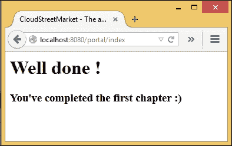

## 它是如何工作的...

第二个配方重新审视了`@RequestMapping`注释的使用。不再使用固定的 URI 作为路径值，而是使用开放模式(回退)。该方法还利用了我们以前没有使用的已配置的视图解析器。

### URI 模板图案

模板词在 Spring 术语中反复出现。它通常是指为了满足特定的实现或定制而被实例化的通用支持 Spring APIs(发出 REST HTTP 请求的 REST 模板、发送 JMS 消息的 JMS 模板、发出 SOAP webservices 请求的 WS 模板、JDBC 模板等等)。它们是开发者需要的连接核心特性的桥梁。

在这种情况下，URI 模板允许为控制器端点配置具有模式和变量的通用 URIs。有可能实例化将实现 URI 模板的 URI 构建器，但是开发人员可能在他们提供给`@RequestMapping`注释的支持中主要使用 URI 模板。

#### 蚂蚁式路径模式

我们已经利用这些类型的模式来定义回退处理程序方法的路径值:

```java
@RequestMapping(value="/*", ...)

```

这个带有`*`通配符的特殊案例允许 URI 在应用显示名称后以`/`开头的任何请求都有资格被这个方法处理。

通配符可以匹配一个字符、一个单词或一系列单词。考虑下面的例子:

```java
/portal/1, /portal/foo, /portal/foo-bar
```

一个限制是在最后一个序列中使用另一个斜杠:

```java
/portal/foo/bar
```

请记住与此处表格的不同之处:

<colgroup><col style="text-align: left"> <col style="text-align: left"></colgroup> 
| `/*` | 级别的所有资源和目录 |
| `/**` | 级别和子级别的所有资源和目录 |

我们在`cloudstreetmarket-webapp`应用中有意使用了单个通配符。对于其他类型的应用来说，将每个不匹配的 URI 重定向到一个默认的可能更合适。在我们这个强烈面向 REST 的单页面应用中，如果没有找到资源，最好用一个`404`错误通知客户端。

在路径模式末尾使用通配符并不是唯一的选择。如果需要，我们可以实现以下类型的模式:

```java
/portal/**/foo/*/bar  	
```

(但不用于后备目的)。

我们将看到 Spring MVC，选择一个处理程序，比较所有匹配的路径模式，并选择其中最具体的。

### Tip

在控制器类型级别，我们还没有指定一个`@RequestMapping`。如果我们这样做了，方法级的指定路径将被连接到类型级的路径(实现收缩)。

例如，下面的定义将为我们的回退控制器定义路径模式`/portal/default/*`:

```java
@RequestMapping(value="/default"...)
@Controller
public class DefaultController…{
      @RequestMapping(value="/*"...)
      public String fallback(Model model) {...}
}
```

#### 路径模式比较

当一个给定的 URL 匹配多个注册的 path-pattern 时，Spring MVC 会进行 pathpattern 比较，以选择请求将被映射到哪个处理程序。

### 注意

将选择被认为最具体的模式。

第一个标准是在比较的路径模式中计算的变量和通配符的数量:变量和通配符数量最少的模式被认为是最特定的。

要区分具有相同变量和通配符累积数量的两个路径模式，请记住，通配符数量最少的路径模式最具体，最长的路径最具体。

最后，有双通配符的模式总是不如没有双通配符的模式具体。

为了说明这个选择，让我们考虑以下从最具体到最不具体的层次结构:

`/portal/foo`

`/portal/{foo}`

`/portal/*`

`/portal/{foo}/{bar}`

`/portal/default/*/{foo}`

`/portal/{foo}/*`

`/portal/**/*`

`/portal/**`

#### ViewResolvers

在 **cloudstreetmarket-webapp** 的中，我们定义了`viewResolver` bean:

```java
<bean id="viewResolver" class="org.springframework.web.servlet.view.InternalResourceViewResolver">
  <property name="viewClass" value="org.springframework.web.servlet.view.JstlView" />
  <property name="prefix" value="/WEB-INF/jsp/" />
  <property name="suffix" value=".jsp" />
</bean>
```

一个`viewResolver` bean 是一个预定义类的特定实例，用于服务一组有组织的统一视图层。在我们配置的例子中，`viewResolver` bean 是`InternalResourceViewResolver`的一个实例，它可以服务 JSP 页面，处理 JSTL 和 tiles。这个类还继承了`UrlBasedViewResolver`，它可以导航应用资源，并且可以将一个逻辑视图名称绑定到一个视图资源文件。这个功能可以防止创建外部映射。

在我们的配置中，我们已经定义了视图存储库`(/WEB-INF/jsp/*.jsp)`，我们可以用字符串`index`直接引用`index.jsp`。

更好的做法是在`/WEB-INF`下建立 JSP 存储库，这样那些 JSP 就不会被公开。我们可以分别使用视图解析器`VelocityViewResolver`或`FreeMarkerViewResolver`来使用 Velocity 或 Freemarker，而不是 JSP 模板。

此外，我们将在稍后构建 REST API 时讨论`ContentNegotiatingViewResolver`。

## 还有更多...

本节特别强调@PathVariable 注释。这个注释是对控制器方法处理程序参数的注释(我们在前面的配方中已经介绍了所有这些参数)。

### @PathVariable 读取 URI 模板模式中的变量

在后面的几个例子中，您会发现方法级的`@RequestMapping`注释。这些注释有时会与方法处理程序参数上的`@PathVariable`注释相关。现在，让我们考虑下面的例子:

```java
@RequestMapping(value="/example/{param}")
public HttpEntity<String> example(@PathVariable("param") String parameter) {
  return new HttpEntity<>(parameter);
}
```

如前所述，`@PathVariable`告诉 Spring MVC 在哪里以及如何从请求 URI 中实现其作为参数的注入。该框架将解析当前的 URI 模板模式，提取名为`param`的变量，并将当前 URI 中的匹配值注入到目标方法参数中。

我们还声明返回一个`HTTPEntity`作为响应。这个`HTTPEntity`将是一个 String 泛型类型的包装器。在方法处理程序中，我们用必要的字符串元素实例化这个包装器。

如果我们调用`/portal/example/foo` URI，它将显示为返回的`HTTPEntity`主体的响应:字符串`foo`。

通过另一个有趣的特性，我们可以用下面的声明为`@PathVariable`构建最后一个场景:

```java
@RequestMapping(value="/example/{param}")
public HttpEntity<String> example(@PathVariable String param) {
  return new HttpEntity<>(param);
}
```

### Tip

Spring MVC 没有为注释提供值，默认情况下，它会在 URI 模板模式中查找与目标参数同名的变量。

我们将探索与`@RequestMapping`和`@PathVariable`相关的其他特性。

# 使用 Bootstrap 设置和定制响应式单页网页设计

Bootstrap 是由 Mark Otto 和 Jacob Thornton 在 Twitter 上创建的 UI 框架。它是样式、图标和行为的惊人来源，被抽象来定义和丰富组件。Bootstrap 为定义风格提供了一套简单、合理、统一的模式。它以前没有对等物。如果您从未使用过它，您会对从 DOM 的快速定义中获得如此多的视觉反馈感到兴奋。

2014 年 6 月，它是 GitHub 上排名第一的项目，拥有超过 73，000 颗星星和超过 27，000 个分叉。他们的文档非常流畅，易于浏览。

## 准备就绪

在这个菜谱中，我们将使用 Bootstrap 从现有的 Bootstrap 主题中为我们的 CloudStreet Market 项目设置 web 设计基础。我们将重新制作`index.jsp`页面，以呈现一个更好看的欢迎页面，可以用下面的截图预览。

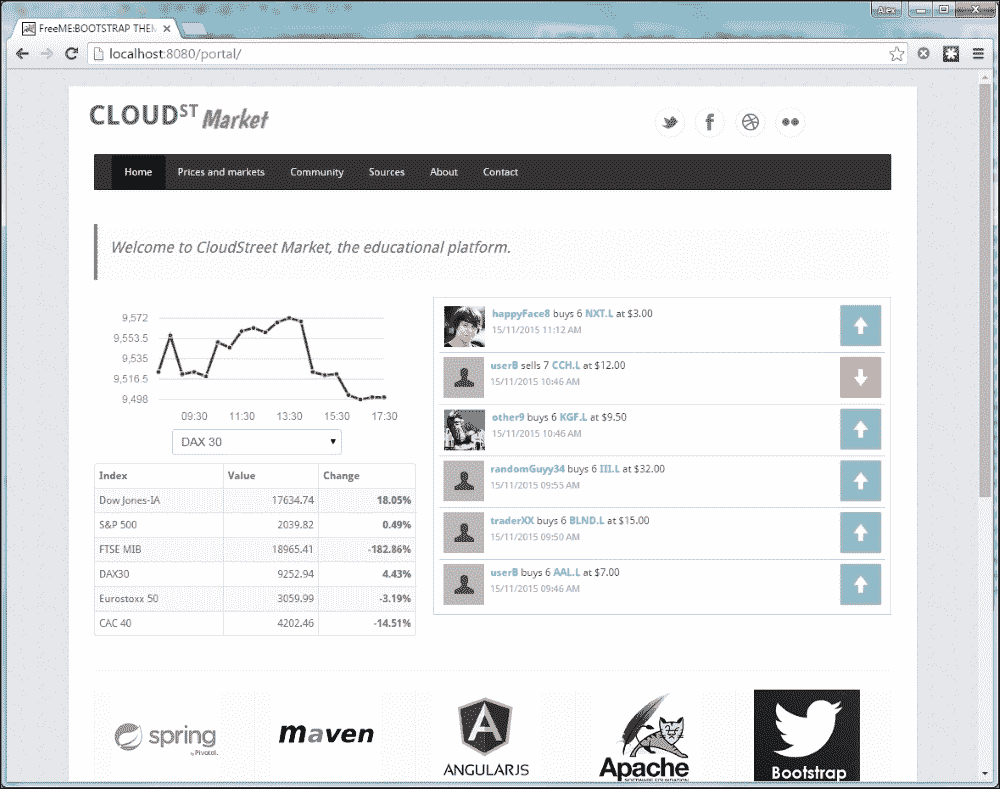

## 怎么做...

这个食谱有三个主要步骤:

*   安装引导主题
*   自定义引导主题
*   创建响应内容

从 Eclipse 中的 Git 角度来看，签出分支的最新版本`v2.x.x`:

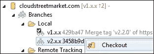

### 安装引导主题

1.  在的`chapter_2`目录下，你可以找到一个`freeme.zip`的存档。这是一个可免费下载的响应引导模板。这个 zip 来自 bootstrapmaster.com T4 网站。
2.  Inside this archive, you'll see a `css` directory, a `js` directory, an `img` directory, and finally an `index.html` file. Opening the `index.html` file with a web browser should render the following home page:

    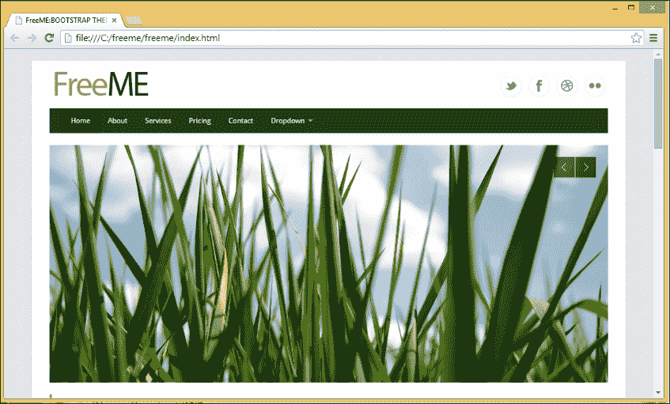

    我们使用这个模板作为 webapp 模块的基础。

3.  位于`freeme/js`目录中的所有 JavaScript 文件都被复制到了`/cloudstreetmarket-webapp/src/main/webapp/js`目录中。
4.  位于`freeme/css`目录中的所有 CSS 文件都被复制到了`/cloudstreetmarket-webapp/src/main/webapp/css`目录中。
5.  位于`freeme/img`的所有图片都被复制到了`/cloudstreetmarket-webapp/src/main/webapp/img` 目录中。
6.  `freeme/index.html`文件的内容已经复制粘贴到`/cloudstreetmarket-webapp/src/main/webapp/WEB-INF/jsp/index.jsp`文件中，作为 UTF-8。
7.  另外，`freeme/licence.txt`已经被复制并粘贴到了`/cloudstreetmarket-webapp/src/main/webapp/WEB-INF/jsp`目录中。
8.  在这个点，用 web 浏览器调用`http://localhost:8080/portal/index`显示了与您之前看到的完全相同的视觉效果，但是由我们的应用提供服务。

### 定制引导主题

我们将在本节中详细介绍为了使下载的模板适应我们的用例，已经做了哪些工作。

1.  先前位于`cloudstreetmarket-webapp\src\main\webapp\img\logos`的所有图片已被移除，取而代之的是六张新图片，代表我们在整个应用和本书中使用的技术产品品牌。
2.  在位于`cloudstreetmarket-webapp`模块的`index.jsp`文件中，实施了以下更改:
    1.  以下两行被添加到顶部:

        ```java
        <%@ page contentType="text/html;charset=UTF-8" language="java" %>
        <%@ page isELIgnored="false" %>
        ```

    2.  `<!-- start: Meta -->`部分已替换为以下内容:

        ```java
        <!-- start: Meta -->
        <meta charset="utf-8">
        <title>Spring MVC: CloudST Market</title> 
        <meta name="description" content="Spring MVC CookBook: Cloud Street Market"/>
        <meta name="keywords" content="spring mvc, cookbook, packt publishing, microservices, angular.js" />
        <meta name="author" content="Your name"/>
        <!-- end: Meta -->
        ```

    3.  `<!--start: Logo -->`部分已替换为以下内容:

        ```java
        <!--start: Logo -->
        <div class="logo span4">
          CLOUD<span class="sub">ST</span><span>Market</span>
        </div>
        <!--end: Logo -->
        ```

    4.  导航菜单定义已更改:

        ```java
        <ul class="nav">
          <li class="active"><a href="index">Home</a></li>
          <li><a href="markets">Prices and markets</a></li>
          <li><a href="community">Community</a></li>
          <li><a href="sources">Sources</a></li>
          <li><a href="about">About</a></li>
          <li><a href="contact">Contact</a></li>
        </ul>
        ```

    5.  `<!-- start: Hero Unit -->`和`<!-- start: Flexslider -->`部分被删除，导航菜单(`<!--end: Navigation-->`)后的`<div class="row">`被清空:

        ```java
        <!-- start: Row -->
        <div class="row"></div>
        <!-- end: Row -->
        ```

    6.  位于`<!-- end Clients List -->`之后的`<!-- start: Row -->`段至`<!-- end: Row -->`段已随其后的`<hr>`一起被移除。
    7.  页脚部分`<!-- start: Footer Menu -->`至`<!-- end: Footer Menu -->`已被替换为以下内容:

        ```java
        <!-- start: Footer Menu -->
        <div id="footer-menu" class="hidden-tablet hidden-phone">
          <!-- start: Container -->
          <div class="container">
            <!-- start: Row -->
            <div class="row">
              <!-- start: Footer Menu Logo -->
              <div class="span1">
              <div class="logoSmall">CLOUD<span class="sub">ST</span><span>M!</span>
                </div>
                </div>
              <!-- end: Footer Menu Logo -->
              <!-- start: Footer Menu Links-->
              <div class="span10" >
              <div id="footer-menu-links">
              <ul id="footer-nav" style="margin-left:35pt;">
                <li><a href="index">Home</a></li>
                <li><a href="markets">Prices and markets</a></li>
              <li><a href="community">Community</a></li>
                <li><a href="sources">Sources</a></li>
                <li><a href="about">About</a></li>
                <li><a href="contact">Contact</a></li>
                </ul>
                </div>
                </div>
                <!-- end: Footer Menu Links-->
                <!-- start: Footer Menu Back To Top -->
                <div class="span1">
                <div id="footer-menu-back-to-top">
                  <a href="#"></a>
                  </div>
                </div>
                <!-- end: Footer Menu Back To Top -->
            </div>
            <!-- end: Row -->
            </div>
          <!-- end: Container  -->	
        </div>	
        <!-- end: Footer Menu -->
        ```

    8.  章节:`<!-- start: Photo Stream -->`至`<!-- end: Photo Stream -->`已被替换为:

        ```java
        <!-- start: Leaderboard -->
        <div class="span3">
          <h3>Leaderboard</h3>
          <div class="flickr-widget">
            <script type="text/javascript" src=""></script>
            <div class="clear"></div>
          </div>
        </div>
        <!-- end: Leaderboard -->
        ```

    9.  作为`index.jsp`文件的最后一个变化，版权部分已经被修改。
3.  在之前复制的`cloudstreetmarket-webapp/src/main/webapp/css/style.css`文件中，添加了以下类:

    ```java
    .logo{
      font-family: 'Droid Sans';	font-size: 24pt; color: 	#666; width:157pt; font-weight:bold; margin-top:18pt; 	margin-left:10pt; height:30pt;
    }
    .logo span{
      position:relative;float:right; margin-top: 3pt;	font-weight:normal; font-family: 'Boogaloo'; font-	style:italic;	color: #89C236; padding-right: 3pt;
    }
    .logo .sub {
      vertical-align: super;	font-style:normal;font-size: 16pt; font-family: 'Droid Sans';	font-weight:bold; position: absolute;	color: #888; 	margin:-4pt 0 -4pt 0;
    }
    .logoSmall{
      font-family: 'Droid Sans';	font-size: 16pt; color: #888;width:80pt;	font-weight:bold; margin-top:10pt;height:20pt; margin-right:30pt;
    }
    .logoSmall span{
      position:relative;	float:right; margin-top: 3pt;
      font-weight:normal;font-family: 'Boogaloo';	font-style:italic;color: #89C236;
    }
    .logoSmall .sub {
      vertical-align: super;
      font-style:normal;	font-size: 10pt;font-family: 'Droid Sans';font-weight:bold;position: absolute; color: #666;margin:-2pt 0 -4pt 0;
    }
    ```

4.  At this point, after all these changes, restarting Tomcat and calling the same URL `http://localhost:8080/portal/index` resulted in the following state:

    

### 创建响应性内容

在这一部分，我们将重点介绍为用响应内容填充欢迎页面所做的更改。通过响应，理解内容将在适合设备大小和方向的样式下呈现。

1.  在`index.jsp`文件中:
    1.  The `<div class="row">` has been added the following content:

        ```java
        <div class='span12'>
          <div class="hero-unit hidden-phone"><p>Welcome to CloudStreet Market, the educational platform.</p></div>
        </div>
        <div class='span5'>
            <div id='landingGraphContainer'></div>
            <div id='tableMarketPrices'>
              <table class="table table-hover table-condensed table-bordered table-striped">
                <thead>
                  <tr>
                    <th>Index</th>
                    <th>Value</th>
                    <th>Change</th>
                  </tr>
                 </thead>
                 <tbody>
               <tr>
                   <td>Dow Jones-IA</td><td>17,634.74</td>
                   <td class='text-success'><b>-18.05</b></td>
                    </tr>
                    ...
                    <tr>
                      <td>FTSE MIB</td><td>18,965.41</td>
                      <td class='text-error'><b>-182.86</b></td>
                    </tr>
                    ...
                </tbody>
                </table>
              </div>
        </div>
        <div id="containerCommunity" class='span7'>
            <div id="divRss3"></div>
        </div>
        ```

        ### 注意

        在之前添加的*landing graph container*中，我们已经插入了一个生成的图形，该图形呈现了特定市场在最后一个开市日的演变。该图使用了`morris.js` 库([http://morrisjs.github.io/morris.js](http://morrisjs.github.io/morris.js))，它也依赖于`raphael.js` 库([https://cdnjs.com/libraries/raphael](https://cdnjs.com/libraries/raphael))。

    2.  在文件底部的`<!-- start: Java Script -->`部分到`<!-- end: Java Script -->`部分增加了以下内容:

        ```java
        <script src="js/jquery-1.8.2.js"></script>
        <script src="js/bootstrap.js"></script>
        <script src="js/flexslider.js"></script>
        <script src="js/carousel.js"></script>
        <script def src="js/custom.js"></script>
        <script src="js/FeedEk.js"></script>
        <script src="js/raphael.js"></script>
        <script src="js/morris.min.js"></script>
        <script>
        $(function () {
            var financial_data = [
             {"period": "08:00", "index": 66},{"period": "09:00", "index": 62},
        	 {"period": "10:00", "index": 61},{"period": "11:00", "index": 66},
             {"period": "12:00", "index": 67},{"period": "13:00", "index": 68},
             {"period": "14:00", "index": 62},{"period": "15:00", "index": 61},
             {"period": "16:00", "index": 61},{"period": "17:00", "index": 54}
            ];
            Morris.Line({
              element: 'landingGraphContainer',
              hideHover: 'auto', data: financial_data,
              ymax: 70, ymin: 50,
              pointSize: 3, hideHover:'always',
              xkey: 'period', xLabels: 'month',
              ykeys: ['index'], postUnits: '',
              parseTime: false, labels: ['Index'],
              resize: true, smooth: false,
              lineColors: ['#A52A2A']
            });
        });
        </script>
        ```

2.  在`cloudstreetmarket-webapp\src\main\webapp\js` 目录中，`morris.min.js``raphael.js`库已经从各自的网站复制粘贴。
3.  回到`index.jsp`文件:
    1.  先前创建的`<div id='containerCommunity'>`已经填充了以下内容:

        ```java
        <div id="divRss3">
          <ul class="feedEkList">
            <li>
            <div class="itemTitle">
              <div class="listUserIco">
                
              </div>
              <span class="ico-white ico-up-arrow   listActionIco 	actionBuy"></span>
                <a href="#">happyFace8</a> buys 6 <a href="#">NXT.L</a> at $3.00
                <p class="itemDate">15/11/2014 11:12 AM</p>
            </div>
            </li>
            <li>
            <div class="itemTitle">
              <div class="ico-user listUserIco"></div>
              <span class="ico-white ico-down-arrow listActionIco actionSell"></span>
              <a href="#">actionMan9</a> sells 6 <a href="#">CCH.L</a> at $12.00
              <p class="itemDate">15/11/2014 10:46 	AM</p>
            </div>
            </li>
              ...
          </ul>
        </div>
        ```

    2.  这里的部分使用了 feedEk jQuery 插件。它自带 CSS 和 JavaScript 文件。
4.  `cloudstreetmarket-webapp\src\main\webapp\js`目录包括与 feedEk jQuery 插件相关的`FeedEk.js`文件。这个插件可以在网上找到【http://jquery-plugins.net/FeedEk/FeedEk.html】()。
5.  `cloudstreetmarket-webapp\src\main\webapp\css`目录下也有相关的`FeedEk.css`文件。
6.  还是在`index.jsp`中，在`<!-- start: CSS -->` 评论下，已经添加了`FeedEk css`文档:

    ```java
    <link href="css/FeedEk.css" rel="stylesheet">
    ```

7.  在`style.css`文件中，在第一个媒体查询定义`(@media only screen and (min-width: 960px)`之前，增加了以下样式定义:

    ```java
    .listUserIco {
        background-color:#bbb;
        float:left;
        margin:0 7px 0 0;
    }
    .listActionIco {
        float:right; 
        margin-top:-3px;
    }
    .actionSell {
        background-color:#FC9090;
    }
    .actionBuy {
        background-color:#8CDBA0;
    }
    #landingGraphContainer{
        height:160px;
        padding: 0px 13px 0 10px;
    }
    .tableMarketPrices{
        padding: 13px 13px 0 15px;
    }
    ```

8.  最后，两个新的图像(个人资料图片)已被添加到`cloudstreetmarket-webapp\src\main\webapp\img`。
9.  Try to dynamically resize a browser window that renders: `http://localhost:8080/portal/index`. You should observe a responsive and adaptive style as in the following picture:

    

## 它是如何工作的...

为了理解我们的引导部署，我们现在将回顾它是如何作为预先设计的主题安装的。然后，我们将发现 Bootstrap 框架的一些关键特性——不仅仅是已实现的特性，因为从逻辑上讲，框架中只有少数特性可以在一个页面示例中直观地使用。

### 主题装置

我们得到的主题只不过是一个经典的静态主题，因为你可以在互联网上找到数以千计的主题。它们是由网页设计师制作的，可以免费或以商业方式分发。这个是用 HTML 文件的基本结构，一个 JS 目录，一个 CSS 目录和一个 IMG 目录做的。

主题安装非常容易理解，因为我们已经将 JavaScript 文件、CSS 文件和图像放在了应用的预期位置。

### Tip

引导核心特性自包含在`bootstrap.js`、`bootstrap.css`和`bootstrap-responsive.css`中。您不应该真的必须直接调整这些文件。

### 引导程序突出显示

实现的主题(FreeME)使用 Bootstrap 2。我们将回顾一些已经在模板中实现的特性，以满足我们项目的需求。

#### 自助脚手架

Bootstrap 脚手架帮助设计通常由网格模型构建的 HTML 结构。关于这个主题的引导策略将在下面的章节中描述。

##### 网格系统与响应式设计

Bootstrap 提供了一个样式框架来处理特定于页面的网格系统。关键点在于由 12 列组成的默认网格系统，它是为 940px 宽的无响应容器设计的。

使用`<meta name="viewport"…>`标签和导入`boostrap-responsive.css`文件激活引导响应功能。在这种情况下，容器宽度可以从 724px 扩展到 1170px。

### Tip

此外，在 767px 以下，柱子变成流体并垂直堆叠。

这些 Bootstrap 规范定义了一组非常严格的约束，但 Bootstrap 以某种方式为其实现创建了易于理解的设计一致性。

在我们的模板中，viewport 元标记如下:

```java
<meta name="viewport" content="width=device-width, initial-scale=1, maximum-scale=1">
```

### 注意

如果您不熟悉这个标记，它的主要目的是在文档中定义特定于设备的大小。根据这些大小，为特定于方向和特定于设备的渲染定义规则。这些绑定到样式定义的规则被称为媒体查询。您可以在 style.css 文件中找到 mediaquery 的示例:

```java
/* Higher than 960 (desktop devices)
================================================================ */
@media only screen and (min-width: 960px) {
...
  #footer-menu {
    padding-left: 30px;
    padding-right: 30px;
    margin-left: -30px;
    margin-right: -30px;
  }
...
}
```

仅当设备宽度大于 960 像素时，此媒体查询才会覆盖 id 页脚菜单的特定样式。

##### 定义列

为了在网格系统中定义列，Bootstrap 引导我们使用一个被标记为`row`类元素的`row` div。然后，想法是定义用定制的`span*`类元素标记的细分，其中`*`字符代表我们必须处理的 12 列网格的细分。

例如，考虑以下两种可能的设计:

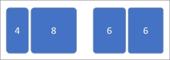

左边例子中的两列可以从 DOM 定义中呈现出来:

```java
<div class="row">
  <div class="span4">...</div>
  <div class="span8">...</div>
</div>
```

右侧示例中的两列可以从 DOM 定义中呈现:

```java
<div class="row">
  <div class="span6">...</div>
  <div class="span6">...</div>
</div>
```

考虑到这一点，我们的欢迎页面的网格实际如下:

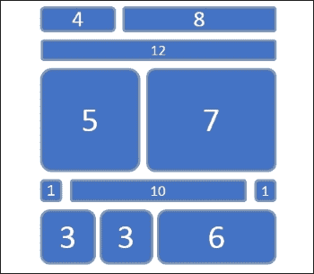

##### 偏移和嵌套

偏移一个列允许您创建一个固定大小的衰减，对应于一个或多个不可见的列。例如，考虑下面的代码片段:

```java
<div class="row">
    <div class="span6">...</div>
    <div class="span4 offset2">...</div>
</div>
```

该 DOM 定义将对应于以下各列:


一列也可以嵌套在另一列中，重新定义一个新行。新创建的列的总和必须对应于父列的大小:

```java
<div class="row">
   <div class="span6">
      <div class="row">
        <div class="span2">...</div>
        <div class="span4">...</div>
      </div>
   </div>
</div>
```

##### 流体网格

我们之前说过在 Boostrap2 中，低于 767px *的柱子变成流体，垂直堆叠*。模板网格化可以从静态变为流体化`.row`类到`.row-fluid`类。该系统将使用百分比，而不是固定像素大小的列。

#### 引导 CSS 实用程序

Bootstrap 还提供了一些预设计的元素，如按钮、图标、表格、表单以及支持排版或图像的实用程序。

##### 制服纽扣

默认样式的按钮可以从`<a>`和`<button>`标签创建，只需添加`.btn`类元素。然后，创建的带有渐变的默认灰色按钮可以用不同的颜色变化来拒绝。例如，**默认为**，下面的班级组合:

*   这将产生一个强烈的群青蓝色按钮，以在其他按钮中识别主要动作
*   这产生了一个适度的蓝绿色按钮
*   这产生了一个肯定的绿色按钮
*   `.btn .btn-warning`:这将产生一个警告橙色按钮
*   这产生了一个危险的红色按钮
*   这将产生一个带有白色文本的黑色按钮
*   `.btn .btn-link`:这个在保持按钮行为的同时产生一个链接

这些按钮也可以通过添加一个`.btn-large`类、添加一个`.btn-small`类或添加一个`.btn-mini`类来以声明方式调整大小:


可以通过添加一个**禁用**属性来禁用一个按钮。类似地，`<a>`标记的按钮可以通过添加一个`.disabled`类来禁用。我们还没有使用按钮，但这是一个很棒的特性。

##### 图标

Bootstrap 2 附带了令人印象深刻的 140 个深灰色图标，由 Glyphicons 提供:


### Tip

这些图标通常在市场上可以买到，但是它们也可以作为引导产品的一部分免费使用。然而，自举要求我们提供一个可选的反向链接到[http://glyphicons.com](http://glyphicons.com)。

所有这些图标都可以从 DOM 中用一个简单的类`<i>`标签如`<i class="icon-search"></i>`中的提取出来。

令人惊奇的是，你可以将这些图标嵌入到每一个合适的引导组件中。例如，按钮定义:`<a class="btn btn-mini" href="#"><i class="icon-star"></i> Star</a>`，产生如下内容:


##### 表格

我们实施了一个引导表，用于市场活动概述。我们基本上形成了下表:

```java
<table class="table table-hover table-condensed table-bordered table-striped">
  <thead>
    <tr><th>Index</th>
       <th>Value</th>
       <th>Change</th></tr>
  </thead>
  <tbody>
      <tr><td>...</td>
       <td>...</td>
       <td>...</td>
    </tr>
  </tbody>
</table>
```

同样，我们可以定义一个被定制类覆盖的按钮类，我们用类`.table`定义了一个通用引导表，然后我们使用了以下定制类:

*   `.table .table-hover`:这将在`<tbody>`内的表格行上启用悬停状态
*   这使得桌子更加紧凑
*   `.table .table-bordered`:给表格添加边框和圆角
*   `.table .table-striped`:这个为`<tbody>`中的任何表格行添加斑马条纹

#### 引导组件

该框架具有被标识为组件的其他预先设计的元素。其中包括下拉菜单、按钮组、面包屑、分页、导航条、标签和徽章、缩略图、提醒、进度条等等。这里我们只介绍其中的一部分:

##### 导航栏

引导导航条支持基本的导航菜单。默认情况下，它们不固定在页面的顶部；它们必须包含在`.container`中。代码如下:

```java
<div class="navbar navbar-inverse">
  <div class="navbar-inner">
  ...
  <ul class="nav">
    <li class="active"><a href="index">Home</a></li>
    <li><a href="markets">Prices and markets</a></li>
    <li><a href="community">Community</a></li>
    <li><a href="sources">Sources</a></li>
    <li><a href="about">About</a></li>
    <li><a href="contact">Contact</a></li>
  </ul>
...
```

导航栏中最基本的功能是可激活的链接:


上面的例子可以根据下面的 DOM 定义来设计:

```java
<ul class="nav">
     <li class="active"><a href="#">Home</a></li>
     <li><a href="#">Link</a></li>
</ul>
```

我们强烈建议阅读引导文档。可以找到关于如何实现其他特性的更多细节。例如，Bootstrap 提供工具用于:

*   表单元素，如输入文本、搜索字段和提交按钮。
*   不同的定位变化，例如固定到顶部(用`.navbar-fixed-top`)、固定到底部(用`.navbar-fixed-bottom`)、与页面一起滚动的全幅导航条相反(用`.navbar-static-top`)。
*   可折叠的响应导航条(`.nav-collapse.collapse`)，可节省大量空间。通过使用 data-toggle HTML5 属性，无需额外的 JavaScript 配置即可执行动态处理。

##### 英雄单位

在提供的模板中定义了一个英雄单位。我们只是稍微移动了一下，以适应我们的响应需求。

它是一个轻量级的、灵活的组件，用来展示你的站点上的关键内容。


上面的例子可以根据下面的 DOM 定义来设计:

```java
<div class="hero-unit"><p>Welcome to CloudStreet Market, the educational platform.</p></div>
```

##### 警报

引导警告对于快速生成警告消息或其他上下文消息的预定义样式非常有用。一个引导警告带有一个可选的解除按钮(它将隐藏警告，不需要额外的 JavaScript 配置)。代码如下:

```java
<div class="alert">
    <button type="button" class="close" data-dismiss="alert">&times;</button>
    <strong>Warning!</strong> Best check yo self, you're not looking too good.
</div>
```

这个定义产生了这里显示的输出:


在`<div>`标签上用类`.alert` 定义了一个警告，从这里可以设置上下文颜色变化，提供额外的覆盖类，如`.alert-success`、`.alert-info`或。`alert-error`。

##### 徽章和标签

引导标签非常适合丰富内容。它们在列表或表格中表现得特别好。点击此处查看可能的上下文变化概述:


这里的标签将定义为:

```java
<span class="label">Default</span>
<span class="label label-success">Success</span>
<span class="label label-important">Important</span>
…
```

徽章的定义如下:

```java
<span class="badge">1</span>
<span class="badge badge-warning">4</span>
<span class="badge badge-important">6</span>
…
```

## 还有更多...

为了丰富官方文档，Bootstrap 的内容远不止这些。同样，官方文档做得非常好，非常容易理解。

访问[http://getbootstrap.com](http://getbootstrap.com)获取与最新支持版本的框架相关的文档。前往[http://getbootstrap.com/2.3.2](http://getbootstrap.com/2.3.2)获取与我们在项目中使用的版本相关的文档。

我们将在接下来的章节中实现更多的特性，并尽可能地强调它们。

## 参见

如果您喜欢 Bootstrap，并且希望在您的项目中使用它，那么您必须考虑版本 3。

### Tip

Bootstrap 3 并不直接与 Bootstrap 2 兼容，但它实现了一个非常相似的网格系统和略微不同的标记。

*   **Bootstrap 3 新特性**:这里有一个从 Bootstrap 2 到 Bootstrap 3 重要变化的预览。
*   **新的扁平化设计**:随着 3D 的结束，按钮、导航条和其他菜单上的纹理，新的设计很容易被注意到。他们现在追求一种没有渐变的新的平面风格。这当然符合实际的全球设计趋势。
*   **列命名 span*重命名为 col-*** :为了减少混淆，除了不再提供的 row-fluid 类(所有行现在都是自动流动的)之外，还重新考虑了列命名模式以提高一致性。
*   **移动优先**:框架的响应式特性现在原生包含在`bootstrap.js`和`bootstrap.css`文件中(不再有`bootstrap-responsive.js`或`bootstrap-responsive.css`)。现在可以使用一组新的特定于设备的类直接从 DOM 驱动媒体查询任务。

# 使用 JSTL 在视图中显示模型

这个配方展示了如何用数据填充 Spring MVC 视图，以及如何在视图中呈现这些数据。

## 准备就绪

在这一点上，我们没有任何真实的数据显示在我们的视图中。为此，我们创建了三个 dto 和两个服务层，它们从接口注入到控制器中。

有两个虚拟服务实现被设计用来产生一组虚假的数据。我们将使用**Java 服务器标签库** ( **JSTL** )和 **JSP 表达式语言** ( **JSP EL** )在 JSP 中的正确位置呈现服务器数据。

## 怎么做...

1.  After checking out the `v2.x.x` branch (in the previous recipe), a couple of new components are now showing-up in the **cloudstreetmarket-core** module: two interfaces, two implementations, one enum, and three DTOs. The code is as follows:

    ```java
    public interface IMarketService {
      DailyMarketActivityDTO getLastDayMarketActivity(String string);
      List<MarketOverviewDTO> getLastDayMarketsOverview();
    }
        public interface ICommunityService {
        List<UserActivityDTO> getLastUserPublicActivity(int number);
    }
    ```

    如所示，它们指的是三个创建的 dto:

    ```java
    public class DailyMarketActivityDTO {
      String marketShortName;
      String marketId;
      Map<String, BigDecimal> values;
      Date dateSnapshot;
      ... //and constructors, getters and setters
    }
    public class MarketOverviewDTO {
      private String marketShortName;
      private String marketId;
      private BigDecimal latestValue;
      private BigDecimal latestChange;
      ... //and constructors, getters and setters
    }
    public class UserActivityDTO {
      private String userName;
      private String urlProfilePicture;
      private Action userAction;
      private String valueShortId;
      private int amount;
      private BigDecimal price;
      private Date date;
      ... //and constructors, getters and setters
    }
    ```

    这个最后的 DTO 指的是`Action`枚举:

    ```java
    public enum Action {
      BUY("buys"), SELL("sells");
      private String presentTense;
        Action(String present){
      presentTense = present;
      }
        public String getPresentTense(){
        return presentTense;
      }
    }
    ```

    另外，先前在`cloudstreetmarket-webapp`中创建的 `DefaultController`的已经被修改成如下样子:

    ```java
    @Controller
    public class DefaultController {
      @Autowired
      private IMarketService marketService;
      @Autowired
      private ICommunityService communityService;
      @RequestMapping(value="/*", method={RequestMethod.GET,RequestMethod.HEAD})
      public String fallback(Model model) {
        model.addAttribute("dailyMarketActivity", marketService.getLastDayMarketActivity("GDAXI"));
        model.addAttribute("dailyMarketsActivity", marketService.getLastDayMarketsOverview());
        model.addAttribute("recentUserActivity", communityService.getLastUserPublicActivity(10));
        return "index";
      }
    }
    ```

    有两个虚拟实现:

    ```java
    @Service
    public class DummyMarketServiceImpl implements IMarketService {
        private DateTimeFormatter formatter = DateTimeFormatter.ofPattern("yyyy-MM-dd HH:mm");
        public DailyMarketActivityDTO 
        getLastDayMarketActivity(String string){
        Map<String, BigDecimal> map = new HashMap<>();
        map.put("08:00", new BigDecimal(9523));
        map.put("08:30", new BigDecimal(9556));
        ...
        map.put("18:30", new BigDecimal(9758));
        LocalDateTime ldt = LocalDateTime.parse("2015-04-10 17:00", formatter);
        return new DailyMarketActivityDTO("DAX 30","GDAXI", map, Date.from(ldt.toInstant(ZoneOffset.UTC)));
      }
        @Override
      public List<MarketOverviewDTO> getLastDayMarketsOverview() {
          List<MarketOverviewDTO> result = Arrays.asList(
          new MarketOverviewDTO("Dow Jones-IA", "DJI", new BigDecimal(17810.06), new BigDecimal(0.0051)),
          ...
          new MarketOverviewDTO("CAC 40", "FCHI", new BigDecimal(4347.23), new BigDecimal(0.0267))
        );
        return result;
      }
    }
      @Service
    public class DummyCommunityServiceImpl implements ICommunityService {
      private DateTimeFormatter formatter = DateTimeFormatter.ofPattern("yyyy-MM-dd HH:mm");
        public List<UserActivityDTO> getLastUserPublicActivity(int number){
          List<UserActivityDTO> result = Arrays.asList(
          new UserActivityDTO("happyFace8", "img/young-lad.jpg", Action.BUY, "NXT.L", 6, new BigDecimal(3), LocalDateTime.parse("2015-04-10 11:12", formatter)),
          ...
           new UserActivityDTO("userB", null, Action.BUY, "AAL.L", 7, new BigDecimal(7), LocalDateTime.parse("2015-04-10 13:29", formatter))
          );
        return result;
      }
    }
    ```

    `index.jsp`已更改，在图形容器下增加了以下部分:

    ```java
    <div class='morrisTitle'>
      <fmt:formatDate value="${dailyMarketActivity.dateSnapshot}" pattern="yyyy-MM-dd"/>
    </div>
    <select class="form-control centeredElementBox">
      <option value="${dailyMarketActivity.marketId}"> ${dailyMarketActivity.marketShortName}
      </option>
    </select> 
    ```

    增加了市场概况表，尤其是正文:

    ```java
    <c:forEach var="market" items="${dailyMarketsActivity}">
      <tr>
        <td>${market.marketShortName}</td>
        <td style='text-align: right'>
          <fmt:formatNumber type="number" maxFractionDigits="3" value="${market.latestValue}"/>
      </td>
       <c:choose>
          <c:when test="${market.latestChange >= 0}">
          <c:set var="textStyle" scope="page" value="text-success"/>
          </c:when>
          <c:otherwise>
            <c:set var="textStyle" scope="page" value="text-error"/>
          </c:otherwise>
        </c:choose>        
          <td class='${textStyle}' style='text-align: right'>
            <b><fmt:formatNumber type="percent" maxFractionDigits="2" value="${market.latestChange}"/>
        </b>
      </td>
      </tr>
    </c:forEach>
    ```

    添加了社区活动的容器:

    ```java
    <c:forEach var="activity" items="${recentUserActivity}">
       <c:choose>
         <c:when test="${activity.userAction == 'BUY'}">
           <c:set var="icoUpDown" scope="page" value="ico-up-arrow actionBuy"/>
         </c:when>
         <c:otherwise>
           <c:set var="icoUpDown" scope="page" value="ico-down-	arrow actionSell"/>
         </c:otherwise>
        </c:choose>
        <c:set var="defaultProfileImage" scope="page" value=""/>
        <c:if test="${activity.urlProfilePicture == null}">
        <c:set var="defaultProfileImage" scope="page" value="ico-user"/>
        </c:if>
      <li>
      <div class="itemTitle">
        <div class="listUserIco ${defaultProfileImage}">
          <c:if test="${activity.urlProfilePicture != 	null}">
        
    </c:if>
    </div>
      <span class="ico-white ${icoUpDown} listActionIco"></span>
    <a href="#">${activity.userName}</a> 
    ${activity.userAction.presentTense} ${activity.amount} 
      <a href="#">${activity.valueShortId}</a> 
      at $${activity.price}
        <p class="itemDate">
          <fmt:formatDate value="${activity.date}" pattern="dd/MM/yyyy hh:mm aaa"/>
        </p>
        </div>
      </li>
    </c:forEach>
    ```

    在文件的底部,现在从服务器填充了一组硬编码的 JavaScript 数据:

    ```java
    <script>
      var financial_data = [];
      <c:forEach var="dailySnapshot" items="${dailyMarketActivity.values}">
      financial_data.push({"period": '<c:out value="${dailySnapshot.key}"/>', "index": <c:out value='${dailySnapshot.value}'/>});
      </c:forEach>
    </script>
    <script>
      $(function () {
        Morris.Line({
          element: 'landingGraphContainer',
          hideHover: 'auto', data: financial_data,
          ymax: <c:out value="${dailyMarketActivity.maxValue}"/>,
          ymin: <c:out value="${dailyMarketActivity.minValue}"/>,
          pointSize: 3, hideHover:'always',
          xkey: 'period', xLabels: 'month',
          ykeys: ['index'], postUnits: '',
          parseTime: false, labels: ['Index'],
          resize: true, smooth: false,
          lineColors: ['#A52A2A']
        });
    });
    </script>
    ```

## 它是如何工作的...

这些变化并没有产生基本的 UI 改进，但是它们为我们的视图层塑造了数据供应。

### 处理我们数据的方法

我们将在这里回顾数据提供实现的服务器端。

#### 通过接口注入服务

预测应用需要向 frontpage 提供动态数据，因此选择在控制器中注入两个服务层`marketService`和`communityService`。问题是我们还没有一个合适的数据访问层。(这将在[第 4 章](4.html "Chapter 4\. Building a REST API for a Stateless Architecture")、*为无状态架构构建 REST API*中讨论！).不过，我们需要连接控制器来呈现首页。

连接控制器需要松散地耦合到它的服务层。根据本章中创建虚拟服务实现的想法，已经使用接口设计了连接。然后，我们依靠 Spring 在服务依赖项中注入预期的实现，用相关的接口进行类型化。

```java
@Autowired
private IMarketService marketService;
@Autowired
private ICommunityService communityService;
```

注意类型`IMarketService`和`ICommunityService`，不是`DummyCommunityServiceImpl`也不是`DummyMarketServiceImpl`。否则，当切换到真正的实现时，我们将被束缚于这些类型。

#### Spring 如何选择虚拟实现？

它在**cloudstreetmarket-core**Spring 上下文文件:`csmcore-config.xml`中选择这些实现。我们已经在前面定义了 beans:

```java
<context:annotation-config/>
<context:component-scan base-package="edu.zipcloud.cloudstreetmarket.core" />  
```

Spring 扫描所有匹配根包`edu.zipcloud.cloudstreetmarket.core` 的类型，以找到原型和配置注释。

与用`@Controller` 注释标记`DefaultController`的方式相同，我们的两个虚拟实现类用`@Service`标记，这是一个 Spring 原型。在检测到的原型和 beans 中，虚拟实现是唯一可用于注入配置的实现:

```java
@Autowired
private IMarketService marketService;

@Autowired
private ICommunityService communityService;
```

由于每个字段只有一个相应的匹配，Spring 无需任何额外的配置就可以选择它们。

#### 视图层中使用的 dto

我们已经利用 dto 获取 JSP 中的变量。当涉及到同时维护几个版本时，公开的 dto 在 web 服务中特别有用。更一般地说，当目标和目的地对象显著不同时，就实现 dto。

稍后我们将实现**实体**。最好不要在渲染或特定于版本的逻辑中使用这些**实体**，而是将它们委托给专用于此目的的层。

但是，必须指出，创建 DTO 层会产生大量与类型转换相关的样板代码(影响双方、其他层、测试等等)。

#### 虚拟服务实现

使用`getLastDayMarketActivity`方法的 `DummyMarketServiceImpl`实现构建了一个活动图(由与市场、指数的价值相关联的静态每日时间组成)。它返回一个新的`DailyMarketActivityDTO`实例(从这个图构建)，它最终是一个包装器，承载一个单一市场或指数(如 DAX 30)的日常活动。

`getLastDayMarketsOverview`方法返回一个也是由硬编码数据构建的 `MarketOverviewDTOs`列表。它模拟了几个市场(指数)的日常活动概况。

带有`getLastUserPublicActivity` 方法的`DummyCommunityServiceImpl`实现返回一个实例化的`UserActivityDTO`列表，该列表模拟最近六次登录的用户活动。

### 在控制器中填充模型

在这一章的第一个配方中介绍了可能的方法处理程序参数，我们已经看到它可以作为参数注入到模型中。这个模型可以用方法中的数据填充，它将透明地传递给期望的视图。

这就是我们在`fallback`方法处理程序中所做的。我们已经将来自服务层的三个结果传递到三个变量`dailyMarketActivity`、`dailyMarketsActivity`和`recentUserActivity`中，因此它们可以在视图中使用。

### 用 JSP EL 渲染变量

JSP 表达式语言允许我们访问存储在 **JavaBeans 组件**中的应用数据。用于访问变量`${recentUserActivity}`或`${dailyMarketActivity.marketShortName}`的符号`${…}`通常是 JSP EL 符号。

当我们想要访问一个对象的属性时，需要记住的重要一点是 object 类必须为目标属性提供 JavaBeans 标准的 getters。

换句话说，`dailyMarketActivity.marketShortName` 在`MarketOverviewDTO`类中引用一个预期的:

```java
public String getMarketShortName() {
  return marketShortName;
}
```

#### 隐含对象

JSP EL 还提供隐式对象，可用作 JSP 中的快捷方式，无需在模型中进行任何声明或预填充。在这些隐式对象中，不同的作用域 pageScope、requestScope、sessionScope 和 applicationScope 反映了相关作用域中的属性映射。

例如，考虑以下属性:

```java
request.setAttribute("currentMarket", "DAX 30");
request.getSession().setAttribute("userName", "UserA");
request.getServletContext().setAttribute("applicationState", "FINE");
```

这些可以分别在 JSP 中通过以下方式访问:

```java
${requestScope["currentMarket"]}
${sessionScope["username"]}
${applicationScope["applicationState"]}
```

其他有用的隐式对象有请求头的映射:`header`(即`${header["Accept-Encoding"]}`)、请求 cookies 的映射:`cookies`(即`${cookie["SESSIONID"].value}`)、请求参数的映射:`param`(即`${param["paramName"]}`)或者上下文初始化参数的映射(从`web.xml` ) `initParam`(即`${initParam["ApplicationID"]}`)。

最后，JSP EL 提供了几个基本操作符:

*   **算术** : `+`、`-` (二进制)、`*`、`/`与`div`、`%`与`mod`、`-`(一进制)。
*   **逻辑** : `and`，`&&`，`or`，`||`，`not`，`!`。
*   **关系** : `==`，`eq`，`!=`，`ne`，`<`，`lt`，`>`，`gt`，`<=`，`ge`，`>=`，`le`。

可以与其他值进行比较，也可以与布尔值、字符串、整数或浮点文字进行比较。

*   **Empty**:Empty 运算符是一个前缀运算，可以用来判断一个值是 null 还是空。
*   **有条件的** : `A ? B : C`。

根据对`A`的评估结果，评估`B`或`C`。

对操作符的描述来自 JavaEE 5 教程。

### 用 JSTL 渲染变量

JSP 标准标签库 ( **JSTL** )是 JSP 页面的工具集合。这并不是 Java web 的一个全新的特性，但是仍然在使用。

当我们需要显示逻辑时，或者当我们需要格式化数据或在视图层中构建层次结构时，使用最多的标签可能是 Core 和 I18N。

<colgroup><col style="text-align: left"> <col style="text-align: left"> <col style="text-align: left"> <col style="text-align: left"></colgroup> 
| 

面积

 | 

功能

 | 

标签

 | 

描述

 |
| --- | --- | --- | --- |
| `Core` | `Variable support` | `c:set``c:remove` | 设置/取消设置范围内的变量。 |
| `Flow control` | `c:choose``c:when``c:otherwise` | 实现条件块 IF/THEN/ELSE。 |
| `c:if` | 实现条件 IF 块。 |
| `c:forEach` | 迭代集合类型。 |
| `c:forTokens` | 遍历由提供的分隔符分隔的标记。 |
| `URL management` | `c:import``c:param` | 解析 URL，将其内容导入到页面、变量(var)或变量阅读器(varReader)中。可以使用 param 将参数传递给基础资源。 |
| `c:redirect``c:param` | 重定向到一个 URL。可以传递参数。 |
| `c:url``c:param` | 创建一个 URL。可以分配参数。 |
| `Miscellaneous` | `c:catch` | 捕捉发生在其区块中的任何可投掷物。 |
| `c:out` | 获取表达式或变量。 |
| `I18N` | `Setting Locale` | `fmt:setLocale``fmt:requestEncoding` | 存储特定范围内的区域设置。为页面的 HTTP 请求设置编码类型。 |
| `Messaging` | `fmt:bundle``fmt:message``fmt:param``fmt:setBundle` | 为特定标记或范围设置包。检索消息，输出其内容，传递可选参数。 |
| `Number and Date Formatting` | `fmt:formatNumber``fmt:formatDate``fmt:parseDate``fmt:parseNumber``fmt:setTimeZone``fmt:timeZone` | 以不同格式输出不同内容。解析日期和数字。为特定标记或范围设置时区。 |

这些呈现的标签并不是 JSTL 的唯一功能，请访问 Java EE 教程了解更多细节:

[http://docs.oracle.com/javaee/5/tutorial/doc/bnakc.html](http://docs.oracle.com/javaee/5/tutorial/doc/bnakc.html)

#### JSP 中的 Taglib 指令

如果我们计划使用上述标签中的一个或另一个，我们首先需要在 JSP 页面中包含合适的指令:

```java
<%@ taglib uri="http://java.sun.com/jsp/jstl/core" prefix="c" %>
<%@ taglib uri="http://java.sun.com/jsp/jstl/fmt" prefix="fmt" %>
```

## 还有更多...

### 关于 JSP EL 的更多信息

JSP EL 覆盖了更多的特性。请随意阅读甲骨文教程，如[http://docs.oracle.com/javaee/5/tutorial/doc/bnahq.html](http://docs.oracle.com/javaee/5/tutorial/doc/bnahq.html)。

### 关于 JavaBeans 标准的更多信息

我们已经讨论了使用 JSP EL 时预期的 JavaBean 标准。关于 JavaBeans 的更多信息可以在 Oracle 教程中找到:

[http://docs.oracle.com/javaee/5/tutorial/doc/bnair.html](http://docs.oracle.com/javaee/5/tutorial/doc/bnair.html)

### 关于 JSTL 的更多信息

正如所宣布的，你可以在 Java EE 教程上发现 JSTL 的更多模块:

[http://docs.oracle.com/javaee/5/tutorial/doc/bnakc.html](http://docs.oracle.com/javaee/5/tutorial/doc/bnakc.html)

# 定义一个通用的 WebContentInterceptor

在这个配方中，我们将强调我们是如何为控制器实现一个`WebContentInterceptor`超类的。

## 准备就绪

我们将展示一个控制器超类，它具有注册为`WebContentInterceptor`的特性。这个超类允许我们全局控制会话和管理缓存选项。

它将帮助我们理解整个框架中以及通过其他潜在拦截器的请求生命周期。

## 怎么做...

1.  Registering a default `WebContentInterceptor` with its specific configuration can be done entirely with the configuration approach:

    ```java
    <mvc:interceptors>
      <bean id="webContentInterceptor" class="org.sfw.web.servlet.mvc.WebContentInterc	eptor">
        <property name="cacheSeconds" value="0"/>  
        <property name="requireSession" value="false"/>  
        ...
      </bean>
    <mvc:interceptors>
    ```

    ### Tip

    在我们的应用中，我们注册了自定义的`WebContentInterceptors`来覆盖默认的行为。

2.  在代码库中，仍然来自先前检出的`v2.x.x`分支，可以在`cloudstreetmarket-api` :

    ```java
    public class CloudstreetApiWCI extends WebContentInterceptor {
      public CloudstreetApiWCI(){
        setRequireSession(false);
        setCacheSeconds(0);
      }
      @Override
      public boolean preHandle(HttpServletRequest request, HttpServletResponse response, Object handler) throws ServletException {
          super.preHandle(request, response, handler);
          return true;
      }
      @Override
      public void postHandle(HttpServletRequest request, HttpServletResponse response, Object handler, 	ModelAndView modelAndView) throws Exception {
      }
      @Override
      public void afterCompletion(HttpServletRequest request, HttpServletResponse response, Object handler, Exception ex) throws Exception {
      }
    }
    ```

    中找到一个新的`cloudstreetApiWCI`类
3.  类似的`CloudstreetWebAppWCI`也出现在**云街市场-webapp** :

    ```java
    public class CloudstreetWebAppWCI extends WebContentInterceptor {
      public CloudstreetWebAppWCI(){
        setRequireSession(false);
        setCacheSeconds(120);
        setSupportedMethods("GET","POST", "OPTIONS", "HEAD");
      }
      @Override
      public boolean preHandle(HttpServletRequest request, HttpServletResponse  response, Object handler) throws ServletException {
          super.preHandle(request, response, handler);
          return true;
      }
      @Override
      public void postHandle(HttpServletRequest request, HttpServletResponse response, Object handler, ModelAndView 	modelAndView) throws Exception {
      }
      @Override
      public void afterCompletion(HttpServletRequest request, HttpServletResponse response, Object handler, Exception ex) throws Exception {
      }
    }
    ```

4.  在 T5【cloudstreetmarket-web app 中，`DefaultController`和`InfoTagController`现在都继承了`CloudstreetWebAppWCI` :

    ```java
    public class InfoTagController extends CloudstreetWebAppWCI {
    ...
    }
    public class DefaultController extends CloudstreetWebAppWCI {
    ...
    }
    ```

5.  在 **cloudstreetmarket-webapp** 中，`dispatcher-context.xml`上下文文件注册了拦截器:

    ```java
    <mvc:interceptors>
      <bean 	class="edu.zc...controllers.CloudstreetWebAppWCI">
        <property name="cacheMappings">
          <props>
            <prop key="/**/*.js">86400</prop>
            <prop key="/**/*.css">86400</prop>
            <prop key="/**/*.png">86400</prop>
            <prop key="/**/*.jpg">86400</prop>
          </props>
        </property>
      </bean> 
    </mvc:interceptors>
    ```

6.  在 **cloudstreetmarket-api** 、`dispatcher-context.xml`中，另一个拦截器也已经注册:

    ```java
      <mvc:interceptors>
        <bean class="edu.zc...controllers.CloudstreetApiWCI"/>
      </mvc:interceptors>
    ```

7.  最后，在两个`dispatcher-context.xml`中，`RequestMappingHandlerAdapter` bean 都被赋予了`synchronizeOnSession`属性:

    ```java
    <bean class="org.sfw...annotation.RequestMappingHandlerAdapter">
        <property name="synchronizeOnSession" value="true"/>
        </bean>
    ```

## 它是如何工作的...

在每个 web 模块中，我们为控制器创建了一个超类。例如，在 **cloudstreetmarket-webapp** 模块中，`InfoTagController`和`DefaultController`现在都继承了`CloudstreetWebAppWCI`超类。

### 控制者的常见行为

除了 `WebContentInterceptor`功能之外，如果控制器与配置(应用或业务)相关，那么在控制器之间共享公共逻辑和属性是一个非常好的实践；这个想法是为了避免创建另一个服务层。我们将通过进一步的实现看到，它是定义用户上下文的好地方。

一个`WebContentInterceptor`通过它的`WebContentGenerator`超类提供了有用的请求和会话管理工具，我们现在将展示这些工具。作为拦截器，它必须以声明方式注册。这就是我们在上下文文件中添加两个`<mvc:interceptors>`条目的原因。

### 全局会话控制

一个`WebContentInterceptor`，处理请求提供了控制应用如何响应 HTTP 会话的能力。

#### 要求会话

`WebContentInterceptor`到`WebContentGenerator` 提供了`setRequireSession(boolean)`方法。这允许定义在处理请求时是否需要会话。

如果没有会话绑定到请求(例如，如果会话已经过期)，控制器将抛出一个`SessionRequiredException`方法。在这种情况下，最好定义一个全局的`ExceptionHandler`。在构建 REST API 时，我们将设置一个全局异常映射器。默认情况下，不需要会话。

#### 同步会话

另一个有趣的特性来自于`synchronizeOnSession`属性，我们已经在`RequestMappingHandlerAdapter`定义中将它设置为 true。当将其设置为 true 时，会话对象被序列化，对它的访问在同步块中进行。这允许同时访问相同的会话，避免了使用多个浏览器窗口或标签时有时会出现的问题。

### 缓存头管理

用我们在`CloudstreetWebAppWCI`和`CloudstreetApiWCI`的构造函数中用过的`setCacheSeconds(int)`方法；带有`WebContentGenerator`的`WebContentInterceptor`可以管理几个与缓存相关的 HTTP 响应头。

设置为零，它会在响应中添加额外的头，如 Pragma、Expires、Cache-control 等。

我们还在配置级别为静态文件定义了自定义缓存:

```java
<props>
  <prop key="/**/*.js">86400</prop>
  <prop key="/**/*.css">86400</prop>
  <prop key="/**/*.png">86400</prop>
  <prop key="/**/*.jpg">86400</prop>
</props>
```

由于本地的`WebContentInterceptor.preHandle`方法，我们所有的静态资源都以这种方式缓存 24 小时。

### HTTP 方法支持

我们还为 HTTP 方法定义了一个高级限制。可以通过控制器级别的`@RequestMapping`方法属性缩小范围。访问不允许的方法将导致`405 HTTP error: Method not supported`。

### 高层拦截器

在`dispatcher-context.xml`的拦截器注册中，我们还没有定义拦截器操作的路径映射。这是因为默认情况下，Spring 在这种独立的拦截器定义上应用了双通配符操作符`/**`。

并不是因为我们做了`DefaultController`，扩展了一个拦截器，拦截器才作用于控制器`@RequestMapping`路径。拦截器的注册只能通过配置来完成。如果需要修改覆盖路径映射，我们可以用以下方式覆盖我们的注册:

```java
  <mvc:interceptors>
    <mvc:interceptor>
    <mvc:mapping path="/**"/>
    <bean class="edu.zc.csm.portal...CloudstreetWebAppWCI">
    <property name="cacheMappings">
      <props>
      <prop key="/**/*.js">86400</prop>
      <prop key="/**/*.css">86400</prop>
      <prop key="/**/*.png">86400</prop>
      <prop key="/**/*.jpg">86400</prop>
      </props>
    </property>
    </bean>
    </mvc:interceptor>
  </mvc:interceptors>
```

我们的也覆盖了`WebContentInterceptor`方法的`preHandle`、`postHandle`和`afterCompletion`。它将允许我们稍后在控制器请求处理之前和之后定义常见的业务相关操作。

### 请求生命周期

在整个拦截器中，每个请求都根据以下生命周期进行处理:

*   准备请求的上下文
*   找到控制器的处理程序
*   执行拦截器的预处理方法
*   调用控制器的处理程序
*   执行拦截器的`postHandle`方法
*   处理异常
*   处理视图
*   执行拦截器的`afterCompletion`方法

为了更好地理解序列，尤其是在发生异常时，以下工作流程非常有用:

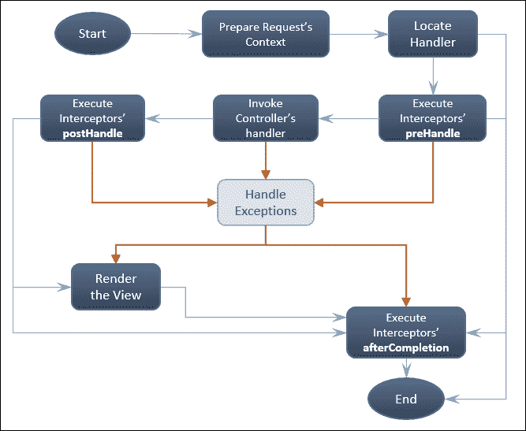

参考资料:桑托什·库马尔·k 的《春天和冬眠》

从这张图中，你可以看到:

*   控制器处理程序被调用，除非其中一个拦截器的`preHandle`方法抛出异常。
*   当控制器的处理程序完成而没有抛出异常时，如果前面的`postHandler`方法没有抛出异常，拦截器的`postHandle`方法被调用。
*   拦截器的`afterCompletion`总是被调用，除非前面的`afterCompletion`抛出异常。

显然，如果没有注册拦截器，同样的顺序适用，跳过拦截器的步骤。

## 还有更多...

关于`WebContentGenerator`类还有更多要说的。

### WebContentGenerator 提供的更多功能

同样，`WebContentGenerator`是`WebContentInterceptor`的超类。从其 JavaDoc 页面:[http://docs . spring . io/spring/docs/current/JavaDoc-API/org/spring framework/web/servlet/support/web content generator . html](http://docs.spring.io/spring/docs/current/javadoc-api/org/springframework/web/servlet/support/WebContentGenerator.html)您可以找到以下示例:

*   三个常量(字符串)`METHOD_GET`、`METHOD_POST`、`METHOD_HEAD`是指`GET`、`POST`和`HEAD`的值
*   一些具体的缓存方法，如`setUseExpiresHeader`、`setUseCacheControlHeader`、`setUseCacheControlNoStore`、`setAlwaysMustRevalidate`、`preventCaching`

同样，用 `WebApplicationObjectSupport`，`WebContentGenerator` 规定:

*   通过`getServletContext()`访问请求或响应对象之外的`ServletContext`。
*   访问当前 web 应用的临时目录，由 servlet 容器通过`getTempDir()`提供。
*   通过`getWebApplicationContext()`访问`WebApplicationContext` 。
*   此外，还需要一些工具来设置和初始化`ServletContext` 和`WebApplicationContext`，即使这些工具最初是打算在框架本身中使用的。

## 参见...

我们很快通过了网络缓存。这个领域有很多定制和标准。另外，Spring MVC 3.1 创建了一个新的`RequestMappingHandlerAdapter`。这将有助于了解变化。

### 网络缓存

通过这个非常完整的缓存教程，了解更多关于 web 缓存的信息:

[https://www.mnot.net/cache_docs](https://www.mnot.net/cache_docs)

### 从 Spring MVC 3.1 开始，@RequestMapping 的新支持类

我们在`dispatcher-context.xml`中使用了带有 bean 定义的`RequestMappingHandlerAdapter`。这个 bean 是 Spring MVC 3.1 的新特性，取代了之前的 `AnnotationMethodHandlerAdapter`。另外，支援职业`DefaultAnnotationHandlerMapping`现在已经被`RequestMappingHandlerMapping`取代。

我们将在第四章[，*为无状态架构*构建 REST API 中深入探讨`RequestMappingHandlerAdapter`。](4.html "Chapter 4\. Building a REST API for a Stateless Architecture")

与此同时，你可以阅读官方的变更说明:

[http://docs . spring . io/spring-framework/docs/3.1 . x/spring-framework-reference/html/MVC . html # MVC-ann-request mapping-31-vs-30](http://docs.spring.io/spring-framework/docs/3.1.x/spring-framework-reference/html/mvc.html#mvc-ann-requestmapping-31-vs-30)

# 用 AngularJS 设计客户端 MVC 模式

这个菜谱解释了 AngularJS 的安装和配置，以管理单页面 web 应用。

## 准备就绪

在这份食谱中，我们解释了我们是如何摆脱先前在 JSP 中引入的渲染逻辑来构建 DOM 的。我们现在将依靠 AngularJS 来完成这项工作。

即使我们还没有前端可以查询的 REST API，我们也会暂时让 JSP 构建所需的 JavaScript 对象，就好像它们是由 API 提供的一样。

AngularJS 是一个开源的 Web 应用框架。它支持构建能够直接适应微服务架构需求的单页面应用。AngularJS 的第一个版本发布于 2009 年。它现在由谷歌和一个开源社区维护。

AngularJS 本身就是一个完整的话题。作为一个框架，它既深又广。试图把它作为一个整体呈现会让我们超出本书的范围，也不太适合我们的方法。

出于这个原因，我们将重点介绍该框架的细节、特性和特征，我们可以将它们用于我们的应用。

## 怎么做...

### 设置 DOM 并创建模块

1.  仍然是从先前检出的`v2.x.x`分支中，`index.jsp` 文件被添加了一个角度指令到 HTML 标签:

    ```java
    <HTML ng-app="cloudStreetMarketApp">
    ```

2.  The AngularJS JavaScript library (angular.min.js from [https://angularjs.org](https://angularjs.org)) has been placed in the `cloudstreetmarket-webapp/src/main/webapp/js` directory.

    在`index.jsp`文件中添加了一个包装`landingGraphContainerAndTools` div 包围`landingGraphContainer`，一个选择框和一个`ng-controller="homeFinancialGraphController"`:

    ```java
    <div id='landingGraphContainer' ng-controller="homeFinancialGraphController">
        <select class="form-control centeredElementBox">
          <option value="${dailyMarketActivity.marketId}"> 
          ${dailyMarketActivity.marketShortName}</option>
        </select> 
      </div>
    ```

    整个 tableMarketPrices div 已通过以下方式进行了重新调整:

    ```java
    <div id='tableMarketPrices'>
        <script>
          var dailyMarketsActivity = [];
          var market;
        </script>
        <c:forEach var="market" items="${dailyMarketsActivity}">
        <script>
          market = {};
          market.marketShortName = '${market.marketShortName}';
          market.latestValue = (${market.latestValue}).toFixed(2);
          market.latestChange = 	(${market.latestChange}*100).toFixed(2);
          dailyMarketsActivity.push(market);
        </script>
        </c:forEach>
    <div>
    <table class="table table-hover table-condensed table-bordered table-striped" data-ng-controller='homeFinancialTableController'>
        <thead>
          <tr>
            <th>Index</th>
            <th>Value</th>
            <th>Change</th>
          </tr>
        </thead>
        <tbody>
            <tr data-ng-repeat="value in financialMarkets">
            <td>{{value.marketShortName}}</td>
            <td style="text-	align:right">{{value.latestValue}}</td>
            <td class='{{value.style}}' style="text-align:right">
            <strong>{{value.latestChange}}%</strong>
            </td>
          </tr>
        </tbody>
        </table>
        </div>
    </div>	
    ```

    然后，`<div id="divRss3">` div 接受了重大的重构:

    ```java
    <div id="divRss3">
      <ul class="feedEkList" data-ng-controller='homeCommunityActivityController'>
        <script>
          var userActivities = [];
          var userActivity;
         </script>
          <c:forEach var="activity" items="${recentUserActivity}">
          <script>
            userActivity = {};
            userActivity.userAction = '${activity.userAction}';
             userActivity.urlProfilePicture = '${activity.urlProfilePicture}';
               userActivity.userName = '${activity.userName}';
               userActivity.urlProfilePicture = 	'${activity.urlProfilePicture}';
            userActivity.date = '<fmt:formatDate ="${activity.date}" pattern="dd/MM/yyyy hh:mm aaa"/>';
            userActivity.userActionPresentTense = '${activity.userAction.presentTense}';
            userActivity.amount = ${activity.amount};
            userActivity.valueShortId = '${activity.valueShortId}';
            userActivity.price = (${activity.price}).toFixed(2);
            userActivities.push(userActivity);
          </script>
           </c:forEach>
        <li data-ng-repeat="value in communityActivities">
        <div class="itemTitle">
        <div class="listUserIco {{value.defaultProfileImage}}">
          
        </div>
        <span class="ico-white {{value.iconDirection}} listActionIco"></span>
          <a href="#">{{value.userName}}</a> 
          {{value.userActionPresentTense}} {{value.amount}} 
          <a href="#">{{value.valueShortId}}</a> at {{value.price}}
          <p class="itemDate">{{value.date}}</p>
          </div>
        </li>
      </ul>
    </div>
    ```

    图形生成部分已经消失，现在替换为:

    ```java
    <script>
      var cloudStreetMarketApp = 
        angular.module('cloudStreetMarketApp', []);
      var tmpYmax = <c:out 
        value="${dailyMarketActivity.maxValue}"/>;
      var tmpYmin = <c:out 	
        value="${dailyMarketActivity.minValue}"/>;
    </script>
    ```

    这个图形生成已经在声明中包含的三个定制 JavaScript 文件之一中具体化了:

    ```java
    <script src="js/angular.min.js"></script>

    <script src="js/home_financial_graph.js"></script>
    <script src="js/home_financial_table.js"></script>
    <script src="js/home_community_activity.js"></script>
    ```

接下来我们将看到这三个定制的 JavaScript 文件。

### 定义模块的组件

1.  正如所介绍的，三个定制的 JavaScript 文件位于`cloudstreetmarket-webapp/src/main/webapp/js`目录中。
2.  The first one, `home_financial_graph.js`, relates to the graph. It creates a factory whose ultimate role is to pull and provide data:

    ```java
    cloudStreetMarketApp.factory("financialDataFactory", function () {
        return {
            getData: function (market) {
              return financial_data;
            },
            getMax: function (market) {
              return tmpYmax;
            },
            getMin: function (market) {
              return tmpYmin;
            }
        }
    });
    ```

    这个文件还创建了一个控制器:

    ```java
    cloudStreetMarketApp.controller('homeFinancialGraphController', function ($scope, financialDataFactory){
      readSelectValue();
      drawGraph();
      $('.form-control').on('change', function (elem) {
        $('#landingGraphContainer').html('');
        readSelectValue()
        drawGraph();
      });
      function readSelectValue(){
      $scope.currentMarket = $('.form-control').val();
      }
      function drawGraph(){
        Morris.Line({
          element: 'landingGraphContainer',
            hideHover: 'auto',
            data:financialDataFactory.getData($scope.currentMarket),
            ymax: financialDataFactory.getMax($scope.currentMarket),
            ymin: financialDataFactory.getMin($scope.currentMarket),
            pointSize: 3,
            hideHover:'always',
            xkey: 'period', xLabels: 'time',
            ykeys: ['index'], postUnits: '',
            parseTime: false, labels: ['Index'],
            resize: true, smooth: false,
            lineColors: ['#A52A2A']
          });
      }
    });
    ```

    第二个文件:`home_financial_table.js`与市场概况表相关。就像`home_financial_graph.js`一样，它创建一个工厂:

    ```java
    cloudStreetMarketApp.factory("financialMarketsFactory", function () {
      var data=[];
        return {
            fetchData: function () {
              return data;
            },
            pull: function () {
            $.each( dailyMarketsActivity, function(index, el ) {
              if(el.latestChange >=0){
                dailyMarketsActivity[index].style='text-success';
              }
              else{
                dailyMarketsActivity[index].style='text-error';
              }
            });
            data = dailyMarketsActivity;
            }
        }
    });
    ```

    `home_financial_table.js`文件也有自己的控制器:

    ```java
    cloudStreetMarketApp.controller('homeFinancialTableController', function ($scope, financialMarketsFactory){
       financialMarketsFactory.pull();
       $scope.financialMarkets = financialMarketsFactory.fetchData();
    });
    ```

3.  The third and last file, `home_community_activity.js` relates to the community activity table. It defines a factory:

    ```java
    cloudStreetMarketApp.factory("communityFactory", function () {
      var data=[];
        return {
            fetchData: function () {
              return data;
            },
            pull: function () {

            $.each( userActivities, function(index, el ) {
            if(el.userAction =='BUY'){
              userActivities[index].iconDirection='ico-up-arrow actionBuy';
              }
              else{
              userActivities[index].iconDirection='ico-down-arrow actionSell';
            }
            userActivities[index].defaultProfileImage='';
            if(!el.urlProfilePicture){
              userActivities[index].defaultProfileImage='ico-	user';
            }
            userActivities[index].price='$'+el.price;
            });
            data = userActivities;
            }
        }
    });
    ```

    及其控制器:

    ```java
    cloudStreetMarketApp.controller('homeCommunityActivityController', function ($scope, communityFactory){
       communityFactory.pull();
       $scope.communityActivities = communityFactory.fetchData();
    });
    ```

## 它是如何工作的...

为了更好地理解我们的 AngularJS 部署是如何工作的，我们将看看 AngularJS 是如何启动的，以及我们的 Angular 模块(app)是如何启动的。然后，我们将发现 AngularJS 控制器和工厂，最后是实现的角度指令。

### 每个 HTML 文档一个应用

加载 DOM 时，angular js 自动初始化。

### 注意

**文档对象模型** ( **DOM** )是与 HTML、XHTML 对象交互的跨平台约定。当浏览器加载网页时，它会创建该页面的文档对象模型。

AngularJS 在 DOM 中查找一个`ng-app`声明，以便根据 DOM 元素绑定一个模块，并启动(自动引导)这个模块。每个 HTML 文档只能自动引导一个应用(或模块)。

如果需要，我们仍然可以为每个文档定义多个应用，并手动引导它们。但是 AngularJS 社区促使我们将应用绑定到 HTML 或 BODY 标签上。

#### 模块自动引导

我们的应用是自动引导的，因为它在 HTML 标签中被引用:

```java
<HTML ng-app="cloudStreetMarketApp">
```

另外，因为模块已经被创建(直接在 HTML 文档的一个`<script>`元素中):

```java
var cloudStreetMarketApp= angular.module('cloudStreetMarketApp', []);
```

### Tip

注意模块创建中的空数组；它允许将依赖关系注入到模块中。我们将很快详述 AngularJS 依赖注入。

#### 手动模块引导

如前所述，我们可以手动引导一个应用，特别是如果我们想要控制初始化流程，或者如果我们每个文档有多个应用。代码如下:

```java
angular.element(document).ready(function() {
      angular.bootstrap(document, ['myApp']);
});
```

### 角度控制器

AngularJS 控制器是框架的核心部分。他们监控前端发生的所有数据更改。控制器被绑定到 DOM 元素，并且对应于屏幕的功能和可视区域。

目前，我们已经为市场图、市场列表和社区活动提要定义了三个控制器。我们还需要菜单和页脚元素的控制器。

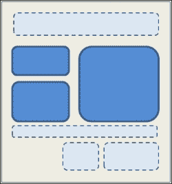

DOM 绑定是通过指令的 ng-controller 操作的:

```java
<div ng-controller="homeFinancialGraphController">
  <table data-ng-controller='homeFinancialTableController'>
  <ul data-ng-controller='homeCommunityActivityController'>
```

每个控制器都有一个作用域，这个作用域作为控制器声明的函数参数被传递。我们可以把它当作一个物体来阅读和改变:

```java
cloudStreetMarketApp.controller('homeCommunityActivityController', function ($scope, communityFactory){
  ...
  $scope.communityActivities = communityFactory.fetchData();
  $scope.example = 123;
}
```

#### 双向 DOM-scope 绑定

作用域与控制器绑定的 DOM 区域同步。AngularJS 管理 DOM 和控制器范围之间的双向数据绑定。这可能是需要理解的最重要的 AngularJS 特性。

### Tip

AngularJS 模型是控制器的范围对象。例如，与 Backbone.js 不同，Angular 中没有真正的视图层，因为模型直接反映在 DOM 中。

范围变量的内容可以使用`{{…}}`符号在 DOM 中呈现。例如，可以用`{{example}}`在 DOM 中获取`$scope.example`变量。

### AngularJS 指令

指令也是 AngularJS 的一个著名特征。它们提供了直接连接到 DOM some 的能力。我们可以创建自己的指令或使用内置的指令。

我们将在本书中尽可能多地访问指令。目前，我们使用了以下方法。

#### ng-重复

为了迭代 `communityActivities`和`financialMarkets`集合，我们定义了一个局部变量名作为循环的一部分，每个条目都用`{{…}}`符号单独访问。代码如下:

```java
<li data-ng-repeat="value in communityActivities">
  <div class="itemTitle">
    <div class="listUserIco {{value.defaultProfileImage}}">
     
    </div>
    ...
  </div>
</li>
```

#### ng-if

该指令允许根据条件删除、创建或重新创建整个 DOM 元素或 DOM 层次结构。

在下一个例子中，`{{value.defaultProfileImage}}`变量只在用户没有定制的个人资料图片时呈现 CSS 类`".ico-user"` (为了显示默认的普通个人资料图片)。

当用户有一张个人资料图片时，`value.urlProfilePicture`变量被填充， `ng-if`条件被满足，并且``元素在 DOM 中被创建。代码如下:

```java
<div class="listUserIco {{value.defaultProfileImage}}">
  
</div>
```

### 安古拉杰工厂

工厂被用来获得新的对象实例。我们使用工厂作为数据生成器。我们还将使用它们作为服务协调器和服务与控制器之间的中间层。服务将从服务器 API 中提取数据。代码如下:

```java
cloudStreetMarketApp.factory("communityFactory", function () {
  var data=[];
    return {
        fetchData: function () {
        return data;
        },
        pull: function () {
        $.each( userActivities, function(index, el ) {
          if(el.userAction =='BUY'){
            userActivities[index].iconDirection='ico-up-arrow     actionBuy';
          }
          else{
          userActivities[index].iconDirection='ico-down-arrow actionSell';
          }
          userActivities[index].defaultProfileImage='';
          if(!el.urlProfilePicture){
          userActivities[index].defaultProfileImage='ico-user';
          }
          userActivities[index].price='$'+el.price;
        });
        data = userActivities;
        }
    }
});
```

在这个工厂中，我们定义了两个函数:`pull()`和`fetchData()`，它们填充和检索数据:

```java
cloudStreetMarketApp.controller('homeCommunityActivityController', function ($scope, communityFactory){
   communityFactory.pull();
   $scope.communityActivities = communityFactory.fetchData();
});
```

一旦控制器被加载，它将`pull()`和`fetchData()`进入`$scope.communityActivities`。在这种情况下，这些操作只执行一次。

### Tip

我们的工厂作为依赖项注入到我们的控制器声明中:

cloudstreetmarketapp . controller(`'homeCommunityActivityController'`，函数`($scope`，`communityFactory`)

#### 依赖注入

在我们的工厂、控制器和模块定义中，我们使用 AngularJS 依赖注入来处理组件的生命周期和它们的依赖。

AngularJS 使用进样器执行配置的进样。有三种方法可以注释依赖项，使它们适合注入:

*   使用内联数组注释:

    ```java
    cloudStreetMarketApp.controller('homeCommunityActivityController', ['$scope', 'communityFactory', function ($scope, 
    communityFactory){
       communityFactory.pull();
       $scope.communityActivities = communityFactory.fetchData();
    }]);
    ```

*   使用`$inject`属性标注:

    ```java
    var homeCommunityActivityController = function ($scope, 
    communityFactory){
       communityFactory.pull();
       $scope.communityActivities = communityFactory.fetchData();
    }
    homeCommunityActivityController.$inject = ['$scope', 'communityFactory'];
    cloudStreetMarketApp.controller('homeCommunityActivityController', homeCommunityActivityController);
    ```

*   使用隐式注释模式从函数参数名:

    ```java
    cloudStreetMarketApp.controller('homeCommunityActivityController', function ($scope, communityFactory){
        communityFactory.pull();
        $scope.communityActivities = communityFactory.fetchData();
    });
    ```

虽然我们主要使用隐式注释风格和内联数组注释风格，但是我们必须强调这样一个事实，即隐式注释依赖注入将无法使用 JavaScript minification 工作。

## 还有更多...

正如你所想象的，这是 AngularJS 的一个快速介绍。当我们的应用中有了 REST API 和更多的特性时，我们会在原位发现更多的东西。

AngularJS 变得非常受欢迎，一个活跃的社区正在支持它。它的核心思想和实现基于一个显式的 DOM，提供了一种与应用联系的彻底而简单的方法。

文档非常详细:[https://docs.angularjs.org](https://docs.angularjs.org)。

网上有大量的教程和视频:

*   [http://www.w3schools.com/angular](http://www.w3schools.com/angular)
*   [http://tutorials.jenkov.com/angularjs](http://tutorials.jenkov.com/angularjs)
*   [https://egghead.io](https://egghead.io)******