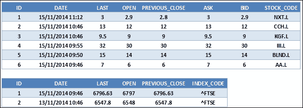
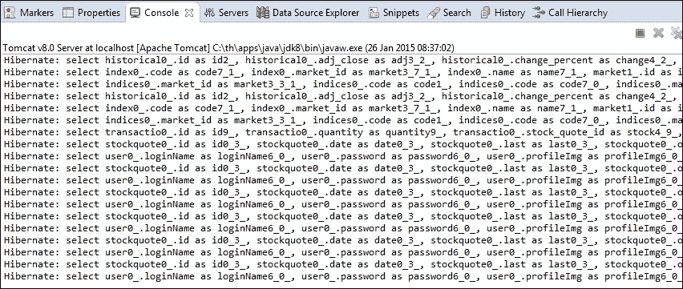

# 第三章。使用 Java 持久性和实体

在本章中，我们将开发以下配方:

*   在 Spring 中配置 **Java 持久性 API** ( **JPA** )
*   定义有用的 EJB3 实体和关系
*   利用 JPA 和 Spring 数据 JPA

# 简介

**Java 持久性 API** ( **JPA** )是由一组不同的专家在 2006 年(JPA 1.0)到 2013 年(JPA 2.1)的不同版本中制定的规范。从历史上看，它是 EJB 3.0 规范的三个部分之一，与 JEE5 一起出现。

不仅仅是对**Enterprise JavaBean s**(**EJB**)的升级，JPA 几乎是一个完全的重新设计。当时，对象关系映射解决方案(如 Hibernate)和 J2EE 应用服务器(如 WebSphere、JBoss)的领先提供商已经参与进来，全球结果无疑更加简单。所有类型的 EJB(有状态的、无状态的和实体的)现在都是简单的传统 Java 对象，用特定的元数据来丰富，这些元数据被很好地表示为注释。

## 实体的利益

实体在 EJB3 模型中扮演着关键的角色。作为简单的 POJOs，它们可以用于应用程序的每一层。

理想情况下，一个实体代表一个业务领域中一个可识别的功能单元。标准是创建一个代表数据库表行的实体。作为简单的 POJOs，实体可以依赖于继承(IS-A 关系),也可以有属性(HAS-A 关系),就像通常描述数据库模式一样。通过这些关系，一个实体与其他实体建立连接。这些连接用`@Annotations`描述，它构成了实体元数据。

实体必须被视为数据库表行的应用程序等效元素。JPA 允许将这个元素及其整个生态系统作为一个 Java 对象层次来操作，并像这样持久化它。

实体带来了持久层惊人的激进化(通过减少要维护的硬编码 SQL 查询的数量)，以及服务和转换层的简化。由于能够通过所有级别(甚至在视图中也使用它们)，它们极大地驱动了应用程序中使用的特定于领域的名称和概念(方法、类和属性)。它们间接地关注本质，并在应用程序概念和数据库概念之间强加一致性。

从一开始就有一个坚实的、经过深思熟虑的模式显然是有利的。

### 注意

JPA 为 UI 应用程序带来了惊人的性能和可维护性。但是，如果用于完成批处理或批量数据库操作，它可能并不总是符合预期的性能。有时考虑直接 JDBC 访问可能是明智的。

## 实体管理器及其持久性上下文

我们已经看到一个实体可以与其他实体有关系。为了让 us 能够对实体进行操作(从数据库读取、更新、删除和持久化)，有一个后台 API 生成 SQL 查询的准备。持久性提供者(Hibernate、Toplink 等)中的这个 API 就是 EntityManager。一旦它为应用程序加载了对象，我们就可以信任它来管理它的生命周期。

在继续之前，我们需要回顾一下 EntityManager 附带的几个概念。一旦 EntityManager 从数据库读取(显式或隐式)获得实体的实例，实体就被管理。JPA 持久性上下文是由整个托管实体集合的概念集合形成的。一个持久化上下文将总是携带不超过一个实体实例，通过它的标识符(`@Id`或一个唯一的 ID 类)来区分。

如果由于某种原因，一个实体没有被管理，它就被称为分离的(从持久性上下文中理解分离)。

# 在 Spring 中配置 Java 持久性 API

既然我们已经介绍了 JPA，它的角色，以及使用实体的好处，我们现在可以专注于如何配置我们的 Spring 应用程序来处理它们。

## 准备就绪

正如我们前面所说的，JPA 是一个规范。只要符合标准，为应用程序选择持久性提供者(Hibernate、OpenJPA、TopLink 等)或数据库提供者并不是一个承诺。

我们将看到我们在 Spring 中的 JPA 配置是通过定义两个 beans 来完成的:**数据源**和**实体管理工厂**。然后，可选的`Spring Data JPA`库提供了一个`JPA`库抽象，能够令人惊讶地简化一些数据库操作。

## 怎么做...

1.  从 Eclipse 中的 **Git 视角**，查看最新版本的`v3.x.x`分支。
2.  如前所述，我们已经向 Spring 配置文件(在核心模块中)添加了几个 bean`csmcore-config.xml`:

    ```java
    <jpa:repositories base-package="edu.zc.csm.core.daos" />
    <bean id="dataSource" class="org.sfw.jdbc.datasource.DriverManagerDataSource>
      <property name="driverClassName">
      <value>org.hsqldb.jdbcDriver</value>
      </property>
      <property name="url">
      <value>jdbc:hsqldb:mem:csm</value>
      </property>
      <property name="username">
      <value>sa</value>
      </property>
    </bean>

    <bean id="entityManagerFactory" class="org.sfw.orm.jpa.LocalContainerEntityManagerFactoryBean">
          <property name="persistenceUnitName" value="jpaData"/>
          <property name="dataSource" ref="dataSource" />
          <property name="jpaVendorAdapter">
          <beanclass="org.sfw.orm.jpa.vendor.HibernateJpaVendorAdapter"/>
          </property>
          <property name="jpaProperties">
          <props>
              <prop key="hibernate.dialect">
                org.hibernate.dialect.HSQLDialect
              </prop>
              <prop key="hibernate.show_sql">true</prop>
              <prop key="hibernate.format_sql">false</prop>
              <prop key="hibernate.hbm2ddl.auto">create-drop</prop>
              <prop key="hibernate.default_schema">public</prop>
          </props>
        </property>
    </bean>
    ```

3.  Finally, the following dependencies have been added to the parent and core projects:
    *   `org.springframework.data:spring-data-jpa` (1.0.2 .发布)
    *   `org.hibernate.javax.persistence:hibernate-jpa-2.0-api` (1.0.1 .最终版本)
    *   `org.hibernate:hibernate-core` (4.1.5.SP1)

    添加这种依赖性会导致 Maven enforcer 插件引发与`jboss-logging`的版本冲突。这就是为什么 jboss-logging 被排除在这个第三方库之外，并作为一个独立的依赖项被引用:

    *   `org.hibernate:hibernate-entitymanager` (4.1.5.SP1)

    `jboss-logging`也被排除在该第三方库之外，因为它现在作为独立的依赖项被引用:

    *   `org.jboss.logging:jboss-logging` (3.1.0.CR1)
    *   `org.hsqldb:hsqldb` (2.3.2)
    *   `org.javassist:javassist` (3.18.2-GA)
    *   `org.apache.commons:commons-dbcp2` (2.0.1)

## 它是如何工作的...

我们将回顾这三个配置点:**数据源** bean、**实体管理器工厂** bean 和 Spring 数据 JPA。

### Spring 管理的数据源 bean

因为创建一个数据库连接很耗时，尤其是通过网络层，并且因为共享和重用一个打开的连接或连接池是明智的，所以一个 **数据源**有优化这些连接的使用的职责。它是一个可伸缩性指标，也是数据库和应用程序之间高度可配置的接口。

在我们的例子中，Spring 像管理任何其他 bean 一样管理数据源。数据源可以通过应用程序创建，也可以通过 JNDI 查询远程访问(如果选择放弃对容器的连接管理)。在这两种情况下，Spring 将管理已配置的 bean，提供我们的应用程序需要的代理。

同样在我们的示例中，我们使用了 Apache 通用 DBCP 2 数据源(2014 年发布)。

### Tip

在生产环境中，切换到基于 JNDI 的数据源可能是个好主意，比如本地的 Tomcat JDBC 池。

Tomcat 网站清楚地表明，在高并发系统上使用 Tomcat JDBC 池而不是 DBCP1.x 可以显著提高性能。

### entitymanager factory bean 及其持久性单元

顾名思义，`EntityManagerFactory` bean 产生实体管理器。`EntityManagerFactory`的配置决定了实体管理器的行为。

`EntityManagerFactory` bean 的配置反映了一个持久性单元的配置。在 Java EE 环境中，可以在一个`persistence.xml`文件中定义和配置一个或多个持久单元，这在应用程序档案中是唯一的。

在 Java SE 环境中(我们的例子),`persistence.xml`文件的存在在 Spring 中是可选的。`EntityManagerFactory` bean 的配置几乎完全覆盖了持久性单元的配置。

持久性单元的配置，以及`EntityManagerFactory` bean 的配置，可以让或者单独声明被覆盖的实体，或者扫描包来找到它们。

### 注意

持久性单元可以被视为水平扩展生态系统中的一个子区域。对于每个功能领域，一个产品可以被分解成 wars(网络档案)。功能区域可以用一组由持久性单元界定的实体来表示。

要点是避免创建重叠不同持久性单元的实体。

### 春季数据 JPA 配置

我们将使用 Spring Data JPA 项目中一些非常有用的工具。这些工具旨在简化持久层的开发(和维护)。最有趣的工具可能是存储库抽象。您将看到，为一些数据库查询提供实现是可选的。如果方法签名与声明中的标准相匹配，那么在运行时将从方法签名中生成存储库接口的实现。

例如，Spring 将推断以下方法的实现`signature`(如果`User`实体有一个`String userName`字段):

```java
List<User> findByUserName(String username);

```

我们在 Spring Data JPA 上的 bean 配置的一个更扩展的例子如下:

```java
<jpa:repositories base-package="edu.zipcloud.cloudstreetmarket.core.daos" 
    entity-manager-factory-ref="entityManagerFactory"
    transaction-manager-ref="transactionManager"/>
```

如您所见，Spring Data JPA 包含一个定制的名称空间，允许我们定义以下存储库 beans。该名称空间可以配置如下:

*   在这个名称空间中提供一个`base-package`属性是强制性的，以限制对 Spring 数据存储库的查找。
*   如果在`ApplicationContext`中只配置了一个`EntityManagerFactory` bean，那么提供一个`entity-manager-factory-ref`属性是可选的。它显式地连接了`EntityManagerFactory`，它将与检测到的存储库一起使用。
*   如果在`ApplicationContext`中只配置了一个`PlatformTransactionManager` bean，那么提供一个`transaction-manager-ref`属性也是可选的。它显式地连接了`PlatformTransactionManager`，它将与检测到的存储库一起使用。

关于此配置的更多详情可在项目网站上找到，网址为:

[http://docs . spring . io/spring-data/JPA/docs/1 . 4 . 3 . release/reference/html/JPA . repositories . html](http://docs.spring.io/spring-data/jpa/docs/1.4.3.RELEASE/reference/html/jpa.repositories.html)。

## 参见

*   **HikariCP 数据源** : HikariCP(来自它的 BoneCP 祖先)是一个开源的 Apache v2 许可项目。它在速度和可靠性方面表现得比其他任何数据源都好。如今，在选择数据源时，可能应该考虑这个产品。关于这方面的更多信息，请参见 https://brettwooldridge.github.io/HikariCP。

# 定义有用的 EJB3 实体和关系

这个主题非常重要，因为设计良好的映射可以防止错误，节省大量时间，并对性能有很大影响。

## 准备就绪

在本节中，我们将展示应用程序所需的大多数实体。这里选择了一些实现技术(从继承类型到关系案例),并为了举例而突出显示。

*工作原理……*部分将解释事物为什么以及如何以它们的方式被定义，以及驱使我们做出实体定义的思想是什么。

## 怎么做...

以下步骤将帮助您在应用程序中创建实体:

1.  该配方的所有更改都位于新包`edu.zipcloud.cloudstreetmarket.core.entities`中。首先，创建三个简单的实体，如下所示:
    *   `User`实体:

        ```java
          @Entity
          @Table(name="user")
          public class User implements Serializable{
            private static final long serialVersionUID = 1990856213905768044L;
            @Id
            @Column(nullable = false)
            private String loginName;
            private String password;
            private String profileImg;

          @OneToMany(mappedBy="user", cascade = {CascadeType.ALL}, fetch = FetchType.LAZY)
          @OrderBy("id desc")
          private Set<Transaction> transactions = new LinkedHashSet< >();
          ...
          }
        ```

    *   `Transaction`实体:

        ```java
          @Entity
          @Table(name="transaction")
          public class Transaction implements Serializable{
            private static final long serialVersionUID = -6433721069248439324L;
            @Id
            @GeneratedValue
            private int id;

            @ManyToOne(fetch = FetchType.EAGER)
            @JoinColumn(name = "user_name")
            private User user;

            @Enumerated(EnumType.STRING)
            private Action type;

            @OneToOne(fetch = FetchType.EAGER)
            @JoinColumn(name = "stock_quote_id")
            private StockQuote quote;
            private int quantity;
          ...
          }
        ```

    *   和`Market`实体:

        ```java
          @Entity
          @Table(name="market")
          public class Market implements Serializable {
            private static final long serialVersionUID = -6433721069248439324L;
            @Id
          private String id;
          private String name;

          @OneToMany(mappedBy = "market", cascade = { CascadeType.ALL }, fetch = FetchType.EAGER)
          private Set<Index> indices = new LinkedHashSet<>();
          ...
          }
        ```

2.  Then, we have created some more complex entity Types such as the abstract `Historic` entity:

    ```java
    @Entity
    @Inheritance(strategy = InheritanceType.SINGLE_TABLE)
    @DiscriminatorColumn(name = "historic_type")
    @Table(name="historic")
    public abstract class Historic {

      private static final long serialVersionUID = -802306391915956578L;

      @Id
      @GeneratedValue
      private int id;

      private double open;

      private double high;

      private double low;

      private double close;

      private double volume;

      @Column(name="adj_close")
      private double adjClose;

      @Column(name="change_percent")
      private double changePercent;

      @Temporal(TemporalType.TIMESTAMP)
      @Column(name="from_date")
      private Date fromDate;

      @Temporal(TemporalType.TIMESTAMP)
      @Column(name="to_date")
      private Date toDate;

      @Enumerated(EnumType.STRING)
      @Column(name="interval")
    private QuotesInterval interval;
    ...
      }
    ```

    我们还创建了两个历史子类`HistoricalIndex`和`HistoricalStock`:

    ```java
      @Entity
      @DiscriminatorValue("idx")
      public class HistoricalIndex extends Historic implements Serializable {

      private static final long serialVersionUID = -802306391915956578L;

      @ManyToOne(fetch = FetchType.EAGER)
      @JoinColumn(name = "index_code")
      private Index index;
    ...
    }
    @Entity
    @DiscriminatorValue("stk")
    public class HistoricalStock extends Historic implements Serializable {

      private static final long serialVersionUID = -802306391915956578L;

      @ManyToOne(fetch = FetchType.LAZY)
      @JoinColumn(name = "stock_code")
      private StockProduct stock;

      private double bid;
      private double ask;
      ...
        }
    ```

3.  然后，我们还创建了`Product`实体及其 StockProduct 子类型:

    ```java
        @Entity
        @Inheritance(strategy = InheritanceType.TABLE_PER_CLASS)
        public abstract class Product {
          private static final long serialVersionUID = -    802306391915956578L;
          @Id
          private String code;
          private String name;
          ...
        }

        @Entity
        @Table(name="stock")
        public class StockProduct extends Product implements Serializable{
          private static final long serialVersionUID = 1620238240796817290L;
          private String currency;
          @ManyToOne(fetch = FetchType.EAGER)
          @JoinColumn(name = "market_id")
          private Market market;
          ...
        }
    ```

4.  事实上，在金融界，一个指数(S & P 500 或纳斯达克)不能这样购买；因此，指数尚未被视为产品:

    ```java
    @Entity
    @Table(name="index_value")
    public class Index implements Serializable{
      private static final long serialVersionUID = -2919348303931939346L;
      @Id
      private String code;
      private String name;

      @ManyToOne(fetch = FetchType.EAGER)
      @JoinColumn(name = "market_id", nullable=true)
      private Market market;

      @ManyToMany(fetch = FetchType.LAZY)
      @JoinTable(name = "stock_indices", joinColumns={@JoinColumn(name = "index_code")}, inverseJoinColumns={@JoinColumn(name ="stock_code")})
      private Set<StockProduct> stocks = new LinkedHashSet<>();
      ...
    }
    ```

5.  最后，`Quote`抽象实体及其两个子类型`StockQuote`和`IndexQuote`创建了(指数不是产品，但我们仍然可以从中获得即时快照，而雅虎！稍后将调用金融数据提供商来获取这些即时报价):

    ```java
    @Entity
    @Inheritance(strategy = InheritanceType.TABLE_PER_CLASS)
    public abstract class Quote {
      @Id
      @GeneratedValue(strategy = GenerationType.TABLE)
      protected Integer id;
      private Date date;
      private double open;

      @Column(name = "previous_close")
      private double previousClose;
      private double last;
      ...
    }

    @Entity
    @Table(name="stock_quote")
    public class StockQuote extends Quote implements Serializable{
      private static final long serialVersionUID = -8175317254623555447L;
      @ManyToOne(fetch = FetchType.EAGER)
      @JoinColumn(name = "stock_code")
      private StockProduct stock;
      private double bid;
      private double ask;
      ...
    }

    @Entity
    @Table(name="index_quote")
    public class IndexQuote extends Quote implements Serializable{
      private static final long serialVersionUID = -8175317254623555447L;

      @ManyToOne(fetch = FetchType.EAGER)
      @JoinColumn(name = "index_code")
      private Index index;
      ...
    }
    ```

## 它是如何工作的...

我们将经历一些基本的和更高级的概念，我们已经用它们来建立我们的关系映射。

### 实体要求

被 API 视为实体的实体需要满足以下条件:

*   它必须用`@Entity`注释在类型级别上进行注释。
*   它需要定义一个基本类型或复杂类型的**标识符** 。在大多数情况下，一个基本标识符就足够了(特定实体字段上的`@Id`注释)。
*   它必须定义为 public，而不能声明为 final。
*   它需要有一个默认的构造函数(隐式或非隐式)。

### 映射模式

数据库和 Java 对象都有特定的概念。实体的元数据注释以及默认配置描述了关系映射。

#### 映射表

一个实体类映射一个表。不在类型级别指定`@Table(name="xxx")`注释会将实体类映射到用实体名命名的表(这是默认命名)。

### 注意

Java 的类命名标准是首字母大写。这种命名方案并不真正符合数据库表命名标准。因此，通常使用`@Table`注释。

`@Table`注释还有一个可选的`schema`属性，它允许我们将表绑定到 SQL 查询中的一个模式(例如`public.user.ID`)。这个`schema`属性将覆盖默认的模式 JPA 属性，该属性可以在持久性单元上定义。

#### 映射列

与表名一样，字段映射到的列名是用`@Column(name="xxx")`注释指定的。同样，这个注释是可选的，不指定它将使映射退回到默认的命名方案，这实际上是字段的大小写名称(在单个单词的情况下，这通常是一个好的选择)。

实体类的字段不能定义为公共的。还要记住，您几乎可以持久化所有的标准 Java 类型(原始类型、包装器、字符串、字节或字符数组，以及枚举类型)和大型数值类型，比如`BigDecimals`或`BigIntegers`，还有 JDBC 时态类型(`java.sql.Date`、`java.sql.TimeStamp`)，甚至是可序列化的对象。

#### 注释字段或 getters

实体的字段(如果没有标记为`@Transient`)对应于数据库行中每一列的值。列映射也可以从 getter 中定义(不一定有相应的字段)。

`@Id`注释定义了实体标识符。此外，在字段或 getter 上定义这个`@Id`注释定义了表列应该由字段映射还是由 getter 映射。

当使用 getter 访问模式并且没有指定`@Column`注释时，列名的默认命名方案使用 JavaBeans 属性命名标准(例如，`getUser()` getter 将对应于`user`列)。

#### 映射主键

正如我们已经看到的,`@Id`注释定义了实体的标识符。持久性上下文将始终只管理一个具有单一标识符的实体的一个实例。

实体类上的`@Id`注释必须映射表的持久标识符，这是主键。

#### 标识符生成

一个`@GeneratedValue`注释允许从 JPA 级别生成 ID。该值可能不会被填充，直到对象被持久化。

一个`@GeneratedValue`注释有一个`strategy`属性，用于配置生成方法(例如，依赖于现有的数据库序列)。

### 定义继承

我们为`Products`、`Historics`和`Quotes`的子类型定义了实体继承。当两个实体足够接近，可以组合成一个单一概念，并且如果它们实际上可以与应用程序中的父实体相关联，那么使用 JPA 继承是值得的。

根据特定数据的持久性策略，可以为继承映射考虑不同的存储选项。

JPA 允许我们从不同的策略中配置继承模型。

#### 单表策略

这个策略期望或创建一个大表，在模式上有一个鉴别器字段。此表承载父实体字段；这些是所有子图元共有的。它还承载子实体类的所有字段。因此，如果一个实体对应于一个或另一个子类型，它将填充特定的字段，并将其他字段留空。

下表显示了带有`HISTORIC_TYPE`鉴别器的`Historic`表:


#### 按类分表策略

这个策略为具体的实体使用特定的表。这里不涉及鉴别器，只涉及子类型的特定表。这些表包含公共字段和特定字段。

例如，我们已经为`Quote`实体及其具体的`StockQuote`和`IndexQuote`实体实现了这个策略:



### 定义关系

实体有能力在它们的类属性中反映数据库外键和表与表的关系。

在应用程序方面，因为这些关系是由实体经理透明地构建的，所以大量的开发被忽略了。

#### 如何选择实体之间的关系

在谈论实体之间的关系之前，有必要了解我们计划在云街市场应用程序中做什么。

正如在[第 1 章](1.html "Chapter 1\. Setup Routine for an Enterprise Spring Application")中介绍的，为企业 Spring 应用程序设置*例程，我们将从开放其 API 的提供商(Yahoo！其实)。要做到这一点，就每个 IP 或每个经过身份验证的用户的调用频率而言，总要记住一些限制。我们的应用程序也有自己的社区，其中的财务数据将被共享。对于金融数据提供商来说，当谈论一只给定的股票时，股票的历史视图和股票的即时报价是两回事。我们必须处理这两个概念来建立我们自己的数据集。*

在我们的应用程序中，`Users`将能够通过执行`Transactions`来买卖`Products`(股票、基金、期权等等):

*   First, let's consider the User(s)/Transaction(s) relationship with the following screenshot:

    

*   A `User` entity can have many `Transactions` Entities.

    ### 注意

    在 User 类中，`@OneToMany`关系注释的第二部分(`Many`元素)驱动我们正在创建的属性类型。将`Many`指定为第二部分声明了源实体(`User`)可以有几个目标实体(`Transactions`)。这些目标必须包装在一个集合类型中。如果源实体不能有几个目标，那么关系的第二部分必须是`One`。

*   A `Transaction` can have only one `User` entity.

    ### 注意

    仍然在用户类中，`@OneToMany`关系的第一部分(`@One`元素)是在目标实体中定义的关系注释的第二部分(如果定义的话)。需要知道目标实体是否可以有几个原点，才能在原点完成标注。

*   然后我们可以推导出两个注解:`User`中的`@OneToMany`和`Transactions`中的`@ManyToOne`。
*   If we are not in the case of a `@ManyToMany` relationship, we are talking about a unidirectional relationships. From a database's point of view, this means that one of the two tables having a join column that targets the other table. In the JPA, the table that has this join column is the relationship's **owner**.

    ### Tip

    作为关系所有者的实体必须由关系上的`@JoinColumn`注释指定。不是所有者的实体必须为其关系注释提供一个`mappedBy`属性，该属性指向相对实体中相应的 Java 字段名。

*   This can now explain the relationship in `Transaction`:

    ```java
    @ManyToOne(fetch = FetchType.EAGER)
    @JoinColumn(name = "user_name")
    private User user;
    ```

    `user_name`列是事务表中预期的(或自动添加的)。我们将在稍后的*章节*中讨论获取类型。

*   `User`实体中的关系定义如下:

    ```java
      @OneToMany(mappedBy="user", cascade ={CascadeType.ALL}, fetch = FetchType.LAZY)
      @OrderBy("id desc")
      private Set<Transaction> transactions = new LinkedHashSet<>();
    ```

### Tip

`@OrderBy`注释告诉 JPA 实现在其 SQL 查询中添加一个`ORDER BY`子句。

一个`Index`实体有一个`Market`实体。我们认为市场是地理区域(欧洲、美国、亚洲等)。一个市场有几个具体的指数。

这看起来又是一个`@OneToMany` / `@ManyToOne`关系。关系的所有者是`Index`实体，因为我们期望在`Index`表中有一个`Market`列(而不是在`Market`表中有一个`Index`列)。

具体的`Product`(如`StockProduct`)和`Market`实体之间的情况也是如此，只不过，由于从`Market`直接检索股票在应用程序中看起来不是强制性的，所以在`Market`实体方没有声明这种关系。我们只保留了所有者一方。

关于具体的`Quotes`实体(如`StockQuote`)和具体的`Products`实体(如`StockProduct`)，一个报价会有一个产品。如果我们对从一个`Product`实体中检索`Quote`感兴趣，一个产品会有很多报价。关系的所有者是具体的`Quote`实体。

对于`IndexQuote`和`Index`，与上一点逻辑相同。

在`Index`和`StockProduct`之间，现实中的指数(S & P 500，纳斯达克等等)都有成份股，成份股的价值之和就构成了指数的价值。因此，一个`Index`实体有几个潜在的`StockProduct`实体。还有一个`StockProduct`可以属于几个`Indices`。这看起来像是一种双向关系。我们这里呈现的是`Index`面:

```java
@ManyToMany(fetch = FetchType.LAZY)
@JoinTable(name = "stock_indices", joinColumns={@JoinColumn(name = "index_code")}, inverseJoinColumns={@JoinColumn(name ="stock_code")})
private Set<StockProduct> stocks = new LinkedHashSet<>();
```

这个关系由一个额外的连接表指定(由 JPA 预期或生成)。它基本上是一个表，有两个连接列指向各自实体的`@Ids`字段。

## 还有更多...

我们将访问两个我们还没有解释的元数据属性:`FetchType`属性和`Cascade`属性。

### fetch type 属性

我们已经看到，关系注释`@OneToOne`、`@OneToMany`和`@ManyToMany`可以在一个获取属性中指定，该属性可以是`FetchType.EAGER`或`FetchType.LAZY`。

当选择一个`FetchType.EAGER`属性时，当实体被管理时，关系由`entityManager`自动加载。JPA 执行的 SQL 查询的总量显著增加，特别是因为有些相关的实体并不是每次都需要加载。如果我们有两个、三个或更多级别的实体绑定到一个根实体，我们可能应该考虑将一些字段本地切换到`FetchType.LAZY`。

`FetchType.LAZY`属性指定 JPA 实现不填充加载实体的 SQL 查询的字段值。JPA 实现生成额外的异步 SQL 查询，以便在程序明确要求时填充`LAZY`字段(例如，在`HistoricalStock`实体的情况下，当`getStock()`被调用时)。当使用 Hibernate 作为实现时，`FetchType.LAZY`被作为关系的默认获取类型。

考虑减轻关系负载是很重要的，尤其是在集合上。

### 级联属性

关系注释中要提到的另一个属性是 Cascade 属性。该属性可以取值为`CascadeType.DETACH`、`CascadeType.MERGE`、`CascadeType.PERSIST`、`CascadeType.REFRESH`、`CascadeType.REMOVE`和`CascadeType.ALL`。

该属性指定当被要求执行操作(比如持久化、更新、删除、查找等等)时，JPA 实现应该如何处理相关的实体。)在主实体上。这是一个可选属性，通常默认为**无级联操作**。

## 参见

定义实体继承还有第三种策略:

*   连接表继承策略:我们还没有实现它，但是这个策略有点类似于每类一个表的策略。它与它的不同之处在于，JPA 不是在具体的表中重复父实体字段(列),而是创建或期望一个只包含父实体列的额外的表，并透明地管理与这个表的连接。

# 利用 JPA 和 Spring 数据 JPA

在这一节中，我们将连接应用程序所需的业务逻辑。

因为我们已经为 JPA 和 Spring 数据 JPA 设置了配置，并且因为我们已经定义了我们的实体和它们的关系，我们现在可以使用这个模型来节省时间和能量。

## 怎么做...

以下步骤将指导您完成这些更改:

1.  在`edu.zipcloud.cloudstreetmarket.core.daos`包中，我们可以找到以下两个接口:

    ```java
    public interface HistoricalIndexRepository {
      Iterable<HistoricalIndex> findIntraDay(String code, Date of);
      Iterable<HistoricalIndex> findLastIntraDay(String code);
      HistoricalIndex findLastHistoric(String code);
    }
    public interface TransactionRepository {
      Iterable<Transaction> findAll();
      Iterable<Transaction> findByUser(User user);
      Iterable<Transaction> findRecentTransactions(Date from);
      Iterable<Transaction> findRecentTransactions(int nb);
    }
    ```

2.  These two interfaces come with their respective implementations. The `HistoricalIndexRepositoryImpl` implementation out of the two is defined as follows:

    ```java
    @Repository
    public class HistoricalIndexRepositoryImpl implements HistoricalIndexRepository{

      @PersistenceContext 
      private EntityManager em;

      @Override
      public Iterable<HistoricalIndex> findIntraDay(String code,Date of){
        TypedQuery<HistoricalIndex> sqlQuery = em.createQuery("from HistoricalIndex h where h.index.code = ? and h.fromDate >= ? and h.toDate <= ? ORDER BY h.toDate asc", HistoricalIndex.class);

        sqlQuery.setParameter(1, code);
        sqlQuery.setParameter(2, DateUtil.getStartOfDay(of));
        sqlQuery.setParameter(3, DateUtil.getEndOfDay(of));

        return sqlQuery.getResultList();
      }

      @Override
      public Iterable<HistoricalIndex> findLastIntraDay(String code) {
        return findIntraDay(code,findLastHistoric(code).getToDate());
      }

      @Override
      public HistoricalIndex findLastHistoric(String code){
         TypedQuery<HistoricalIndex> sqlQuery =  em.createQuery("from HistoricalIndex h where h.index.code = ? ORDER BY h.toDate desc", HistoricalIndex.class);

      sqlQuery.setParameter(1, code);

        return sqlQuery.setMaxResults(1).getSingleResult();
      }
    }
    ```

    而`TransactionRepositoryImpl`的实现如下:

    ```java
    @Repository
    public class TransactionRepositoryImpl implements TransactionRepository{
      @PersistenceContext 
      private EntityManager em;
      @Autowired
      private TransactionRepositoryJpa repo;
      @Override
      public Iterable<Transaction> findByUser(User user) {
        TypedQuery<Transaction> sqlQuery = em.createQuery("from Transaction where user = ?", Transaction.class);
        return sqlQuery.setParameter(1, user).getResultList();
      }
      @Override
      public Iterable<Transaction> findRecentTransactions(Date from) {
        TypedQuery<Transaction> sqlQuery = em.createQuery("from Transaction t where t.quote.date >= ?", Transaction.class);
        return sqlQuery.setParameter(1, from).getResultList();
      }
      @Override
      public Iterable<Transaction> findRecentTransactions(int nb) {
      TypedQuery<Transaction> sqlQuery = em.createQuery("from Transaction t ORDER BY t.quote.date desc", Transaction.class);
        return sqlQuery.setMaxResults(nb).getResultList();
      }
      @Override
      public Iterable<Transaction> findAll() {
        return repo.findAll();
      }
    }
    ```

3.  `dao`包中的所有其他接口都没有明确定义的实现。
4.  以下 bean 已经被添加到 Spring 配置文件中:

    ```java
      <jdbc:initialize-database data-source="dataSource">
          <jdbc:script location="classpath:/META-INF/db/init.sql"/>
      </jdbc:initialize-database>
    ```

5.  这最后一个配置允许应用程序在启动时执行创建的`init.sql`文件**。**
6.  您会注意到,`cloudstreetmarket-core`模块已经被添加到它的`pom.xml`文件中，这是我们创建的`DateUtil`类对`zipcloud-core`的依赖。
7.  To replace the two dummy implementations that we created in [Chapter 2](2.html "Chapter 2\. Designing a Microservice Architecture with Spring MVC"), *Designing a Microservice Architecture with Spring MVC*, the `CommunityServiceImpl` and `MarketServiceImpl` implementations have been created.

    ### 注意

    我们已经使用`@Autowired`注释在这些实现中注入了存储库依赖。

    此外，我们已经使用声明的`value`标识符用 Spring `@Service`注释标记了这两个实现:

    ```java
    @Service(value="marketServiceImpl")
    @Service(value="communityServiceImpl")
    ```

8.  在`cloudstreetmarket-webapp`模块中，`DefaultController`的`@Autowired`字段已经被修改，以针对这些新的实现，而不再是虚拟的实现。这是通过在`@Autowired`字段上指定`@Qualifier`注释来实现的。
9.  Starting the server and calling the home page URL, `http://localhost:8080/portal/index`, should log a couple of SQL queries into the console:

    

另外，**欢迎页面**应该保持不变。

## 它是如何工作的...

让我们用下面的部分来看看这个配方的分解。

### 注入 EntityManager 实例

我们在本章的第一个配方中看到，`entityManagerFactory` bean 的配置反映了持久性单元的配置。

在历史上，EntityManagers 是由容器创建的，需要处理事务(用户或容器管理器事务)。

`@PersistenceContext`注释是一个 JPA 注释。它允许我们注入 EntityManager 的实例，其生命周期由容器管理。在我们的例子中，Spring 处理这个角色。使用 EntityManager，我们可以与持久性上下文进行交互，获得托管或分离的实体，并间接查询数据库。

### 使用 JPQL

使用 **Java 持久性查询语言** ( **JPQL** )是查询持久性上下文以及间接查询数据库的标准化方式。JPQL 在语法上看起来像 SQL，但是在 JPA 管理的实体上操作。

您一定注意到了存储库中的以下查询:

```java
from Transaction where user = ?

```

查询的 select 部分是可选的。可以将参数注入到查询中，这一步由持久性提供者的实现来管理。这些实现提供了针对 SQL 注入的保护(使用准备好的语句)。以此处的示例为例，看看筛选子实体属性有多实用:

```java
from Transaction t where t.quote.date >= ?

```

它避免在适当的情况下声明 join。不过我们仍然可以声明一个`JOIN`:

```java
from HistoricalIndex h where h.index.code = ? ORDER BY h.toDate desc

```

几个关键字(比如`ORDER`)可以作为 JPQL 的一部分来操作通常在 SQL 中可用的函数。在 http://docs.oracle.com/javaee/6/tutorial/doc/bnbuf.html[的](http://docs.oracle.com/javaee/6/tutorial/doc/bnbuf.html) JavaEE 6 教程中找到 JPQL 语法中关键字的完整列表。

JPQL 的灵感来自于早期创造的 **Hibernate 查询语言** ( **HQL** )。

### 用 Spring 数据减少样板代码 JPA

我们已经在*如何做……*部分讨论了，我们的一些存储库接口没有明确定义的实现。这是 Spring Data JPA 的一个非常强大的特性。

#### 查询创建

我们的`UserRepository`接口定义如下:

```java
@Repository
public interface UserRepository extends JpaRepository<User, String>{
  User findByUserName(String username);
  User findByUserNameAndPassword(String username, String password);
}
```

我们让扩展了`JpaRepository`接口，通过通用类型`User`(这个存储库将涉及的实体类型)和`String`(用户标识符字段的类型)。

通过扩展`JpaRepository`，`UserRepository`从 Spring Data JPA 获得了定义 Spring Data JPA 查询方法的能力，只需声明它们的方法签名。我们已经用方法`findByUserName`和`findByUserNameAndPassword`做到了这一点。

Spring Data JPA 在运行时透明地创建了我们的`UserRepository`接口的实现。它根据我们在接口中命名方法的方式来推断 JPA 查询。关键字和字段名用于这种推断。

从 Spring Data JPA 文档中找到以下关键字表:


在没有在配置中指定任何东西的情况下，我们退回到 JPA 存储库的默认配置，它注入了我们的单个`EntityManagerFactory` bean 和单个`TransactionManager` bean 的一个实例。

我们的定制`TransactionRepositoryImpl`是一个使用定制 JPQL 查询和一个`JpaRepository`实现的例子。正如您可能猜到的，在`TransactionRepositoryImpl`中自动连接的`TransactionRepositoryJpa`实现继承了几种保存、删除和查找`Transaction`实体的方法。

我们还将使用这些方法提供的有趣的分页特性。我们拉的`findAll()`法就是其中之一。

#### 持续存在的实体

Spring Data JPA 还指定了以下内容:

可以通过`CrudRepository.save(…)`方法保存实体。它将使用底层 JPA EntityManager 持久化或合并给定的实体。如果实体还没有被持久化，Spring Data JPA 将通过调用`entityManager.persist(…)`方法保存实体；否则，`entityManager.merge(…)`将被调用。

这是一个有趣的行为，我们将再次使用它来防止大量的样板代码。

## 还有更多...

围绕这个话题可以探讨的方面更多。

### 使用本地 SQL 查询

我们还没有使用原生 SQL 查询，但是我们会的。知道如何实现它们是很重要的，因为绕过 JPA 层有时在性能上是更好的选择。

以下链接指向 Oracle 网站上的一篇文章，这篇文章很有趣，因为它与原生 SQL 查询有关:

[http://www . Oracle . com/tech network/articles/vasiliev-jpql-087123 . html](http://www.oracle.com/technetwork/articles/vasiliev-jpql-087123.html)

### 交易

我们还没有将任何特定的事务配置应用到我们的存储库实现中。参见[第 7 章](7.html "Chapter 7\. Developing CRUD Operations and Validations")、*开发 CRUD 操作和验证*，了解有关交易的更多详情。

## 参见

*   **Spring 数据仓库的定制实现**:以`TransactionRepositoryImpl`为例，通过重新定义我们需要的方法`TransactionRepositoryJpa`中的，我们给出了一个创建数据仓库定制实现的模式。它以某种方式迫使我们保持一个中间代理。相关的 Spring 文档提出了一种不同的技术来解决这个问题。这种技术在网上有详细介绍，网址是 http://docs . spring . io/spring-data/JPA/docs/current/reference/html/# repositories . custom-implementations。