# 四、为无状态架构构建 REST API

本章将介绍以下秘籍:

*   绑定请求和编组响应
*   配置内容协商(`json`、`xml`等)
*   添加分页、过滤器和排序功能
*   全局处理异常
*   用 Swagger 记录和公开 API

# 简介

在这一章中，相当多的改变将被实现。事实上，这一章确实让我们的应用开发加速了。

在深入研究代码之前，我们需要重温一些关于 REST 的概念。

## 休息的定义

REST 是一种架构风格。它的名字是代表状态转移的缩写。该术语是由 HTTP 规范的主要作者之一 Roy Fielding 发明的。REST 架构是围绕几个标记设计的:

*   **可识别资源**:资源定义域。资源必须可由 URI 识别。使用资源类别和层次结构，该 URI 必须尽可能不言自明。我们的资源将是指数快照、股票快照、历史指数数据、历史股票数据、用户等等。
*   **HTTP 作为通信协议**:我们使用有限的 HTTP 方法(`GET`、`POST`、`PUT`、`DELETE`、`HEAD`和 `OPTIONS`)与资源进行交互。
*   **资源表现**:资源在特定的表现下被可视化。一个表示通常对应于一个媒体类型(`application/json`、`application/xml`、`text/html`)和/或一个文件扩展名(`*.json`、`*.xml`、`*.html`)。
*   **无状态对话**:服务器不能保留对话的痕迹。必须禁止使用 HTTP 会话，代之以通过资源(超媒体)提供的链接进行导航。每个请求都要重复客户端身份验证。
*   可伸缩性:无状态设计意味着简单的可伸缩性。一个请求可以被分派到一个或另一个服务器。这就是负载平衡器的作用。
*   超媒体:正如我们刚刚提到的，有了资源就有了链接，而这些链接推动了对话的转换。

## 宁静的云街市场

从这一章开始，所有实现的数据检索现在都使用 AngularJS 通过 REST 来处理。我们使用角度路由来完成单页应用设计(从服务器加载一次)。还有一些新服务支持三个关于股票和指数的新屏幕。

尽管 REST 实现仍然是部分的。我们只实现了数据检索(`GET`)；我们还没有得到有效的认证，超媒体也将在稍后推出。

# 绑定请求和编组响应

这个菜谱解释了如何为 REST 处理程序配置 Spring MVC，以尽可能地与它们的业务领域集成。我们专注于设计自解释的方法处理程序、外部化的类型转换和抽象的响应编组(序列化为特定格式，如`json`、`xml`、`csv`等等)。

## 准备就绪

我们将回顾应用于`cloudstreetmarket-api` webapp 的配置更改，以便设置从请求参数或 URI 模板变量的类型转换。

我们将看到如何配置自动编组(用于响应)到`json`中。我们将关注为本章创建的两个非常简单的方法处理程序。

## 怎么做...

以下步骤描述了与请求绑定和响应编组配置相关的基本代码更改:

1.  从 Eclipse 中的 **Git 视角**，查看分支`v4.x.x`的最新版本。然后在`cloudstreetmarket-parent`模块上运行一个`maven clean install`命令。为此，右键单击模块，选择**运行方式…** | **Maven 清理**，然后再次选择**运行方式…** | **Maven 安装**。之后，选择 **Maven 更新项目**来同步 Eclipse 和 Maven 配置。为此，右键单击模块，然后选择**Maven**|**Update Project…**。
2.  主要的配置更改在`dispatcher-context.xml`文件中(在 **cloudstreetmarket-api** 模块中)。这个`RequestMappingHandlerAdapter` bean 已经定义了三个`webBindingInitializer`、`messageConverters`和`customArgumentResolvers`属性:

    ```java
    <bean class="org.sfw.web...
      method.annotation.RequestMappingHandlerAdapter">
      <property name="webBindingInitializer">
        <bean class="org.sfw...
         support.ConfigurableWebBindingInitializer">
          <property name="conversionService" ref="conversionService"/>
        </bean>
        </property>
      <property name="messageConverters">
        <list>
            <ref bean="jsonConverter"/>
          </list>
      </property>
      <property name="customArgumentResolvers">
        <list>
          <bean class="net.kaczmarzyk.spring.data.jpa.web.
          SpecificationArgumentResolver"/>
          <bean	class="org.sfw.data.web.PageableHandlerMethodArgumentResolver">
              <property name="pageParameterName" value="pn"/>
              <property name="sizeParameterName" value="ps"/>
              </bean>
        </list>
      </property>
      <property name="requireSession" value="false"/>
    </bean>

    <bean id="jsonConverter" class="org.sfw...
        converter.json.MappingJackson2HttpMessageConverter">
        <property name="supportedMediaTypes" value="application/json"/>
      <property name="objectMapper">
        <bean class="com.fasterxml.jackson. databind.ObjectMapper">
          <property name="dateFormat">
         <bean class="java.text.SimpleDateFormat">
           <constructor-arg type="java.lang.String" value="yyyy-MM-dd HH:mm"/>
           </bean>
          </property>
        </bean>
        </property>
    </bean>
    <bean id="conversionService" class="org.sfw.format.support.FormattingConversionServiceFactoryBean">
      <property name="converters">
        <list>
          <bean class="edu.zc.csm.core. converters.StringToStockProduct"/>
        </list>
      </property>
    </bean>
    ```

3.  以下 Maven 依赖项已经被添加到父项目中(并间接添加到核心和 API 项目中):

    ```java
          <dependency>
             <groupId>com.fasterxml.jackson.core</groupId>
                 <artifactId>jackson-annotations</artifactId>
                 <version>2.5.1</version>
           </dependency>
             <dependency>
                 <groupId>com.fasterxml.jackson.core</groupId>
                 <artifactId>jackson-databind</artifactId>
                 <version>2.5.1</version>
             </dependency>
             <dependency>
                 <groupId>commons-collections</groupId>
                 <artifactId>commons-collections</artifactId>
                 <version>3.2</version>
             </dependency>
             <dependency>
                 <groupId>net.kaczmarzyk</groupId>
                 <artifactId>specification-arg-resolver</artifactId>
                 <version>0.4.1</version>
             </dependency>
    ```

4.  在我们的控制器的超类`CloudstreetApiWCI`中，已经创建了带有 `@InitBinder`注释的`allowDateBinding`方法:

    ```java
      private DateFormat df = new SimpleDateFormat("yyyy-MM-dd");

      @InitBinder
      public void allowDateBinding ( WebDataBinder binder ){
        binder.registerCustomEditor( Date.class, new CustomDateEditor( df, true ));
      }
    ```

5.  所有这些配置允许我们定义自解释和无逻辑的方法处理程序，比如`IndexController` :

    ```java
      @RequestMapping(value="/{market}/{index}/histo", method=GET)
      public HistoProductDTO getHistoIndex(
        @PathVariable("market") MarketCode market, 
        @PathVariable("index") String indexCode,
        @RequestParam(value="fd",defaultValue="") Date fromDate,
        @RequestParam(value="td",defaultValue="") Date toDate,
        @RequestParam(value="i",defaultValue="MINUTE_30") QuotesInterval interval){
        return marketService.getHistoIndex(indexCode, market, fromDate, toDate, interval);
      }
    ```

    中的`getHistoIndex()`方法
6.  Now deploy the `cloudstreetmarket-api` module and restart the server. To do so, start by right-clicking on the Tomcat server in the **Servers** tab:

    

7.  Then select **Add and Remove…**from the right-click menu. In the Add and Remove… window, make sure you have the following configuration set up, and start the server.

    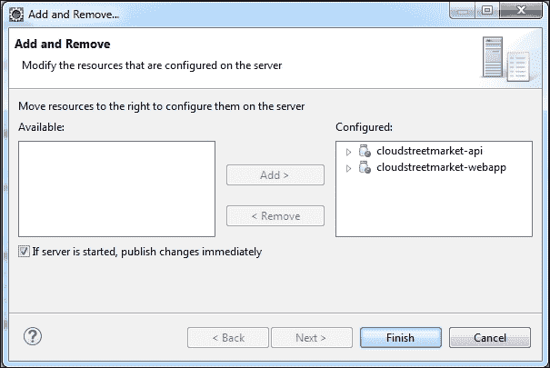

8.  尝试调用 URL `http://localhost:8080/api/indices/EUROPE/^GDAXI/histo.json`。
9.  This URL targets the presented `getHistoIndex` method handler and produces the following `json` output:

    

10.  Now let's have a look at `StockProductController`. It hosts the following method handler:

    ```java
    @RequestMapping(value="/{code}", method=GET)
    @ResponseStatus(HttpStatus.OK)
    public StockProductOverviewDTO getByCode(
    @PathVariable(value="code") StockProduct stock){
      return StockProductOverviewDTO.build(stock);
    }
    ```

    ### Tip

    这里没有对任何服务层的显式调用。还有，回归。方法处理程序的类型是`StockProductOverviewDTO`，是一个简单的 POJO。响应体的编组是透明完成的。

11.  In the **cloudstreetmarket-core** module, the `StringToStockProduct` converter must be presented because it was required to achieve the previous step:

    ```java
    @Component
    public class StringToStockProduct implements Converter<String, StockProduct> {

    @Autowired
    private ProductRepository<StockProduct> productRepository;

    @Override
    public StockProduct convert(String code) {
      StockProduct stock = productRepository.findOne(code);
      if(stock == null){
        throw new NoResultException("No result has been found for the value "+ code +" !");
      }
      return stock;
    }
    }
    ```

    ### Tip

    该转换器在`conversionService`中较早注册(*步骤 2* )。

12.  Try to call the URL `http://localhost:8080/api/products/stocks/NXT.L.json`. This should target the presented `getByCode` handler and produce the following `json` response:

    

## 它是如何工作的...

为了理解前面的元素是如何协同工作的，我们必须介绍一下`RequestMappingHandlerAdapter`的关键角色。

### 一个超级 requestmappingchandleradapter bean

我们在[第二章](2.html "Chapter 2\. Designing a Microservice Architecture with Spring MVC")、*中简单介绍了用 Spring MVC* 设计微服务架构。这个 bean 实现了高级的`HandlerAdapter`接口，该接口允许定制的 MVC 核心工作流实现。`RequestMappingHandlerAdapter`是框架自带的本地实现。

我们提到过`RequestMappingHandlerAdapter`和`RequestMappingHandlerMapping` 分别是现在已经废弃的`AnnotationMethodHandlerAdapter`和`DefaultAnnotationHandlerMapping`的两个替代类。

事实上，`RequestMappingHandlerAdapter`为所有的方法处理程序提供了更好的集中化。此外，一些新的功能已经开放给`HandlerInterceptors`和`HandlerExceptionResolver`。

### Tip

实际上，可以在`preHandle`、`postHandle`和`afterCompletion`方法的签名(`WebContentInterceptors`)中找到的处理程序参数可以被转换成`HandlerMethod`对象。`HandlerMethod`型提供了`getReturnType`、`getMethodAnnotation`、`getMethodParameters`等有趣的考试方式。

另外，关于`RequestMappingHandlerAdapter`和`RequestMappingHandlerMapping`，Spring 文档规定:

|  | 默认情况下，新的支持类由 MVC 名称空间和 MVC Java config 启用，但是如果两者都不使用，则必须显式配置 |  |
|  | -- *JavaDoc* |

在我们的两个 web 应用中，我们都特别使用了 MVC 名称空间和`<mvc:annotation-driven/>`元素。

这个元素很有趣，因为它在几个 web 特性上激活了默认配置特性。然而，在很多情况下，不同的行为仍然是可以预期的。

在大多数情况下，定制定义要么是在名称空间本身上进行的，要么是用`RequestMappingHandlerAdapter`进行的。

#### 对@RequestMapping 注释的广泛支持

`RequestMappingHandlerAdapter`的主要作用是为`HandlerMethod`类型的处理程序提供支持和定制。这些处理程序被绑定到`@RequestMapping`注释上。

|  | HandlerMethod 对象封装关于由方法和 bean 组成的处理程序方法的信息。提供对方法参数、方法返回值、方法注释的方便访问。 |  |
|  | -- *JavaDoc* |

`RequestMappingHandlerAdapter`的大部分支持方法来自历史`DefaultAnnotationHandlerMapping`。让我们仔细看看我们特别感兴趣的方法。

##### 七信差变换器

`messageConverters`模板可以通过`setMessageConverters`设置器注册为`List<HttpMessageConverter>`。Spring 将为我们将 HTTP 请求的主体解组到 Java 对象中，并将 Java 资源编组到 HTTP 响应的主体中。

重要的是要记住，框架为主要媒体类型提供了转换器实现。这些在默认情况下用`RequestMappingHandlerAdapter`和`RestTemplate`注册(在客户端)。

下表总结了我们可以利用的本机转换器:

<colgroup><col style="text-align: left"> <col style="text-align: left"> <col style="text-align: left"></colgroup> 
| 

提供的实现

 | 

默认情况下支持的媒体类型

 | 

(默认)行为

 |
| --- | --- | --- |
| `StringHttpMessageConverter` | `text/*` | 使用`text/plain`内容类型写入。 |
| `FormHttpMessageConverter` | `application/x-www-form-urlencoded` | 从`MultiValueMap<String, String>`中读取和写入表单数据。 |
| `ByteArrayHttpMessageConverter` | `*/*` | 使用`application/octet-stream`内容类型写入(可以被覆盖)。 |
| `MarshallingHttpMessageConverter` | `text/xml and application/xml` | 需要`org.springframework.oxm`和一个`Marshaller` / `Unmarshaller`。 |
| `MappingJackson2HttpMessageConverter` | `application/json` | JSON 映射可以用 Jackson 注释定制。如果需要映射特定的类型，必须注入一个定制的`ObjectMapper`属性。 |
| `MappingJackson2XmlHttpMessageConverter` | `application/xml` | XML 映射可以用 JAXB 或 Jackson 注释定制。如果需要映射特定的类型，必须将自定义的`XmlMapper`属性注入到`ObjectMapper`属性中。 |
| `SourceHttpMessageConverter` | `text/xml and application/xml` | 能读写`javax.xml.transform`。`Source`来自 HTTP 的请求和响应。仅支持`DOMSource`、`SAXSource`、`StreamSource`。 |
| `BufferedImageHttpMessageConverter` |  | 可以从 HTTP 请求和响应中读写`java.awt.image.BufferedImage`。 |

看看下面的地址，获得关于使用 Spring 的 remoting 和 web 服务的信息:[http://docs . Spring . io/Spring/docs/current/Spring-framework-reference/html/remoting . html](http://docs.spring.io/spring/docs/current/spring-framework-reference/html/remoting.html)。

在我们的应用中，我们覆盖了两个本地类`MappingJackson2HttpMessageConverter`和`MarshallingHttpMessageConverter`的定义。

##### settomtygumentresolvers

`setCustomArgumentResolvers` 设置器为`RequestMappingHandlerAdapter`提供了对自定义参数的支持。如果你还记得在[第二章](2.html "Chapter 2\. Designing a Microservice Architecture with Spring MVC")，*中使用 Spring MVC 来支持响应式设计*，第一个秘籍谈到了参数的支持注释。当时我们看到了`@PathVariable`、`@MatrixVariable`、`@RequestBody`、`@RequestParam`等等。

所有这些注释都是内置的`ArgumentResolver`。它们被映射到注册的实现，以便从外部预填充来自不同来源的参数。

我们可以定义自己的注释，并按照所需的业务逻辑预先填充我们的方法参数。这些解析器必须实现`HandlerMethodArgumentResolver`接口。

我们应用的开发并不特别要求开发`customArgumentResolver`。但是，我们已经注册了其中的两个:

*   这个解析器是一个第三方库，我们将在本章的第三个秘籍中解释它
*   `org.springframework.data.web.PageableHandlerMethodArgumentResolver`:这将允许自动解析分页参数，以便使用原生的 Spring 数据分页支持

##### setwebbindininitializer

一个 `WebBindingInitializer`接口是一个回调接口，用于全局初始化`WebDataBinder`并在 web 请求的上下文中执行数据绑定。

在继续之前，我们必须停下来，重新回顾定义以下方法的秘籍的第 4 步:

```java
  @InitBinder
  public void allowDateBinding(WebDataBinder binder){
    binder.registerCustomEditor(Date.class, new CustomDateEditor( df, true ));
  }
```

我们在控制器中定义了这个方法，使用一个`PropertyEditor`来注册一个抽象的日期转换绑定。

现在让我们把重点放在`WebDataBinder`这个论点上。在本节中，我们将讨论初始化部分。`WebDataBinder`接口提供了一些有趣的方法。这些方法主要是与验证相关的(`validate`、`setRequiredFields`、`isAllowed`、`getErrors`等)和与转换相关的(`getTypeConverter`、`registerCustomEditor`、`setBindingErrorProcessor`、`getBindingResult`等)。

一个`WebDataBinder`参数也可以被设置为一个`ConversionService`对象。我们将使用一个全局的声明性初始化，而不是在我们的`allowDateBinding`方法中(用`WebDataBinder.setConversion` setter)本地完成这项工作。

我们选择的 `WebBindingInitializer`实现是 Spring `ConfigurableWebBindingInitializer` bean。对于 Spring 应用上下文中的声明性配置，它确实是一个方便的类。它支持在多个控制器/处理器上重用预配置的初始化器。

在我们的例子中，`WebBindingInitializer`将有助于全局初始化注册类型的转换器，比如`StringToStockProduct`，同时也有助于实现我们想要的全局异常处理。

#### 转换服务应用编程接口

第 11 步定义了一个`StringToStockProduct`转换器，它允许定义一个简洁的 `getByCode`方法处理器:

```java
@RequestMapping(value="/{code}", method=GET)
@ResponseStatus(HttpStatus.OK)
public StockProductOverviewDTO getByCode(
@PathVariable(value="code") StockProduct stock){
  return StockProductOverviewDTO.build(stock);
}
```

这些转换器可以广泛地用于 Spring 应用中的任何转换，而不局限于请求范围。他们使用泛型是非常有益的。它们被绑定到一个`conversionService` bean，没有特定的方法来避免它们的单独声明。

#### 在属性编辑器或转换器之间选择

`PropertyEditors`和`ConversionService`中的转换器在字符串到类型的使用中可能是彼此的替代物。

Spring 大量使用了`PropertyEditors`的概念来设置 beans 的属性。在 Spring MVC 中，它们意味着解析 HTTP 请求。它们在 Spring MVC 中的声明被绑定到请求范围。

即使它们可以被全局初始化，您也必须将`PropertyEditors`视为最初受限的范围元素。以这种方式看待他们，使他们对`@InitBinder`方法和`WebBinderData`的依恋合法化。它们不如转换器通用。

当对枚举使用`PropertyEditors`时，Spring 提供了一个命名约定，可以避免枚举的单独声明。稍后我们将利用这个方便的约定。

## 还有更多...

在接下来的秘籍中，我们将看看其他的`RequestMappingHandlerAdapter`属性。现在，有更多关于`PropertyEditors`的讨论，尤其是内置的。

### 内置的 PropertyEditor 实现

下面的 `PropertyEditors`实现是 Spring 自带的。出于绑定的目的，可以在所有控制器中手动应用它们。你可能会认出已经在`CloudstreetApiWCI`注册的`CustomDateEditor`。

<colgroup><col style="text-align: left"> <col style="text-align: left"></colgroup> 
| 

提供的实现

 | 

默认行为

 |
| --- | --- |
| `ByteArrayPropertyEditor` | 这是字节数组的编辑器。字符串将被简单地转换成它们相应的字节表示。默认由`BeanWrapperImpl`注册。 |
| `ClassEditor` | 将字符串表示的类解析为实际的类，反之亦然。当没有找到一个类时，抛出一个`IllegalArgumentException`异常。默认由`BeanWrapperImpl`注册。 |
| `CustomBooleanEditor` | 这是一个用于布尔属性的可定制属性编辑器。默认情况下，它由`BeanWrapperImpl`注册，但是可以通过将它的自定义实例注册为自定义编辑器来覆盖它。 |
| `CustomCollectionEditor` | 这是集合的属性编辑器，将任何源集合转换为给定的目标集合类型。 |
| `CustomDateEditor` | 这是一个可定制的`java.util.Date`属性编辑器，支持定制的`DateFormat`。默认情况下不会注册。用户必须按要求以适当的格式注册它。 |
| `CustomNumberEditor` | 这是一个可定制的属性编辑器，可用于任何数字子类，如`Integer`、`Long`、`Float`或`Double`。默认情况下，它是由`BeanWrapperImpl`注册的，但是可以通过将它的一个定制实例注册为定制编辑器来覆盖它。 |
| `FileEditor` | 这个编辑器能够将字符串解析为`java.io.File`对象。默认由`BeanWrapperImpl`注册。 |
| `InputStreamEditor` | 这个是一个单向属性编辑器，能够接受一个文本字符串并产生`InputStream`(通过中间的`ResourceEditor`和`Resource`)。`InputStream`属性可以直接设置为字符串。默认用法不会关闭`InputStream`属性。默认由`BeanWrapperImpl`注册。 |

### Spring IO 参考文档

在 Spring IO Reference 文档中找到更多关于类型转换和`PropertyEditors`的细节，查看:[http://docs . Spring . IO/Spring/docs/3.0 . x/Spring-framework-Reference/html/validation . html](http://docs.spring.io/spring/docs/3.0.x/spring-framework-reference/html/validation.html)。

# 配置内容协商(JSON、XML 等)

在这个菜谱中，我们将看到如何配置我们希望系统根据客户的期望决定呈现哪种格式的方式。

## 准备就绪

我们在这里主要是回顾 XML 配置。然后，我们将使用不同的请求测试 API，以确保支持 XML 格式。

## 怎么做...

1.  `dispatcher-context.xml`中的`RequestMappingHandlerAdapter`配置已被更改。添加了一个`contentNegotiationManager`属性，以及一个`xmlConverter` bean:

    ```java
    <bean class="org.sfw.web...
      method.annotation.RequestMappingHandlerAdapter">
      <property name="messageConverters">
        <list>
          <ref bean="xmlConverter"/>
          <ref bean="jsonConverter"/>
          </list>
      </property>
      <property name="customArgumentResolvers">
        <list>
          <bean class="net.kaczmarzyk.spring.data.jpa. web.SpecificationArgumentResolver"/>
        <bean class="org.sfw.data.web. PageableHandlerMethodArgumentResolver">
          <property name="pageParameterName" value="pn"/>
          <property name="sizeParameterName" value="ps"/>
          </bean>
        </list>
      </property>
      <property name="requireSession" value="false"/>
      <property name="contentNegotiationManager" ref="contentNegotiationManager"/>
    </bean>

    <bean id="contentNegotiationManager" class="org.sfw.web.accept. ContentNegotiationManagerFactoryBean">
      <property name="favorPathExtension" value="true" />
      <property name="favorParameter" value="false" />
      <property name="ignoreAcceptHeader" value="false"/>
      <property name="parameterName" value="format" />
      <property name="useJaf" value="false"/>
      <property name="defaultContentType" value="application/json" />
      <property name="mediaTypes">
        <map>
          <entry key="json" value="application/json" />
          <entry key="xml" value="application/xml" />
       </map>
      </property>
    </bean>
    <bean id="xmlConverter" class="org.sfw.http...xml.MarshallingHttpMessageConverter">
      <property name="marshaller">
        <ref bean="xStreamMarshaller"/>
      </property>
      <property name="unmarshaller">
        <ref bean="xStreamMarshaller"/>
      </property>
    </bean>
    <bean id="xStreamMarshaller" class="org.springframework.oxm.xstream.XStreamMarshaller">
      <property name="autodetectAnnotations" value="true"/>
    </bean>
    ```

2.  一个 Maven 依赖项已被添加到`XStream`中，如下所示:

    ```java
        <dependency>
          <groupId>com.thoughtworks.xstream</groupId>
           <artifactId>xstream</artifactId>
          <version>1.4.3</version>
        </dependency>
    ```

3.  Calling the URL: `http://localhost:8080/api/indices/EUROPE/^GDAXI/histo.json` should target the `getHistoIndex()` handler the same way as before and you should receive the same `json` response:

    

4.  Also, calling the URL `http://localhost:8080/api/indices/EUROPE/^GDAXI/histo.xml` should now generate the following XML formatted response:

    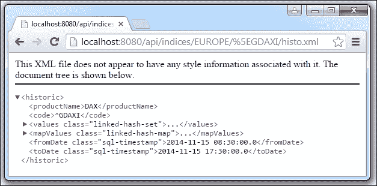

## 它是如何工作的...

我们使用`MarshallingHttpMessageConverter` bean 添加了对 XML 的支持，定义了一个默认媒体类型(`application/json`，并定义了一个全局内容协商策略。

### 支持 XML 编组

正如我们在前面的菜谱中所说的,`MarshallingHttpMessageConverter`是框架自带的，但是它需要 `spring-oxm`依赖，以及一个编组器和解组器的定义。`spring-oxm`这里引用的是美芬的人工制品:

```java
<dependency>
  <groupId>org.springframework</groupId>
  <artifactId>spring-oxm</artifactId>
  <version>${spring.version}</version>
</dependency>
```

#### XStream 编组器

我们选择`XStreamMarshaller`作为 XML 编组操作的提供者:

```java
<bean class="org.springframework.oxm.xstream.XStreamMarshaller">
  <property name="autodetectAnnotations" value="true"/>
</bean>
```

`XStream`编组器是`spring-oxm`项目的一部分。即使是*不推荐*用于外部源代码解析(这是*而不是*我们打算做的)，它也非常好，默认情况下需要很少的配置(不需要特定的类注册或初始映射策略)。

可以对类型和字段进行注释，以自定义默认行为。您可以从他们的文档中找到一些示例:

*   `@XStreamAlias`:用于类型、字段或属性
*   `@XStreamImplicit`:用于集合或数组
*   `@XStreamAsAttribute`:用于将字段标记为属性
*   `@XStreamConverter`:针对该字段的特定转换器

在我们的例子中，我们在 dto 中应用了最小的编组定制。

你可以在他们的官方网站上找到更多关于`XStream`的信息:【http://xstream.codehaus.org】T2。

### 与 ContentNegotiationManager 的谈判策略

在这里，我们正在讨论我们配置系统的方式，以选择一种媒体类型而不是另一种媒体类型来进行响应。客户端在其请求中显示期望，服务器试图从可用的分辨率中最好地满足它们。

客户端有三种方式来指定其媒体类型预期。我们将在下面的章节中讨论它们。

#### 接受标题

客户端请求指定一个 mime 类型或一系列 mime 类型(`application/json`、`application/xml`等等)作为`Accept`头的值。它是 Spring MVC 的默认选择。

网络浏览器可以发送各种各样的`Accept`头，完全依赖这些头是危险的。因此，支持至少一个备选方案是好的。

使用`ContentNegotiationManager`中的`ignoreAcceptHeader`布尔属性，甚至可以完全忽略这些头。

#### URL 路径中的文件扩展名后缀

允许在 URL 路径中指定文件扩展名后缀是一种选择。这是我们配置中的鉴别器选项。

为此，`ContentNegotiationManager`中的`favorPathExtension`布尔属性已被设置为 true，我们的 AngularJS 工厂实际上请求了`.json`路径。

#### 请求参数

如果您不喜欢路径扩展选项，您可以定义一个特定的查询参数。该参数的默认名称为`format`。可以用`parameterName`属性定制，可能的期望值是注册的格式后缀(`xml`、`html`、`json`、`csv`等)。

该选项可通过`favorParameter`布尔属性设置为鉴别器选项。

#### Java 激活框架

将 `useJaf`布尔属性设置为 true 会将后缀到媒体类型的映射配置为依赖于 Java 激活框架，而不是 Spring MVC 本身(`json`对应于`application/json`，`xml`对应于`application/xml`，等等)。

### @RequestMapping 注释作为最终过滤器

最后，带有`@RequestMapping`注释的控制器，尤其是`produces`属性，应该对呈现哪种格式有最终决定权。

## 还有更多...

现在我们将看看 JAXB2 作为 XML 解析器的实现和`ContentNegotiationManagerFactoryBean`配置。

### 使用 JAXB2 实现作为 XML 解析器

JAXB2 是当前 XML 绑定的 Java 规范。我们用`XStream`的例子只是一个例子，当然也可以使用另一个 XML 编组器。Spring 支持 JAXB2。它甚至在`spring-oxm`包中提供了一个默认的 JAXB2 实现:`org.springframework.oxm.jaxb.Jaxb2Marshaller`。

为了便于移植，在 dto 中使用 JAXB2 注释可能是更好的选择。访问 `Jaxb2Marshaller` JavaDoc 获取更多关于其配置的详细信息:[http://docs . spring . io/autore po/docs/spring/4 . 0 . 4 . release/JavaDoc-API/org/spring framework/oxm/JAXB/JAXB 2 marshaller . html](http://docs.spring.io/autorepo/docs/spring/4.0.4.RELEASE/javadoc-api/org/springframework/oxm/jaxb/Jaxb2Marshaller.html)。

### ContentNegotiationManagerFactoryBean JavaDoc

在 JavaDoc 中可以再次访问`ContentNegotiationManagerFactoryBean`的完整可能配置:

[http://docs . spring . io/spring/docs/current/javadoc-API/org/spring framework/web/accept/contentnegotiationmanagerfactorybean . html](http://docs.spring.io/spring/docs/current/javadoc-api/org/springframework/web/accept/ContentNegotiationManagerFactoryBean.html)

# 增加分页、过滤和排序功能

现在我们已经介绍了 Spring MVC 的 REST 配置的基础，我们将通过添加分页、过滤和排序功能来改进我们的 REST 服务。

## 准备就绪

分页是 Spring Data 项目中开发的一个概念。为了添加分页，我们将为从请求中填充的包装器实现引入`Pageable`接口。Spring 数据将进一步识别和处理这些问题。

Spring Data 可以生成`Page`接口，特别是`PageImpl`实例来格式化结果。我们将使用它们，因为它们非常适合 REST 渲染。

最后，我们将详细介绍这里使用的两个数据绑定工具，用于从控制器的逻辑中抽象过滤和分页。

## 怎么做...

1.  对于方法处理程序，我们添加了希望它们支持的参数。`IndexController`中的以下处理程序现在提供分页和排序:

    ```java
    import org.springframework.data.domain.PageRequest;

        @RequestMapping(value="/{market}", method=GET)
        public Page<IndexOverviewDTO> getIndicesPerMarket(
          @PathVariable MarketCode market,
          @PageableDefault(size=10, page=0, sort={"dailyLatestValue"}, direction=Direction.DESC) Pageable pageable){
            return marketService. getLastDayIndicesOverview(market, pageable);
    }
    ```

2.  In the corresponding service layer implementation, the `pageable` instance is passed to the Spring Data JPA abstracted implementation:

    ```java
    @Override
    public Page<IndexOverviewDTO> getLastDayIndicesOverview(Pageable pageable) {
        Page<Index> indices = indexProductRepository.findAll(pageable);
        List<IndexOverviewDTO> result = new LinkedList<>();
        for (Index index : indices) {
          result.add(IndexOverviewDTO.build(index));
        }
        return new PageImpl<>(result, pageable,   indices.getTotalElements());
    }
    ```

    这差不多就是关于分页和排序模式的全部内容了！所有的样板代码都是透明的。它允许我们神奇地检索一个包装在页面元素中的资源，该元素携带了前端分页可能需要的工具。对于我们的特定方法处理程序，调用 URL:

    `http://localhost:8080/api/indices/US.json?size=2&page=0&sort=dailyLatestValue`、`asc`结果在下面 JSON 响应:

    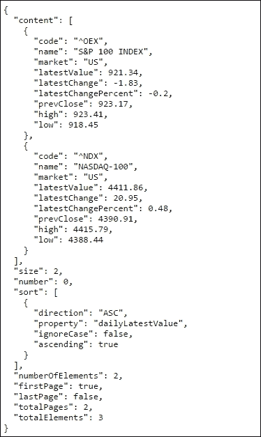

3.  我们也应用了这种模式来动态检索带有分页的索引，即使它几乎是相同的方法处理程序定义。
4.  我们还再次应用相同的模式来检索用户活动(在`CommunityController` ):

    ```java
    @RequestMapping(value="/activity", method=GET)
    @ResponseStatus(HttpStatus.OK)
    public Page<UserActivityDTO> getPublicActivities(
      @PageableDefault(size=10, page=0, sort={"quote.date"},direction=Direction.DESC) Pageable pageable){
      return communityService.getPublicActivity(pageable);
    }
    ```

5.  Now we have adapted the AngularJS layer (detailed in the *See also...* section of this recipe), we have been able to entirely rewire our welcome page to use REST services with also an infinite scrolling for user activities:

    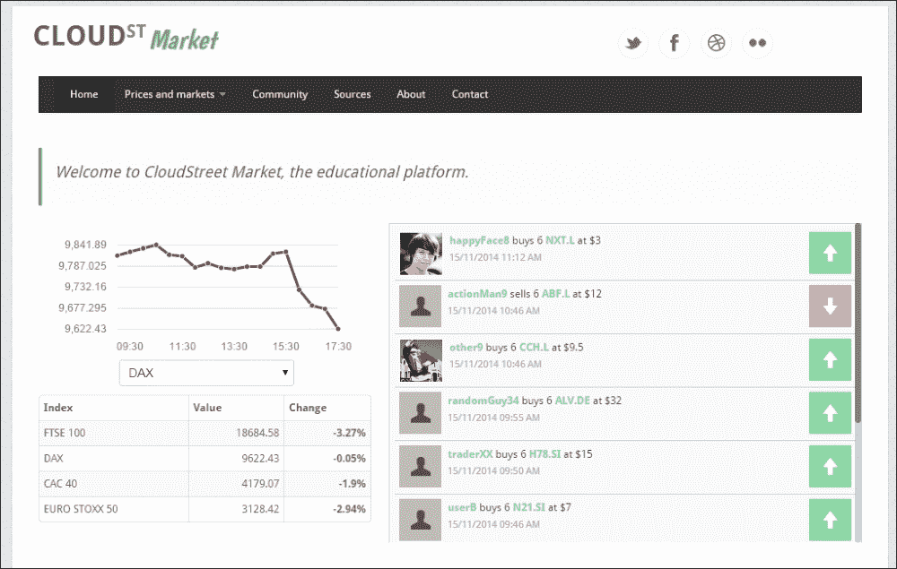

6.  To fully use the REST service's capabilities, there is now a new screen called *INDICES BY MARKET* accessible from the **Prices and markets** menu:

    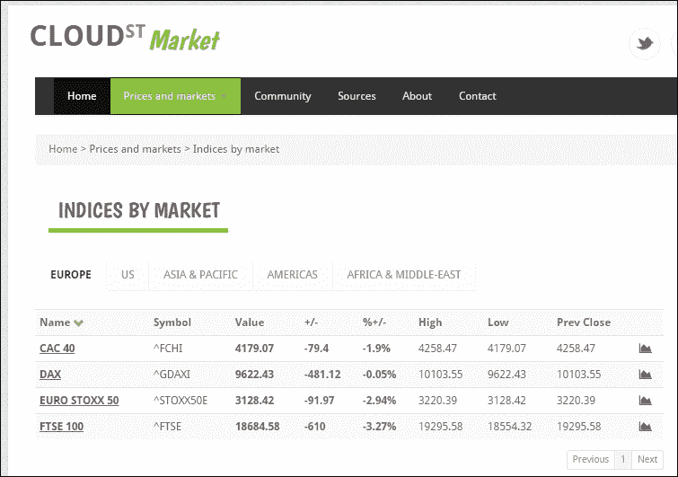

    这里呈现的表格是完全自主的，因为它具有完全成角度(AngularJS)和异步分页/排序功能。

7.  `StockProductController`对象在其`search()`方法处理程序中已经实现了分页和排序模式，但是也有一个过滤特性，允许用户结合`AND`限制

    ```java
    @RequestMapping(method=GET)
    @ResponseStatus(HttpStatus.OK)
    public Page<ProductOverviewDTO> search(
    @And(value = { @Spec(params = "mkt", path="market.code",spec = EqualEnum.class)},
       and = { @Or({
    @Spec(params="cn", path="code", spec=LikeIgnoreCase.class),
    @Spec(params="cn", path="name", spec=LikeIgnoreCase.class)})}
      ) Specification<StockProduct> spec,
    @RequestParam(value="mkt", required=false) MarketCodeParam market, 
    @RequestParam(value="sw", defaultValue="") String startWith, 
    @RequestParam(value="cn", defaultValue="") String contain, 
    @PageableDefault(size=10, page=0, sort={"dailyLatestValue"}, direction=Direction.DESC) Pageable pageable){
      return productService.getProductsOverview(startWith, spec, pageable);
    }
    ```

    来操作`LIKE` SQL 操作符
8.  中的`productService`实现，在其`getProductsOverview`方法中(如图所示)，指的是创建了`nameStartsWith`中的方法:

    ```java
    @Override
    public Page<ProductOverviewDTO> getProductsOverview(String startWith, Specification<T> spec, Pageable pageable) {
      if(StringUtils.isNotBlank(startWith)){
        spec = Specifications.where(spec).and(new ProductSpecifications<T>().nameStartsWith(startWith);
      }
      Page<T> products = productRepository.findAll(spec, pageable);
      List<ProductOverviewDTO> result = new LinkedList<>();
      for (T product : products) {
        result.add(ProductOverviewDTO.build(product));
      }
      return new PageImpl<>(result, pageable, products.getTotalElements());
    }
    ```

9.  `nameStartsWith`方法是一个规范工厂，位于`ProductSpecifications`类:

    ```java
    public class ProductSpecifications<T extends Product> {
    public Specification<T> nameStartsWith(final String searchTerm) {
      return new Specification<T>() {
      private String startWithPattern(final String searchTerm) {
        StringBuilder pattern = new StringBuilder();
    	pattern.append(searchTerm.toLowerCase());
        pattern.append("%");
        return pattern.toString();
      }
        @Override
          public Predicate toPredicate(Root<T> root,CriteriaQuery<?> query, CriteriaBuilder cb) {    
          return cb.like(cb.lower(root.<String>get("name")), startWithPattern(searchTerm));
    }
        };
      }
    }
    ```

    内部的核心模块中
10.  Overall, the `search()` REST service is extensively used over three new screens related to stocks retrieval. These screens are accessible through the **Prices and markets** menu. Here is the new **ALL PRICES SEARCH** form:

    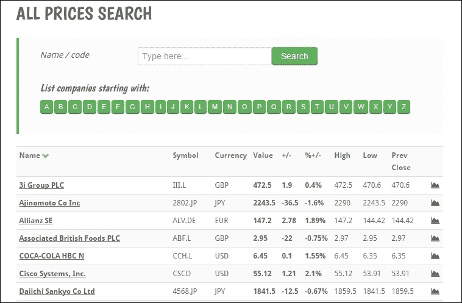

11.  The following screenshot corresponds to the **SEARCH BY MARKET** form:

    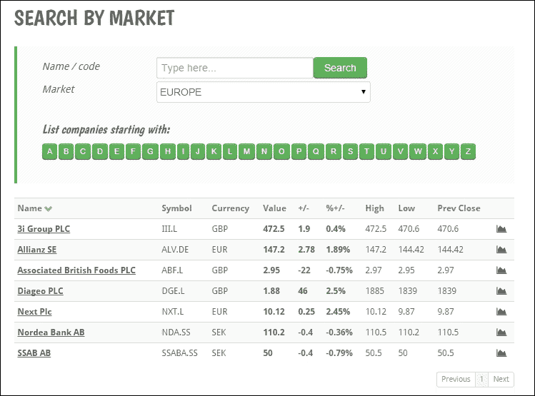

12.  Finally, find the following new **Risers and Fallers** screen:

    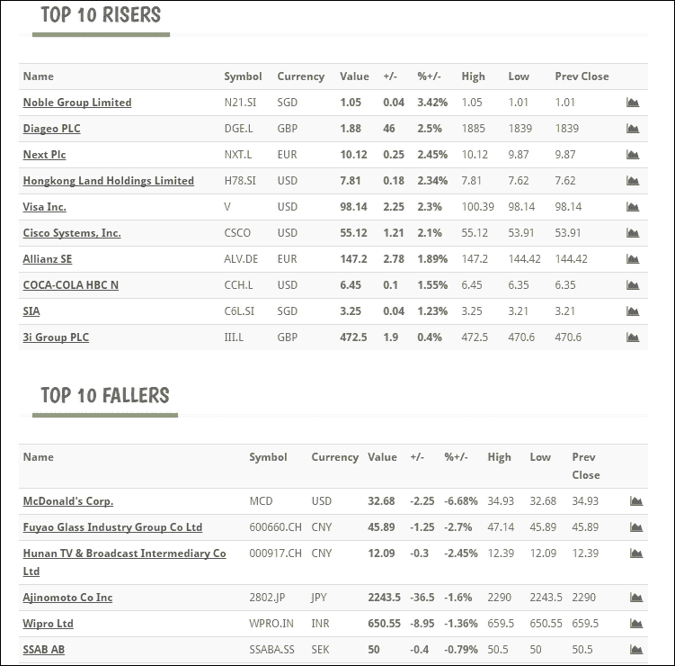

## 它是如何工作的...

同样，这个秘籍主要是关于 Spring 数据以及如何让 Spring MVC 为我们支持 Spring 数据。

### Spring 数据分页支持(你会喜欢的！)

在前一章中，我们已经看到了 Spring 数据仓库抽象的一些好处。

在这一节中，我们将看到 Spring Data 如何在其抽象存储库中支持分页概念。一个非常有益的扩展是为 Spring MVC 提供了一个特定的参数解析器，以防止任何定制的适配逻辑。

#### 存储库中的分页和排序

您可以注意到在我们的存储库接口的方法中使用了可分页的参数。例如下面是`IndexRepositoryJpa`存储库:

```java
public interface IndexRepositoryJpa extends JpaRepository<Index, 
  String>{
  List<Index> findByMarket(Market market);
  Page<Index> findByMarket(Market market, Pageable pageable);
  List<Index> findAll();
  Page<Index> findAll(Pageable pageable);
  Index findByCode(MarketCode code);
}
```

Spring Data 将`org.springframework.data.domain.Pageable`类型识别为方法参数。当不需要完整的`Pageable`实例时，它也会识别出`org.springframework.data.domain.Sort`类型。它将分页和排序动态地应用到我们的查询中。

您可以在这里看到更多示例(摘自 Spring 参考文档):

```java
Page<User> findByLastname(String lastname, Pageable pageable);
Slice<User> findByLastname(String lastname, Pageable pageable);
List<User> findByLastname(String lastname, Sort sort);
List<User> findByLastname(String lastname, Pageable pageable);
```

### Tip

记住，排序选项也是通过`Pageable`来处理的。顺便说一下，这是我们在应用中排序的方式。

从这些额外的例子中，您可以看到 Spring 数据可以返回一个`Page` `(org.springframework.data.domain.Page)`、一个`Slice` `(org.springframework.data.domain.Slice)`或者仅仅是一个`List`。

但是令人惊奇的是:一个`Page`对象包含了我们在前端构建强大分页工具所需的一切！前面，我们看到了带有一个`Page`元素的`json`响应。

使用下面的请求:`http://localhost:8080/api/indices/US.json?size=2&page=0&sort=dailyLatestValue,asc`，我们请求第一页，并收到一个`Page`对象，告诉我们这一页是第一页还是最后一页(`firstPage: true/false`、`lastPage: true/false`)、页面中的元素数量(`numberOfElements: 2`)、总页数以及元素总数(`totalPages: 2`、`totalElements: 3`)。

### Tip

这意味着 Spring Data 首先执行我们希望它执行的查询，然后在没有分页过滤器的情况下透明地执行计数查询。

一个`Slice`对象是`Page`的超接口，它不携带`numberOfElements`和`totalElements`的计数。

#### 分页和排序库< T，ID >

如果一个存储库还没有扩展`JpaRepository<T,ID>`，我们可以让它扩展`PagingAndSortingRepository<T,ID>`，它是`CrudRepository<T,ID>`的扩展。它将提供额外的方法来使用分页和排序抽象来检索实体。这些方法是:

```java
Iterable<T> findAll(Sort sort);
  Page<T> findAll(Pageable pageable);
```

#### web 部件–PageableHandlerMethodArgumentResolver

正如前面介绍的，我们已经将`org.springframework.data.web.PageableHandlerMethodArgumentResolver` bean 作为`customArgumentResolver`添加到了我们的`RequestMappingHandlerAdapter`中。这样做使我们能够依靠 Spring 数据绑定来透明地预填充一个作为方法处理程序参数的`Pageable`实例(在该方法的第一步中以粗体突出显示)。

以下是我们可以用于绑定的请求参数的更多信息:

<colgroup><col style="text-align: left"> <col style="text-align: left"> <col style="text-align: left"></colgroup> 
| 

参数名称

 | 

目的/用途

 | 

默认值

 |
| --- | --- | --- |
| `page` | 我们要检索的页面。 | 0 |
| `size` | 我们要检索的页面的大小。 | 10 |
| `sort` | 应以格式`property,property(,ASC&#124;DESC)`排序的属性。我们要切换方向就要用多个`sort`参数，比如:`?sort=firstname&sort=lastname,asc`。 | 默认的排序方向是升序。 |

正如我们在第一步中实现的那样，在缺少特定参数的情况下，可以定制默认值。这是通过`@PageableDefault`注释实现的:

```java
@PageableDefault(
size=10, page=0, sort={"dailyLatestValue"}, direction=Direction.DESC
)
```

### Tip

页面、大小和排序参数名称可以通过在 Spring 配置中设置适当的`PageableHandlerMethodArgumentResolver`属性来覆盖。

如果出于某种原因我们没有使用`PageableHandlerMethodArgumentResolver`，我们仍然可以捕获我们自己的请求参数(用于分页)并从它们构建一个`PageRequest`实例(例如，`org.springframework.data.domain.PageRequest`是一个`Pageable`实现)。

### 一个有用的规格参数解析器

在介绍这个有用的规范参数解析器之前，我们必须介绍一下规范的概念。

#### JPA 2 标准 API 和 Spring 数据 JPA 规范

Spring 数据参考文档告诉我们 JPA 2 已经引入了一个标准 API，可以用来以编程方式构建查询。当编写`criteria`时，我们实际上为一个域类定义了一个查询的 where 子句。

Spring Data JPA 从 Eric Evans 的书 *Domain Driven Design* 中获取了规范的概念，遵循相同的语义，并提供了一个 API 来使用 JPA criteria API 定义这样的规范。

为了支持规范，我们可以用`JpaSpecificationExecutor`接口扩展我们的存储库接口，就像我们在`ProductRepository`接口中所做的那样:

```java
@Repository
public interface ProductRepository<T extends Product> extends JpaRepository<T, String>, JpaSpecificationExecutor<T> {
  Page<T> findByMarket(Market marketEntity, Pageable pageable);
  Page<T> findByNameStartingWith(String param, Pageable pageable);
  Page<T> findByNameStartingWith(String param, Specification<T> spec, Pageable pageable);
}
```

在我们的示例中，`findByNameStartingWith`方法检索特定类型(`StockProduct`)的所有产品，这些产品的名称以`param`参数开头，并且符合`spec`规范。

#### 规格参数解析器

正如我们之前所说的，这个项目还没有绑定到官方的 Spring 项目上。它的使用可以适应一些用例，如本地搜索引擎，以补充 Spring 数据动态查询、分页和排序功能。

与我们从特定参数构建一个`Pageable`实例的方式相同，这个参数解析器也允许我们从特定参数透明地构建一个`Specification`实例。

它使用`@Spec`注释来定义`where`子句，如`like`、`equal`、`likeIgnoreCase`、`in`等。在`@And`和`@Or`注释的帮助下，这些`@Spec`注释可以相互组合，形成一组`AND`和`OR`子句。一个完美的用例是开发我们的搜索功能，作为分页和排序功能的补充。

你应该读一读下面这篇介绍这个项目的文章。这篇文章的标题是*“用 Spring MVC 过滤数据的替代 API&Spring Data JPA”*:

[http://blog . kazmarzyk . net/2014/03/23/alternative-API-for-filtering-data-with-spring-MVC-and-spring-data](http://blog.kaczmarzyk.net/2014/03/23/alternative-api-for-filtering-data-with-spring-mvc-and-spring-data)

此外，使用以下地址查找项目的存储库及其文档:

[https://github.com/tkaczmarzyk/specification-arg-resolver](https://github.com/tkaczmarzyk/specification-arg-resolver)

### Tip

尽管它很有用，但请记住，这个库的用户数量仍然比 Spring 社区少得多。

## 还有更多...

到目前为止，我们一直专注于 Spring MVC。然而，随着新屏幕的出现，前端(AngularJS)也发生了变化。

### 春季数据

要了解关于 Spring 数据功能的更多信息，请查看官方参考文档:

[http://docs . spring . io/spring-data/JPA/docs/1 . 8 . 0 . m1/reference/html](http://docs.spring.io/spring-data/jpa/docs/1.8.0.M1/reference/html)

### 角度路线

如果你在**主页**和**价格和市场**菜单之间导航，你会发现整个页面从未完全刷新过。所有内容都是异步加载的。

为了实现这一点，我们使用了 AngularJS 路由。为此目的创建了`global_routes.js`文件:

```java
cloudStreetMarketApp.config(function($locationProvider, $routeProvider) {
  $locationProvider.html5Mode(true);
  $routeProvider
    .when('/portal/index', {
      templateUrl: '/portal/html/home.html', 
      controller: 'homeMainController'
    })
  .when('/portal/indices-:name', {
    templateUrl: '/portal/html/indices-by-market.html', 
    controller: 'indicesByMarketTableController' 
  })
    .when('/portal/stock-search', {
      templateUrl: '/portal/html/stock-search.html', 
      controller:  'stockSearchMainController'
    })
    .when('/portal/stock-search-by-market', {
      templateUrl: '/portal/html/stock-search-by-market.html', 
      controller:  'stockSearchByMarketMainController'
    })
    .when('/portal/stocks-risers-fallers', {
      templateUrl: '/portal/html/stocks-risers-fallers.html', 
      controller:  'stocksRisersFallersMainController'
    })
    .otherwise({ redirectTo: '/' });
});
```

这里，我们定义了 routes(应用查询的 URL 路径，作为通过`href`标签导航的一部分)和 HTML 模板(在服务器上作为公共静态资源可用)之间的映射表。我们为这些模板创建了一个`html`目录。

然后，每当我们请求一个特定的 URL 路径时，AngularJS 异步加载一个模板。通常，AngularJS 操作跨闭包就是这样做的(它基本上丢弃并替换整个 DOM 部分)。由于模板只是模板，它们需要绑定到控制器，控制器通过我们的工厂操作其他 AJAX 请求，从我们的 REST API 提取数据，并呈现预期的内容。

在前面的示例中:

*   `/portal/index`是路由，即请求的路径
*   `/portal/html/home.html`是映射的模板
*   `homeMainController`是目标控制器

## 参见

有关 AngularJS 路由的更多信息，请访问:

[https://docs.angularjs.org/tutorial/step_07](https://docs.angularjs.org/tutorial/step_07)

### 使用 Angular UI 引导分页

我们已经使用了 AngularUI 团队的 UI Bootstrap 项目的分页组件([http://angular-ui.github.io/bootstrap](http://angular-ui.github.io/bootstrap))([http://angular-UI . github . io](http://angular-ui.github.io))。该项目提供了一个与 AngularJS 一起运行并为其运行的`Boostrap`组件。

在分页的情况下，我们获得一个由特定 AngularJS 指令驱动的`Bootstrap`组件(与引导样式表完美集成)。

我们的分页组件之一可以在`stock-search.html`模板中找到:

```java
<pagination page="paginationCurrentPage" 
  ng-model="paginationCurrentPage" 
  items-per-page="pageSize" 
  total-items="paginationTotalItems"
  ng-change="setPage(paginationCurrentPage)">   
</pagination>
```

`page`、`ng-model`、`items-per-page`、`total-items`和`ng-change`指令使用变量(`paginationCurrentPage`、`pageSize`和`paginationTotalItems`)，这些变量附属于`stockSearchController`范围。

### Tip

要了解这个项目的更多信息，请访问它的文档:

[http://angular-ui.github.io/bootstrap](http://angular-ui.github.io/bootstrap)

# 全局处理异常

这个秘籍展示了一种在 web 应用中全局处理异常的技术。

## 准备就绪

在 Spring MVC 中有不同的方法来处理异常。我们可以选择定义特定于控制器的`@ExceptionHandler`，也可以选择在`@ControllerAdvice`类中全局注册`@ExceptionHandler`。

我们在 REST API 中开发了第二个选项，即使我们的`CloudstreetApiWCI`超类可以在它的控制器之间共享`@ExceptionHandler`。

现在，我们将了解如何将定制和通用异常类型自动映射到 HTTP 状态代码，以及如何将正确的错误消息包装到任何客户端都可以使用的通用响应对象中。

## 怎么做...

1.  我们需要一个包装器对象在错误发生时被发送回客户端:

    ```java
    public class ErrorInfo {
        public final String error;
        public int status;
        public final String date;

        private static final DateFormat dateFormat = new SimpleDateFormat("yyyy-MM-dd HH:mm:ss.SSS");
        public ErrorInfo(Throwable throwable, HttpStatus status){
          this.error = ExceptionUtil.getRootMessage(throwable);
          this.date = dateFormat.format(new Date());
          this.status = status.value();
       }
       public ErrorInfo(String message, HttpStatus status) {
          this.error = message;
          this.date = dateFormat.format(new Date());
          this.status = status.value();
       }
      @Override
      public String toString() {
        return "ErrorInfo [status="+status+", error="+error+ ", date=" + date + "]";
      }
    }
    ```

2.  We create a `RestExceptionHandler` class annotated with `@ControllerAdvice`. This `RestExceptionHandler` class also inherits the `ResponseEntityExceptionHandler` support class, which gives us access to a default mapping exception/response status ready to be overridden:

    ```java
    @ControllerAdvice
    public class RestExceptionHandler extends ResponseEntityExceptionHandler {

       @Override
    protected ResponseEntity<Object> handleExceptionInternal(Exception ex, Object body, HttpHeaders headers, HttpStatus status, WebRequest request) {
    if(body instanceof String){
    return new ResponseEntity<Object>(new ErrorInfo((String) body, status), headers, status);
       }
      return new ResponseEntity<Object>(new ErrorInfo(ex, status), headers, status);
    }

        // 400
        @Override
    protected ResponseEntity<Object> handleHttpMessageNotReadable(final HttpMessageNotReadableException ex, final HttpHeaders headers, final HttpStatus status, final WebRequest request) {
    return handleExceptionInternal(ex, "The provided request body is not readable!", headers, HttpStatus.BAD_REQUEST, request);
    }

    @Override
    protected ResponseEntity<Object> handleTypeMismatch(TypeMismatchException ex, HttpHeaders headers, HttpStatus status, WebRequest request) {
      return handleExceptionInternal(ex, "The request parameters were not valid!", headers, HttpStatus.BAD_REQUEST, request);
      }
    (...)

    @ExceptionHandler({ InvalidDataAccessApiUsageException.class, DataAccessException.class , IllegalArgumentException.class })
    protected ResponseEntity<Object> handleConflict(final RuntimeException ex, final WebRequest request) {
        return handleExceptionInternal(ex, "The request parameters were not valid!", new HttpHeaders(), HttpStatus.BAD_REQUEST, request);
    }
    (...)

    // 500
    @ExceptionHandler({ NullPointerException.class, IllegalStateException.class })
    public ResponseEntity<Object> handleInternal(final RuntimeException ex, final WebRequest request) {
    return handleExceptionInternal(ex,  "An internal 	error happened during the request! Please try 	again or contact an administrator.", new HttpHeaders(), HttpStatus.INTERNAL_SERVER_ERROR, request);
    }
    }
    ```

    ### Tip

    `ErrorInfo`包装器和这个`RestExceptionHandler`都将支持国际化。这将在第 7 章、*开发 CRUD 操作和验证*中演示。

3.  We have created the two following property editors for the MarketCode and QuotesInterval Enums:

    ```java
    public class MarketCodeEditor extends PropertyEditorSupport{
    public void setAsText(String text) {
        try{
          setValue(MarketCode.valueOf(text));
        } catch (IllegalArgumentException e) {
          throw new IllegalArgumentException("The provided value for the market code variable is invalid!");
        }
        }
    }
    public class QuotesIntervalEditor extends PropertyEditorSupport {
        public void setAsText(String text) {
        try{
           setValue(QuotesInterval.valueOf(text));
        } catch (IllegalArgumentException e) {
          throw new IllegalArgumentException("The provided value for the quote-interval variable is invalid!");
        }
      }
    }
    ```

    ### Tip

    这两个属性编辑器是自动注册的，因为它们符合命名和位置约定。因为`MarketCode`和`QuotesInterval`是枚举值，Spring 在枚举包中寻找`MarketCodeEditor`(编辑器后缀)和`QuotesIntervalEditor`。

4.  就是这样！你可以通过在 AngularJS 工厂的`getHistoIndex`方法中(在`home_financial_graph.js`文件中)提供一个不正确的市场代码来测试它。将通话从`$http.get("/api/indices/"+market+"wrong/"+index+"/histo.json")`改为`$http.get("/api/indices/"+market+"/"+index+"/histo.json")`。
5.  After restarting the whole application (**cloudstreetmarket-webapp** and **cloudstreetmarket-api**), the call to `http://localhost:8080/portal/index` will induce the **Ajax GET** request for the index loading to result in a **400** status code:

    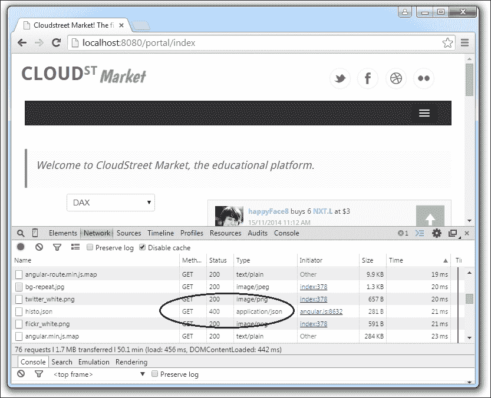

6.  More details about this failed request will show up in the `json` response:

    

    收到的错误消息— **为市场变量提供的值无效！**目前可以接受。

7.  得到这个结果后可以重置`home_financial_graph.js`文件。

## 它是如何工作的...

这里，我们关注的是在 REST 环境中处理异常的方式。预期与纯 web 应用略有不同，因为直接用户不一定是人。出于这个原因，REST API 必须保持标准的、一致的、自我解释的通信，即使流程产生了错误或者不成功。

这种一致性是通过总是从服务器向客户机返回一个关于请求处理的适当的 HTTP 状态码反馈，并总是以客户机期望的格式返回一个响应体(该格式与 HTTP 请求的 **Accept** 报头中列出的 mime 类型之一相匹配)来实现的。

### 使用@ControllerAdvice 进行全局异常处理

Spring 3.2 带来了一个解决方案，比以前的异常处理机制更适合 REST 环境。有了这个解决方案，用`@ControllerAdvice`标注的类可以在 API 的不同位置注册。这些注释通过类路径扫描进行查找，并自动注册到一个公共存储库中，以支持所有控制器(默认情况下)或控制器子集(使用注释选项)。

在我们的例子中，我们定义了一个单独的`@ControllerAdvice`来监控整个 API。想法是在`@ControllerAdvice`注释的`class(es)`中定义相关的方法，这些方法可以将特定的异常类型匹配到特定的响应实体。ReponseEntity 包含正文和响应状态代码。

这些要定义的方法都用`@ExceptionHandler`标注。该注释的选项允许您针对特定的异常类型。定义`@ControllerAdvice`的一个常见模式是让它扩展支持类`ResponseEntityExceptionHandler`。

#### 支持 ResponseEntityExceptionHandler 类

支持`ResponseEntityExceptionHandler`类提供了本地异常(如`NoSuchRequestHandlingMethodException`、`ConversionNotSupportedException`、`TypeMismatchException`等)和 HTTP 状态代码之间的预定义映射。

`ResponseEntityExceptionHandler`实现了响应呈现的通用模式。它调用声明为 protected 的特定于案例的呈现方法，例如下面的`handleNoSuchRequestHandlingMethod`。

```java
protected ResponseEntity<Object> handleNoSuchRequestHandlingMethod(NoSuchRequestHandlingMethod Exception ex, HttpHeaders headers, HttpStatus status, WebRequest request) {
    pageNotFoundLogger.warn(ex.getMessage());
  return handleExceptionInternal(ex, null, headers, status, request);
}
```

这些方法在`@ControllerAdvice`注释类中显然是完全可重写的。重要的是返回`handleExceptionInternal`方法。

这个`handleExceptionInternal`方法也被定义为受保护的，然后可以重写。这就是我们所做的——返回一个统一的`ErrorInfo`实例:

```java
@Override
protected ResponseEntity<Object> handleExceptionInternal(Exception ex, Object body, HttpHeaders headers, HttpStatus status, WebRequest request) {
  return new ResponseEntity<Object>(new ErrorInfo(ex, (body!=null)? body.toString() : null, status), headers, status);
}
```

#### 一个统一的错误响应对象

关于统一错误响应对象应该公开的字段，没有特定的标准实践。我们决定为`ErrorInfo`对象提供以下结构:

```java
{
  error: "Global categorization error message",
  message: "Specific and explicit error message",
  status: 400,
  date: "yyyy-MM-dd HH:mm:ss.SSS"
}
```

使用两个不同级别的消息(来自异常类型的全局错误消息和特定于案例的消息)允许客户端选择更合适的一个(或者两个都选！)在每种情况下在应用中呈现。

正如我们已经说过的，这个`ErrorInfo`对象还不支持国际化。我们将在稍后的第 7 章、*开发 CRUD 操作和验证*中对其进行改进。

## 还有更多...

我们在这里提供了一组与 web 环境中的异常处理相关的资源:

### HTTP 状态代码

**世界** **万维网联盟**为 HTTP/1.1 指定了明确的响应状态代码。比错误消息本身更重要的是，REST API 实现它们是至关重要的。您可以在以下网址了解更多信息:

[http://www.w3.org/Protocols/rfc2616/rfc2616-sec10.html](http://www.w3.org/Protocols/rfc2616/rfc2616-sec10.html)

### 关于 Spring MVC 中异常处理的官方文章

spring.io 博客中的一篇文章是一个非常有趣的资源。它不限于 REST 用例。可以从这个地址访问:[http://spring . io/blog/2013/11/01/exception-handling-in-spring-MVC](http://spring.io/blog/2013/11/01/exception-handling-in-spring-mvc)。

### JavaDocs

这里我们提供了两个 JavaDoc 资源的 URL，用于配置或简单的使用:

ExceptionHandlerExceptionResolver:

[http://docs . spring . io/spring/docs/current/javadoc-API/org/spring framework/web/servlet/MVC/method/annotation/exceptionhandleexceptionresolver . html](http://docs.spring.io/spring/docs/current/javadoc-api/org/springframework/web/servlet/mvc/method/annotation/ExceptionHandlerExceptionResolver.html)

ResponseEntityExceptionHandler:

[http://docs . spring . io/spring/docs/current/javadoc-API/org/spring framework/web/servlet/MVC/method/annotation/responseentityexceptionhandler . html](http://docs.spring.io/spring/docs/current/javadoc-api/org/springframework/web/servlet/mvc/method/annotation/ResponseEntityExceptionHandler.html)

## 参见

*   查看官方演示网站，该网站公开了不同类型的 Spring MVC 异常是如何呈现的:[http://MVC-exceptions-v2 . cf apps . io](http://mvc-exceptions-v2.cfapps.io)

# 用 Swagger 记录和公开一个 API

这个部分详细介绍了如何使用 Swagger 提供和公开关于 REST API 的元数据。

## 准备就绪

我们经常被要求为用户和客户记录 API。当记录一个 API 时，根据我们使用的工具，我们通常会得到一些额外的东西，比如从 API 元数据生成客户端代码的能力，甚至是为 API 生成集成测试工具。

API 元数据的格式还没有公认的通用标准。这种标准的缺乏导致市场上出现了很多针对 REST 文档的不同解决方案。

我们选择斯瓦格是因为这里有最大最活跃的社区。它从 2011 年就存在了，默认情况下，它提供了非常好的 UI/测试工具和很棒的配置。

## 怎么做...

本节详细介绍了可以做什么，以及我们在检出的 v4.x.x 分支的代码库中已经做了什么。

1.  我们为`swagger-springmvc`项目(版本 0.9.5)添加了一个 Maven 依赖项到**cloudstreetmarket-core**和**cloudstreetmarket-parent**:

    ```java
    <dependency>
      <groupId>com.mangofactory</groupId>
      <artifactId>swagger-springmvc</artifactId>
      <version>${swagger-springmvc.version}</version>
    </dependency> 
    ```

2.  下面的 swagger `configuration` 类已经被创建:

    ```java
    @Configuration
    @EnableSwagger //Loads the beans required by the framework
    public class SwaggerConfig {

      private SpringSwaggerConfig springSwaggerConfig;
      @Autowired
        public void setSpringSwaggerConfig(SpringSwaggerConfig springSwaggerConfig) {
        this.springSwaggerConfig = springSwaggerConfig;
        }
      @Bean
      public SwaggerSpringMvcPlugin customImplementation(){
          return new SwaggerSpringMvcPlugin( this.springSwaggerConfig)
              .includePatterns(".*")
              .apiInfo(new ApiInfo(
              "Cloudstreet Market / Swagger UI",
              "The Rest API developed with Spring MVC Cookbook [PACKT]",
              "",
              "alex.bretet@gmail.com",
              "LGPL",
              "http://www.gnu.org/licenses/gpl-3.0.en.html"
          ));
      }
    }
    ```

3.  以下配置已添加到`dispatch-context.xml` :

    ```java
    <bean class="com.mangofactory.swagger.configuration.SpringSwaggerConfig"/>

    <bean class="edu.zc.csm.api.swagger.SwaggerConfig"/>
    <context:property-placeholder location="classpath*:/META-INF/properties/swagger.properties" />
    ```

4.  按照之前的配置，在路径`src/main/resources/META-INF/properties`下增加了一个 swagger.properties 文件，内容:

    ```java
      documentation.services.version=1.0
      documentation.services.basePath=http://localhost:8080/api
    ```

5.  我们的三个控制器增加了一个基本文档。参见添加到`IndexController`的以下文档注释:

    ```java
    @Api(value = "indices", description = "Financial indices") 
    @RestController
    @RequestMapping(value="/indices", produces={"application/xml", "application/json"})
    public class IndexController extends CloudstreetApiWCI {

    @RequestMapping(method=GET)
    @ApiOperation(value = "Get overviews of indices", notes = "Return a page of index-overviews")
    public Page<IndexOverviewDTO> getIndices(
    @ApiIgnore @PageableDefault(size=10, page=0, sort={"dailyLatestValue"}, direction=Direction.DESC) Pageable pageable){
        return 
        marketService.getLastDayIndicesOverview(pageable);
    }

    @RequestMapping(value="/{market}", method=GET)
    @ApiOperation(value = "Get overviews of indices filtered by market", notes = "Return a page of index-overviews")
    public Page<IndexOverviewDTO> getIndicesPerMarket(
      @PathVariable MarketCode market,
      @ApiIgnore 
    @PageableDefault(size=10, page=0, sort={"dailyLatestValue"}, direction=Direction.DESC) Pageable pageable){
        return 
        marketService.getLastDayIndicesOverview(market, pageable);
    }

    @RequestMapping(value="/{market}/{index}/histo", method=GET)
    @ApiOperation(value = "Get historical-data for one index", notes = "Return a set of historical-data from one index")
    public HistoProductDTO getHistoIndex(
      @PathVariable("market") MarketCode market, 
      @ApiParam(value="Index code: ^OEX") 
      @PathVariable("index") String 
      indexCode,@ApiParam(value="Start date: 2014-01-01") @RequestParam(value="fd",defaultValue="") Date fromDate,
      @ApiParam(value="End date: 2020-12-12") 
      @RequestParam(value="td",defaultValue="") Date toDate,
      @ApiParam(value="Period between snapshots") @RequestParam(value="i",defaultValue="MINUTE_30") QuotesInterval interval){
        return marketService.getHistoIndex(indexCode, market, fromDate, toDate, interval);
      }
    }
    ```

6.  我们已经从[https://github.com/swagger-api/swagger-ui](https://github.com/swagger-api/swagger-ui)下载了 swagger UI 项目。这是一个静态文件的集合(JS、CSS、HTML 和图片)。它已经被粘贴到我们的 **cloudstreetmarket-api** 项目的 webapp 目录中。
7.  最后，为了让 Spring mvc 打开对项目中静态文件的访问，下面的 MVC 名称空间配置被再次添加到`dispatch-context.xml`中:

    ```java
    <!-- Serve static content-->
    <mvc:default-servlet-handler/>
    ```

8.  When we have this configuration, accessing the following URL on the server `http://localhost:8080/api/index.html` brings up the Swagger UI documentation portal:

    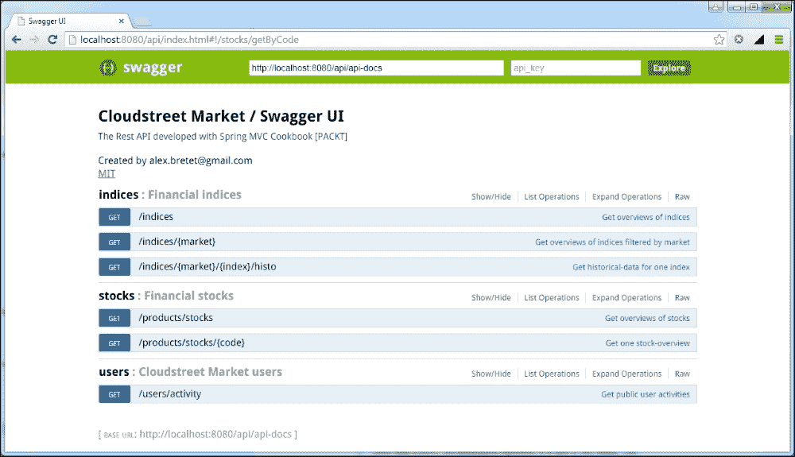

    不仅仅是一个 REST 文档库，它还是一个方便的测试工具:

    

## 它是如何工作的...

Swagger 有自己的控制器来发布我们的 API 的元数据。 Swagger UI 将这个元数据作为目标，解析它，并将其表示为一个可用的接口。

### 一个暴露的元数据

在服务器端，将`com.mangofactory/swagger-springmvc`依赖项添加到`swagger-springmvc`项目中，并使用呈现的`SwaggerConfig`类，库在根路径`/api-docs`上创建一个控制器，并在那里为 REST API 发布整个元数据。

如果您访问`http://localhost:8080/api/api-docs`，您将到达 REST API 文档的根目录:

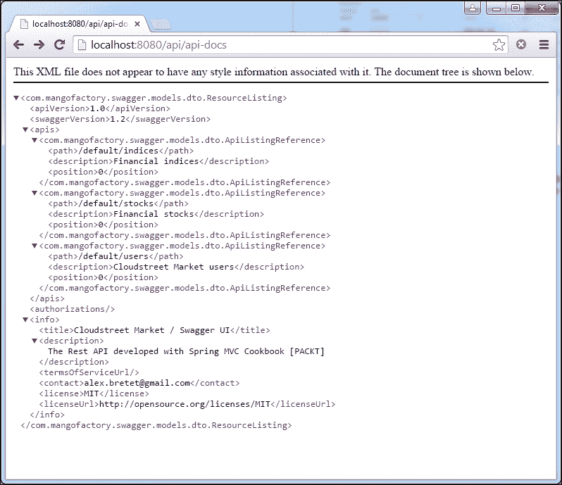

这个内容是实现 Swagger 规范的公开元数据。元数据是可导航的结构。到元数据其他部分的链接可以在 XML 内容的`<path>`节点中找到。

### 霸气的 UI

Swagger UI 只是由静态文件(CSS、HTML、JavaScript 等等)组成的。JavaScript 逻辑实现 Swagger 规范，并递归解析整个公开的元数据。然后，它动态地构建 API 文档网站和我们展示的测试工具，挖掘出每个端点及其元数据。

## 还有更多...

在本节中，我们建议您深入了解 Swagger 及其 Spring MVC 项目实现。

### 霸气十足. io

访问框架的网站及其规范: [http://swagger.io](http://swagger.io) 。

### swagger-springmvc 文档

swagger-springmvc 项目正在改变，因为它正在成为一个名为 SpringFox 的更大项目的一部分。SpringFox 现在也支持 Swagger 规范的第二个版本。我们建议您访问他们当前的参考文档:

[http://springfox.github.io/springfox/docs/current](http://springfox.github.io/springfox/docs/current)

它们还提供了从 swagger 规范 1.2(我们在这里已经实现)迁移到 swagger 规范 2.0 的迁移指南:

[https://github . com/spring fox/spring fox/blob/master/docs/transitioning-to-v2 . MD](https://github.com/springfox/springfox/blob/master/docs/transitioning-to-v2.md)

## 参见

本节将指导您使用替代工具和规范来进行 Swagger:

### 不同的工具，不同的标准

我们已经提到过，目前还没有一个通用的标准来明确地认可一种工具优于另一种工具。因此，承认 Swagger 之外的工具可能是好的，因为这个领域的发展非常快。在这里，你可以找到两篇很棒的对比文章:

*   [http://www . Mike stowe . com/2014/07/raml-vs-swagger-vs-API-blue print . PHP](http://www.mikestowe.com/2014/07/raml-vs-swagger-vs-api-blueprint.php)
*   [http://apiux.com/2013/04/09/rest-metadata-formats](http://apiux.com/2013/04/09/rest-metadata-formats)