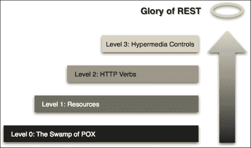
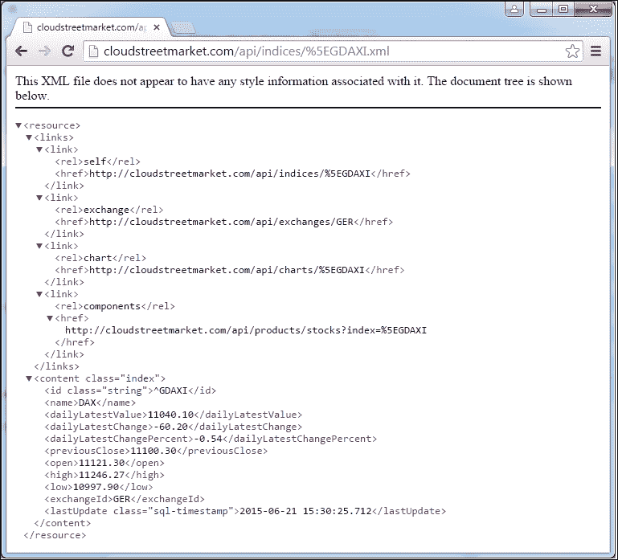
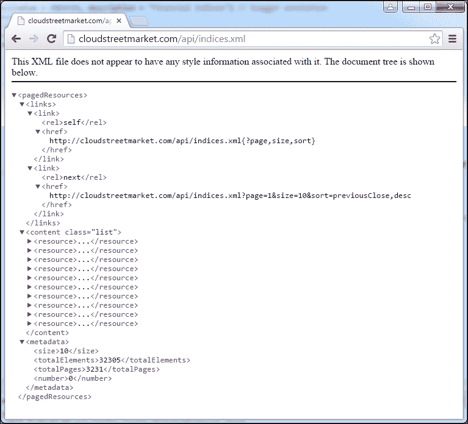
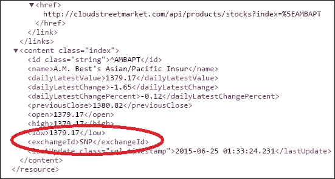
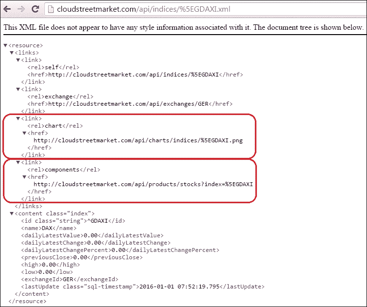
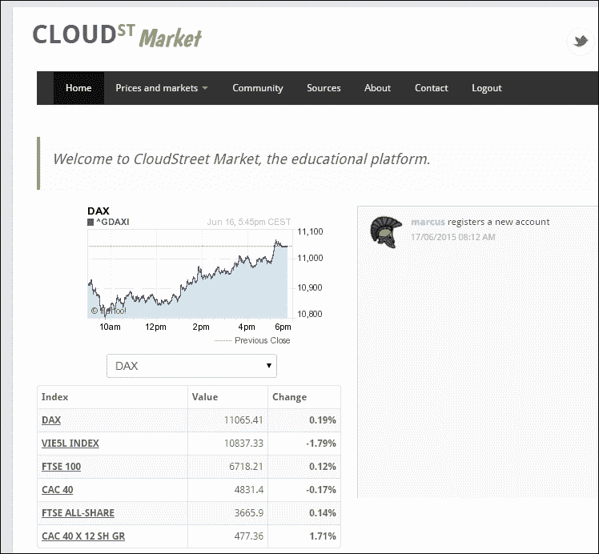

# 第六章。实施 HATEOAS

本章包含以下配方:

*   将 dto 转变为 Spring HATEOAS 资源
*   为超媒体驱动的 API 建立链接
*   选择公开 JPA 实体的策略
*   使用 OAuth 从第三方 API 检索数据

# 简介

什么是 HATEOAS？如果你以前从未见过这个单词，它会显得很难发音。有些人把它读成了仇恨。还有人说讨厌 O-A-S，重要的一点是记住这个缩写代表**超媒体作为应用状态的引擎** ( **HATEOAS** )。最起码你要记住超媒体。超媒体作为一种资源嵌入以外部资源为目标的节点的能力。由于超媒体资源与其他资源相连，它也受限于自己的领域，因为它不能在技术上开发(作为自身的一部分)其他资源的领域。

就当是**维基百科**吧。如果我们创建一个页面，它的部分不包含在页面标题(域)中，并且如果这些部分中的一个已经包含在外部页面中，管理员很少会提出这种情况。

HATEOAS 是一个适用于 REST 架构的约束。它对它的资源强加了一个域一致性，同时，它强加了一个明确的自我文档，为了整体的内聚性，所有者必须维护它。

## 理查森成熟度模型

Richardson 成熟度模型(作者 Leonard Richardson)提供了一种通过 REST 约束级别来对 REST API 进行分级和鉴定的方法:



一个 API 越符合 REST，它的等级就越高。

这个模型中的初始状态是**0 级** : **痘的沼泽**。这里，协议(通常是 HTTP)的仅用于其传输能力(不用于其状态描述特性)。此外，这里没有特定于资源的 URIs，一个方法只使用一个端点(通常是 HTTP 中的`POST`)。

**第一级:资源**的特点是实现特定于资源的 URIs。资源标识符可以在 URIs 找到。然而，仍然只使用了协议的一种方法(再次为 HTTP 发送)。

**级别 2: HTTP 动词**反映了协议属性的改进使用。对于 HTTP，这实际上意味着 API 正在利用 HTTP 方法来实现它们的目的(`GET`读取、`POST`创建、`PUT`编辑、`DELETE`删除等等)。此外，API 提供了可靠地通知用户操作状态的响应代码。

**级别 3:超媒体控件**是该模型中的最高级别。它指出了 HATEOAS 的使用，hate OAS 为客户端提供了 API 发现特性。

你可以在 Martin Fowler 的博客上阅读更多关于理查森成熟度模型的内容，网址是:

[http://Martin fowler . com/articles/richardsonmaturitymodel . html](http://martinfowler.com/articles/richardsonMaturityModel.html)

# 将 dto 转化为 Spring HATEOAS 资源

这个食谱介绍了如何创建春帽资源。即使这里强调的是一个特定的资源— `IndexResource`(代替之前的`IndexOverviewDTO`)，也可以随意浏览 **cloudstreetmarket-api** 和 **cloudstreetmarket-core** 来发现更多的变化。

HATEOAS 原则在现阶段已经应用于构成我们业务核心的所有资源，这强烈地反映了雅虎的财务数据结构！(指数、报价、产品、历史数据、图表等)。

## 怎么做……

1.  From the **Git Perspective** in Eclipse, checkout the latest version of the `v6.x.x` branch. Then, run a `maven clean install` command on the **cloudstreetmarket-parent** module (right-click on the **Maven Clean** menu under **Run as…** and then again on **Maven Install** under **Run as…**) followed by a click on **Maven Update Project** menu to synchronize Eclipse with the Maven configuration (right-click on the module and then navigate to **Maven** | **Update Project…**.)

    ### 注意

    这个分支包括 SQL 脚本，它用来自 Yahoo！。

2.  在拉出的变更中，一个新的`/app`配置目录出现在与`cloudstreetmarket-parent`和`zipcloud-parent`相同的级别。这个`/app`目录必须复制到您系统的主目录:
    *   如果您在 Windows 上，请将其复制到`C:\Users\{system.username}\app`
    *   如果你在 Linux 上，把它复制到 `/home/usr/{system.username}/app`
    *   如果你在 Mac OS X 上，在 `/Users/{system.username}/app`复制它
3.  Spring HATEOAS 具有以下依赖性。该依赖已经添加到 **cloudstreetmarket-parent** 、 **cloudstreetmarket-core** 、`and` **cloudstreetmarket-API**`:`

    ```java
    <dependency>
      <groupId>org.springframework.hateoas</groupId>
      <artifactId>spring-hateoas</artifactId>
      <version>0.17.0.RELEASE</version>
    </dependency>
    ```

4.  正如菜谱标题所暗示的，我们的目标是消除 REST API 所公开的现有 dto。目前，我们已经删除了 IndexOverviewDTO、MarketOverviewDTO、ProductOverviewDTO 和 StockProductOverviewDTO。
5.  这些 dto 已被这些类取代:IndexResource、StockProductResource、ChartResource、ExchangeResource、IndustryResource 和 MarketResource。
6.  如下面的 IndexResource 所示，所有这些新类都继承了 Spring HATEOAS 资源类:

    ```java
    @XStreamAlias("resource")
    public class IndexResource extends Resource<Index> {
      public static final String INDEX = "index";
      public static final String INDICES = "indices";
      public static final String INDICES_PATH = "/indices";

      public IndexResource(Index content, Link... links) {
        super(content, links);
      }
    }
    ```

7.  如您所见，使用 IndexResource，资源是从 JPA 实体(这里是 Index.java)创建的。这些实体存储在 content 属性名称下的资源超类型中。
8.  我们已经转换了 JPA 实体，在可识别接口的实现中抽象了它们的@ Id:

    ```java
    @Entity
    @Table(name="index_value")
    @XStreamAlias("index")
    public class Index extends ProvidedId<String> {

      private String name;

      @Column(name="daily_latest_value")
      private BigDecimal dailyLatestValue;

      @Column(name="daily_latest_change")
      private BigDecimal dailyLatestChange;

      @Column(name="daily_latest_change_pc")
      private BigDecimal dailyLatestChangePercent;

      @Column(name = "previous_close")
      private BigDecimal previousClose;

      private BigDecimal open;

      private BigDecimal high;

      private BigDecimal low;

      @ManyToOne(fetch = FetchType.EAGER)
      @JsonSerialize(using=IdentifiableSerializer.class)
      @JsonProperty("exchangeId")
      @XStreamConverter(value=IdentifiableToIdConverter.class, strings={"id"})
      @XStreamAlias("exchangeId")
       private Exchange exchange;

      @JsonIgnore
      @XStreamOmitField
      @ManyToMany(fetch = FetchType.LAZY)
      @JoinTable(name = "stock_indices", joinColumns = 
      {@JoinColumn(name = "index_code") },
      inverseJoinColumns = {@JoinColumn(name = "stock_code")})
      private Set<StockProduct> components = new LinkedHashSet<>();

      @Column(name="last_update", insertable=false, columnDefinition="TIMESTAMP DEFAULT CURRENT_TIMESTAMP")

      @Temporal(TemporalType.TIMESTAMP)
      private Date lastUpdate;

      public Index(){}

      public Index(String indexId) {
        setId(indexId);
      }

      //getters & setters

        @Override
        public String toString() {
        return "Index [name=" + name + ", dailyLatestValue=" + dailyLatestValue + ", dailyLatestChange=" + dailyLatestChange + ", dailyLatestChangePercent=" + dailyLatestChangePercent + ", previousClose=" + previousClose + ", open=" + open + ", high=" + high + ", low=" + low + ", exchange=" + exchange + ", lastUpdate=" + lastUpdate + ", id=" + id + "]";
        }
      }
    ```

9.  这里的是 ProvidedId 类的细节，它是我们可识别的实现之一:

    ```java
    @MappedSuperclass
    public class ProvidedId<ID extends Serializable> implements Identifiable<ID> {
      @Id 
      protected ID id;
      @Override
      public ID getId() {
        return id;
      }
      public void setId(ID id) {
        this.id = id;
      }
      @Override
      public String toString() {
        return id;
      }
      @Override
      public int hashCode() {
        return Objects.hash(id);
      }
      @Override
      public boolean equals(Object obj) {
        if (this == obj)
          return true;
        if (obj == null)
          return false;
        if (getClass() != obj.getClass())
          return false;
        ProvidedId <?> other = (ProvidedId <?>) obj;
        return Objects.equals(this.id, other.id);
      }
    }
    ```

## 它是如何工作的...

一个新的 Spring 依赖项，几个新的资源对象(资源子类)，最后是对我们的实体的一些修改，以便它们实现`Identifiable`接口。让我们详细汇报这一切。

### 春天的帽子资源

正如本章开头所介绍的，HATEOAS 是关于链接的。公平地说，作为框架的一部分，我们可以期待一个支持和标准化链接表示的现有类型。

这是`ResourceSupport`类(Spring HATEOAS 的一部分)的作用:支持附加到资源的链接的收集和管理。

或者，REST 资源也是一个内容。该框架还提供了一个已经继承了`ResourceSupport`的`Resource`类。

总而言之，使用 Spring HATEOAS，我们可以决定以两种不同的方式对我们的资源对象(`IndexResource`、`StockProductResource`等等)建模:

*   我们可以通过让它们直接继承`ResourceSupport`来为它们建模。通过这样做，我们必须自己将资源内容作为包装对象的一部分来管理。这里的内容不受框架的控制。
*   我们还可以通过让它们继承通用的`Resource<T>`类来对它们建模，该类的类型`T`对应于资源的`POJO`内容的类型。这是我们选择的战略。该框架为我们的资源对象(`Inde3xResource`)提供了内容绑定、链接创建，甚至是控制器级别的东西。我们很快就会看到这一切。

#### 资源支持类

`ResourceSupport`类是实现`Identifiable<Link>`的对象:

```java
public class ResourceSupport extends Object implements Identifiable<Link>
```

下面是来自`ResourceSupport` JavaDoc 的一个示例，它将为您提供对其构造函数和方法的深入了解:

<colgroup><col style="text-align: left"> <col style="text-align: left"></colgroup> 
| 

构造器

 | 

描述

 |
| --- | --- |
| `ResourceSupport()` | 这创建了一个新的`ResourceSupport`类 |

<colgroup><col style="text-align: left"> <col style="text-align: left"></colgroup> 
| 

方法

 | 

描述

 |
| --- | --- |
| `Void add(Iterable<Link> links)` | 这会将所有给定的链接添加到资源中 |
| `Void add(Link... links)` | 这会将所有给定的链接添加到资源中 |
| `Void add(Link link)` | 这将给定的链接添加到资源中 |
| `Link getId()` | 这将返回带有`Link.REL_SELF`的`rel`的链接 |
| `Link getLink(String rel)` | 这将返回带有给定`rel`的链接 |
| `List<Link> getLinks()` | 这将返回该资源中包含的所有链接 |
| `boolean hasLink(String rel)` | 这将返回资源是否包含具有给定`rel`的链接 |
| `boolean hasLinks()` | 这将返回资源是否包含链接 |
| `boolean removeLinks()` | 这将删除到目前为止添加到资源中的所有链接 |
| `Boolean equals(Object obj)` |  |
| `int hashCode()` |  |
| `String toString()` |  |

正如前面介绍的，这个类是关于链接的！我们将看到，Spring HATEOAS 提供了一个围绕链接的小型机械。

#### 资源类

`Resource` 类是`POJO`的包装器。这个`POJO`存储在这个类的一个`content`属性中。一个`Resource`类原生扩展`ResourceSupport`:

```java
public class Resource<T> extends ResourceSupport
```

下面是来自`Resource` JavaDoc 的一个示例，它提供了对其构造函数和方法的深入了解:

<colgroup><col style="text-align: left"> <col style="text-align: left"></colgroup> 
| 

构造器

 | 

描述

 |
| --- | --- |
| `Resource(T content, Iterable<Link> links)` | 这将创建一个具有给定内容和链接的新资源 |
| `Resource(T content, Link... links)` | 这个用给定的内容和链接创建一个新的资源(可选) |

<colgroup><col style="text-align: left"> <col style="text-align: left"></colgroup> 
| 

方法

 | 

描述

 |
| --- | --- |
| `TgetContent()` | 这将返回基础实体 |
| `void add(Iterable<Link> links)` | 这会将所有给定的链接添加到资源中 |
| `void add(Link... links)` | 这会将所有给定的链接添加到资源中 |
| `void add(Link link)` | 这将给定的链接添加到资源中 |
| `Link getId()` | 这将返回带有`Link.REL_SELF`的`rel`的链接 |
| `Link getLink(String rel)` | 这将返回带有给定`rel`的链接 |
| `List<Link> getLinks()` | 这将返回该资源中包含的所有链接 |
| `boolean hasLink(String rel)` | 这将返回资源是否包含具有给定`rel`的链接 |
| `boolean hasLinks()` | 这将返回资源是否包含链接 |
| `boolean removeLinks()` | 这将删除到目前为止添加到资源中的所有链接 |
| `Boolean equals(Object obj)` |  |
| `int hashCode()` |  |
| `String toString()` |  |

两个方便的构造器，一个内容获取器，以及所有链接相关的帮助器，这就是资源类的组成。

### 可识别的界面

`Identifiable` 接口在 Spring HATEOAS 中起着核心作用，因为我们稍后将介绍的关键类`Resource`、`ResourceSupport`、`Resources`和`PagedResources`都是`Identifiable`实现。我们稍后会介绍所有这些关键类。

`Identifiable`接口是一个 Spring HATEOAS 单方法接口(通用接口),用于定义对象中的`Id`:

```java
public interface Identifiable<ID extends Serializable> {
  ID getId();
}
```

因此，框架使用这个方法来检索 ID，对传入对象的性质没有什么要求。由于一个类能够实现几个接口，所以向一个对象添加这样的限定符是没有成本的。还有，这个接口的契约是最小的。

框架对这个接口(和方法)最重要的使用是从一个`Resource` 对象中构建链接。看看`LinkBuilderSupport`的`slash`法。你会注意到，如果`ID`不是`Identifiable`的一个实例(这通常是它最后的结果)，那么`Link`会附加上`ID`类型的`toString()`表示。

### Tip

如果您正在考虑实现自定义 ID 类型，请记住这种行为。

### 抽象实体的@Id

如果您计划继续使用 Spring HATEOAS，而不将其扩展到 Spring Data REST，那么可能没有必要将基本实体从它们的`@Id`中分离出来。至少不是以我们的方式。

这里，这个实践来自奥利弗·吉尔克，在他的`Spring RestBucks`申请中。Spring RestBucks 是几个现代 Spring REST 特性的展示应用程序。

### 注意

Oliver Gierke 是 Pivotal 软件公司的 Spring 数据首席开发人员..他也参与了春季帽子节。Spring Data 是一个了不起的项目和产品。我们可以相信奥利弗·吉尔克的远见和决策。

在他的`AsbtractId`实现中，O. Gierke 将`Id`属性定义为私有，并将其注释为`@JsonIgnore`。他引导我们将`Id`属性作为资源内容的一部分。在 REST 中，资源的 ID 应该是它的 URI。

如果您有机会看一看 Spring Data REST，这种方法作为框架的一部分完全有意义，它将 REST 资源与 Spring 数据存储库紧密关联起来。

我们已经决定不把 Spring Data REST 作为本书的一部分。然而，不公开实体 id 对于我们的应用程序来说并不重要。出于这些原因，也因为我们希望在这一点上保持关于[第 7 章](7.html "Chapter 7\. Developing CRUD Operations and Validations")、*开发 CRUD 操作和*、验证的约定，id 将被公开为资源属性。

## 还有更多……

如果我们的 HATEOAS 介绍不够清晰，无法让你了解这个原理，请阅读 Pivotal ( [Spring.io](http://Spring.io) )的这个演示，网址是:

[https://spring.io/understanding/HATEOAS](https://spring.io/understanding/HATEOAS)

## 参见

*   我们建议您访问 O. Gierke 的 Spring REST showcase 应用程序，它在[https://github.com/olivergierke/spring-restbucks](https://github.com/olivergierke/spring-restbucks)展示了实际上与 Spring Data REST 耦合或不耦合的 Spring Data。
*   你可以在[https://github.com/spring-projects/spring-hateoas/issues/66](https://github.com/spring-projects/spring-hateoas/issues/66)找到一些关于 ID 曝光的讨论。
*   我们建议您阅读更多关于 Spring Data REST 的内容，因为我们只介绍了一点点。Spring Data REST 在 Spring 数据存储库之上构建 REST 资源，并自动发布它们的 CRUD 服务。你可以在[http://docs . spring . io/spring-data/rest/docs/current/reference/html](http://docs.spring.io/spring-data/rest/docs/current/reference/html)了解更多信息。

# 为超媒体驱动的 API 建立链接

在这个菜谱中，我们将关注如何创建与 Spring HATEOAS 的链接，以及如何将它们绑定到资源。

我们将详述资源组装器，它们是可重用的转换组件，用于从实体(如`Index`)传递到它们的资源(`IndexResource`)。这些组件还为链接创建提供支持。

## 怎么做……

1.  The created resources (IndexResource, ChartResource, ExchangeResource, IndustryResource, MarketResource, and so on) are created from their associated Entity (Index, ChartIndex, ChartStock, Exchange, Industry, Market, and so on) using resource assemblers registered as `@Component`:

    ```java
    import static org.sfw.hateoas.mvc.ControllerLinkBuilder.linkTo;
    import static org.sfw.hateoas.mvc.ControllerLinkBuilder.methodOn;
    import org.sfw.hateoas.mvc.ResourceAssemblerSupport;
    import org.sfw.hateoas.EntityLinks;
    import static edu.zc.csm.api.resources.ChartResource.CHART;
    import static edu.zc.csm.api.resources.ExchangeResource.EXCHANGE;
    import static edu.zc.csm.api.resources.StockProductResource.COMPONENTS;

    @Component
    public class IndexResourceAssembler extends ResourceAssemblerSupport<Index, IndexResource> {
      @Autowired
      private EntityLinks entityLinks;
      public IndexResourceAssembler() {
        super(IndexController.class, IndexResource.class);
      }
      @Override
      public IndexResource toResource(Index index) {
        IndexResource resource = createResourceWithId(index.getId(), index);
        resource.add(
          entityLinks.linkToSingleResource(index.getExchange ()).withRel(EXCHANGE)
    );
      resource.add(
      linkTo(methodOn(ChartIndexController.class).get(in dex.getId(), ".png", null, null, null, null, null, 	null, null)).withRel(CHART)
    );
      resource.add(
        linkTo(methodOn(StockProductController.class).getS everal(null, null, index.getId(), null, null, 	null, null)).withRel(COMPONENTS)
    );
    return resource;
      }
      @Override
      protected IndexResource instantiateResource(Index entity) {
        return new IndexResource(entity);
      }
    }
    ```

    ### Tip

    我们已经使用了这些汇编器来生成资源附带的链接。它们使用来自`ControllerLinkBuilder` ( `linkTo`和`methodOn`)的静态方法和在资源本身中定义为常量的显式标签(`EXCHANGE`、`CHART`和`COMPONENTS`)。

2.  我们修改了以前的 SwaggerConfig 类，以便该类可以用于其他领域中基于注释的配置。此类已被重命名为 AnnotationConfig。
3.  We have also added to this AnnotationConfig class the following two annotations:

    ```java
    @EnableHypermediaSupport(type = { HypermediaType.HAL })

    @EnableEntityLinks 
    ```

    (`Because these two annotations don't have an XML equivalent yet`)。

4.  这些转换器中的所有目标控制器都用@ ExposesResourceFor 注释(在类级别上)进行了注释。
5.  这些控制器现在也返回创建的资源或资源页面:

    ```java
    @RestController
    @ExposesResourceFor(Index.class)
    @RequestMapping(value=INDICES_PATH, produces={"application/xml", "application/json"})
    public class IndexController extends CloudstreetApiWCI<Index> {
      @Autowired
      private IndexService indexService;
      @Autowired
      private IndexResourceAssembler assembler;
      @RequestMapping(method=GET)
      public PagedResources<IndexResource> getSeveral(
        @RequestParam(value="exchange", required=false) String exchangeId,@RequestParam(value="market", required=false) MarketId marketId, @PageableDefault(size=10, page=0, sort={"previousClose"}, direction=Direction.DESC) Pageable pageable){
          return pagedAssembler.toResource( indexService.gather(exchangeId,marketId, pageable), assembler);
      }
      @RequestMapping(value="/{index:[a-zA-Z0-9^.-]+}{extension:\\.[a-z]+}", method=GET)
      public IndexResource get(
        @PathVariable(value="index") String indexId, @PathVariable(value="extension") String extension){
        return assembler.toResource( indexService.gather(indexId));
    }
    }
    ```

6.  Here, we have made CloudstreetApiWCI generic. In this way, CloudstreetApiWCI can have a generic PagedResourcesAssembler @Autowired:

    ```java
    @Component
    @PropertySource("classpath:application.properties")
    public class CloudstreetApiWCI<T extends Identifiable<?>> 
      extends WebContentInterceptor {
    ...
        @Autowired
        protected PagedResourcesAssembler<T> pagedAssembler;
    ...
    }
    ```

    ### Tip

    由于将`WebCommonInterceptor`类用作共享属性和实用方法的超级控制器不是传统的目的，我们将在控制器和`WebCommonInterceptor`之间创建一个中间组件。

7.  为了让自动连接 PagedResourcesAssemblers，我们已经在 dispatcher-servlet.xml:

    ```java
      <bean class="org.sfw.data.web.PagedResourcesAssembler">
        <constructor-arg><null/></constructor-arg>
        <constructor-arg><null/></constructor-arg>
      </bean>
    ```

    中注册了一个 PagedResourcesAssembler bean
8.  As a result, now calling the API for a ^GDAXI index code (http://cloudstreetmarket.com/api/indices/%5EGDAXI.xml) produces the following output:

    

### Tip

作为链接，我们表达了端点和 URI 路径。从这些链接中，我们可以检索与某个索引相关的其他实体(如果我们想公开它们的话)。

## 它是如何工作的...

本节详细介绍了链接的创建。

### 资源组装者

这种专门的转换器(资源组装器)被认为是可重用的。它们的主要职能如下:

*   实例化资源并用内容对其进行水合
*   从实体状态或静态全局设计创建资源的链接

该框架提供了一个`ResourceAssemblerSupport`超类，其作用是减少汇编器职责中的样板代码。

`ResourceAssemblerSupport`类是一个抽象的泛型类。它通过提供一些额外的方法来丰富汇编程序。其中`T`是控制者的类或超级。类型，其签名如下:

```java
public abstract class ResourceAssemblerSupport<T, D extends ResourceSupport> implements ResourceAssembler<T, D>
```

此处的表格提供了对`ResourceAssemblerSupport` JavaDoc 的一瞥:

<colgroup><col style="text-align: left"> <col style="text-align: left"></colgroup> 
| 

方法

 | 

描述

 |
| --- | --- |
| `List<D> toResources(Iterable<? extends T> entities)` | 这将所有给定的实体转换成资源 |
| `protected D createResourceWithId(Object id, T entity)` | 这将创建一个新资源，该资源具有到给定 ID 的自身链接 |
| `D createResourceWithId(Object id, T entity, Object... parameters)` | - |
| `protected D instantiateResource(T entity)` | 这将实例化资源对象。默认实现将采用一个`no-arg`构造函数并使用反射。但是，最初可以覆盖它来手动设置对象实例(例如，如果这成为一个问题，可以提高性能) |

`ResourceAssemblerSupport`类还实现了`ResourceAssembler`，它是这里给出的一个方法接口，强制汇编器提供一个`toResource(T entity)`方法:

```java
public interface ResourceAssembler<T, D extends ResourceSupport> {
  D toResource(T entity);
} 
```

可以注意到我们已经在我们的汇编器中覆盖了`instantiateResource`方法。正如 JavaDoc 中所规定的，不覆盖它会导致框架通过反射实例化资源，在资源中寻找一个`no-arg`构造函数。

我们在这里倾向于避免在我们的资源中使用这样的构造函数，因为它们会带来一些开销。

### pagedresourcesasembler

这个令人惊叹的通用超级汇编器被用来为客户构建基于链接的资源页面。Spring HATEOAS 用非常少的配置为我们构建了一个完整的、开箱即用的、完全填充的类型化资源页面。

根据我们提供的配置，您可以尝试调用以下 URL:

[http://cloudstreetmarket.com/api/indices.xml](http://cloudstreetmarket.com/api/indices.xml)

执行此操作时，您应该获得以下输出:



你能看到 **next rel** 链接，以及它是如何通过我们的方法处理程序注释和它们的缺省值和使用值的反射构建的吗？尝试跟随**下一个**链接，看看导航是如何平滑更新和递增的。

在`IndexController.getSeveral()`方法处理程序中(如下面的代码片段所示)，我们通过使用我们的自定义`IndexResourceAssembler`生成`PagedResourcesAssembler`来确保每个资源都被正确构建(内容和链接):

```java
@RequestMapping(method=GET)
public PagedResources<IndexResource> getSeveral(
@RequestParam(value="exchange", required=false) String exchangeId,
@RequestParam(value="market", required=false) MarketId marketId,
@PageableDefault(size=10, page=0, sort={"previousClose"}, direction=Direction.DESC) Pageable pageable){
  return pagedAssembler.toResource(
  indexService.gather(exchangeId, marketId, pageable), 
  assembler);
}
```

### 构建链接

让我们来看一下在汇编器中构建资源链接的方式。在`IndexResourceAssembler`中介绍的`toResource()`方法使用了两种不同的技术。

第一种技术通过 **EntityLinks** 使用 JPA 实体；第二个，通过`ControllerLinkBuilder`静态方法，直接使用`Controllers`。

#### 实体链接

通过在配置类中声明 `@EnableEntityLinks`注释，一个`EntityLinks`实现被注册:`ControllerEntityLinks`。查找 **ApplicationContext** 的所有 Spring MVC 控制器，以搜索带有`@ExposesResourceFor(xxx.class)`注释的控制器。

Spring MVC 控制器上的`@ExposesResourceFor`注释公开了控制器管理的模型类型。这种注册实现了控制器和 JPA 实体之间所需的映射。

还必须注意，注册的`ControllerEntityLinks`实现假设控制器上有某个`@RequestMapping`配置。`@RequestMapping`配置如下:

*   对于资源集合，需要一个类级别的`@RequestMapping`注释。然后，控制器必须公开映射到空路径的方法处理程序，例如，`@RequestMapping(method = RequestMethod.GET)`。
*   对于单个资源来说，这些资源通过托管 JPA 实体的`id`来公开，例如`@RequestMapping("/{id}")`。

认识到这一点后，`EntityLinks`实现(`ControllerEntityLinks`)被用于从`@Autowiring`生成`Links`，使用它提供的方法集合:

```java
public interface EntityLinks extends Plugin<Class<?>>{ 
  LinkBuilder linkFor(Class<?> type);
  LinkBuilder linkFor(Class<?> type, Object... parameters);
  LinkBuilder linkForSingleResource(Class<?> type, Object id);
  LinkBuilder linkForSingleResource(Identifiable<?> entity);
  Link linkToCollectionResource(Class<?> type);
  Link linkToSingleResource(Class<?> type, Object id);
  Link linkToSingleResource(Identifiable<?> entity);
}
```

#### 控制器链接生成器

正如所介绍的，Spring HATEOAS 提供了`ControllerLinkBuilder`实用程序，它允许通过指向控制器类来创建链接:

```java
resource.add(
  linkTo(
  methodOn(StockProductController.class)
  .getSeveral(null, null, index.getId(), null, null, null, null)
  )
  .withRel(COMPONENTS)
);
```

正如 Spring HATEOAS reference 中所指定的，`ControllerLinkBuilder`使用 Spring 的`ServletUriComponentsBuilder`从当前请求中获取基本的 URI 信息。

如果我们的应用程序在`http://cloudstreetmarket/api`运行，那么框架将在这个根 URI 之上构建`Links`，给它添加根控制器映射(`/indices`)，然后添加随后的方法处理程序特定路径。

## 还有更多……

### 正则表达式在@RequestMapping 中的使用

在 `IndexController`、`StockProductController`、`ChartStockController`和`ChartIndexController`中，检索单个资源的`GET`方法处理程序有一个特殊的`@RequestMapping`定义。

下面是 IndexController 的`get()`方法:

```java
@RequestMapping(value="/{index:[a-zA-Z0-9^.-]+}{extension:\\.[a-z]+}", method=GET)
public IndexResource get(
  @PathVariable(value="index") String indexId, 
  @PathVariable(value="extension") String extension){
  return assembler.toResource(indexService.gather(indexId));
}
```

我们最终选择了这个，因为雅虎！索引代码似乎比简单的字符串更复杂一些。尤其是考虑到这些代码可以携带一个或多个点的事实。

这种情况导致 Spring MVC 无法正确区分`@PathVariable`索引和`extension`(中途将它们剥离)。

幸运的是，Spring MVC 允许我们用正则表达式定义 URI 模板模式。语法是`{varName:regex}`，其中第一部分定义变量名，第二部分定义正则表达式。

您会注意到我们为索引定义的正则表达式:

Yahoo！的索引代码中通常使用的是`[a-zA-Z0-9^.-]+`表达式，它特别允许使用`^`和`.`字符。

## 参见

*   想要了解更多关于 Spring HATEOAS 的信息，请参考[http://docs . Spring . io/Spring-HATEOAS/docs/current/reference/html/](http://docs.spring.io/spring-hateoas/docs/current/reference/html/)。
*   引入的 HATEOAS 表示实现了**超文本应用语言** ( **HAL** )。Spring HATEOAS 支持 HAL 作为默认渲染。在[https://tools.ietf.org/html/draft-kelly-json-hal-06](https://tools.ietf.org/html/draft-kelly-js)和[http://stateless.co/hal_specification.html](http://stateless.co/hal_specification.html)了解更多关于 HAL 规范的信息。

# 选择公开 JPA 实体的策略

资源中暴露的 `content`对象是 JPA 实体。将 JPA 实体包装在资源中的有趣之处在于实体本身的低级性质，它应该代表一个受限的可识别的域区域。理想情况下，这个定义应该完全转化为公开的 REST 资源。

那么，我们如何在 REST HATEOAS 中表示实体呢？我们如何安全一致地表示 JPA 协会？

这个食谱提供了一个简单而保守的方法来回答这些问题。

## 怎么做……

1.  我们已经介绍了一个用作资源的实体(`Index.java`)。这里是使用的另一个实体:`Exchange.java`。该实体采用类似的策略来暴露其 JPA 关联:

    ```java
    import edu.zc.csm.core.converters.IdentifiableSerializer;
    import edu.zc.csm.core.converters.IdentifiableToIdConverter;

    @Entity
    public class Exchange extends ProvidedId<String> {
      private String name;

      @ManyToOne(fetch = FetchType.EAGER)
      @JoinColumn(name = "market_id", nullable=true)
      @JsonSerialize(using=IdentifiableSerializer.class)
      @JsonProperty("marketId")
      @XStreamConverter(value=IdentifiableToIdConverter.class, strings={"id"})
      @XStreamAlias("marketId")
      private Market market;

      @OneToMany(mappedBy = "exchange", cascade = CascadeType.ALL, fetch=FetchType.LAZY)
      @JsonIgnore
      @XStreamOmitField
      private Set<Index> indices = new LinkedHashSet<>();

      @OneToMany(mappedBy = "exchange", cascade = CascadeType.ALL, fetch=FetchType.LAZY)
      @JsonIgnore
      @XStreamOmitField
      private Set<StockProduct> stocks = new LinkedHashSet<>();

      public Exchange(){}
      public Exchange(String exchange) {
        setId(exchange);
      }

      //getters & setters

      @Override
          public String toString() {
            return "Exchange [name=" + name + ", market=" + market + ", id=" + id+ "]";
          }
    } 
    ```

2.  `Exchange.java`实体引用了两个定制的实用程序类，它们用于转换获取外部实体的方式，作为主实体呈现(JSON 或 XML)的一部分。这些实用程序类是下面的`IdentifiableSerializer`和`IdentifiableToIdConverter`:
    *   `IdentifiableSerializer`类用于 JSON 编组:

        ```java
        import org.springframework.hateoas.Identifiable;
        import com.fasterxml.jackson.core.JsonGenerator;
        import com.fasterxml.jackson.core.JsonProcessingException;
        import com.fasterxml.jackson.databind.JsonSerializer;
        import com.fasterxml.jackson.databind.SerializerProvider;
        public class IdentifiableSerializer extends JsonSerializer<Identifiable<?>> {
           @Override
           public void serialize(Identifiable<?> value, JsonGenerator jgen, SerializerProvider provider) throws IOException, JsonProcessingException {
            provider.defaultSerializeValue(value.getId(), jgen);
           }
        }
        ```

    *   `IdentifiableToIdConverter`类用于 XML marshlling，并且是用 XStream 依赖项构建的:

        ```java
        import com.thoughtworks.xstream.converters.Converter;
        public class IdentifiableToIdConverter implements Converter {
            private final Class <Identifiable<?>> type;
            public IdentifiableToIdConverter(final Class <Identifiable<?>> type, final Mapper mapper, final ReflectionProvider reflectionProvider, final ConverterLookup lookup, final String valueFieldName) {
                this(type, mapper, reflectionProvider, lookup, valueFieldName, null);
            }
          public IdentifiableToIdConverter(final Class<Identifiable<?>> type, final Mapper mapper, final ReflectionProvider reflectionProvider, final ConverterLookup lookup, final String valueFieldName, Class valueDefinedIn) {
                this.type = type;
                Field field = null;
                try {
          field = (valueDefinedIn != null? valueDefinedIn : type.getSuperclass()).getDeclaredField("id");
          if (!field.isAccessible()) {
            field.setAccessible(true);
            }
              } catch (NoSuchFieldException e) {
                throw new IllegalArgumentException( 	e.getMessage()+": "+valueFieldName);
                  }
              }
              public boolean canConvert(final Class type) {
                return type.isAssignableFrom(this.type);
            }
            public void marshal(final Object source, final HierarchicalStreamWriter writer,final 	MarshallingContext context) {
                  if(source instanceof Identifiable){
                    writer.setValue( ((Identifiable<?>)source).getId() .toString()
                  );
                }
              }
            public Object unmarshal(final HierarchicalStreamReader reader, final UnmarshallingContext context) {
              return null;
            }
        }
        ```

## 它是如何工作的...

让我们来理解这个策略是如何运作的。

### 其余 CRUD 原则

REST 架构的一个约束是呈现统一的接口。统一接口是通过从端点公开资源来实现的，这些端点都可以通过不同的 HTTP 方法(如果适用)来定位。

资源也可以在几种表示下公开(`json`、`xml`等等)，信息或错误消息必须是自描述的。HATEOAS 的实现为 API 的自解释特性提供了巨大的好处。

在休息的时候，事情越直观越能推断越好。从这个角度来看，作为一名 web/UI 开发人员，我应该能够假设以下情况:

*   我从端点上的`GET`调用接收到的对象的结构将是我必须用`PUT`调用发回的预期结构(对象的版本)
*   类似地，相同的结构应该用于新对象的创建(`POST`方法)

不同 HTTP 方法之间的有效负载结构的一致性是一个可靠而保守的论点，在捍卫 API 利益时使用。*几乎总是捍卫 API 利益的时候*。

### 暴露最小

暴露最少量的信息是本章重构的核心思想。这通常是确保一个端点不会被用来暴露初始控制器外部的信息数据的好方法。

一个 JPA 实体可以关联到其他实体(`@OneToOne`、`@OneToMany`、`@ManyToOne`或`@ManyToMany`)。

其中一些联想被标注了`@JsonIgnore`(和`@XStreamOmitField`)，还有一些联想被标注了`@JsonSerialize`和`@JsonProperty`(和`@XStreamConverter`和`@XStreamAlias`)。

#### 如果实体不拥有该关系

在这种情况下，实体的数据库表没有指向目标第二个实体的表的外键。

这里的策略是完全忽略 REST 中的关系来反映数据库状态。

`ignore`指令取决于支持的表示和选择的实现。

对于`json`，我们使用`Jackson`，解决方案是:`@JsonIgnore`。

对于`xml`，我们使用`XStream`，解决方案是:`@XstreamOmitField`。

#### 如果实体拥有关系

这里，实体的数据库表有一个外键，即目标第二实体的表。

如果我们计划更新这个表的一个实体，它依赖于另一个表的一个实体，我们将必须为这个实体提供这个外键。

想法是将这个外键作为一个专用字段公开，就像数据库表的所有其他列一样。同样，实现这一点的解决方案取决于支持的表示和配置的封送拆收器。

对于`json`和`Jackson`，我们已经用下面的代码片段完成了:

```java
@JsonSerialize(using=IdentifiableSerializer.class)
@JsonProperty("marketId")
```

如您所见，我们重命名了属性，以表明我们正在呈现(并期待)一个 ID。我们已经创建了`IdentifiableSerializer`类，它从实体(从`Identifiable`接口)中提取`ID`，并只将这个`ID`放入属性值中。

对于`xml`和`XStream`，已经:

```java
@XStreamConverter(value=IdentifiableToIdConverter.class, strings={"id"})
@XStreamAlias("marketId")
```

以同样的方式，我们重命名属性以表明我们正在呈现一个`ID`，并且我们将自定义转换器`IdentifiableToIdConverter`作为目标，该转换器也只选择实体的 **ID** 作为属性值。

以下是`^AMBAPT`索引的`xml`表示示例:



### 资源分离

这种策略促进了资源之间的明确分离。每个资源显示的字段与数据库模式完全匹配。对于不同的 HTTP 方法，这是 web 开发中保持 HTTP 请求有效负载不变的标准做法。

当采用 HATEOAS 时，我们应该充分鼓励使用链接来访问相关实体，而不是嵌套视图。

前一个菜谱*为超媒体驱动的 API* 构建链接，展示了访问(使用链接)与`@...ToOne`和`@...ToMany`相关联的实体的例子。下面是在前面的配方中实现的暴露实体中的这些链接的示例:



## 还有更多……

我们在这里详细说明实现的编组器的官方信息来源。

### Jackson 自定义序列化程序

您可以在以下网址找到这些序列化程序的官方 wiki 页面指南:

[http://wiki . faster XML . com/Jackson howtoccustomserializers](http://wiki.fasterxml.com/JacksonHowToCustomSerializers)

### XStream 转换器

XStream 已经从 codehaus.org 的[迁移到 T4 的 **Github。若要跟随关于 XStream 转换器的官方教程，请访问:**](http://codehaus.org)

[http://x-stream.github.io/converter-tutorial.html](http://x-stream.github.io/converter-tutorial.html)

# 使用 OAuth 从第三方 API 检索数据

在使用 OAuth2 认证用户之后，了解如何使用用户的 OAuth2 帐户调用远程第三方 API 是很有用的。

## 怎么做……

1.  您可能已经注意到，`IndexController`、`StockProductController`、`ChartIndexController`和`ChartStockController`调用名为`gather(…)`的底层服务方法。这个概念表明对第三方提供商(Yahoo！)正在进行。
2.  比如在`IndexServiceImpl`中，你可以找到`gather(String indexId)`的方法:

    ```java
    @Override
    public Index gather(String indexId) {
        Index index = indexRepository.findOne(indexId);
        if(AuthenticationUtil.userHasRole(Role.ROLE_OAUTH2)){
          updateIndexAndQuotesFromYahoo(index != null ? Sets.newHashSet(index) : Sets.newHashSet(new Index(indexId)));
          return indexRepository.findOne(indexId);
        }
      return index;
    }
    ```

3.  实际上是`updateIndexAndQuotesFromYahoo(…)`方法将服务层连接到第三方 API:

    ```java
      @Autowired
      private SocialUserService usersConnectionRepository;

      @Autowired
      private ConnectionRepository connectionRepository;

      private void updateIndexAndQuotesFromYahoo(Set<Index> askedContent) {
          Set<Index> recentlyUpdated = askedContent.stream()
          .filter(t -> t.getLastUpdate() != null && DateUtil.isRecent(t.getLastUpdate(), 1))
            .collect(Collectors.toSet());

        if(askedContent.size() != recentlyUpdated.size()){
          String guid = AuthenticationUtil.getPrincipal().getUsername();
        String token = usersConnectionRepository .getRegisteredSocialUser(guid) .getAccessToken();
        Connection<Yahoo2> connection = connectionRepository .getPrimaryConnection(Yahoo2.class);
        if (connection != null) {
          askedContent.removeAll(recentlyUpdated);
            List<String> updatableTickers = askedContent.stream()
             .map(Index::getId)
             .collect(Collectors.toList());
         List<YahooQuote> yahooQuotes = connection.getApi() .financialOperations().getYahooQuotes(updatableTickers, token);

         Set<Index> upToDateIndex = yahooQuotes.stream()
           .map(t -> yahooIndexConverter.convert(t))
           .collect(Collectors.toSet());

          final Map<String, Index> persistedStocks = indexRepository.save(upToDateIndex) 	.stream()
            .collect(Collectors.toMap(Index::getId, Function.identity()));

         yahooQuotes.stream()
          .map(sq -> new IndexQuote(sq, persistedStocks.get(sq.getId())))
            .collect(Collectors.toSet());
          indexQuoteRepository.save(updatableQuotes);
        }
      }
    } 
    ```

4.  在脸书、Twitter 或 LinkedIn 的例子中，你应该能够找到一个完整的 API 适配器来执行对它们的 API 的调用，而不必修改它。在我们的例子中，我们必须开发所需的适配器，以便可以从 Yahoo！
5.  我们向一个`FinancialOperations`接口添加了两个方法，如下面的代码片段所示:

    ```java
    public interface FinancialOperations {
      List<YahooQuote> getYahooQuotes(List<String> tickers, String accessToken) ;
      byte[] getYahooChart(String indexId, ChartType type, ChartHistoSize histoSize, ChartHistoMovingAverage histoAverage, ChartHistoTimeSpan histoPeriod, Integer intradayWidth, Integer intradayHeight, String token);
    }
    ```

6.  这个接口有一个如下的`FinancialTemplate`实现:

    ```java
    public class FinancialTemplate extends AbstractYahooOperations implements FinancialOperations {
        private RestTemplate restTemplate;
      public FinancialTemplate(RestTemplate restTemplate, boolean isAuthorized, String guid) {
        super(isAuthorized, guid);
        this.restTemplate = restTemplate;
        this.restTemplate.getMessageConverters() add( new YahooQuoteMessageConverter( MediaType.APPLICATION_OCTET_STREAM));
        }
      @Override
      public List<YahooQuote> getYahooQuotes(List<String> tickers, String token)  {
          requiresAuthorization();
          final StringBuilder sbTickers = new StringBuilder();
          String url = "quotes.csv?s=";
          String strTickers = "";
          if(tickers.size() > 0){
            tickers.forEach(t -> strTickers = sbTickers.toString();
              strTickers = strTickers.substring(0, strTickers.length()-1);
          }
           HttpHeaders headers = new HttpHeaders();
           headers.set("Authorization", "Bearer "+token);
           HttpEntity<?> entity = new HttpEntity<>(headers);
           return restTemplate.exchange(buildUri(FINANCIAL, url.concat(strTickers).concat("&f=snopl1c1p2hgbavx	c4")), HttpMethod.GET, entity , QuoteWrapper.class).getBody();
      } 
      ...
    }
    ```

7.  `FinancialTemplate`类作为全局`Yahoo2Template`的一部分被初始化，该全局`Yahoo2Template`由`IndexServiceImpl`的`connection.getApi()`调用返回。
8.  Using this technique to pull (as needed) not only indices and stock quotes from Yahoo! but also graphs, we are now able to display real-time data from more than 25,000 stocks and 30,000 indices.

    

9.  The client side is capable of using the provided HATEOAS links that come along with each result element. It uses these links to render detail views such as **Index detail** or **Stock detail** (new screens).

    

## 它是如何工作的...

让我们来理解这个食谱背后的理论。

### 雅虎财务数据介绍！

在我们应用程序的上下文中，仍然有一个重构需要解释。它是关于历史数据和图表的。

雅虎！财务 API 提供历史数据。这些数据可以用来构建图表，最初计划就是这样做的。现在，雅虎！还可以生成图表(历史数据和当天数据),这些图表是非常可定制的(时间段、平均线、图表或股票的显示选项，等等)。

我们已经决定放弃历史部分，这在技术上非常类似于报价检索(数据快照)，专门使用雅虎生成的图表！

#### 图形生成/显示

我们的实现为 REST 中的图像服务提供了一个有趣的例子。看看`ChartIndexController`(或者`ChartStockController`)看看图像是如何作为字节数组返回的。

还要看看`home_financial_graph.js`文件，如何将接收到的内容设置成 HTML ``标记。

### 财务数据是如何拉/刷新的？

这里的想法是依靠 OAuth 认证的用户。雅虎！为认证和非认证用户提供不同的速率和限制。未经认证的呼叫在 Yahoo！在我们的例子中，调用 IP(或多或少)是整个`CloudstreetMarket`应用程序的 IP。如果雅虎！认为有太多的电话来自我们的 IP，这将是一个问题。然而，如果有太多的电话来自一个特定的用户，雅虎！将在不影响应用程序其余部分的情况下限制该用户(并且这种情况可以由应用程序进一步恢复)。

如您所见，潜在处理 Yahoo！财务数据的方法处理程序。通过名为`gather()`的方法调用适当的底层服务。

在这些方法中，雅虎！第三方 API 会干扰我们的数据库和控制器。

如果用户通过了 OAuth2 的身份验证，底层服务将检查数据库中是否存在该数据，以及该数据最近是否被更新到足以匹配该数据类型的预定义缓冲期(一分钟用于`indices`和`stocks`):

*   如果答案是肯定的，那么这个数据被返回给客户机
*   如果答案是否定的，则向 Yahoo！，转换，存储在数据库中，并返回给客户端

目前还没有为没有通过 OAuth 认证的用户制定任何计划，但是我们可以想象使用一个普通的 Yahoo！OAuth 帐户。

### 调用第三方服务

对于给出的配方，这部分是用`updateIndexAndQuotesFromYahoo`方法完成的。我们的 Spring 配置为每个用户定义了一个带有`request`范围的`connectionRepository` bean。`connectionRepository`实例是从我们的`SocialUserServiceImpl`的`createConnectionRepository`工厂方法中创建的。

基于此，我们`@Autowire`在我们的服务层中的这两个 beans:

```java
@Autowired
private SocialUserService usersConnectionRepository;
@Autowired
private ConnectionRepository connectionRepository;
```

然后，`updateIndexAndQuotesFromYahoo`方法从 Spring Security 获取登录的`userId` ( `guid`):

```java
String guid = AuthenticationUtil.getPrincipal().getUsername();
```

访问令牌是从`SocialUser`实体中提取的(来自数据库):

```java
String token = usersConnectionRepository .getRegisteredSocialUser(guid).getAccessToken();
```

雅虎！从数据库中检索连接:

```java
Connection<Yahoo2> connection = connectionRepository.getPrimaryConnection(Yahoo2.class);
```

如果连接不为空，则从连接对象调用第三方 API:

```java
List<YahooQuote> yahooQuotes = connection.getApi() .financialOperations().getYahooQuotes(updatableTickers, token);
```

再一次，我们不得不开发实际的`FinancialTemplate`(Yahoo！财务 API)，但是您应该能够为您的第三方提供商找到这样的现有实现。

## 还有更多……

这一节提供了我们可以在项目中使用的许多现有开源 Spring Social adaptors 的列表

### Spring Social——现有的 API 提供商

下面的地址提供了 Spring social extensions 的最新聚合，为许多流行的服务提供商提供连接支持和 API 绑定:

[https://github . com/spring-projects/spring-social/wiki/Api-Providers](https://github.com/spring-projects/spring-social/wiki/Api-Providers)

## 参见

*   雅虎！金融股票行情系统:我们已经用一组雅虎的金融参考资料预填充了我们的数据库。(股票参考和指数参考)，它允许我们指向和搜索资源，可以再次通过 Yahoo！API。这组引用来自于**萨米尔汗**在他的博客[http://investexcel.net/all-yahoo-finance-stock-tickers](http://investexcel.net/all-yahoo-finance-stock-tickers)上发表的伟大作品。然后，我们使用基本的文本编辑器和宏将 XLS 数据转换成 SQL。