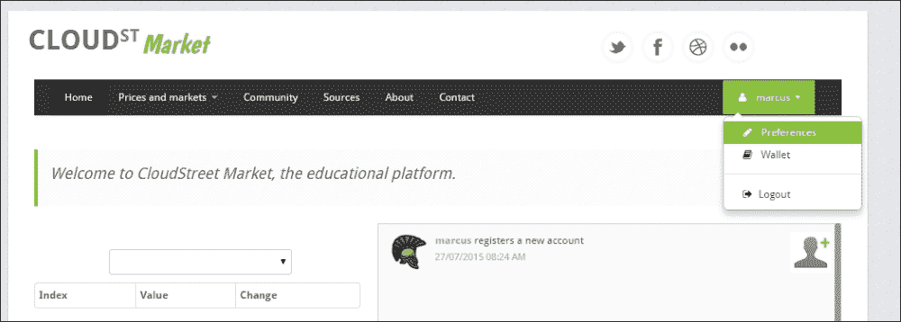
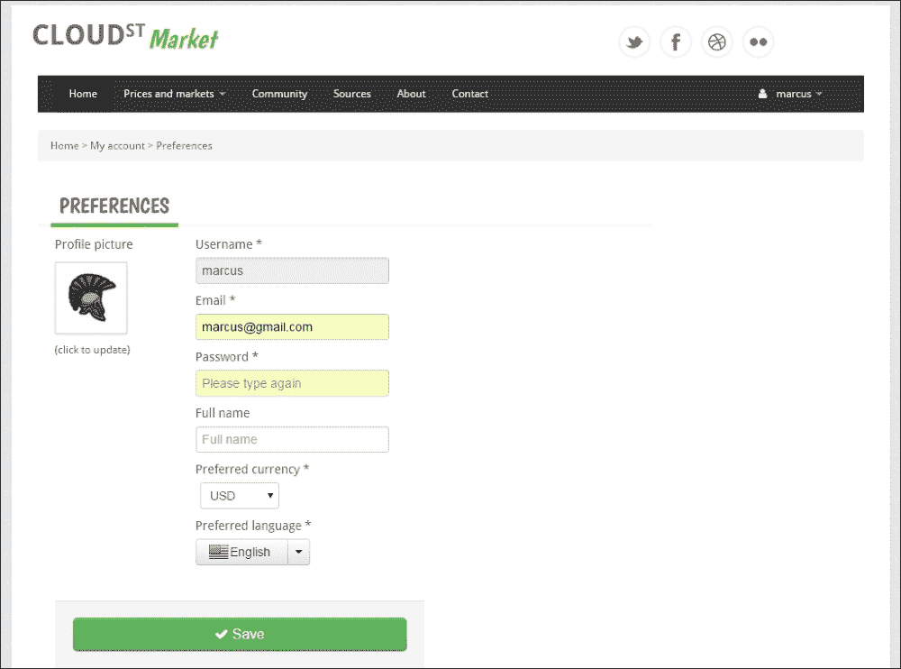
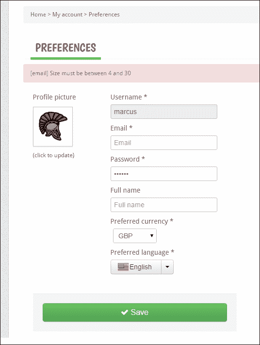
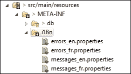
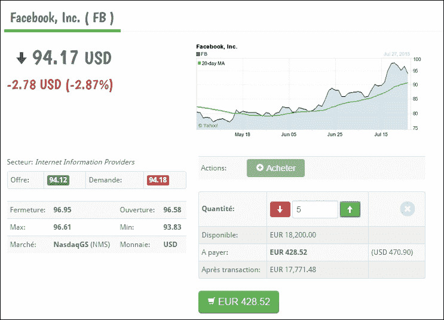
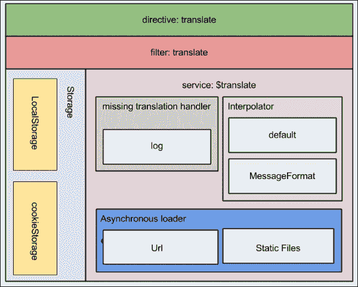
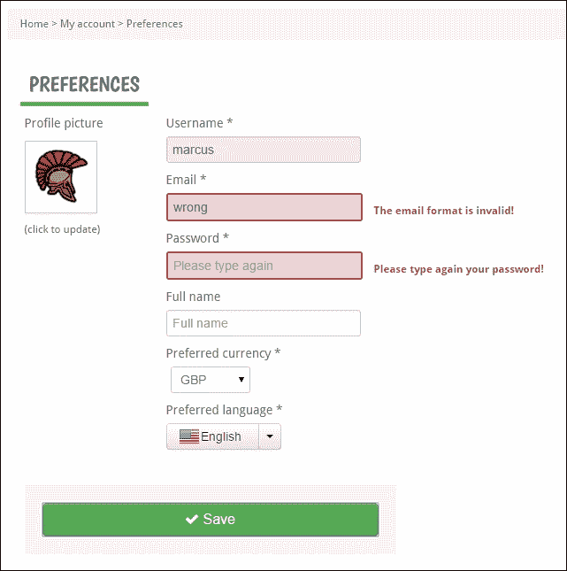

# 第七章。开发 CRUD 操作和验证

到目前为止，我们已经看到了如何构建 API 的只读 HTTP 方法。Spring MVC 控制器中的这些方法要求您掌握，或者至少理解一些技术的表示。开发非只读 HTTP 方法提出了一组新的基础主题。这些主题中的每一个都对客户体验有直接影响，因此每一个都很重要。我们介绍以下四种食谱作为框架来涵盖这一主题:

*   将 REST 处理程序扩展到所有 HTTP 方法
*   使用 bean 验证支持验证资源
*   为 REST 国际化消息和内容
*   用 HTML5 和 AngularJS 验证客户端表单

# 简介

在这个阶段开发 CRUD 操作和验证是最广泛的主题之一。

我们的应用将以多种方式转变，从事务管理标准化到错误(和内容)的国际化，通过 REST 处理程序，HTTP 合规性。

根据前几章和本书的全球战略，我们将重点关注 Spring MVC 如何在可伸缩性和微服务通信方面的当今和未来最佳实践中发挥关键作用。决定跳过比特是一个艰难的选择，但是框架不断地适应新的设计和挑战。本书试图展示 Spring MVC 在一个现代的、可持续的、可扩展的应用中的一致集成。

这里介绍了四种配方。第一种方法转换两个控制器，以支持它们各自资源的 CRUD 操作。这样做需要检查数据库事务和 HTTP 规范。

本章介绍了 Spring MVC 支持的两种验证策略。由于验证错误通常会以多种语言呈现，我们已经确保我们的应用支持国际化。我们简要地看一下 AngularJS 是如何从这个角度使用的，以及它是如何用于处理前端验证的，这些验证对于将客户体验约束到特定于业务的数据管理的现实中是必不可少的。

# 将 REST 处理程序扩展到所有 HTTP 方法

这是本章的核心配方。我们将详细介绍如何为 HTTP 方法使用 Spring MVC 方法处理程序，我们还没有涉及到:非只读的方法。

## 准备就绪

我们将看到返回的状态代码和驱动使用`PUT`、`POST`和`DELETE`方法的 HTTP 标准。这将让我们配置符合 HTTP 的 Spring MVC 控制器。

我们还将回顾像`@RequestBody`这样的请求-负载映射注释是如何工作的，以及如何有效地使用它们。

最后，我们打开了一个关于春季交易的窗口，因为它本身是一个广泛而重要的话题。

## 怎么做……

接下来的步骤将显示应用于两个控制器、一个服务和一个存储库的更改:

1.  从 Eclipse 中的 **Git 透视图**中，检查分支`v7.x.x`的最新版本。然后，在`cloudstreetmarket-parent`模块上运行一个`maven clean install`(右键单击该模块并转到**运行身份…** | **Maven 清理**，然后再次转到**运行身份…** | **Maven 安装**)，然后运行一个`Maven Update`项目，以将 Eclipse 与 Maven 配置同步(右键单击该模块，然后转到 **Maven** | **更新项目…** )。
2.  在`zipcloud-parent`上运行`Maven clean`和`Maven install`命令，然后在`cloudstreetmarket-parent`上运行。然后，去 **Maven** | **更新项目**。
3.  In this chapter, we are focused on two REST controllers: the `UsersController` and a newly created `TransactionController`.

    ### 注意

    `TransactionController`允许用户处理金融交易(从而购买或销售产品)。

4.  这里给出`UserController`的简化版:

    ```java
    @RestController
    @RequestMapping(value=USERS_PATH, produces={"application/xml", "application/json"})
    public class UsersController extends CloudstreetApiWCI{
      @RequestMapping(method=POST)
      @ResponseStatus(HttpStatus.CREATED)
      public void create(@RequestBody User user, 
      @RequestHeader(value="Spi", required=false) String 	guid, @RequestHeader(value="OAuthProvider", required=false) String provider,
      HttpServletResponse response) throws IllegalAccessException{
      ...
      response.setHeader(LOCATION_HEADER, USERS_PATH + user.getId());
      }
      @RequestMapping(method=PUT)
      @ResponseStatus(HttpStatus.OK)
      public void update(@RequestBody User user, 
        BindingResult result){
        ...
      }
      @RequestMapping(method=GET)
      @ResponseStatus(HttpStatus.OK)
      public Page<UserDTO> getAll(@PageableDefault(size=10, page=0) Pageable pageable){
      return communityService.getAll(pageable);
      }
      @RequestMapping(value="/{username}", method=GET)
      @ResponseStatus(HttpStatus.OK)
      public UserDTO get(@PathVariable String username){
        return communityService.getUser(username);
      }
      @RequestMapping(value="/{username}", method=DELETE)
      @ResponseStatus(HttpStatus.NO_CONTENT)
      public void delete(@PathVariable String username){
        communityService.delete(username);
      }
    }
    ```

5.  The **TransactionController** is represented here in a simplified version:

    ```java
    @RestController
    @ExposesResourceFor(Transaction.class)
    @RequestMapping(value=ACTIONS_PATH + TRANSACTIONS_PATH, produces={"application/xml", "application/json"})
    public class TransactionController extends CloudstreetApiWCI<Transaction> {
    ```

    (这里给出的`GET`方法处理程序来自以前的配方。)

    ```java
      @RequestMapping(method=GET)
      @ResponseStatus(HttpStatus.OK)
      public PagedResources<TransactionResource> search(
        @RequestParam(value="user", required=false) String userName,
        @RequestParam(value="quote:[\\d]+", required=false) Long quoteId,
        @RequestParam(value="ticker:[a-zA-Z0-9-:]+", required=false) String ticker,
        @PageableDefault(size=10, page=0, sort={"lastUpdate"}, direction=Direction.DESC) Pageable pageable){
        Page<Transaction> page = transactionService.findBy(pageable, userName, quoteId, ticker);
          return pagedAssembler.toResource(page, assembler);
      }
      @RequestMapping(value="/{id}", method=GET)
      @ResponseStatus(HttpStatus.OK)
    public TransactionResource get(@PathVariable(value="id") Long transactionId){
      return assembler.toResource(
        transactionService.get(transactionId));
      }
    ```

    (这里介绍的`PUT`和`DELETE`方法处理程序是非只读方法。)

    ```java
      @RequestMapping(method=POST)
      @ResponseStatus(HttpStatus.CREATED)
    public TransactionResource post(@RequestBody Transaction transaction) {
        transactionService.hydrate(transaction);
        ...
      TransactionResource resource = assembler.toResource(transaction);
      response.setHeader(LOCATION_HEADER, resource.getLink("self").getHref());
        return resource;
      }
      @PreAuthorize("hasRole('ADMIN')")
      @RequestMapping(value="/{id}", method=DELETE)
      @ResponseStatus(HttpStatus.NO_CONTENT)
    public void delete(@PathVariable(value="id") Long transactionId){
        transactionService.delete(transactionId);
      }
    }
    ```

6.  The call to the `hydrate` method in the `post` method prepares the Entity for underlying service uses. It populates its relationships from IDs received in the request payload.

    ### 注意

    这项技术将应用于所有用于 CRUD 的 REST 资源。

7.  Here are the details of the `hydrate` method in `transactionServiceImpl`:

    ```java
    @Override
    public Transaction hydrate(final Transaction transaction) {

      if(transaction.getQuote().getId() != null){
        transaction.setQuote(
          stockQuoteRepository.findOne(
            transaction.getQuote().getId()));
      }
      if(transaction.getUser().getId() != null){
       transaction.setUser(userRepository.findOne(transaction.getUser().getId()));
      }
      if(transaction.getDate() == null){
        transaction.setDate(new Date());
      }
      return transaction;
    }
    ```

    ### 注意

    这里没什么了不起的；这主要是关于建立我们的实体来满足我们的需求。可以创建一个接口来标准化实践。

8.  所有服务层都经过了审查，以推动统一的数据库事务。
9.  默认情况下，服务实现现在用`@Transactional(readOnly = true)`标注。查看以下`TransactionServiceImpl`示例:

    ```java
    @Service
    @Transactional(readOnly = true)
    public class TransactionServiceImpl implements TransactionService{
      ...
    }
    ```

10.  这些服务实现的非只读方法用`@Transactional`注释覆盖了类定义:

    ```java
      @Override
      @Transactional
      public Transaction create(Transaction transaction) {
      if(!transactionRepository.findByUserAndQuote(transaction.getUser(), transaction.getQuote()).isEmpty()){
          throw new DataIntegrityViolationException("A transaction for the quote and the user already exists!");
        }
        return transactionRepository.save(transaction);
      }
    ```

11.  这个原则也被应用到定制的存储库实现中(比如`IndexRepositoryImpl` ):

    ```java
    @Repository
    @Transactional(readOnly = true)
    public class IndexRepositoryImpl implements IndexRepository{
      @PersistenceContext 
      private EntityManager em;

      @Autowired
      private IndexRepositoryJpa repo;
      ...
      @Override
      @Transactional
      public Index save(Index index) {
        return repo.save(index);
      }
      ...
    }
    ```

## 它是如何工作的...

首先，让我们快速回顾一下这个配方的控制器中出现的不同 CRUD 服务。下表对它们进行了总结:

<colgroup><col style="text-align: left"> <col style="text-align: left"> <col style="text-align: left"> <col style="text-align: left"></colgroup> 
| 

上呼吸道感染

 | 

方法

 | 

目的

 | 

正常响应代码

 |
| --- | --- | --- | --- |
| `/actions/transactions` | 得到 | 搜索交易记录 | 200 好吧 |
| `/actions/transactions/{id}` | 得到 | 获得交易 | 200 好吧 |
| `/actions/transactions` | 邮政 | 创建交易 | 201 已创建 |
| `/actions/transactions/{id}` | 删除 | 删除交易记录 | 204 无内容 |
| `/users/login` | 邮政 | 用户登录 | 200 好吧 |
| `/users` | 得到 | 获取全部 | 200 好吧 |
| `/users/{username}` | 得到 | 获取用户 | 200 好吧 |
| `/users` | 邮政 | 创建用户 | 201 已创建 |
| `/users/{username}` | 放 | 更新用户 | 200 好吧 |
| `/users/{username}` | 删除 | 删除用户 | 204 无内容 |

### HTTP/1.1 规范 RFC 7231 语义和内容

为了理解这个配方中做出的几个决定(并使它们合法化)，我们必须阐明 HTTP 规范的几个要点。

开始之前，请随意访问互联网标准跟踪文档(RFC 7231 ),了解与语义和内容相关的 HTTP 1/1(T1 ):

[https://tools.ietf.org/html/rfc7231](https://tools.ietf.org/html/rfc7231)

#### 基本要求

在 HTTP 规范文档中，请求方法概述(第 4.1 节)陈述了服务器支持`GET`和`HEAD`方法的要求。所有其他请求方法都是可选的。

同一部分还指定了一个使用可识别的方法名(`GET`、`POST`、`PUT`、`DELETE`等等)但不匹配任何方法处理程序的请求应该用一个`405 Not supported`状态码来响应。类似地，用不可识别的方法名(非标准)发出的请求应该用一个状态代码`501 Not implemented`来响应。这两条语句是 Spring MVC 本机支持和自动配置的。

#### 安全和幂等方法

文档介绍了可用于描述请求方法的安全和幂等限定符。安全方法基本上是只读方法。使用这种方法的客户端不明确请求状态改变，并且不能期望作为请求结果的状态改变。

正如安全词所暗示的，可以相信这些方法不会对系统造成任何损害。

一个重要的因素是我们正在考虑客户的观点。安全方法的概念并不禁止系统执行“潜在的”有害操作或不是有效只读的进程。无论发生什么，客户都不能对此负责。在所有的 HTTP 方法中，只有`GET`、`HEAD`、`OPTIONS`和`TRACE`方法被定义为安全的。

该规范利用幂等限定词来识别 HTTP 请求，当相同地重复时，总是产生与第一个请求相同的结果。这里必须考虑客户的观点。

幂等的 HTTP 方法有`GET`、`HEAD`、`OPTIONS`、`TRACE`(安全方法)以及`PUT`和`DELETE`。

例如，方法的幂等性向客户端保证，即使在接收到任何响应之前出现了连接问题，也可以重复发送 **PUT** 请求。

### 注意

客户端知道，即使最初的请求成功了，重复请求也会产生相同的预期效果，尽管响应可能会有所不同。

#### 其他特定于方法的约束

`POST`方法通常与服务器上的资源创建相关联。因此，这个方法应该返回带有位置头的`201 (Created)`状态代码，该位置头为创建的资源提供了一个标识符。

然而，如果没有创建资源，`POST`方法可能(实际上)返回除了`206 (Partial Content)`、`304 (Not Modified)`和`416 (Range Not Satisfiable)`之外的所有类型的状态代码。

`POST`的结果有时可以是现有资源的表示。例如，在这种情况下，客户端可以通过一个`303`状态代码和一个`Location`头字段被重定向到那个资源。作为`POST`方法的替代，通常选择`PUT`方法来更新或改变现有资源的状态，向客户端发送`200 (OK)`或`204 (No Content)`。

具有不一致匹配的边缘情况通过`409 (Conflict)`或`415 (Unsupported Media Type)`产生错误。

没有为更新找到匹配的边缘情况应该导致创建具有`201 (Created)`状态代码的资源。

另一组约束适用于成功接收的`DELETE`请求。如果删除已经被处理，那么它们应该返回一个`204 (No Content)`状态码或者一个`200 (OK)`。如果不是，状态码应该是`202 (Accepted)`。

### 用@RequestBody 映射请求负载

在[第 4 章](4.html "Chapter 4\. Building a REST API for a Stateless Architecture")、*为无状态架构构建 REST API*中，我们已经展示了`RequestMappingHandlerAdapter`。我们已经看到，Spring MVC 委托这个 bean 给提供了对`@RequestMapping`注释的扩展支持。

在这个视角中，`RequestMappingHandlerAdapter`是通过`getMessageConverters()`和`setMessageConverters(List<HttpMessageConverter<?>> messageConverters)`访问和覆盖`HttpMessageConverters`的核心部分。

`@RequestBody`注释的作用与`HttpMessageConverters`紧密耦合。我们现在就来介绍一下`HttpMessageConverters`。

### HttpMessageConverters

`HttpMessageConverters`、自定义或本地绑定到特定的 mime 类型。它们用于以下情况:

*   将 Java 对象转换成 HTTP 响应负载。从`Accept`请求头 mime 类型中选择，它们服务于`@ResponseBody`注释的目的(并间接地服务于抽象`@ResponseBody`注释的`@RestController`注释)。
*   将 HTTP 请求有效负载转换成 Java 对象。从`Content-Type`请求头 mime 类型中选择，当`@RequestBody`注释出现在方法处理程序参数上时，这些转换器被调用。

多一般，`HttpMessageConverters`匹配以下`HttpMessageConverter`界面:

```java
public interface HttpMessageConverter<T> {
  boolean canRead(Class<?> clazz, MediaType mediaType);
  boolean canWrite(Class<?> clazz, MediaType mediaType);
  List<MediaType> getSupportedMediaTypes();
  T read(Class<? extends T> clazz, HttpInputMessage inputMessage) throws IOException, HttpMessageNotReadableException;
  void write(T t, MediaType contentType, HttpOutputMessage outputMessage) throws IOException, HttpMessageNotWritableException;
}
```

`getSupportedMediaTypes()`方法返回特定转换器支持的`mediaTypes` (mime 类型)列表。该方法主要用于报告目的以及`canRead`和`canWrite`实现。这些`canRead`和`canWrite`资格方法被框架用来在运行时选择第一个`HttpMessageConverter`:

*   匹配客户端提供的给定 Java 类的请求头`@RequestBody`
*   匹配客户端提供的 Java 类的`Accept`请求头，HTTP 响应有效负载将对应于`(``@ResponseBody`的目标类型

#### 提供了 HttpMessageConverters

在 Spring MVC (4+)的最新版本中，框架自带了一些额外的`HttpMessageConverters`。我们认为总结一下会有所帮助。下表显示了所有的本机`HttpMessageConverters`、mime 类型以及它们可以关联的 Java 类型。主要来自 JavaDoc 的简短描述给出了关于它们的更多见解。

<colgroup><col style="text-align: left"> <col style="text-align: left"> <col style="text-align: left"></colgroup> 
| 

上呼吸道感染

 | 

支持的媒体类型(默认情况下)

 | 

转换为/从

 |
| --- | --- | --- |
| `FormHttpMessage Converter` | 可以读/写 application/x-www-form-urlencoded，可以读取多部分/格式数据。 | `MultiValueMap<String, ?>` |
| 对于零件转换，它还嵌入(默认)`ByteArrayHttpMessageConverter`、`StringHttpMessageConverter`和`ResourceHttpMessageConverter`。 |
| `AllEncompassing FormHttpMessage Converter` | 可以读/写 application/x-www-form-urlencoded，可以读取多部分/格式数据。 | `MultiValueMap<String, ?>` |
| 如果在基于 XML/JSON 的部分的类路径中找到了额外的`HttpMessageConverters` JAXB 或 Jackson，这个转换器扩展了`FormHttpMessageConverter`嵌入。 |
| `XmlAwareFormHttp MessageConverter` | 能读/写 application/x-www-form-urlencoded，可以读取多部分/格式数据。 | `MultiValueMap<String, ?>` |
| 这个转换器扩展了`FormHttpMessageConverter`，通过一个`SourceHttpMessageConverter`增加了对基于 XML 的部件的支持。 |
| `BufferedImageHttp MessageConverter` | 可以读取注册图像阅读器支持的所有介质类型。可以写入第一个可用的已注册图像写入程序的媒体类型。 | `java.awt.image.BufferedImage` |
| `ByteArrayHttp MessageConverter` | 可以读*/*，用应用/八位字节流写入。 | `byte[]` |
| `GsonHttpMessage Converter` | 可以读/写 application/json，application/*+json。 | `java.lang.Object` |
| 使用 Google Gson 库的`Gson`类。这个转换器可以用来绑定类型化的 beans 或者非类型化的 HashMaps。 |
| `Jaxb2Collection HttpMessage Converter` | 可以读取 XML 集合。 | `T extends java.util.Collection` |
| 这个转换器可以读取包含用`XmlRootElement`和`XmlType`标注的类的集合。请注意，此转换器不支持写入。(JAXB2 必须存在于类路径中。) |
| `Jaxb2RootElement HttpMessage Converter` | 可以读/写 XML | `java.lang.Object` |
| 这个转换器可以读取用`XmlRootElement`和`XmlType`标注的类，并编写用`XmlRootElement`标注的类或其子类。(JAXB2 必须存在于类路径中。) |
| `MappingJackson2 HttpMessage Converter` | 可以读/写 application/json，application/*+json。 | `java.lang.Object` |
| 使用 Jackson 2.x 对象映射器。该转换器可用于绑定类型化 beans 或非类型化 HashMap 实例。(Jackson 2 必须出现在类路径中。) |
| `MappingJackson2 XmlHttpMessage Converter` | 可以读/写 application/xml，text/xml，application/*+xml。 | `java.lang.Object` |
| 这使用了 Jackson 2 . x 扩展组件来读写 XML 编码的数据([https://github.com/FasterXML/jackson-dataformat-xml](https://github.com/FasterXML/jackson-dataformat-xml))。(Jackson 2 必须存在于类路径中。) |
| `MarshallingHttp MessageConverter` | 可以读/写文本/xml 应用/xml。 | `java.lang.Object` |
| 这使用了 Spring 的编组器和解组器抽象(OXM)。 |
| `ObjectToStringHttp MessageConverter` | 可以读/写文本/普通文本。 | `java.lang.Object` |
| 它使用`StringHttpMessageConverter`来读取和写入内容，使用`ConversionService`将字符串内容与目标对象类型相互转换。(必须配置)。 |
| `ProtobufHttp MessageConverter` | 可以读取 application/json，application/xml，text/plain 和 application/x-protobuf。能写 application/json，application/xml，text/plain 和 application/x-protobuf，text/html。 | `javax.mail.Message` |
| 这使用谷歌协议缓冲区([https://developers.google.com/protocol-buffers](https://developers.google.com/protocol-buffers))来生成你需要安装`protoc`二进制的消息 Java 类。 |
| `ResourceHttp MessageConverter` | 可以读/写*/*。 | `org.springframework.core.io.Resource` |
| Java 激活框架 ( **JAF** )如果可用的话，用于确定书面资源的内容类型。如果 JAF 不可用，则使用应用/八位字节流。 |
| `RssChannelHttp MessageConverter` | 可以读/写 application/rss+xml。 | `com.rometools.rome.feed.rss.Channel` |
| 这个转换器可以处理来自罗马项目的通道对象([https://github.com/rometools](https://github.com/rometools))。(ROME 必须存在于类路径中。) |
| `AtomFeedHttp MessageConverter` | 可以读/写应用/atom+xml。 | `com.rometools.rome.feed.atom.Feed` |
| 这个可以处理来自罗马项目([https://github.com/rometools](https://github.com/rometools))的 Atom 提要。(ROME 必须存在于类路径中。) |
| SourceHttpMessageConverter | 可以读/写 text/xml，application/xml，application/*-xml。 | `javax.xml.transform.Source` |
| `StringHttpMessageConverter` | 可以读/写*/*。 | `java.lang.String` |

#### 使用 mapping Jackson 2 http message converter

在这个食谱中，`MappingJackson2HttpMessageConverter`被广泛使用。我们将这个转换器用于金融交易创建/更新端和用户偏好更新端。

或者，我们使用 AngularJS 将一个 HTML 表单映射到一个构建的 json 对象，该对象的属性与我们的实体相匹配。通过这种方式，我们将`json`对象的`POST` / `PUT`作为`application/json` mime 类型。

这种方法比发布一个`application/x-www-form-urlencoded`表单内容更可取，因为我们实际上可以将对象映射到一个实体。在我们的例子中，表单与后端资源完全匹配。这是 REST 设计的一个有益结果(和约束)。

### 使用@RequestPart 上传图片

`@RequestPart`注释可以用来将`multipart/form-data`请求的一部分与方法参数相关联。它可以与`org.springframework.web.multipart.MultipartFile`和`javax.servlet.http.Part`等参数类型一起使用。

对于任何其他参数类型，该部分的内容通过一个`HttpMessageConverter`传递，就像`@RequestBody`一样。

已经实现了`@RequestBody`注释来处理用户简档图片。这是我们在`UserImageController`中的示例实现:

```java
    @RequestMapping(method=POST, produces={"application/json"})
    @ResponseStatus(HttpStatus.CREATED)
    public String save( @RequestPart("file") MultipartFile file, HttpServletResponse response){
    String extension = ImageUtil.getExtension(file.getOriginalFilename());
    String name = UUID.randomUUID().toString().concat(".").concat(extension);
    if (!file.isEmpty()) {
       try {
                byte[] bytes = file.getBytes();
                Path newPath = Paths.get(pathToUserPictures);
                Files.write(newPath, bytes, 	StandardOpenOption.CREATE);
       ...
  ...
  response.addHeader(LOCATION_HEADER, env.getProperty("pictures.user.endpoint").concat(name));
  return "Success";
  ...
  }
```

请求的文件部分被作为参数注入。根据请求文件的内容在服务器文件系统上创建一个新文件。一个新的`Location`头被添加到响应中，并带有一个到已创建图像的链接。

在客户端，这个头被读取并作为 div 的`background-image` CSS 属性注入(参见`user-account.html`)。

### 交易管理

菜谱强调了我们应用于处理 REST 架构不同层的事务的基本原则。事务管理本身就是一整章，我们在这里只限于给出一个概述。

#### 简单化的方法

为了构建我们的事务管理，我们牢记 Spring MVC 控制器不是事务性的。在这种情况下，我们不能期望在一个控制器的同一个方法处理程序中对两个不同的服务调用进行事务管理。每个服务调用都会启动一个新的事务，当结果返回时，这个事务就会终止。

我们在类型级别将我们的服务定义为`@Transactional(readonly="true")`，然后需要写访问的方法在方法级别用额外的`@Transactional`注释覆盖这个定义。我们配方的*第十步*呈现了`TransactionServiceImpl`服务**上的事务变更。**使用默认传播，事务在事务服务、存储库或方法之间被维护和重用。

默认情况下，抽象的 Spring 数据 JPA 存储库是事务性的。我们只需要为我们的定制存储库指定事务行为，就像我们为我们的服务所做的那样。

我们配方的第十一步*显示了定制存储库`IndexRepositoryImpl`上的事务性变更。*

## 还有更多……

如前所述，我们在应用的不同层上配置了一致的事务管理。

### 交易管理

我们的覆盖范围有限，如果您不熟悉以下主题，我们建议您查找相关的外部信息。

#### 酸性

四个属性/概念经常用于评估交易的可靠性。因此，在设计交易时，将它们牢记在心是有用且重要的。这些属性是原子性、一致性、孤立性和持久性。在维基百科页面上阅读有关 ACID 交易的更多信息:

[https://en.wikipedia.org/wiki/ACID](https://en.wikipedia.org/wiki/ACID)

#### 全球与本地交易

我们只在应用中定义了本地事务。本地事务是在应用级别管理的，不能跨多个 Tomcat 服务器传播。此外，当涉及多个事务性资源类型时，本地事务不能确保一致性。例如，在一个与消息传递相关的数据库操作的用例中，当我们回滚一个无法传递的消息时，我们可能还需要回滚之前已经发生的相关数据库操作。只有实现两步提交的全局事务才能承担这种责任。全局事务由 JTA 事务管理器实现来处理。

阅读 Spring 参考文档中有关差异的更多信息:

[http://docs . spring . io/spring/docs/2 . 0 . 8/reference/transaction . html](http://docs.spring.io/spring/docs/2.0.8/reference/transaction.html)

历史上，JTA 交易管理器完全由 J2EE/JEE 集装箱公司提供。随着应用级 JTA 事务管理器的实现，我们现在有了其他替代方案，如如 atomi KOS(【http://www.atomikos.com】)、Bitronix(【https://github.com/bitronix/btm】)或[【http://jotm.ow2.org/xwiki/bin/view/Main/WebHome】](http://jotm.ow2.org/xwiki/bin/view/Main/WebHome))来确保 J2SE 环境中的全局事务。

Tomcat (7+)也可以与应用级 JTA 事务管理器实现一起工作，以反映使用`TransactionSynchronizationRegistry`和 JNDI 数据源的容器中的事务管理。

[https://codepitbull . WordPress . com/2011/07/08/Tomcat-7-with-full-JTA](https://codepitbull.wordpress.com/2011/07/08/tomcat-7-with-full-jta)

## 参见

性能和有用的元数据优势可以从这三个标题中获得，这在配方的中没有详细说明。

*   **Cache-Control、ETag 和 Last-Modified** : Spring MVC 支持这些头文件，作为一个切入点，我们建议你查看一下 Spring reference:[http://docs . Spring . io/Spring-framework/docs/current/Spring-framework-reference/html/MVC . html # MVC-caching-ETag-Last Modified](http://docs.spring.io/spring-framework/docs/current/spring-framework-reference/html/mvc.html#mvc-caching-etag-lastmodified)

# 使用 bean 验证支持验证资源

在介绍了请求-有效负载数据绑定过程之后，我们必须谈谈验证。

## 准备就绪

这个菜谱的目标是展示如何让 Spring MVC 拒绝不满足 bean 验证(JSR-303)或者不满足已定义的 Spring 验证器实现的约束的请求体有效负载。

在 Maven 和 Spring 配置之后，我们将看到如何将验证器绑定到传入的请求，如何定义验证器来执行定制规则，如何设置 JSR-303 验证，以及如何处理验证结果。

## 怎么做……

1.  我们给 hibernate 验证器添加了一个 Maven 依赖项:

    ```java
    <dependency>
      <groupId>org.hibernate</groupId>
      <artifactId>hibernate-validator</artifactId>
      <version>4.3.1.Final</version>
    </dependency>
    ```

2.  一个`LocalValidatorFactoryBean`已经在我们`dispatcher-servlet.xml` ( `cloudstreetmarket-api` ):

    ```java
    <bean id="validator" class="org.sfw.validation.beanvalidation.LocalValidatorFactoryBean"/>
    ```

    注册
3.  The `UsersController` and `TransactionController` have seen their `POST` and `PUT` method signature altered with the addition of a `@Valid` annotation on the `@RequestBody` arguments:

    ```java
      @RequestMapping(method=PUT)
      @ResponseStatus(HttpStatus.OK)
      public void update(@Valid @RequestBody User user, 
      BindingResult result){
        ValidatorUtil.raiseFirstError(result);
        user = communityService.updateUser(user);
      }
    ```

    ### 注意

    注意这里的`BindingResult`对象是作为方法参数注入的。另外，我们将在一分钟后介绍`ValidatorUtil`课程。

4.  我们的两个 CRUD 控制器现在有了一个新的`@InitBinder`注释方法:

    ```java
      @InitBinder
        protected void initBinder(WebDataBinder binder) {
            binder.setValidator(new UserValidator());
        }
    ```

5.  该方法将创建的验证器实现的实例绑定到请求。检查创建的`UserValidator`，它是`Validator`的实现:

    ```java
    package edu.zipcloud.cloudstreetmarket.core.validators;
    import java.util.Map;
    import javax.validation.groups.Default;
    import org.springframework.validation.Errors;
    import org.springframework.validation.Validator;
    import edu.zc.csm.core.entities.User;
    import edu.zc.csm.core.util.ValidatorUtil;
    public class UserValidator implements Validator {
      @Override
      public boolean supports(Class<?> clazz) {
        return User.class.isAssignableFrom(clazz);
      }
      @Override
      public void validate(Object target, Errors err) {
        Map<String, String> fieldValidation = ValidatorUtil.validate((User)target, Default.class);
        fieldValidation.forEach(
          (k, v) -> err.rejectValue(k, v)
        );
      }
    }
    ```

6.  在`User`实体中，增加了一对的特殊注释:

    ```java
    @Entity
    @Table(name="users")
    public class User extends ProvidedId<String> implements UserDetails{
      ...
      private String fullName;
      @NotNull
      @Size(min=4, max=30)
      private String email;
      @NotNull
      private String password;
      private boolean enabled = true;
      @NotNull
      @Enumerated(EnumType.STRING)
      private SupportedLanguage language;
      private String profileImg;

      @Column(name="not_expired")
      private boolean accountNonExpired;
      @Column(name="not_locked")
      private boolean accountNonLocked;

      @NotNull
      @Enumerated(EnumType.STRING)
      private SupportedCurrency currency;

      private BigDecimal balance;
      ...
    }
    ```

7.  We have created the `ValidatorUtil` class to make those validations easier and to reduce the amount of boilerplate code:

    ```java
    package edu.zipcloud.cloudstreetmarket.core.util;
    import java.util.Arrays;
    import java.util.HashMap;
    import java.util.Map;
    import java.util.Set;
    import javax.validation.ConstraintViolation;
    import javax.validation.Validation;
    import javax.validation.Validator;
    import javax.validation.ValidatorFactory;
    import javax.validation.groups.Default;
    import org.springframework.validation.BindingResult;

    public class ValidatorUtil {
        private static Validator validator;
        static {
          ValidatorFactory factory = Validation.buildDefaultValidatorFactory();
          validator = factory.getValidator();
        }
    ```

    以下`validate`方法允许我们从任何可能需要 JSR 验证的位置调用它:

    ```java
    public static <T> Map<String, String> validate(T object, Class<?>... groups) {
      Class<?>[] args = Arrays.copyOf(groups, groups.length + 1);
      args[groups.length] = Default.class;
      return extractViolations(validator.validate(object, args));
    }
    private static <T> Map<String, String> extractViolations(Set<ConstraintViolation<T>> violations) {
      Map<String, String> errors = new HashMap<>();
      for (ConstraintViolation<T> v: violations) {
        errors.put(v.getPropertyPath().toString(), "["+v.getPropertyPath().toString()+"] " + StringUtils.capitalize(v.getMessage()));
      }
      return errors;
      }
    ```

    下面的`raiseFirstError`方法不是一个特定的标准，它是我们向客户端呈现服务器端错误的方式:

    ```java
      public static void raiseFirstError(BindingResult result) {
        if (result.hasErrors()) {
          throw new IllegalArgumentException(result.getAllErrors().get(0).getCode());
        }
    else if (result.hasGlobalErrors()) {
    throw new IllegalArgumentException(result.getGlobalError().getDefaultMessage());
           }
    }
    }
    ```

8.  根据[第四章](4.html "Chapter 4\. Building a REST API for a Stateless Architecture")、*为无状态架构构建 REST API*，cloudstreetmarket-api 的`RestExceptionHandler`仍然被配置为处理`IllegalArgumentExceptions`，用`ErrorInfo`格式的响应来呈现它们:

    ```java
    @ControllerAdvice
    public class RestExceptionHandler extends ResponseEntityExceptionHandler {
      @Autowired
      private ResourceBundleService bundle;
       @Override
      protected ResponseEntity<Object> handleExceptionInternal(Exception ex, Object body,
        HttpHeaders headers, HttpStatus status, WebRequest request) {
        ErrorInfo errorInfo = null;
        if(body!=null && bundle.containsKey(body.toString())){
            String key = body.toString();
            String localizedMessage = bundle.get(key);
            errorInfo = new ErrorInfo(ex, localizedMessage, key, status);
        }
        else{
          errorInfo = new ErrorInfo(ex, (body!=null)? body.toString() : null, null, status);
        }
    return new ResponseEntity<Object>(errorInfo, headers, status);
    }
      @ExceptionHandler({ InvalidDataAccessApiUsageException.class, DataAccessException.class, IllegalArgumentException.class })
      protected ResponseEntity<Object> handleConflict(final RuntimeException ex, final WebRequest request) {
          return handleExceptionInternal(ex, I18N_API_GENERIC_REQUEST_PARAMS_NOT_VALID, new HttpHeaders(), BAD_REQUEST, request);
        }
    }
    ```

9.  Navigating through the UI improvements, you will notice a new form for updating the user's **Preferences**. This form is accessible via the **Login** menu, as shown in the following screenshots:

    

    

10.  在这个用户**偏好**表单中，当前端验证被停用时(前端验证将在本章的最后一个配方中开发)，不填写电子邮件字段将导致 HTTP 响应中的以下(可定制)`ErrorInfo`对象:

    ```java
    {"error":"[email] Size must be between 4 and 30",
    "message":"The request parameters were not valid!",
    "i18nKey":"error.api.generic.provided.request.parameters.not.valid",
    "status":400,
    "date":"2016-01-05 05:59:26.584"}
    ```

11.  在前端，为了处理这个错误，`accountController`(在`account_management.js`中)依赖于一个定制的`errorHandler`工厂被实例化。代码如下:

    ```java
    cloudStreetMarketApp.controller('accountController', function ($scope, $translate, $location, errorHandler, accountManagementFactory, httpAuth, genericAPIFactory){
          $scope.form = {
          id: "",
        email: "",
        fullName: "",
        password: "",
        language: "EN",
        currency: "",
        profileImg: "img/anon.png"
          };
      ...
    }
    ```

12.  `accountController`有一个`update`方法，它调用`errorHandler.renderOnForm`方法:

    ```java
      $scope.update = function () {
        $scope.formSubmitted = true;

        if(!$scope.updateAccount.$valid) {
            return;
        }
          httpAuth.put('/api/users', JSON.stringify($scope.form)).success(
          function(data, status, headers, config) {
            httpAuth.setCredentials($scope.form.id, $scope.form.password);
          $scope.updateSuccess = true;
          }
        ).error(function(data, status, headers, config) {
            $scope.updateFail = true;
            $scope.updateSuccess = false;
            $scope.serverErrorMessage = errorHandler.renderOnForms(data);
          }
        );
      };
    ```

13.  The `errorHandler` is defined as follows in `main_menu.js`. It has the capability to pull translations messages from `i18n` codes:

    ```java
    cloudStreetMarketApp.factory("errorHandler", ['$translate', function ($translate) {
        return {
            render: function (data) {
            if(data.message && data.message.length > 0){
              return data.message;
            }
            else if(!data.message && data.i18nKey && data.i18nKey.length > 0){
              return $translate(data.i18nKey);
              }
            return $translate("error.api.generic.internal");
            },
            renderOnForms: function (data) {
            if(data.error && data.error.length > 0){
              return data.error;
            }
            else if(data.message && data.message.length > 0){
              return data.message;
            }
            else if(!data.message && data.i18nKey && data.i18nKey.length > 0){
              return $translate(data.i18nKey);
            }
            return $translate("error.api.generic.internal");
            }
        }
    }]);
    ```

    **偏好**表单如下所示:

    

    ### Tip

    正如我们所说的，为了模拟这个错误，需要停用前端验证。这可以通过向`user-account.html`中的`<form name="updateAccount" … novalidate>`标记添加一个`novalidate`属性来实现。

14.  回到服务器端，我们还为金融交易实体创建了一个定制的验证器。这个验证器使用了弹簧`ValidationUtils` :

    ```java
    @Component
    public class TransactionValidator implements Validator {
      @Override
      public boolean supports(Class<?> clazz) {
        return Transaction.class.isAssignableFrom(clazz);
      }
      @Override
      public void validate(Object target, Errors errors) {
        ValidationUtils.rejectIfEmpty(errors, "quote", " transaction.quote.empty");
        ValidationUtils.rejectIfEmpty(errors, "user", " transaction.user.empty");
        ValidationUtils.rejectIfEmpty(errors, "type", " transaction.type.empty");
      }
    }
    ```

## 它是如何工作的...

### 使用 Spring 验证器

Spring 提供了一个`Validator`接口(`org.sfw.validation.Validator`)来创建组件，这些组件将被注入或实例化到我们想要的层中。因此，Spring 验证组件可以用在 Spring MVC 控制器中。`Validator`界面如下:

```java
public interface Validator {
  boolean supports(Class<?> clazz);
  void validate(Object target, Errors errors);
}
```

`supports(Class<?> clazz)`方法用于评估`Validator`实现的域，并将其使用限制在特定类型或超类型。

`validate(Object target, Errors errors)`方法强加了它的标准，这样验证器的验证逻辑就存在于这个地方。传递的`target`对象被评估，验证的结果存储在`org.springframework.validation.Errors`接口的一个实例中。这里显示了`Errors`界面的部分预览:

```java
public interface Errors {
  ...
  void reject(String errorCode);
  void reject(String errorCode, String defaultMessage);
void reject(String errorCode, Object[] errorArgs, String defaultMessage);
void rejectValue(String field, String errorCode); void rejectValue(String field, String errorCode, String defaultMessage);
void rejectValue(String field, String errorCode, Object[] errorArgs, String defaultMessage);
  void addAllErrors(Errors errors);
  boolean hasErrors();
  int getErrorCount();
  List<ObjectError> getAllErrors();
  ...
}
```

使用 Spring MVC，我们有可能绑定并触发一个`Validator`到一个特定的方法处理程序。框架寻找绑定到传入请求的验证器实例。我们已经在第四步的*中配置了这样一个绑定:*

```java
  @InitBinder
    protected void initBinder(WebDataBinder binder) {
        binder.setValidator(new UserValidator());
    }
```

### Tip

我们已经使用了`@InitBinder`注释将其他对象(格式化器)附加到传入的请求上(参见第 4 章的*绑定请求，编组响应*方法，*为无状态架构构建 REST API*)。

`Binders` ( `org.springframework.validation.DataBinder`)允许在目标对象上设置属性值。绑定器还为验证和绑定结果分析提供支持。

在每个绑定步骤之后调用`DataBinder.validate()`方法，该方法调用附属于`DataBinder`的主验证器的`validate`。

绑定过程填充一个结果对象，它是`org.springframework.validation.BindingResult` 接口的一个实例。可以使用`DataBinder.getBindingResult()`方法检索这个结果对象。

实际上，`BindingResult`实现也是`Errors`实现(如此处所示)。我们在前面已经展示了`Errors`界面。查看以下代码:

```java
public interface BindingResult extends Errors {
  Object getTarget();
  Map<String, Object> getModel();
  Object getRawFieldValue(String field);
  PropertyEditor findEditor(String field, Class<?> valueType);
  PropertyEditorRegistry getPropertyEditorRegistry();
  void addError(ObjectError error);
  String[] resolveMessageCodes(String errorCode);
  String[] resolveMessageCodes(String errorCode, String field);
  void recordSuppressedField(String field);
  String[] getSuppressedFields();
}
```

整个设计可以总结如下:

我们创建一个验证器实现。当一个传入的请求传入一个特定的控制器方法处理程序时，请求有效负载被转换成由`@RequestBody`注释(在我们的例子中是一个`Entity`)指向的类。我们的验证器实现的一个实例被绑定到注入的`@RequestBody`对象。如果注入的`@RequestBody`对象是用`@Valid`注释定义的，那么框架会要求`DataBinder`在每个绑定步骤中验证对象，并将错误存储在`DataBinder`的`BindingResultobject`中。

最后，这个`BindingResult`对象作为方法处理程序的参数被注入，因此我们可以决定如何处理它的错误(如果有的话)。在绑定过程中，缺失字段和属性访问异常被转换成`FieldErrors`。这些`FieldErrors`也存储在错误实例中。以下错误代码用于`FieldErrors`:

```java
Missing field error: "required"
Type mismatch error: "typeMismatch"
Method invocation error: "methodInvocation"
```

当需要为用户返回更好的错误消息时，`MessageSource`帮助我们处理一个查找，并使用下面的方法从`MessageSourceResolvable`实现中检索正确的本地化消息:

```java
MessageSource.getMessage(org.sfw.context.MessageSourceResolvable, java.util.Locale). 
```

### Tip

`FieldError`扩展了`ObjectError`,`ObjectError`扩展了`DefaultMessageSourceResolvable`，这是一个 `MessageSourceResolvable`实现。

#### 验证实用程序

`ValodationUtils`实用程序类(`org.sfw.validation.ValidationUtils`)提供了一对方便的静态方法，用于调用验证器和拒绝空字段。这些实用程序方法允许单行断言，同时处理`Errors`对象的填充。在这个食谱中，第 14 步详述了我们使用`ValidationUtils`的`TransactionValidator`。

#### I18n 验证错误

下一个方法将关注错误和内容的国际化。然而，让我们看看如何从控制器中捕捉错误，以及如何显示它们。`UserController`的`update`方法的第一行有这个自定义方法调用:

```java
ValidatorUtil.raiseFirstError(result);
```

我们为自己的需求创建了`ValidatorUtil`支持类；这个想法是对任何类型的错误抛出一个`IllegalArgumentException`，这个错误可以被我们的验证器检测到。在`TransactionController.update(…)`方法处理程序中也可以找到`ValidatorUtil.raiseFirstError(result)`方法调用。这个方法处理程序依赖于第 14 步*中的`TransactionValidator`。*

如果您记得这个`TransactionValidator`，当金融交易对象中不存在报价对象时，它会创建一个带有`transaction.quote.empty`消息代码的错误。然后抛出一个`IllegalArgumentException`和`transaction.quote.empty`消息细节。

在下一个菜谱中，我们将重新审视如何构建一个正确的国际化 JSON 响应，并从`IllegalArgumentException`发送回客户端。

### 使用 JSR-303/JSR-349 豆验证

Spring Framework 版本 4 及更高版本支持 bean 验证 1.0 (JSR-303)和 bean 验证 1.1 (JSR-349)。它还修改了 bean 验证，使之与`Validator`接口一起工作，并允许使用注释创建类级验证器。

JSR-303 和 JSR-349 这两个规范定义了一组适用于 beans 的约束，作为来自`javax.validation.constraints`包的注释。

一般来说，使用来自规范的代码而不是来自实现的代码的一个很大的优点是，我们不需要知道使用的是哪个实现。此外，该实现总是有可能被另一个替换。

Bean 验证最初是为持久性 bean 设计的。即使规范与 JPA 的耦合相对较低，参考实现仍然是 Hibernate validator。拥有一个支持这些验证规范的持久性提供者绝对是一个优势。现在有了 JPA2，持久化提供者在持久化之前自动调用 JSR-303 验证。确保来自两个不同层(控制器和模型)的这种验证提高了我们的信心水平。

#### 场内约束注释

我们在呈现的`User`实体上定义了`@NotNull`和`@Size` JSR-303 注释。显然，在规范中可以找到两个以上的注释。

下面的表格总结了 JEE7 中的注释包(`javax.validation.constraints`):

<colgroup><col style="text-align: left"> <col style="text-align: left"></colgroup> 
| 

注释类型

 | 

描述

 |
| --- | --- |
| `AssertFalse` | 注释元素必须为假。 |
| `AssertFalse.List` | 在同一个元素上定义几个`AssertFalse`注释。 |
| `AssertTrue` | 注释元素必须为真。 |
| `AssertTrue.List` | 在同一个元素上定义几个`AssertTrue`注释。 |
| `DecimalMax` | 注释元素必须是一个数字，其值必须小于或等于指定的最大值。 |
| `DecimalMax.List` | 在同一个元素上定义几个`DecimalMax`注释。 |
| `DecimalMin` | 注释元素必须是一个数字，其值必须大于或等于指定的最小值。 |
| `DecimalMin.List` | 在同一个元素上定义几个`DecimalMin`注释。 |
| `Digits` | 注释元素必须是可接受范围内的数字。支持的类型有:`BigDecimal`、`BigInteger`、`CharSequence`、`byte`、`short`、`int`、`long`及其各自的包装器类型。但是，空元素被认为是有效的。 |
| `Digits.List` | 在同一个元素上定义几个`Digits`注释。 |
| `Future` | 带注释的元素必须是未来的日期。 |
| `Future.List` | 在同一个元素上定义几个`Future`注释。 |
| `Max` | 注释元素必须是一个数字，其值必须小于或等于指定的最大值。 |
| `Max.List` | 在同一个元素上定义几个`Max`注释。 |
| `Min` | 注释元素必须是一个数字，其值必须大于或等于指定的最小值。 |
| `Min.List` | 在同一个元素上定义几个`Min`注释。 |
| `NotNull` | 注释元素不能是`null`。 |
| `NotNull.List` | 在同一个元素上定义几个`NotNull`注释。 |
| `Past` | 注释元素必须是过去的日期。 |
| `Past.List` | 在同一个元素上定义几个`Past`注释。 |
| `Pattern` | 带注释的必须匹配指定的正则表达式。 |
| `Pattern.List` | 在同一个元素上定义几个`Pattern`注释。 |
| `Size` | 带注释的元素大小必须在指定的边界(包括边界)之间。 |
| `Size.List` | 在同一个元素上定义几个`Size`注释。 |

##### 具体实施的限制

Bean 验证实现也可以超越规范，提供它们的一组额外验证注释。Hibernate validator 有几个有趣的，比如`@NotBlank`、`@SafeHtml`、`@ScriptAssert`、`@CreditCardNumber`、`@Email`等等。这些都列在 hibernate 文档中，可从以下 URL 获得

[http://docs . JBoss . org/hibernate/validator/4.3/reference/en-US/html _ single/# table-custom-constraints](http://docs.jboss.org/hibernate/validator/4.3/reference/en-US/html_single/#table-custom-constraints)

#### 本地验证器(可重复使用)

我们已经在 Spring 上下文中定义了以下验证器 bean:

```java
<bean id="validator" class="org.sfw.validation.beanvalidation.LocalValidatorFactoryBean"/>
```

这个 bean 产生实现 JSR-303 和 JSR-349 的验证器实例。您可以在此配置特定的提供程序类。默认情况下，Spring 在类路径中查找 Hibernate 验证器 JAR。一旦定义了这个 bean，就可以在任何需要的地方注入它。

我们已经在我们的`UserValidator`中注入了这样的验证器实例，这使得它符合 JSR-303 和 JSR-349。

对于国际化，验证器生成它的一组默认消息代码。这些默认消息代码和值如下所示:

```java
javax.validation.constraints.Max.message=must be less than or equal to {value}
javax.validation.constraints.Min.message=must be greater than or equal to {value}
javax.validation.constraints.Pattern.message=must match "{regexp}"
javax.validation.constraints.Size.message=size must be between {min} and {max}
```

请随意在您自己的资源文件中覆盖它们！

## 还有更多……

在这一节中，我们强调一些我们没有解释的验证概念和组件。

### 验证实用程序

`ValidationUtils` Spring 实用程序类提供了方便的静态方法，用于在一行中调用`Validator`并拒绝填充错误对象的空字段:

[http://docs . spring . io/spring/docs/3.1 . x/javadoc-API/org/spring framework/validation/validation utils . html](http://docs.spring.io/spring/docs/3.1.x/javadoc-api/org/springframework/validation/ValidationUtils.html)

### 分组约束

我们可以将多个字段的约束结合起来，定义一组更高级的约束:

[http://bean validation . org/1.1/spec/# constraint declarationvalidationpr process-group sequence](http://beanvalidation.org/1.1/spec/#constraintdeclarationvalidationpr ocess-groupsequence)

[http://docs . JBoss . org/hibernate/stable/validator/reference/en-US/html _ single/# chapter-groups](http://docs.jboss.org/hibernate/stable/validator/reference/en-US/ html_single/#chapter-groups)

### 创建自定义验证器

有时创建一个特定的验证器有自己的注释是很有用的。检查链接，它应该让我们:

[http://howtodoinjava . com/2015/02/12/spring-MVC-custom-validator-example/](http://howtodoinjava.com/2015/02/12/spring-mvc-custom-validator-example/)

### 验证上的弹簧参考

信息的最佳来源仍然是`Validation`上的 Spring 参考。检查链接，它应该让我们:

[http://docs . spring . io/spring/docs/current/spring-framework-reference/html/validation . html](http://docs.spring.io/spring/docs/current/spring-framework-reference/html/validation.html)

## 参见

*   整个 bean 验证规范(JSR-303 和 JSR-349)都有自己的网站:[http://beanvalidation.org/1.1/spec](http://beanvalidation.org/1.1/spec)。

# 国际化 REST 的消息和内容

在讨论国际化内容和信息之前，有必要先讨论一下验证。对于全球和基于云的服务，仅支持一种语言的内容通常是不够的。

在这个配方中，我们提供了一个适合我们设计的实现，因此继续满足我们不依赖 HTTP 会话的可伸缩性标准。

我们将看到如何定义负责为给定位置获取最合适消息的`MessageSource`bean。我们将看到如何序列化资源属性，使它们对前端可用。我们将用 AngularJS 和 angular-translate 在这个前端实现内容的动态翻译。

## 怎么做……

在这个食谱中有后端和前端的工作。

### Backend

1.  下面的【bean 已经在核心上下文(`csm-core-config.xml`)中注册:

    ```java
    <bean id="messageBundle" class="edu.zc.csm.core.i18n.SerializableResourceBundleMessageSource">
    <property name="basenames" value="classpath:/META-INF/i18n/messages,classpath:/META-INF/i18n/errors"/>
      <property name="fileEncodings" value="UTF-8" />
      <property name="defaultEncoding" value="UTF-8" />
    </bean>
    ```

2.  这个 bean 引用一个创建的`SerializableResourceBundleMessageSource`，它收集资源文件并提取属性:

    ```java
    /**
     * @author rvillars
     * {@link https://github.com/rvillars/bookapp-rest} 
     */
    public class SerializableResourceBundleMessageSource extends ReloadableResourceBundleMessageSource {
       public Properties getAllProperties(Locale locale) {
          clearCacheIncludingAncestors();
          PropertiesHolder propertiesHolder = getMergedProperties(locale);
          Properties properties = propertiesHolder.getProperties();
        return properties;
      }
    }
    ```

3.  This bean bundle is accessed from two places:

    新创建的`PropertiesController`公开(序列化)特定位置(这里只是一种语言)的所有消息和错误:

    ```java
    @RestController
    @ExposesResourceFor(Transaction.class)
    @RequestMapping(value="/properties")
    public class PropertiesController{
      @Autowired
      protected SerializableResourceBundleMessageSource messageBundle;
      @RequestMapping(method = RequestMethod.GET, produces={"application/json; charset=UTF-8"})
      @ResponseBody
      public Properties list(@RequestParam String lang) {
        return messageBundle.getAllProperties(new Locale(lang));
      }
    }
    ```

    已经构建了一个特定的服务层，以便跨控制器和服务轻松提供消息和错误:

    ```java
    @Service
    @Transactional(readOnly = true)
    public class ResourceBundleServiceImpl implements ResourceBundleService {
      @Autowired
    protected SerializableResourceBundleMessageSource messageBundle;
      private static final Map<Locale, Properties> localizedMap = new HashMap<>();
      @Override
      public Properties getAll() {
        return getBundleForUser();
      }
      @Override
      public String get(String key) {
        return getBundleForUser().getProperty(key);
      }
      @Override
      public String getFormatted(String key, String... arguments) {
        return MessageFormat.format( getBundleForUser().getProperty(key), arguments
        );
      }
      @Override
      public boolean containsKey(String key) {
        return getAll().containsKey(key);
      }
      private Properties getBundleForUser(){
        Locale locale = AuthenticationUtil.getUserPrincipal().getLocale();
        if(!localizedMap.containsKey(locale)){
          localizedMap.put(locale, messageBundle.getAllProperties(locale));
        }
        return localizedMap.get(locale);
    }
    }
    ```

    ### 注意

    `ResourceBundleServiceImpl`现在使用相同的`SerializableResourceBundleMessageSource`。它还从登录用户(Spring Security)中提取区域设置，并回退到英语。

4.  这个`ResourceBundleServiceImpl` 服务被注入到我们的`WebContentInterceptor` `CloudstreetApiWCI:`

    ```java
      @Autowired
      protected ResourceBundleService bundle;
    ```

5.  例如，在`TransactionController`中，该包的目标是提取错误消息:

    ```java
    if(!transaction.getUser().getUsername()
        .equals(getPrincipal().getUsername())){
      throw new AccessDeniedException( bundle.get(I18nKeys.I18N_TRANSACTIONS_USER_FORBIDDEN)
    );
    }
    ```

6.  `I18nKeys`只是一个将资源键作为常量的类:

    ```java
    public class I18nKeys {
      //Messages
    public static final String I18N_ACTION_REGISTERS = "webapp.action.feeds.action.registers";
    public static final String I18N_ACTION_BUYS = "webapp.action.feeds.action.buys";
    public static final String I18N_ACTION_SELLS = "webapp.action.feeds.action.sells";
     ...
    }
    ```

7.  The resource files are located in the core module:

    

### 前端

1.  在`index.jsp` :

    ```java
    <script src="js/angular/angular-translate.min.js"></script>
    <script src="js/angular/angular-translate-loader-url.min.js"></script>
    ```

    中增加了两个角度平移的相关性
2.  The translate module is configured as follows in the `index.jsp`:

    ```java
    cloudStreetMarketApp.config(function ($translateProvider) {
       	$translateProvider.useUrlLoader('/api/properties.json');
      $translateProvider.useStorage('UrlLanguageStorage');
      $translateProvider.preferredLanguage('en');
      $translateProvider.fallbackLanguage('en');
    });
    ```

    ### 注意

    您可以看到，它的目标是我们的 API 端点，该端点只提供消息和错误。

3.  从主菜单(`main_menu.js`)设置用户语言。加载用户，从用户对象中提取语言(默认为 EN):

    ```java
    cloudStreetMarketApp.controller('menuController',  function ($scope, $translate, $location, modalService, httpAuth, genericAPIFactory) {
        $scope.init = function () {
        ...
      genericAPIFactory.get("/api/users/"+httpAuth.getLoggedInUser()+".json")
      .success(function(data, status, headers, config) {
          $translate.use(data.language);
          $location.search('lang', data.language);
      });
      }
      ...
      }
    ```

4.  In the DOM, the i18n content is directly referenced to be translated through a translate directive. Check out in the `stock-detail.html` file for example:

    ```java
    <span translate="screen.stock.detail.will.remain">Will remain</span>
    ```

    来自`index-detail.html`文件的另一个例子如下:

    ```java
    <td translate>screen.index.detail.table.prev.close</td>
    ```

    在`home.html`中，您可以找到其值被翻译如下的范围变量:

    ```java
    {{value.userAction.presentTense | translate}}
    ```

5.  In the application, update your personal preferences and set your language to **French** for example. Try to access, for example, a **stock-detail** page that can be reached from the **stock-search** results:

    

6.  From a **stock-detail** page, you can process a transaction (in French!):

    

## 它是如何工作的...

让我们来看看后端的变化。您首先需要理解的是自动连接的`SerializableResourceBundleMessageSource` bean，使用消息键从该 bean 中提取国际化消息。

这个 bean 扩展了一个特定的`MessageSource`实现。有几种类型的`MessageSource`存在，理解它们之间的区别很重要。我们将重新审视我们从用户那里提取语言环境的方式，我们将看到如何使用`LocaleResolver`基于不同的可读性路径(会话、Cookies、Accept 头等)来读取或猜测用户语言。

### 消息源 beans

首先，a `MessageSource`是弹簧接口(`org.sfw.context.MessageSource`)。`MessageSource`对象负责解析来自不同参数的消息。

最有趣的论点是我们想要的信息的关键和将驱动正确语言选择的`Locale`(语言/国家组合)。如果没有提供`Locale`,或者如果`MessageSource`无法解析匹配的语言/国家文件或消息条目，它会退回到更通用的文件并再次尝试，直到成功解析。

如此处所示，`MessageSource`实现只公开了`getMessage(…)`方法:

```java
public interface MessageSource {
  String getMessage(String code, Object[] args, String defaultMessage, Locale locale);
  String getMessage(String code, Object[] args, Locale locale) throws NoSuchMessageException;
  String getMessage(MessageSourceResolvable resolvable, Locale locale) throws NoSuchMessageException;
}
```

这个轻量级接口是由 Spring 中的几个对象实现的(尤其是在上下文组件中)。然而，我们特别关注的是`MessageSource`实现，Spring 4+中的三个实现尤其值得一提。

#### ResourceBundleMessageSource

这个`MessageSource`实现使用指定的基本名称访问资源包。它依赖于底层 JDK 的`ResourceBundle`实现，结合由`MessageFormat` ( `java.text.MessageFormat`)提供的 JDK 标准消息解析。

对于每个消息，被访问的`ResourceBundle`实例和生成的`MessageFormat`都被缓存。由`ResourceBundleMessageSource`提供的缓存明显比`java.util.ResourceBundle` 类的内置缓存快。

使用`java.util.ResourceBundle`，在 JVM 运行时不可能重新加载一个包。因为`ResourceBundleMessageSource`依赖`ResourceBundle`，所以面临同样的限制。

#### ReloadableResourceBundleMessageSource

与`ResourceBundleMessageSource`不同，这个类使用`Properties`实例作为消息的定制数据结构。它使用 Spring 资源对象通过`PropertiesPersister`策略加载它们。

这种策略不仅能够根据时间戳的变化重新加载文件，还能够加载具有特定字符编码的属性文件。

`ReloadableResourceBundleMessageSource`支持使用`cacheSeconds`设置重新加载属性文件，也支持以编程方式清除属性缓存。

用于标识资源文件的基本名称是用`basenames`属性定义的(在 ReloadableResourceBundleMessageSource 配置中)。定义的基本名称遵循基本的`ResourceBundle`约定，即不指定文件扩展名也不指定语言代码。我们可以引用任何 Spring 资源位置。有了`classpath`:前缀，资源仍然可以从类路径加载，但是除了`-1`(永远缓存)之外的`cacheSeconds`值在这种情况下不起作用。

#### 静态 MessageSource

`StaticMessageSource`是的一个简单实现，它允许以编程方式注册消息。它旨在用于测试，而不是用于生产。

### 我们的消息源 bean 定义

我们已经实现了一个特定的控制器，它序列化并公开了我们的资源包属性的整个聚合——作为查询参数传递的给定语言的文件(错误和消息)。

为了实现这一点，我们创建了一个定制的`SerializableResourceBundleMessageSource`对象，从罗杰·维拉尔斯那里借来，以及它的 *bookapp-rest* 应用(【https://github.com/rvillars/bookapp-rest】T4)。

这个自定义的`MessageSource`对象扩展了`ReloadableResourceBundleMessageSource`。我们用下面的定义制作了一个 Spring bean:

```java
<bean id="messageBundle" class="edu.zc.csm.core.i18n.SerializableResourceBundleMessageSource">
<property name="basenames" value="classpath:/META-INF/i18n/messages,classpath:/META-INF/i18n/errors"/>
  <property name="fileEncodings" value="UTF-8" />
  <property name="defaultEncoding" value="UTF-8" />
</bean>
```

我们已经在类路径中明确指定了资源文件的路径。在我们的上下文中，使用全局资源 bean 可以避免这种情况:

```java
<resources location="/, classpath:/META-INF/i18n" mapping="/resources/**"/>
```

注意，默认情况下，Spring MVC 希望 i18n 资源文件位于`/WEB-INF/i18n`文件夹中。

### 使用 LocaleResolver

在我们的应用中，为了将`Locale`切换到另一种语言/国家，我们需要通过用户首选项屏幕。这意味着我们以某种方式将这些信息保存在数据库中。这使得在客户端实际操作的`LocaleResolution`变得容易，读取用户数据并异步调用语言首选项的国际化消息。

然而，其他一些应用可能希望在服务器端运行`LocaleResolution`。为此，必须注册一个`LocaleResolver` bean。

`LocaleResolver`是弹簧接口(`org.springframework.web.servlet. LocaleResolver`):

```java
public interface LocaleResolver {
  Locale resolveLocale(HttpServletRequest request);
  void setLocale(HttpServletRequest request, HttpServletResponse response, Locale locale);
}
```

Spring MVC(第四版及以上)有四个具体实现:

#### AcceptHeaderLocaleResolver

AcceptHeaderLocaleResolver 使用 HTTP 请求的`Accept-Language`报头。它提取该值包含的第一个区域设置。该值通常由客户端的 web 浏览器从操作系统配置中读取来设置。

#### FixedLocaleResolver

这个解析器总是返回一个固定的默认语言环境，并且可以选择一个时区。默认语言环境是当前 JVM 的默认语言环境。

#### 会话局部求解器

当应用实际使用用户会话时，这个解析器是最合适的。它读取并设置一个会话属性，该属性的名称仅供内部使用:

```java
public static final String LOCALE_SESSION_ATTRIBUTE_NAME = SessionLocaleResolver.class.getName() + ".LOCALE";
```

默认情况下，它从默认的`Locale`或`Accept-Language`头设置值。该会话还可以可选地包含相关联的时区属性。或者，我们可以指定一个默认时区。

在这些情况下的做法是创建一个额外的和特定的网页过滤器。

#### CookieLocaleResolver

是一个解析器，非常适合像我们的这样的无状态应用。可以使用`cookieName`属性定制 cookie 名称。如果在内部定义的请求参数中没有找到`Locale`，它会尝试读取 cookie 值并退回到`Accept-Language`头。

cookie 还可以选择性地包含相关联的时区值。我们仍然可以指定一个默认时区。

## 还有更多……

### 用 angular-translate.js 翻译客户端

我们使用`angular-translate.js`来处理翻译，并从客户端切换用户区域设置。`angular-translate.js`库非常完整且有据可查。作为一种依赖，它被证明是非常有用的。

本产品的主要点是提供:

*   翻译内容的组件(过滤器/指令)
*   i18n 数据的异步加载
*   使用`MessageFormat.js`的多元化支持
*   通过易于使用的界面实现可扩展性

下图显示了**角度平移**的快速概览:



国际资源要么从 API 端点动态下载(正如我们所做的)，要么从 web 应用路径上发布的静态资源文件下载。这些特定地区的资源使用`LocalStorage`或`cookies`存储在客户端。

存储的数据对应于一个变量(在我们的例子中是`UrlLanguageStorage`),这个变量可以在任何需要翻译能力的模块中访问和注入。

如以下示例所示，`translate`指令可用于实际呈现翻译后的消息:

```java
  <span translate>i18n.key.message</span> or  
  <span translate=" i18n.key.message" >fallBack translation in English (better for Google indexes) </span>
```

或者，我们可以使用预定义的翻译过滤器来翻译 DOM 中的翻译键，而不让任何控制器或服务知道它们:

```java
{{data.type.type == 'BUY' ? 'screen.stock.detail.transaction.bought' : 'screen.stock.detail.transaction.sold' | translate}}
```

你可以在他们做得非常好的文档中阅读更多关于 angular-translate 的内容:

[https://angular-translate . github . io](https://angular-translate.github.io)

# 用 HTML5 AngularJS 验证客户端表单

在前端和后端都验证提交的数据是一个很好的实践。也不错，讲验证，区分用户体验，从数据完整性保护到数据完整性保护。两者都是不同的职责，可能属于不同的团队。

我们相信*前端*验证已经取代了之前由*后端*管理的表单验证。在 API 与 web 内容分离的可扩展环境中，验证体验现在由多个客户端界面负责(甚至由第三方实现)，如网站、移动网站、移动应用等。

在本菜谱中，我们将重点关注表单验证，更具体地说，是 AngularJS 表单验证。

## 怎么做……

1.  让我们再次考虑**用户偏好**表单。下面是 HTML 的定义(`user-account.html` ):

    ```java
    <form name="updateAccount" action="#" ng-class="formSubmitted ? 'submitted':''">
      <fieldset>
        <div class="clearfix span">
          <label for="id" translate> screen.preference.field.username</label>
            <div class="input">
    <input type="text" name="id" placeholder="Username" ng-model="form.id" ng-minlength="4" ng-maxlength="15" readonly required/>
    <span class="text-error" ng-show="formSubmitted && updateAccount.id.$error.required" translate>   error.webapp.user.account.username.required</span>
            </div>
    <label for="email" translate> screen.preference.field.email</label>
          <div class="input">
    <input type="email" name="email" placeholder="Email" ng-model="form.email"/>
    <span class="text-error" ng-show="formSubmitted && 
      updateAccount.email.$error" translate>error.webapp.user.account.email</span>
          </div>
    <label for="password" translate> screen.preference.field.password</label>
          <div class="input">
    <input type="password" name="password" ng-minlength="5" placeholder="Please type again" ng-model="form.password" required/>
    <span class="text-error" ng-show="formSubmitted && updateAccount.password.$error.required" translate>   error.webapp.user.account.password.type.again</span>
    <span class="text-error" ng-show="formSubmitted && updateAccount.password.$error.minlength" translate>   error.webapp.user.account.password.too.short</span>
    </div>   
    <label for="fullname" translate>   screen.preference.field.full.name</label>
            <div class="input" >
    <input type="text" name="fullname" placeholder="Full name" ng-model="form.fullname"/>
            </div>
    <label for="currencySelector" translate>   screen.preference.field.preferred.currency</label>
            <div class="input">
    <select class="input-small"  id="currencySelector" ng-model="form.currency" ng-init="form.currency='USD'" ng-selected="USD" ng-change="updateCredit()">
            <option>USD</option><option>GBP</option>
            <option>EUR</option><option>INR</option>
            <option>SGD</option><option>CNY</option>
            </select>
            </div>
    <label for="currencySelector" translate>   screen.preference.field.preferred.language</label>
            <div class="input">
          <div class="btn-group">
    <button onclick="return false;" class="btn" tabindex="-1"><span class="lang-sm lang-lbl" lang="{{form.language | lowercase}}"></button>
    <button class="btn dropdown-toggle" data-toggle="dropdown" tabindex="-1">
            <span class="caret"></span>
            </button>
           <ul class="dropdown-menu">
    <li><a href="#" ng-click="setLanguage('EN')"><span class="lang-sm lang-lbl-full" lang="en"></span></a></li>
    <li><a href="#" ng-click="setLanguage('FR')">  <span class="lang-sm lang-lbl-full" lang="fr"></span></a></li>
            </ul>
            </div>
            </div>
         </div>
      </fieldset>
    </form>
    ```

2.  The JavaScript side of things in the controller of `account_management.js` includes two referenced functions and four variables to control form validation and its style:

    ```java
      $scope.update = function () {
          	$scope.formSubmitted = true;
          if(!$scope.updateAccount.$valid) {
           return;
      }
    httpAuth.put('/api/users', JSON.stringify($scope.form)).success(
        function(data, status, headers, config) {
          httpAuth.setCredentials(
            $scope.form.id, $scope.form.password);
            $scope.updateSuccess = true;
            }).error(function(data,status,headers,config) {
              $scope.updateFail = true;
              $scope.updateSuccess = false;
    $scope.serverErrorMessage = errorHandler.renderOnForms(data);
        });
     };
        $scope.setLanguage = function(language) {
        $translate.use(language);
        $scope.form.language = language;
       }

       //Variables initialization
       $scope.formSubmitted = false;
       $scope.serverErrorMessage ="";
       $scope.updateSuccess = false;
       $scope.updateFail = false;
    ```

    创建了两个 CSS 类来正确呈现字段上的错误:

    ```java
    .submitted  input.ng-invalid{
      border: 2px solid #b94a48;
      background-color: #EBD3D5;!important;
    } 
    .submitted .input .text-error {
      font-weight:bold;
      padding-left:10px;
    }
    ```

3.  If you try to enter a wrong e-mail or if you try to submit the form without entering your password, you should observe the following validation control:

    

## 它是如何工作的...

AngularJS 提供了设置客户端表单验证的工具。和 AngularJS 一样，这些工具与现代 HTML5 技术和标准集成得很好。

HTML5 表单提供了本地验证，可以使用不同表单元素(input，select…)上的标记和属性来定义，以设置基本的字段验证(最大长度，必需的…)

AngularJS 完善并流畅地扩展了这些标准定义，使它们从一开始就具有交互性和响应性，并且没有开销。

### 验证-约束

让我们仔细看看可以放在表单控件上的可用验证选项。

#### 必填

一个`input`字段可以被标记为`required` (HTML5 标签):

```java
<input type="text" required /> 
```

#### 最小/最大长度

`ng-minlength`指令可用于断言输入字符的数量与给定的阈值相匹配:

```java
<input type="text" ng-minlength="3" /> 
```

类似地，`ng-maxlength`极大地限制了输入字符的最大数量:

```java
<input type="text" ng-maxlength="15" /> 
```

#### 正则表达式模式

`ng-pattern`指令通常用于确保输入的数据匹配预定义的形状:

```java
<input type="text" ng-pattern="[a-zA-Z]" />
```

#### 号码/电子邮件/网址

这些 HTML5 输入类型由 AngularJS 处理，被约束在它们所表示的格式内:

```java
<input type="number" name="quantity" ng-model="form.quantity" />
<input type="email" name="email" ng-model=" form.email" />
<input type="url" name="destination" ng-model=" form.url" />
```

### 表格中的控制变量

AngularJS 发布包含`$scope`的属性，以匹配 DOM 中的表单状态。这使得 JavaScript 表单验证非常容易控制错误和呈现状态。

这些属性可从以下结构中访问:

```java
  formName.inputFieldName.property
```

#### 修改/未修改状态

该状态可以使用以下属性进行评估:

```java
formName.inputFieldName.$pristine;
formName.inputFieldName.$dirty;
```

#### 有效/无效状态

表单的这种有效状态可以根据为字段或全局定义的验证来评估:

```java
formName.inputFieldName.$valid;
formName.inputFieldName.$invalid;
formName.$valid;
formName.$invalid;
```

#### 错误

在我们之前定义的有效性评估之后，可以从`$error`属性中提取更多关于出错的信息:

```java
myForm.username.$error.pattern
myForm.username.$error.required
myForm.username.$error.minlength
```

`$error`对象包含了特定表单的所有验证，并反映了这些验证是否令人满意。

### 表格状态转换和样式

和通常的 AngularJS 一样，transclusions 被用来绑定 DOM 状态和作用域。因此，窗体状态和控件状态是用 CSS 类实时反映的。显然，可以定义/覆盖这些 CSS 类，以便定义全局验证样式:

```java
input.ng-invalid {
  border: 1px solid red;
}
input.ng-valid {
  border: 1px solid green;
}
```

## 参见

*   **表单上的 AngularJS 文档**:阅读更多关于表单上的 AngularJS 验证功能(我们在这里只做了介绍):[https://docs.angularjs.org/guide/forms](https://docs.angularjs.org/guide/forms)