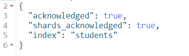
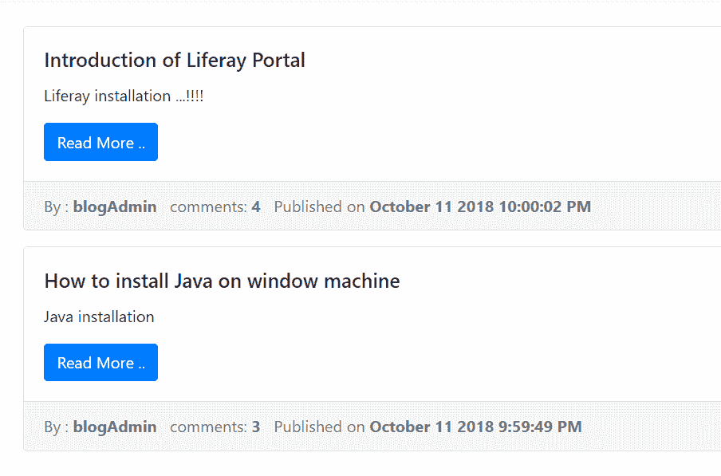
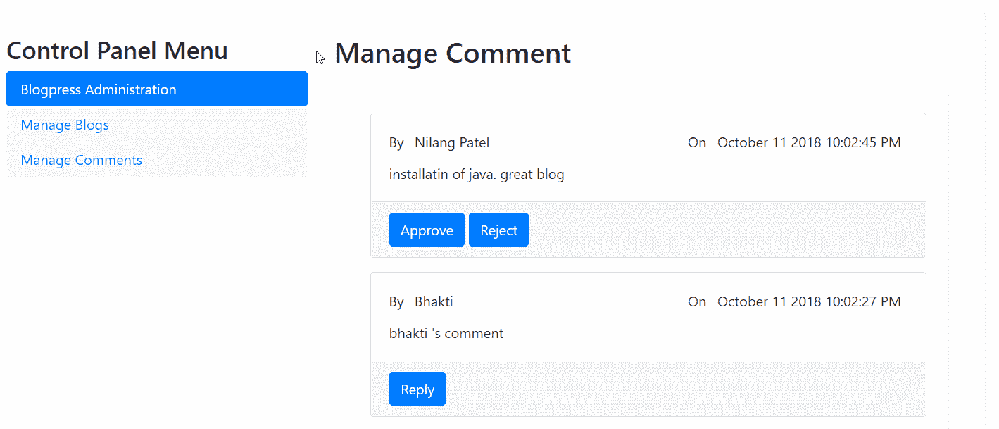

# 三、一个简单的博客管理系统

Spring 支持在 Java 平台上开发企业级应用。在其权限范围内有许多这样应用，其中最流行的是 Spring **模型-视图-控制器** ( **MVC** )、Spring Security、Spring Data、Spring Batch 和 Spring Cloud。

在前两章中，我们开始探索 Spring MVC 框架以及其他构建模块，如 Spring Data 和 RestTemplate，以及 JavaScript 框架，如 Angular、Bootstrap 和 jQuery，以构建基于 web 的应用。我们还看到了如何在 WebFlux 的帮助下构建一个反应式 web 应用，这是一个用于创建反应式 web 应用的框架。

创建一个企业级的基于 Spring 的应用需要大量的配置，这使得开发过程相当繁琐。除此之外，设置复杂的依赖关系也需要大量的工作。通常，基于 Spring 的 web 应用中使用的库需要通用的配置来将它们绑定在一起。

考虑到任何标准的基于 Spring 的应用，您可能需要执行某些重复的任务，特别是对于配置，例如，导入所需的模块和库来解决依赖性；进行与应用各层相关的配置，比如 DAO 层的数据源和事务管理，web 层的视图解析器和资源管理等等。

这是在创建任何基于 Spring 的 web 应用时必须遵循的强制性过程。简而言之，开发人员经常求助于跨应用复制配置，并且在集成库时可能没有遵循最佳实践。

所有这些因素激发了 Spring 团队提出一个框架，通过自动配置为所有 Spring 库提供集成，这基本上消除了重复的工作。除此之外，它还提供了生产就绪的特性，例如应用指标和监控，以及日志和部署指南。这个框架被称为 Spring Boot。

在这一章中，我们将继续我们的旅程，看看使用 Spring 库和其他第三方库构建博客管理 web 应用所需的不同组件，这些库都与 Spring Boot 提供的自动配置和我们对自动配置所做的一些覆盖绑定在一起。

本章将涵盖以下主题:

*   Spring Boot 的项目框架
*   Spring MVC 框架中应用的主要流程
*   表示层有**百里香叶**和`Mustache.js`
*   使用 Spring Security 确保应用的安全——包括身份验证和授权
*   在 Elasticsearch 中开发后端层，它保存应用数据并提供基于 REST 的 CRUD 操作
*   开发 Spring MVC REST 服务

# 技术要求

本章用到的所有代码都可以从下面的 GitHub 链接下载:[https://GitHub . com/packt publishing/Spring-5.0-Projects/tree/master/chapter 03/blog press](https://github.com/PacktPublishing/Spring-5.0-Projects/tree/master/chapter03/blogpress)。该代码可以在任何操作系统上执行，尽管它只在 Windows 上测试过。

# 应用概述

举一个真实的例子是探索和理解给定框架上下文的概念的最好方法。这个想法不是展示如何构建 web 应用；相反，我们将展示作为应用一部分的重要组件，这样任何人都可以选择一个组件并在另一个应用中使用它。您总是可以在为该书下载的代码中找到完整的工作解决方案。

让我们开始行动吧。首先，我们将简要介绍一下我们的应用——blog。我们称之为 **Blogpress** 。请注意，它不会是一个成熟的博客应用；相反，我们将开发以下功能:

*   登录页面—显示博客列表以及每个博客的链接。
*   当用户点击任何博客时，系统会以查看模式打开它以及所有(已批准的)评论。
*   用户可以在同一个屏幕上添加评论。
*   除此之外，用户可以使用给定的搜索文本搜索博客，以博客的标题或主体为目标。
*   有一个登录功能。两个人可以登录应用，一个博客用户和一个管理员:
    *   博客用户可以添加/更新/删除博客。他只能编辑自己创建的博客。
    *   管理员用户可以执行博客用户可以执行的所有可能的操作，以及管理(批准或拒绝)匿名用户给出的评论。
*   当任何用户添加评论时，将向管理员用户发送一封电子邮件进行审核。一旦评论被批准，一封电子邮件将作为通知发送回用户。

# Spring Boot 的项目框架

Spring Boot 自动化了创建配置的过程，从而加快了开发过程。简而言之，Spring Boot 缩短了开发生命周期，只需很少或不需要配置就可以构建生产就绪的应用或服务。它使用约定胜于配置的方法来提供快速的应用开发。

Spring Boot 并不打算提供任何新功能；相反，因为它是建立在 Spring 框架之上的，所以它使用现有的 Spring 框架特性来提供开箱即用的预配置应用框架，这是一种入门的开发模式。

与创建基于 Spring 的应用的传统方法相比，Spring Boot 有很多优点，如下所示:

*   具有自动化配置
*   轻松依赖经理
*   支持嵌入式服务器，使开发过程简单明了
*   为使用 Maven 或 Gradle 构建现成的应用提供支持
*   简化与其他 Spring 模块的集成
*   加速开发过程
*   支持命令行和 ide 来轻松开发和测试应用

# 配置 IDE Spring 工具套件

让我们开始开发我们的博客应用—Blogpress。如上所述，我们将首先用 Spring Boot 创建应用。用 IDE 开发应用是当今大多数开发人员首选的最简单、最容易、最方便和最受欢迎的方法。我们使用 ide 来开发我们的应用。

Spring 提供了一个基于 Eclipse 的 IDE，名为**Spring Tool Suite**(**STS**)来轻松开发任何基于 Spring 的应用。从链接【https://spring.io/tools. 下载 STS 的最新版本

STS 随 Eclipse 一起提供，还有 Visual Studio 和基于 Atom 的代码编辑器。为了方便，你可以使用其中任何一个。

在本章中，我们将使用 STS(一个基于 Eclipse 的 IDE)来构建应用。下载 STS，将其解压缩到您的本地文件夹中，并打开`.exe`文件来启动 STS。启动后，创建一个新的 Spring Boot 类型的 Spring Starter 项目，具有以下属性:

*   名称:`blogpress`
*   类型:Maven(也可以选择 Gradle)
*   包装:广口瓶
*   Java 版本:8(或以上)
*   语言:Java
*   组:这将是一个专家`groupId`，所以给出适当的值
*   工件:这将是一个专家`artifactId`，所以给出适当的值
*   版本:`0.0.1-SNAPSHOT`—我们的应用构建的构建版本
*   描述:`A simple blog management system`

您也可以从命令窗口创建 Spring Boot 应用。Spring 为此提供了一个名为 Spring **命令行界面** ( **CLI** )的工具。另一种创建 Spring Boot 启动项目的方式是与 https://start.spring.io/的 T4 合作。您需要定义依赖关系，这将允许用户从 web 上下载整个项目结构。

保留所有默认选项，单击 Finish 创建 Spring Boot 应用。您将在`pom.xml`中看到以下依赖关系:

```java
<dependency>
  <groupId>org.springframework.boot</groupId>
  <artifactId>spring-boot-starter-web</artifactId>
</dependency>

<dependency>
  <groupId>org.springframework.boot</groupId>
  <artifactId>spring-boot-starter-test</artifactId>
  <scope>test</scope>
</dependency>
```

Spring Boot 提供了各种启动器，特定于每个依赖项，因此它们的 jar 在类路径中是可用的。由于我们想要开发一个 web 应用(Spring MVC)，我们在前面的代码中保留了 starter `spring-boot-starter-web`(实际上，它是在 STS 中创建项目时添加的)。

Spring 以启动器的形式为特定功能提供了一组依赖项。这是在 Spring Boot 应用中管理依赖关系的一种便捷方式。当你指定一个特定的开始，Spring Boot 将为你拉你的应用中的所有(递归)依赖。例如，如果您希望使用 JPA 将数据存储添加到您的应用中，只需在您的 Spring Boot 应用中将`spring-boot-starter-jpa`添加到`pom.xml`中。所有依赖将由 Spring Boot 进行，以便您可以专注于业务实施。

您将在`pom.xml`的父元素中看到`spring-boot-starter-parent`。这就是 Spring Boot 的魅力。您的应用通过该声明扩展了所有 Spring Boot 功能，如以下代码片段所示:

```java
<parent>
  <groupId>org.springframework.boot</groupId>
  <artifactId>spring-boot-starter-parent</artifactId>
  <version>2.1.0.BUILD-SNAPSHOT</version>
  <relativePath/>
</parent>
```

# Spring 模型-视图-控制器 web 流

下一步是添加 Spring MVC 功能。在前面的步骤中，web 所需的 starter 依赖项被添加到了`pom.xml`文件中。接下来，我们将在应用中定义 Spring MVC 构件。

由于这是一个 Spring Boot 的申请，我们不需要从头申报一切。定义控制器和视图层至关重要。首先，我们将声明一个 Spring MVC 控制器，如下面的代码片段所示:

```java
@Controller
public class BlogController {
  private Logger logger = LoggerFactory.getLogger(BlogController.class);
  @GetMapping("/")
  public String showLandingPage(Model model) {
    logger.info("This is show home page method ");
    return "home";
  }
}
```

`@Controller`注释将这个类描述为 Spring MVC 控制器。它基本上指示 Spring Boot 应用该组件将服务于基于 web 的请求。它匹配正确的 URL 模式来调用特定的控制器及其方法。

在前面的声明中，我们只给了控制器方法 URL 模式。然而，Spring 也允许您为控制器声明 URL 模式。由于我们的应用只需要某些功能，一个控制器就足够了，因此，我们没有为控制器声明 URL 模式。因此，当前应用的所有 web 请求(带有`http://host/context/controllerUrlPattern`模式)都将被路由到这个控制器。

`@RequestMapping("/controllerUrlPattern")`注释用于描述控制器级别的 URL 模式。在这种情况下，`http://host/context/controllerUrlPattern`模式将到达该控制器。其所有方法的 URL 模式将被附加在`http://host/context/controllerUrlPattern`之后。

使用记录器总是一个好习惯。Spring 提供了`LoggerFactory`类来获取当前类的 logger 实例。您可以在适当的地方调用各种方法，如`info`、`debug`、`error`等等。

Spring MVC 控制器方法可以映射到一个不同的 URL，这样它就可以被一个匹配的请求 URL 模式触发。在前一种情况下，`showLandingPage()`方法是一种控制器方法。它被映射到 URL `/`，这意味着`http://localhost:8080/blogpress/` URL(考虑到您在本地使用`8080`端口运行应用，并且`blogpress`是您的应用的名称)将调用这个方法。

该方法返回一个字符串`home`，它表示来自表示层的组件。Spring MVC 足够灵活，可以选择想要的表示框架。所以，完全没有必要使用特定的技术作为你的表示层。您可以使用**Java server Pages**(**JSP**s)、Thymeleaf 或 Angular 等 UI 框架作为 Spring MVC web 应用的前端。

在这一章中，我们将使用百里香叶来构建表示层。

# 百里香叶表示层

Thymeleaf 是一个模板引擎，用于在服务器端处理 XML、HTML、JavaScript、CSS 和纯文本的各种模板。你可能会问:为什么是百里香叶？我们已经有 JSP 了。在 JSP 上使用百里香叶有什么好处？

答案是，百里香采用自然模板概念设计，提供设计原型支持，不影响模板的使用。换句话说，由于其性质，百里香可以被开发人员和设计团队使用，而不会被锁定或相互依赖。

百里香的另一个好处是它是按照 web 标准设计的，主要是 HTML5。如果需要的话，这将使您很容易完全验证模板。

# 百里香叶的工作原理

对于我们的博客应用，我们将使用百里香 HTML 模板。使用百里香叶的第一步是指导 Spring Boot，使其能够为我们的应用提供所有必要的百里香叶配置。在`pom.xml`中增加以下条目:

```java
<dependency>
  <groupId>org.springframework.boot</groupId>
  <artifactId>spring-boot-starter-Thymeleaf </artifactId>
</dependency>
```

Thymeleaf 提供了某些标签(一种 JSP 标签)来将动态值嵌入模板。我们将首先浏览我们打算在 Blogpress 应用中使用的最少的标签。将动态值插入百里香模板的机制与您在 JSP 标签中看到的不同，因此在开始使用它之前熟悉它是非常重要的。

你可以看到百里香叶的另一个开胃菜。这就是 Spring Boot 如何让开发者的生活变得简单。

# 方言、处理器和表达式对象

方言是您在模板中使用的一组功能，包括预处理和后处理逻辑以及表达式对象。处理逻辑(在模板中嵌入动态 HTML 和值)由称为处理器的对象执行，而表达式对象用于描述执行特定操作的标准表达式。简而言之，处理器对象处理 DOM 节点或元素，而表达式对象用于计算表达式。

方言可以和处理器、表达式对象或两者一起使用。让我们看看如何在模板中声明和使用方言:

```java
<!DOCTYPE html>
<html xmlns:th="http://www.Thymeleaf.org">

<span th:text="${name}">
```

在前面的代码片段中，`th`被称为方言前缀。意思是这个方言提供的所有属性和标签都是以`th:`开头的。这是一种标准的、现成的方言，对于我们的大多数场景来说已经足够了。可以考虑 JSP 中类似于 *Taglibs* 的方言。

您可以在模板中定义多种方言。此外，您可以使用定制处理器中的定制处理逻辑创建自己的定制方言。

`text`属性表示一个处理器，它只是为 span 放置值，而`${...}`描述值表达式对象，它只是提取存储在模型中的属性值。以下是百里香叶中可用的表达式对象类型:

*   **变量表达式对象:**它们用于显示模型属性的值。它们以 Spring**的形式表达语言** ( **EL** )。它们可以用`${...}`语法来描述。
*   **选择表达式对象:**类似于表达式对象，但只能应用于之前选择的对象。它们可以和`*{...}`语法一起使用。
*   **消息(i18n)表达式:**这些用于国际化目的，并带来特定于语言的消息。您可以使用`#{...}`语法。
*   **链接(URL)表达式:**这些用于动态使用链接。比如表单动作，HREF，链接 JS/CSS，或者其他静态资源等等。对它们使用`@{...}`语法。
*   **片段表达式:**这代表模板的一个片段，可以在类似的或其他模板中重用。它们可以与`~{...}`语法一起使用。

接下来，我们将看到一些我们将在下面的应用中使用的处理器。它们可以与下列各种表达式对象一起使用:

*   `th:text`—与值表达式对象一起用于放置 HTML 元素的动态文本，如`span`、`li`、`div`等
*   `th:value`—输入元素的值可由该处理器提供
*   `th:action`—可用于向 HTML 表单提供动作值
*   `th:href`—顾名思义，它用于在链接中提供 URL(以导入 CSS)和 HTML 中的标签
*   `th:src`—这用于动态地为 HTML 中的脚本(和其他类似的)元素提供源 URL
*   `th:each`—在循环中与`th:text`一起使用，构建重复的 HTML 代码，即 HTML 表格的行
*   `**th:if**`和`th:unless`—这些用于有条件地放置动态值

Thymeleaf 支持以 HTML5 风格定义属性和元素名称。比如不写`th:text`，可以写`data-th-text`作为 HTML 元素中的属性，在 HTML5 中被认为是自定义元素。

# 为什么百里香叶是天然模板

我们已经看到标准方言的处理器被作为 HTML 元素的属性放置。由于这种安排，浏览器可以将百里香模板呈现为正确的 HTML 文件，甚至在它们被模板引擎处理之前。

这很可能是因为浏览器忽略了它们，认为它们是自定义属性，所以显示它们没有问题。对于 JSP 来说，这是不可能的。例如，带有以下标记的 JSP 不会在浏览器中呈现:

```java
<form:input name="name" path=”name”/>
```

如果你用百里香叶写它，它会如下:

```java
<input type="text" name="name" value="Nilang" th:value="${name}" />
```

浏览器将完美地显示前面的代码。此外，Thymeleaf 允许您提供(可选的)value 属性(在我们的例子中为`Nilang`)，当在浏览器上运行时，该属性将静态显示。当相同的代码被百里香模板引擎处理时，该值将被动态计算的`${name}`表达式所替代。

这就是百里香被称为天然模板引擎的原因。它允许设计人员与开发人员一起工作，而不会对任何一方产生依赖性。

现在，让我们讨论一下我们将在博客应用中使用哪些百里香模板。当您创建一个 Spring Boot 应用时，您会在`src/main/resources`文件夹中看到一个`templates`文件。我们所有的百里香模板都在那里。

我们将在应用中使用以下模板:

*   这个模板包含一个普通的 JS/CSS 包含头，以及一个导航栏。它包含在所有其他模板中。
*   `home.html`:显示首页内容。
*   `login.html`:允许用户登录系统。
*   博客用户一旦登录，就会进入这个页面。
*   `view-blog.html`:以只读模式打开一个特定的博客。
*   `search.html`:显示搜索结果。
*   博客用户或管理员可以通过这个模板创建新的博客。
*   `manage-comments.html`:管理员用户可以批准/拒绝评论。
*   `edit-blog.html`:允许博客用户/管理员用户编辑现有博客。
*   一旦管理员用户登录，他们将进入这个页面。

我们将首先添加两个模板— `home`和`header`。在继续之前，让我们看看我们将在应用中使用的百里香叶的另一个很酷的特性。就像 JSP 一样，您可以将一个模板包含到另一个模板中。此外，百里香允许您只包含模板的一部分(片段),而不是整个模板，这在 JSP 中是不可能的。

这是一个很好的特性，因为您可以在一个模板中定义公共片段，并将它们包含在其他模板中。在我们的例子中，我们已经在一个`header.html`模板中定义了公共标题项，如下所示:

```java
<!DOCTYPE html>
<html xmlns:th="http://www.Thymeleaf.org">
<head th:fragment="jscssinclude">
    <!-- Required meta tags -->
    <meta charset="utf-8">
    <meta name="viewport" content="width=device-width, initial-scale=1, shrink-to-fit=yes">
    <!-- Bootstrap CSS -->
    <link rel="stylesheet" th:href="@{/css/bootstrap.min.css}">
    <link rel="stylesheet" th:href="@{/css/blogpress.css}">

    <script th:src="@{/js/jquery.min.js}" type="text/javascript"></script>
    <script th:src="@{/js/popper.js}" type="text/javascript"></script>
    <script th:src="@{/js/bootstrap.min.js}" type="text/javascript"></script>

    <title th:text="${pageTitle}">Title</title>
</head>
<body>
  <div th:fragment="header_navigation">
    <div class="jumbotron text-center jumbotron-fluid" 
        style="margin-bottom:0; padding:2rem 1 rem" >
         <h1>Blog Press</h1>
         <p>Let's do Blogging ..!</p>
     </div>
     <nav class="navbar navbar-expand-sm bg-dark navbar-dark">
          <button class="navbar-toggler" type="button" 
              data-toggle="collapse" data-target="#collapsibleNavbar">
              <span class="navbar-toggler-icon"></span>
          </button>
          <div class="collapse navbar-collapse" id="collapsibleNavbar">
              <ul class="navbar-nav">
                  <li class="nav-item">
                      <a class="nav-link" th:href="@{/}">Home</a>
                  </li>
               </ul>
          </div>
      </nav>
    </div>
</body>
</html>
```

片段由`th:fragment`标签定义。您可以看到如何使用 Thymeleaf 标记(带有方言前缀、处理器和表达式对象)来导入各种静态资源(JS/CSS)，并向 HTML 元素添加动态值(在我们的例子中是`${pageTitle}`)。

我们可以在其他模板中包含这个头(定义为片段)。例如，在我们的`home.html`模板中，我们如下使用它:

```java
<!DOCTYPE html>
<html xmlns:th="http://www.Thymeleaf.org">
  <head th:replace="header :: jscssinclude"></head>
  <body>
    <div th:replace="header :: header_navigation"></div>
    This is Home page
  </body>
</html>
```

`th:replace`标签用于引用来自其他模板的片段代码。你只需要把模板的名字(从你引用片段的地方)加上两个冒号(`::`)和片段的名字(你用`th:fragment`标签定义的)。这就是百里香允许你将一组模板代码作为一个片段引用到其他模板的方式。

我们已经定义了另一个片段，称为`header_navigation`，在前面的代码片段的 home 模板中引用了它。它用于显示我们应用的导航菜单。

此时，我们还需要将静态资源(JS/CSS)放入我们的应用中。您将在项目结构中看到一个静态文件夹，所有静态资源都应该放在这个文件夹中。Spring Boot 将把静态文件夹中的所有东西都视为静态资源。在静态文件夹下创建`css`、`img`和`js`文件夹，并在其中放置以下资源:

*   向`css`文件夹添加以下内容:
    *   `bootstrap.min.css`
*   向`js`文件夹添加以下内容:
    *   `Bootstrap.min.js`
    *   `Jquery.min.js`
    *   `popper.js`

现在是时候运行我们的应用来查看主页了。您可以在服务器上构建和部署它，并使用`http://localhost:8080/blogpress` URL 访问它，您将看到带有标题和导航栏的主页。接下来，我们必须用 Spring security 来保护我们的应用。安全性是当今任何应用的一个重要方面和核心问题。

# 使用 Spring Security 确保应用的安全

我们的 Blogpress 应用具有登录功能，可以访问普通(匿名)用户无法访问的某些页面和功能。如果我们自己从头开始构建身份验证和授权，那么将它整合进来需要付出大量的努力。Spring 提供了一个名为 Spring Security 的特性，这正是我们在这里所需要的。

Spring Security 是一个开源的、高度全面的、强大的、可定制的框架，用于在基于 J2EE 的 web 应用中实现身份验证和授权。它是 Spring 框架的一个子项目(模块)。

在进一步讨论之前，理解身份验证和授权之间的区别很重要。

认证是**验证**或确定某人或某物的过程。有几种机制来执行身份验证。执行身份验证最直接的方式是提供用户名和密码。其他方式包括通过 LDAP、单点登录、OpenId 和 OAuth。

另一方面，授权更多的是和你被允许做的动作的**权限**有关。简而言之，在系统中，认证意味着**你是谁**，授权意味着**你能做什么**。

Spring Security 提供了许多现成的特性，包括认证、授权、防止 CSRF 攻击、servlet API 集成支持、Spring MVC 集成、记住我的特性、SSO 实现支持、LDAP 认证支持、OpenID 集成、web 服务安全支持、WebSocket 安全支持、Spring 数据集成等等。

尽管 Spring Security 的最新版本(在撰写本文时是 5.1.0)支持 XML 和注释支持，但是如果您自己设置它，仍然需要做大量的配置工作。但是你不用担心，因为 Spring Boot 和你在一起。

Spring Boot 也支持 Spring 安全集成。就像与其他模块集成一样，您需要为 Spring Security 添加一个必需的启动器，以便与 Spring Boot 一起工作。在`pom.xml`文件中添加以下依赖关系:

```java
<dependency>
  <groupId>org.springframework.boot</groupId>
  <artifactId>spring-boot-starter-security</artifactId>
</dependency>
```

一旦您完成了前面提到的配置，Spring Security 就会激活，并且不允许在没有有效凭证的情况下访问应用的公共页面。当你点击`http://localhost:8080/blogpress`，你会看到一个登录界面。

Spring Security 的默认(自动)配置允许您使用特定的凭证登录。用户名为`user`，密码由 Spring Security 随机生成，并打印在服务器日志中，如下所示:

使用生成的安全密码:89 ca 7b 55-6a5d-4d d9-9d 02-AE 462 e 21 df 81。

您可以覆盖`property`文件中的用户名和密码。在项目结构中，你会在`src/main/resources`文件夹中看到`application.properties`文件。只需向它添加以下两个属性:

```java
spring.security.user.name=nilang
spring.security.user.password=password
```

现在，您可以使用前面提到的凭证访问应用，但是即使是访问公共页面也需要身份验证。默认情况下，Spring Security 是用默认(或自动)配置激活的，它保护所有的端点。这不是我们想要的。因此，我们需要指示 Spring Security 我们希望哪些端点(URL)是安全的，哪些是不安全的。

为此，首先，我们需要禁用默认的安全(自动)配置。这里有两种可能的选择。

# 不包括自动配置

为主`bootstrap`类的`@SpringBootApplication`注释添加一个`exclude`属性，如下面的代码片段所示:

```java
@SpringBootApplication(exclude = { SecurityAutoConfiguration.class })
public class BlogpressApplication {

  public static void main(String[] args) {
    SpringApplication.run(BlogpressApplication.class, args);
  }
}
```

或者，您可以在`application.properties`文件中添加以下属性:

```java
spring.autoconfigure.exclude=org.springframework.boot.autoconfigure.security.servlet.SecurityAutoConfiguration
```

您可以采用前面描述的任何一种方法来禁用或排除安全(自动)配置。仅在需要集成自定义提供程序提供的安全性的特定情况下，排除自动配置才是合适的。

# 替代自动配置

禁用自动安全配置的另一种方法是用我们自己的自定义配置来超越它。Spring Security 是一个高度可定制的框架，提供了基于 URL 和角色的细粒度访问机制。

要用自定义配置替换自动配置，我们需要指定配置类，如下面的代码片段所示:

```java
@Configuration
@EnableWebSecurity
@ComponentScan("com.nilangpatel.blogpress")
public class WebSecurityConfig extends WebSecurityConfigurerAdapter {
  …..
}
```

`WebSecurityConfig`自定义配置类扩展了`WebSecurityConfigurerAdapter`抽象类。这个抽象类具有某些扩展点(以抽象方法的形式，您可以为其提供自定义实现)和常见任务的默认实现。

因为我们的类(`WebSecurityConfig`)提供了定制配置，我们必须用`@Configuration`和`@ComponentScan("com.nilangpatel.blogpress")`注释来定义它。您需要在`@ComponentScan`注释中给出包(定制配置类所在的地方)的名称。

`@EnableWebSecurity`注释也很重要，因为我们正在禁用默认的安全配置。没有它，我们的应用将无法启动。我们现在将覆盖`WebSecurityConfigurerAdapter`类的一个方法，该方法将用于定义 web 配置，并添加一个额外的方法，该方法将用于定义用户详细信息:

```java
@Override
public void configure(WebSecurity web) throws Exception {
  web.ignoring().antMatchers("/js/**");
  web.ignoring().antMatchers("/css/**");
}
```

默认情况下，Spring 安全性适用于所有请求——也包括静态资源。此方法用于定义静态资源的转义序列。如果在这里没有将它们配置为被忽略，Spring Security 将默认阻止它们。在没有前面讨论的配置的情况下，静态资源将不会被加载到浏览器中，因此您将看不到任何`javascript`、`css`或`images`文件。接下来，我们将用户的详细信息添加到同一个类中，如下所示:

```java
// create users and admin
@Autowired
public void configureGlobal(AuthenticationManagerBuilder auth) throws Exception {

  BCryptPasswordEncoder encoder = passwordEncoder();
  auth.inMemoryAuthentication() .passwordEncoder(encoder)
    .withUser("blogUser1").password(encoder.encode("password")).authorities("USER")
    .and()
    .withUser("blogUser2").password(encoder.encode("password")).authorities("USER")
    .and()
    .withUser("blogAdmin").password(encoder.encode("password")).authorities("ADMIN");
}

@Bean
public BCryptPasswordEncoder passwordEncoder() {
  return new BCryptPasswordEncoder();
}
```

这里使用了`configureGlobal`方法来动态创建带有密码和角色的用户名。它是用`@Autowired`注释声明的，因此 Spring 将在其中注入`AuthenticationManagerBuilder`类的对象。`AuthenticationManagerBuilder`类用于提供`AuthenticationManager`的实现。正如我们所看到的，Spring Security 允许各种认证机制，并为每种机制提供了一个`AuthenticationManager`的实现，比如内存认证、LDAP 认证、JDBC 认证、OAuth 认证等等。

为了使事情变得简单，我们使用了内存中身份验证，它只是将用户详细信息放在内存中。然而，这对于生产来说并不理想。您应该在数据库中创建用户详细信息，Spring Security 足够灵活，可以支持这种场景。

确保密码安全是任何安全框架中最重要、最核心的部分，因此 Spring Security 为此提供了一种编码机制。它提供了`BCryptPasswordEncoder`，这是一个用来对密码进行编码的编码器类。它使用 **bcrpt** 算法进行编码，这是一个非常强大的密码哈希例程，广泛用于 Spring Security。

Spring Security 还提供了一个名为`NoOpPasswordEncoder`的类，以防您希望按原样存储密码(以纯文本形式)。然而，从版本 5 开始，Spring 决定弃用它，并可能在未来的版本中删除它。这是因为不鼓励将密码设为纯文本，这可能会导致安全漏洞。所以永远不要使用`NoOpPasswordEncoder`类(即使对于任何 POC 也是如此)。

我们使用了一个名为`configureGlobal`的方法，但是你完全可以自由选择你认为合适的方法。

接下来，我们将覆盖另一个方法，它是一个扩展点，为应用中的每个端点提供自定义安全设置，如下面的代码片段所示:

```java
@Override
protected void configure(HttpSecurity http) throws Exception {
  http.authorizeRequests()
    .antMatchers("/").permitAll()
    .antMatchers("/controlPage/")
    .hasAnyAuthority("ROLE_USER","ROLE_ADMIN")
    .and()
  .formLogin().loginPage("/login").permitAll()
    .defaultSuccessUrl("/controlPage")
    .failureUrl("/login?error=true")
    .and()
  .logout()
    .permitAll().logoutSuccessUrl("/login?logout=true");
}
```

我们覆盖 configure 方法(将`HttpSecurity`作为方法参数)来提供定制的安全配置。如果您打开父类的原始 configure 方法(`WebSecurityConfigurerAdapter`)，它看起来像下面的代码片段。将原始方法的引用放在一起将有助于您理解我们为 Blogpress 应用提供了什么样的定制配置:

```java
protected void configure(HttpSecurity http) throws Exception {
  http.authorizeRequests()
    .anyRequest().authenticated()
    .and()
    .formLogin().and()
    .httpBasic();
}
```

默认的`configure`方法只是验证所有请求。它允许用户使用基于表单的登录进行身份验证，并支持 HTTP 基本身份验证。这就是为什么我们在没有自定义安全配置的情况下，在 Spring Boot 的 Spring Security 被激活的时候，我们得到了一个默认的登录页面。

在 Spring 安全范例中，`principal`指的是用户名，而`authorities`指的是用户拥有的角色。在使用 Spring Security 时记住这些术语将有助于您更好地理解这些概念。

现在，让我们看看我们在被覆盖的 configure 方法中做了哪些定制，如下所示:

*   `antMatchers("/", "/home").permitAll()`行将允许列出的 URL 不经过任何认证。这意味着`/`(默认网址— `http://localhost:8080/blogpress`)网址是可以公开访问的。您可以在此处以逗号分隔的列表形式提供任何进一步的 URL。
*   下一个`antMatchers("/controlPage").hasAnyAuthority("ROLE_USER","ROLE_ADMIN")`行使得任何具有`ROLE_USER`或`ROLE_ADMIN`角色的用户都可以访问`/controlPage` URL。
*   下一个`formLogin().loginPage("/login").permitAll()`行允许我们设置登录页面 URL。我们保留了`/login` URL，但是您可以给出任何自定义的登录 URL。由于登录页面应该是可以公开访问的，所以`permitAll()`方法将使所有人都可以访问登录 URL。
*   一旦 Spring Security 验证了用户，它将发送到一个成功页面。您可以使用`defaultSuccessUrl("/controlPage")`配置自定义成功页面。在这种情况下，成功的 URL 是`/controlPage`。
*   同样，如果身份验证失败，它应该发送到错误页面。在认证失败时，`failureUrl("/login?error=true")`行将把流发送到`/login` URL(以及参数)。
*   最后，`permitAll().logoutSuccessUrl("/login?logout=true")`行配置了注销页面。一旦用户注销，系统将触发`/login` URL(以及参数)。

我们已经添加了自定义安全配置；现在是时候在 Spring MVC 中添加对应于我们在之前的 Spring 配置中提到的每个 URL 的方法了。在 Spring MVC 中添加以下方法:

```java
@GetMapping("/")
  public String showHomePage(Model model) {
    logger.info("This is show home page method ");
    setProcessingData(model, BlogpressConstants.TITLE_HOME_PAGE);
    return "home";
  }
@GetMapping("/controlPage")
  public String showControlPage(Model model) {
    logger.info("This is control page ");
      setProcessingData(model, BlogpressConstants.TITLE_LANDING_CONTROL_PAGE);
      return "control-page";
  }
@GetMapping("/login")
  public String showLoginPage(@RequestParam(value = "error",required = false) String error,
      @RequestParam(value = "logout", required = false) String logout,Model model) {
    logger.info("This is login page URL ");
    if (error != null) {
      model.addAttribute("error", "Invalid Credentials provided.");
    }
    if (logout != null) {
      model.addAttribute("message", "Logged out");
    }
    setProcessingData(model, BlogpressConstants.TITLE_LOGIN_PAGE);
    return "login";
  }
```

当用户点击导航中的主页链接时，`showHomePage`方法负责显示主页。它与`/` URL 相关联，并将显示`home.html`(百里香叶)模板。此外，当您点击`http://localhost:8080/blogpress` URL 时，也会调用此方法。

`showControlPage`方法与`/controlPage` URL 相关联，并将在成功认证时被调用。该方法将用户导向`control-page.html`(百里香叶)模板，该模板显示基于角色的管理链接。例如，角色为`ROLE_ADMIN`的用户可以看到管理博客和管理评论的链接，而角色为`ROLE_USER`的用户只能看到管理博客链接。

`showLoginPage`方法表示登录功能。它与`/login` URL 相关联。它根据参数值和页面标题属性存储消息，页面标题属性用于显示页面的标题(在`header.html`模板中)。最后，它打开`login.html`模板。

除了这些方法之外，还添加了以下方法，这些方法直接使用`${}`表达式来存储百里香模板中可用的模型属性:

```java
@ModelAttribute("validUserLogin")
public boolean isUserLoggedIn() {
  return SecurityContextHolder.getContext().getAuthentication() != null && SecurityContextHolder.getContext().getAuthentication().isAuthenticated() &&
       //when Anonymous Authentication is enabled
       !(SecurityContextHolder.getContext().getAuthentication() instanceof AnonymousAuthenticationToken); 
}

@ModelAttribute("currentUserName")
public String getCurrentUserName() {
    return SecurityContextHolder.getContext().getAuthentication().getName();
}
@ModelAttribute("hasAdminRole")
  public boolean checkIfUserHasAdminRole(){
    return checkIfUserHasRole(BlogpressConstants.ROLE_ADMIN);
  }
@ModelAttribute("hasUserRole")
  public boolean checkIfUserHasUserRole(){
    return checkIfUserHasRole(BlogpressConstants.ROLE_USER);
  }
private boolean checkIfUserHasRole(String roleName) {
     boolean hasUserRole =      SecurityContextHolder.getContext().getAuthentication().getAuthorities().stream()
                .anyMatch(r -> r.getAuthority().equals(roleName));
     return hasUserRole;
  }
```

`isUserLoggedIn`方法检查当前是否有用户登录。它将被百里香模板中的`${validUserLogin}`表达式调用。`getCurrentUserName`方法只是提供当前登录的用户名。`checkIfUserHasUserRole`和`checkIfUserHasAdminRole`方法只是检查各自的角色。您可以看到如何使用`SecurityContextHolder`类获取用户登录信息。该类负责存储当前已通过身份验证的用户的详细信息，也称为原则。

我们已经逐渐形成了 Blogpress 应用，它现在配备了 Spring MVC、百里香和 Spring Security。所有这些快速发展都是在 Spring Boot 的帮助下实现的。我们要开发的下一部分是数据层，这是我们的应用中最重要和最关键的部分。正如我们提到的，我们将在 **Elasticsearch** 中构建数据层。

# 使用 Elasticsearch 存储数据

Elasticsearch 是一个高度可扩展的全文搜索开源 RESTful 搜索、索引和分析引擎，开发于 Lucene 之上。它是当今构建企业应用最流行的搜索引擎之一。它可以非常快速地保存、搜索和分析大量数据。它主要用于需要复杂搜索的应用。

它是用 Java 开发的，提供近乎实时的结果。它被设计为在分布式环境中工作，以提供高可用性和可伸缩性。它是面向文档的，以 JSON 格式存储复杂的实体结构，并提供一个 web 界面来进行交互。

Elasticsearch 主要用于搜索大量匹配产品的应用中(例如，电子商务)，对部分键入的输入使用自动完成功能，或者分析以分布式方式存储的大量原始数据。

# 史前古器物

理解一些经常与 Elasticsearch 一起使用的术语是很重要的，这将有助于您理解 Elasticsearch 是如何构建的以及它是如何工作的。它们是弹性研究的核心。我们将详细研究它们中的每一个。

# 文档

存储在 Elasticsearch 中的基本信息单元被称为**文档**。可以考虑一个文档相当于**关系数据库管理系统** ( **RDBMS** )中的一个实体。例如，可以为雇员创建一个文档，为薪水创建另一个文档，等等。一个文档将被 Elasticsearch 引擎索引，它们以 JSON 格式呈现。每个文档都与文档类型相关联。您可以将一个文档类型与一个**普通旧 Java 对象** ( **POJO** )类相关联，而将一个文档作为 POJO 类的对象。

# 指数

索引是一组具有相似结构的文档。您可以为员工数据定义一个**索引**，为工资数据定义另一个索引，依此类推。索引可以通过与之相关联的名称来标识。索引名用于索引，与 CRUD 操作一起搜索它所包含的文档。您可以定义任意数量的索引。一个索引总是独立于另一个索引。在弹性搜索中，一组指数被称为指数。

在版本 6.0.0 之前，Elasticsearch 允许为给定的索引创建多种文档类型。例如，您可以为索引组织的用户和员工(甚至更多)创建文档类型。从版本 6 开始，Elasticsearch 限制一个给定的索引只允许一种文档类型。因此，您需要为每种文档类型创建一个单独的索引。

# 集群和节点

Elasticsearch 是一个分布式系统，这意味着它可以水平扩展，并在多个服务器上运行，以最佳速度处理大量数据。这种服务器的网络被称为**集群，**其中单个服务器被称为节点。

节点和集群都通过名称来标识。对于节点，Elasticsearch 在启动时会生成一个默认的随机**通用唯一标识符** ( **UUID** )。如果您愿意，可以更改默认名称。节点名很重要，因为它有助于管理与节点名相关联的服务器。

节点使用集群名称加入集群。默认情况下，所有节点都与名为`elasticsearch`的集群相关联。您可以为给定的集群创建任意数量的节点。

# 碎片和复制品

Elasticsearch 以文档的形式存储数据，这些文档被分组到一个索引中。在数据量巨大的情况下，单个索引中的文档数量可能会超过底层硬件容量的限制。例如，存储在单个索引中的超过一万亿个文档可能需要高达 **100 GB** 的空间，这可能无法存储在单个节点中。

作为这个问题的解决方案，Elasticsearch 提供了一种将索引分成多个片段的机制；每个都可以被视为一个单独的索引，可以存储在多个节点中。索引的各个部分被称为**碎片**。这也将提高搜索性能，因为搜索可以在多个碎片上同时执行。

顾名思义，复制品就是碎片的拷贝。它们是为故障切换而创建的；如果一个碎片停机或离线，将使用一个副本来提供服务并使系统高度可用。

简而言之，一个索引可以分为多个分片；每个碎片可以有零个或多个副本。因此每个索引都有一个主碎片，以及零个或多个副本碎片。默认情况下，Elasticsearch 为每个索引关联五个主分片和一个副本(从最新的稳定版本 6.4.1 开始)。

对于我们的 Blogpress 应用，我们将保留默认值，即一个包含默认分片和副本设置的索引的单个节点。索引的名称将是`blog`。

# 与 Elasticsearch 互动

Elasticsearch 提供了一种与它交互的方式，用于搜索、索引和执行其他 CRUD 操作。它为交互提供了 RESTful API，因此您可以使用各种 HTTP 方法(`GET`、`POST`、`PUT`、`DELETE`等等)来处理 Elasticsearch 上的任何操作。

Elasticsearch 不维护请求的状态，因此每个请求都是独立的，信息以 JSON 格式交换。使用各种 HTTP 方法在 Elasticsearch 上执行 CRUD 操作。例如，`GET`方法用于检索数据，而`PUT`、`POST`和`DELETE`用于更新或删除记录。

由于 Elasticsearch 公开了 REST APIs，所以您可以使用任何 REST 客户端(例如， **Postman** )来使用它。此外，为了分析和可视化数据，Elasticsearch 提供了另一个免费的开源工具，名为 **Kibana** 。它提供了一个简单的基于浏览器的界面来执行搜索、查看和其他 CRUD 操作，以及丰富的数据分析，以各种表格、图表、类似地图的内存以及磁盘利用率、索引和文档信息的形式呈现。它还有助于管理索引和文档类型，对文档数据执行 CRUD 操作，等等。

# 装置

我们先安装 Elasticsearch。从[https://www.elastic.co/downloads](https://www.elastic.co/downloads)下载 Elasticsearch ZIP 包。将其解压缩到本地驱动器并运行`bin/elasticsearch`。默认情况下，它将在`9200`端口上可用。一旦启动并运行，你可以通过`http://localhost:9200`访问它。

你可以从同一个[https://www.elastic.co/downloads](https://www.elastic.co/downloads)网址下载并安装 Kibana。解压软件包并运行`bin/kibana`。你可以通过`5601`端口，也就是`http://localhost:5601`访问基巴纳。

Elasticsearch 还提供了 MSI Installer for Windows，这是一种在 Windows 机器上安装 Elasticsearch 的简单方法。

# 弹性搜索 RESTful API

接下来，我们快速查看一些 API 来执行 Elasticsearch 上的各种活动。由于 Elasticsearch 提供了 REST 接口进行交互，所以可以使用任何 REST 客户端，比如 Postman。或者，您可以使用 **Kibana** Dev 工具来执行 REST 调用。它们之间有一点点不同。

我们将通过一个`student`实体的例子来理解各种 RESTful API。目的是解释如何创建一个`students`索引；创建`student`单据类型；添加、更新和删除`student`数据；并删除文档类型和索引。

# 创建索引-学生

使用您的 REST 客户端(Postman)，输入以下内容:

*   **网址** : `http://localhost:9200/students`
*   **方法**:放
*   **类型** : JSON(应用/json)
*   正文:

```java
{
}
```

对于 Kibana，转到 Kibana 中的 Dev Tools 选项并键入以下脚本:

```java
PUT students
{

}
```

您将看到以下输出:



我们已经创建了一个没有任何显式设置的`student`索引，所以 Elasticsearch 使用默认设置创建了该索引——五个碎片和一个副本。您可以在 Kibana 的管理选项中看到这些细节。如果您希望给出碎片和副本的精确数量(而不是默认的五个和一个)，您可以在创建`student`索引时在主体中添加 JSON 设置，如下所示:

使用 REST 客户端(Postman)，输入以下内容:

*   **网址** : `http://localhost:9200/students`
*   **方法**:放
*   **类型** : JSON(应用/json)
*   正文:

```java
 {
    "settings" : {
        "index" : {
            "number_of_shards" : 3, 
            "number_of_replicas" : 2 
        }
    }
 }
```

对于 Kibana，转到开发工具并键入以下脚本:

```java
PUT student
{
    "settings" : {
        "index" : {
            "number_of_shards" : 3, 
            "number_of_replicas" : 2 
        }
    }
}
```

在前一个例子中，索引是用三个碎片和两个副本创建的。这是您在 Elasticsearch 中创建索引时指定特定设置的方式。

# 创建文档类型-学生

创建索引之后，下一步就是创建文档类型。我们将在`students`索引中创建一个名为`student`的文档类型。同样，这可以用 REST 客户端或 Kibana 来完成。我们将详细了解这两个选项。

使用 REST 客户端(Postman)，输入以下 **:**

*   **网址** : `http://localhost:9200/students/_mapping/student`
*   **方法** : POST
*   **类型** : JSON(应用/json)
*   正文:

```java
{
    "properties":{
      "id":{"type":"long"},
      "name":{"type":"text"},
      "standard":{"type":"integer"},
      "division":{"type":"text"},
      "gender":{"type":"text"}
    }
 }
```

使用 Kibana，转到开发工具选项并添加以下脚本:

```java
PUT students/_mapping/student
{
  "properties": {
    "id":{"type":"long"},
    "name":{"type":"text"},
    "standard":{"type":"integer"},
    "division":{"type":"text"},
    "Gender":{"type":"text"}
   }
}
```

您可以使用其中任何一个选项来创建文档类型。我们在`students`索引*中创建了具有 ID、名称、标准、部门和性别属性的`student`文档类型。*我们的结构已经准备好将数据添加到 Elasticsearch 中。接下来，我们将看到如何为我们已经定义的`student`类型插入数据。

在版本 6 之前，Elasticsearch 允许在同一索引中创建多种文档类型。从 6 开始，他们限制在该索引中只能创建一种文档类型。

# 添加文档(学生数据)

使用 REST 客户端(Postman)，输入以下内容:

*   **网址** : `http://localhost:9200/students/student/1`
*   **方法**:放
*   **类型** : JSON(应用/json)
*   正文:

```java
{
    "name":"Nilang",
    "standard":3,
    "division":"B",
    "gender":"M"
}
```

对于 Kibana，转到 Dev Tools 选项并键入以下脚本:

```java
PUT students/student/1
{
    "name":"Nilang",
    "standard":3,
    "division":"B",
    "gender":"M"
}
```

您可以使用下面的 REST API 来验证插入的数据。

# 阅读文档(学生数据)

对于 REST 客户端，输入下面的 **:**

*   **网址** : `http://localhost:9200/students/student/1`
*   **方法**:获取

使用 Kibana，输入以下内容:

```java
GET students/student/1
```

您将获得以下 JSON 作为输出:

```java
{
    "_index": "students",
    "_type": "student",
    "_id": "1",
    "_version": 1,
    "found": true,
    "_source": {
        "name": "Nilang",
        "standard": 1,
        "division": "B",
        "gender": "M"
    }
}
```

首先，它显示了索引和文档类型。`_id`属性表示我们在创建数据时在`http:/localhost:9200/students/student/1` URL 中提供的 ID。如果您使用任何现有的`_id`，Elasticsearch 将简单地用当前值更新该记录。`_version`属性表示记录被更新的次数。`_source`属性代表我们提供的数据。

# 更新文档(学生数据)

为了更新数据，使用与添加文档相同的语法。添加时，ID 在系统中不存在，如果存在，将使用提供的值更新现有数据。例如，下面的命令将更新现有的学生记录，使`_id`等于 5。

对于 REST 客户端(Postman)，使用下面的 **:**

*   **网址** : `http://localhost:9200/students/student/5`
*   **方法** : POST
*   **类型** : JSON(应用/json)
*   正文:

```java
{
    "name":"Robert",
    "standard":6,
    "division":"C",
    "gender":"M"
}
```

使用 Kibana，转到开发工具并执行以下查询:

```java
PUT students/student/5
{
    "name":"Robert",
    "standard":6,
    "division":"C",
    "gender":"M"
}
```

插入和更新操作使用相似的语法，如果您试图添加已经存在的 ID 的记录，那么该记录将被错误地更新。为了避免这种情况，您可以使用`localhost:9200/students/student/1/_create` URL。如果已经存在一个 ID 为`1`的记录，这将抛出一个错误。同样，如果你想更新记录，你可以使用`localhost:9200/students/student/1/_update`。如果在更新记录时记录不存在，它将抛出一个错误。

添加文档记录时，如果您没有提供`_id`，Elasticsearch 会自动为您生成一个。

# 删除文档(学生数据)

删除文档很简单。你需要使用 HTTP `DELETE`方法。只需指定您想要删除的文件的`_id`，如下所示。

使用 REST 客户端(Postman)，执行以下操作:

*   **网址** : `http://localhost:9200/students/student/1`
*   **方法**:删除

对于 Kibana，请使用以下内容:

```java
DELETE students/student/1
```

# 搜索查询

Elasticsearch 通过在 URL 末尾传递`/_search`来提供搜索功能。它可以应用在服务器 URL、索引或类型之后。例如，在我们的例子中，如果我们想要搜索一个名为`nilang`的学生文档，我们必须使用如下查询。

对于 REST 客户端(Postman ),使用以下代码:

*   **网址** : `http://localhost:9200/students/student/_search?q=name:nilang`
*   **方法**:获取

对于 Kibana，使用 **:**

```java
GET students/student/_search?q=name:nilang
```

或者，您可以使用以下语法进行搜索。这对于针对多个字段使用多个搜索标准的复杂搜索非常有用:

```java
GET students/student/_search
{
  "query": {
      "match": {
        "name": "nilang"
      }
  }
}
```

# 为 Blogpress 创建索引和文档类型

在了解了如何创建索引和文档类型以及在 Elasticsearch 中插入文档数据之后，我们将为 Blogpress 应用创建这些构件。在这个应用中，我们需要存储博客和评论的数据。博客和评论是一对多的关系(一个博客有多个评论)，我们将创建一个索引结构，这样多个评论将与一个博客相关联。

Elasticsearch 提供嵌套的数据类型来索引对象数组，并将它们作为独立的文档进行维护。我们将为单个博客维护一系列评论。我们将给出索引名`blog`，并将文档类型设置为`blog`。下面是一个脚本，您可以运行它来创建一个`blog`索引:

```java
PUT blog
{
  "mappings":{
    "blog":{
      "properties":{
        "title":{"type":"text"},
        "body":{"type":"text"},
        "status":{"type":"text"},
        "createdBy":{"type":"text"},
        "createdDate":{"type":"date",
                "format": "MM-dd-yyyy'T'HH:mm:ss"},
        "publishDate":{"type":"date",
                           "format": "MM-dd-yyyy'T'HH:mm:ss"},
       "comments":{
        "type":"nested",
        "properties":{
          "id":{"type":"text"},
          "parentId":{"type":"keyword"},
          "childSequence":{"type":"integer"},
          "position":{"type":"text"},
          "status":{"type":"keyword"},
          "level":{"type":"integer"},
          "user":{"type":"text"},
          "emailAddress":{"type":"text"},
          "commentText":{"type":"text"},
          "createdDate":{"type":"date",
                 "format": "MM-dd-yyyy'T'HH:mm:ss"}
          }
        }
      }
  }
  }
}
```

在前面的脚本中，我们一起创建了索引和文档类型。`mappings`旁边的元素表示文档类型的名称，而索引名称是使用`PUT` HTTP 方法的(在我们的例子中是`blog`)。除了定义为`nested`类型的注释以及它们的属性之外，所有的属性都是自明的。日期的格式可以用一个`format`属性设置。

# 弹性搜索与 Spring 数据的集成

我们将把 Elasticsearch 配置成一个数据库，为 Blogpress 应用提供各种 CRUD 操作。我们将使用 Spring 数据进行集成。Spring Data 为来自各种提供者的数据访问提供了一个抽象层，比如关系数据库、非关系数据库、映射简化框架和云服务。

对于这些数据提供者中的每一个，Spring 都提供了一组与之交互的库，同时保持了以对称方式与它们交互的抽象。Spring 数据跨越各种模块，包括 Spring Data Common、Spring Data JPA、Spring Data REST、Spring Data LDAP、Spring Data MongoDB、Spring Data JDBC 等等。Spring Data Elasticsearch 是其中一个用 Elasticsearch 搜索引擎提供数据访问的工具。

我们将为 Blogpress 应用使用 Spring Data Elasticsearch 模块。第一件事就是让这个模块在我们的应用中可用。不出所料，这可以通过如下在`pom.xml`中定义一个启动器来实现:

```java
<dependency>
    <groupId>org.springframework.boot</groupId>
    <artifactId>spring-boot-starter-data-elasticsearch</artifactId>
</dependency>
```

Elasticsearch 提供了一个 Java API 以编程方式与之交互。激活上述启动器后，所需的 jar 将被添加到类路径中，以访问 Elasticsearch Java API。此时，我们需要向 Spring Data Elasticsearch 模块指示运行 Elasticsearch 服务器的集群名称、端口和主机名。您可以在`application.properties`文件(在`src/main/resource`文件夹中)中定义这些配置，如下所示:

```java
elasticsearch.clustername=elasticsearch
elasticsearch.host=localhost
elasticsearch.port=9300
```

这相当于为与 Spring 数据的数据库交互定义一个数据库 URL、驱动程序类名和凭证。下一步是定义一个配置类，它基本上使用了前面的细节，并准备了与 Elasticsearch 交互所需的构件，如下所示:

```java
@Configuration
@EnableElasticsearchRepositories(basePackages = "com.nilangpatel.blogpress.repository")
@ComponentScan(basePackages = { "com.nilangpatel.blogpress.config" })
public class ElasticDataConfig {

     @Value("${elasticsearch.host}")
      private String esHost;

      @Value("${elasticsearch.port}")
      private int esPort;

      @Value("${elasticsearch.clustername}")
      private String esClusterName;

      @Bean
      public Client client() throws Exception {

          TransportClientFactoryBean transportClientFactory = new TransportClientFactoryBean();
          transportClientFactory.setClusterName(esClusterName);
          transportClientFactory.afterPropertiesSet();

          return transportClientFactory.getObject()
                    .addTransportAddress(
            new TransportAddress(InetAddress.getByName(esHost), esPort));
      }

      @Bean
      public ElasticsearchTemplate elasticsearchTemplate() throws Exception {
          return new ElasticsearchTemplate(client());
      }

}
```

这个类读取带有`@Value`注释的`application.properties`文件中定义的集群名称、端口和主机值。`client()`方法使用`TransactionClientFactory`对象读取配置数据并返回一个`TransportClient`类的对象，该对象代表与 Elasticsearch 交互的客户端接口。

下一个`elasticsearchTemplate()`方法使用这个客户机对象并创建`ElasticsearchTemplate`对象。Spring 为每个数据提供者提供了数据访问模板类。`ElasticsearchTemplate`类的对象用`TransportClient`类的对象初始化。这个方法是用`@Bean`注释定义的，这样其他类就可以用`@Autowired`注释访问`ElasticsearchTemplate`对象。

这种初始化发生在启动应用时。`ElasticsearchTemplate`类是 Elasticsearch 引擎与 Spring 数据的单点交互。这个类中的`@EnableElasticsearchRepositories`注释用于指向我们接下来要定义的 Spring JPA 存储库包。在此之前，我们将首先在 Elasticsearch 中定义一个表示文档的模型类。

# Spring 数据弹性搜索模型类

Spring 数据方便了各种数据提供者的**数据访问对象** ( **道**)层实现。DAO 机制通过提供数据访问抽象使系统松散耦合，允许底层数据提供者的更改而不影响业务实现。

它允许以面向对象的方式与数据层进行交互。这意味着您可以使用实体类对象来创建、读取、更新和删除数据。这种抽象也适用于 Spring 数据弹性搜索模块。您可以以对象的形式访问数据。为此，我们需要定义一个模型(实体)类来表示我们在 Elasticsearch 中定义的数据结构，如下所示:

```java
@Document(indexName = "blog", type = "blog")
public class Blog {

  @Id
  private String _id;
  private String title;
  private String body;
  private String status;
  private String createdBy;

  @JsonFormat
    (shape = JsonFormat.Shape.STRING, pattern = "MM-dd-yyyy'T'HH:mm:ss")
  private Date createdDate;

  @JsonFormat
    (shape = JsonFormat.Shape.STRING, pattern = "MM-dd-yyyy'T'HH:mm:ss")
  private Date publishDate;

  @Field(includeInParent=true, type = FieldType.Nested)
  private List<Comment> comments;

// Getter and setters for above properties
```

模型类是一个带有`@Document`注释的 POJO，它定义了这个类所关联的索引和文档类型名称。在 Elasticsearch 中，`Blog`类的对象先前代表了`blog`索引和`blog`文档的文档数据。`@Id`注释用于为博客文档定义一个惟一的 id。您可以将其与关系数据库中的主键相关联。日期字段由`@JsonFormat`注释定义，用于定义所需的日期格式。

`@Field`注释用于定义关于字段的附加元数据。例如，在注释的情况下，它被定义为一个`nested`类型，因为在 Java 中没有可用的 Elasticsearch `nested`类型的直接映射。对于其他属性，Java 类型直接映射到 Elasticsearch 类型。接下来，我们将使用 Spring 数据定义一个 DAO 层。

我们在映射脚本中提到的日期格式应该与 POJO 类中定义的带有`@JsonFormat`注释的日期格式完全匹配。否则，系统将在插入记录时显示错误。

# 将弹性搜索与 Spring 数据连接起来

Spring Data 有一个叫做**仓库**的概念，它是数据存储的抽象。它旨在添加一个额外的层，通过对存储库进行抽象并为每个数据提供者提供存储库的具体实现(包含所有样板代码),它带来了强大的功能和灵活性。

对于 Elasticsearch，Spring Data 提供了一个名为`ElasticsearchRepository`的存储库接口。这个接口(及其父接口)拥有与 Elasticsearch 交互所需的所有方法。为了获得 Spring Data 的好处，我们需要扩展这个接口，以便 Spring Data 能够自动提供具体的实现。显然，所有需要的 CRUD 方法都可以在标准 DAO 中现成获得。

让我们利用 Spring 的数据功能为 Blogpress 应用进行 Elasticsearch。首先，让我们定义扩展了`ElasticsearchRepository<T, ID extends Serializable>`的自定义存储库接口，其中`T`表示一个实体类，`ID`表示实体类中的一个惟一 ID，如下所示:

```java
public interface BlogRepository extends ElasticsearchRepository<Blog, String>
```

`Blog`实体类将`_Id`(一个字符串)作为唯一标识符(用`@Id`注释声明)。我们包含所有基本 CRUD 操作的 DAO 层已经准备好了。定义服务类，呈现服务层总是一个好主意。因此我们将如下声明`BlogService`服务类:

```java
@Component
public class BlogService {
  @Autowired
  private BlogRepository blogRepository;
....
}
```

通过`@Autowired`注释，Spring 将把`BlogRepository`的对象注入到我们的服务类中，该服务类可用于执行各种 CRUD 操作。接下来，我们可以开始在 Elasticsearch 中对博客数据执行 CRUD 操作。

# 用 Spring 数据进行弹性搜索时的 CRUD 操作

DAO 和服务层的基本结构已经准备好了。我们现在可以开始执行 CRUD 操作了。正如我们所看到的，仅仅通过声明一个定制的存储库接口，Spring 就在 DAO 层提供了所有基本的 CRUD 操作。

# 添加博客数据

首先，我们将创建一个新的博客记录。为此，在`BlogService`类中添加如下方法:

```java
public void addUpdateBlog(Blog blog) {
    blogRepository.save(blog);
  }
```

`BlogRepository`的对象是 Spring 注入的，可以用来执行 add 操作。这个服务方法应该从 Spring 控制器调用。在控制器类中添加以下方法来管理添加(或更新)新博客的功能:

```java
@GetMapping("/showAddNew")
  public String showAddNew(Model model) {
    logger.info("This is addNew page URL ");
    setProcessingData(model, BlogpressConstants.TITLE_NEW_BLOG_PAGE);
    return "add-new";
  }

  @PostMapping("/addNewBlog")
  public String addNewBlog(@RequestParam(value = "title",required = true) String title,
       @RequestParam(value = "body",required = true) String body,Model model) {

    logger.info("Adding new blog with title :"+title );
    Blog blog = new Blog();
    blog.setTitle(title);
    blog.setBody(body);
    blog.setCreatedBy(getCurrentUserName());
    blog.setCreatedDate(new Date());
    blog.setPublishDate(new Date());
    blog.setStatus(BlogStatus.PUBLISHED.getStatus());

    blogService.addNewBlog(blog);

    return "home";
  }
```

`showAddNew()`方法简单地打开了`add-new.html`百里香模板。当用户单击导航中的 Add New 链接时，这个方法将被调用并显示这个模板，用户可以在这个模板中添加一个带有标题和正文的新博客。

用`@PostMapping`注释声明的第二个方法`addNew`将`title`和`body`作为请求参数，创建一个`Blog`类型的对象，设置这些值并调用服务类的`addNewBlog()`方法。您可以在 Kibana 中执行以下查询来查看 Elasticsearch 中插入的数据:

```java
GET blog/blog/_search
```

# 阅读博客数据

接下来是在主页上以表格形式显示博客条目。当用户点击它时，系统将在一个详细的视图中打开博客(显示标题、正文和所有评论)。为了在主页上列出博客，我们将以编程方式从 Elasticsearch 获取博客数据。在`BlogService`类中添加以下方法:

```java
public List<Blog> getAllBlogs() {
    List<Blog> blogList = new ArrayList<Blog>();
    Iterable<Blog> blogIterable = blogRepository.findAll();
    Iterator<Blog> blogIterator = blogIterable.iterator();
    while(blogIterator.hasNext()) {
      blogList.add(blogIterator.next());
    }
    return blogList;
  }
```

`getAllBlogs()`方法简单地调用`blogRepository`上的`findAll()`方法来获取所有的博客条目。可以从控制器调用这个服务方法，在主页上显示这些数据。代替常规控制器，我们将使用 REST 控制器来展示如何利用 Spring REST 控制器来呈现数据。我们一会儿会谈到这一点，所以请继续阅读。

建议使用带有分页的存储库方法。因为本章的目的是展示各种组件以及它们是如何工作的，所以我没有使用分页来简化事情。

# 搜索博客数据

由于这是一个博客应用，搜索是一个明显的功能。我们将允许用户通过将搜索文本与博客标题和正文进行匹配来搜索博客。我们可以通过在 URL 末尾传递`/_search`来搜索文档。Elasticsearch 提供了一个布尔查询来基于各种条件搜索数据。

在我们的例子中，搜索文本应该与标题和/或正文匹配。这可以通过布尔搜索查询来实现，如下所示:

```java
GET blog/blog/_search
{
  "query": {
    "bool": {
      "should": [
        { "match": { "title": "java" }},
        { "match": { "body": "java" }}
      ]
    }
  }
}
```

`should`标准相当于*或*条件。如果您想使用*和*条件进行搜索，Elasticsearch 提供了`must`标准。您可以指定任意数量的属性。字符串`java`是搜索文本。该查询可以用 Java 编程编写，如下所示:

```java
QueryBuilder booleanQry = QueryBuilders.boolQuery()
                     .should(QueryBuilders.termQuery("title", searchTxt))
                     .should(QueryBuilders.termQuery("body", searchTxt));

    SearchResponse response = elasticsearchTemplate.getClient().prepareSearch("blog")
          .setTypes("blog")
          .setQuery(booleanQry)
          .execute().actionGet();
```

我们正在创建一个布尔查询，并用 title 和 body 属性配置搜索文本。搜索结果将以 JSON 格式和`response`对象一起返回。您可以解析 JSON 来获得想要的输出。

# 使用 Elasticsearch 聚合添加评论数据

博客已添加到系统中。现在用户可以添加评论了。接下来，我们将看到如何添加注释。如前所述，`Comment`文档类型被定义为博客文档中的`nested`类型。这意味着博客文档包含一组评论对象，形成一对多的关系。我们还需要创建一个注释模型类，如下所示:

```java
public class Comment {
  private String id;
  private String blogId;
  private String parentId;
  private int childSequence;
  private String position;
  private String status;
  private int level;
  private String user;
  private String emailAddress;
  private String commentText;

  @JsonFormat
    (shape = JsonFormat.Shape.STRING, pattern = "MM-dd-yyyy'T'HH:mm:ss")
  private Date createdDate;

//Getter and Setter methods
.....
}
```

因为它嵌套在博客中，所以不需要定义`@Document`注释，因为它不直接与任何文档类型相关联。添加注释时，需要注意某些元数据，如下所示:

*   我们为评论提供回复功能。一旦用户回复了任何评论，它将被添加到下一级，被认为是子评论。为了维护这一点，我们使用了`level`属性，它简单地显示了这个注释被放置在哪个级别。
*   `blogId`属性仅仅保存与这个评论相关联的博客的 ID。由于这是一个嵌套对象，在大多数情况下，它不需要有父文档 ID。但是我们将把评论列表显示给一个管理员用户来审核和回复。为了简化评论管理，我们刚刚在评论中添加了`blogId`。
*   `parentId`属性保存父评论的 ID，如果它是作为回复放置的，否则它将是零。
*   `childSequence`属性只是显示特定级别的序列号。例如，如果总共有两个回复(在第二层)，并且用户试图添加第三个回复(在第二层)，那么`childSequence`属性将是 3。这个属性用于构造一个`position`属性的值。
*   `position`属性将是`level`和`childSequence`的组合。这用于对评论进行排序，以便它们在给定的博客中以正确的顺序显示。

因为评论是一种`nested`类型的博客，所以没有这样的方法只保存评论。相反，我们需要获取所有的评论，将新的评论添加到相关的博客中，然后保存整个博客。一切都很简单，除了获取`childSequence`的值。我们将看到如何使用以下聚合查询获得给定级别的最大`childSequence`:

```java
GET blog/blog/_search
{
  "query": {
    "match": {
      "_id": "1huEWWYB1CjEZ-A9sjir"
    }
  },
  "aggs": {
    "aggChild": {
      "nested": {
        "path": "comments"
      },
      "aggs": {
        "filterParentId": {
          "filter": {
            "nested": {
              "path": "comments",
              "query": {
                "match": {
                  "comments.parentId": "0"
                }
              }
            }
          },
          "aggs": {
            "maxChildSeq": {
              "max": {
                "field": "comments.childSequence"
              }
            }
          }
        }
      }
    }
  }
}
```

在理解查询之前，我们需要了解什么是聚合。在 Elasticsearch 中，聚合是一种用于在搜索查询中提供聚合数据的机制。它们用于编写复杂的查询。它们分为以下四类:

*   桶装
*   公制的
*   [数]矩阵
*   管道

这些聚合类型中的每一种都可以以嵌套的方式使用，这意味着它可以用作另一种聚合的子聚合，以解决非常复杂的查询。现在，让我们回到查询中找到`childSequence`并理解它。

第一个`query`标准将值与`blogId` ( `_id`)进行匹配。在开始时给予`query`标准的任何属性都将根据`blog`属性匹配其值。接下来是应用于`nested`文档— `comments`的聚合查询。每个聚合查询都有一个名称。第一个聚合查询的名称是`aggChild`。

更进一步，下一个名称为`filterParentId`的聚合查询只匹配`parentId`，它只不过是父注释 ID。需要在给定评论下找到`childSequence`作为父评论。对于顶级注释，该值必须为零。最后一个名为`maxChildSeq`的聚合查询只是找到了`childSequence`的最大值。它使用最大标准。每个`nested`聚合查询只是将搜索标准应用于前一个聚合查询给出的结果。您将获得与以下类似的查询结果:

```java
  "aggregations": {
    "aggChild": {
      "doc_count": 4,
      "filterParentId": {
        "doc_count": 2,
        "maxChildSeq": {
          "value": 3
        }
      }
    }
  }
```

查询结果包含其他信息，但我们将只关注`aggregation`。结果显示每个聚合查询的文档数。`maxChildSeq`的值是三意味着在第一级(顶级评论)有三个评论，所以当用户添加一个新的(顶级)评论时，`childSequnce`将是四。

这是基于 REST 的查询。对于 Blogpress 应用，我们需要在 Java 类中执行类似的查询。Elasticsearch 提供 Java APIs 来执行任何可以通过 REST 查询完成的事情。当我们在 Spring Boot 为 Elasticsearch 定义一个启动器时，所需的 Elasticsearch JAR 文件可以在类路径中获得。为了用 Java APIs 编写前面的查询，我们需要在我们的 Elasticsearch 存储库中编写一个定制的 fetch 方法。

Spring Data 是一个可扩展的框架，允许我们在现成的基础上提供存储库的定制实现。因此，首先我们将通过以下步骤扩展 Elasticsearch 存储库。

1.  定义一个名为`BlogRepositoryCustom`的定制存储库接口。
2.  我们最初创建的`BlogRepository`接口应该扩展这个接口，连同`ElasticsearchRepository<Blog, String>`，如下所示:

```java
public interface BlogRepository extends ElasticsearchRepository<Blog, String>,BlogRepositoryCustom
```

3.  如下定义实现`BlogRepositoryCustom`接口的自定义存储库实现类:

```java
@Repository
public class BlogRepositoryCustomImpl implements BlogRepositoryCustom {

  private static Logger logger = LoggerFactory.getLogger(BlogRepositoryCustomImpl.class);

  @Autowired
  private ElasticsearchTemplate elasticsearchTemplate;

  ....

}
```

这个类必须用`@Repository`注释声明。我们可以在这个类中定义任何自定义方法。我们想用 Elasticsearch Java API 编写一个方法，在给定的级别上找到最大的子序列，所以我们将在这个类中编写它，如下所示:

```java
public int getCurrentChildSequence(String blogId,String parentCommentId) {
    int currentChildSeq=0;
    TermQueryBuilder termQueryBuilder = new TermQueryBuilder("comments.parentId", parentCommentId);

    NestedAggregationBuilder aggregationBuilder = AggregationBuilders.nested("aggChild",  "comments").subAggregation(AggregationBuilders.filter("filterParentId", termQueryBuilder).subAggregation(AggregationBuilders.max("maxChildSeq").field("comments.childSequence")));
    TermQueryBuilder rootTermQueryBuilder = new TermQueryBuilder("_id", blogId);
    SearchResponse response = elasticsearchTemplate.getClient().prepareSearch("blog")
      .setTypes("blog")
      .setQuery(rootTermQueryBuilder)
      .addAggregation(aggregationBuilder)
      .execute().actionGet();

    if(response !=null) {
      if(response.getAggregations() !=null) {
        List<Aggregation> aggLst = response.getAggregations().asList();
        if(aggLst !=null) {
          Aggregation resultAgg = aggLst.get(0);
          if(resultAgg !=null) {
            //getMaxChildSequenceFromJson method parse the json to get max child sequence
            currentChildSeq = getMaxChildSequenceFromJson(resultAgg.toString());
          }
        }
      }
    }
    //Adding one to set next sequence
    currentChildSeq=currentChildSeq+1;
    return currentChildSeq;
  }
```

`AggregationBuilders`类用于构造一个聚合查询。Elasticsearch Java API 简单明了。您可以很容易地将这个 Java API 查询与 REST 查询联系起来。我们首先创建一个嵌套聚合查询，然后添加一个过滤聚合查询作为子聚合，后面跟着一个`max`聚合。

`blogId`的值加上一个`TermQueryBuilder`类。最后，我们从`elasticsearchTemplate`获得一个 Elasticsearch 客户端，通过提供一个索引名(`blog`)、一个文档类型(`blog`)、一个根级查询(对于`blogId`)来启动搜索，最后设置聚合。这个 Java API 返回我们为 REST 查询获得的聚合 JSON，您可以用 JSON API 处理它以获得想要的结果。

# 使用 Elasticsearch 聚合读取评论数据

一旦添加了评论，当用户打开博客时，它们必须是可见的。这个场景很简单。由于评论是博客的嵌套对象，当我们使用以下 API 阅读博客时，它的所有评论也可以作为博客对象的一部分:

```java
 Optional<Blog> blogObj = blogRepository.findById(blogId);
    if(blogObj.isPresent()) {
      return blogObj.get();
    }else {
      return null;
    }
```

默认的存储库实现提供了现成的`findById`方法，在运行时可用。我们传递`blogId`，它将获取博客的所有细节以及评论(作为嵌套对象)。

阅读评论的第二个场景是管理员用户打开管理-评论页面，其中显示了所有评论以供审核。在这种情况下，系统将显示添加到任何博客的所有评论，因此有必要从所有博客中提取所有评论。

实现这一点的第一种方法是获取所有博客，获取评论，并添加它们以构建评论列表。但是这不是一个理想的解决方案，因为它需要手动完成许多事情。我们可以使用 Elasticsearch 聚合查询来做到这一点。默认情况下，`nested`对象不能作为父对象直接获取，因此需要聚合:

```java
GET blog/blog/_search
{
  "aggs": {
    "aggChild": {
      "nested": {
        "path": "comments"
      },
      "aggs": {
        "aggSortComment": {
          "top_hits": {
            "sort": [
              {
                "comments.createdDate": {
                  "order": "desc"
                }
              }
            ],"from": 0, 
            "size": 10
          }
        }
      }
    }
  }
}
```

这个查询有一个`top_hits`聚合，它简单地列出了所有的`nested`对象。我们需要按`createdDate`降序排列的数据(最近添加的应该放在最上面)，所以添加了排序标准。`from`和`size`标准用于分页。`from`标准表示从第一条记录的偏移，而`size`显示每页的总记录。

默认情况下，如果您没有提供`size`值，`top_hits`将返回三条记录。此外，最大允许大小是 100，所以当使用`top_hits`时，你必须使用分页。

该查询返回结果。完整结果的聚合数据显示在以下代码片段中:

```java
"aggregations": {
    "aggChild": {
      "doc_count": 7,
      "aggSortComment": {
        "hits": {
          "total": 7,
          "max_score": null,
          "hits": [
            {
              "_index": "blog",
              "_type": "blog",
              "_id": "Bsz2Y2YBksR0CLn0e37E",
              "_nested": {
                "field": "comments",
                "offset": 2
              },
              "_score": null,
              "_source": {
                "id": "e7EqiPJHsj1539275565438",
                "blogId": "Bsz2Y2YBksR0CLn0e37E",
                "parentId": "0",
                "childSequence": 2,
                "position": "1.2",
                "status": "M",
                "level": 1,
                "user": "Nilang Patel",
                "emailAddress": "nilprofessional@gmail.com",
                "commentText": "installatin of java. great blog",
                "createdDate": "10-11-2018T16:32:45"
              },
              "sort": [
                1539275565000
              ]
            },
            { 
              .... Other JSON Objects, each represents comment data.
            }...
         ]
      }
    }
  } 
}
```

您可以使用 Elasticsearch Java API 编写前面的查询，如下所示:

```java
public List<Comment> getAllComments(int from, int size){

    NestedAggregationBuilder aggregation = AggregationBuilders.nested("aggChild", "comments").
        subAggregation(AggregationBuilders.topHits("aggSortComment").sort("comments.createdDate", SortOrder.DESC).from(from).size(size));

    SearchResponse response = elasticsearchTemplate.getClient().prepareSearch("blog")
        .setTypes("blog")
        .addAggregation(aggregation)
        .execute().actionGet();

    List<Aggregation> responseAgg = response.getAggregations().asList();
    //getAllCommentsFromJson method process the json and return desire data.
    return getAllCommentsFromJson(responseAgg.get(0).toString());
  }
```

同样，这是不言自明的。首先，我们使用`AggregationBuilders`创建一个嵌套聚合查询，并添加`top_hits`类型的子聚合，以及使用`from`和`size`设置的排序标准。获取响应的过程与我们在方法中使用的获取最大子序列的过程相同。

如果我们需要显示带有特定状态值的注释，我们可以使用以下查询:

```java
GET blog/blog/_search
{
  "_source": false,
  "aggs": {
    "aggChild": {
      "nested": {
        "path": "comments"
      },
      "aggs": {
        "aggStatsComment": {
          "terms": {
            "field": "comments.status",
            "include": "K"
          },
          "aggs": {
            "aggSortComment": {
              "top_hits": {
                "sort": [
                  {
                    "comments.createdDate": {
                      "order": "desc"
                    }
                  }
                ],
                "from": 0,
                "size": 10
              }
            }
          }
        }
      }
    }
  }
}
```

添加了术语聚合查询，用于检查状态字段的值。您可以使用通配符(`*`)作为匹配条件，例如，`A*`将匹配以`A`开头的所有状态。等效的 Java API 如下所示:

```java
public List<Comment> getCommentsForStatus(String status,int from, int size) {

     IncludeExclude includeExclude = new IncludeExclude(status, null);

     NestedAggregationBuilder aggregation = AggregationBuilders.nested("aggChild", "comments").
                    subAggregation(AggregationBuilders.terms("aggStatsComment").
                    field("comments.status").includeExclude(includeExclude).
                    subAggregation(AggregationBuilders.topHits("aggSortComment").size(10).sort("com ments.createdDate", SortOrder.DESC))
    );

    SearchResponse response = elasticsearchTemplate.getClient().prepareSearch("blog")
      .setTypes("blog")
      .addAggregation(aggregation)
      .execute().actionGet();

    List<Aggregation> responseAgg = response.getAggregations().asList();

    return getAllCommentsWithStatusFromJson(responseAgg.get(0).toString());

  }
```

# 使用 Elasticsearch 更新和删除评论数据

更新一个`nested`对象很简单。Elasticsearch 不提供更新特定`nested`对象的直接方法。相反，您需要从根文档中获取所有的`nested`对象，找到特定的`nested`对象(可能通过一些惟一的标识符)，更新它，将`nested`对象列表分配回根文档，并保存根文档。例如，我们可以用下面的方法更新博客的特定评论(`nested`)对象的状态。它在服务类别中定义:

```java
public void updateCommentStatus(String blogId,String commentId, List<Comment> commentList, String updatedStatus) {
    if(commentList !=null) {
      for(Comment comment: commentList) {
        if(comment.getId().equals(commentId)) {
          comment.setStatus(updatedStatus);
          break;
        }
      }
        Blog blog = this.getBlog(blogId);
        blog.setComments(commentList);
        blogRepository.save(blog);
    }
  }
```

删除评论也是类似的。只需从列表中删除所需的评论对象，并保存博客对象以删除评论。

在 Elasticsearch 中实现一对多关系的另一种方式是通过父子结构。然而，它比`nested`物体慢。`nested`对象的唯一缺点是每当任何`nested`对象被更新时，根文档都需要被重新索引。但是由于数据的检索，这相对较快，并且`nested`对象比父子结构更受欢迎。

我们已经了解了如何与 Elasticsearch 交互和获取数据。接下来我们将看到如何在前端显示这些数据。

# 在 Spring 中用 RESTful web 服务显示数据

Spring 用它的 web MVC 模块提供了 RESTful web 服务实现。对于每个注释，REST web 服务的创建或多或少类似于 web MVC 架构。RESTful web 服务可以在 REST 控制器的帮助下构建。web MVC 和 REST 控制器之间的显著区别是它们创建 HTTP 响应的方式。

传统的 web MVC 使用各种视图技术(如 JSP、Thymeleaf 等)来构建响应，而 REST 控制器返回转换为 JSON(或 XML，基于配置)的对象，并最终作为 HTTP 响应发送。对于我们的 Blogpress 应用，我们将在以下两个用例中使用 RESTful 服务:

*   在主页上显示博客列表
*   当特定博客打开以供查看时显示博客评论

为此，我们将编写如下新的控制器类:

```java
@RestController
@RequestMapping("api")
public class BlogRESTController {

private Logger logger = LoggerFactory.getLogger(BlogRESTController.class);
@Autowired
private BlogService blogService;

@RequestMapping(value = "/listBlogs", method = RequestMethod.GET, produces = MediaType.APPLICATION_JSON_VALUE)
public ResponseEntity<List<Blog>> getAllBlogJSON() {
    logger.info("getting all blog data in json format ");
    List<Blog> allBlogs = blogService.getAllBlogs();
    return new ResponseEntity<List<Blog>>(allBlogs, HttpStatus.OK);
  } 

@RequestMapping(value = "/listAllComments", method = RequestMethod.GET, produces = MediaType.APPLICATION_JSON_VALUE)
public ResponseEntity<List<Comment>> getAllCommentJSON() {
    logger.info("getting all blog data in json format ");
    List<Comment> allComments = blogService.getAllComments(0, 100);
    return new ResponseEntity<List<Comment>>(allComments, HttpStatus.OK);
  }
}
```

REST 控制器必须用`@RestController`注释定义。由于我们现在有两个控制器(一个是普通的 web MVC，另一个是 REST 控制器)，我们用`@RequestMapping`定义了请求映射来区分 URL 模式。

`@RequestMapping`注释定义了该方法产生的输出的方法 URL、HTTP 方法名和 MIME 类型。`getAllBlogJSON()`方法获取`Blog`对象的列表，并与`ResponseEntity`一起发送，同时发送的还有 HTTP 响应代码。`ResponseEntity`类表示响应体、头部和状态代码，这个类用于准备 HTTP 响应。要使用它，唯一需要的是将其定义为方法的返回类型(端点)。

或者，可以使用`@ResponseBody`注释(在方法级别)来产生 HTTP 响应。`ResponseEntity`和`@ResponseBody`做的完全一样，但是提供了一些额外的特性，包括设置 HTTP 响应代码，这样更好。

类型是通用的，所以你可以用它发送任何类型的对象。这两种方法分别返回`Blog`和`Comment`的对象。Spring 自动将对象列表转换成 JSON 字符串，并作为 HTTP 主体返回。`MediaType`类提供了各种 mime 类型。第一种方法可以通过`http://localhost:8080/api/listBlogs` URL 访问，第二种方法可以通过`http://localhost:8080/api/listAllComments`访问。

接下来，我们将看到如何用表示层来呈现这些数据。对于我们的 Blogpress 应用，我们使用了百里香模板来构建一个视图层。百里香模板在服务器端处理。我们将使用另一个名为 **Mustache** 的模板引擎进行客户端处理。

# 用 Mustache 模板构建 UI

Mustache 是一个 web 模板，可用于多种语言，如 JavaScript、Ruby、PHP、Python、Perl、Android、C++、Java 等，具有特定于语言的实现。在我们的 Blogpress 应用中，我们将为 JavaScript 使用 Mustache，因此我们需要在 Blogpress 应用中包含`Mustache.js`。我们先来了解一下`Mustache.js`合适的用例。

通常，为了在 HTML 中显示动态值，我们将数据与 HTML 片段混合，然后更新 DOM 标记以显示最终输出。以下是这种方法的示例:

```java
$("#addAddress").live('click', function(){;
       var oldAddress = "";//Assume that oldAddress value supplied from server side.
       var newContent = "<div id='group2' class='accordion-group'>" +
                        "<input type='text' id='address' class='textbox-input'"+ oldAddress +"/>"                            + "</div>";
       $("#accordion1").html(newContent);
 });
```

这种代码不仅造成了维护的噩梦，而且将 UI 和动态数据逻辑混合在一起，从而导致它们之间的紧密耦合。这阻止了代码被重用，并破坏了关注点分离原则。

这类问题的最佳解决方案是使用某种 HTML 模板。目前有许多客户端 HTML 模板引擎可用，`Mustache.js`是其中之一，我们选择它来构建我们的 Blogpress 应用的一些页面。让我们通过一个非常简单的例子来看看它是如何工作的:

```java
    <div id="studentSection"></div>

    <script id="greeting_template" type="text/template">
        <div>
          Hello, <b><span>{{firstName}}</span></b>   <span>{{lastName}}</span>
        <div>
    </script> 
    <script type="text/javascript">
          var template = $("#greeting_template").html();
          var student = {"firstName":"Nilang","lastName":"Patel"};
          var text = Mustache.render(template, student);
          $("#studentSection").html(text);
    </script>
```

这个例子不言自明。模板已经用`text/template`类型的`<script>`定义。对于`Mustache.js`，我们正在读取模板并传递`student`对象。在模板中， **`{{...}}`** 符号用于插入动态值。这不仅使代码清晰，而且可以轻松适应未来的任何变化。

`Mustache.js`是一个无逻辑的模板，这意味着它不包含诸如 if-else、for 等程序语句，但是我们可以使用标签来实现某种循环和条件。对于我们的 Blogpress 应用，我们在下面两个页面中使用了`Mustache.js`:

*   主页以列表格式显示所有博客，信息最少
*   管理评论页面，其中列出了管理员用户的所有评论以供审核和回复

首先，我们将处理所有博客都以列表格式显示的主页。以下是主页上 Mustache 模板的代码:

```java
<!-- Define the template -->
      <script id="blog_template" type="text/template">
        {{#blogs}}
         <div class="card bg-white mb-3">
           <div class="card-body">
          <h5 class="card-title">{{title}}</h5>
          <p class="card-text">{{body}}</p>
           <form th:action="@{/viewBlog}" method="post">
            <input type="hidden" name="blogId" value="{{id}}">
            <button type="submit" class="btn btn-primary">Read More ..</button>
           </form>
           </div>
           <div class="card-footer text-muted">
          By : <b>{{createdBy}}</b>   comments: <b>{{comments.length}}</b>   Published on <b>{{publishDateForDisplay}}</b>
           </div>
         </div>
        {{/blogs}} 
      </script>

       <div class="container">
          <div class="blogpress-section" id="blogList">
          </div>
       </div>

     <script th:inline="javascript" type="text/javascript">
       jQuery(document).ready(function(){
        var blogData = {};
        var template = $("#blog_template").html();
        jQuery.get(/*[[@{/api/listBlogs}]]*/, function(data, status){
          blogData["blogs"] = data;
              var text = Mustache.render(template, blogData);
              $("#blogList").html(text); 
          });
      });
    </script>
```

第一个脚本标签定义了类型为`text/template`的模板。`{{#blogs}}`和`{{/blogs}}`表达式有两种求值方式。如果 blog 键存在，并且有一个 false 值或空列表(如果它是一种数组类型)，则不会显示其间的 HTML 代码。如果它是 true 或非空列表(数组)，那么它将呈现中间的 HTML。

在我们的例子中，我们希望显示带有`Mustache.js`模板的博客列表。数据是通过 Ajax 从 REST web 服务(最终调用 REST 控制器)填充的。如果成功，数据存储在以`blogs`为关键字的`blogData`对象中。这个键在`Mustache.js`模板(`{{#blogs}} ....{{/blogs}}`)中用来迭代博客数组。单个属性与`{{...}}`表达式放在一起。例如，`{{body}}`将显示博客对象的 body 属性的值。`Mustache.render`获取模板和数据，并产生最后的输出，该输出附加在`div`中，带有`blogList` ID。

我们在第二个脚本标签中使用了`th:inline`。这是百里香的标签。如果需要替换脚本标签中的值，需要用`th:inline`来定义。百里香叶值可以用`/*[[,,,]]*/`符号插入。在本例中，我们传递一个动态 URL，所以我们在`/*[ .. ]*/`中使用了`@{/api/listBlogs}`(这样最终的 URL 将是`http://localhost:8080/api/listBlogs`)。这将看起来像下面的截图:



另一个页面是管理评论页面，其中的评论显示有`Mustache.js`模板，如下所示:

```java
<script id="comment_template" type="text/template">
        {{#comments}}
         <div class="card bg-white mb-3">
           <div class="card-body">
          <div class="card-title">
            <div class="clearfix">
              <p class="mb-0">
                By <span class="float-left">{{user}}</span>
                On <span class="float-right">{{createdDateForDisplay}}</span>
              </p>
            </div>
          </div>
          <p class="card-text">{{commentText}}</p>
           <div class="card-footer text-muted">
            {{#showApproveReject}}
             <div>
              <form th:action="@{/updateCommentStatus}" method="post" id="updateCommentStatusFrm-{{id}}">
              <input type="hidden" name="blogId" value="{{blogId}}">
              <input type="hidden" name="commentId" value="{{id}}">
              <input type="hidden" name="commentStatus" id="commentStatus-{{id}}" value="">
              <button type="button" class="btn btn-primary" id="approveComment-{{id}}">Approve</button>
              <button type="button" class="btn btn-primary" id="rejectComment-{{id}}">Reject</button>
              </form>
             </div>
            {{/showApproveReject}}
            {{#showReply}}
             <div>
                 <form th:action="@{/replyComment}" method="post">
                 <input type="hidden" name="blogId" value="{{blogId}}">
                 <input type="hidden" name="commentId" value="{{commentId}}">
                 <button type="button" class="btn btn-primary">Reply</button>
                 </form>
               </div>
            {{/showReply}}
            </div>
           </div>
         </div>
        {{/comments}} 
      </script>

        <div class="container">
          <div class="blogpress-section" id="commentList"></div>
        </div>

    <script th:inline="javascript" type="text/javascript">
       jQuery(document).ready(function(){
        var commentData = {};
        var template = $("#comment_template").html();
        jQuery.get(/*[[@{/api/listAllComments}]]*/, function(data, status){
          for (var i = 0; i < data.length; i++) {
              var comment = data[i];
              if(comment.status === 'M'){
                comment["showApproveReject"]="true";
              }
              if(comment.status === 'A'){
                comment["showReply"]="true";
              }
          }
          commentData["comments"] = data;
              var text = Mustache.render(template, commentData);
              $("#commentList").html(text); 
          });
      });
    </script>
```

这个模板类似于我们在主页上看到的博客列表。这里额外的事情是用`true`值填充`showApproveReject`和`showReply`属性。因为 Mustache 是一个无逻辑的模板，所以没有直接提供条件语句，比如 if-else。添加条件的唯一方式是使用`{{#attribute}} ... {{/attribute}}`表达式，它将检查一个属性键是否可用并设置为`true`。

在“管理评论”页面中，列出了每个评论供管理员审核。如果备注状态为 M(中等)，系统会显示按钮—批准和拒绝。如果批准(状态 A)，则系统将显示回复意见的选项。使用`Mustache.js`模板，我们不能直接检查状态值。因此，根据状态的值，在注释对象中添加了两个额外的键(`showApproveReject`和`showReply`)，并将其设置为`true`。

这将看起来像下面的截图:



# 摘要

我们已经进行了一次长途旅行。构建应用的最佳方式莫过于采用现实生活中的场景并了解底层的概念、工具和技术。在这一章中，我们采用了一个博客应用，并用一套框架构建了不同的层。

以 Spring 框架为基础，我们以 Spring Boot 开始了我们的旅程——一个推动开发的快速工具，所有底层配置都以一种自动模式完成。我们用 Spring MVC web 框架结合百里香叶构建了第一层。作为一个自然的模板引擎，百里香是另一种构建视图层的方式。我们用 Spring Security 构建了身份验证和授权，这是应用中非常重要的一部分。

我们用 Elasticsearch 实现了 Blogpress 应用的数据源，elastic search 是一个开源的高度可伸缩的搜索引擎，主要用于索引和分析目的。在探索了基本概念之后，我们学习了如何创建一个索引、文档类型和添加文档数据，然后学习了如何通过抽取一个`student`实体的样本在 Elasticsearch 中搜索它们。

接下来，我们学习了为 Blogpress 应用创建带有嵌套对象的数据结构。使用各种搜索和聚集机制向嵌套对象中插入数据和从嵌套对象中检索数据是我们在 Elasticsearch 中实现的数据层的主要关键。

为了进一步将 Elasticsearch 中开发的持久层与 Spring MVC 中的前端层连接起来，我们使用了 Spring 数据模块。然后，我们利用 Spring 数据框架的扩展功能，通过 Elasticsearch Java API 实现定制查询。最后，我们看到了客户端模板引擎`Mustache.js`如何有助于解决将动态数据的逻辑与 HTML 片段混合的问题。

在下一章中，我们将重点关注用 Spring Security 来保证应用的安全。我们将更多地讨论 Spring Security 与 OAuth 2 的集成，OAuth 2 是一种广泛使用的授权协议。我们还将关注**轻量级目录访问协议** ( **LDAP** )与 Spring Security 的集成，以构建一个支持认证和授权的中央应用。