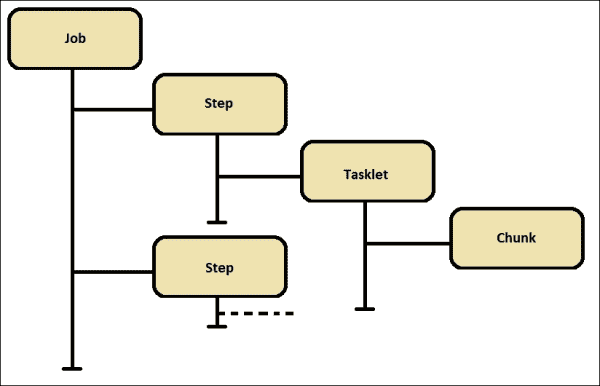
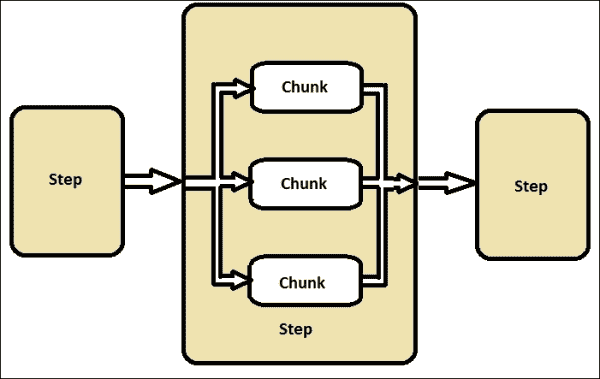
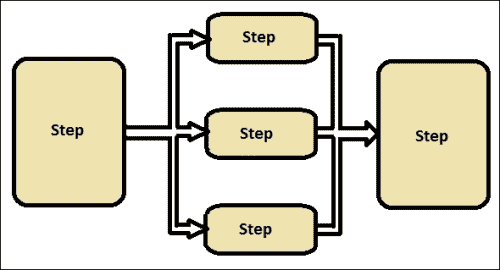
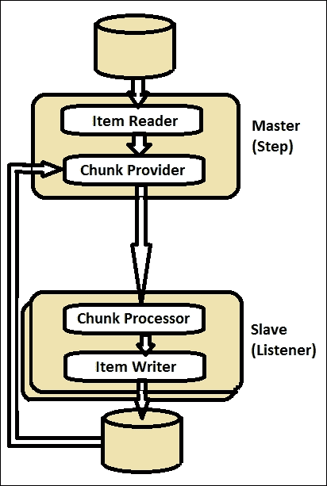
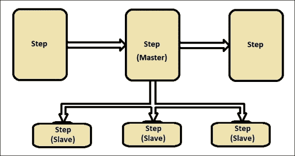
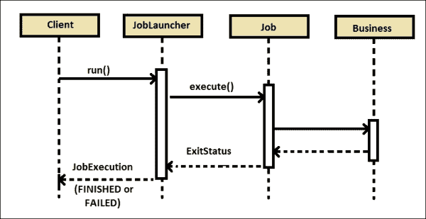
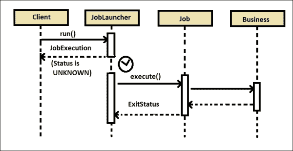

# 二、SpringBatch 作业入门

在前一章中，我们学习了批处理应用，Spring Batch 的产品和架构，以及如何构建一个 SpringBatch 应用来运行批处理作业。理解框架及其组件的细节，以便能够根据业务需求有效地配置它们，这一点很重要。基于 XML 和基于注释的配置使得 Spring Batch 的编程更加高效和灵活。

一些应用希望配置能够灵活地适应它们所遵循的编程风格。不同的程序需要能够以不同的方式触发批处理作业，包括命令行和调度程序，或者程序本身的一部分。如果需要，优雅地停止执行批处理作业也很重要。

在本章中，我们将讨论以下主题:

*   SpringBatch XML 特性
*   配置作业、事务和存储库
*   EL 和听众
*   从命令行和 web 应用执行作业
*   调度程序

# Spring 批量 XML 特性

Spring Batch XML 配置是 Spring Batch 编程最重要的方面。Spring Batch 有独特的 XML 术语和名称空间。理解这些术语并使用正确的实体集有助于构建高效的批处理应用。

## SpringBatch XML 命名空间

Spring Batch 有专门的 XML 名称空间支持来提供舒适的配置。Spring XML 应用上下文文件需要具有以下声明来激活名称空间:

```java
<beans xmlns:batch="http://www.springframework.org/schema/batch"
xmlns:beans="http://www.springframework.org/schema/beans"
xmlns:xsi="http://www.w3.org/2001/XMLSchema-instance" 
xsi:schemaLocation="http://www.springframework.org/schema/beans 
http://www.springframework.org/schema/beans/spring-beans-3.0.xsd 
http://www.springframework.org/schema/batch 
http://www.springframework.org/schema/batch/spring-batch-3.0.xsd">

<batch:job id="readDetailsJob"> 
... 
</batch:job>

</beans>
```

名称空间配置提供了可用于配置上下文文件中的详细信息的前缀。在前面的示例中，我们使用`batch`作为前缀来配置作业。前缀仅是本文档特有的标识符。可以使用任何有效的名称作为名称空间配置的前缀。如果任何名称空间被配置为不带前缀，它将被视为默认名称空间，并且应该配置不带前缀的元素，以便使用默认前缀进行配置。在前一章中，我们将`batch`配置为默认前缀，因此，我们直接配置了作业和步骤。

## SpringBatch XML 标签

Spring Batch XML 配置定义了批处理作业的流程。以下是重要的 SpringBatch 标签及其描述:

*   `job`:定义一个作业，由一组步骤和步骤间的转换组成。作业将在封装 bean 工厂中作为类型为`Job`的组件公开，该组件可以使用`JobLauncher`启动。
*   `step`:定义作业处理中的一个阶段，由一个步骤支持。
*   `tasklet`:这个声明了微线程策略(分步处理的策略)的实现。这可以通过配置块或者配置对`Tasklet`接口的引用来完成。
*   `chunk`:这个声明拥有步骤将执行面向块的处理(一次读取一个数据并创建要写入的组)，委托定义块的内容，并配置面向块的组件。
*   `job-repository`:这个使用一个关系数据存储来配置`JobRepository`(负责批处理元数据实体的持久性的存储库)。其他组件需要它，比如`job`和`step`实现。
*   `flow`:这定义了一个由一组步骤和步骤间转换组成的流程。

# 配置作业、事务和存储库

正如前面提到的，我们可以通过 XML 配置本身方便地配置 SpringBatch 作业。**工单**是主要元素，下图显示了配置中组件的层次结构:



每个作业可以包含多个步骤，每个步骤包含小任务，每个小任务包含块。每个组件都有单独的元素，这些元素被定义为另一个组件的子元素。下面的是一个这样的批处理作业的语法:

```java
<beans xmlns:batch ... >
<batch:job id="jobId">
  <batch:step id="stepId">
    <batch:tasklet ref="beanReference">
      <batch:chunk reader="dataReader" 
        processor="dataProcessor" 
        writer="dataWriter" commit-interval="500" />
    </batch:tasklet>
  </batch:step>
  <batch:step>
  ...
  </batch:step>
</batch:job>
</beans>
```

## 工作配置

作业是批处理应用配置中的根元素。作业使用作业存储库的配置和属性(如是否可重新启动)来定义要执行的批处理作业。以下是`job`元素的属性:

*   `id`:这是`job`元素的唯一的标识符。
*   `abstract`:这是，用于配置作业是否是抽象的，也就是说，它并不意味着自己被实例化，而是仅仅作为具体子作业定义的父作业。默认是`false`。
*   `increment`:这是对`JobParametersIncrementer` bean 定义的引用。这将用于通过改变先前的参数集来提供一组新的参数，以便作为`next`实例重新运行。
*   `job-repository`:这是将要使用的`JobRepository`的 bean 名称。这个属性不是强制的，它默认为`jobRepository` bean。
*   `parent`:这是作业应该继承的父作业的名称。
*   `restartable`:定义作业在失败的情况下是否应该重新开始。如果不应该重新启动作业，则将此项设置为`false`。默认情况下是`true`。

类型为`DefaultJobParametersValidator`的验证器可被配置为作业配置的一部分，以验证简单和可选的参数。以下是这种配置的一个片段:

```java
<beans xmlns:batch ... >
<batch:job id="jobId">
  <batch:step id="stepId">
    ...
  </batch:step>
  <batch:validator ref="validatorId"/>
</batch:job>

<bean id="validatorId" class="beans.JobParametersValidator">
  <property name="Keys">
    <set>
      <value>keyValues</value>
    </set>
  </property>
</bean>
</beans>
```

对于复杂的约束， `validator`接口也可以实现。

## 步进配置

步骤是任务的第一个子元素。一个作业可以包含多个步骤。以下是可以配置多个步骤的不同方法:

*   **Multithreaded step (single process):** Spring Batch allows you to execute chunks of work in parallel as a part of a single process. Each chunk processes a set of records when there is a large amount of data to process in threads.

    开始并行处理的最简单的方式是将`taskExecutor`作为微线程的属性添加到您的步骤配置中。

    ```java
    <step id="loading">
      <tasklet task-executor="taskExecutor">...</tasklet>
    </step>
    ```

*   **Parallel step (single process)**: This is the mechanism of processing multiple steps in a single process.

    以下是配置并行步骤的代码片段:

    ```java
    <job id="jobId">
      <split id="splitId" task-executor="taskExecutor"
        next="step3">
        <flow>
          <step id="step1" next="step2"/>
          <step id="step2"/>
        </flow>
      </split>
      <step id="step3"/>
    </job>
    <beans:bean id="taskExecutor" class="TaskExecutor"/>
    ```

*   **步骤(多进程)**的远程分块:这将步骤处理分割到多个进程中，通过中间件相互通信。Spring Batch 的一个步骤作为主设备，相应中间件的监听器作为从设备。主组件作为单个进程运行，而从组件是多个远程进程。
*   **划分一个步骤(单进程或多进程)**:划分是中的进程，其中一个步骤配置有子步骤。超级步骤是主步骤，子步骤是从步骤。从属步骤必须完成执行才能认为主步骤已经完成。

以下是 step 元素的属性:

*   `id`:这是`step`元素的唯一标识符
*   `next`:这是一个快捷键，用于指定当前步骤之后要执行的下一步
*   `parent`:这个是作业应该继承的父步骤的名称
*   `allow-start-if-complete`:设置为`true`，即使已经完成，也允许开始一个步骤

以下是步骤配置示例:

```java
<step id="firstBatchStepOne"> 
  <tasklet ref="firstBatch"/> 
</step> 
<job id="firstBatchJob"> 
  <step id="stepOne" parent="firstBatchStepOne"/> 
</job>
<bean id="firstBatch" class="FirstBatch"/>
```

## 小任务配置

Tasklet 是 step 元素的子元素，可用于指定作为步骤一部分的可重复和事务性的步骤流程。

以下是`tasklet`元素的属性:

*   `ref`:这是对实现`Tasklet`接口的 bean 定义的引用。
*   `allow-start-if-complete`:设置为`true`以允许一个步骤开始，即使该步骤已经完成。
*   `method`:这是微线程执行的方法规范。
*   `start-limit`:这是一个步骤可以开始的最大次数。
*   `task-executor`:任务执行者负责任务的执行。
*   `throttle-limit`:这是为防止线程池过载，可以排队进行并发处理的最大任务数。默认值为`4`。
*   `transaction-manager`:这是将要使用的事务管理器的 bean 名称。如果没有指定，默认为`transactionManager`。

以下是使用 tasklet 的作业配置示例:

```java
<step id="firstBatchStepOne"> 
  <tasklet ref="firstBatch" start-limit="6">
  ...
  </tasklet> 
</step> 
<job id="firstBatchJob"> 
  <step id="stepOne" parent="firstBatchStepOne"/> 
</job>
<bean id="firstBatch" class="FirstBatch"/>
```

## 组块配置

Chunk 是 tasklet 的子元素，可以用来执行读写处理。与其他元素的配置相比，块配置涉及更多的数据 beans。

以下是 chunk 元素的属性:

*   `reader`:这是项目阅读器的 bean 名称，将用于流程并实现`ItemReader`接口。
*   `processor`:这是项目处理器的 bean 名称，将用于流程并实现`ItemProcessor`接口。
*   `writer`:这是项目写入器的 bean 名称，将用于流程并实现`ItemWriter`接口。
*   `cache-capacity`:这个是重试策略中缓存的容量。
*   `chunk-completion-policy`:当该策略决定完成时，事务将被提交。默认为`SimpleCompletionPolicy`，块大小等于`commit-interval`属性。
*   `commit-interval`:该交易调用`commit`之前需要处理的笔数。设置此属性或`chunk-completion-policy`属性，但不能同时设置两者。
*   `processor-transactional`:这决定了处理器是否知道事务。
*   `reader-transactional-queue`:决定阅读器是否为事务性队列。
*   `retry-limit`:这是一个项目的处理将重试的最大次数。
*   `retry-policy`:这个是重试策略的 bean 规范。如果指定，则忽略`retry-limit`和`retryable`异常。
*   `skip-limit`:这是允许跳过的项目的最大数量。
*   `skip-policy`:这是跳过策略的 bean 规范。如果指定，则忽略`skip-limit`和`skippable`异常。

以下是带有小任务块的示例作业配置:

```java
<step id="firstBatchStepOne"> 
  <tasklet ref="firstBatch">
    <chunk reader="itemReader" processor="itemProcessor" writer="itermWriter" commit-interval="150"/>
  </tasklet> 
</step> 
<job id="firstBatchJob"> 
  <step id="stepOne" parent="firstBatchStepOne"/> 
</job>
<bean id="firstBatch" class="FirstBatch"/>
<bean id="itemReader" class="ItemReader"/>
<bean id="itemProcessor" class="ItemProcessor"/>
<bean id="itemWriter" class="ItemProcessor"/>
```

块配置可以添加异常跳过和重试元素作为其子组件。跳过和重试配置的`skippable-exception-classes`和`retryable-exception-classes`元素。bean 配置也可以被注释以保持 SpringBatch 配置更简单。

## 交易配置

交易配置是 Spring Batch 的关键环节之一。Spring 事务管理器是事务的配置。Spring 为不同的规范提供了不同的事务管理器；对 JDBC 来说是`DataSourceTransactionManager`，对 JPA 来说是`JpaTransactionManager`。

Spring Batch 允许我们将`transaction-attributes`元素配置为 chunk 的子元素，以设置事务的隔离和传播级别。

可以选择不需要执行回滚操作的异常。这些异常可以使用`include`元素作为`no-rollback-exception-classes`元素的子元素来配置，T1 元素是小任务的子元素。

以下是使用事务管理器的作业配置示例:

```java
<step id="firstBatchStepOne"> 
  <tasklet ref="firstBatch" transaction-manager="transactionManager">
  ...
  </tasklet> 
</step> 
<job id="firstBatchJob"> 
  <step id="stepOne" parent="firstBatchStepOne"/> 
</job>
<bean id="firstBatch" class="FirstBatch"/>
<bean id="transactionManager" class="org.springframework.jdbc.datasource.DataSourceTransactionManager">
  <property name="dataSource" ref="DataSource"/>
</bean>
```

## 作业储存库配置

作业存储库维护与作业执行相关的信息。它还维护批处理作业的状态。Spring Batch 提供了两种类型的作业存储库:内存存储库和持久存储库。

**内存存储库**让作业针对相同的作业配置和参数再次运行多次。内存中的存储库是不稳定的，因此它不允许在 JVM 实例之间重启。它也不能保证具有相同参数的任何两个作业实例将同时启动，因此，它不适合多线程作业或本地分区的步骤。可以使用`MapJobRepositoryFactoryBean`进行配置。

它需要事务管理器来处理存储库中的回滚语义，并处理事务数据库中定义的业务逻辑。

以下是一个内存存储库配置示例:

```java
<bean id="jobRepository" class="org.springframework.batch.core.repository.support.MapJobRepositoryFactoryBean">
  <property name="transactionManager-ref" 
    ref="transactionManager"/>
</bean>
<bean id="transactionManager"
class="org.springframework.batch.support.transaction.ResourcelessTransactionManager"/>
<job id="deductionsJob" job-repository="jobRepository">
...
</job>
```

**持久化** **存储库**可以使用`job-repository` 元素进行配置，以在数据库上执行持久化数据库操作。数据源可以使用任何 API 进行配置，例如，我们在下面的配置中使用了 Apache commons `BasicDataSource`。

以下是一个永久存储库配置示例:

```java
<bean id="dataSource" class="org.apache.commons.dbcp.BasicDataSource"> 
  <property name="driverClassName" value="${batch.jdbc.driver}" /> 
  <property name="url" value="${batch.jdbc.url}" /> 
  <property name="username" value="${batch.jdbc.user}" /> 
  <property name="password" value="${batch.jdbc.password}" /> 
</bean> 
<bean id="transactionManager" class="org.springframework.jdbc.datasource.DataSourceTransactionManager" lazy-init="true"> 
  <property name="dataSource" ref="dataSource" /> 
</bean> 
<job-repository id="jobRepository" data-source="dataSource" 
transaction-manager="transactionManager"/>
```

# 埃尔和听众

春批从版本 3 开始提供了一个有趣的功能:**表情语言** ( **EL** )。**Spring Expression Language**(**SpEL**)让我们可以通过在运行时从执行上下文中捕获值来使 XML 配置动态化。SpEL 可以从属性和 bean 中解析表达式。这种运行时捕获行为还允许作业访问后期绑定配置。

以下是一个 SpEL 配置示例:

```java
<bean id="processBean" class="JobProcessBean" scope="step"> 
  <property name="name" value="#{jobParameters[name]}"/> 
</bean>
```

## 听众

Spring Batch 可以配置为在监听器的帮助下识别一组附加事件。侦听器可以以不同的组合来标识不同级别的事件。下面是 Spring Batch 为批处理提供的各种监听器类型。

*   作业监听器:它们标识作业级事件
*   步骤监听器:它们标识步骤级事件
*   项目监听器:它们识别项目重复和重试事件

## 工作监听器

作业监听器识别发生在作业级别的事件。可以通过以下方式配置作业侦听器:

*   **Implementing JobExecutionListener**: The following is the sample listener configuration using `JobExecutionListener` implementation:

    ```java
    import org.springframework.batch.core.JobExecution; 
    import org.springframework.batch.core.JobExecutionListener; 
    public class JobStatusListener implements JobExecutionListener {
    public void beforeJob(JobExecution jobExecution) { 
      System.out.println("Job: " + 
      jobExecution.getJobInstance().getJobName() + " is beginning"); 
    } 
    public void afterJob(JobExecution jobExecution) { 
      System.out.println("Job: " + jobExecution.getJobInstance(). 
      getJobName() + " has completed");
      System.out.println("The Job Execution status is: " + 
      jobExecution.getStatus()); 
    }
    }
    ```

    前面定义的监听器的 XML 配置如下:

    ```java
    <job id="employeeDeductionsJob">
      <listeners>
        <listener ref="jobStatusListener"/>
      </listeners>
    </job>
    ```

*   **使用注释**:下面的是使用注释的监听器配置示例:

    ```java
    import org.springframework.batch.core.JobExecution; 
    import org.springframework.batch.core.JobExecutionListener;
    import org.springframework.batch.core.annotation.AfterJob;
    import org.springframework.batch.core.annotation.BeforeJob; 
    public class JobStatusListener { 
    @BeforeJob 
    public void beforeJob(JobExecution jobExecution) { 
      System.out.println("Job: " + 
      jobExecution.getJobInstance().getJobName() + " is 
      beginning");
    } 
    @AfterJob 
    public void afterJob(JobExecution jobExecution) { 
      System.out.println("Job: " + jobExecution.getJobInstance().getJobName() + " has completed");
      System.out.println("The Job Execution status is: " + 
      jobExecution.getStatus());  
    }
    }
    ```

配置注释监听器的方法与`JobExecutionListener`配置相同。

## 步骤监听器

就像作业监听器捕获作业的执行状态一样，步骤有特定的监听器来捕获不同的事件。实现这组侦听器的方式与作业侦听器相同(通过实现相应的接口或使用注释)，只是侦听器元素必须配置为`step`元素的子元素。

以下是包含要重写的方法的步骤侦听器列表:

*   `StepExecutionListener`:标识分别使用`beforeStep` 和`afterStep`方法的步骤执行事件的前后
*   `ChunkListener`:这个分别使用`beforeChunk`和`afterChunk` 方法标识块执行事件的前后
*   `ItemReadListener`:该标识是否读取前后项，当异常发生时，分别使用 `beforeRead`、`afterRead`和`onReadError`方法读取一个项事件
*   `ItemProcessListener`:标识`ItemProcessor` 获取项目前后的状态，以及处理器分别使用`beforeProcess`、`afterProcess`和`onProcessError`方法抛出异常时的状态
*   `ItemWriteListener`:标识了一个项目被写的前后和异常发生的前后，分别使用`beforeWrite`、`afterWrite`和`onWriteError`方法写一个项目事件
*   `SkipListener`:标识分别使用`onSkipInRead`、`onSkipInProcess`和、`onSkipInWrite`方法读取、处理或写入项的跳过事件

## 项目监听器

项目监听器识别重试和重复事件。这些监听器可以按照与作业或步骤监听器相同的方式进行配置。

下面是具有要重写的方法的项侦听器:

*   `RepeatListener`:该分别使用`before`和`after`方法识别每个重复事件的前后。它分别使用`open`和`close`方法识别第一个和最后一个重复事件。它还使用`onError`方法识别每个故障事件。
*   `RetryListener`:分别使用 `open`和`close`方法，标识第一次和最后一次尝试事件，不管重试是成功还是失败。它还使用`onError`方法识别每个故障事件。

# 从命令行和 web 应用执行作业

在第一章中，我们学习了如何使用 Spring Batch 配置和运行一个简单的批处理作业应用，方法是从 Java 程序启动作业。Spring Batch 基于 Java 的 API 通过调用批处理作业的不同方式使得作业启动非常方便。在本节中，让我们研究以不同方式启动批处理作业和优雅地停止批处理作业的概念。

## 作业启动程序

Spring Batch 使在`JobLauncher`的帮助下更容易启动批处理作业。`JobLauncher`表示一个简单的界面，使用一组给定的作业参数启动作业。`JobLauncher`的 run 方法以 Spring beans 类型的`Job`和`JobParameters`为参数，调用批处理作业执行。

以下是我们在上一章中使用`JobLauncher`启动作业的代码片段:

```java
String[] springConfig  = {"batch/firstBatch.xml"};
context = new ClassPathXmlApplicationContext(springConfig);
JobLauncher jobLauncher = (JobLauncher) context.getBean("jobLauncher");
Job job = (Job) context.getBean("firstBatchJob");
JobExecution execution = jobLauncher.run(job, new JobParameters());
System.out.println("Exit Status : " + execution.getStatus());
```

我们可以使用`JobParametersBuilder`来构建不同类型的`JobParameter`。使用以下语法，可以使用持久作业存储库配置`JobLauncher`:

```java
<bean id="jobLauncher"
class="org.springframework.batch.core.launch.support.SimpleJobLauncher">
  <property name="jobRepository" ref="jobRepository"/>
</bean>
```



从`JobLauncher`的`run`方法发起一个作业，在`job`调用`execute`，并在执行后确认作业执行状态(`FINISHED`或`FAILED`)，这是一个同步过程。

然而，在某些业务场景中，我们希望`JobLauncher`调用流程并将其移交给另一个控制器，使其异步，这样就可以触发多个流程。如果与`JobLauncher`一起配置，那么`TaskExecutor`在这种情况下会有所帮助。



下面是用`taskExecutor`配置`SimpleJobLauncher`以使进程异步的语法:

```java
<bean id="jobLauncher"
class="org.springframework.batch.core.launch.support.SimpleJobLauncher">
<property name="jobRepository" ref="jobRepository"/>
<property name="taskExecutor">
<bean class="org.springframework.core.task.SimpleAsyncTaskExecutor"/>
</property>
</bean>
```

## 从命令行启动作业

一个 `CommandLineJobRunner`使得从命令行启动一个 SpringBatch 作业变得简单。以下是`CommandLineJobRunner`工作的步骤:

*   加载适当的`ApplicationContext`
*   将命令行参数解析成`JobParameters`
*   基于参数定位合适的作业
*   使用应用上下文中提供的`JobLauncher`来启动作业

以下是使用`CommandLineJobRunner`启动作业的命令:

```java
> java -classpath "/lib/*" org.springframework.batch.core.launch.support.CommandLineJobRunner firstBatch.xml firstBatchJob schedule.date(date)=2007/05/05

```

作业执行的退出代码代表批处理作业运行后的状态，其中`0`代表`COMPLETED` , `1`代表`FAILED`,`2`代表命令行作业运行程序出错，比如在提供的上下文中找不到作业。

## 从 web 应用中启动作业

到目前为止，我们已经学习了如何从 Java 程序和命令行启动批处理作业。有些情况下，作业需要从 web 应用中启动。从应用内部生成报告并通过基于线程的配置从应用触发异步流程的应用就是这样的业务场景。

以下是使用 Spring MVC 框架和 Spring 依赖项启动作业的程序:

```java
@Controller
public class JobLauncherController {
@Autowired
JobLauncher jobLauncher;
@Autowired
Job job;
@RequestMapping("/jobLauncher.html")
public void handle() throws Exception {
  jobLauncher.run(job, new JobParameters());
}
}
```

控制器使用通过配置在`JobLauncherController`中自动连线的`JobController`启动作业。控制器可以从一个带有用`handle`方法配置的`RequestMapping`的请求 URL 中调用。

## 正常停止批处理作业

必要时，借助于`JobOperator`接口，可以从程序内部优雅地停止作业。`JobOperator`提供作业的 CRUD 操作。

以下是使用`JobOperator`停止作业的语法:

```java
Set<Long> executions =jobOperator.getRunningExecutions("jobName");
If( executions.iterator().hasNext()) {
jobOperator.stop(executions.iterator().next());
}
```

`JobOperator`用给定的`jobName`标识正在运行的作业，并通过从执行中获取作业`id`来调用`stop`方法。

需要将`JobOperator`配置为可用于程序。下面是带有资源、作业浏览器(浏览正在运行的执行或历史作业和步骤的入口点)、注册表和存储库属性的`jobOperator`的示例配置。

```java
<bean id="jobOperator" class="org.springframework.batch.core.launch.support. SimpleJobOperator">
<property name="jobExplorer">
<bean class=" org.springframework.batch.core.explore.support. JobExplorerFactoryBean">
<property name="dataSource" ref="dataSource"/>
</bean>
</property>
<property name="jobRepository" ref="jobRepository"/>
<property name="jobRegistry" ref="jobRegistry"/>
<property name="jobLauncher" ref="jobLauncher"/>
</bean>
```

作业配置支持在小任务和面向块的步骤级别的停止设置。

# 调度程序

调度程序是可以定期启动其他程序的程序。如前所述，Spring Batch 不是一个调度框架。Spring Batch 可以与一个调度器(比如 Quartz/Control-M)协同工作，但是不能代替一个调度器。

以下是常用的调度程序:

*   **Cron** :这是一个基于表达式的作业调度器，可以在类 Unix 系统上启动其他程序
*   **Control-M** :这是一个批处理调度软件，可用于分布式计算平台，包括 Unix、Windows、Linux 和 OpenVMS 环境
*   **Spring 调度器**:这个来自 Spring 的调度器支持 XML、基于注释或 cron 表达式来启动批处理作业
*   **Quartz** : Quartz 是一个功能丰富的开源作业调度库，可以集成到几乎任何 Java 应用中

Cron 和 Control-M 可以使用`CommandLineJobRunner`启动批处理作业，而 Quartz 和 Spring scheduler 可以从应用内部以编程方式启动批处理作业。人们可以根据作业执行的频率和调用作业的方式来选择这些选项。

# 总结

在本章中，我们学习了 SpringBatch 作业及其组件的配置细节，以便能够根据业务需求有效地使用它们。我们学习了如何使用基于 XML 和基于注释的配置来提高批处理编程的效率和灵活性。我们还学习了启动批处理作业的不同方法，例如从命令行、Java 程序和在 web 应用中启动，以及如何在程序中优雅地停止批处理作业。我们在了解了市场上可用的不同作业调度程序以及哪些启动解决方案可以与这些调度程序结合使用后，完成了本章的学习。

在下一章，我们将详细学习使用 Spring Batch 读取、处理和写入不同形式的数据。